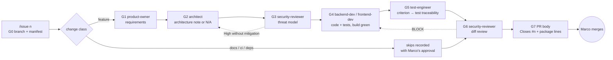

# How Decisya uses Claude Code: agents, skills, gates

This guide explains how the Claude Code setup in this repository fits together, what each piece does, and how to start work with it. For the review behind the design, see [agents-review.md](agents-review.md). For the short command reference, see [../runbooks/issue-pipeline.md](../runbooks/issue-pipeline.md).

## 1. The idea in one paragraph

Every change starts from a GitHub issue. You type `/issue <n>`, and the main Claude session acts as the **orchestrator**: it creates the branch `issue/<n>-<slug>`, keeps a checklist file (the **manifest**) at `docs/ai/pipeline/<n>.md`, and hands each step (**gate**) to the right **agent**. Each agent follows a **skill** (a written procedure), writes one file, and ends that file with a **verdict line**. A script, `gates.py`, reads those verdict lines and decides whether each gate passed. **Hooks** keep agents inside their folders and away from secrets. **CI** runs a lint on the Claude config and re-checks the gates on the PR. You review and merge.

## 2. The pieces and where they live

```
CLAUDE.md                          project rules; every session and every agent reads it
.claude/
  settings.json                    permissions (allow/deny) and hook registration, shared via git
  settings.local.json              your personal overrides (git-ignored)
  boundaries.json                  which folders each agent may write
  agents/<name>.md                 9 agents: role, tools, model, output
  skills/<name>/SKILL.md           13 skills: step-by-step procedures (+ references/, assets/, scripts/)
  hooks/agent_boundaries.py        blocks an agent's Write/Edit outside its folders
  hooks/secret_guard.py            blocks shell commands that would read .env files or user-secrets
  scripts/gates.py                 gate checker, manifest creation, change classification
  scripts/prereqs.py               "does the platform piece this skill needs exist yet?"
  scripts/lint.py                  checks the whole .claude/ config (pre-commit + CI)
docs/ai/pipeline/<n>.md            one manifest per GitHub issue (the pipeline's state)
docs/requirements/…                G1 and G5 artifacts
docs/architecture/…                G2 artifacts
docs/security/threat-models/…      G3 artifacts
docs/security/reviews/<n>.md       G6 artifacts
.github/workflows/ci.yml           job "claude-config": lint + gate check on issue/<n>-* PRs
.pre-commit-config.yaml            hook "claude-lint" on every commit that touches .claude/ or CLAUDE.md
```

### How the layers relate

| Layer | Holds | Rule of thumb |
| --- | --- | --- |
| `CLAUDE.md` | Platform invariants, security and observability principles, working agreements, commands, pipeline summary | Anything that is true for **every** session and agent. Agents inherit it automatically, so never copy its rules into an agent file (the lint rejects a "Standing rules" section). |
| Agent | One role: what it owns, what it must not do, where its output goes, its verdict line, its tools and model | Who does the work and with what permissions. |
| Skill | One repeatable procedure: prerequisites, steps (VS 2026 \| CLI), output format, done-when | How the work is done, the same way every time. |
| Manifest | Gate status, artifact paths, skips with reasons and approval | Where a specific issue stands. |
| Scripts and hooks | Machine checks | What is enforced rather than just asked for. |

## 3. The pipeline



### Gates

| Gate | Owner | Writes | Passes when |
| --- | --- | --- | --- |
| G0 | orchestrator (main session) | `docs/ai/pipeline/<n>.md`, branch `issue/<n>-<slug>` | Issue open, branch and manifest exist, change class recorded |
| G1 | product-owner | `docs/requirements/<phase>/<slug>.md` | User stories with Gherkin acceptance criteria, no unanswered questions, verdict line |
| G2 | architect | `docs/architecture/<slug>.md` | Architecture note with verdict PASS, or N/A with a reason when nothing structural changes |
| G3 | security-reviewer | `docs/security/threat-models/<slug>.md` | STRIDE threat model; every High is mitigated or linked to an issue |
| G4 | backend-dev and/or frontend-dev | code and tests; evidence in the manifest | The orchestrator itself re-ran build and tests, both green |
| G5 | test-engineer | "Traceability" section in the G1 file | Every acceptance criterion maps to a test (or is marked manual with a reason) |
| G6 | security-reviewer | `docs/security/reviews/<n>.md` | ASVS 5.0 L2 diff review: PASS or PASS-WITH-NOTES, no Open High |
| G7 | orchestrator | PR body draft in the manifest | Contains `Closes #<n>` and one justification line per new package |

### The verdict line

Each agent artifact contains exactly one line like this for its gate, on its own line and outside code blocks:

```
<!-- gate: G6 | verdict: PASS-WITH-NOTES | issue: #35 -->
```

- `verdict` is `PASS`, `PASS-WITH-NOTES`, `N/A` (only with `| reason: …`) or `BLOCK`. `BLOCK` never passes.
- The issue number must match the manifest. Two lines for the same gate fail as AMBIGUOUS; quoted examples don't count.
- Only the owner agent writes its verdict line. The orchestrator never edits one to make a gate pass.

### Change classes and skips

| Class | Typical changes | Gates that run |
| --- | --- | --- |
| feature | `src/`, `tests/` | all eight |
| docs-only | `docs/`, `*.md`, `.claude/` | G0, G7 |
| ci-tooling | `.github/`, `Directory.Build.props`, `global.json`, `dotnet-tools.json`, pre-commit | G0, G3, G6, G7 |
| dependency | `Directory.Packages.props`, `package.json` only | G0, G6, G7 |

Skipped gates are written as `skipped | reason: … | approved: PENDING`. They count as passed only after you approve and the row says `approved: Marco YYYY-MM-DD`. Any other skip, for example G2 on a feature, needs the same explicit approval.

### Resuming

The manifest is the state. Re-running `/issue <n>` (or `python .claude/scripts/gates.py <n> --next`) continues at the first gate that isn't passed, whether it's the next day or after a crash.

## 4. The agents

| Agent | Model | Gate(s) | May write (hook-enforced) | Skills | Tools beyond Read/Grep/Glob |
| --- | --- | --- | --- | --- | --- |
| product-owner | sonnet | G1 | `docs/requirements/**` | — | Write, Edit |
| architect | opus | G2 | `docs/**`, `src/Modules/*/Decisya.Modules.*.Contracts/**` | architecture-note, adr-writer, api-contract | Write, Edit |
| security-reviewer | opus | G3, G6 | `docs/security/**` | threat-model, asvs-checklist | Write, Edit, git fetch/diff/log/status |
| backend-dev | sonnet | G4 | `src/**`, `tests/**`, `deploy/**`, `Directory.Packages.props` | module-scaffold, ef-migration, otel-instrumentation | Write, Edit, `dotnet *`, git status/diff |
| frontend-dev | sonnet | G4 (UI) | `src/Decisya.Web/**`, `tests/e2e/**` | api-contract | Write, Edit, npm ci/run/audit, npx playwright/tsc/eslint |
| test-engineer | sonnet | G5 | `tests/**`, `docs/requirements/**` | traceability, isolation-test | Write, Edit, dotnet build/test, playwright |
| devops | sonnet | CI, deploy, runbooks | `.github/**`, `deploy/**`, `docs/runbooks/**`, AppHost, build props, tool manifests | runbook | Write, Edit, dotnet, aspire, docker compose, gh issue/pr view/run, actionlint, gitleaks, pre-commit |
| compliance-auditor | opus | phase exit | `docs/compliance/**`, `docs/security/samm.md` | phase-exit-audit | Write, Edit |
| tech-writer | sonnet | docs | `docs/**`, `CHANGELOG.md`, `README.md` | runbook | Write, Edit, read-only dotnet/aspire/git/gh commands |

- **Models:** opus for judgment (architecture, security, compliance), sonnet for building and writing.
- **Nobody but the main session** writes `docs/ai/pipeline/**`, `.claude/**` or `CLAUDE.md`.
- **Built-in agents** (Explore, Plan, general-purpose) aren't restricted by `boundaries.json`; they are for research, not for gate work.

## 5. The skills

| Skill | Used by | What it does | Needs first (`prereqs.py`) |
| --- | --- | --- | --- |
| `issue` | you (`/issue <n>`) | Runs the pipeline: branch, manifest, one agent per gate, checks after each | — |
| `architecture-note` | architect | G2 note: C4 excerpt, boundaries, ADR links, NetArchTest rules, or the N/A form | — |
| `adr-writer` | architect | New ADR in MADR format, numbered, added to the index | — |
| `api-contract` | architect, frontend-dev | OpenAPI 3.1 first, then endpoints, contract test, generated TypeScript client | `Decisya.Api` (#20), SPA (#26), ContractTests |
| `threat-model` | security-reviewer | STRIDE, trust boundaries in Mermaid, ASVS 5.0 mapping, verdict | — |
| `asvs-checklist` | security-reviewer | ASVS 5.0 L2 review of `origin/main...HEAD` plus uncommitted files, verdict | — |
| `module-scaffold` | backend-dev | New module: phase 1 (projects, registration, boundary tests) works today; phase 2 (DbContext, isolation) needs the tenancy pieces | phase 2: `TenantId` (#32), `TenantDbContext`, `PostgresFixture`, `ArchitectureTests` (#22) |
| `ef-migration` | backend-dev | Migration per module schema, idempotent SQL script, rollback note | `Decisya.Api` (#20), `TenantDbContext` (#22) |
| `otel-instrumentation` | backend-dev | ActivitySource/Meter, span and metric naming, `[Sensitive]` masking test | `[Sensitive]` and masking processor (#15) |
| `isolation-test` | test-engineer | Two-tenant read and update/delete tests | tenancy pieces (#32, #22) |
| `traceability` | test-engineer | Acceptance criterion → test table, G5 verdict | — |
| `runbook` | devops, tech-writer | VS 2026 \| CLI table format, every command verified or marked unverified | — |
| `phase-exit-audit` | compliance-auditor | Standards register → `phase-<p>-exit.md` with evidence and GO/NO-GO | — |

A skill whose prerequisites are missing **stops and names the issue** that will provide them, instead of improvising around the gap. Check any time:

| Visual Studio 2026 | CLI |
| --- | --- |
| *View → Terminal*: `python .claude/scripts/prereqs.py module-scaffold --phase tenancy` | `python .claude/scripts/prereqs.py module-scaffold --phase tenancy` |

## 6. Guardrails and their limits

| Guardrail | What it does | Limit |
| --- | --- | --- |
| `agent_boundaries.py` | Refuses an agent's Write/Edit outside its folders in `boundaries.json` | Doesn't see shell commands; an agent with Bash could still write files (threat model T-01). |
| `secret_guard.py` | Refuses shell commands that read `.env` files, user-secrets or `dotnet user-secrets list`, including common disguises | Pattern-based; a command can build the name at run time (T-04). |
| `settings.json` deny rules | No `git push`, no `rm -rf`, no reading `.env` or user-secrets with the Read tool | Deny rules on Read don't cover shell commands (hence the hook). |
| `lint.py` | Rejects broken frontmatter, outdated commands, dangling references, agents that update files without Edit | Checks config, not behaviour. |
| `gates.py` + CI job | A PR from `issue/<n>-*` fails unless every gate passed or was approved as skipped | Approvals are text you confirm (follow-up: tie them to your GitHub identity). |

These are **guardrails, not a security boundary**, and CLAUDE.md says so. The follow-up to make them a boundary is running agents in the Claude Code sandbox (WSL2 or a devcontainer), tracked from the #35 security review.

## 7. Changing the setup

| Change | Do this |
| --- | --- |
| New agent | `.claude/agents/<name>.md` with quoted `description`, `tools`, `model`; an "Output (gate Gx)" section with the path and verdict line; add its folders to `boundaries.json`. |
| New skill | `.claude/skills/<name>/SKILL.md` (folder name = `name`), sections *Prerequisites · Steps (VS 2026 \| CLI) · Output · Done when*; add checks to `prereqs.py` if it needs platform pieces. |
| Any `.claude/` edit | Run the lint before committing (it also runs as a pre-commit hook). |

| Visual Studio 2026 | CLI |
| --- | --- |
| *View → Terminal*: `python .claude/scripts/lint.py` | `python .claude/scripts/lint.py` |

Invariants in `CLAUDE.md` change only through an ADR (`adr-writer`), never by editing an agent or skill.

## 8. Starting an interaction: examples

### 8.1 Work on a Phase 0 issue (the normal case)

| Visual Studio 2026 | CLI |
| --- | --- |
| Open the Claude panel in the repository and send the message below | In the repository root run `claude`, then send the message below |

```text
/issue 32
```

What happens next:

1. Claude reads issue #32 (`gh issue view 32`), says "Working on #32 (0.04b SharedKernel: TenantId and result types)", creates `issue/32-sharedkernel-tenantid-result-types` from `origin/main` and the manifest with class `feature`.
2. It runs G1 (product-owner) and shows you the stories and any open questions. **Answer the questions**; the gate won't pass while any is open.
3. G2 (architect): for #32 probably a short note, or N/A with a reason such as "value types in SharedKernel; ADR-0001 applies".
4. G3 threat model, then G4 implementation. Claude re-runs build and tests itself and records the result.
5. G5 traceability, then G6 security review. On BLOCK it sends the findings back to backend-dev and re-reviews.
6. G7: Claude shows the PR body and the commit/push/PR commands. It never pushes.
7. You run the commands, CI's `claude-config` job re-checks the gates, you review and merge.

### 8.2 Continue tomorrow

```text
/issue 32
```

Same command. Claude reads `docs/ai/pipeline/32.md` and continues at the first open gate. To see the state without Claude:

| Visual Studio 2026 | CLI |
| --- | --- |
| *View → Terminal*: `python .claude/scripts/gates.py 32` | `python .claude/scripts/gates.py 32` |

### 8.3 A small docs or CI change

```text
/issue 28
```

For a CI/tooling issue, Claude proposes skipping G1, G2, G4 and G5 and asks for approval:

```text
Approve the skips for #28.
```

Then only the security gates and the PR body run.

### 8.4 A request that has no issue yet

```text
The Aspire dashboard shows no health traces. Can you look into it?
```

Claude checks the open issues, finds #15 (0.03 AppHost + ServiceDefaults), and asks whether this belongs there. If nothing matches, it asks whether to create an issue. It doesn't start changing code without one (CLAUDE.md working agreement). Questions that don't change files ("explain", "where is", "why does") need no issue.

### 8.5 Ask one agent directly, outside the pipeline

```text
Use the security-reviewer agent to review the threat model in docs/security/threat-models/claude-config.md against the current code. Report only; don't write files.
```

Useful for second opinions. It doesn't move any gate; only `/issue` does.

### 8.6 Phase exit

```text
Use the compliance-auditor agent to run the phase-exit-audit skill for Phase 0.
```

It checks the standards register, runs `gates.py` for every milestone issue, and writes `docs/compliance/phase-0-exit.md` with GO or NO-GO.

### 8.7 Good habits in the first message

- **Name the issue number** (`/issue 32`), or say that you want one created.
- **Say what's decided.** For example: "excess precision must throw; use the full ISO 4217 table". Agents then don't ask again.
- **Say what's out of scope.** For example: "no EF Core mapping in this issue".
- **Say how you want to review.** For example: "stop after G1 so I can review the stories".
