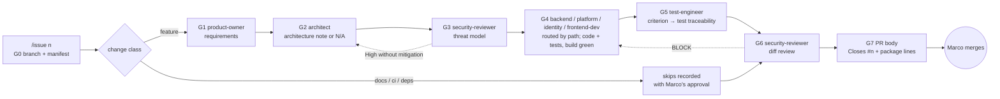
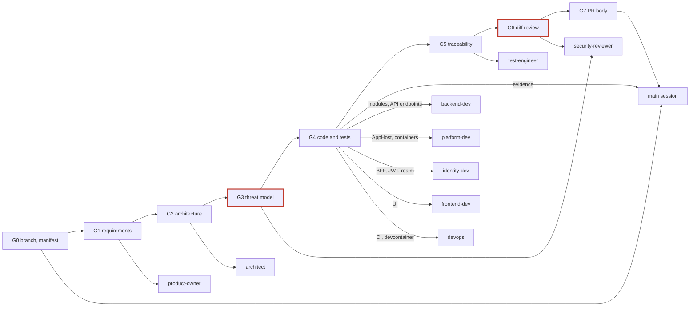
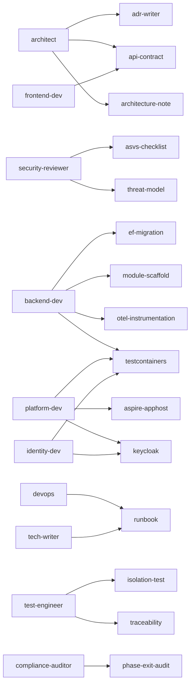

# How Decisya uses Claude Code: agents, skills, gates

This guide explains how the Claude Code setup in this repository fits together, what each piece does, and how to start work with it. For the review behind the design, see [agents-review.md](agents-review.md). For the short command reference, see [../runbooks/issue-pipeline.md](../runbooks/issue-pipeline.md).

## 1. The idea in one paragraph

Every change starts from a GitHub issue. You type `/issue <n>`, and the main Claude session acts as the **orchestrator**: it creates the branch `issue/<n>-<slug>`, keeps a checklist file (the **manifest**) at `docs/ai/pipeline/<n>.md`, and hands each step (**gate**) to the right **agent**. Each agent follows a **skill** (a written procedure), writes one file, and ends that file with a **verdict line**. A script, `gates.py`, reads those verdict lines and decides whether each gate passed. **Hooks** keep agents inside their folders and away from secrets. **CI** runs a lint on the Claude config and re-checks the gates on the PR. You review and merge.

## 2. The pieces and where they live

```
CLAUDE.md                          project rules; every session and every agent reads it
.claude/
  settings.json                    permissions (allow/deny) and hook registration, shared via git
  settings.local.json              your personal overrides (git-ignored)
  boundaries.json                  which folders each agent may write, its Docker allow-list, G4 routing
  agents/<name>.md                 one file per agent: role, tools, model, output (roster in §4)
  skills/<name>/SKILL.md           procedures and platform knowledge (+ references/, assets/, scripts/)
  hooks/agent_boundaries.py        blocks an agent's Write/Edit outside its folders, package/gh commands and Docker outside its allow-list
  hooks/secret_guard.py            blocks shell commands that would read .env files or user-secrets
  scripts/gates.py                 gate checker, manifest creation, change classification
  scripts/prereqs.py               "does the platform piece this skill needs exist yet?"
  scripts/lint.py                  checks the whole .claude/ config (pre-commit + CI)
  scripts/roster.py                renders §4 and the issue skill's G4 routing table from the config
docs/ai/pipeline/<n>.md            one manifest per GitHub issue (the pipeline's state)
docs/requirements/…                G1 and G5 artifacts
docs/architecture/…                G2 artifacts
docs/security/threat-models/…      G3 artifacts
docs/security/reviews/<n>.md       G6 artifacts
.github/workflows/ci.yml           job "claude-config": lint, roster is current, .claude tests, gate check on issue/<n>-* PRs
.pre-commit-config.yaml            hook "claude-lint" on every commit that touches .claude/ or CLAUDE.md
```

### How the layers relate

| Layer | Holds | Rule of thumb |
| --- | --- | --- |
| `CLAUDE.md` | Platform invariants, security and observability principles, working agreements, commands, pipeline summary | Anything that is true for **every** session and agent. Agents inherit it automatically, so never copy its rules into an agent file (the lint rejects a "Standing rules" section). |
| Agent | One role: what it owns, what it must not do, where its output goes, its verdict line, its tools and model | Who does the work and with what permissions. |
| Skill | One repeatable procedure (prerequisites, steps (VS 2026 \| CLI), output, done-when), or platform knowledge with runnable examples (`keycloak`, `aspire-apphost`, `testcontainers`) | How the work is done, the same way every time. |
| Manifest | Gate status, artifact paths, skips with reasons and approval | Where a specific issue stands. |
| Scripts and hooks | Machine checks | What is enforced rather than just asked for. |

## 3. The pipeline


```mermaid
flowchart LR
  I["/issue n<br/>G0 branch + manifest"] --> C{change class}
  C -->|feature| R[G1 product-owner<br/>requirements]
  C -->|docs / ci / deps| S[skips recorded<br/>with Marco's approval]
  R --> A[G2 architect<br/>architecture note or N/A]
  A --> T[G3 security-reviewer<br/>threat model]
  T --> D[G4 backend / platform / identity / frontend-dev<br/>routed by path; code + tests, build green]
  D --> Q[G5 test-engineer<br/>criterion → test traceability]
  Q --> V[G6 security-reviewer<br/>diff review]
  S --> V
  V --> P[G7 PR body<br/>Closes #n + package lines]
  P --> M((Marco merges))
  V -. BLOCK .-> D
  T -. High without mitigation .-> A
```

### Gates

| Gate | Owner | Writes | Passes when |
| --- | --- | --- | --- |
| G0 | orchestrator (main session) | `docs/ai/pipeline/<n>.md`, branch `issue/<n>-<slug>` | Issue open, branch and manifest exist, change class recorded |
| G1 | product-owner | `docs/requirements/<phase>/<slug>.md` | User stories with Gherkin acceptance criteria, no unanswered questions, verdict line |
| G2 | architect | `docs/architecture/<slug>.md` | Architecture note with verdict PASS, or N/A with a reason when nothing structural changes |
| G3 | security-reviewer | `docs/security/threat-models/<slug>.md` | STRIDE threat model; every High is mitigated or linked to an issue |
| G4 | the implementer for the changed paths (routing in §4) | code and tests; evidence in the manifest | The orchestrator itself re-ran build and tests, both green |
| G5 | test-engineer | "Traceability" section in the G1 file | Every acceptance criterion maps to a test (or is marked manual with a reason) |
| G6 | security-reviewer | `docs/security/reviews/<n>.md` | ASVS 5.0 L2 diff review: PASS or PASS-WITH-NOTES, no Open High |
| G7 | orchestrator | PR body draft in the manifest | Contains `Closes #<n>`, one justification line per new package, and (from #76) a `Docs:` line: the docs updated, or `none: <reason>` |

### The verdict line

Each agent artifact contains exactly one line like this for its gate, on its own line and outside code blocks:

```
<!-- gate: G6 | verdict: PASS-WITH-NOTES | issue: #35 -->
```

- `verdict` is `PASS`, `PASS-WITH-NOTES`, `N/A` (only with `| reason: …`) or `BLOCK`. `BLOCK` never passes.
- The issue number must match the manifest. Two lines for the same gate fail as AMBIGUOUS; quoted examples don't count.
- Only the owner agent writes its verdict line. The orchestrator never edits one to make a gate pass.

### Change classes and skips

| Class | Typical changes | Gates that run |
| --- | --- | --- |
| feature | `src/`, `tests/` | all eight |
| docs-only | `docs/`, `*.md`, `.claude/` | G0, G7 |
| ci-tooling | `.github/`, `Directory.Build.props`, `global.json`, `dotnet-tools.json`, pre-commit | G0, G3, G6, G7 |
| dependency | `Directory.Packages.props`, `package.json` only | G0, G6, G7 |

Skipped gates are written as `skipped | reason: … | approved: PENDING`. They count as passed only after you approve and the row says `approved: Marco YYYY-MM-DD`. Any other skip, for example G2 on a feature, needs the same explicit approval.

### Resuming

The manifest is the state. Re-running `/issue <n>` (or `python .claude/scripts/gates.py <n> --next`) continues at the first gate that isn't passed, whether it's the next day or after a crash.

## 4. Agents and skills

<!-- roster:begin (generated by python .claude/scripts/roster.py; do not edit) -->

11 agents and 16 skills, generated from `.claude/boundaries.json` (lanes, shared deny, Docker allow-list, G4 routing), the agent and skill frontmatter and `gates.py`. Edit those sources, then run `python .claude/scripts/roster.py`; lint and CI fail while this block is stale.

### Gates and owners


```mermaid
flowchart LR
  G0["G0 branch, manifest"] --> G1["G1 requirements"] --> G2["G2 architecture"] --> G3["G3 threat model"] --> G4["G4 code and tests"] --> G5["G5 traceability"] --> G6["G6 diff review"] --> G7["G7 PR body"]
  main_session["main session"]
  G0 --> main_session
  G4 -->|"evidence"| main_session
  G7 --> main_session
  G1 --> product_owner["product-owner"]
  G2 --> architect["architect"]
  G3 --> security_reviewer["security-reviewer"]
  G5 --> test_engineer["test-engineer"]
  G6 --> security_reviewer["security-reviewer"]
  G4 -->|"modules, API endpoints"| backend_dev["backend-dev"]
  G4 -->|"AppHost, containers"| platform_dev["platform-dev"]
  G4 -->|"BFF, JWT, realm"| identity_dev["identity-dev"]
  G4 -->|"UI"| frontend_dev["frontend-dev"]
  G4 -->|"CI, devcontainer"| devops["devops"]
  classDef sec stroke:#c0392b,stroke-width:3px
  class G3,G6 sec
```

G3 and G6 (outlined) are the security gates; a change to agent lanes, tools, hooks, settings, the checkers or the workflows always needs both (`gates.py`).

### Agents

| Agent | Model | Gate(s) | May write (hook-enforced) | Docker (hook-enforced) | Skills | Tools beyond Read/Grep/Glob (declared) |
| --- | --- | --- | --- | --- | --- | --- |
| product-owner | sonnet | G1 | `docs/requirements/**` | — | — | `Write`, `Edit` |
| architect | opus | G2 | `docs/**`, `src/Modules/*/Decisya.Modules.*.Contracts/**` | — | adr-writer, api-contract, architecture-note | `Write`, `Edit` |
| security-reviewer | opus | G3, G6 | `docs/security/**` | — | asvs-checklist, threat-model | `Write`, `Edit`, `git fetch*`, `git diff*`, `git log*`, `git status*` |
| backend-dev | sonnet | G4: modules, API endpoints | `src/Modules/**`, `src/Decisya.Api/**`, `src/Decisya.SharedKernel/**`, `src/Decisya.ServiceDefaults/**`, `src/Decisya.Infrastructure*/**`, `tests/Decisya.Modules.*/**`, `tests/Decisya.Api.Tests/**`, `tests/Decisya.SharedKernel.Tests/**`, `tests/Decisya.ServiceDefaults.Tests/**`, `tests/Decisya.ArchitectureTests/**` | — | ef-migration, module-scaffold, otel-instrumentation, testcontainers | `Write`, `Edit`, `dotnet build*`, `dotnet test*`, `dotnet format*`, `dotnet restore*`, `dotnet run*`, `dotnet ef*`, `dotnet tool restore*`, `dotnet list*`, `dotnet sln*`, `dotnet new list*`, `dotnet --version*`, `dotnet --info*`, `git status*`, `git diff*` |
| platform-dev | sonnet | G4: AppHost, containers | `src/Decisya.AppHost/**`, `deploy/postgres/**`, `tests/Decisya.AppHost.Tests/**`, `tests/Decisya.Identity.Tests/**`, `tests/Decisya.TestInfrastructure/**` | `ps`, `container ls`, `container ps`; `logs`, `container logs` (with exclusions); `port`, `container port`; `volume ls` | aspire-apphost, keycloak, testcontainers | `Write`, `Edit`, `dotnet build*`, `dotnet test*`, `dotnet format*`, `dotnet restore*`, `dotnet list*`, `dotnet sln*`, `dotnet new list*`, `dotnet --version*`, `dotnet --info*`, `docker ps*`, `docker logs*`, `docker port*`, `docker volume ls*`, `git status*`, `git diff*` |
| identity-dev | sonnet | G4: BFF, JWT, realm | `src/Decisya.Bff/**`, `src/Decisya.Api/Authentication/**`, `src/Decisya.Api/Program.cs`, `src/Decisya.Api/appsettings*.json`, `tests/Decisya.Bff.Tests/**`, `tests/Decisya.Api.Tests/**`, `tests/Decisya.Identity.Tests/**`, `deploy/keycloak/**` | — | keycloak, testcontainers | `Write`, `Edit`, `dotnet build*`, `dotnet test*`, `dotnet format*`, `dotnet restore*`, `dotnet list*`, `dotnet sln*`, `dotnet new list*`, `dotnet --version*`, `dotnet --info*`, `git status*`, `git diff*` |
| frontend-dev | sonnet | G4: UI | `src/Decisya.Web/**`, `tests/e2e/**` | — | api-contract | `Write`, `Edit`, `npm ci*`, `npm run*`, `npm audit*`, `npx playwright*`, `npx tsc*`, `npx eslint*`, `git status*`, `git diff*` |
| devops | sonnet | G4: CI, devcontainer | `.github/**`, `deploy/**`, `docs/runbooks/**`, `src/Decisya.AppHost/**`, `Directory.Build.props`, `global.json`, `dotnet-tools.json`, `.pre-commit-config.yaml`, `.gitattributes`, `.editorconfig`, `.devcontainer/**`, `.vscode/**` | `ps`; `logs` (with exclusions); `compose up`, `compose ps`; `compose logs` (with exclusions); `compose down` (with exclusions) | runbook | `Write`, `Edit`, `dotnet build*`, `dotnet test*`, `dotnet format*`, `dotnet restore*`, `dotnet run*`, `dotnet ef*`, `dotnet tool restore*`, `dotnet list*`, `dotnet sln*`, `dotnet new list*`, `dotnet --version*`, `dotnet --info*`, `aspire *`, `docker compose up*`, `docker compose down*`, `docker compose ps*`, `docker compose logs*`, `docker ps*`, `docker logs*`, `gh issue view*`, `gh issue list*`, `gh issue status*`, `gh pr view*`, `gh pr list*`, `gh pr checks*`, `gh run view*`, `gh run list*`, `gh run watch*`, `gh workflow view*`, `actionlint*`, `gitleaks*`, `pre-commit *`, `git status*`, `git diff*`, `git log*` |
| test-engineer | sonnet | G5 | `tests/**`, `docs/requirements/**` | — | isolation-test, traceability | `Write`, `Edit`, `dotnet test*`, `dotnet build*`, `npx playwright*`, `npm run*` |
| compliance-auditor | opus | — | `docs/compliance/**`, `docs/security/samm.md` | — | phase-exit-audit | `Write`, `Edit` |
| tech-writer | sonnet | — | `docs/**`, `CHANGELOG.md`, `README.md` | — | runbook | `Write`, `Edit`, `dotnet --version*`, `dotnet --list-sdks*`, `dotnet new list*`, `dotnet test --list-tests*`, `aspire --version*`, `git log*`, `git status*`, `gh issue view*` |

No agent writes `docs/ai/pipeline/**`, `.claude/**`, `CLAUDE.md`. The hook enforces the write lanes, the Docker allow-list and the command policy; the declared tools are what the agent is offered, not a boundary.

Docker allow-list as enforced (patterns from `.claude/boundaries.json`; exclusions are negative lookaheads):

| Agent | Allows | Pattern |
| --- | --- | --- |
| platform-dev | ps | `(ps\|container (ls\|ps))\b` |
| platform-dev | logs (no -f) | `(logs\|container logs)\b(?!.*(\s-[a-z]*f\|--follow\b))` |
| platform-dev | port | `(port\|container port)\b` |
| platform-dev | volume ls | `volume ls\b` |
| devops | ps | `ps\b` |
| devops | logs (no -f) | `logs\b(?!.*(\s-[a-z]*f\|--follow\b))` |
| devops | compose up, ps | `compose (up\|ps)\b` |
| devops | compose logs (no -f) | `compose logs\b(?!.*(\s-[a-z]*f\|--follow\b))` |
| devops | compose down (no -v, --rmi) | `compose down\b(?!.*(\s-[a-z]*v\|--volumes\b\|--rmi\b))` |

### Skills


```mermaid
flowchart LR
  a_architect["architect"] --> s_adr_writer["adr-writer"]
  a_architect["architect"] --> s_api_contract["api-contract"]
  a_architect["architect"] --> s_architecture_note["architecture-note"]
  a_security_reviewer["security-reviewer"] --> s_asvs_checklist["asvs-checklist"]
  a_security_reviewer["security-reviewer"] --> s_threat_model["threat-model"]
  a_backend_dev["backend-dev"] --> s_ef_migration["ef-migration"]
  a_backend_dev["backend-dev"] --> s_module_scaffold["module-scaffold"]
  a_backend_dev["backend-dev"] --> s_otel_instrumentation["otel-instrumentation"]
  a_backend_dev["backend-dev"] --> s_testcontainers["testcontainers"]
  a_platform_dev["platform-dev"] --> s_aspire_apphost["aspire-apphost"]
  a_platform_dev["platform-dev"] --> s_keycloak["keycloak"]
  a_platform_dev["platform-dev"] --> s_testcontainers["testcontainers"]
  a_identity_dev["identity-dev"] --> s_keycloak["keycloak"]
  a_identity_dev["identity-dev"] --> s_testcontainers["testcontainers"]
  a_frontend_dev["frontend-dev"] --> s_api_contract["api-contract"]
  a_devops["devops"] --> s_runbook["runbook"]
  a_test_engineer["test-engineer"] --> s_isolation_test["isolation-test"]
  a_test_engineer["test-engineer"] --> s_traceability["traceability"]
  a_compliance_auditor["compliance-auditor"] --> s_phase_exit_audit["phase-exit-audit"]
  a_tech_writer["tech-writer"] --> s_runbook["runbook"]
```

| Skill | Used by | Purpose |
| --- | --- | --- |
| `adr-writer` | architect | Writes an Architecture Decision Record in MADR format under docs/adr and links it from the index |
| `api-contract` | architect, frontend-dev | Defines or updates a module's OpenAPI 3.1 contract, regenerates the TypeScript client for the SPA, and adds a contract test |
| `architecture-note` | architect | Writes the gate G2 architecture note for an issue under docs/architecture/: C4 excerpt, module boundaries, contracts, ADR links and the NetArchTest rules to add, or a short N/A note with a reason when nothing structural changes |
| `aspire-apphost` | platform-dev | How Decisya's Aspire 13.5 AppHost is wired and what goes wrong: parameters and secrets, pinned container images, persistent dev containers versus ephemeral test containers, dev-certificate HTTPS, loopback ports and orphaned containers |
| `asvs-checklist` | security-reviewer | Evaluates a diff or module against OWASP ASVS 5.0 Level 2 controls and records pass/fail/n-a with evidence |
| `ef-migration` | backend-dev | Creates an EF Core 10 migration scoped to one module's schema, generates the idempotent SQL script, and documents rollback |
| `isolation-test` | test-engineer | Writes the two-tenant isolation tests for a module or entity: tenant A can neither read nor change tenant B's rows |
| `issue` | you (`/issue`) | Runs the Decisya per-issue pipeline for one GitHub issue: creates or resumes the branch and the pipeline manifest, delegates each gate to its owner agent in order, and checks every gate with .claude/scripts/gates.py |
| `keycloak` | platform-dev, identity-dev | Rules and known behaviour of Decisya's Keycloak 26 setup: the decisya realm file, secret placeholders, the decisya-bff client, tenant_id, the dev issuer, the admin console, and how to test logins |
| `module-scaffold` | backend-dev | Scaffolds a new Decisya module pair (Modules.&lt;Name&gt; + Modules.&lt;Name&gt;.Contracts) with its own Postgres schema, DbContext, Wolverine handler folders, NetArchTest fixture and integration test project |
| `otel-instrumentation` | backend-dev | Adds OpenTelemetry traces, metrics and structured logging to a module or handler following OTel semantic conventions, with a [Sensitive] masking test |
| `phase-exit-audit` | compliance-auditor | Audits the repository against docs/compliance/standards-register.md at the end of a phase and writes docs/compliance/phase-&lt;p&gt;-exit.md with Met / Partial / Gap per standard and evidence paths |
| `runbook` | devops, tech-writer | Writes or updates an operational or developer runbook under docs/runbooks/ with every step shown as Visual Studio 2026 \| CLI side by side, each command verified against the repo |
| `testcontainers` | backend-dev, platform-dev, identity-dev | How to write Decisya's Testcontainers integration tests with xUnit v3: traits and the CI project list, lazy assembly fixtures, canary secrets, pinned images, bounded waits and container hygiene |
| `threat-model` | security-reviewer | Produces a STRIDE threat model with trust boundaries and mitigations mapped to OWASP ASVS 5.0 control ids for a module, endpoint group or integration |
| `traceability` | test-engineer | Maps every Gherkin acceptance criterion of an issue to the tests that prove it and records the result for gate G5 |

<!-- roster:end -->

- **Models:** opus for judgment (architecture, security, compliance), sonnet for building and writing.
- **G4 routing (#74):** the orchestrator starts the implementer whose lane covers the changed paths; an issue that spans lanes gets one agent per lane. A lane deny is reported to Marco, never worked around.
- **Docker:** only the agents with an allow-list above may run Docker commands. Inspecting a container, opening a shell in it or copying files out is never granted: container environments hold generated secrets. Containers and volumes are Marco's to stop, remove or reset.
- **Built-in agents** (Explore, Plan, general-purpose) aren't restricted by `boundaries.json`; they are for research, not for gate work.

### Who owns these docs

| Docs | Owner | Kept current by |
| --- | --- | --- |
| This guide (`docs/ai/**`) and the generated blocks | main session (it alone writes `.claude/`, which the guide describes) | `roster.py` for the roster; the G7 `Docs:` line for the prose |
| Runbooks and onboarding (`docs/runbooks/**`, `docs/GETTING-STARTED.md`) | tech-writer | the G7 `Docs:` line |

There is no required PR review or CODEOWNERS rule: with one human reviewer, GitHub would block every PR. The generated block, the G7 `Docs:` line and the G6 review of `.claude/` changes take that role.

## 5. Skill prerequisites

A skill whose prerequisites are missing **stops and names the issue** that will provide them, instead of improvising around the gap. Check any time:

| Visual Studio 2026 | CLI |
| --- | --- |
| *View → Terminal*: `python .claude/scripts/prereqs.py module-scaffold --phase tenancy` | `python .claude/scripts/prereqs.py module-scaffold --phase tenancy` |

## 6. Guardrails and their limits

| Guardrail | What it does | Limit |
| --- | --- | --- |
| `agent_boundaries.py` | Refuses an agent's Write/Edit outside its folders in `boundaries.json`; package-fetching and destructive `gh`/`dotnet` commands (#39); any Docker command outside the agent's allow-list, after normalising quotes, paths and shell syntax (#74). Denies go to `.agent-logs/hooks.jsonl` without the command text | Pattern-based: a shell command can still write files or build a command at run time (threat models T-01, `agent-roster.md`). |
| `secret_guard.py` | Refuses shell commands that read `.env` files, user-secrets or `dotnet user-secrets list`, including common disguises | Pattern-based; a command can build the name at run time (T-04). |
| `settings.json` deny rules | No `git push`, no `rm -rf`, no reading `.env` or user-secrets with the Read tool | Deny rules on Read don't cover shell commands (hence the hook). |
| `roster.py --check` (in lint and CI) | Fails when §4 or the issue skill's routing table no longer matches the config | Renders what the config says, not whether the prose around it is still true (that is the `Docs:` line) |
| `lint.py` | Rejects broken frontmatter, outdated commands, dangling references, agents that update files without Edit, Docker tools that print container environments, unknown skill frontmatter keys, and risky instructions (e.g. container shells, bind mounts) that are not negated in their clause | Checks config, not behaviour. |
| `gates.py` + CI job | A PR from `issue/<n>-*` fails unless every gate passed or was approved as skipped. A change to agent lanes, hooks, settings, `gates.py`/`lint.py` or workflows also needs G3 and G6 required or passed (#74) | Approvals are text you confirm (follow-up: tie them to your GitHub identity). PRs from branches not named `issue/*` skip the check. |

These are **guardrails, not a security boundary**, and CLAUDE.md says so. Agents run on the host by default (ADR-0011); the devcontainer sandbox (ADR-0010, `docs/runbooks/agent-sandbox.md`) is the boundary, recommended when an issue brings in a new third-party package or feeds external content to an agent.

## 7. Changing the setup

| Change | Do this |
| --- | --- |
| New agent or lane change | Its own issue, with G3 and G6 (`gates.py` enforces this). `.claude/agents/<name>.md` with quoted `description` (what it owns and what it does not), explicit `tools` (no wildcard `dotnet`/`gh`/`docker` verbs), `model`; an "Output (gate Gx)" section with the path and verdict line. In `boundaries.json`: its folders under `agents`, its Docker allow-list (if any) under `docker`, its G4 row (if it implements) under `routing`. Then run `python .claude/scripts/roster.py`. |
| New skill | `.claude/skills/<name>/SKILL.md` (folder name = `name`; frontmatter only `name`, `description`, `argument-hint`, `disable-model-invocation`). A procedure has *Prerequisites · Steps (VS 2026 \| CLI) · Output · Done when*; add checks to `prereqs.py` if it needs platform pieces. A knowledge skill ends with *Runnable examples*: existing tests that CI runs, so the text cannot drift. |
| Any `.claude/` edit | Run the lint before committing (it also runs as a pre-commit hook and includes the roster check). If it reports a stale roster, run `python .claude/scripts/roster.py` and commit the result. |

| Visual Studio 2026 | CLI |
| --- | --- |
| *View → Terminal*: `python .claude/scripts/lint.py` | `python .claude/scripts/lint.py` |
| *View → Terminal*: `python .claude/scripts/roster.py` (regenerate) | `python .claude/scripts/roster.py`, or `--check` to only compare |

Invariants in `CLAUDE.md` change only through an ADR (`adr-writer`), never by editing an agent or skill.

## 8. Starting an interaction: examples

### 8.1 Work on a Phase 0 issue (the normal case)

| Visual Studio 2026 | CLI |
| --- | --- |
| Open the Claude panel in the repository and send the message below | In the repository root run `claude`, then send the message below |

```text
/issue 32
```

What happens next:

1. Claude reads issue #32 (`gh issue view 32`), says "Working on #32 (0.04b SharedKernel: TenantId and result types)", creates `issue/32-sharedkernel-tenantid-result-types` from `origin/main` and the manifest with class `feature`.
2. It runs G1 (product-owner) and shows you the stories and any open questions. **Answer the questions**; the gate won't pass while any is open.
3. G2 (architect): for #32 probably a short note, or N/A with a reason such as "value types in SharedKernel; ADR-0001 applies".
4. G3 threat model, then G4 implementation. Claude re-runs build and tests itself and records the result.
5. G5 traceability, then G6 security review. On BLOCK it sends the findings back to the G4 implementer and re-reviews.
6. G7: Claude shows the PR body and the commit/push/PR commands. It never pushes.
7. You run the commands, CI's `claude-config` job re-checks the gates, you review and merge.

### 8.2 Continue tomorrow

```text
/issue 32
```

Same command. Claude reads `docs/ai/pipeline/32.md` and continues at the first open gate. To see the state without Claude:

| Visual Studio 2026 | CLI |
| --- | --- |
| *View → Terminal*: `python .claude/scripts/gates.py 32` | `python .claude/scripts/gates.py 32` |

### 8.3 A small docs or CI change

```text
/issue 28
```

For a CI/tooling issue, Claude proposes skipping G1, G2, G4 and G5 and asks for approval:

```text
Approve the skips for #28.
```

Then only the security gates and the PR body run.

### 8.4 A request that has no issue yet

```text
The Aspire dashboard shows no health traces. Can you look into it?
```

Claude checks the open issues, finds #15 (0.03 AppHost + ServiceDefaults), and asks whether this belongs there. If nothing matches, it asks whether to create an issue. It doesn't start changing code without one (CLAUDE.md working agreement). Questions that don't change files ("explain", "where is", "why does") need no issue.

### 8.5 Ask one agent directly, outside the pipeline

```text
Use the security-reviewer agent to review the threat model in docs/security/threat-models/claude-config.md against the current code. Report only; don't write files.
```

Useful for second opinions. It doesn't move any gate; only `/issue` does.

### 8.6 Phase exit

```text
Use the compliance-auditor agent to run the phase-exit-audit skill for Phase 0.
```

It checks the standards register, runs `gates.py` for every milestone issue, and writes `docs/compliance/phase-0-exit.md` with GO or NO-GO.

### 8.7 Good habits in the first message

- **Name the issue number** (`/issue 32`), or say that you want one created.
- **Say what's decided.** For example: "excess precision must throw; use the full ISO 4217 table". Agents then don't ask again.
- **Say what's out of scope.** For example: "no EF Core mapping in this issue".
- **Say how you want to review.** For example: "stop after G1 so I can review the stories".
