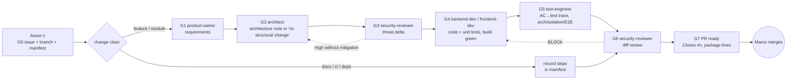

# Agents and skills review (issue #35, phase 1)

- Date: 2026-09-23 · Branch: `issue/35-agents-redesign` · Status: **approved 2026-09-23 and implemented** (see §9)
- Scope: `.claude/agents/*` (9), `.claude/skills/**` (7 skills, 4 reference/asset files), `.claude/settings*.json`, `CLAUDE.md`, `docs/PHASE-0.md`, `.github/workflows/claude-review.yml`, git history
- Method: every file read in full. Every command claim was run against this repo (SDK 10.0.401 via `global.json`, xUnit v3 on Microsoft.Testing.Platform, Aspire CLI 13.5.4, dotnet-ef 10.0.10). Claude Code behaviour was checked against the official docs (hooks, sub-agents, skills, permissions). Anything not verified is marked **unverified**.

## 1. Summary

The setup is short (486 lines) and has a clear role split. The problems are all in the joins between roles:

1. **Nothing runs the pipeline.** The order per issue is one line of prose in `CLAUDE.md:53-54`. No gate has a defined artifact, so skipping a gate is invisible. Issue 0.04 shipped with no threat model and no architect output, and nothing flagged either gap.
2. **One agent is silently broken.** `test-engineer.md` has invalid YAML frontmatter, so Claude Code drops the agent. This session reported it as "no longer available".
3. **Most skills can't run yet.** `module-scaffold`, `ef-migration`, `api-contract` and `otel-instrumentation` depend on projects and types that don't exist yet (`TenantDbContext`, `Decisya.TestInfrastructure`, `Decisya.ArchitectureTests`, `Decisya.Api`, `[Sensitive]`, …). `module-scaffold` step 1 would also break the build under Central Package Management.
4. **Security evidence uses the wrong numbering.** The ASVS references are ASVS 4.0 chapter numbers labelled as ASVS 5.0.
5. **The pre-listed "known defects" need correcting.** Four of the five are confirmed. The `--filter` one is **not a failure**: see D-01.

## 2. Verification of the pre-listed defects

| # | Claim | Result | Evidence |
|---|---|---|---|
| D-01 | `ef-migration` step 6 and `module-scaffold` step 8 use VSTest `--filter`, which "will fail" under MTP | **Partly wrong.** xUnit v3 on MTP accepts `--filter`: `dotnet test --no-build --filter FullyQualifiedName~CurrencyTests` → 20 of 75 tests. The option MTP rejects is **`--logger`**: `dotnet test --logger trx` → exit code 5. That flag caused the CI failure in PR #31, and my earlier explanation, which blamed `--filter`, was wrong. The real problem with step 8 is different: **no test has a `Category` trait**, so `--filter Category=Architecture` runs zero tests and exits with **code 8** (failure). | Commands run on 2026-09-23. `grep -rn "Trait(" tests` → none. |
| D-02 | product-owner, compliance-auditor and tech-writer lack `Edit` | **Confirmed.** security-reviewer lacks it too (F-10). | `product-owner.md:4`, `compliance-auditor.md:4`, `tech-writer.md:4`, `security-reviewer.md:4` |
| D-03 | Write boundaries are enforced only by prompt text | **Confirmed.** It *can* be enforced: `PreToolUse` hook input carries `agent_type` for subagent calls, and agents may declare `hooks:` in their frontmatter (docs: hooks, sub-agents). `tools:` does **not** accept path patterns like `Write(docs/**)`. | `security-reviewer.md:23`, `architect.md:19`, `product-owner.md:18`, `tech-writer.md:13`, `compliance-auditor.md:17` |
| D-04 | Standing rules are copied into all 9 agents | **Confirmed.** The same 5 lines appear in 9 files. Subagents inherit `CLAUDE.md` by default (docs: sub-agents), so all five are redundant. | e.g. `architect.md:21-26` vs `CLAUDE.md:36-40` |
| D-05 | devops, test-engineer, compliance-auditor and tech-writer have no skills | **Confirmed.** `docs/architecture/` and `docs/runbooks/` are empty. `docs/security/threat-models/` exists only locally (empty, untracked). | `find docs -type f` |

## 3. Findings

Severity: **High** means the pipeline silently produces wrong or missing evidence, or a component is broken. **Medium** means a step fails or needs manual rescue when run. **Low** means friction, drift risk or cosmetic.

| Id | Sev | File:line | Finding | Evidence | Proposed fix |
|---|---|---|---|---|---|
| F-01 | High | `CLAUDE.md:53-54` | The pipeline is prose only. Nothing runs it, no gate has a defined artifact or pass condition, and a skipped step leaves no trace. | Issue 0.04 (1e49af9) has `docs/requirements/phase-0/shared-kernel.md` and `docs/security/reviews/0.04.md`, but no threat model and nothing in `docs/architecture/`. The architect and threat-delta steps were skipped at my suggestion, and nothing recorded the skip. | An `/issue <n>` orchestration skill run by the main session, with a per-issue manifest and a gate checker script (§5). |
| F-02 | High | `test-engineer.md:3` | The frontmatter is invalid YAML (`pyramid: xUnit` is colon-space in a plain scalar), so Claude Code drops the agent silently. | `yaml.safe_load` → "mapping values are not allowed here". This session announced "test-engineer no longer available". | Quote every `description:`. The lint (§6) parses every frontmatter block. |
| F-03 | High | all review artifacts | Artifacts are keyed three different ways: phase id (`reviews/0.04.md`), module slug (`requirements/phase-0/shared-kernel.md`) and GitHub number (branch `issue/35-…`). Nothing maps one to another, so no gate can find an issue's artifacts. | `docs/security/reviews/0.04.md` vs issue #16 vs branch `feat/0.04-…` | One manifest per GitHub issue, `docs/ai/pipeline/<n>.md`, listing each gate's artifact path. Artifacts keep readable names; the manifest is the index. |
| F-04 | High | `backend-dev.md:3,10` | "After the architect and security-reviewer have signed off" and "read the module's threat model" give no path and no sign-off format. backend-dev can't check the precondition, so it proceeds anyway. | 0.04: backend-dev ran with no threat model. | Gate G3 (threat model with a verdict line) must pass before the orchestrator starts backend-dev. The agent reads the paths from the manifest. |
| F-05 | Medium | `asvs-checklist/references/l2-controls.md:3-13`; `threat-model/SKILL.md:11`; `threat-model/references/format.md:3` | The ASVS **4.0** chapter numbering (V2 Authentication, V3 Session, V4 Access control, V5 Validation, V7 Error/logging, V14 Configuration) is labelled **ASVS 5.0**. In ASVS 5.0: V1 Encoding, V2 Validation and business logic, V3 Web frontend, V4 API, V5 Files, V6 Authentication, V7 Session, V8 Authorization, V9 Self-contained tokens, V10 OAuth/OIDC, V11 Crypto, V12 Communication, V13 Configuration, V14 Data protection, V15 Secure coding, V16 Logging and errors, V17 WebRTC. So "V3.5" in the example would be read as Web Frontend in 5.0. | The 0.04 review already used 5.0 ids (V15.2.2, V16.4.1), which contradicts the skill's own reference. | Rewrite `l2-controls.md` on the 5.0 chapter structure, fix the chapter list in `threat-model` step 4 and the `format.md` example, and add a chapter map to `docs/security/asvs-l2.md`. |
| F-06 | Medium | `module-scaffold/SKILL.md:18` | `dotnet new xunit` generates an **xUnit v2 + VSTest** project (`xunit 2.9.3`, `Microsoft.NET.Test.Sdk`, `coverlet.collector`, all with `Version=` attributes). Under CPM that is **NU1008**, an error with `-warnaserror`. v2/VSTest also doesn't run under the MTP runner that `global.json` selects. | Template output inspected in the scratchpad. The xunit3 template is not installed (`dotnet new list xunit3` → exit 103). The NU1008 is expected but **unverified** until the smoke run. | Ship `assets/Tests.csproj`, copied from `tests/Decisya.SharedKernel.Tests` (xunit.v3, AwesomeAssertions, no versions), instead of `dotnet new xunit`. |
| F-07 | Medium | `module-scaffold/SKILL.md:16-17,21,30,32,36` | The skill depends on things that don't exist yet: `Decisya.TestInfrastructure`, `TenantDbContext`, `ITenantScoped`, `TenantId`, `PostgresFixture` and `tests/Decisya.ArchitectureTests/ModuleBoundaryTests.cs`. `dotnet new classlib` also adds `Class1.cs` and repeats `TargetFramework`/`Nullable`/`ImplicitUsings`, which `Directory.Build.props` already sets. | `git grep -w` → 0 files for each symbol. These arrive with #32 (0.04b), #22 (0.10) and #15 (0.03). | Add a **Prerequisites** step that checks each dependency and stops with the name of the issue that provides it. Delete `Class1.cs` and strip the duplicated properties. See §8 for what this means for your smoke-run criterion. |
| F-08 | Medium | `module-scaffold/SKILL.md:37`; `ef-migration/SKILL.md:22` | A filter on a trait that no test carries exits with code 8, so "report exact errors" fires on a correct scaffold. | D-01. | Use `--filter-trait "Category=…"` for consistency with CI, and have the architecture test template carry `[Trait("Category","Architecture")]`. `--minimum-expected-tests 1` makes an empty run an explicit failure instead of a confusing one. |
| F-09 | Medium | `ef-migration/SKILL.md:13-15` | The startup project `Decisya.Api` doesn't exist. `dotnet-ef` is a global tool on this machine only: there is no `.config/dotnet-tools.json`, so CI and other machines don't have it. The PMC `-Output` path is resolved relative to an **unverified** base. | `dotnet ef --version` → 10.0.10 (global). `.config/dotnet-tools.json` missing. | Add a local tool manifest (`dotnet new tool-manifest`, `dotnet tool install dotnet-ef --version 10.0.10`) with `dotnet tool restore` in the steps. Add a prerequisites check. Verify the PMC path in the first real migration. |
| F-10 | Medium | `security-reviewer.md:4`; `compliance-auditor.md:4`; `product-owner.md:4`; `tech-writer.md:4` | These agents must update existing files (review status, `nfr.md` rows, `dpia.md`, `CHANGELOG.md`) but only have `Write`, which replaces the whole file. | 0.04 re-check: security-reviewer returned its report instead of editing `reviews/0.04.md`, so the main session patched it by hand. | Add `Edit`. The lint flags agents whose output section says "update", "keep current" or "add a row" but lack `Edit`. |
| F-11 | Medium | `tech-writer.md:5,10` | It must "verify commands against the repo", but it has no Bash and runs on haiku. It can't verify anything, so it will copy commands that look right. | `tools: Read, Grep, Glob, Write` | Give it `Edit` and read-only `Bash(dotnet --list-sdks*)`, `Bash(dotnet test --list-tests*)`, `Bash(git log*)`, and move it to sonnet. Alternatively, the orchestrator runs the commands and passes the output in. I recommend the first. |
| F-12 | Medium | `devops.md:4`; `frontend-dev.md:4` | devops has unrestricted `Bash`. frontend-dev has `Bash(npx *)`, which can download and run any npm package. | frontmatter | devops: `Bash(docker *)`, `Bash(gh *)`, `Bash(dotnet *)`, `Bash(git status*)`, `Bash(git diff*)`, `Bash(git log*)`, `Bash(actionlint*)`, `Bash(aspire *)`. frontend-dev: `Bash(npx playwright*)`, `Bash(npx tsc*)`, `Bash(npx eslint*)`, `Bash(npm run*)`, `Bash(npm ci*)`. |
| F-13 | Medium | `.claude/settings.json:20-25` | The deny list is weaker than it looks. `Read(./.env*)` doesn't cover `Bash(cat .env)` (docs: permissions). `Bash(rm -rf*)` is a literal prefix, so `rm -fr` and `rm -r -f` don't match. User-secrets live in `%APPDATA%\Microsoft\UserSecrets\<id>\secrets.json`, outside the repo, so `Read(./**/secrets.json)` doesn't cover them. | docs: permissions, "What a Bash rule doesn't match" | Add denies for `Bash(cat .env*)`, `Bash(type .env*)`, `Bash(rm -fr*)`, `Bash(rm -r *)` and `Read(~/AppData/Roaming/Microsoft/UserSecrets/**)`, plus a `PreToolUse` Bash hook that rejects commands mentioning `.env` or `UserSecrets`. Keep denies as a speed bump, not a boundary. |
| F-14 | Medium | `.github/workflows/claude-review.yml:19,24` | `fetch-depth: 1`, but the prompt runs `asvs-checklist`, which diffs against `main`, and there's no history to diff against. The action isn't pinned to a SHA. | workflow file | `fetch-depth: 0`, diff against `origin/${{ github.base_ref }}...HEAD`. Pinning goes to #28 (0.16). |
| F-15 | Medium | `asvs-checklist/SKILL.md:8` | `git diff main --name-only` uses the **local** `main`, which can be stale, and misses untracked files. The 0.04 review had to be given the list of new files by hand. | 0.04 review prompt | Use `git fetch origin` and then `git diff --name-only origin/main...HEAD`, plus `git status --porcelain` for anything uncommitted. |
| F-16 | Medium | `otel-instrumentation/SKILL.md:16`; `CLAUDE.md:30` | `[Sensitive]` and `SensitiveDataMaskingProcessor` don't exist, so step 3 can't be done, and CLAUDE.md states a masking guarantee nothing implements. | `git grep -w Sensitive` → 0 | Prerequisites check pointing to #15 (0.03). Mark the CLAUDE.md line "(from 0.03)". |
| F-17 | Medium | `CLAUDE.md:7`; `docs/PHASE-0.md` | "Phase plan and gates: docs/PHASE-0.md" points to a 3-line stub. Issue bodies say "See the Phase 0 work package", which agents can't read offline. | file contents | The `/issue` skill reads the issue with `gh issue view <n>` (title, "Done when", labels), so the issue is the offline source of truth. Export the Claude Doc into PHASE-0.md at phase exit, as the stub already says. |
| F-18 | Medium | `architect.md:13,19` | The agent must write NetArchTest rules under `tests/`, but its rule limits it to "Contracts and docs", and it has no Bash to build the tests it writes. Also, `tests/Decisya.ArchitectureTests` doesn't exist; the only architecture rule lives in `SharedKernel.Tests`. | `ModuleClockUsageRule.cs` | The architect **specifies** rules in its architecture note. test-engineer implements them. An `ArchitectureTests` project is created in the first issue that needs a cross-module rule. |
| F-19 | Low | `architect.md:18` | "Reuse PortfolioTracker conventions": that project isn't in the repo, so agents can't follow the reference. | `git grep PortfolioTracker` → only ADR-0005:22 | Replace with the concrete conventions, which ADR-0005 already states. |
| F-20 | Low | `security-reviewer.md:7` vs `asvs-checklist/SKILL.md:3` | The agent says "ASVS Level 3 for auth and session"; the skill evaluates Level 2 only. | text | Keep L2 everywhere, and list the L3 auth/session controls explicitly in `l2-controls.md`. |
| F-21 | Low | `product-owner.md:3` | "Use at the start of every issue" makes it trigger for docs-only, CI and dependency issues. | description | The orchestrator decides. The description becomes "…for any issue that adds or changes user-visible or module behaviour". |
| F-22 | Low | `test-engineer.md:12` | The rule "not VSTest `--filter`/`--logger`" is half wrong (D-01). I wrote it. | D-01 | "Filter with `--filter-trait`; never use `--logger` (MTP rejects it, exit 5)." |
| F-23 | Low | `otel-instrumentation/SKILL.md:10` | `decisya.<module>.<noun>.<unit>` puts the unit in the metric name. OTel naming guidance puts the unit in the instrument's unit field. | OTel semantic conventions, "Naming" | `decisya.<module>.<noun>` with `unit: "s"`. |
| F-24 | Low | description overlaps | backend-dev ("any C# work") overlaps test-engineer (tests) and devops (CI). devops and tech-writer both own runbooks. | descriptions | The orchestrator assigns by gate. Descriptions state exclusions, e.g. "not tests beyond the story's unit tests", "tech-writer edits runbook prose; devops owns runbook commands". |
| F-25 | Low | `.claude/settings.local.json:16-19` | It enables `vs-debug` and `vs-semantic` MCP servers left over from the Visual Studio extension. They fail to connect in VS Code. The file is git-ignored, so this affects this machine only. | session start: "Visual Studio bridge unavailable" | Remove `enabledMcpjsonServers` locally. Not part of the PR. |
| F-26 | Low | repo root | There's no `.gitattributes`, so git warns about CRLF/LF on every touched file and review diffs are noisy. | "LF will be replaced by CRLF" warnings | Add `.gitattributes` as the first commit (`* text=auto eol=lf`, `*.sln* text eol=crlf`, `*.ps1 text eol=crlf`, binaries `-text`), then `git add --renormalize .` in the same commit. |
| F-27 | Low | all agents | Agent files are short (20–30 lines) and well scoped. Context cost is low once the duplicated standing rules go. Skill bodies are concise but have no "Inputs / Outputs / Verify" structure, so outputs vary between runs. | — | Use one skill layout: *When · Prerequisites · Inputs · Steps (VS 2026 \| CLI) · Output (path + verdict line) · Done when*. |

**Unverified items** (status after phase 2):
- NU1008 from `dotnet new xunit` inside the repo (F-06): moot. The skill no longer uses the template, so this was not reproduced.
- The PMC `-Output` base path (F-09): still unverified. The skill says to check it on the first real migration.
- Whether a hook enforces boundaries per agent (F-13, §5.4): **verified**, using a project-level `PreToolUse` hook that reads `agent_type`, not per-agent frontmatter hooks. security-reviewer writing `src/boundary-probe.txt` was denied.
- The docs agent's claim that subagents can nest up to three levels deep: not needed. No Decisya agent gets the `Agent` tool.

## 4. Single source of truth

| Belongs in | Content |
|---|---|
| `CLAUDE.md` | Invariants, security and observability principles, working agreements, commands, and **a 5-line pipeline summary pointing to the `issue` skill**. Subagents inherit it, so agents don't repeat it. |
| Agent file | Role, what it must **not** do, inputs (read from the manifest), output **path and verdict line**, which skills to use, tools. No standing rules. |
| Skill | One repeatable procedure: prerequisites, steps with VS 2026 \| CLI side by side, output format, done-when. |
| `docs/ai/pipeline/<n>.md` | Per-issue state: gates, artifact paths, verdicts, skips with reasons. |
| `.claude/scripts/` | Machine checks: `gates.py` (gate status) and `lint.py` (config lint). |

## 5. Target design

### 5.1 Pipeline

Only the main session holds the `Agent` tool, so the main session orchestrates, guided by the `issue` skill. Every gate writes one artifact with a machine-readable verdict line. `gates.py` decides pass or fail. The manifest makes the pipeline resumable: `/issue <n>` re-reads it and continues at the first gate that isn't passed.



### 5.2 Gates

A gate **passes** when its artifact exists at the path recorded in the manifest **and** the artifact's first line is `<!-- gate: <id> | verdict: <PASS|PASS-WITH-NOTES|N/A> | issue: #<n> -->`. `BLOCK` or `FAIL` never passes. `N/A` needs a `reason:` field.

| Gate | Owner | Artifact | Passes when |
|---|---|---|---|
| G0 | orchestrator | `docs/ai/pipeline/<n>.md`, branch `issue/<n>-<slug>` | Issue open, branch exists, change class recorded |
| G1 | product-owner | `docs/requirements/<phase>/<slug>.md` | Verdict line present, no open questions left without an answer |
| G2 | architect | `docs/architecture/<slug>.md` (C4 excerpt, boundaries, ADR links, NetArchTest rules to add), **or** `verdict: N/A` with a reason such as "no new module, contract or cross-module dependency" | Verdict line present |
| G3 | security-reviewer | `docs/security/threat-models/<slug>.md` | Verdict line present; every High has a mitigation or a linked issue |
| G4 | backend-dev / frontend-dev | manifest entry: build/test command output summary | `dotnet build -warnaserror` 0 errors; tests pass (the orchestrator re-runs both) |
| G5 | test-engineer | `docs/requirements/<phase>/<slug>.md` § "Traceability" (AC → test) | Every AC maps to ≥ 1 test, or is marked manual with a reason |
| G6 | security-reviewer | `docs/security/reviews/<n>.md` | Verdict PASS or PASS-WITH-NOTES, no finding with Status Open at High |
| G7 | orchestrator | PR body draft in the manifest | Contains `Closes #<n>` and one line per new package |

### 5.3 Skip policy

The change class is decided at G0 from the issue and the changed paths, the same classification CI's `changes` job uses. Every skip is written to the manifest as `skipped: <gate> | class: <class> | reason: … | approved: Marco <date>`. The orchestrator asks Marco before recording any skip not listed in this table.

| Class | Detected by | Gates run | Skipped |
|---|---|---|---|
| feature / module | `src/`, `tests/` changes | G0–G7 | — (G2 may be N/A with a reason) |
| docs-only | only `docs/`, `*.md`, `.claude/` | G0, G7 | G1–G6 |
| ci / tooling | `.github/`, `Directory.*.props`, `global.json`, `.config/` | G0, G3 (light), G6, G7 | G1, G2, G4, G5 |
| dependency bump | Dependabot or package-only change | G0, G6 (vulnerable-package check), G7 | G1–G5 |

### 5.4 Enforcement

- **`gates.py <n>`** prints a gate table and exits non-zero if a required gate is missing. The `issue` skill runs it before starting each agent and before G7. A CI job runs it on PRs whose branch matches `issue/<n>-*`.
- **Write boundaries:** a `PreToolUse` hook on `Write|Edit` reads `agent_type` and checks `tool_input.file_path` against a per-agent allow-list in `.claude/boundaries.json`. For example, security-reviewer may write only `docs/security/**`. It fails open for the main session. It must be tested before anything relies on it (§3, unverified items).
- **`lint.py`** is described in §6.

### 5.5 Inventory (target)

| Agent | Model | Tools (change) | Skills |
|---|---|---|---|
| product-owner | sonnet | + Edit | `story` (new, optional) |
| architect | opus | unchanged; writes `docs/` and `*.Contracts` only (hook) | adr-writer, api-contract, `architecture-note` (new) |
| security-reviewer | opus | + Edit | threat-model, asvs-checklist |
| backend-dev | sonnet | unchanged | module-scaffold, ef-migration, otel-instrumentation |
| frontend-dev | sonnet | npx narrowed | api-contract |
| test-engineer | sonnet | description quoted (F-02) | `isolation-test` (moved out of module-scaffold), `traceability` (new) |
| devops | sonnet | Bash narrowed | `runbook` (new) |
| compliance-auditor | opus | + Edit | `phase-exit-audit` (new) |
| tech-writer | haiku → sonnet | + Edit, read-only Bash | `runbook` (new) |

| Skill | Status |
|---|---|
| `issue` | **new**, the orchestrator; `disable-model-invocation: true`, so it only runs when you type `/issue <n>` |
| `runbook` | new: VS 2026 \| CLI table format, verify every command |
| `phase-exit-audit` | new: standards register → `phase-<n>-exit.md` |
| `isolation-test` | new: moved from `module-scaffold/references` |
| `traceability` | new: AC → test mapping for G5 |
| `architecture-note` | new: G2 artifact template including the N/A form |
| module-scaffold, ef-migration, api-contract, otel-instrumentation | fixed (F-06–F-09, F-16, F-23); prerequisites checks |
| threat-model, asvs-checklist | fixed (F-05, F-15); verdict line |
| adr-writer | unchanged, except it opens the issue with `gh issue create` |

## 6. `.claude/` lint (phase 2)

A Python script (Python is already needed for pre-commit), run by pre-commit and by a CI job. It fails on:

- **Banned patterns** in `.claude/**` and `docs/**`: `--logger` next to `dotnet test`, `FluentAssertions`, `net11`, ASVS 4.0 chapter labels. `dotnet test --filter ` stays **allowed** because it works (D-01); I recommend banning it anyway **for consistency** with `--filter-trait`. Your call.
- **Frontmatter**: fails to parse, or missing `name`/`description`, or `name` differs from the file or folder name.
- **Dangling references**: a skill name mentioned in an agent that has no `.claude/skills/<name>/SKILL.md`, or a `references/`/`assets/` path that doesn't exist.
- **Tool mismatch**: output text says "update", "keep current", "add a row" or "maintain" but `tools:` lacks `Edit`.
- **Duplication**: a "Standing rules" heading in any agent.

## 7. Dry run: what the new orchestration says about issue 0.04 (#16)

This was run on 2026-09-23 with `python .claude/scripts/gates.py 16`, using a temporary manifest that recorded what actually exists for #16. The manifest was deleted afterwards and not committed. Output:

```
FAIL  G0  orchestrator               not completed
FAIL  G1  product-owner              NO VERDICT: docs/requirements/phase-0/shared-kernel.md has no '<!-- gate: G1 | verdict: ... -->' line
FAIL  G2  architect                  MISSING: no artifact recorded
FAIL  G3  security-reviewer          MISSING: no artifact recorded
PASS  G4  backend-dev / frontend-dev build 0 warnings/0 errors; 75/75 tests (verified in session; PR #31 CI green)
FAIL  G5  test-engineer              NO VERDICT: docs/requirements/phase-0/shared-kernel.md has no '<!-- gate: G5 | verdict: ... -->' line
FAIL  G6  security-reviewer          NO VERDICT: docs/security/reviews/0.04.md has no '<!-- gate: G6 | verdict: ... -->' line
PASS  G7  orchestrator               PR #31 body: Closes #16 and package justifications
6 gate(s) not passed
```

- **Expected, and confirmed:** G2 (no architect output) and G3 (no threat model) are **MISSING**.
- **Also flagged:** G5. The mapping from acceptance criteria to tests stayed in backend-dev's chat report and was never saved.
- **Stricter than predicted:** G1 and G6 fail as NO VERDICT, because their artifacts exist but predate the verdict-line format. I predicted a pass with a retrofitted line; the checker correctly refuses to infer one. G0 fails because there was no manifest and the branch was not `issue/16-...`.
- `gates.py 16 --next` resumes at G0.

## 8. Decisions (Marco, 2026-09-23: all recommendations accepted)

1. **Smoke-run criterion (§ definition of done, item 3).** `module-scaffold` **cannot** fully succeed today: it needs `TenantId` (#32), `TenantDbContext` and the tenant filter (#22), and `TestInfrastructure`. Options:
   - **(a) Recommended:** the skill gets a Prerequisites step. The smoke run proves every command up to the first missing prerequisite succeeds, **and** that the skill stops cleanly naming #32 and #22. The full smoke run is repeated when #22 lands.
   - **(b)** Build minimal stubs of `TenantId`, `TenantDbContext` and `PostgresFixture` on the scratch branch only (touches `src/`; throwaway).
   - **(c)** Do #32 and #22 first.
2. **Ban `dotnet test --filter `?** It works (D-01). I recommend banning it for consistency with CI's `--filter-trait`.
3. **tech-writer model:** haiku → sonnet (F-11). Recommended, because it must verify commands.
4. **Hook-based write boundaries (§5.4):** enforce them now, or record them in `boundaries.json` and switch enforcement on after a trial week? I recommend enforcing now: it fails open for the main session, so the risk is limited to a subagent being refused a write it shouldn't make.
5. **Commit plan** (one Conventional Commit each, never pushed):
   1. `chore: add .gitattributes and renormalize line endings`
   2. `fix(claude): quote agent descriptions (test-engineer failed to load)`
   3. `fix(claude): give editing agents the Edit tool; narrow devops and frontend-dev tools`
   4. `refactor(claude): drop duplicated standing rules; CLAUDE.md is the single source`
   5. `fix(claude): correct test commands, ASVS 5.0 numbering and skill prerequisites`
   6. `feat(claude): add issue orchestration skill, pipeline manifest and gate checker`
   7. `feat(claude): add runbook, phase-exit-audit, isolation-test, traceability and architecture-note skills`
   8. `feat(claude): enforce agent write boundaries with a PreToolUse hook`
   9. `ci: add .claude lint (script, pre-commit hook, CI job)`
   10. `docs: document the issue pipeline (VS 2026 | CLI)`

## 9. Implementation and verification (phase 2)

Branch `issue/35-agents-redesign`. Commits, never pushed:

| # | Commit | Planned as |
| --- | --- | --- |
| 1 | `chore: add .gitattributes for LF line endings` | 1 |
| 2 | `fix(claude): quote agent and skill descriptions` | 2 |
| 3 | `fix(claude): give editing agents Edit, narrow devops and frontend-dev tools` | 3 |
| 4 | `refactor(claude): drop duplicated standing rules from agents` | 4 |
| 5 | `fix(claude): correct skill commands, ASVS 5.0 numbering and prerequisites` | 5 |
| 6 | `feat(claude): add issue orchestration skill, pipeline manifest and gate checker` | 6 |
| 7 | `feat(claude): add runbook, phase-exit-audit, isolation-test, traceability and architecture-note skills` | 7 |
| 8 | `feat(claude): enforce agent write boundaries and secret reads with hooks` | 8 |
| 9 | `ci: lint the Claude Code config and check pipeline gates` | 9 |
| 10 | `fix(claude): scope trait-filtered test commands to one test project` | extra; found by the smoke run |
| 11 | `fix(claude): print ASCII in gates.py messages` | extra; found by the dry run |
| 12 | `docs: document the issue pipeline and review outcome` | 10 |

**Definition of done:**

1. **Build and tests:** `dotnet build -warnaserror` gives 0 warnings and 0 errors; `dotnet test` passes 75 of 75.
2. **Lint:** `claude-lint: OK (9 agents, 13 skills)`. It fails, with file:line, on each of nine reintroduced defects: unquoted description, `--filter`, missing `Edit`, standing rules, dangling skill, FluentAssertions, `net11`, missing reference file, and a solution-wide trait filter.
3. **Smoke run of `module-scaffold`** (scratch branch `scratch/35-scaffold-smoke`, deleted afterwards):
   - Step 1: the script created 5 files.
   - Step 2: `dotnet sln add` added 3 projects.
   - Step 3: the build had 0 warnings and 0 errors.
   - Step 4: 2 of 2 architecture tests passed. A deliberate direct `SystemClock` use made the clock test fail, so the test isn't vacuous.
   - Step 5: the prerequisites check stopped with exit code 1, naming #32 and #22.
   - The script refuses to overwrite files and rejects bad input.
   - **Defect found:** a solution-wide `--filter-trait` exits with code 8, because `Decisya.SharedKernel.Tests` has no architecture tests. Fixed in commit 10 and guarded by the lint.
4. **Dry run on 0.04:** see §7.

**Other things found during implementation:**
- In .NET 10, `dotnet new tool-manifest` writes `dotnet-tools.json` to the repository root, not `.config/`.
- The secret guard first blocked a commit whose message mentioned `.env`. Heredoc bodies are now ignored.
- The existing `Decisya.SharedKernel.Tests` classes carry no `Category` trait yet. The new rule applies to new tests; retrofitting them is a follow-up for #32.
