# Architecture note – Modules.Admin API: platform-admin endpoints for the Entitlements commands (issue #25)

## Context

#25 (0.13) puts the three audited Entitlements commands (`StartTrial`, `GrantOverride`, `RevokeOverride`; #23, #24) behind HTTP for the first time. It adds:
- `Decisya.Modules.Admin` and `Decisya.Modules.Admin.Contracts`. The module owns `/api/admin` and its policy, persists nothing, and calls modules only through their Contracts.
- The platform-admin fact from the validated access token: a realm-role mapper, and `ICurrentCaller.IsPlatformAdmin` (C-2).
- The handler precondition `None && IsPlatformAdmin`.
- A target-tenant existence check inside each handler (S-5).

**Done when:** a non-admin gets 403, and every successful call is audited (Q4: successes only).

Inputs:
- `docs/ai/pipeline/25.md`: Marco's decisions of 2026-10-02 and the G1 answers Q1-Q4.
- `docs/requirements/phase-0/admin-api.md`: Stories 1-7, NFR-38, NFR-39, R-1 to R-8.
- The notes for #20 (`api-jwt-validation.md`), #21 (`tenancy-module.md`), #23 (`entitlements-module.md`) and #24 (`audit-module.md`). Also #17 (`keycloak-realm.md`), #18 (`bff-session.md`) and #19 (`bff-api-forwarding.md`) for the realm and the BFF. This note follows them wherever it doesn't say otherwise.
- ADR-0002, ADR-0003, ADR-0005, ADR-0008, ADR-0012 and ADR-0013.
- Code read on `issue/25-admin-api`: `Decisya.Api` (`Authentication/*`, `Program.cs`), `Modules/Entitlements`, `Modules/Audit`, `Modules/Tenancy`, `Decisya.Bff/Proxy` and `Security`, `deploy/keycloak/decisya-realm.json`, and `Decisya.ArchitectureTests`.
- `gh issue view 25 --comments` was not run (no shell in this session). The carry-forwards come from the manifest.

**ADR: [ADR-0012 amendment 1](../adr/0012-cross-tenant-admin-commands-target-tenant-scope.md#amendment-1-issue-25-platform-admin-precondition-cross-module-facts-under-the-target-scope-the-http-path) (Accepted, Marco 2026-10-02).** It changes ADR-0012 in three places:
- **Point 2:** the handler precondition becomes `None && IsPlatformAdmin`.
- **Point 5:** the HTTP path goes only through `Modules.Admin` and a `Contracts.Admin` namespace.
- **New point 6:** an `[AllowCrossTenant]` handler passes its minted target scope to another module's Contracts query to learn a fact about the target tenant. This is how S-5 is met without a cross-schema grant and without weakening `CrossTenantAuditRule`.

Everything else implements ADR-0003, ADR-0005, ADR-0012 and ADR-0013 as written.

## C4 excerpt

```mermaid
flowchart LR
  spa(["SPA / HttpClient<br/>(dev-admin session)"]) -- "PUT/DELETE/POST /api/admin/...<br/>cookie + X-XSRF-TOKEN" --> bff
  subgraph apphost["Decisya.AppHost (dev) - no change"]
    bff["Decisya.Bff (no code change)<br/>antiforgery on non-GET /api/*<br/>Bearer attached, Cookie stripped"]
    kc["keycloak<br/>+ mapper realm-roles-access-token<br/>(roles in the access token)"]
    subgraph api["Decisya.Api"]
      ns["UseNoStoreResponses (new, first)"]
      cc["CallerContextMiddleware<br/>CallerIdentity: sub, tenant_id, + platform-admin role<br/>RequestCaller.Set(resolution, sub, isPlatformAdmin)"]
      gate["UseTenancyMembership<br/>(admin group opts out)"]
      authz["UseAuthorization<br/>policy Admin.PlatformAdmin<br/>403 -> ProblemDetailsAuthorizationResultHandler"]
    end
    pg[("postgres / decisya<br/>tenancy.tenants (read, decisya_tenancy)<br/>entitlements.* + audit.audit_records (decisya_entitlements)")]
  end
  subgraph admin["Decisya.Modules.Admin (new; ASP.NET Core; no persistence)"]
    ep["Endpoints: /api/admin/tenants/{tenantId}/trial, /overrides/{featureKey}<br/>parse path + body, map result"]
  end
  subgraph ent["Decisya.Modules.Entitlements (still no ASP.NET Core)"]
    fac["EntitlementAdminCommands : IEntitlementAdminCommands (internal facade)"]
    h["3 handlers [AllowCrossTenant]<br/>None && IsPlatformAdmin, actor, validation,<br/>ExistsAsync(target scope), BEGIN, work, AppendAsync, COMMIT"]
  end
  subgraph ten["Decisya.Modules.Tenancy"]
    te["TenantExistence : ITenantExistence (internal)<br/>own TenancyDbContext under the given scope"]
  end
  bff -- "Bearer access token (YARP)" --> ns --> cc --> gate --> authz --> ep
  api -. "JWKS" .-> kc
  ep -- "Entitlements.Contracts.Admin" --> fac --> h
  h -- "Tenancy.Contracts.ITenantExistence" --> te
  te -- "ConnectionStrings:tenancy" --> pg
  h -- "ConnectionStrings:entitlements (ADR-0013)" --> pg
```



```mermaid
sequenceDiagram
  participant A as Decisya.Api pipeline
  participant E as Admin endpoint (PUT)
  participant F as IEntitlementAdminCommands
  participant H as GrantOverrideHandler
  participant T as ITenantExistence
  participant DB as Postgres
  A->>A: 401 no/invalid token (#20)
  A->>A: 403 invalid identity / tenant claim (#21, pre-routing)
  A->>A: 403 policy Admin.PlatformAdmin (IsPlatformAdmin && None)
  A->>E: route matched, policy passed
  E->>E: 400 tenantId / featureKey / Content-Type / body / expiresAt
  E->>F: GrantOverrideAsync(tenant, feature, reason, expiresAt)
  F->>H: HandleAsync(GrantOverride)
  H->>H: Forbidden unless None && IsPlatformAdmin; actor_unknown; validation (400)
  H->>T: ExistsAsync(TenantResolution.For(target))
  T->>DB: SELECT EXISTS ... tenancy.tenants (filter = target), as decisya_tenancy
  T-->>H: false -> tenant_not_found (404)
  H->>DB: BEGIN; upsert; INSERT audit; COMMIT (decisya_entitlements)
  H-->>E: Succeeded -> 204
```

## Projects and ownership

| Path | Kind | G4/G5 owner |
| --- | --- | --- |
| `src/Modules/Entitlements/Decisya.Modules.Entitlements.Contracts/Admin/` `IEntitlementAdminCommands.cs`, `EntitlementAdminResult.cs`, `EntitlementAdminStatus.cs`, `EntitlementAdminErrorCodes.cs` | **written at G2** (fixed surface) | architect (done) |
| `src/Modules/Tenancy/Decisya.Modules.Tenancy.Contracts/ITenantExistence.cs` | **written at G2** | architect (done) |
| `src/Modules/Admin/Decisya.Modules.Admin.Contracts/OverrideGrantRequest.cs` | **written at G2**. The scaffold adds the `.csproj` and never overwrites this file | architect (done); backend-dev runs the scaffold |
| `src/Modules/Admin/Decisya.Modules.Admin/` (`AdminModule.cs`, `Endpoints/`) | new, module-scaffold **phase 1 only** (no DbContext, schema, role or migration) | backend-dev |
| `src/Modules/Entitlements/Decisya.Modules.Entitlements/` (three handlers, `EntitlementsErrors`, `EntitlementsLog`, new `Application/EntitlementAdminCommands.cs`, `EntitlementsModule` registration, csproj ProjectReference to `Decisya.Modules.Tenancy.Contracts`) | changed | backend-dev |
| `src/Modules/Tenancy/Decisya.Modules.Tenancy/` (new `Application/TenantExistence.cs`, `Infrastructure/TargetTenant.cs`, `TenancyModule` registration) | changed | backend-dev |
| `src/Decisya.SharedKernel/Tenancy/ICurrentCaller.cs` (`IsPlatformAdmin`) and `tests/Decisya.SharedKernel.Tests/Tenancy/ICurrentCallerShapeTests.cs` | changed | backend-dev |
| `src/Decisya.Api/Decisya.Api.csproj` (ProjectReference to Admin) and `tests/Decisya.Api.Tests/Architecture/ApiBoundaryTests.cs` (expected reference set, now 5) | changed | backend-dev |
| `tests/Decisya.ArchitectureTests/ArchitectureScope.cs`, `ContractsScope.cs`, csproj references | changed | backend-dev (module-scaffold step 7) |
| `src/Decisya.Api/Authentication/` (`CallerIdentity`, `RequestCaller`, `CallerContextMiddleware`, `CallerContextMiddlewareLog`, new `ProblemDetailsAuthorizationResultHandler`, new `NoStoreResponses`, `ApiAuthenticationBuilderExtensions`), `src/Decisya.Api/Program.cs` | changed | identity-dev |
| `deploy/keycloak/decisya-realm.json` (one mapper), `tests/Decisya.Identity.Tests/**` (realm tests), existing `tests/Decisya.Api.Tests/**` tests broken by the signature and endpoint-set changes | changed | identity-dev |
| `tests/Modules/**` (Entitlements harness, Admin test project content, Tenancy tests), `tests/Decisya.TestInfrastructure/TestCurrentCaller.cs`, new rules in `tests/Decisya.ArchitectureTests` | changed / new | test-engineer (G4 fix-up, then G5) |
| `tests/Decisya.Bff.Tests/**` (antiforgery on the admin verbs) | new tests | test-engineer (G5) |
| `docs/GETTING-STARTED.md` (dev-admin smoke row, realm refresh) | changed | tech-writer (or the orchestrator) |
| `decisya.slnx` | root file | backend-dev runs `dotnet sln add`; the orchestrator does it if the write boundary blocks it |
| `deploy/sql/**`, `.github/workflows/ci.yml`, `src/Decisya.AppHost/**`, `src/Decisya.Infrastructure.Migrator/**`, `src/Decisya.Bff/**` | **unchanged** | devops, platform-dev: nothing to do |

**Packages: none added.**
- `Decisya.Modules.Admin` uses `<FrameworkReference Include="Microsoft.AspNetCore.App" />`, which is not a package (the Tenancy precedent). Drop the scaffold's `Microsoft.Extensions.DependencyInjection.Abstractions` reference, as Tenancy did (NU1510).
- NodaTime arrives transitively through SharedKernel.
- `System.Text.Json` is part of the framework.

## 1. The admin role in the access token (R-1)

**Finding (G1 correction).** G1 says the role reaches only the ID token. That is half right. The client mapper `realm-roles-id-token` targets the ID token only. But the client's default scope `roles` is Keycloak's built-in scope, which the realm file does not define. Its built-in "realm roles" mapper already puts `realm_access.roles` (a nested JSON object) into the access token, as `keycloak-realm.md` and `bff-session.md` both record. The API ignores it today.

**Decision D1: add one client mapper that emits a flat `roles` array into the access token, and read only that.**

```json
{
  "name": "realm-roles-access-token",
  "protocol": "openid-connect",
  "protocolMapper": "oidc-usermodel-realm-role-mapper",
  "consentRequired": false,
  "config": {
    "claim.name": "roles",
    "multivalued": "true",
    "jsonType.label": "String",
    "id.token.claim": "false",
    "access.token.claim": "true",
    "userinfo.token.claim": "false",
    "introspection.token.claim": "true"
  }
}
```

- It is added next to `realm-roles-id-token`, which is **unchanged**. The two mappers share the claim name but never the token, so #18's ID-token test stays as it is.
- With `fullScopeAllowed: false` and the existing `scopeMappings`, only `tenant-user` and `platform-admin` can appear in it.
- Why not `realm_access.roles`:
  1. It is a nested JSON claim. With `MapInboundClaims = false` it reaches the principal as one `realm_access` claim of value type JSON, so the API would need a second JSON parser for authorization.
  2. Its mapper is defined by the Keycloak version, not by the version-controlled realm file, so `RealmExportFileTests` cannot pin it.
  3. A flat `roles` matches the ID-token shape the BFF already reads (`RoleClaimType = "roles"`).
- Removing the built-in `roles` scope (and with it `realm_access` and `resource_access`) from the access token is optional hardening, deferred to #83. The API never reads either claim.
- **Effect on every API caller:**
  - Every access token now carries `roles`: `["tenant-user"]` for dev-alice and dev-bob, `["platform-admin"]` for dev-admin. That adds a few dozen bytes.
  - `CallerIdentity.From` reads the claim for every caller. No existing endpoint changes behaviour.
  - The BFF and its ID token are unchanged.
- **Effect on the realm tests:**
  - `RealmExportFileTests` (static) gains the mapper and its exact flags.
  - `RealmConfigurationTests` (Integration) gains the same assertions through the admin REST API. The existing `realm-roles-id-token` test stays.
  - `BffLoginFlowTests` (Integration) decodes the access token. For dev-admin, `roles` contains exactly `platform-admin` and there is no `tenant_id`. For dev-alice, `roles` is `["tenant-user"]` and does not contain `platform-admin`.
- **Effect on the realm guard:** none. No new file names the realm file outside `tests/` and `docs/`, and the always-run `realm-guard` CI job still runs.
- **Local Keycloak:** `--import-realm` skips an existing realm, so Marco's running Keycloak does not get the mapper by itself. GETTING-STARTED gets two ways, side by side:
  - **Reset the dev volume.** This loses all local Keycloak, tenancy, entitlements and audit data.
  - **Add the mapper by hand.**
    - VS 2026 path: none (it is a Keycloak admin console task).
    - Admin console: *Clients → decisya-bff → Client scopes → decisya-bff-dedicated → Add mapper → By configuration → User Realm Role*, with the settings above.
    - CLI path: the Keycloak admin REST call `POST /admin/realms/decisya/clients/{id}/protocol-mappers/models` with the JSON above, using an admin token.

**Decision D2: `IsPlatformAdmin` is a computed, fail-closed fact on `ICurrentCaller`, set once.**

- **`ICurrentCaller`** gains `bool IsPlatformAdmin => false;`, a **default interface member**.
  - Every implementation that does not override it (test doubles included) is not an admin. That is G1 Story 1's "never set, or a double with no role information" scenario.
  - The XML doc says the property is true only for "the exact realm role `platform-admin` in the validated access token's `roles` claim, **and** no `tenant_id` claim". It must never be read alone: authorization code combines it with `Resolution.Kind == None`.
- **`CallerIdentity`** becomes `(string UserId, string? TenantId, bool HasPlatformAdminRole)`. `HasPlatformAdminRole` is true iff both hold:
  - every claim of type exactly `roles` has `ValueType == ClaimValueTypes.String`. Any non-string `roles` claim, such as a nested object or array, makes the set ambiguous and gives false;
  - at least one of them has a value ordinal-equal to `platform-admin`.

  It reads nothing else: not `realm_access`, `resource_access`, `groups`, a header, a cookie, the query or the body. A missing claim, `Platform-Admin`, `platform-admin-x` or `admin` gives false. It never makes `From` return `null`: a token with odd roles is still a valid tenant caller.
- **`RequestCaller`**:
  - `IsPlatformAdmin { get; private set; }` defaults to false;
  - `Set(TenantResolution resolution, string userId, bool isPlatformAdmin)` keeps the set-once guard;
  - before `Set`, `IsPlatformAdmin` is false and does not throw.
- **`CallerContextMiddleware`** calls `Set(resolution, identity.UserId, identity.HasPlatformAdminRole && resolution.Kind == TenantResolutionKind.None)`.
  - A caller with the role **and** a `tenant_id` (G1 Q2) is resolved as `Tenant` with `IsPlatformAdmin = false`, and keeps working as a tenant user elsewhere.
  - The middleware logs one Warning, `CallerContextMiddlewareLog.PlatformAdminRoleWithTenant` (fixed text, no claim value), because the combination is a Keycloak misconfiguration (R-2).
- **ADR-0012 point 2 changes** (amendment 1). In each handler, the first statement becomes `if (currentTenant.Resolution.Kind != TenantResolutionKind.None || !caller.IsPlatformAdmin) return Refuse();`. Everything after it keeps the #24 order.
  - `Refuse()`'s log keeps the resolution kind. It adds no claim and no role value.
  - `EntitlementsErrors.Forbidden`'s message becomes "…the caller is not a tenant-less platform admin."

## 2. Where the endpoints live, and the reference rules

**Decision D3: a new `Decisya.Modules.Admin` (+ `.Contracts`) owns `/api/admin`. The handlers stay `internal` in Entitlements, and Entitlements still has no ASP.NET Core reference.**

Options considered:
- **Endpoints in Entitlements** (an `Endpoints/` folder, like Tenancy). Rejected:
  - it removes the G4-23-02 "no ASP.NET Core" rule, which is the cheapest reachability guarantee the module has;
  - it makes a business module own `/api/admin`, a prefix and a policy that the audit reader and later admin operations of other modules share;
  - the issue is named "Modules.Admin API", and G1 Story 7 expects the Admin module.
- **Endpoints in `Decisya.Api`.** Rejected: it is outside `ArchitectureScope` (C-4), and ADR-0012 point 4 forbids a second resolution-minting type there.
- **`Modules.Admin` calling a public admin contract of Entitlements.** **Chosen.** The `[AllowCrossTenant]` handlers stay inside `ArchitectureScope`, untouched in shape, and the endpoints carry no attribute and mint nothing.

**Admin.Contracts** holds the wire DTO `OverrideGrantRequest`, as Tenancy.Contracts holds its response DTOs. So the module pair stays standard, and no ADR is needed for a one-project module. It will also hold `openapi/admin.yaml` (deferred, below).

**Reference rules (all rule-enforced, see the NetArchTest table):**

| Assembly | May reference (Decisya) | Must not reference |
| --- | --- | --- |
| `Decisya.Modules.Admin` | `Decisya.Modules.Admin.Contracts`, `Decisya.Modules.Entitlements.Contracts`, `Decisya.SharedKernel`. `FrameworkReference` ASP.NET Core | any module implementation, `Decisya.Infrastructure.Persistence`, `Decisya.Modules.Audit.Contracts`, `Decisya.Modules.Tenancy.Contracts`, EF Core, Npgsql, `System.Data.Common.DbConnection`/`DbTransaction`, `NodaTime.SystemClock` |
| `Decisya.Modules.Admin.Contracts` | `Decisya.SharedKernel` | everything else (existing Contracts rules) |
| `Decisya.Modules.Entitlements` | + `Decisya.Modules.Tenancy.Contracts` | `Decisya.Modules.Tenancy`; `Microsoft.AspNetCore*` (G4-23-02 rule **kept**) |
| `Decisya.Modules.Entitlements.Contracts` | `Decisya.SharedKernel` (and NodaTime, already transitive) | `SharedKernel.Results` (kept) |
| Any assembly other than `Decisya.Modules.Admin` and `Decisya.Modules.Entitlements` | — | the namespace `Decisya.Modules.Entitlements.Contracts.Admin` |
| `Decisya.Api` | + `Decisya.Modules.Admin` (5 ProjectReferences) | `Decisya.Modules.*.Contracts.Admin` (it only calls `AddAdminModule` and `MapAdminEndpoints`) |

**The Entitlements admin surface** (written at G2): `IEntitlementAdminCommands` with `StartTrialAsync`, `GrantOverrideAsync` and `RevokeOverrideAsync`. Each returns `EntitlementAdminResult(Status, Code)`, and `EntitlementAdminErrorCodes` holds the eight codes.
- The implementation is `internal sealed class EntitlementAdminCommands(StartTrialHandler, GrantOverrideHandler, RevokeOverrideHandler) : IEntitlementAdminCommands` in `Application/`, registered **scoped**. It is not `[AllowCrossTenant]`, references no bypass-list member, no DbContext and no `IAuditWriter`, and only does three things:
  - it builds the internal command record (`new GrantOverride(tenantId, feature, reason, expiresAt)`);
  - it calls `HandleAsync`;
  - it maps `Result` to the contract: `Success` → `Succeeded`; `Validation` → `Invalid`; `NotFound` → `NotFound`; `Conflict` → `Conflict`; `Forbidden` → `Forbidden`; anything else (`Failure`) → `InvalidOperationException` with a fixed message, which becomes a 500.
- `EntitlementsErrors` uses the `EntitlementAdminErrorCodes` constants, so the codes have one source.
- The internal records, the handlers and `TargetTenant` stay internal. The G4-23-02 test "commands and handlers are internal and not in Contracts" still passes, because the Contracts type names differ.
- The #23 rule "no public Contracts member has type `TenantId` or `TenantResolution`" is narrowed:
  - `TenantResolution` stays banned in all of `Entitlements.Contracts`;
  - `TenantId` stays banned everywhere **except** the `…Contracts.Admin` namespace;
  - `IEntitlementService` stays pinned to `(FeatureKey, CancellationToken)`.
- Hardening (G4, backend-dev): the internal `GrantOverride` record's synthesized `ToString` prints `Reason`. Override `PrintMembers` so that it omits `Reason`. `[Sensitive]` only masks structured log state, not string interpolation. `OverrideGrantRequest.ToString` is already overridden at G2.

## 3. Authorization, the membership gate, and the status mapping

**Pipeline (`Program.cs`, identity-dev):**

```csharp
builder.Services.AddTenancyModule(builder.Configuration.GetConnectionString("tenancy")!);
builder.Services.AddAuditModule();
builder.Services.AddEntitlementsModule(builder.Configuration.GetConnectionString("entitlements")!);
builder.Services.AddAdminModule();                  // new: policy + handler, no connection string
...
app.UseNoStoreResponses();                          // new, first: Response.OnStarting sets Cache-Control: no-store
app.UseExceptionHandler();
app.UseAuthentication();
app.UseCallerContext();
app.UseRouting();
app.UseTenancyMembership();
app.UseAuthorization();
app.MapDefaultEndpoints();
app.MapWhoAmI();
app.MapTenancyEndpoints();
app.MapAdminEndpoints().SkipTenantMembership();     // new: the group opts out of the tenant gate
```

**Policy `Admin.PlatformAdmin`** (`AdminModule.PlatformAdminPolicy` const), registered by `AddAdminModule()`:
- `RequireAuthenticatedUser().RequireClaim("sub").AddRequirements(new PlatformAdminRequirement())`, on the default (JwtBearer) scheme. It replaces the fallback policy on the group, so it repeats the fallback's two requirements.
- `PlatformAdminAuthorizationHandler : AuthorizationHandler<PlatformAdminRequirement>` is registered **scoped**, as `TenantOwnerAuthorizationHandler` is.
  - It succeeds only when `ICurrentCaller.IsPlatformAdmin && ICurrentTenant.Resolution.Kind == None`.
  - It reads no claim itself: `CallerIdentity` is the one parser.
  - When the user is authenticated and the requirement fails, it logs `AdminLog.AccessRefused(reason)` (Warning). `reason` is `tenant_scoped` or `not_platform_admin`. It also logs the `action` from the route's `AdminActionMetadata`, and `target_tenant_id` only when the route value parses as a `TenantId`. It increments the counter (Telemetry, below).
- **`MapAdminEndpoints(this IEndpointRouteBuilder)`** returns the `RouteGroupBuilder` for `/api/admin`, with `.RequireAuthorization(PlatformAdminPolicy)` on the **group**. A route added later under the group inherits the policy (G1 Story 1, last scenario), and the endpoint-metadata test (below) proves it from the real host.

**The tenant-membership gate (#21) and `/api/admin`.**
- A platform admin has `None`, so the gate never runs for them.
- A **tenant** caller (dev-alice, or a dual-claim user) would run the gate before authorization. That means a membership query and possibly JIT provisioning of the caller's own tenant, which would break G1's "403 with zero database commands" (NFR-38).
- The group therefore carries `SkipTenantMembership()`. Program.cs applies it because `Modules.Admin` may not reference the Tenancy implementation. A tenant caller then reaches `UseAuthorization` with no database access and gets 403.
- `EndpointAuthorizationTests.The_tenant_membership_opt_out_set_is_exactly_api_whoami` becomes "exactly `/api/whoami` and the three `/api/admin` routes".

**403 shape.** Today a policy Forbid gives the JwtBearer handler's empty-body 403, the #21 S-2 residual on `Tenancy.Owner`. G1 requires the generic ProblemDetails (`status`, `title`, `traceId`, no `code`).
- identity-dev adds `ProblemDetailsAuthorizationResultHandler : IAuthorizationMiddlewareResultHandler` in `Decisya.Api.Authentication`, registered as a singleton by `AddApiAuthentication`.
- When `PolicyAuthorizationResult.Forbidden` is true, it writes the same body as `CallerContextMiddleware.WriteForbiddenAsync` through `IProblemDetailsService`, with no `WWW-Authenticate` header and no reason. In every other case it delegates to the framework's `AuthorizationMiddlewareResultHandler`, so 401 stays the bare `WWW-Authenticate: Bearer` of #20.
- This applies to every policy, so `Tenancy.Owner`'s 403 gains the same body and the S-2 residual closes. A test that pins an empty body there is updated.

**`Cache-Control: no-store` on every response.** `NoStoreResponses` (`Decisya.Api.Authentication`, `app.UseNoStoreResponses()`) registers `Response.OnStarting` to set the header. It runs first, so the 401 challenge, the 403s, the endpoint results and the exception handler's 500 all carry it. The API has no cacheable response; everything is per caller. The existing per-group filters may stay.

**Status mapping (fixed interface).** Order: (1) 401; (2) the pre-routing 403 (#21); (3) the policy 403; (4) endpoint parsing, 400; (5) the handler.

| Source | HTTP | Body |
| --- | --- | --- |
| no, expired, wrong-`aud` or wrong-`alg` token | 401 | none, `WWW-Authenticate: Bearer` (#20) |
| invalid identity or `tenant_id` claim | 403 | generic ProblemDetails (#21) |
| policy refused: not an admin, or an admin with `tenant_id` (Q2) | 403 | generic ProblemDetails, no `code` |
| `tenantId` not parseable by `TenantId.TryParse` (all-zero included) | 400 | `code: entitlements.tenant_invalid` |
| `featureKey` not accepted by `FeatureKey.TryCreate` | 400 | `code: entitlements.feature_unknown` |
| PUT: `Content-Type` not JSON, body missing, invalid JSON, wrong root, unknown member, `reason` missing/null/non-string, `expiresAt` not a string or not parseable by `InstantPattern.ExtendedIso`, body over 8 KiB | 400 | generic ProblemDetails, **no** `code`, never the parser message |
| `EntitlementAdminStatus.Succeeded` | 204 | none |
| `Forbidden` (`entitlements.forbidden`, `entitlements.actor_unknown`) | 403 | generic, no `code` |
| `Invalid` | 400 | `code` = the result's code |
| `NotFound` (`entitlements.tenant_not_found`) | 404 | `code` |
| `Conflict` (`entitlements.trial_already_used`) | 409 | `code` |
| any exception (database included) | 500 | the generic #20 body; detail only in the log, with the trace id |

Every error body comes from `TypedResults.Problem(statusCode: …, extensions: code is null ? null : { ["code"] = code })`. There is no `title` override, no `detail` and no `instance`. `traceId` comes from `AddProblemDetails`.

## 4. Target tenant exists (S-5, R-3, R-4)

**Decision D4: the check runs inside each handler, through `Decisya.Modules.Tenancy.Contracts.ITenantExistence.ExistsAsync(TenantResolution target, ct)` (written at G2). The handler passes the scope it minted (ADR-0012 amendment 1, point 6).**

- **Handler order** (G1 check order, step 5):
  1. `None && IsPlatformAdmin`, else `forbidden`;
  2. actor, else `actor_unknown`;
  3. the existing validation (400 codes);
  4. `var target = TenantResolution.For(command.TenantId);` then `await tenants.ExistsAsync(target, ct)`. `false` gives `EntitlementsErrors.TenantNotFound` (`entitlements.tenant_not_found`, `ErrorCategory.NotFound`), with a Warning `EntitlementsLog.TargetTenantNotFound(command, target_tenant_id)` and the metric outcome set to the code;
  5. `new EntitlementsDbContext(options, new TargetTenant(target))`, `BEGIN`, the #23/#24 body, `AppendAsync`, `COMMIT`. The resolution is minted once and used twice.

  Validation errors therefore come before 404 (G1 Q3).
- Each handler's constructor gains `ITenantExistence tenants` **after** the four fixed parameters (`ICurrentTenant`, the options, `ICurrentCaller`, `IAuditWriter`), so the existing order test still passes.
- **Implementation (Tenancy):**
  - `internal sealed class TenantExistence(DbContextOptions<TenancyDbContext> options) : ITenantExistence` in `Application/`, registered **scoped** by `AddTenancyModule`. Its steps:
    1. if `target.Kind != Tenant`, throw `ArgumentException` with a fixed message, before any SQL;
    2. `await using var db = new TenancyDbContext(options, new TargetTenant(target));`
    3. `return await db.Tenants.AsNoTracking().AnyAsync(ct);`
  - `TargetTenant` is a module-internal copy of the #23 holder (`Infrastructure/`). It only stores the value.
  - The filter restricts the read to the one tenant row, and the query returns a `bool`. It runs on `ConnectionStrings:tenancy` as `decisya_tenancy`, in its own schema.
  - It is not `[AllowCrossTenant]`, mints nothing and has no catch. A database exception propagates to a 500 before the Entitlements transaction opens, so nothing is written (G1 Story 5, last scenario).
- **What `decisya_entitlements` may read: nothing new.**
  - No grant, schema, migration, FK or `deploy/sql` change.
  - The ADR-0005 cross-schema tests (`decisya_entitlements` cannot read `tenancy.tenants`; `decisya_tenancy` cannot read `entitlements.*` or `audit.*`) stay true and unchanged.
- **Direct calls are covered.** The check sits in the handler, so a command run straight from the module tests gets `tenant_not_found` too (G1 Story 5).
- **R-4 (TOCTOU).** The check and the write use two connections. No tenant can be deleted in phase 0, so this is accepted. Tenant deletion must revisit it (deferred).
- **R-5 (JIT-only tenants).** A tenant exists only after its first sign-in. This is accepted by Marco (Q3 note).

## 5. The reason over HTTP (R-7) and antiforgery (R-8)

**The reason never leaves the request body except into `entitlements.feature_overrides.reason`.**
- **Body reading** is explicit, in the PUT endpoint. There is no minimal-API body binding, so the framework's bad-request logging and `ThrowOnBadRequest` never see the body. The steps:
  1. If `!Request.HasJsonContentType()`, return 400.
  2. Set `IHttpMaxRequestBodySizeFeature.MaxRequestBodySize = 8192` when it is not read-only, as the BFF back-channel endpoint does.
  3. `await Request.ReadFromJsonAsync<OverrideGrantRequest>(AdminJson.Options, ct)` inside `try`:
     - `catch (JsonException)` and `catch (BadHttpRequestException)` both give 400;
     - the exception is **not** logged and its message is never used. Only `AdminLog.RequestRejected(action, "body_invalid")` is written.
- **`AdminJson.Options`:** `new JsonSerializerOptions(JsonSerializerDefaults.Web) { UnmappedMemberHandling = JsonUnmappedMemberHandling.Disallow, AllowDuplicateProperties = false, MaxDepth = 4 }`.
  - If `AllowDuplicateProperties` does not exist in the pinned `System.Text.Json`, report the exact compiler error and stop.
  - `{"reason":42}` fails, because a number is not a string.
- **Nothing logs a body.**
  - The API, the BFF, ServiceDefaults and the modules have no `AddHttpLogging`, `UseHttpLogging`, `AddW3CLogging`, `UseW3CLogging` or `EnableBuffering`. A static rule is added.
  - YARP never logs bodies, and the BFF's `Yarp` category is at Warning.
  - `IdentityModel` PII logging stays banned.
  - `EntitlementsLog`, `AdminLog` and the telemetry tags never take the reason.
- **Npgsql error detail.** A check-constraint violation's server `Detail` contains the failing row, including the reason. Npgsql redacts it unless the connection string sets `Include Error Detail`. A static rule bans `Include Error Detail` and `IncludeErrorDetail` in `src/**` and in the AppHost. The existing `NoSensitiveEfSwitchesTests` still bans the EF switches.
- **ProblemDetails:** a status, a default title, `traceId`, and `code` for 400/404/409 only. There is never a `detail`, a reason, a claim value, a row or a database message.
- **Antiforgery (R-8): no BFF change.**
  - The YARP route matches `/api/{**catch-all}` with `GET, HEAD, POST, PUT, PATCH, DELETE`.
  - `ApiAntiforgeryMiddleware` runs `AntiforgeryCheck.ValidateAsync` for every non-safe verb (an allow-list of safe verbs). It refuses before reading the body and before forwarding.
  - The PUT, DELETE and POST admin routes are therefore covered by construction.
  - G5 proves it in `Decisya.Bff.Tests` against `ApiDouble`:
    - each of the three verbs on an `/api/admin/...` path, without `X-XSRF-TOKEN`, gives 403, and the double receives nothing;
    - with a valid pair, the call is forwarded with `Authorization: Bearer`, no `Cookie` and no `X-XSRF-TOKEN`;
    - a 4xx body from the API passes through, and a 5xx body is replaced (#19).

## 6. Migrator, AppHost, Keycloak

- **Keycloak:** the one mapper in D1. Nothing else changes: no role, user, scope, client or attribute. `dev-admin` already has `platform-admin` and no `tenant_id` (#17).
- **Migrator:** no change. There is no schema, table, role or grant.
- **AppHost:** no change. There is no resource, parameter, environment variable or connection string; `AddAdminModule()` takes no connection string. `AppHostConfigurationTests` passes unchanged.
- **BFF:** no code change (R-8 above).
- **`deploy/sql`, CI:** no change.
  - `Decisya.Modules.Admin.Tests` is no-Docker, so CI's unit step runs it through the solution.
  - The HTTP + Postgres + Keycloak scenarios run in `Decisya.Api.Tests` and `Decisya.Identity.Tests`, and `TenantExistence`'s database test runs in the Tenancy module tests. All three projects are already in the Integration loop.

## HTTP contract (fixed interface)

All three routes:
- sit under the group `/api/admin`, with policy `Admin.PlatformAdmin`, `SkipTenantMembership`, and `AdminActionMetadata` (internal, `Endpoints/`) naming the action;
- succeed with **204 No Content** and no body;
- carry `Cache-Control: no-store` on every response.

| Verb and route | Action | Body | Calls |
| --- | --- | --- | --- |
| `POST /api/admin/tenants/{tenantId}/trial` | `start_trial` | none; a body is **ignored**: not bound and not read (G1 Story 2: "ignored or refused") | `StartTrialAsync(tenantId)` |
| `PUT /api/admin/tenants/{tenantId}/overrides/{featureKey}` | `grant_override` | `application/json`, `{ "reason": string, "expiresAt": string \| null }` (`OverrideGrantRequest`) | `GrantOverrideAsync(tenantId, feature, reason, expiresAt)` |
| `DELETE /api/admin/tenants/{tenantId}/overrides/{featureKey}` | `revoke_override` | none; ignored | `RevokeOverrideAsync(tenantId, feature)` |

- `{tenantId}` and `{featureKey}` are bound as `string` (no route constraint, so a bad value reaches the endpoint and gets the coded 400, not a 404). They are parsed with `TenantId.TryParse` and `FeatureKey.TryCreate`.
- `expiresAt` is parsed with `NodaTime.Text.InstantPattern.ExtendedIso`. A `Z` designator is required, and an offset or a local time is a 400.
- `reason` is passed as-is: trimming and the 1-500 length rule stay in the handler (`reason_invalid`).
- **OpenAPI: deferred.** The `api-contract` prerequisites are still missing: there is no `src/Decisya.Web/package.json` and no `tests/Decisya.ContractTests` (checked with Glob; `prereqs.py` was not run, as there was no shell). This table is the fixed wire contract, as in #21. `openapi/admin.yaml` goes in `Decisya.Modules.Admin.Contracts` with the first issue whose prerequisites pass (the existing #83 OpenAPI entry).
- **ADR-0008 no-entitlement marker: deferred.** No marker type and no endpoint-metadata test exist yet; they belong to the first gated endpoint (#26). Defining a marker now would fix #26's design from inside Admin. The admin routes are identified by the `Admin.PlatformAdmin` policy instead. The issue that adds the ADR-0008 test also adds the marker to the `/api/admin` group, in the same PR (to #83).

## Telemetry

- **`Decisya.Admin`** `ActivitySource` and `Meter` come from the scaffold, and the ServiceDefaults wildcard picks them up.
  - Counter `decisya.admin.requests`, with tags:
    - `decisya.admin.action`: `start_trial`, `grant_override`, `revoke_override` or `unknown`;
    - `decisya.admin.outcome`: `succeeded`, `forbidden`, `invalid`, `not_found` or `conflict`.
  - Policy refusals count as `forbidden` (from the authorization handler). An exception is not counted here; the ASP.NET Core request metrics cover the 500.
- **`AdminLog`** is source-generated:
  - `AccessRefused(action, reason, target_tenant_id?)` at Warning;
  - `RequestRejected(action, reason_code)` at Warning, for a 400 at the endpoint;
  - `RequestCompleted(action, outcome, target_tenant_id)` at Information.

  It never logs the reason, the raw route value of an unparseable id, a claim value or the body. `trace_id`, `span_id`, `tenant_id` (absent for an admin) and the hashed `user_id` come from the existing enrichment (#21 B-5).
- **Entitlements:** the existing `decisya.entitlements.admin_commands` counter gains the outcome `entitlements.tenant_not_found`. There is no new instrument.
- **Tenancy:** `TenantExistence` adds no instrument and no log.

## Reconciliation with G1 (for G3, G5 and Marco)

| G1 | In #25 |
| --- | --- |
| R-1 "the role reaches only the ID token" | Partly inaccurate. The built-in `roles` scope already emits `realm_access.roles` in the access token. #25 still adds the flat `roles` mapper (D1) and reads only that claim |
| Story 4 scenario 4: "DELETE for `nosuch.feature` gives 400 `feature_unknown`", against scenario 5: "a key later removed from the catalog uses the existing #23 behaviour" | **Contradictory.** `nosuch.feature` is well formed, and #23's revoke deliberately accepts any well-formed key, so that a removed key can still be revoked. G2 keeps #23: a well-formed unknown key on DELETE gives **204 and one revoke audit record**. A **malformed** key (for example `Nosuch`, `a.b.c`, `nosuch.`) gives 400 `feature_unknown` with no record. G5 uses a malformed key for scenario 4. **Confirmed (Marco, 2026-10-02).** |
| Story 2 "`not-a-guid` gives a generic 400; the all-zero GUID gives `tenant_invalid`" | Both give 400 with `code: entitlements.tenant_invalid`, per G1's own error table ("the all-zero GUID or an unparseable path value") |
| Story 2 "a body on the trial endpoint is ignored or refused" | Ignored: never read, never bound |
| Story 3 "a Content-Type other than application/json gives 400" | 400, not 415, as G1 asks |
| Story 1 "each route carries the explicit no-entitlement marker" | Deferred with the ADR-0008 test (above). The policy assertion stands in |
| Story 1 "a dual user gets 403" (Q2) | Refused twice: `IsPlatformAdmin` is false when `tenant_id` is present (policy), and the handler refuses `Tenant` whatever the role |
| Story 1 "zero database commands for every non-admin" | Holds because the admin group skips the membership gate (§3) |
| Story 7 "Admin and Admin.Contracts, or a documented reason" | Both exist. Admin.Contracts holds the request DTO (and later the OpenAPI file) |
| Story 7 "ApiBoundaryTests runs over the Api and Admin assemblies" | Admin is in `ArchitectureScope`, so `CrossTenantQueryRule` covers its minting. `ApiBoundaryTests` keeps covering `Decisya.Api` |
| Story 6 "dev-admin through the BFF" | Proven in two halves: the BFF forwards (Bff.Tests, `ApiDouble`), and the API accepts dev-admin's real token and refuses dev-alice's (`Decisya.Api.Tests`, Keycloak-backed, with Postgres). Plus Marco's manual GETTING-STARTED smoke row |

## Decisions

- **D1 A flat `roles` access-token mapper**, read only from the validated access token. No ADR: it implements ADR-0002 and ADR-0003.
- **D2 `ICurrentCaller.IsPlatformAdmin`** is a default-false interface member, computed once as role and no `tenant_id`. The handler precondition is `None && IsPlatformAdmin`. **ADR-0012 amendment 1, point 2.**
- **D3 `Modules.Admin` owns `/api/admin`.** Entitlements exposes `Contracts.Admin` through an internal facade, keeps its handlers internal, and keeps its no-ASP.NET-Core rule. **ADR-0012 amendment 1, point 5.** The module pair follows ADR-0005.
- **D4 The target-tenant check runs in the handler through `ITenantExistence`, with the minted scope passed across.** **ADR-0012 amendment 1, point 6.**
- **D5 The admin group skips the tenant-membership gate; one result handler gives every policy 403 the generic ProblemDetails; `no-store` on every API response.** No ADR: these extend #20 and #21 and close #21's S-2 residual.
- **D6 Explicit body reading with a strict serializer and an 8 KiB limit; no body logging anywhere; `Include Error Detail` banned.** No ADR.
- **D7 No change to the migrator, AppHost, BFF, `deploy/sql` or CI.** No ADR.
- **D8 OpenAPI and the ADR-0008 marker are deferred** (prerequisites missing; #26 owns the marker). No ADR.

## NetArchTest and static rules to add (G5 test-engineer unless noted)

| Rule | Assemblies / files | Test class |
| --- | --- | --- |
| `ArchitectureScope` gains `typeof(AdminModule).Assembly` (B-4 enumeration), and `ContractsScope` gains `typeof(OverrideGrantRequest).Assembly`. The existing TenantModel, CrossTenantQuery, CrossTenantAudit, ExplicitTransaction and Contracts rules then cover Admin (**backend-dev**, scaffold step 7) | ArchitectureTests | `ArchitectureScopeTests`, `ModuleBoundaryTests`, `ContractsBoundaryTests` (existing) |
| **Admin references:** among `Decisya.*`, exactly `Decisya.Modules.Admin.Contracts`, `Decisya.Modules.Entitlements.Contracts` and `Decisya.SharedKernel`. No `Microsoft.EntityFrameworkCore*`, `Npgsql*` or `Decisya.Modules.Audit.Contracts`. No type depends on `System.Data.Common.DbConnection`, `DbTransaction` or `NodaTime.SystemClock` | Admin | `AdminModuleBoundaryTests` |
| **Admin mints nothing and is not cross-tenant:** no `[AllowCrossTenant]` type, and no reference to `TenantResolution.For`, `FromClaim` or `get_NoTenant` (explicit, in addition to `CrossTenantQueryRule`) | Admin | `AdminModuleBoundaryTests` |
| Only types in `Decisya.Modules.Admin.Endpoints`, plus `AdminModule`, depend on `Microsoft.AspNetCore`. `InternalsVisibleTo` is exactly `Decisya.Modules.Admin.Tests`. No `Domain`/`Infrastructure` namespace and no `DbContext`. No member or parameter is `DateTime`, `DateTimeOffset` or `TimeZoneInfo` | Admin | `AdminModuleBoundaryTests` |
| **ADR-0012 A1 point 5 reachability:** across `ArchitectureScope` plus `Decisya.Api` and `Decisya.ServiceDefaults`, only `Decisya.Modules.Admin` and `Decisya.Modules.Entitlements` depend on namespace `Decisya.Modules.Entitlements.Contracts.Admin` | ArchitectureTests | new `AdminReachabilityTests` |
| `Entitlements.Contracts.Admin` exports exactly `IEntitlementAdminCommands`, `EntitlementAdminResult`, `EntitlementAdminStatus` and `EntitlementAdminErrorCodes`. `EntitlementAdminStatus` has no zero value. `EntitlementAdminResult.Failed` rejects `Succeeded` and undefined values | Entitlements | `EntitlementsModuleBoundaryTests` |
| **Narrowed #23 rule:** no public member of `Entitlements.Contracts` has type `TenantResolution`; none outside namespace `…Contracts.Admin` has type `TenantId`. `IEntitlementService` stays exactly `IsEnabledAsync(FeatureKey, CancellationToken)` | Entitlements | `EntitlementsModuleBoundaryTests` (amended) |
| **Kept unchanged** (G1 Story 7: the reachability is relaxed only as far as needed): no ASP.NET Core or Wolverine reference, no `FrameworkReference`, no `Endpoints` namespace or folder, `InternalsVisibleTo` exactly the test assembly, the attributed set exactly the three handlers and none public, commands and handlers internal and not in Contracts | Entitlements | `EntitlementsModuleBoundaryTests` (existing) |
| `EntitlementAdminCommands` is internal, not attributed, registered **scoped** as `IEntitlementAdminCommands`. Its constructor takes exactly the three handlers. It references no bypass-list member, no `DbContext`/`DbContextOptions` and no `IAuditWriter` | Entitlements | `EntitlementsModuleBoundaryTests` |
| Entitlements references `Decisya.Modules.Tenancy.Contracts` and not `Decisya.Modules.Tenancy` (positive and negative). Each handler's constructor contains `ITenantExistence` after the four fixed parameters. Each justification still contains `ADR-0012`, `ADR-0013` and `IAuditWriter` | Entitlements | `EntitlementsModuleBoundaryTests` |
| The three handlers still reference, from the bypass list, only `TenantResolution.For` (#24 rule, unchanged) | Entitlements | existing `AuditBypassUsageTests` / module rule |
| `TenantExistence` is internal, not attributed, registered **scoped** as `ITenantExistence`, and references no bypass-list member. Tenancy has no `[AllowCrossTenant]` type. `ITenantExistence` has exactly one method, `Task<bool> ExistsAsync(TenantResolution, CancellationToken)` | Tenancy | `TenancyModuleBoundaryTests` |
| `ICurrentCaller` declares exactly `UserId` (string, get-only) and `IsPlatformAdmin` (bool, get-only). A minimal implementation that implements only `UserId` reads `IsPlatformAdmin == false` (**backend-dev**, with the interface change) | SharedKernel | `ICurrentCallerShapeTests` (amended) |
| **Endpoint metadata from the real host:** the set of `/api/admin` routes is exactly the three (verb and pattern). Each carries `IAuthorizeData.Policy == "Admin.PlatformAdmin"` and `SkipTenantMembershipMetadata`, and none has `IAllowAnonymous`. The membership opt-out set is exactly `/api/whoami` plus the three. The anonymous set is still `/health` and `/alive`. The Production endpoint set in `HealthEndpointTests` gains the three | Api | `EndpointAuthorizationTests`, `HealthEndpointTests` (amended) |
| `IAuthorizationMiddlewareResultHandler` is registered exactly once, as `ProblemDetailsAuthorizationResultHandler` | Api | `ApiAuthenticationWiringTests` |
| Static: `Decisya.Api.csproj` ProjectReferences are exactly ServiceDefaults, Tenancy, Entitlements, Audit and Admin; the only PackageReference is JwtBearer (**backend-dev**) | csproj | `ApiBoundaryTests` |
| `ApiBoundaryTests.Only_CallerContextMiddleware_mints_a_tenant_resolution_in_Decisya_Api` passes **unchanged** | Api | existing |
| Static (R-7): no file under `src/` contains `AddHttpLogging`, `UseHttpLogging`, `AddW3CLogging`, `UseW3CLogging` or `EnableBuffering`, and no file under `src/` (AppHost included) or any `appsettings*.json` contains `Include Error Detail` or `IncludeErrorDetail` | `src/**` | `ApiBoundaryTests` (new facts) |
| Static (D1): the realm file's `decisya-bff` client has `realm-roles-access-token` with exactly the flags above. `realm-roles-id-token` is unchanged | `deploy/keycloak` | `RealmExportFileTests` (identity-dev) |

**G5 behaviour tests** (Stories 1-7, NFR-38, NFR-39):
- **`Decisya.Api.Tests`, no Docker** (local signing key; placeholder databases prove there is no query):
  - Story 1, every row of the caller table, against each of the three endpoints: 403, the generic body (no `code`, no canary claim values), `no-store`, and no database command.
  - The forged-header scenario.
  - 401 for anonymous, expired and wrong-`aud` tokens, on each verb, including an unknown `/api/admin/x` path.
  - `CallerIdentity.HasPlatformAdminRole` truth table: exact value; case variants; `-x`; `admin`; the value only in `groups`, `realm_access` or a custom claim; a non-string `roles` claim next to a string `platform-admin`.
  - `IsPlatformAdmin` false for role plus `tenant_id`, and before `Set`.
  - The 400 table for the path and the body (each row), with no canary in any response, log line, metric tag or activity tag (`MARKER-9f3a`, the e-mail, the IBAN).
  - Each `EntitlementAdminStatus` mapped through a stub `IEntitlementAdminCommands` (`ConfigureTestServices`), including an undefined status → 500.
- **`Decisya.Api.Tests`, Integration, real Postgres** (the fixture migrates with `MigrationRunner` and connects as both roles):
  - Stories 2-5 end to end, including 204 then 409 on the trial and the PUT replace writing two records.
  - The DELETE of a missing override gives 204 plus one record. Unknown tenant: 404 for all three, no rows, no record. Validation before 404.
  - NFR-39: every 2xx has exactly one record, every non-2xx none.
  - Keycloak-backed: dev-admin's real access token passes the policy, and dev-alice's gets 403.
- **Entitlements module tests:**
  - the precondition matrix (`None`/`Tenant`/`Invalid` × `IsPlatformAdmin`), with no database access;
  - `tenant_not_found` from a direct call with no row and no record;
  - `ITenantExistence` throwing gives an exception and no write;
  - the facade's `Result` mapping, including `Failure` → `InvalidOperationException`;
  - the existing #23/#24 suites stay green with the harness changes below.
- **Tenancy module tests (Integration):** `TenantExistence` true, false, and `ArgumentException` for `None`/`Invalid` with no SQL. Under scope A it never sees tenant B's row (isolation-test skill).
- **`Decisya.Identity.Tests`:** the realm assertions (D1).
- **`Decisya.Bff.Tests`:** R-8 (§5).

## G4 split and interfaces

| Order | Owner | Delivers | Consumed by |
| --- | --- | --- | --- |
| 1 | backend-dev | <ul><li>Scaffold phase 1: `python .claude/skills/module-scaffold/scripts/scaffold.py Admin admin`, then `dotnet sln add src/Modules/Admin/Decisya.Modules.Admin.Contracts src/Modules/Admin/Decisya.Modules.Admin tests/Modules/Decisya.Modules.Admin.Tests`. VS 2026: run the script in *View → Terminal*, then *Solution Explorer → right-click solution → Add → Existing Project…* for the three `.csproj` files. **Skip phase 2**: no DbContext, schema or role.</li><li>Admin csproj: `FrameworkReference` ASP.NET Core, the Entitlements.Contracts ProjectReference, `InternalsVisibleTo Decisya.Modules.Admin.Tests`, and drop DI.Abstractions.</li><li>`AdminModule` (`TelemetryName`, `PlatformAdminPolicy`, `AddAdminModule`, `MapAdminEndpoints` returning `RouteGroupBuilder`), `Endpoints/` (routes, `AdminActionMetadata`, `PlatformAdminRequirement` and its handler, `AdminJson`, result mapping, `AdminLog`, telemetry).</li><li>Entitlements: precondition, `ITenantExistence` check, `TenantNotFound`, codes from `EntitlementAdminErrorCodes`, `TargetTenantNotFound` log, the `EntitlementAdminCommands` facade and its registration, the `GrantOverride` `PrintMembers` override, the Tenancy.Contracts ProjectReference.</li><li>Tenancy: `TenantExistence`, `TargetTenant`, registration.</li><li>SharedKernel `ICurrentCaller.IsPlatformAdmin` plus `ICurrentCallerShapeTests`.</li><li>`Decisya.Api.csproj` reference plus `ApiBoundaryTests` (5 references).</li><li>`ArchitectureScope`, `ContractsScope` and the ArchitectureTests csproj references.</li></ul> | everyone |
| 2 | identity-dev | <ul><li>`deploy/keycloak/decisya-realm.json`: the mapper (D1). `RealmExportFileTests` and `RealmConfigurationTests` assertions, and the `BffLoginFlowTests` access-token `roles` checks.</li><li>`CallerIdentity`, `RequestCaller.Set(…, isPlatformAdmin)`, `CallerContextMiddleware` and the new Warning, `ProblemDetailsAuthorizationResultHandler`, `NoStoreResponses`, and registration in `AddApiAuthentication`.</li><li>`Program.cs`: `AddAdminModule()`, `UseNoStoreResponses()` first, `MapAdminEndpoints().SkipTenantMembership()`.</li><li>Existing `Decisya.Api.Tests` updates the changes break: `Set` call sites, `EndpointAuthorizationTests` opt-out set, `HealthEndpointTests` endpoint set, any `Tenancy.Owner` empty-body assertion.</li></ul> | G5 |
| 3 | test-engineer (G4 fix-up, before the orchestrator's G4 build and test check) | <ul><li>`TestCurrentCaller` gains a settable `IsPlatformAdmin` (default **false**).</li><li>`EntitlementsHarness` sets it true for the admin scenarios and registers a stub `ITenantExistence` (default: tenants A, B and C exist).</li><li>The narrowed `TenantId` rule in `EntitlementsModuleBoundaryTests`. It fails as soon as the G2 Contracts files compile.</li><li>The Admin test project: `Decisya.TestInfrastructure` reference if needed.</li></ul>These are needed because backend-dev cannot write `tests/Modules/**` or `tests/Decisya.TestInfrastructure/**`, and the build or the existing suites would otherwise be red | G4 check |
| 4 | tech-writer (or the orchestrator) | `docs/GETTING-STARTED.md`: the realm refresh (reset or the hand-added mapper, §1). The dev-admin smoke row: in Firefox, sign in at `https://localhost:7200/bff/login` as `dev-alice` once (creating her tenant), sign out, sign in as `dev-admin`, then send the POST trial request through the BFF with the antiforgery pair (dev tools console or `curl.exe` with the cookie and header). Expect 204, and 403 for dev-alice. VS 2026 (F5 on `Decisya.AppHost`) and CLI (`dotnet run --project src/Decisya.AppHost`) side by side | Marco |
| — | devops, platform-dev | **Nothing** | — |
| — | orchestrator | `decisya.slnx` if blocked; the #83 entries (Deferred) | — |
| G5 | test-engineer | The rules table and the behaviour tests above | — |

**Fixed interface:**
- Routes, verbs, bodies and the status mapping, as above.
- Policy `Admin.PlatformAdmin`.
- Error codes: the eight in `EntitlementAdminErrorCodes`. `entitlements.tenant_not_found` is new.
- The G2 Contracts files as written: `IEntitlementAdminCommands`, `EntitlementAdminResult`, `EntitlementAdminStatus`, `EntitlementAdminErrorCodes`, `ITenantExistence` and `OverrideGrantRequest`.
- The public and internal signatures named in this note.
- Realm mapper `realm-roles-access-token` and claim `roles`.
- Meter `Decisya.Admin`, counter `decisya.admin.requests` and its tags.
- Configuration keys, connection strings, AppHost parameters, database roles and grants: **unchanged**.

## Deferred (orchestrator: to #83 unless owned)

- The audit reader and the `decisya_audit` SELECT-only role (manifest; C-4 reader half): #83.
- Auditing refused admin calls (Q4, R-6): #83.
- The ADR-0008 no-entitlement marker and endpoint-metadata test: the first gated endpoint (#26). It must add the marker to the `/api/admin` group.
- `openapi/admin.yaml`, the contract test and the generated client: the existing #83 OpenAPI entry, now naming Admin too.
- MFA or step-up for `platform-admin` (#17 F-6, T-16). G3 rates whether #25's existence probe counts as the "cross-tenant read" that F-6 gates. Otherwise #29, before any external user.
- Rate limiting of `/api/admin`: #83.
- Removing Keycloak's built-in `roles` scope (`realm_access`, `resource_access`) from the access token: #83 (optional hardening).
- Replacing the existence probe with a replicated tenant list (`TenantProvisioned` message) when Wolverine arrives, and revisiting R-4 before any tenant-deletion feature: #83.
- `TargetTenant`, now in three copies (Entitlements, Audit, Tenancy): extend the #83 `InstantConverter` entry to "move both into `Decisya.Infrastructure.Persistence`".
- The lane gap (`tests/Modules/**`, `tests/Decisya.TestInfrastructure/**`, `tests/Decisya.Infrastructure*.Tests/**`, `deploy/sql/**`): already on #83 (manifest).

## Notes for G3

- **R-1 role source.** Only the API-validated access token, and only the flat `roles` claim, exact and ordinal, with any non-string `roles` claim making the set ambiguous (false). Realm roles are admin-assigned only: registration is off, there is no self-service, `tenant_id` is admin-edit-only, and unmanaged attributes are disabled. Rate whether a user attribute can reach `roles` (it cannot through the realm-role mapper; check no attribute mapper writes `roles`).
- **R-2 dual claim.** It is refused at both layers. The middleware logs a Warning for the misconfiguration. The user keeps tenant access elsewhere.
- **ADR-0012 amendment 1, point 6.** A `TenantResolution` crosses a module boundary into `ITenantExistence`. Rate the argument that only an attributed, audited type can mint one for a foreign tenant, and whether `ITenantExistence` should also be limited by rule to the three handlers as callers (the note does not, because any other caller can only pass its own ambient scope).
- **Policy 403 shape.** `ProblemDetailsAuthorizationResultHandler` changes every policy 403, `Tenancy.Owner` included, from an empty body to the generic ProblemDetails. 401 is unchanged.
- **Membership-gate opt-out on `/api/admin`.** The gate is fail-closed by default; the opt-out is explicit and pinned. Without it, a tenant caller's 403 would first run a membership query and possibly JIT.
- **R-7.** Explicit body read with no exception logging, a strict serializer, 8 KiB, no HTTP logging, `Include Error Detail` banned, and `ToString` overrides on both reason-carrying records.
- **R-8.** Antiforgery covers the three verbs by construction (allow-list of safe methods); G5 proves it.
- **Existence probe.** An admin learns only whether a tenant id exists (Q3: accepted, because the caller is already a platform admin). Refusals are not audited (Q4).

<!-- gate: G2 | verdict: PASS | issue: #25 -->
