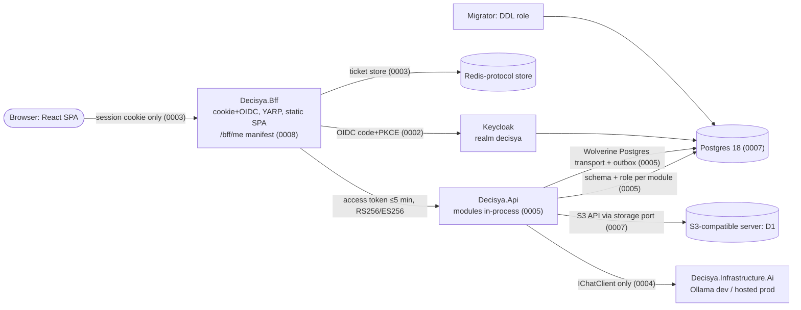

# Architecture note – ADR-0001..0009 acceptance review (issue #14)

## Context

Issue #14 (0.02) is done when the ADR index links all nine ADRs 0001-0009 with status Accepted. ADR-0006 and ADR-0009 are already Accepted. ADR-0010 (Accepted) is outside the "nine". This note reviews the seven Proposed ADRs (0001, 0002, 0003, 0004, 0005, 0007, 0008). They were written on 2026-09-20, and the review checks them against:

- the repository on branch `issue/14-accept-adrs`: `CLAUDE.md`, the Accepted ADRs, `docs/PHASE-0.md`, `src/`, `Directory.Packages.props`, `.devcontainer/engine/images.Dockerfile`, `docs/architecture/**` and `docs/security/**`;
- external facts that may have changed since 2026-09-20.

**This round is review only.** No ADR or index file is changed. Marco decides each item below. The architect applies the edits in round 2. The Proposed ADRs have never been accepted, so round 2 edits them in place, without amendment sections.

**Sources and confidence.** Repository facts are marked **verified** with the file they come from. External facts are marked **per orchestrator, unverified** (from the orchestrator's brief) or **architect knowledge** (training data up to mid-2026, not checked against a live source in this session), each with a confidence level. I had no web access or `gh` in this session.

**Repository baseline, verified:**

- `docs/PHASE-0.md` is a placeholder with no content, so it could not be checked against.
- `src/` holds only `Decisya.AppHost` (an empty `AppHost.cs`), `Decisya.ServiceDefaults` and `Decisya.SharedKernel` (Money and Clock). There is no module, no `Decisya.Api`, no BFF, no `Decisya.Web`, no `deploy/` and no `tests/Decisya.ArchitectureTests`.
- `.claude/scripts/prereqs.py` names the issues expected to deliver the missing pieces:
  - `Decisya.Api`: #20 (0.08);
  - `ITenantScoped`, `TenantDbContext` and `ArchitectureTests`: #22 (0.10);
  - the SPA: #26 (0.14);
  - `[Sensitive]`: #15 (0.03);
  - the Compose stack and ZAP: 0.16, per `ci.yml`.
- So every "Enforced by" line in the Proposed ADRs describes a future test. That is acceptable for an ADR, but each line should name the test and the issue that delivers it.

## Summary

| ADR | Recommendation | Decision needed from Marco |
| --- | --- | --- |
| 0001 Multi-tenant, single instance | ACCEPT WITH AMENDMENTS | D6: tenant claim mechanism (defer to #22, rule out realm-per-tenant). D10: record Postgres RLS as a deferred option. |
| 0002 Keycloak | ACCEPT WITH AMENDMENTS | D6: tenant claim. D7: client authentication (secret vs `private_key_jwt`). |
| 0003 BFF + Redis ticket store | ACCEPT WITH AMENDMENTS | D5: BFF as its own host or co-hosted in the API. |
| 0004 Vendor-neutral AI | ACCEPT WITH AMENDMENTS | D3: when pgvector enters the Postgres image. |
| 0005 Modular monolith + Wolverine | ACCEPT WITH AMENDMENTS | D8: what "hybrid" means. D9: a migrator process owns DDL, including Wolverine storage. |
| 0007 Postgres, Redis, S3 | ACCEPT WITH AMENDMENTS (the most substantive) | D1: object-storage server (MinIO). D2: pin Postgres 18 and one image. D4: Redis or Valkey. |
| 0008 React SPA + capability manifest | ACCEPT WITH AMENDMENTS | D5 (shared with 0003). |
| Index `docs/adr/README.md` | Fix in round 2 | D11: the date convention on acceptance. |

No Proposed ADR contradicts an Accepted ADR (0006, 0009, 0010) or a `CLAUDE.md` invariant in a way that needs a new ADR. The contradictions found are silences or stale wording, and in-place amendments fix them. The largest one is in ADR-0005: Wolverine and EF provision storage at startup by default, which collides with "the API process cannot DROP or ALTER".

## C4 excerpt (the platform as the seven ADRs describe it, after the amendments)

## ADR-0001: Multi-tenant model, single-instance deployment

**Recommendation: ACCEPT WITH AMENDMENTS.**

**Contradictions**

- Wording drift, not a conflict:
  - The ADR says "every entity implements ITenantScoped".
  - `CLAUDE.md` invariant 1 says "every persisted aggregate".
  - The `module-scaffold` skill says "every `Domain` entity".
  - Recommendation: the ADR takes the strict form, "every entity type in a module `DbContext` model". That includes `CLAUDE.md` and is testable.
- The ADR doesn't mention the `[AllowCrossTenant]` escape hatch from invariant 1.
- "Docker Compose from the Aspire manifest" is dated wording (architect knowledge, medium-high confidence). Since Aspire 9.x the path is Aspire's Docker Compose publishing (`Aspire.Hosting.Docker`, `aspire publish`). The JSON manifest is legacy. Verify this in the 0.16 deployment issue.
- The ADR bundles two decisions: the tenancy model and the hosting ladder. Acceptable, but the title should say so. The current title does.

**Missing "Enforced by"**

- "NetArchTest rule (every entity implements ITenantScoped)" is weaker than it should be. NetArchTest sees types, not the EF model. The strong check is a model test over `DbContext.Model.GetEntityTypes()`.
- Nothing enforces the escape-hatch rule. NetArchTest can't see method calls. A concrete, cheap mechanism:
  - ban `IgnoreQueryFilters` in `BannedSymbols.txt` (RS0030 is already an error);
  - require the suppression only inside `[AllowCrossTenant]` types, checked by a test.

**Missing consequences**

- Tenancy covers every store, not only EF: Redis keys, object keys, Wolverine envelopes and logs (`tenant_id` is already in the `CLAUDE.md` observability principles).
- Per-tenant export and deletion (GDPR) span every schema and the object store. Backups keep a deleted tenant's data until they rotate.
- Noisy neighbour: one tenant's load affects all tenants on one VPS.

**Exact text changes**

- Context, append: "Isolation must hold in every store the platform uses: Postgres, Redis, object storage, Wolverine messages and logs."
- Considered options, append:
  `4. **Shared schema plus Postgres row-level security** — database-level defence in depth; needs a per-connection tenant setting that complicates pooling. Deferred, not rejected (revisit before the first external tenant).` (only if D10 = A)
- Decision outcome, replace the line with:
  `Chosen option: **Shared schema with TenantId and EF Core global query filters, deployed as one VPS running Docker Compose generated by Aspire's Docker Compose publishing**, because it gives SaaS and self-hosting one code path at the lowest operating cost.`
- Consequences, add under Bad:
  - `Bad: Every non-EF store carries the tenant too: Redis and object-storage keys are prefixed with the tenant id, Wolverine messages carry it on the envelope (ADR-0005), logs carry tenant_id`
  - `Bad: Cross-tenant reads exist only in [AllowCrossTenant]-attributed, audited admin handlers`
  - `Bad: Tenant export and deletion span every module schema and the object store; backups hold deleted tenants' data until rotation`
- Replace "Enforced by" with:
  `Enforced by: Decisya.ArchitectureTests (#22): every entity type in every module DbContext model implements ITenantScoped and has a tenant query filter; IgnoreQueryFilters is banned in BannedSymbols.txt and its suppression is allowed only in [AllowCrossTenant] types (test); per-module two-tenant isolation tests (isolation-test skill, Testcontainers Postgres)`

## ADR-0002: Keycloak as sole identity provider

**Recommendation: ACCEPT WITH AMENDMENTS.**

**Contradictions and repository facts**

- The ADR is consistent with ADR-0001 (a single realm `decisya`). It doesn't say how the tenant reaches the token ("tenant attribute as a claim" appears only in the options).
- **Verified:** `Aspire.Hosting.Keycloak` is pinned at `13.5.4-preview.1.26464.4` (`Directory.Packages.props`, whose comment says it ships only as a preview). Accepting Keycloak therefore means accepting a preview hosting integration in the AppHost. That's low risk because it's dev-time only, but it should be written down.
- **Verified:** `Testcontainers.Keycloak` 4.15.0 is in the props file. The sandbox engine can run only images from `.devcontainer/engine/images.Dockerfile`, which holds Postgres only. Keycloak integration tests therefore need a host-session edit to that file in the first issue that uses them. That's consistent with ADR-0010, but it's a missing consequence.
- **Verified:** `deploy/keycloak` doesn't exist yet, so "Enforced by" names a future artifact.
- **Invariant 5 risk:** a full Keycloak realm export includes the confidential client's secret (architect knowledge, high confidence). Committing it as-is would violate "no secrets in source". The ADR must say the export uses placeholders.

**External facts (architect knowledge)**

- Keycloak is Apache-2.0 and a CNCF incubating project (since 2023). High confidence.
- No licence change is known. Red Hat's commercial product is a separate build ("Red Hat build of Keycloak"). High confidence.
- The 26.x line added Organizations (GA in 26.0, late 2024), a first-class way to model tenants inside one realm. Medium-high confidence.
- The latest version as of 2026-09 is unknown to me (26.x or later). Low confidence. Pin the image by digest when first used.
- Keycloak's default access-token lifespan is 5 minutes, which matches the `CLAUDE.md` rule "internal JWTs ≤ 5 min". High confidence.
- None of these facts blocks acceptance.

**Missing "Enforced by"**

- The realm settings the security principles rely on are not tested:
  - PKCE S256;
  - access-token lifespan ≤ 300 s;
  - signature algorithm RS256 or ES256;
  - audience and tenant mappers;
  - brute-force detection;
  - the OTP and password policies.

**Missing consequences**

- Keycloak needs its own Postgres database and role (not dev-mode H2 outside dev). That database is part of the backup and the restore drill (ADR-0007).
- Keycloak upgrades and re-testing the realm are ours to run.

**Exact text changes**

- Decision outcome, replace with:
  `Chosen option: **Keycloak (Apache-2.0), single realm decisya, confidential client decisya-bff using authorization code with PKCE (S256); the tenant reaches tokens as a tenant_id claim (mechanism decided in #22, realm-per-tenant ruled out); Keycloak stores its data in its own Postgres database and role**`
  (the wording follows D6 and D7)
- Add under Bad:
  - `Bad: Aspire.Hosting.Keycloak is preview-only (13.5.4-preview); accepted for the AppHost, re-checked on each Aspire bump`
  - `Bad: Keycloak's database is part of backup and the restore drill (ADR-0007); Keycloak upgrades re-run the realm tests`
  - `Bad: Keycloak integration tests in the agent sandbox need the Keycloak image added to .devcontainer/engine/images.Dockerfile (ADR-0010) by the first issue that uses them`
- Replace "Enforced by" with:
  `Enforced by: Realm export under deploy/keycloak with every secret replaced by a placeholder injected from the environment, scanned by gitleaks in CI; a realm-configuration test (Testcontainers.Keycloak, Category=Integration) asserting PKCE S256 on decisya-bff, access-token lifespan ≤ 300 s, RS256/ES256 signing, tenant_id and audience mappers, brute-force detection, OTP and password policy`

## ADR-0003: BFF session pattern with Redis ticket store

**Recommendation: ACCEPT WITH AMENDMENTS.**

**Contradictions**

- No conflict with `CLAUDE.md`. The cookie flags match the security principles word for word.
- One ambiguity: the `CLAUDE.md` rule on internal JWTs (≤ 5 min, `iss`/`aud`/`exp`, alg allow-list) implies a hop from BFF to API. The option text mentions YARP, but the ADR never says whether the BFF is a separate host, or which token crosses the hop. That is D5.
- **Verified:** `Yarp.ReverseProxy` 2.3.0, `Microsoft.AspNetCore.Authentication.OpenIdConnect` and `JwtBearer` are in the props file. No Data Protection persistence package is present yet.

**External facts (architect knowledge)**

- Duende BFF has needed a commercial licence since v3, with a free Community Edition under a revenue threshold. Medium-high confidence.
- The ADR's wording, "licensing conditions apply above a revenue threshold", is still accurate.

**Missing consequences** (all are ours to own because the BFF is hand-rolled)

- **Data Protection key ring:** it must be persisted and shared, or every deploy signs everyone out. The Redis ticket must be protected with Data Protection, not stored as plain serialized tokens.
- **Redis is on the login path:** an outage signs everyone out. Redis needs authentication, and TLS when it runs off-host.
- **Refresh concurrency:** parallel requests can replay a rotated refresh token. This needs a per-session lock.
- **CSRF:** SameSite=Strict plus a required custom header on state-changing proxied calls (defence in depth).
- **Logout:** RP-initiated logout plus Keycloak back-channel logout that deletes the ticket.

**Missing "Enforced by"**

- There is no test for:
  - back-channel logout;
  - concurrent refresh;
  - the CSRF header;
  - rejection of `alg: none`, HS256, a wrong `aud` or an expired token;
  - ZAP (0.16).

**Exact text changes**

- Option 2, replace with: `2. **Duende BFF** — mature, but a commercial licence is required above the Community Edition revenue threshold.`
- Decision outcome, replace with (if D5 = A):
  `Chosen option: **Hand-rolled BFF in its own host (Decisya.Bff): ASP.NET Core cookie + OpenID Connect handlers, an ITicketStore in Redis protected with Data Protection, and YARP forwarding /api/* to Decisya.Api with the user's Keycloak access token attached server-side. The BFF serves the SPA's static files, so SPA and BFF share one origin.**`
- Add under Bad:
  - `Bad: Redis is on the login path; an outage signs every user out. Redis requires auth, and TLS when off-host (ADR-0007)`
  - `Bad: The Data Protection key ring is persisted and shared, or each deploy invalidates all sessions`
  - `Bad: Refresh-token rotation needs a per-session lock against concurrent refreshes; logout needs RP-initiated and back-channel logout`
  - `Good: The API only ever sees a Keycloak access token (lifespan ≤ 5 min, ADR-0002), validated for iss, aud, exp and the RS256/ES256 allow-list`
- Replace "Enforced by" with:
  `Enforced by: Integration tests (Testcontainers Redis + Keycloak): session cookie HttpOnly/Secure/SameSite=Strict and correlation/nonce Lax; no access, refresh or id token in any browser-visible body, header or cookie; refresh under concurrent requests; back-channel logout deletes the ticket; CSRF header required on state-changing calls; the API rejects alg none, HS256, expired and wrong-aud tokens. ZAP baseline in CI (0.16)`

## ADR-0004: Vendor-neutral AI via Microsoft.Extensions.AI

**Recommendation: ACCEPT WITH AMENDMENTS.**

**Contradictions and repository facts**

- **Verified:** `Microsoft.Extensions.AI` 10.10.0 is in the props file. No provider package, no Ollama integration and no pgvector package is present. `Decisya.Infrastructure.Ai` doesn't exist yet.
- **pgvector vs the pinned image, verified:**
  - The sandbox's only test image is `postgres:18-alpine` (`.devcontainer/engine/images.Dockerfile`, PR #51).
  - The official `postgres` image doesn't ship the pgvector extension (architect knowledge, high confidence).
  - "Embeddings local with pgvector" therefore can't run on the pinned image. The first embedding issue must switch the image in all places together (for example to a `pgvector/pgvector:*-pg18` build, which I believe is Debian-based; medium confidence) and replace the sandbox image list. See D3.
- **Sandbox (ADR-0010):** the sandbox can't reach Ollama or any provider (egress allow-list). AI tests inside it must use a fake `IChatClient`. That's consistent with invariant 2, but it's a missing consequence.
- **The ADR doesn't cite the invariants it carries.** `CLAUDE.md` invariants 2 (graceful degradation), 3 (no vendor SDK outside `Decisya.Infrastructure.Ai`) and 6 (disclaimer, no advice) are this ADR's rules. Only invariant 3 has an "Enforced by" line.

**External facts (architect knowledge)**

- Microsoft introduced the Microsoft Agent Framework (October 2025) as the successor to Semantic Kernel and AutoGen, built on `Microsoft.Extensions.AI`. Medium-high confidence.
- Option 2 should mention it. It doesn't change the decision.
- The `Microsoft.Extensions.AI.Ollama` preview package was deprecated in favour of OllamaSharp, which implements `IChatClient`. Medium-high confidence. OllamaSharp counts as a provider package and belongs only in `Decisya.Infrastructure.Ai`.

**Missing "Enforced by"**

- Invariant 2 needs two checks:
  - an architecture rule that the deterministic modules don't reference `Microsoft.Extensions.AI*`;
  - a degraded-path test per AI feature.
- Invariant 6 needs a disclaimer test.
- Invariant 3's test needs a concrete deny list.

**Missing consequences**

- Financial data leaves the platform with a hosted provider. That needs:
  - a recorded provider, region and retention per provider;
  - tenant opt-in;
  - data minimisation (no raw transaction descriptions by default);
  - transaction text treated as untrusted input (prompt injection).
- BYO keys are tenant secrets: encrypted at rest, `[Sensitive]`, never logged.
- The monthly cap is metered by Decisya, not only by the provider.
- Local embeddings in prod need a CPU and RAM budget on the VPS.

**Exact text changes**

- Option 2, replace with: `2. **Semantic Kernel / Microsoft Agent Framework** — orchestration heavier than needed today; both build on Microsoft.Extensions.AI, so adopting one later does not reverse this decision.`
- Decision outcome, replace with:
  `Chosen option: **Microsoft.Extensions.AI (IChatClient, IEmbeddingGenerator) as the only AI surface for application code; provider packages (including OllamaSharp) only in Decisya.Infrastructure.Ai; Ollama on the host in dev; in prod a hosted provider with a Decisya-metered monthly cap plus tenant BYO key; embeddings generated locally and stored in Postgres with pgvector, introduced by the first issue that needs embeddings (it changes the pinned Postgres image, ADR-0007)**`
- Add under Bad:
  - `Bad: A hosted provider receives financial data: provider, region and retention are recorded per provider, tenants opt in, prompts carry the minimum data, and transaction text is treated as untrusted input`
  - `Bad: BYO keys are tenant secrets, encrypted at rest and marked [Sensitive]`
  - `Bad: pgvector is not in the official postgres image; the embedding issue switches the image for AppHost, Testcontainers and the sandbox list together`
  - `Bad: The agent sandbox cannot reach any model; AI tests there use a fake IChatClient (ADR-0010)`
  - `Invariants: CLAUDE.md invariants 2, 3 and 6 are the rules of this ADR`
- Replace "Enforced by" with:
  `Enforced by: Decisya.ArchitectureTests: no assembly except Decisya.Infrastructure.Ai references a vendor AI assembly (deny list kept in the test: OpenAI, Azure.AI.*, Anthropic*, OllamaSharp, Google.GenAI, Mistral*, AWSSDK.BedrockRuntime); the deterministic modules (ledger, budgets, forecasts, alerts) do not reference Microsoft.Extensions.AI*. Per AI feature: a test with IChatClient unavailable asserting the degraded response, and a test that the response carries the standard disclaimer`

## ADR-0005: Hybrid modular monolith with Wolverine

**Recommendation: ACCEPT WITH AMENDMENTS.**

**Contradictions**

- **Least privilege (`CLAUDE.md` security principle: "the API process cannot DROP or ALTER"):**
  - By default, Wolverine creates and updates its message-storage tables at startup (`AutoBuildMessageStorageOnStartup`). Architect knowledge, high confidence.
  - Applying EF migrations from the API process needs DDL as well. `prereqs.py` names `Decisya.Api` as the "migrations startup project", which is fine for *design-time* `dotnet ef` but must not become runtime `Migrate()`.
  - The ADR is silent on this. It isn't an ADR-level contradiction yet, but without an amendment the first messaging issue will ship the default. See D9.
- **Tenancy (invariant 1):** the ADR doesn't say how the tenant crosses the bus. A handler that resolves a `DbContext` without a tenant either fails or, worse, runs unfiltered.
- **"Hybrid" is undefined** (see D8). It appears in the title, `CLAUDE.md`, the architect agent and `module-scaffold`, but nowhere is it defined.
- **"Proven in PortfolioTracker"** is an external reference that can't be verified from this repository. Reword it as the author's experience.
- **Verified:**
  - `WolverineFx` and `WolverineFx.Postgresql` 6.39.1 are in the props file.
  - The EF Core outbox integration (`WolverineFx.EntityFrameworkCore`, architect knowledge) isn't. Its addition needs the one-line PR justification.
  - `NetArchTest.Rules` 1.3.2 is in use (`ModuleClockUsageRule`). I believe 1.3.2 (2021) is its last release (medium confidence). That isn't a blocker, but if it breaks on .NET 10 metadata the switch (to a maintained fork or ArchUnitNET) needs an ADR.

**External facts, Wolverine licensing (architect knowledge)**

- Wolverine (JasperFx) core packages are MIT. JasperFx sells support and separate commercial tooling (for example CritterWatch). Medium-high confidence up to mid-2026.
- In 2025, MediatR and AutoMapper (Lucky Penny Software) and MassTransit v9 moved to commercial licences. High confidence for MediatR and AutoMapper, medium-high for MassTransit. That strengthens this decision and belongs in the considered options.
- I can't confirm the licence of 6.39.1 itself. Marco should check the licence field of `WolverineFx` 6.39.1 on nuget.org before accepting (one click).

**Missing "Enforced by"**

- Contracts purity: Contracts reference only SharedKernel and other Contracts.
- The schema-per-module check is named ("EF schema per module") but not specified.
- A database role test: a module role can't read another schema, and the API role can't run DDL.
- A test that a message without a tenant is rejected.

**Missing consequences**

- The DDL owner (a migrator).
- The schema and grants for Wolverine's storage.
- Tenant propagation.
- The outbox package.

**Exact text changes**

- Context, append (per D8 = A):
  `"Hybrid" means: all modules run in one process against one database; a module reads another module only through synchronous query interfaces in its Contracts assembly and reacts to it only through Wolverine messages; because the Contracts assembly and the message are the only coupling, a module can later move to its own host without changing its callers.`
- Option 3, replace "— proven in PortfolioTracker." with "— the author has shipped this shape before (PortfolioTracker, outside this repository)."
- Considered options, append:
  `4. **MediatR + MassTransit** — both moved to commercial licences in 2025; Wolverine covers mediator and durable messaging in one MIT library.`
- Decision outcome, replace with:
  `Chosen option: **Modular monolith with Wolverine: Modules.<Name> + Modules.<Name>.Contracts, one Postgres schema and one DB role per module, Wolverine as in-process mediator and as durable bus over the Postgres transport with the EF Core transactional outbox**`
- Add under Bad:
  - `Bad: DDL is owned by a migrator process with its own role: EF migrations and Wolverine message storage are created there; the API runs with DML-only roles and Wolverine auto-provisioning off outside local dev (CLAUDE.md least privilege)`
  - `Bad: The tenant crosses the bus on the Wolverine envelope; handler middleware sets the tenant before any DbContext resolves; a message without a tenant fails unless its handler is [AllowCrossTenant] (ADR-0001)`
  - `Bad: Wolverine storage lives in its own schema; each module role gets only the grants it needs there`
- Replace "Enforced by" with:
  `Enforced by: NetArchTest in each module's tests and Decisya.ArchitectureTests (#22): no module references another module's implementation assembly; Contracts assemblies reference only SharedKernel and other Contracts and contain no EF Core or handler types. EF model test: every entity maps to its module's schema. Testcontainers role test: a module role cannot read another module's schema; the API role cannot CREATE, ALTER or DROP. Wolverine test: a message without a tenant is rejected`

## ADR-0007: Postgres, Redis, S3-compatible storage only

**Recommendation: ACCEPT WITH AMENDMENTS.** The amendments depend on D1, D2 and D4.

### Object storage: MinIO

**Verified in the repository:**

- `CLAUDE.md` line 4 lists "MinIO" in the stack.
- ADR-0007 names it only in option 3 ("MinIO/S3"). Its decision line already says "S3-compatible object storage".
- No MinIO or S3 package is in `Directory.Packages.props`.
- No object-storage image is in `images.Dockerfile`.
- So nothing is built on MinIO yet, and changing course now costs nothing.

**Per orchestrator, unverified here:**

- MinIO's community edition removed the admin console in 2025.
- It stopped publishing community binaries and container images in late 2025.
- Its repository was then put into maintenance mode.

My own knowledge agrees with the first two points (medium-high confidence) and weakly with the third (medium). MinIO is AGPLv3. Accepting "MinIO" would pin an unmaintained component, or force us to build it from source and own its CVEs.

**Options (Marco decides, D1):**

| Option | Licence (architect knowledge) | For | Against |
| --- | --- | --- | --- |
| **A. S3 API is the contract; the server is chosen by the first storage issue, with its own short ADR and a conformance test** (recommended) | n/a | No decision without a use case. Prod can be any S3-compatible service (self-hosted or a provider's object storage) without touching code. Matches the ADR's portability driver. | The dev/test server stays open until the storage issue. `CLAUDE.md` gets a neutral wording. |
| B. SeaweedFS now | Apache-2.0 (high) | Mature, broad S3 coverage, active | More moving parts (master, volume, filer and S3 gateway, or the all-in-one `server` mode) |
| C. Garage now | AGPL-3.0 (high) | Small single binary, simple single-node setup, active | Partial S3 surface: no object versioning or object lock, limited bucket policies (medium confidence) |
| D. RustFS now | Apache-2.0 (medium) | Aims at MinIO compatibility, including the console | Young project, maturity and security track record unproven (medium confidence) |
| E. Keep MinIO (last community image, a source build or a third-party fork) | AGPL-3.0 | Best-known S3 behaviour | Unmaintained upstream; we own patching. Not recommended. |

Recommendation: **A**. If Marco wants a name now, choose **B (SeaweedFS)** for its licence and maturity, with Garage as the lighter fallback.

Whatever the server, one fact applies (architect knowledge, medium-high confidence): since early 2025 the AWS SDKs send flexible checksums by default, which broke several S3-compatible servers. The S3 client must set request checksum calculation to "when required", and the conformance test must cover uploads, including multipart and presigned URLs.

### Postgres major version

**Verified:**

- `.devcontainer/engine/images.Dockerfile` pins `docker.io/library/postgres:18-alpine@sha256:77f58511…` (PR #51). It is the sandbox's only test image, and the sandbox can't pull any other.
- `docs/architecture/agent-sandbox-docker-sidecar.md` (lines 242, 344, 451) still says `postgres:17-alpine`. That's stale since PR #51.
- `AppHost.cs` adds no resource yet, so the AppHost image isn't chosen.
- `Testcontainers.PostgreSql` 4.15.0 is in the props file.
- A test that uses any tag other than `postgres:18-alpine` fails inside the sandbox.

**Architect knowledge:**

- PostgreSQL 18 was released in September 2025 and is supported until about November 2030. High confidence.
- The official 18 image moved its data directory (`PGDATA` under `/var/lib/postgresql/18/docker`, volume at `/var/lib/postgresql`). Medium confidence. Any data-volume mount (Aspire `WithDataVolume`, Compose) must be checked in the AppHost issue.
- I don't know Aspire 13.5's default Postgres tag (low confidence), so the AppHost must set it explicitly.
- Alpine (musl) and Debian (glibc) libc collations differ (high confidence). Tests on alpine and prod on Debian can sort text differently.

**Recommendation (D2 = A):** ADR-0007 pins **PostgreSQL major 18 and one image reference, `postgres:18-alpine`, for the AppHost, Testcontainers, the sandbox list and the Compose output**. Only the digest bumps without an ADR change. A major bump or an image change (pgvector, D3) changes all of them in one PR. ADR-0007 is the right home because it's the storage ADR, and a separate ADR would be overhead. ADR-0009 isn't the right home: it pins the framework, not infrastructure.

### Redis

Architect knowledge, high confidence:

- Redis moved to RSALv2/SSPL in 2024.
- Redis 8 (2025) added AGPLv3 as a third licence option.
- Valkey (Linux Foundation, BSD-3) is the protocol-compatible fork, and managed providers widely offer it.
- Aspire has a Valkey hosting integration. Medium-high confidence.

Neither choice blocks acceptance. Wording the ADR as "a Redis-protocol store" keeps both open (D4).

### Other findings

**Missing consequences**

- The restore drill must cover every Postgres database (module schemas and Keycloak), the object store, and Redis if sessions are to survive a restore.
- Postgres major upgrades are deliberate.
- The collation point above.
- The S3 checksum point above.

**Missing "Enforced by"**

- The single image reference.
- The S3 client confined to a storage adapter.
- A storage conformance test.

"Compose manifest from Aspire" is dated wording (see ADR-0001).

**Exact text changes** (written for D1 = A, D2 = A, D4 = A)

- Option 3, replace with: `3. **Postgres, a Redis-protocol store, S3-compatible object storage** — portable everywhere.`
- Considered options, append:
  `4. **MinIO as the object-storage server** — rejected: the community edition lost its admin console (2025), stopped publishing binaries and images (late 2025) and is in maintenance mode.`
- Decision outcome, replace with:
  `Chosen option: **PostgreSQL 18, one image reference (postgres:18-alpine, pinned by digest) for AppHost, Testcontainers, the agent-sandbox image list and Compose; a Redis-protocol store (Redis 8 now, Valkey as drop-in); object storage through the S3 API only, behind a storage port whose S3 client lives in one infrastructure adapter. The self-hosted S3 server is chosen by the first storage issue in its own ADR, with a conformance test.**`
- Add under Bad:
  - `Bad: A Postgres major upgrade or image change is an ADR change and moves all image references in one PR; only digests bump freely`
  - `Bad: Backup and the restore drill cover every Postgres database (modules and Keycloak), the object store, and Redis if sessions must survive`
  - `Bad: S3-compatible servers differ from AWS: the S3 client sends checksums only when required, and the conformance test covers multipart and presigned URLs`
- Replace "Enforced by" with:
  `Enforced by: Compose generated by Aspire's Docker Compose publishing (0.16); restore drill at phase exit covering all stores above; a test that the Postgres image reference in the AppHost, in Decisya.TestInfrastructure and in .devcontainer/engine/images.Dockerfile is the same repository:tag; an architecture test that only the storage adapter references the S3 client assembly; a Testcontainers storage conformance test against the chosen server`
- Follow-ups outside `docs/` (Marco, host session): `CLAUDE.md` line 4 "MinIO" becomes "S3-compatible object storage (ADR-0007)". That file is outside the architect's write scope and read-only in the sandbox.

## ADR-0008: React SPA behind the BFF with server-computed capability manifest

**Recommendation: ACCEPT WITH AMENDMENTS.**

**Contradictions**

- None with `CLAUDE.md`.
- `IEntitlementService` has no home. Under ADR-0005 it must live in a module's `Contracts` (the `module-scaffold` skill already uses "the entitlements module" as its example), never in the BFF.
- The ADR assumes the BFF serves or fronts the SPA. That assumption is shared with ADR-0003 (D5).
- Option 2's reason ("React is the chosen frontend for real products") is a preference, not a reason. Reword it honestly.

**Missing "Enforced by"**

- "Entitlement tests on the API" doesn't prevent a *new* endpoint from shipping without a policy. An endpoint-metadata test that enumerates every endpoint does.
- The Playwright line doesn't mention both browser projects (`CLAUDE.md`: Firefox and Chromium; `ci.yml` installs both). **Verified.**

**Missing consequences**

- The manifest can be stale after a plan change.
- The entitlement logic runs in two places and must share one implementation.
- Same-origin hosting is what keeps SameSite=Strict and a strict CSP workable.

**Exact text changes**

- Option 2, replace with: `2. **Blazor** — one language, but React/Vite/Playwright is the frontend stack Marco targets for the product; rejected for product and skills reasons, not technical ones.`
- Decision outcome, replace with:
  `Chosen option: **React SPA (Vite) served by the BFF on the same origin; GET /bff/me returns a capability manifest computed server-side by IEntitlementService (declared in the entitlements module's Contracts); every API endpoint enforces the same entitlement through an authorization policy**`
- Add:
  - `Good: One origin keeps SameSite=Strict working and allows a strict CSP`
  - `Bad: The manifest can be stale after a plan change: short cache, and the SPA re-fetches /bff/me on 403`
  - `Bad: Manifest and endpoint policy must share one IEntitlementService implementation`
- Replace "Enforced by" with:
  `Enforced by: An endpoint-metadata test enumerates every endpoint under /api and fails unless it requires authorization and carries an entitlement policy or an explicit no-entitlement marker; API tests that a tenant without the capability gets 403 on direct calls; a contract test on the /bff/me manifest schema; Playwright (Firefox and Chromium) checks gated routes are hidden and a forced navigation shows the denial page`

## Index check: `docs/adr/README.md`

**Verified:**

- The index lists 0001-0010 in order.
- Titles match each file's H1 exactly.
- Dates match each file's `Date:` line.
- Statuses match: 0006, 0009 and 0010 are Accepted, the rest are Proposed.

**Gap:** the table has **no links**. The Done-when says "links all nine". Round 2 makes the number (or title) a relative link, for example `[0001](0001-multi-tenant-single-instance.md)`, for all ten rows. ADR-0010 is linked too, for consistency.

If the amendments change a title (none of the recommended ones do), the index title changes with it.

## NetArchTest rules to add

These are for test-engineer, in the issues named. Nothing is implemented in #14.

| Rule | Assemblies | Test class (proposed) | ADR / issue |
| --- | --- | --- | --- |
| Every entity type in each module `DbContext` implements `ITenantScoped` and has a tenant filter (EF model test) | `Decisya.Modules.*` | `Decisya.ArchitectureTests.TenancyModelTests` | 0001 / #22 |
| `IgnoreQueryFilters` suppression only in `[AllowCrossTenant]` types | all `src` | `Decisya.ArchitectureTests.CrossTenantTests` | 0001 / #22 |
| No module references another module's implementation | `Decisya.Modules.*` | `ModuleBoundaryTests` (exists in the scaffold spec) | 0005 / #22 |
| Contracts reference only SharedKernel and Contracts; no EF or handler types | `Decisya.Modules.*.Contracts` | `ModuleBoundaryTests` | 0005 / #22 |
| No vendor AI assembly outside `Decisya.Infrastructure.Ai` | all `src` | `Decisya.ArchitectureTests.AiBoundaryTests` | 0004 / first AI issue |
| Deterministic modules don't reference `Microsoft.Extensions.AI*` | ledger, budgets, forecasts, alerts modules | `AiBoundaryTests` | 0004 / first of those modules |
| Only the storage adapter references the S3 client | all `src` | `Decisya.ArchitectureTests.StorageBoundaryTests` | 0007 / storage issue |

Non-NetArchTest checks (integration and config tests) are listed in each ADR's "Enforced by" text above.

## Decisions for Marco

Each decision lists the recommended option first.

1. **D1: Object-storage server (ADR-0007, `CLAUDE.md` stack line).**
   - A: the S3 API is the contract; the server is chosen in the first storage issue with its own ADR and a conformance test; `CLAUDE.md` says "S3-compatible object storage".
   - B: SeaweedFS now.
   - C: Garage now.
   - D: RustFS now.
   - E: keep MinIO (not recommended).
2. **D2: Postgres pin (ADR-0007).**
   - A: pin major 18 and the single image `postgres:18-alpine` (by digest) for the AppHost, Testcontainers, the sandbox list and Compose; a major or image change is an ADR change.
   - B: pin major 18, but the Debian image for the AppHost and prod (accepts the collation drift against sandbox tests).
   - C: no pin in any ADR.
3. **D3: pgvector timing (ADR-0004, ADR-0007).**
   - A: defer to the first embedding issue, which switches the image everywhere at once.
   - B: switch now to a pgvector pg18 image (needs a host-session edit to `images.Dockerfile` and drops alpine).
4. **D4: Redis wording (ADR-0007, ADR-0003).**
   - A: "a Redis-protocol store; Redis 8 now, Valkey as a drop-in".
   - B: Valkey now.
   - C: Redis only.
5. **D5: BFF topology (ADR-0003, ADR-0008).**
   - A: its own host `Decisya.Bff` (cookie, OIDC, ticket store, YARP, static SPA) in front of `Decisya.Api`, which accepts only bearer tokens.
   - B: the BFF co-hosted in `Decisya.Api`, which makes the "internal JWT" hop in `CLAUDE.md` moot.
6. **D6: Tenant in the token (ADR-0001, ADR-0002).**
   - A: a single realm and a `tenant_id` claim; choose Keycloak Organizations or a user attribute in #22; rule out realm-per-tenant now.
   - B: decide Organizations now.
   - C: realm per tenant (contradicts ADR-0001's single-realm model).
7. **D7: BFF client authentication at Keycloak (ADR-0002).**
   - A: a client secret from environment or user-secrets now, with PKCE; revisit `private_key_jwt` before the first external tenant.
   - B: `private_key_jwt` now.
8. **D8: Meaning of "hybrid" (ADR-0005).**
   - A: the definition proposed above: one process and one database, Contracts queries plus Wolverine messages, each module movable to its own host later.
   - B: Marco supplies a different definition.
   - C: drop "hybrid" from the title and from `CLAUDE.md`.
9. **D9: DDL ownership (ADR-0005).**
   - A: a migrator process with a DDL role applies EF migrations and creates Wolverine storage; the API runs DML-only with Wolverine auto-provisioning off outside local dev.
   - B: auto-provision in dev and CI only, with the prod mechanism decided at 0.16. That's weaker, and it risks shipping the default.
10. **D10: Postgres row-level security (ADR-0001).**
    - A: record it as a deferred option (defence in depth, revisit before the first external tenant).
    - B: adopt it now.
    - C: don't mention it.
11. **D11: Date convention on acceptance (all seven).**
    - A: keep `Date:` as the proposal date (2026-09-20). The index Date column stays unchanged, and acceptance is visible in Status plus the #14 PR.
    - B: set `Date:` and the index to the acceptance date.
12. **D12: Stale `postgres:17-alpine` references in `docs/architecture/agent-sandbox-docker-sidecar.md`.**
    - A: a separate small docs issue (one issue per PR).
    - B: fix them in #14 as part of the ADR-0007 pin.
13. **D13: Licence spot checks before accepting.** Marco confirms two items on nuget.org and the Keycloak site (about one minute):
    - the `WolverineFx` 6.39.1 licence field (expected MIT);
    - that Keycloak is still Apache-2.0.

    Both are my knowledge, not verified in this session.

## Round 2 (applied)

Marco took every recommendation on 2026-09-25, relayed by the orchestrator. The decisions were D1 A, D2 A, D3 A, D4 A, D5 A, D6 A, D7 A, D8 A, D9 A, D10 A and D11 A. D12 is handled in a separate issue, so the stale `17-alpine` references are untouched here. D13: Marco confirmed the `WolverineFx` licence as MIT on nuget.org (latest 6.40.0).

The seven ADRs were Proposed, so they were edited in place. Each now has Status Accepted and keeps its proposal date of 2026-09-20 (D11). No acceptance date was added, because acceptance is recorded in Status and in the #14 PR.

| ADR | Changes applied |
| --- | --- |
| 0001 | Context: the isolation-in-every-store sentence. Option 4: RLS, deferred (D10). The decision line uses Aspire's Docker Compose publishing and says the tenant comes as a single-realm `tenant_id` claim, with realm-per-tenant ruled out (D6). Three Bad consequences: non-EF stores, `[AllowCrossTenant]`, export and deletion. New "Enforced by": EF model test, `IgnoreQueryFilters` ban, isolation tests. |
| 0002 | The decision line adds Apache-2.0, PKCE S256, a client secret from env or user-secrets (D7), the `tenant_id` claim with the mechanism decided in #22 (D6), and Keycloak's own database and role. Four Bad consequences: the preview Aspire integration, backup and upgrades, the sandbox image list, and `private_key_jwt` revisited before the first external tenant (D7). New "Enforced by": a placeholder realm export with gitleaks, and a realm-configuration test. |
| 0003 | Option 2 rewords the Duende licence. The decision line names the separate `Decisya.Bff` host (D5), a Redis-protocol ticket store protected with Data Protection (D4), YARP to `Decisya.Api`, and the same-origin SPA. One Good consequence: the API sees only a short-lived access token. Three Bad consequences: Redis on the login path, the key ring, and the refresh lock with back-channel logout. New "Enforced by". |
| 0004 | Option 2 adds the Microsoft Agent Framework. The decision line confines provider packages (including OllamaSharp) to `Decisya.Infrastructure.Ai`, adds Decisya-metered caps, and defers pgvector to the first embedding issue (D3). Four Bad consequences: data egress, BYO keys, pgvector and the image, the sandbox fake. New Invariants line: 2, 3 and 6. New "Enforced by": the vendor deny list, the deterministic-module rule, and degraded-path and disclaimer tests. |
| 0005 | Context: the definition of "hybrid" (D8). Option 3 rewords the PortfolioTracker reference. Option 4: MediatR and MassTransit, with the WolverineFx MIT confirmation (D13). The decision line adds the role per module and the EF Core outbox. Three Bad consequences: the migrator owns DDL and the API is DML-only (D9), the tenant on the envelope, Wolverine's storage schema. New "Enforced by". |
| 0007 | Option 3 uses the Redis-protocol wording (D4). Option 4: MinIO rejected (D1). The decision line pins PostgreSQL 18 with the single image `postgres:18-alpine` (D2), Redis 8 with Valkey as a drop-in (D4), and the S3 API behind a storage port with the server deferred to the storage issue (D1). Three Bad consequences: major upgrades, restore-drill scope, S3 checksums. New "Enforced by": the image-reference equality test, the S3 adapter rule, a conformance test. |
| 0008 | Option 2 rewords the Blazor reason. The decision line says the SPA is served by `Decisya.Bff` on the same origin (D5) and that `IEntitlementService` lives in the entitlements module's Contracts. One Good consequence (one origin) and two Bad (staleness, one implementation). New "Enforced by": the endpoint-metadata test, Playwright on Firefox and Chromium. |
| Index | Every row 0001-0010 links to its file. Statuses are all Accepted. Titles and the Date column are unchanged. |

<!-- gate: G2 | verdict: PASS | issue: #14 -->
