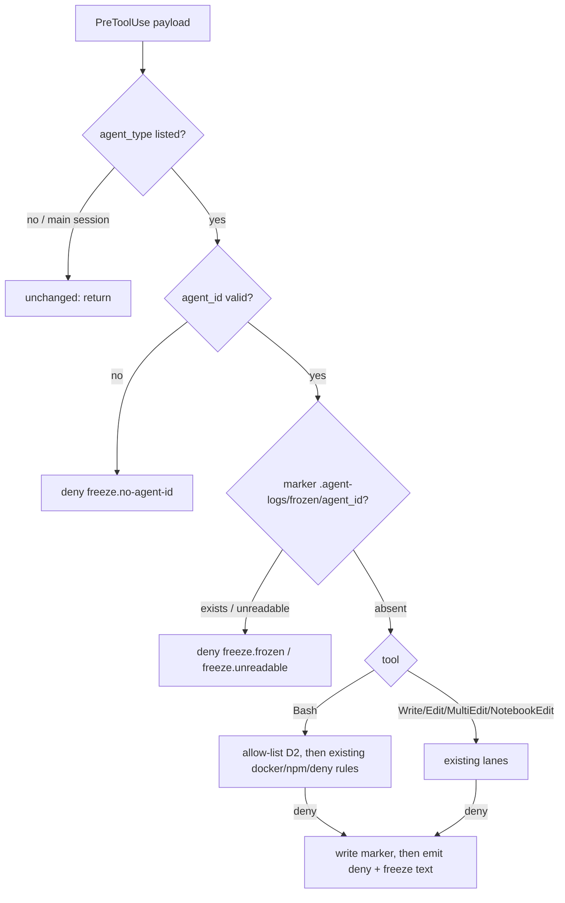

# Architecture note – Contain project agents: Bash allow-list, freeze on deny, stop-and-report (#114)

Requirements: `docs/requirements/phase-0/agent-containment.md` (G1). No module, contract,
cross-module dependency or runtime data flow changes, so there is no C4 or NetArchTest change. The
decisions below fix the hook mechanism for the main session (hook and `.claude/tests`) and for G3.
OS-level isolation stays out of scope (#83 comment 5978529569).

## D1 – Source of truth: the `tools:` line

Each agent's allowed Bash patterns are the `Bash(...)` entries on its `.claude/agents/<name>.md`
`tools:` line. `boundaries.json` gets no Bash list.

- The `tools:` line is what Marco reads, what the agent sees, and what Claude Code would enforce if
  it applied patterns to subagents. A second list in `boundaries.json` would be the same data
  twice, and lint would have to keep the two equal.
- Both files are in the shared deny (`.claude/**`), so an agent can't widen either one.
- **One parser:** add `bash_patterns(agent) -> list[str]` to `_hooklib`. It reads
  `.claude/agents/<agent>.md`. `agent` is already a `boundaries.json` key, validated by `NAME`, so
  the path join is safe. The function returns the `Bash(...)` bodies of the frontmatter `tools:`
  line. Lint already imports `_hooklib`, so it uses the same function. A missing file, a missing
  `tools:` line or a pattern that breaks the D2 grammar raises, so the hook fails closed with
  `deny-error`. An agent that declares no `Bash(...)` entry gets `[]`, and every Bash call it
  makes is denied.
- **Lint additions** (`lint.py`, numbered checks):
  - 10. Every `Bash(...)` entry parses under the D2 grammar.
  - 11. No bare `Bash` (unscoped) on any agent (T-02 recommendation c).
  - 12. A listed agent's tool names are a subset of {Read, Grep, Glob, Write, Edit, MultiEdit,
    NotebookEdit, Bash(...)}. This keeps the hook's matcher (`Write|Edit|MultiEdit|NotebookEdit|Bash`)
    sufficient for the freeze (D4). WebFetch, WebSearch, Agent/Task and `mcp__*` would bypass it.
  - 13. `wildcard_grant` also covers `aspire` and `pre-commit`, so a pattern has to name the verb.

## D2 – Pattern grammar and command handling

**Grammar.** A pattern body is either exact (no `*`) or ends in ` *`. The legacy `:*` suffix is
read as ` *`. No other `*` is allowed, and lint rejects anything else. Meaning:

- An exact pattern matches the command exactly.
- `prefix *` matches `prefix` alone or `prefix` + space + anything. So `git diff *` matches
  `git diff` and `git diff --stat`, but not `git difftool`.
- The no-space form `git diff*` (Claude Code reads it as matching `git difftool -x <cmd>`, which
  runs any program) is rewritten to ` *` in every agent file (D3) and is banned by lint check 10.

**Command handling.** Only listed agents get the allow-list, and every step that fails denies the
call. Reuse `secret_guard.join_continuations`, and move `scan`/`scan_line` to `_hooklib` so both
hooks share one quote-state scanner.

1. **Banned anywhere** in the raw text, quoted or not: a backtick, `$` (this covers `$(...)`,
   `$((...))`, `${...}` and `$VAR`), `<(`, `>(`, a control character other than tab, CR and LF.
   Also banned: an unquoted `#` comment, and unbalanced quotes.
2. **Harmless redirections are removed first:** `N>&M` (N and M are digits, for example `2>&1`)
   and `N>/dev/null` (N is optional). Any other unquoted `<` or `>` denies the call. That covers
   `>`, `>>`, `>|`, `&>`, `<`, `<<` and `<<<`.
3. **Splitting:** the command is split on unquoted `&&`, `||`, `;`, `|` and newline. An unquoted
   lone `&`, `(` or `)` denies the call: no background jobs, no subshells.
4. **Every resulting simple command must match one of the agent's patterns.** `git diff | head`
   is denied because `head` matches no pattern.
5. **Simple command checks:**
   - A leading `NAME=value` word denies the call (`GIT_EXTERNAL_DIFF=x git diff`, `LD_PRELOAD`).
   - `cd <dir>` is allowed only as the first simple command, followed by `&&`, with exactly one
     relative argument that resolves (from the payload `cwd`) inside the repository. Any other
     `cd` is denied.
   - The command is tokenised with `shlex.split(posix=True)` and joined with single spaces, then
     the pattern is applied as a full match. No program normalisation happens: `/usr/bin/git`,
     `git.exe` or `g""it` simply fail to match. The allow-list fails safe against obfuscation.
6. **Argument rules**, applied after a match. These also cover the value after `=` in `--opt=value`.
   - Any command: an argument is denied if it starts with `/`, `\`, `X:` or `~`, or has a `..`
     path segment. This is needed because `git diff` with a path outside the working tree acts as
     `--no-index` and reads any file, such as `~/.ssh` keys. MSBuild switches (`/p:…`, matching
     `^/[A-Za-z]\w*:`) are exempt, and so is `/dev/null`, which step 2 already removed.
   - `git`: deny `--ou…` (any abbreviation of `--output`, mirroring `settings.json`), `--no-index`
     and `--upl…` (`--upload-pack` runs a local program on `git fetch`).
   - `gitleaks`: deny `-r` and `--report-path`.
7. **Existing rules still apply after an allow-list match:** `decide_docker` (the `docker` key),
   `decide_npm` and `AGENT_DENIED_COMMANDS`. A deny always wins.

The main session and unlisted agents never reach this code: G1 Story 1, last two scenarios.

## D3 – Pattern changes per agent (edits by the main session)

Every agent: rewrite each `Bash(x*)` as `Bash(x *)`. Observed habits are handled as follows, for
every agent:

- `cat`, `head`, `tail`, `sed -n`, `ls`, `find`, `grep`, `wc`: use Read, Glob and Grep instead.
  They stay denied.
- `mkdir`: Write creates parent folders, so it is not needed.
- Scratch or `$TEMP` files: no agent has a scratch lane, and writing outside the repository
  freezes the run.
- `python *` and `gh api *`: never granted.

| Agent | Change beyond the ` *` rewrite | Why |
| --- | --- | --- |
| architect, product-owner, compliance-auditor | none (no Bash) | Any Bash call is denied (G1 Story 1, scenario 4). |
| backend-dev | `dotnet ef*` becomes `dotnet ef migrations *` and `dotnet ef dbcontext *` | Once enforced, `dotnet ef*` would grant `database drop`/`update` on Marco's dev database (#17 class). |
| identity-dev | none | `gh issue view` is Marco's to run (its own body says so). |
| platform-dev | none | |
| frontend-dev | none | `cd src/Decisya.Web && npm run …` works through the D2 `cd` rule. |
| test-engineer | add `Bash(git status *)` and `Bash(git diff *)` | G5 traces the G4 diff, and both are read-only. |
| security-reviewer | add `Bash(dotnet list package --vulnerable *)` and `Bash(npm audit *)` | Its "Always check" requires them, and both are read-only (the npm hook still denies `audit fix`). It gets no `gitleaks` (unredacted output; `gitleaks dir` scans any folder), no `gh` and no `python`. Those results come from the manifest's G4 evidence and CI. |
| tech-writer | none | |
| devops | `aspire *` becomes `aspire --version *` and `aspire publish *`. `pre-commit *` becomes `pre-commit run *`. `gitleaks*` becomes `gitleaks git *`. `dotnet ef*` changes as for backend-dev. Add the exact pattern `Bash(python .claude/scripts/lint.py)`. | Once enforced, `aspire *` would include `exec`, `deploy` and `config set`. `pre-commit *` would include `install`, which writes `.git/hooks`: persistent code on Marco's next commit. `lint.py` is the check for `.devcontainer/**` (`sandbox-config`), which sits in devops's lane, and its exact path is outside every agent's write lane. YAML parsing goes through `actionlint` or `pre-commit run <hook>`, not Python (#113). |

## D4 – Freeze state

- **Where:** one marker file per run, `.agent-logs/frozen/<agent_id>`. `.agent-logs/` is
  git-ignored. Add `.agent-logs/**` to `boundaries.json` `deny`, so no lane can reach it.
  - The audit log is not reused: it rotates at 1 MiB, which would unfreeze runs. It has no
    `agent_id`. By G4-39-29 it never affects a decision.
- **Key:** `agent_id` must fully match `[A-Za-z0-9_-]{1,128}`. If a listed agent's `agent_id` is
  missing or invalid, the call is denied as `freeze.no-agent-id`. No marker is written, because
  there is nothing to key it on.
- **Write:** on every deny for a listed agent, the hook writes the marker before it emits the deny.
  This covers every deny type: allow-list, docker/npm/denied-command, the write lanes,
  `input.too-long` and `deny-error`.
  - The marker body is `{ts, agent_type, tool, rule}`, with no command text.
  - Writing it uses `mkdir(parents=True)` and then creates the file.
  - If the write fails, the deny still stands, stderr gets one line, and the audit record gets
    `freeze: "write-failed"`.
  - Add `agent_id` to the audit field allow-list.
- **Read, fail closed:** use `os.lstat(marker)`, not `Path.exists()`. `Path.exists()` swallows
  `OSError` and returns False, which would fail open.
  - `FileNotFoundError` means the run is not frozen.
  - Any other exception (`NotADirectoryError`, `PermissionError`) denies the call as
    `freeze.unreadable`.
  - Anything that exists at that path (a file, folder or link) means the run is frozen.
- **Unfreezing:** a new run gets a new `agent_id` and starts unfrozen. Markers are never pruned
  automatically. Marco may delete `.agent-logs/frozen/` when no agent is running.
- **Frozen tools:** everything the existing matcher sends to the hook, which is Bash, Write, Edit,
  MultiEdit and NotebookEdit. `settings.json` stays unchanged.
  - Read, Grep and Glob stay open. They have no side effects, the `Read` deny rules still apply,
    and the agent needs them to write an accurate report.
  - `SubagentHandback` is not in the matcher, so it stays open. That makes it the only exemption
    among tools with side effects (the G1 note), and lint check 12 keeps it that way.
- **`secret_guard.py`:** it calls the same `_hooklib.freeze(payload, rule)` helper on its denies
  for listed agents, so a secret-guard deny also freezes the run.
  - Permission-rule denies from `settings.json` never reach a hook. Every one of them (`git push`,
    `rm -r…`, `--ou…`) is already outside every agent's patterns or caught by D2, so the hook
    denies first.

## D5 – Reason texts and the devops rule

Every deny for a listed agent ends with the same constant, `FREEZE_NOTICE`:

> This agent run is now frozen: every further Bash, Write or Edit call will be denied. Stop now.
> Report to your caller the command or path you tried, this reason, and what you needed it for.
> Do not retry, rephrase, split it, or work around it with another tool, program or location.

The allow-list deny starts with: `{agent}: {class} is outside your declared Bash patterns
(tools: line in .claude/agents/{agent}.md).`, followed by `FREEZE_NOTICE`.

`{class}` is either a construct name or a program name:

- Construct names: `command substitution`, `output redirection`, `environment assignment`,
  `cd outside the repository`, `argument outside the repository`, `subshell or background job`.
- Program name: the first token of the failing simple command, reduced to `[A-Za-z0-9._-]`, at
  most 40 characters.

The full command is never echoed.

The frozen deny reads: `{agent}: this agent run is frozen after an earlier deny ({rule}). Stop now
and report to your caller: the denied command or path, the reason you were given, and what you
needed. Do not retry or rephrase. Read, Grep and Glob still work for writing your report.`

For `devops.md`, add this as the first bullet under `## Rules`. The test pins the marker
`(stop-and-report)`, plus "stop", "report" and "Do not retry":

> - **Stop and report on any deny (stop-and-report).** When a hook or permission rule denies a
>   command or a write, stop at once. Report to your caller the denied command or path, the reason
>   given, and what you needed it for. Do not retry it, rephrase it, split it, run it through
>   another program (Python, a script, another shell, `gh api`) or write it somewhere else
>   (`$TEMP`, the scratchpad). The hook freezes your run after the first deny.

Optional (not Done-when): the same bullet in the other Bash-bearing agents. If it is not added,
it goes to #83.

## D6 – ADR and records

- **ADR:** no new ADR. ADR-0011 gets a dated amendment (written with this note). Its status stays
  Accepted. T-02 is now mitigated on the host by a guardrail, not a boundary, and OS isolation is
  deferred.
- **Incidents and T-02 status:** the register that holds T-02 is
  `docs/security/threat-models/claude-config.md`. At G3, the security-reviewer:
  - updates T-02's Status cell;
  - adds an "Incidents" list there with #28 and #113 (what the agent did, root cause, date);
  - repeats both incidents as findings in `docs/security/threat-models/agent-containment.md`.

  Sources: `docs/ai/pipeline/28.md` lines 69 and 171 (`gh api` through a Python subprocess), and
  `docs/ai/pipeline/113.md` lines 37 and 76 (`npm` rebuilt in Python; `$TEMP` writes after a
  scratchpad deny). `docs/security/reviews/35.md` is a closed review record and stays unchanged.
  G6 confirms the records.

## Tests (main session, `.claude/tests`)

- **Denied for a fixture agent with `Bash(git status)` and `Bash(git diff:*)`:**
  - `python .claude/scripts/gates.py 114`
  - `git diff && python e.py`
  - `git diff $(python e.py)`
  - `` git diff `x` ``
  - `git diff > f`
  - `git diff | tee f`
  - `git diff <(cat x)`
  - `(git diff)`
  - `git diff &`
  - `FOO=1 git diff`
  - `cd .. && git diff`
  - `git diff --output=f`
  - `git diff --no-index a b`
  - `git diff /dev/null /c/Users/x/.ssh/id`
  - `git diff -- ../x`
  - `git fetch --upload-pack=x .`
  - `git difftool`
  - `git diff\npython e.py`
  - `echo $HOME`
  - any command for an agent with no patterns
- **Allowed:**
  - `git diff`
  - `git diff --stat`
  - `git diff origin/main...HEAD -- docs/`
  - `git status 2>&1`
  - `git diff 2>/dev/null`
  - `git status && git diff --stat`
  - `cd docs && git diff`
- **Real agent files:**
  - devops: `aspire exec` and `pre-commit install` are denied.
  - backend-dev: `dotnet ef database drop` is denied.
  - tech-writer: `gh issue view 1 --json title --jq '.t | ascii'` is allowed (the pipe is quoted).
- **Freeze:**
  - After one deny, a matching Bash call and an in-lane Write with the same `agent_id` are denied.
  - A write-lane deny freezes Bash.
  - A new `agent_id` is not frozen.
  - The main session and unlisted agents are not affected.
  - The freeze folder as a file gives `freeze.unreadable`.
  - A missing `agent_id` is denied.
  - A `secret_guard` deny freezes the run.
  - `SubagentHandback` is absent from the matcher.
- **Lint:** removing the devops `(stop-and-report)` bullet fails a test. So do `Bash(git diff*)`,
  bare `Bash` and a `WebFetch` tool on a listed agent.

## Residuals for G3

- Parallel tool calls in one assistant turn can pass the freeze check before the marker exists.
  The freeze holds from the next turn on.
- Allowed commands that run repository code stay code execution by design: `dotnet build/test/run`,
  `npm run`, `pre-commit run`, `aspire publish`, `docker compose up`. The allow-list limits the
  command line, not what the built code does. This is ADR-0011's accepted risk until OS isolation
  arrives.
- `dotnet run *` (backend-dev, devops) can start the dev AppHost against Marco's persistent volume.
  It is unchanged here. G3 decides whether to narrow it or send it to #83.

<!-- gate: G2 | verdict: PASS | issue: #114 -->
