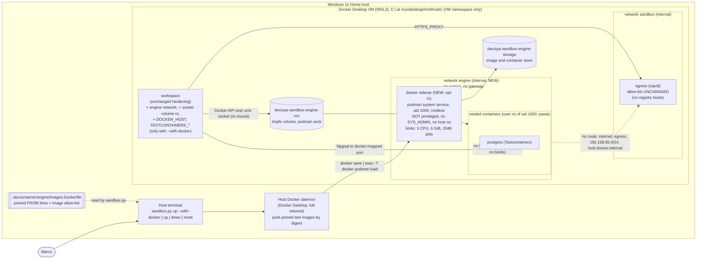

# Architecture note – Agent sandbox: Docker-API sidecar for Testcontainers (issue #41)

- Status: G2 PASS, 2026-09-24. This is the build spec for G4 (devops). It extends `docs/architecture/agent-sandbox.md` (#36), which stays the spec for everything it does not change here. G3 (`docs/security/threat-models/agent-sandbox-docker-sidecar.md`) decides *what G6 checks*. Where the two differ, this note wins on *what to build*.
- ADR: [ADR-0010](../adr/0010-agent-sandbox-devcontainer.md), amendment "2026-09-24 (issue #41)". It stays **Proposed** until Marco approves the G4 evidence.
- Threat-model inputs: T-08/R-2 and G4-12, T-10, T-11 and G4-10(b), T-21, and T-25 in `docs/security/threat-models/agent-sandbox.md`. Deferral record: `docs/security/reviews/36.md` (G4-12 → #41).

## Context

Since #36, the sandbox runs `workspace` and `egress` with no Docker access at all (SB3 "absent"). Integration tests (`Category=Integration`, Testcontainers) run only on the host or in CI. Issue #41 asks for this, inside the sandbox:

- `dotnet test --filter-trait "Category=Integration" --ignore-exit-code 8` runs against a sidecar. The repository has no integration test yet, so the evidence is a throw-away Testcontainers Postgres smoke test.
- Nested containers can't reach the internet or the Windows drives.
- The G4-12 checks, the T-08 residual, "registries only while the profile runs" and the rootless-Podman evaluation are recorded as evidence.
- The runbook is updated with VS 2026 | CLI steps.

This is development tooling. No Decisya module, Contracts type, message, endpoint or runtime data flow changes. The full note form is used because the issue adds a trust boundary (SB3/SB9) and changes how ADR-0010 is realised.

Host facts that constrain the design: Windows 11 Home, Docker Desktop 29.6.2 with the WSL2 backend (8 CPUs, 32 GB), no Podman on the host. The Docker Desktop VM mounts `C:\` at `/run/desktop/mnt/host/c`. That mount is in the VM's mount namespace, not in any container that doesn't bind it.

## Options

| Option | What it is | Verdict |
| --- | --- | --- |
| **A. Rootless Docker-in-Docker** (`docker:dind-rootless`) | dockerd runs as uid 1000 under rootlesskit, in a sidecar that needs `privileged: true` | **Fallback only**, if B fails at G4 and Marco accepts R-2 again. Rejected as primary: `privileged` removes seccomp, AppArmor, the device cgroup and the capability bounding set. Once anything reaches uid 0 in the sidecar, the VM follows in one trivial step: VM block devices, `CAP_SYS_MODULE`, writable `/sys`. From the VM, all of `C:` is reachable, including UserSecrets and `%USERPROFILE%\.claude` (T-08). |
| **B. Rootless Podman API service in an unprivileged sidecar** | `podman system service` runs as uid 1000 in a sidecar with **no `privileged`**, no `CAP_SYS_ADMIN` and no host namespaces. It has a bounded, recorded set of relaxations (below) and serves the Docker-compatible API | **Chosen**, subject to the G4 feasibility spike (checklist section 0) |
| **C. No sidecar** | Integration tests stay on the host and in CI (ADR-0010 option 6, today's state) | **Standing fallback**, always available. Rejected as primary: it doesn't meet the issue's Done-when, so Marco would have to change the issue. Agent-written integration tests would also keep running on the host (SB7), after review only. |
| D. Compose "service containers" | A plain `postgres` (later `redis`, `keycloak`) service on an internal network. Tests take a connection string from the environment instead of Testcontainers | Rejected. There is no Docker API, so this isn't Testcontainers. Test fixtures would need a second code path that differs from CI. Per-test isolation, wait strategies, networks and Keycloak realm import would all have to be rebuilt by hand. It also doesn't meet the Done-when. It stays a design option if B and A both fail and C is unacceptable. |
| E. Host Docker daemon behind a filtering API proxy | `workspace` talks to a proxy that inspects `POST /containers/create` bodies and forwards to the host socket | Rejected. The Docker API is large, and any field the proxy misses gives root on the VM. Examples: `Binds`, `Mounts`, a `local`-driver volume with `o=bind,device=/run/desktop/mnt/host/c`, `PUT /archive`, `build`, `exec`, `CapAdd`, `Devices`, `PidMode`, `NetworkMode: host`. It fails open by omission, and it's custom security code for a solo developer to maintain. |
| F. Sysbox, Docker ECI or gVisor runtime | A runtime that makes nested Docker safe without `privileged` | Rejected. ECI (Sysbox) needs Docker Business, which breaks ADR-0010's cost driver. Neither Sysbox nor `runsc` can be installed persistently in Docker Desktop's LinuxKit VM in a supported way. |
| G. Separate WSL2 distro running rootless Docker or Podman | A dedicated distro with `automount` and `interop` disabled | Rejected. It shares the same utility VM and kernel, so escape risk doesn't improve. Root in the distro can re-mount `drvfs` for `C:`. `workspace` would reach it only over the host network, which breaks SB2 (`internal: true`). Windows 11 Home has no Hyper-V for a separate VM (ADR-0010 context). |

### Why B over A (and what B does not fix)

For both A and B, the first step of an escape is the same. The agent fully controls the API and is "root" only inside a user namespace mapped to uid 1000 and subordinate ids. To go further it needs a kernel bug, or a bug in a setuid helper (`newuidmap`).

The options differ in the **second** step:

- **A:** uid 0 in a privileged container *is* VM root.
- **B:** uid 0 in the sidecar is a Docker-default-capability container root without `CAP_SYS_ADMIN`, with the device cgroup and no host namespaces. Reaching the VM still needs a container escape.

B does **not** help against a kernel bug that gives arbitrary kernel code execution, because that bypasses every namespace. B also widens the kernel surface compared with a fully default container: unprivileged user namespaces, plus seccomp relaxed or unconfined, apply to the sidecar and to every nested container. G3 re-rates T-08 for B. The expected result is a lower residual than A's "Medium", but not "none".

## C4 excerpt



## Boundaries and contracts

No application boundary changes. No Contracts types, Wolverine messages, endpoints or OpenAPI changes.

### Trust boundaries (changes to the #36 table)

| Id | Boundary | Enforced by | Strength |
| --- | --- | --- | --- |
| SB3 (changed) | `workspace` ↔ container engine | The engine API is on a **unix socket** in a tmpfs volume, mounted read-only in `workspace` and read-write in `docker` only. There is no TCP listener, no host socket, and nothing at all unless `--with-docker` is used. The agent has full control of the rootless engine **by design**. | Hard "absent" by default. When on: the agent controls the engine (accepted) |
| SB9 (changed) | Nested containers and the sidecar ↔ VM, host drives and internet | Rootless user namespace (uid 1000 plus subordinate ids). The sidecar isn't privileged, has no `CAP_SYS_ADMIN`, no host namespaces, no host binds and no `ports:`. It sits only on the `internal` `engine` network, has a dead resolver and pre-loaded images. | Medium. See [Why B over A](#why-b-over-a-and-what-b-does-not-fix). G3 rates it. |
| SB2 (unchanged, re-verified) | `workspace` ↔ internet | `workspace` gains a second **internal** network. `egress` is still its only exit. | Hard (topology) |

### What changes in files

| File | Change | Lane |
| --- | --- | --- |
| `.devcontainer/compose.docker.yaml` (new) | The opt-in overlay: `docker` service, `engine` network, two engine volumes, and `workspace` additions (below) | devops |
| `.devcontainer/engine/Dockerfile` (new) | `FROM quay.io/podman/stable@sha256:…` (the Podman project's own namespace), plus `containers.conf` and `storage.conf`. The build context is `.devcontainer/engine` | devops |
| `.devcontainer/engine/containers.conf`, `storage.conf` (new) | Settings for nested containers (below) | devops |
| `.devcontainer/engine/seccomp.json` (new, if G4 reaches that step of the ladder) | Docker's default profile plus the namespace and mount syscalls rootless Podman needs | devops |
| `.devcontainer/engine/images.Dockerfile` (new) | Never built. It has one `FROM <repo>:<tag>@sha256:<digest> AS <alias>` line per allowed test image, and it is the **image allow-list** (so Dependabot can bump digests, U-41-17) | devops |
| `.devcontainer/sandbox.py` | `up --with-docker`, the image pre-load, `--remove-orphans`, and extra volumes for `reset` (below) | devops |
| `.devcontainer/compose.yaml` | **Unchanged.** With the overlay off, the stack is exactly #36's. | none |
| `.devcontainer/egress/*` | **Unchanged.** No registry host is added (see [Images](#images-no-registry-on-the-allow-list)). | none |
| `.github/dependabot.yml` | A `docker` entry for `/.devcontainer/engine` | orchestrator (outside the devops lane if `.github/**` is not in it) |
| `.claude/scripts/lint.py` | The file set gains `compose*.yaml`; today only `compose.yaml` is scanned, so the overlay would be invisible to the lint. See [Lint](#lint-sandbox-config) | orchestrator |
| `docs/runbooks/agent-sandbox.md` | Replace "Integration tests (until #41)" (below) | devops, `runbook` skill |

## Design (option B)

### Opt-in: an overlay file, not a `profiles:` entry

G4-12(a) asks for "a profile, off by default". A compose `profiles:` entry can add the `docker` service, but it can't change `workspace`. The engine needs `workspace` to join the `engine` network, mount the socket volume, and get `DOCKER_HOST` and `TESTCONTAINERS_*`.

So the switch is a **second compose file**, `.devcontainer/compose.docker.yaml`, which `sandbox.py` adds with `-f` only on `up --with-docker`. This meets G4-12(a) and is stronger than a profile: with the overlay off, the **whole** stack, `workspace` included, is byte-for-byte #36's. There is no dormant `DOCKER_HOST`, no socket mount and no second network.

- `sandbox.py up` (no flag) runs `compose -f compose.yaml up -d --build --wait --remove-orphans`. `--remove-orphans` removes a `docker` container left from an earlier `--with-docker` run and recreates `workspace` without the overlay (U-41-13). **Every plain `up` turns the engine off.**
- `sandbox.py up --with-docker` runs `compose -f compose.yaml -f compose.docker.yaml up -d --build --wait --remove-orphans`, then [pre-loads images](#images-no-registry-on-the-allow-list).
- `sandbox.py down` always passes **both** files, plus `--remove-orphans`, so the sidecar and the `engine` network are always removed.

### `compose.docker.yaml` (target shape; G4 fills in the ladder values and records them)

```yaml
# Opt-in container engine for Testcontainers (ADR-0010 amendment, issue #41;
# docs/architecture/agent-sandbox-docker-sidecar.md). Loaded only by `sandbox.py up --with-docker`.
networks:
  engine:
    internal: true            # no route out; egress is NOT attached

volumes:
  decisya-sandbox-engine-storage:
    name: decisya-sandbox-engine-storage
  decisya-sandbox-engine-run:
    name: decisya-sandbox-engine-run
    driver_opts: { type: tmpfs, device: tmpfs, o: "size=16m,uid=1000,gid=1000,mode=0750" }   # U-41-14

services:
  workspace:
    networks: [sandbox, engine]
    environment:
      DOCKER_HOST: unix:///run/decisya-engine/podman.sock
      TESTCONTAINERS_HOST_OVERRIDE: docker        # mapped ports live in the sidecar's netns
      TESTCONTAINERS_RYUK_DISABLED: "true"        # see "Ryuk" below (open decision O-3)
      NO_PROXY: localhost,127.0.0.1,egress,docker # HttpClient wait strategies must not go to squid
      no_proxy: localhost,127.0.0.1,egress,docker
    volumes:
      - type: volume
        source: decisya-sandbox-engine-run
        target: /run/decisya-engine
        read_only: true                            # connect() works on a ro mount (U-41-10)

  docker:                                          # service name kept for G4-12 and the lint
    build: { context: ./engine, dockerfile: Dockerfile }
    image: decisya-sandbox-engine:local
    user: podman                                   # uid 1000, never 0
    init: true
    command: ["podman", "system", "service", "--time=0", "unix:///run/decisya-engine/podman.sock"]
    read_only: true
    # --- relaxation ladder: G4 starts at the top and records every step it needed (section 0) ---
    cap_drop: [ALL]
    cap_add: [SETUID, SETGID]                      # newuidmap/newgidmap; never outside Docker's default set
    security_opt: ["seccomp=./engine/seccomp.json"]   # or seccomp=unconfined; + systempaths=unconfined only if needed
    devices: ["/dev/net/tun"]                      # pasta (port publishing); /dev/fuse only if native overlay fails
    # no-new-privileges is expected to be OFF (setuid newuidmap); G4 tries it ON first
    pids_limit: 2048
    mem_limit: 6g
    cpus: 3
    networks: [engine]
    dns: [127.0.0.1]                               # dead resolver, as on workspace
    volumes:
      - { type: volume, source: decisya-sandbox-engine-run,     target: /run/decisya-engine }
      - { type: volume, source: decisya-sandbox-engine-storage, target: /home/podman/.local/share/containers }
      - { type: tmpfs, target: /run/user/1000, tmpfs: { size: 64m, mode: 0o700 } }   # XDG_RUNTIME_DIR; owner uid 1000 (U-41-18)
      - { type: tmpfs, target: /tmp,     tmpfs: { size: 512m } }
      - { type: tmpfs, target: /var/tmp, tmpfs: { size: 256m } }
    # NEVER: privileged, cap_add SYS_ADMIN/NET_ADMIN/SYS_PTRACE/SYS_MODULE/..., pid/ipc/network/userns_mode host,
    #        any bind mount, ports:, the sandbox network, driver_opts type=none/bind.
```

**Relaxation ladder.** G4 tries each rung in order and records the exact error that forced each one:

1. `cap_drop: [ALL]` + `cap_add: [SETUID, SETGID]`, `no-new-privileges:true`, Docker's default seccomp, `/dev/net/tun`.
2. Remove `no-new-privileges`. It is expected to be necessary, because `newuidmap` and `newgidmap` are setuid or carry file capabilities.
3. A custom seccomp profile: Docker's default plus `unshare`, `clone`/`clone3` with namespace flags, `mount`, `umount2`, `pivot_root`, `setns` and `keyctl`.
4. `seccomp=unconfined`, used only if step 3 can't be made to work. Record why.
5. For the nested `/proc` mount: first set `pidns = "host"` in `containers.conf` for nested containers. Only if that fails, use `systempaths=unconfined` on the sidecar.
6. `cap_add` widened toward Docker's **default** set (`CHOWN`, `DAC_OVERRIDE`, `FOWNER`, `FSETID`, `KILL`, `NET_BIND_SERVICE`, `SETFCAP`, `SETPCAP`, `SYS_CHROOT`, `MKNOD`, `AUDIT_WRITE`, `NET_RAW`), one capability at a time.
7. `/dev/fuse` with `fuse-overlayfs`, only if native overlay in the user namespace fails on the ext4 storage volume (U-41-6).
8. `apparmor=unconfined`, only if `docker inspect` shows an AppArmor profile applied at all (U-41-4).

**Stop rule.** If B works only with `privileged`, `CAP_SYS_ADMIN` (or any capability outside Docker's default set), a host namespace, a host bind or a device other than `/dev/net/tun` and `/dev/fuse`, **B has failed**. G4 records the evidence and stops. Marco then chooses A or C (open decision O-2). G4 does not switch to A on its own.

### Engine image and nested-container settings

- `FROM quay.io/podman/stable@sha256:…` (Podman 5.x, Fedora-based, a `podman` user with uid 1000 and `/etc/subuid`/`subgid` ranges). It is pinned by digest and tracked by Dependabot, and the image is built by the host daemon like the other two. The directory `/home/podman/.local/share/containers` is created in the image, owned by `podman`, so the named volume inherits that ownership.
- `containers.conf` (user or system) for **nested** containers:
  - `netns = "pasta"`, so port publishing works. With `netns="host"`, which the upstream image may default to, Testcontainers gets no mapped ports.
  - `cgroups = "disabled"`, or `cgroup_manager = "cgroupfs"`, because there is no systemd and no delegation (U-41-8). The sidecar's own `mem_limit`, `cpus` and `pids_limit` bound every nested container together (T-21).
  - `pidns = "host"` (ladder step 5).
  - `image_copy_tmp_dir` on the storage volume, not on the small `/var/tmp` tmpfs.
  - `log_driver = "k8s-file"`, and no `journald`.
- `storage.conf`: `driver = "overlay"`, with no `mount_program` unless ladder step 7 is needed. `graphroot` is on the storage volume.
- The sidecar's seccomp profile is inherited by every nested container. Nested Podman adds its own filter on top. A custom profile at step 3 therefore narrows the kernel surface for the whole tree, which is why it comes before `unconfined`.

### How Testcontainers in `workspace` reaches the engine

- **Unix socket, not TCP+TLS.** `podman system service` listens on `unix:///run/decisya-engine/podman.sock`. The socket sits in `decisya-sandbox-engine-run`, a tmpfs-backed named volume, so no stale socket survives a restart. The volume is mounted read-write in `docker` and **read-only** in `workspace`.
  - Connecting to a socket on a read-only mount works, but the agent can't replace the socket (U-41-10).
  - The socket is owned by uid 1000, and `vscode` in `workspace` is uid 1000.
  - Why not TCP+TLS (the #36 G3 assumption, T-25):
    - There would be a network listener on `engine`. Nested containers share the sidecar's network namespace through pasta and could reach it, gated only by certificates.
    - Certificates would have to be generated, stored on a volume and rotated.
    - Podman's remote API TLS support is not assumed (U-41-19).
  - The socket removes T-25's attack surface instead of mitigating it.
- **Environment in `workspace`** (overlay only):
  - `DOCKER_HOST=unix:///run/decisya-engine/podman.sock`.
  - `TESTCONTAINERS_HOST_OVERRIDE=docker`. Published ports are bound by pasta in the sidecar's network namespace, and `workspace` reaches them as `docker:<mapped port>` over `engine` (U-41-7).
  - `NO_PROXY` and `no_proxy` add `docker`. Npgsql ignores HTTP proxies. HttpClient-based wait strategies (Keycloak later) honour the proxy variables and would otherwise be sent to squid and denied (U-41-15).
- **Ryuk: disabled** (`TESTCONTAINERS_RYUK_DISABLED=true`). Why:
  - Nested containers are child processes of the sidecar, so `down` and a plain `up` kill all of them. `reset` removes their storage.
  - It saves a pre-loaded image.
  - No nested container is ever handed the engine socket.

  Cost: containers from a crashed test host linger until the next `down` or `podman container prune`, which the runbook covers. Keeping Ryuk would need `TESTCONTAINERS_DOCKER_SOCKET_OVERRIDE=/run/decisya-engine/podman.sock` and the Ryuk image in the allow-list (open decision O-3). CI keeps Ryuk; this variable is set only in the sandbox overlay.
- There is no docker or podman CLI in `workspace`. It is unchanged from #36 (`which gh docker` finds nothing). Testcontainers talks to the API directly. For debugging, `curl --unix-socket` works.

### Images: no registry on the allow-list

The #36 G3 wording ("registries allow-listed only while the `docker` profile runs, a second allow-list file included by the profile") is met **in its strongest form: registries are never allow-listed.**

- **The allow-list of images** is `.devcontainer/engine/images.Dockerfile`. It is read-only inside the sandbox, `host-review.py` flags any change to it, and every entry is pinned by `@sha256:`.
  - Initial content: the Postgres image the smoke test uses, for example `postgres:17-alpine@sha256:…`. The alpine variant is used because its busybox `wget`, `nc` and `nslookup` double as the nested probe tool.
  - Which images to add now is open decision O-4.
- **Pre-load.** `sandbox.py up --with-docker`, on the host, for each `FROM` line:
  1. `docker pull <repo>@sha256:<digest>`. The host daemon pulls with the host's network, the same trust path as the base images already built for `workspace` and `egress`.
  2. Compare the host image ID with `podman image inspect --format '{{.Id}}' <repo>:<tag>` in the sidecar. If they're equal, skip the image (U-41-12).
  3. Otherwise stream `docker save <repo>@sha256:<digest>` into `docker compose … exec -T docker podman load`, then `podman tag <id> docker.io/library/<repo>:<tag>` (or the fully qualified name) inside the sidecar. Marco's host tags are never touched. The stream is piped in `sandbox.py` with no temporary file, and `cwd` is outside the repository.
  4. Any failure is fatal (non-zero exit), and the image name is printed.
- **Why this over a conditional second allow-list file in squid.** Squid's allow-list is static. A conditional file mounted by the overlay would work mechanically: an empty `allowlist-registry.txt` baked in, and the overlay bind-mounting the real one. But it would:
  - put upload-capable registries (Docker Hub, Quay, MCR) on the allow-list whenever the engine runs (T-11: `docker push` with an attacker's token);
  - put `production.cloudflare.docker.com` on a shared CDN, where SNI enforcement (T-09) would be doing all the work;
  - require `docker` on the `sandbox` network, where nested containers could use `egress` too;
  - let the agent pull **any** image.

  Pre-loading keeps `egress` byte-identical to #36. It keeps the sidecar and every nested container off every network that has a way out, and it limits images to a reviewed list.
- Testcontainers' default pull policy ("missing") finds the image locally and never pulls. An image that isn't pre-loaded fails fast with a pull error (no DNS, no route). That is the intended fail-closed behaviour. Tests must reference the exact tags in the list. A shared test-image constant is a follow-up for the issue that adds the first integration test.
- The agent can still build or `podman load` images from files it writes. That runs nothing it couldn't run in `workspace` already, except as "root" inside the user namespace, which is the premise of T-08.

### Networks: how nested containers are kept off the internet, the VM and the host

- **`engine` is `internal: true`**, and its only members are `workspace` and `docker`. `egress` is **not** on it, and `docker` is **not** on `sandbox`. So the sidecar and its nested containers have:
  - no default route;
  - no route to `egress`, which isn't resolvable or routable from `engine`;
  - no route to `192.168.65.0/24`, `host.docker.internal`, `gateway.docker.internal` or `http.docker.internal:3128` (the same mechanism as U-2 and U-25, verified for `workspace` in #36).
- **DNS:** `dns: [127.0.0.1]` on `docker`, as on `workspace`. Docker 26+ doesn't forward external names for internal-only containers (U-17). Nested containers get the sidecar's resolver configuration through pasta, so it is dead too.
- **pasta** translates nested traffic into sockets in the sidecar's network namespace. Nested containers can therefore reach exactly what the sidecar can reach: `workspace` over `engine`, and themselves. `--network host` for a nested container means the **sidecar's** namespace, not the VM's.
- **No IPv6:** there is no `enable_ipv6` anywhere, and the #36 rule stays.
- **Windows drives:** the sidecar has **no bind mounts**, only the two named volumes and tmpfs. A nested `-v /run/desktop/mnt/host/c:/c` or `-v /:/host` resolves in the **sidecar's** mount namespace, where no host path exists. Device nodes for the VM's disks aren't in the sidecar's `/dev`: only the defaults plus `/dev/net/tun` (and `/dev/fuse` if needed).
- `workspace` on two internal networks doesn't change SB2. It has no gateway on either, and `egress` stays its only exit. This is re-verified in checklist section 10.

### Resource limits (T-21, G4-12(d))

| Service | `cpus` | `mem_limit` | `pids_limit` | Notes |
| --- | --- | --- | --- | --- |
| `workspace` | 4 | 8g | 1024 | Unchanged |
| `egress` | 0.5 | 256m | 100 | Unchanged |
| `docker` (new) | 3 | 6g | 2048 | Covers every nested container, because nested cgroups are disabled. Enough for Postgres plus a later Keycloak (JVM). G4 tunes and records the values. |

The total is 14.25 GiB and 7.5 CPUs. G4 records Docker Desktop's *Settings → Resources* memory limit. If the limit is below about 16 GiB, lower `docker` to 4g and record that (U-41-16). The storage volume grows the Docker Desktop VHDX. The runbook shows `podman system df` and `podman system prune`, and `sandbox.py reset` removes the volume.

### `sandbox.py` changes (host launcher; read-only inside)

| Subcommand | Change |
| --- | --- |
| `up` | Adds `--remove-orphans`. It still loads only `compose.yaml`, so the engine is off after it. |
| `up --with-docker` | precheck as today. Then `up` with both files and `--remove-orphans`, then the pre-load. It prints a one-line reminder that the engine is on and that a plain `up` or `down` turns it off. It refuses unknown flags. |
| `down` | Both `-f` files and `--remove-orphans`, always |
| `reset` | Also removes `decisya-sandbox-engine-storage` and `decisya-sandbox-engine-run`. It **tolerates missing volumes**, for someone who never used `--with-docker`. The other volumes behave as today. |
| `claude`, `shell`, `attach-prep` | Unchanged. They work with the engine on or off. |

The executable-resolution and `cwd` rules from #36 apply to the new `docker save`/`exec` pipe. `images.Dockerfile` is parsed with a strict regex (`^FROM\s+(\S+):(\S+)@sha256:([0-9a-f]{64})\s+AS\s+\S+\s*$`). Any other non-comment, non-blank line fails closed.

### Lint (`sandbox-config`)

- **Option B needs no `privileged` anywhere.** The `sandbox-lint: allow-privileged` marker must **not** appear in any file, and the current regex check passes unchanged. For the parse-based rewrite (#39), the rule becomes "no `privileged` on any service", which is stricter than #36's "only on `docker`".
- **Now (orchestrator, this PR):** `lint.py` scans only files named exactly `compose.yaml`. It must also scan `compose.*.yaml` and `compose.*.yml`, or the overlay can't be linted. A scratch negative check: `privileged: true` without the marker in a copy of `compose.docker.yaml` is flagged.
- **If fallback A is chosen (O-2):** the line `privileged: true  # sandbox-lint: allow-privileged` appears only in `compose.docker.yaml`, on the `docker` service. The line-based check can't tell which service a line belongs to, so #39's parse-based check must enforce the service name.
- **Changes to the #39 rule table** (replacing the rows it names; the rest stay):

| Rule | Checked artefact |
| --- | --- |
| `compose.yaml` has exactly `workspace` and `egress`. `compose.docker.yaml` defines only the `docker` service plus additions to `workspace`, and no `profiles:` in either file. | both compose files |
| No `privileged` on any service (option B). Under A: only on `docker`, with the marker. | both |
| `docker`: `user` is not root. `read_only: true`. `cap_add` ⊆ Docker's default capability set, never `SYS_ADMIN`, `NET_ADMIN`, `SYS_PTRACE`, `SYS_MODULE`, `SYS_RAWIO`, `BPF` or `PERFMON`. `devices` ⊆ {`/dev/net/tun`, `/dev/fuse`}. `security_opt` ⊆ {`seccomp=./engine/seccomp.json`, `seccomp=unconfined`, `systempaths=unconfined`, `apparmor=unconfined`, `no-new-privileges:true`}, matching the G4-recorded set. No `pid`, `ipc`, `network_mode` or `userns_mode`. | `compose.docker.yaml` |
| `docker`: networks exactly `[engine]`. Volumes exactly the two engine volumes plus tmpfs. **No bind mounts.** No `ports:`. `pids_limit`, `mem_limit` and `cpus` are set. `dns: [127.0.0.1]`. | `compose.docker.yaml` |
| `engine` is `internal: true`, and `egress` is not attached to it | `compose.docker.yaml` |
| `workspace` additions: networks ⊆ {`sandbox`, `engine`}. The only added volume is `decisya-sandbox-engine-run`, read-only. `DOCKER_HOST` equals exactly `unix:///run/decisya-engine/podman.sock` and appears **only** in `compose.docker.yaml`. | both |
| No volume uses `driver_opts` with `type: none`, `bind` or `o: bind` (the `local`-driver host-bind trick). Only `type: tmpfs` is allowed. | both |
| Every `FROM` in `engine/Dockerfile` and `engine/images.Dockerfile` is pinned by `@sha256:` | Dockerfiles |
| `allowlist-tls.txt` and `allowlist-http.txt` are unchanged from the #36 approved set (no registry host) | allow-lists |

## Decisions

- **Rootless Podman API service in an unprivileged, opt-in sidecar (option B).** Rootless DinD (A) is the fallback only with Marco's renewed acceptance of R-2, and no-sidecar (C) is always available. Recorded as the ADR-0010 amendment "2026-09-24 (issue #41)", **Proposed** until Marco approves the G4 evidence. This supersedes ADR-0010 option 5's "`docker`: rootless Docker-in-Docker" and its Bad consequence "the sidecar still needs `privileged: true`", provided B passes G4.
- **Opt-in through an overlay compose file** rather than `profiles:`, so `workspace` is exactly #36's when the engine is off. No new ADR is needed: it realises ADR-0010's "profile off by default".
- **Engine API over a unix socket on a tmpfs volume**, not TCP+TLS. This drops T-25's surface. It is covered by the ADR-0010 amendment.
- **Images pre-loaded from the host daemon, from a digest-pinned allow-list.** The egress allow-list is unchanged, and no registry host is ever added. Covered by the ADR-0010 amendment.
- **Ryuk disabled in the sandbox only.** This is configuration and needs no ADR (O-3).
- No platform invariant in `CLAUDE.md` changes. The Aspire AppHost stays out of the sandbox, because a remote engine breaks its `localhost` endpoints (ADR-0010).

## NetArchTest rules to add

None. The issue adds no .NET assembly, module or dependency, and the boundary is container infrastructure, which NetArchTest can't express. It is enforced by:

- the `lint.py` `sandbox-config` check, with the file-set extension in this PR and the rule table above for #39;
- the G4 checklist below, re-run on every `.devcontainer/**` change.

## Unverified assumptions

G4 proves or refutes each of these in section 0 or the section named. **None of them was verified by the architect.**

| Id | Assumption | Depends on it |
| --- | --- | --- |
| U-41-1 | Docker Desktop 29.6.2's kernel allows unprivileged user-namespace creation inside a container (`user.max_user_namespaces` > 0) once seccomp permits it | B at all |
| U-41-2 | Docker's default seccomp profile blocks `unshare(CLONE_NEWUSER)` and `mount` without `CAP_SYS_ADMIN`, so ladder step 3 or 4 is needed | Ladder |
| U-41-3 | A nested `/proc` mount fails under Docker's masked `/proc` unless nested containers share the PID namespace (`pidns=host`) or the sidecar has `systempaths=unconfined` | Ladder step 5 |
| U-41-4 | AppArmor is not active in Docker Desktop's VM, so `apparmor=unconfined` is a no-op | Ladder step 8 |
| U-41-5 | `newuidmap`/`newgidmap` in the Podman image need `no-new-privileges` off and work with `cap_add: [SETUID, SETGID]` under `cap_drop: [ALL]`. Images such as Postgres, which switch to uid 999, need a subordinate-id range, so single-uid mapping (`ignore_chown_errors`) is not enough | Ladder steps 1 and 2 |
| U-41-6 | Native overlayfs in a user namespace works on the ext4 named volume on the VM kernel, so `/dev/fuse` is not needed | Ladder step 7 |
| U-41-7 | `/dev/net/tun` exists in the VM, and pasta publishes nested ports on the sidecar's `engine` interface, reachable from `workspace` as `docker:<port>` | Testcontainers mapped ports |
| U-41-8 | Nested containers start with `cgroups="disabled"` (or cgroupfs) without systemd, and the sidecar's limits bound them | T-21 |
| U-41-9 | Testcontainers .NET 4.15.0 works against Podman 5's Docker-compatible API over a unix socket with `TESTCONTAINERS_HOST_OVERRIDE` and Ryuk disabled. Custom networks (needed later for multi-container tests) work under rootless netavark | Done-when |
| U-41-10 | `connect()` on a unix socket on a read-only mount succeeds, and the socket's mode allows uid 1000 from `workspace` | SB3 |
| U-41-11 | `podman load` of a `docker save` archive plus `podman tag` makes a short name such as `postgres:17-alpine` resolve through the compatibility API (`docker.io/library/…`) with no pull attempt | Pre-load |
| U-41-12 | The image ID (config digest) is identical in `docker image inspect` and `podman image inspect`, so the skip check is exact | Pre-load idempotence |
| U-41-13 | `docker compose -f compose.yaml up --remove-orphans` removes the overlay's `docker` container and recreates `workspace` without the `engine` network, the socket mount and the environment | Default off |
| U-41-14 | A named volume with `driver_opts: {type: tmpfs, …, uid=1000}` can be mounted into two containers at once and carries a working unix socket | SB3 |
| U-41-15 | Npgsql doesn't use `HTTP(S)_PROXY`, and .NET `HttpClient` honours `NO_PROXY=docker` | Testcontainers from `workspace` |
| U-41-16 | 14.25 GiB of limits fits Docker Desktop's VM memory setting on this host | T-21 |
| U-41-17 | Dependabot's `docker` ecosystem updates digests in a file named `images.Dockerfile` (otherwise the updates are manual, monthly) | Supply chain |
| U-41-18 | A compose tmpfs at `/run/user/1000` can be made owned by uid 1000 (the short syntax `/run/user/1000:uid=1000,gid=1000,mode=0700` if the long syntax lacks `uid`) | Podman runtime dir |
| U-41-19 | Podman's remote API is not assumed to support TLS. Irrelevant with the unix socket. Recorded because the #36 design assumed TCP+TLS | T-25 |
| U-41-20 | A nested `--privileged` container gains capabilities only inside the user namespace and sees no VM block devices | SB9 |

## What G4 must verify

Paste every command and its output (exit code or the relevant lines) into `docs/ai/pipeline/41.md` under "G4 evidence". The manifest's working-agreement exception applies: the files are built from the host session, and the orchestrator runs the **[ws]** items inside the sandbox.

Markers:

- **[host]** is PowerShell in the repository root, with `$py = $env:DECISYA_PYTHON` and `$dc = @('compose','-f','.devcontainer\compose.yaml','-f','.devcontainer\compose.docker.yaml','-p','decisya-sandbox')`.
- **[engine]** is `docker @dc exec docker <cmd>` from the host.
- **[nested]** is `docker @dc exec docker podman run --rm <probe-image> sh -c '<cmd>'`, where `<probe-image>` is the pre-loaded alpine Postgres image.
- **[ws]** is `& $py .devcontainer\sandbox.py shell`.

### 0. Feasibility spike: rootless Podman without `privileged` (the evaluation of record)

- [ ] **[host]** Record `docker version`, `docker info --format '{{.KernelVersion}} {{.SecurityOptions}}'`, the WSL version (`wsl --version`), and Docker Desktop's CPU and memory setting.
- [ ] **[host]** Walk the [relaxation ladder](#compose-dockeryaml-target-shape-g4-fills-in-the-ladder-values-and-records-them) from step 1. For each step, record the compose settings and the first failing command with its exact error, typically `[engine] podman info` then `[engine] podman run --rm <probe-image> true`. Stop at the first working step.
- [ ] **[host]** Record the final set of relaxations as one line: caps, seccomp, `systempaths`, `no-new-privileges`, devices. If the [stop rule](#compose-dockeryaml-target-shape-g4-fills-in-the-ladder-values-and-records-them) triggers, record "B failed: <reason>" and **stop**. Marco decides O-2, and the rest of this checklist is re-run for the chosen option.
- [ ] **[host]** Also record the A comparison without building it: `docker:dind-rootless` requires `privileged` (Docker's documentation, cited with the URL and the date read).

### 1. Default off (G4-12(a))

- [ ] **[host]** `& $py .devcontainer\sandbox.py up`, then `docker compose -p decisya-sandbox ps --all` shows only `workspace` and `egress`.
- [ ] **[ws]** `env | grep -E '^(DOCKER_HOST|TESTCONTAINERS_)'` is empty. `ls /run/decisya-engine` fails. `getent hosts docker` fails.
- [ ] **[host]** After `up --with-docker` then a plain `up`: `docker compose -p decisya-sandbox ps --all` again shows no `docker`, and `docker inspect <workspace> --format '{{json .NetworkSettings.Networks}}'` shows only `sandbox` (U-41-13).

### 2. Sidecar configuration and rootless (G4-12(b)(c)(d)(f))

- [ ] **[host]** `& $py .devcontainer\sandbox.py up --with-docker` exits 0.
- [ ] **[host]** `docker inspect <docker> --format '{{.HostConfig.Privileged}} {{.HostConfig.CapAdd}} {{.HostConfig.CapDrop}} {{.HostConfig.SecurityOpt}} {{json .HostConfig.Devices}} {{.HostConfig.ReadonlyRootfs}} {{.HostConfig.PidsLimit}} {{.HostConfig.Memory}} {{.HostConfig.NanoCpus}} {{json .HostConfig.PortBindings}} {{.HostConfig.PidMode}} {{.HostConfig.IpcMode}} {{.HostConfig.UsernsMode}} {{.Config.User}}'` shows:
  - `Privileged false`;
  - caps and security options exactly as recorded in section 0;
  - devices ⊆ {`/dev/net/tun`, `/dev/fuse`};
  - limits set;
  - no port bindings;
  - no host modes;
  - user `podman`.
- [ ] **[host]** `docker inspect <docker> --format '{{json .Mounts}}'` shows only `decisya-sandbox-engine-run`, `decisya-sandbox-engine-storage` and tmpfs, with **no bind**.
- [ ] **[engine]** `id -u` is `1000`. `sh -c 'grep -E "Cap(Eff|Bnd)|NoNewPrivs|Seccomp" /proc/self/status; cat /proc/self/uid_map; ls /dev'` is recorded.
- [ ] **[engine]** `podman info --format '{{.Host.Security.Rootless}}'` prints `true`. `podman unshare cat /proc/self/uid_map` shows the subordinate range. During a nested `sleep 30`, `ps -eo user,pid,args` in the sidecar shows the container processes as non-root host ids.
- [ ] **[host]** `docker network inspect decisya-sandbox_engine --format '{{.Internal}} {{range .Containers}}{{.Name}} {{end}}'` shows `true` with only `workspace` and `docker`. `docker network inspect decisya-sandbox_sandbox` lists only `workspace` and `egress`.
- [ ] **[host]** `Select-String -Path .devcontainer\engine\*Dockerfile -Pattern '^FROM'` shows only `@sha256:` pins. `.github/dependabot.yml` has the `/.devcontainer/engine` entry.

### 3. Engine API from `workspace` (SB3, T-25)

- [ ] **[ws]** `echo "$DOCKER_HOST"` prints `unix:///run/decisya-engine/podman.sock`. `ls -l /run/decisya-engine/` shows the socket, owned by uid 1000.
- [ ] **[ws]** `curl -sS --unix-socket /run/decisya-engine/podman.sock http://d/_ping` prints `OK`. `curl -sS --unix-socket /run/decisya-engine/podman.sock http://d/version` names Podman. `curl -sS --unix-socket /run/decisya-engine/podman.sock http://d/info | grep -o 'rootless'` matches.
- [ ] **[ws]** `touch /run/decisya-engine/x` fails (read-only). `curl -m 5 http://docker:2375/_ping` and `curl -m 5 https://docker:2376/_ping` fail.
- [ ] **[engine]** `cat /proc/net/tcp /proc/net/tcp6` shows no listening socket (state `0A`) while no test is running.
- [ ] **[ws]** `which docker podman gh` finds nothing.

### 4. Images pre-loaded, no registry reachable (G4-10(b), T-11)

- [ ] **[host]** The `up --with-docker` output lists each image in `images.Dockerfile` as loaded or already present. A second run reports "already present" for all of them (U-41-12).
- [ ] **[engine]** `podman images --format '{{.Repository}}:{{.Tag}} {{.ID}}'` matches the host `docker image inspect --format '{{.Id}}' <repo>@sha256:<digest>` for each entry.
- [ ] **[engine]** `podman pull docker.io/library/alpine:3` fails (name resolution or no route). Record the error.
- [ ] **[host]** `git diff --exit-code origin/main...HEAD -- .devcontainer/egress` exits 0, so the allow-list is unchanged. `docker compose -p decisya-sandbox exec egress tail -n 200 /var/log/squid/access.log` shows no registry host and no client IP from the `engine` subnet.
- [ ] **[host]** Negative: add a bogus line (for example `RUN true`) to a scratch copy of `images.Dockerfile`, point `sandbox.py` at the copy, and confirm it refuses. Restore the original.

### 5. Nested network isolation (T-10 from a nested container)

Each of these fails (timeout, no route or name not resolved):

- [ ] **[nested]** `wget -T 5 -qO- http://example.com`, `wget -T 5 -qO- http://1.1.1.1`, `nc -w 3 1.1.1.1 443`, `nslookup example.com`.
- [ ] **[nested]** `wget -T 5 -qO- http://host.docker.internal`, `http://gateway.docker.internal`, `http://192.168.65.1`, `http://192.168.65.254`, and `wget -T 5 -Y on -e http_proxy=http://http.docker.internal:3128 -qO- http://example.com`.
- [ ] **[nested]** `wget -T 5 -Y on -e http_proxy=http://egress:3128 -qO- http://api.nuget.org/` fails. `nc -w 3 <egress IP on sandbox, from docker inspect> 3128` fails.
- [ ] **[nested]** `wget -T 5 -qO- 'http://[2606:4700:4700::1111]/'` fails.
- [ ] **[engine]** `podman run --rm --network host <probe-image> sh -c 'wget -T 5 -qO- http://1.1.1.1; nslookup example.com'` also fails, because host means the sidecar's namespace.
- [ ] **[ws]** With a nested `nc -l -p 8080` published by `podman run -d -p 8080 …`, `nc -z docker <mapped port>` succeeds from `workspace`. This proves the only reachable peer is `workspace`, over `engine`.

### 6. Nested access to Windows drives and host paths

- [ ] **[engine]** `ls /run/desktop /run/desktop/mnt/host/c /mnt/host /host_mnt /mnt/c 2>&1` fails for each.
- [ ] **[engine]** `podman run --rm -v /run/desktop/mnt/host/c:/c <probe-image> ls /c` fails (no such path).
- [ ] **[host]** Canary. On the host, run `dotnet user-secrets set Canary:Value sbx-canary-us-41 --project src/Decisya.AppHost` and create `$env:USERPROFILE\sbx-canary-41.txt` containing `sbx-canary-file-41`. Then **[engine]** `podman run --rm -v /:/host <probe-image> sh -c 'grep -rIl --exclude-dir=proc --exclude-dir=sys sbx-canary /host 2>/dev/null; echo exit=$?'` finds no match. Remove both canaries afterwards.
- [ ] **[nested]** `ls /dev` shows no `sd*`, `vd*`, `nvme*` or `loop*`. `mknod /tmp/b b 8 0` fails.

### 7. Nested privilege flags stay inside the user namespace (SB9, U-41-20)

- [ ] **[engine]** `podman run --rm --privileged <probe-image> sh -c 'grep CapEff /proc/self/status; cat /proc/self/uid_map; ls /dev | head -50; mount -t tmpfs t /mnt && echo tmpfs-ok'` is recorded. The `uid_map` is not `0 0 4294967295`, and no VM block device is present.
- [ ] **[engine]** `podman run --rm --pid host <probe-image> sh -c 'ps | wc -l'` sees only the sidecar's processes. Compare with `[engine] ps -e | wc -l`.
- [ ] **[engine]** `podman run --rm --cap-add ALL <probe-image> sh -c 'echo 1 > /proc/sys/kernel/sysrq'` fails.

### 8. Testcontainers smoke test (Done-when) and the integration lane

- [ ] **[ws]** `env | grep -E '^(DOCKER_HOST|TESTCONTAINERS_|NO_PROXY)='` shows the overlay values.
- [ ] **[ws]** Create a throw-away project **under `/tmp`, never in the repository**:

  ```bash
  mkdir -p /tmp/tc-smoke && cd /tmp/tc-smoke
  dotnet new console --framework net10.0 --name TcSmoke --output .
  dotnet add package Testcontainers.PostgreSql --version 4.15.0
  dotnet add package Npgsql --version <the Npgsql version the repo resolves; see `dotnet list /workspaces/decisya/decisya.slnx package --include-transitive`>
  cat > Program.cs <<'EOF'
  using Npgsql;
  using Testcontainers.PostgreSql;

  // Image must equal a line in .devcontainer/engine/images.Dockerfile (pre-loaded; no pull possible).
  await using var pg = new PostgreSqlBuilder().WithImage("postgres:17-alpine").Build();
  await pg.StartAsync();
  Console.WriteLine($"conn host: {new NpgsqlConnectionStringBuilder(pg.GetConnectionString()).Host}");
  await using var conn = new NpgsqlConnection(pg.GetConnectionString());
  await conn.OpenAsync();
  await using var cmd = new NpgsqlCommand("SELECT 1", conn);
  Console.WriteLine($"SELECT 1 => {await cmd.ExecuteScalarAsync()}");
  EOF
  time dotnet run
  ```

  Expected: `conn host: docker`, then `SELECT 1 => 1`, exit 0. Record the wall-clock time. If 4.15.0 marks the parameterless builder obsolete, use the image-taking constructor instead; record which one.
- [ ] **[engine]** During the run, `podman ps` shows the Postgres container. After it, `podman ps -a` shows it removed (disposed, with Ryuk off).
- [ ] **[ws]** In `/workspaces/decisya`, `dotnet test --filter-trait "Category=Integration" --ignore-exit-code 8` exits 0. Zero tests is expected until the first integration test; record the count. `dotnet test --filter-not-trait "Category=Integration" --ignore-exit-code 8` still passes with the #36 count (76 at #36).
- [ ] **[host]** Negative: `& $py .devcontainer\sandbox.py up` (engine off). Then **[ws]** `cd /tmp/tc-smoke && dotnet run` fails with Testcontainers' "Docker is either not running or misconfigured" error, or similar; record it. Then `rm -rf /tmp/tc-smoke`.

### 9. Resource limits and clean-up (T-21)

- [ ] **[host]** `docker stats --no-stream` during the smoke run shows `docker` under its memory and CPU limits. Record Docker Desktop's VM memory setting against the 14.25 GiB total (U-41-16).
- [ ] **[engine]** `podman system df` is recorded.
- [ ] **[host]** `& $py .devcontainer\sandbox.py reset` removes both engine volumes. It also succeeds on a machine where they never existed: run it twice.

### 10. #36 regression with the engine on

- [ ] **[ws]** `findmnt -rn -o TARGET,SOURCE,OPTIONS`: the only new target is `/run/decisya-engine` (read-only). Everything else matches #36 section 2.
- [ ] **[ws]** Re-run #36 section 7's no-route and T-10 probes: `curl -sS -m 10 --noproxy '*' https://api.nuget.org/`, `curl -m 5 http://host.docker.internal`, `curl -m 5 http://192.168.65.1`, `curl -6 -m 5 https://api.nuget.org`, and `getent hosts example.com`. Each fails. `curl -sS -o /dev/null -w '%{http_code}\n' https://api.nuget.org/v3/index.json` still gets an HTTP code through `egress`.
- [ ] **[host]** `docker inspect <workspace>`: hardening unchanged from #36 section 2 (`CapDrop ALL`, no `CapAdd`, read-only rootfs, limits). `.Config.Env` contains no `ANTHROPIC_API_KEY`.
- [ ] **[host]** `docker port <workspace>` and `docker port <docker>` are empty.

### 11. Lint, runbook and records

- [ ] **[host]** `python .claude/scripts/lint.py` passes with the extended file set. A scratch copy of `compose.docker.yaml` with `privileged: true` and no marker is flagged. `Select-String -Path .devcontainer\* -Pattern 'sandbox-lint: allow-privileged'` finds nothing (option B).
- [ ] **[host]** The runbook's "Integration tests" section is replaced with VS 2026 | CLI rows for:
  - `up --with-docker`;
  - running the integration lane inside;
  - turning the engine off (`up` or `down`);
  - `podman system df`/`prune` via `docker … exec docker`.

  The runbook also gets:
  - the G4-12(e) prerequisite (current Docker Desktop and `wsl --update` before the first `--with-docker`);
  - "add a test image" steps (edit `images.Dockerfile` on the host, which needs a host session because `.devcontainer` is read-only inside);
  - the T-08 residual under "What the sandbox does not protect".
- [ ] **[host]** Record in the evidence, for G3 and G6: the final relaxation set (section 0), and the T-08 residual as rated by G3 for that set. For "registries only while the profile runs", record "never; images pre-loaded" (section 4). For the Podman evaluation, record the outcome of section 0.
- [ ] **[host]** `& $py .devcontainer\host-review.py` lists only the expected #41 files.

## Residual risks (for G3 to rate)

| R | Position |
| --- | --- |
| R-2 / T-08 (changed) | Only while `--with-docker` is on. Under B, the escape chain is a user-namespace escape (kernel or `newuidmap` bug), then a container escape from a non-privileged, capability-bounded container without `CAP_SYS_ADMIN` and with the relaxed seccomp recorded at G4. A kernel bug that gives arbitrary kernel code execution skips both steps. Impact is total (the VM mounts `C:`). Likelihood is lower than with A. |
| T-25 (changed) | No TCP listener. Access requires being uid 1000 in a container that mounts `decisya-sandbox-engine-run`, which only `workspace` and `docker` do. The surface is removed, not mitigated. |
| T-11 (unchanged) | No registry host is added, so the engine adds no exfiltration channel. |
| T-21 (changed) | Bounded by the sidecar's limits for all nested containers. The storage volume's disk growth is procedural (`podman system df`, `reset`). |
| New: image supply chain | Test images are pulled by the host daemon with the host's network, pinned by digest, from a reviewed list. The same trust path as the #36 base images. |
| New: the agent controls a rootless engine | By design. It can run any pre-loaded or self-built image with any flags **inside** the user namespace. That grants no network or host path beyond what `workspace` already has. |

## Open decisions for Marco

- **O-1.** Approve **B** as the primary design, with the relaxation ceiling of the ladder: seccomp custom (or unconfined), `systempaths=unconfined` only if `pidns=host` fails, `no-new-privileges` off, `/dev/net/tun` (plus `/dev/fuse` if needed), and `cap_add` limited to Docker's default set.
- **O-2.** The fallback if B hits the stop rule:
  - **A**: privileged `docker:dind-rootless` in the same overlay, with the same networks, socket and pre-load. This renews the acceptance of R-2 at "Medium".
  - **C**: no sidecar. Marco would change #41's Done-when.

  The architect leans to A, because G3 already accepted R-2 under G4-12, and the unix socket, the engine-only network and the pre-load shrink its surroundings. But only as an explicit decision recorded in the manifest.
- **O-3.** Ryuk **disabled** in the sandbox (recommended), or enabled with `TESTCONTAINERS_DOCKER_SOCKET_OVERRIDE` and the Ryuk image on the list.
- **O-4.** The initial image list: Postgres only (the minimum for the Done-when; recommended), or also the Redis and Keycloak images, to match the three Testcontainers packages already in `Directory.Packages.props`.
- **O-5.** Accept the overlay file as the G4-12(a) "profile", rather than a compose `profiles:` entry.
- **O-6.** Digest updates: Dependabot on `images.Dockerfile` if U-41-17 holds, otherwise a manual monthly bump.

<!-- gate: G2 | verdict: PASS | issue: #41 -->
