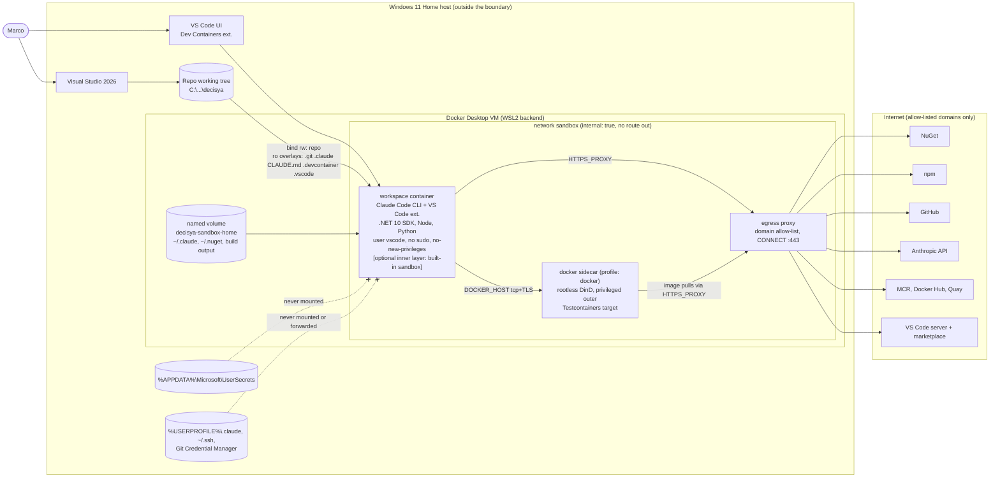

# Architecture note – Agent sandbox: devcontainer with write and egress allow-lists and no host secrets (issue #36)

## Context

Today Claude Code agents run natively on Windows 11 Home. The only controls there are hooks and deny rules, which are guardrails, not a boundary (`docs/security/threat-models/claude-config.md`: T-01, T-02, T-04 and T-10, and review `docs/security/reviews/35.md` FU-1). This issue moves agent sessions into a boundary that satisfies four conditions:

- writes outside the repository fail;
- `.env` files and dotnet user-secrets can't be read;
- egress is limited to an allow-list;
- `dotnet build -warnaserror` and `dotnet test` stay green.

The decision and the rejected options are in [ADR-0010](../adr/0010-agent-sandbox-devcontainer.md). The toolchain is fixed by ADR-0009 (.NET 10 SDK 10.0.1xx through `global.json`, Aspire 13.5). The pipeline manifest is `docs/ai/pipeline/36.md`, and the change class is ci-tooling.

This is development tooling. No Decisya module, contract, message or runtime data flow changes. The note uses the full form because the issue adds a trust boundary and an external integration (egress to package registries and Anthropic).

## C4 excerpt



## Boundaries and contracts

No application boundary changes. No Contracts types, Wolverine messages, endpoints or OpenAPI changes.

### Trust boundaries

| Id | Boundary | Enforced by | Strength |
| --- | --- | --- | --- |
| SB1 | Host ↔ `workspace` (file system) | Docker mounts: only the repository is bind-mounted from the host. The control-plane paths are read-only overlays. | Hard (kernel and container) |
| SB2 | `workspace` ↔ internet | The `sandbox` network is `internal: true`, so there is no default route. All egress goes through `egress`, which has a domain allow-list. `workspace` has no `NET_ADMIN` or `NET_RAW`. | Hard (topology). Allow-listed domains that accept uploads remain a residual. |
| SB3 | `workspace` ↔ Docker | `DOCKER_HOST` points at the rootless `docker` sidecar. The host socket is never mounted. | Medium (the sidecar is privileged; see R-2) |
| SB4 | Agent process ↔ its own container (inner layer, optional) | The built-in Claude Code sandbox (bubblewrap) for Bash: `allowWrite` covers the workspace, `/tmp` and cache directories; `denyRead` covers `.env*` and `~/.claude/.credentials.json`. | Defence in depth, enabled only if G4 proves it (U-5, U-6) |
| SB5 | Subagent lanes inside the repository | The existing `agent_boundaries.py`, `secret_guard.py` and deny rules | Guardrail only (T-01, T-02 unchanged) |

### Mounts of `workspace` (the complete list; G4 must not add others)

| Target | Source | Mode | Why |
| --- | --- | --- | --- |
| `/workspaces/decisya` | `${localWorkspaceFolder}` (host repository) | rw | One working tree shared with VS 2026 |
| `/workspaces/decisya/.git` | host `.git` | **ro** | Stops the agent from planting `.git/hooks` or `core.fsmonitor`/`core.hooksPath` that later run on the host. Marco commits on Windows (the pipeline already hands commits to Marco). |
| `/workspaces/decisya/.claude`, `/workspaces/decisya/CLAUDE.md` | host | **ro** | An agent can't widen its own `tools:`, hooks, `boundaries.json` or settings for the next session (T-01, T-02) |
| `/workspaces/decisya/.devcontainer` | host | **ro** | `initializeCommand` and compose files run on the host at the next start |
| `/workspaces/decisya/.vscode` | host | **ro** | `tasks.json` with `runOn: folderOpen` runs on the host |
| `/workspaces/decisya/src/Decisya.Web/node_modules` | named volume | rw | Linux-native binaries, and no clash with Windows `node_modules` |
| `/home/vscode` | named volume `decisya-sandbox-home` | rw | `~/.claude` (credentials, transcripts), `~/.nuget/packages`, `~/.vscode-server`, redirected `bin/obj`, sandbox-local user-secrets |
| `/tmp` | tmpfs | rw | MSBuild and NuGet scratch space |
| `/etc/claude-code/managed-settings.json` | baked into the image, root-owned | ro to `vscode` | Sandbox and deny settings that the agent can't override (U-7) |
| rootfs | image | **ro** (`read_only: true`) if Dev Containers tolerates it (U-9) | Writes outside the repository, home and tmp fail for every tool |

Never mounted or forwarded: `C:\` or any other host path, `%APPDATA%\Microsoft\UserSecrets`, `%USERPROFILE%\.claude`, `~/.ssh`, the SSH agent, the GPG agent, the Git Credential Manager helper, the VS Code GitHub authentication for git, and `/var/run/docker.sock`.

### Secrets

- **User-secrets** on the host are absent by construction. Inside the sandbox, `~/.microsoft/usersecrets` lives in the sandbox home volume and holds only throw-away dev values that Aspire or tests generate. Testcontainers creates its own credentials.
- **`.env` files.** The repository holds only `.env.example`. Secret-bearing env files live outside the working tree (the runbook names a location such as `%USERPROFILE%\.decisya\env\`). The `initializeCommand` precheck (`.devcontainer/precheck.py`, which runs on the host and is read-only inside the sandbox) refuses to start or rebuild the container when `git ls-files --others --ignored --exclude-standard` lists `.env`, `.env.*` (except `.env.example`) or `secrets.json`. If a file appears while the container runs, it is caught only by the inner layer (SB4 `denyRead`), the `Read` deny rules and `secret_guard.py`. That residual is R-4.
- **Claude credentials** live in `/home/vscode/.claude` on the sandbox home volume. They come from a separate login done inside the container, and the host `%USERPROFILE%\.claude` is never shared. The agent runs as the same user, so it can read them (R-3). Use a credential Marco can revoke on its own, preferably an API key from a dedicated Console workspace with a spend limit, or a separate OAuth login. Transcripts under `~/.claude/projects` stay on the volume, and `docker volume rm decisya-sandbox-home` removes them.
- **Environment:** `containerEnv` carries no tokens. `GIT_TERMINAL_PROMPT=0`. `SSH_AUTH_SOCK` is unset.

### Egress allow-list (single file `.devcontainer/egress/allowlist.txt`, reviewed in PRs)

| Purpose | Domains | Needed by | Certainty |
| --- | --- | --- | --- |
| NuGet | `api.nuget.org` (the CDN serves the same hostname) | restore, `dotnet tool restore` | High. `globalcdn.nuget.org` only if the deny log shows it (U-10) |
| NuGet signature revocation | the DigiCert or other CRL/OCSP hosts that appear in the deny log | `dotnet restore` on Linux verifies signatures | Unverified (U-11). Prefer allow-listing them to `NUGET_CERT_REVOCATION_MODE=offline`. |
| npm | `registry.npmjs.org` | `npm ci` | High |
| GitHub (read) | `github.com`, `api.github.com`, `codeload.github.com`, `objects.githubusercontent.com` | `git fetch`, `gh` read commands, feature and tool downloads | High. The sandbox holds no GitHub credential. |
| Anthropic | `api.anthropic.com`, plus the login hosts the chosen auth method needs (`claude.ai`, `console.anthropic.com` and/or `platform.claude.com`) | Claude Code | API host high, login hosts unverified (U-12) |
| MCR | `mcr.microsoft.com`, `*.data.mcr.microsoft.com` | .NET and Aspire images pulled by the sidecar | High |
| Docker Hub | `registry-1.docker.io`, `auth.docker.io`, `production.cloudflare.docker.com` | Postgres, Redis and `testcontainers/ryuk` | Medium (U-13) |
| Quay | `quay.io`, `cdn.quay.io`, `cdn01.quay.io`, `cdn02.quay.io`, `cdn03.quay.io` | Keycloak image (Testcontainers.Keycloak) | Medium (U-13) |
| VS Code server and extensions | `update.code.visualstudio.com`, `vscode.download.prss.microsoft.com`, `marketplace.visualstudio.com`, `*.gallery.vsassets.io`, `*.vscode-cdn.net` | Dev Containers server install, the Claude Code extension | Low. Derive the exact set from the deny log (U-14). |
| **Deliberately excluded** | `statsig.anthropic.com`, `sentry.io` (set `CLAUDE_CODE_DISABLE_NONESSENTIAL_TRAFFIC=1` and `DISABLE_AUTOUPDATER=1`), `ghcr.io` (not needed yet), Playwright browser CDNs (bake the browsers into the image when the SPA lands), `pypi.org`, `builds.dotnet.microsoft.com` (the SDK is baked in) | | |

The proxy allows `CONNECT` to port 443 only. Plain HTTP to port 80 is allowed only for the CRL/OCSP hosts, if U-11 requires them. The proxy logs denied requests. `NO_PROXY=localhost,127.0.0.1,docker,egress`. Keycloak Testcontainers traffic to `docker:<port>` must not go through the proxy.

### Docker for Testcontainers

- The `docker` sidecar runs `docker:dind-rootless`, pinned by digest. It is on the `sandbox` network only and has no host bind mounts. Its TLS certificates are on a shared volume, mounted read-only in `workspace`, with `DOCKER_HOST=tcp://docker:2376` and `DOCKER_TLS_VERIFY=1`. Image pulls go through `HTTPS_PROXY=http://egress:3128`.
- Nested containers have no route to the internet: the sidecar sits on the internal network only.
- Testcontainers settings: `TESTCONTAINERS_HOST_OVERRIDE=docker`. Either set a Ryuk socket override for the rootless socket path, or set `TESTCONTAINERS_RYUK_DISABLED=true` and clean up via `docker compose down` (U-15).
- The sidecar is a compose `profile: docker`. Without it, the fallback is `dotnet test --filter-not-trait "Category=Integration"` inside, with integration tests running on CI or the host (ADR-0010 option 6).
- **Out of scope:** running `Decisya.AppHost` inside the sandbox. Aspire's container endpoints assume `localhost`, which a remote Docker host breaks. The AppHost runs on the host (VS 2026 F5, or `dotnet run --project src/Decisya.AppHost`).

### Inner layer: built-in sandbox (optional, managed settings)

These settings go in `/etc/claude-code/managed-settings.json`, which is baked into the image. They are **not** added to the project `.claude/settings.json`, because that file also applies to native Windows host sessions, where `failIfUnavailable` would break them. The keys below are as reported and have not been verified (U-5 to U-8):

```json
{
  "sandbox": {
    "enabled": true,
    "failIfUnavailable": true,
    "allowUnsandboxedCommands": false,
    "filesystem": {
      "allowWrite": ["/workspaces/decisya", "/tmp", "~/.nuget", "~/.dotnet", "~/.npm", "~/.local/share/NuGet", "~/.decisya-build", "~/.microsoft/usersecrets"],
      "denyRead": ["/workspaces/decisya/**/.env", "/workspaces/decisya/**/.env.*", "~/.claude/.credentials.json"]
    },
    "network": { "allowedDomains": ["<same list as allowlist.txt>"] }
  },
  "permissions": {
    "deny": ["Read(~/.claude/.credentials.json)", "Read(//workspaces/decisya/**/.env)", "Read(//workspaces/decisya/**/.env.*)"]
  }
}
```

Rule for G4: enable the inner layer only if it runs under the container's **default** seccomp profile, with no added capabilities, and sandboxed `dotnet restore` reaches NuGet through both proxies. Never weaken SB1 to SB3 (no `SYS_ADMIN`, no `seccomp=unconfined` on `workspace`) to make the inner layer work. If it doesn't work, ship with `sandbox.enabled: false`, and say so in the runbook and the G4 evidence.

### Build output and Windows coexistence

- Set `DECISYA_SANDBOX=true` in `workspace`. In `Directory.Build.props`, when that variable is `true`, set `BaseOutputPath` and `BaseIntermediateOutputPath` under `/home/vscode/.decisya-build/<repo-relative project dir>/`. This lets Linux and VS 2026 builds of the same tree use separate `bin/obj` and `project.assets.json`. Set `MSBUILDDISABLENODEREUSE=1` and `DOTNET_CLI_USE_MSBUILD_SERVER=0` so that no build-server sockets outlive a command.
- **VS 2026 runs outside the sandbox.** It opens the same host working tree for editing, F5 and the AppHost, and it never runs Claude Code: the community VSIX is not used. To use Claude from VS 2026, open *View → Terminal* and run `docker compose -p decisya-sandbox exec workspace claude`, or use `devcontainer exec --workspace-folder . claude`. Either way Claude runs in the sandbox.
- Anything an agent writes (MSBuild targets, `package.json` scripts, tests) runs on the host when Marco builds it in VS 2026. Review the diff before building an agent branch on the host (R-5).
- Host (unsandboxed) Claude sessions are allowed only for issues that change `.claude/**`, `CLAUDE.md` or `.devcontainer/**`, because those are read-only in the sandbox. They must run in default permission mode (no auto mode) with Marco supervising.

### Hooks

The hooks stay unchanged as guardrails inside the boundary. The image must provide `python` on `PATH` (`python-is-python3`); otherwise both hooks fail open (T-06). `.claude/**` is read-only, so the hooks and `boundaries.json` can't be edited from inside the sandbox.

### Files G4 (devops) builds

| File | Content |
| --- | --- |
| `.devcontainer/devcontainer.json` | Uses `dockerComposeFile` with `service: workspace`, `remoteUser: vscode`, `updateRemoteUserUID: false`, `initializeCommand: python .devcontainer/precheck.py`, and the `anthropic.claude-code` extension. Settings: `github.gitAuthentication: false`, `git.terminalAuthentication: false` (U-16). Does not use the Docker socket or docker-in-docker features. |
| `.devcontainer/compose.yaml` | Defines the `workspace`, `egress` and `docker` (profile) services. `networks.sandbox.internal: true`, and `egress` alone also joins an external network. On `workspace`: `security_opt: [no-new-privileges:true]`, `cap_drop: [ALL]` (add back only what setup needs), `read_only: true` if U-9 holds, and `dns` set so that external names don't resolve (U-17). Sets up the mounts in the table above. |
| `.devcontainer/Dockerfile` | Base `mcr.microsoft.com/devcontainers/dotnet` (10.0, SDK 10.0.1xx), pinned by digest. Installs Node from `.node-version`, `python-is-python3`, `git`, `gh` and the docker CLI, plus Claude Code at a pinned version. Removes `sudo` for `vscode`. Sets `git config --system safe.directory /workspaces/decisya`. Includes the managed settings. |
| `.devcontainer/egress/{squid.conf,allowlist.txt}` | The proxy image is pinned by digest. Every new image needs a one-line justification in the PR body. |
| `.devcontainer/precheck.py` | The host-side refusal to start when git-ignored secret files are in the working tree. Exits non-zero with the paths. Never prints file contents. |
| `Directory.Build.props` | The conditional `bin/obj` redirect. |
| `docs/runbooks/agent-sandbox.md` | Uses the `runbook` skill. Every step is given as VS 2026 \| CLI, covering: prerequisites (Docker Desktop with the WSL2 backend, VS Code Dev Containers, host VS Code settings `dev.containers.copyGitConfig: false` and `dev.containers.gitCredentialHelperConfigLocation: none` (U-16)), first start, login, daily use, VS 2026 coexistence, rebuild, reset (`docker volume rm`), the integration-test fallback, and what the sandbox does not protect. |

Also needed from the orchestrator (main session), because `.claude/**` is outside every agent lane:

- add `.devcontainer/**` and `.vscode/**` to the devops lane in `.claude/boundaries.json`;
- add `^\.devcontainer/` to `CI_TOOLING` in `.claude/scripts/gates.py`;
- add the `sandbox-config` lint check to `.claude/scripts/lint.py`.

## Decisions

- Use a network-isolated devcontainer compose project as the boundary, with the built-in sandbox as an optional inner layer, a rootless DinD sidecar for Testcontainers, and integration tests on the host or CI as the fallback: [ADR-0010](../adr/0010-agent-sandbox-devcontainer.md) (Proposed).
- The .NET 10 SDK 10.0.1xx in the image matches `global.json`: this follows ADR-0009, so no new ADR is needed.
- Hooks and deny rules stay as guardrails. No ADR is needed, because nothing about them changes.
- No platform invariant in `CLAUDE.md` changes. After ADR-0010 is accepted, one working-agreement line is added (see ADR-0010 Consequences).

## NetArchTest rules to add

None. This issue adds no .NET assembly, module or dependency, and its boundary is container infrastructure, which NetArchTest can't express. Configuration checks replace NetArchTest here:

| Rule | Checked artefact | Where |
| --- | --- | --- |
| No `docker.sock` or `/var/run/docker` mount in any service | `.devcontainer/compose.yaml`, `devcontainer.json` | `lint.py` check `sandbox-config` (orchestrator) |
| `workspace` has exactly one host bind mount (the repository), plus the read-only overlays for `.git`, `.claude`, `CLAUDE.md`, `.devcontainer`, `.vscode` | same | same |
| `privileged: true` appears only on `docker`, and `workspace` has no `cap_add` of `NET_ADMIN`, `NET_RAW` or `SYS_ADMIN` | same | same |
| `workspace` and `docker` are attached only to the `internal: true` network | same | same |
| Every `image:` and `FROM` is pinned by `@sha256:` | compose, Dockerfile | same |
| Project `.claude/settings.json` has no `sandbox` block (the block lives in managed settings only) | `.claude/settings.json` | same |

## Unverified assumptions (G4 must prove or refute each; the design points that depend on them are named)

| Id | Assumption | Design point that depends on it |
| --- | --- | --- |
| U-1 | VS Code Dev Containers on Windows with the Docker Desktop WSL2 backend runs a compose-based devcontainer, and the Claude Code VS Code extension works inside it | The whole option |
| U-2 | Docker Desktop `internal: true` networks give containers no route to the internet, the host or `host.docker.internal` | SB2 |
| U-3 | Claude Code, `dotnet`/NuGet, `npm`, `git` and `gh` honour `HTTPS_PROXY`/`NO_PROXY` on Linux | Egress through `egress` |
| U-4 | The Dev Containers server install and extension downloads work through `HTTPS_PROXY` set in `containerEnv` | Starting the container on the internal network |
| U-5 | The built-in sandbox (bubblewrap) runs in an unprivileged Docker container under the default seccomp profile, possibly only with a "weaker nested sandbox" setting | SB4 |
| U-6 | The built-in sandbox's network proxy chains to an upstream `HTTPS_PROXY` | SB4 network rules |
| U-7 | `/etc/claude-code/managed-settings.json` is the Linux managed-settings path, and it overrides user and project settings | Where the SB4 settings live |
| U-8 | The keys `sandbox.filesystem.*`, `sandbox.network.allowedDomains`, `failIfUnavailable` and `allowUnsandboxedCommands` exist with the reported meaning. `sandbox.credentials` is not relied on. | SB4 |
| U-9 | Dev Containers setup works with `read_only: true` rootfs, a home volume and tmpfs `/tmp` (with `updateRemoteUserUID: false`) | "Writes outside the repository fail" for all tools. If this fails, the property holds only for host paths (SB1) and for Bash via SB4. |
| U-10 | NuGet needs only `api.nuget.org` | Allow-list |
| U-11 | NuGet signature verification on Linux needs, or doesn't need, online CRL/OCSP hosts | Allow-list, plain HTTP on port 80 |
| U-12 | Which login hosts Claude Code needs for the chosen auth method inside a container, and whether the OAuth callback works through VS Code port forwarding | Login step in the runbook |
| U-13 | The Docker Hub and Quay blob CDN hostnames listed are complete | Allow-list |
| U-14 | The VS Code server and marketplace hostnames | Allow-list |
| U-15 | Testcontainers for .NET 4.15 works against a rootless DinD over TCP+TLS (Ryuk, host override, port mapping) | `dotnet test` with integration tests inside |
| U-16 | The setting names that stop credential forwarding: `dev.containers.copyGitConfig`, `dev.containers.gitCredentialHelperConfigLocation`, `github.gitAuthentication`, `git.terminalAuthentication`, and unsetting `SSH_AUTH_SOCK` | "No secrets mounted" |
| U-17 | Docker's embedded DNS on an internal network with `dns` pointed at a dead resolver resolves service names but not external names | DNS exfiltration channel closed |
| U-18 | Read-only `.git` still allows `git status`, `diff` and `log` (with `GIT_OPTIONAL_LOCKS=0`) | Read-only `.git` overlay |
| U-19 | Build over the Windows bind mount is fast enough to use, and the `bin/obj` redirect keeps the tests green (fixtures that locate build output) | Single shared working tree |

## What G4 must verify

Run each item and paste the command and its output (exit code, or the relevant lines) into `docs/ai/pipeline/36.md` under "G4 evidence". **[host]** means Windows PowerShell in the repository root. **[ws]** means a shell in `workspace` (the VS Code terminal in the container, or `docker compose -p decisya-sandbox exec workspace bash`). **[claude]** means inside a Claude Code session in `workspace`.

### Build and start

- [ ] **[host]** Canary and precheck. First run `New-Item .env -Value "CANARY_ENV=sbx-canary-env-7f3a"`, then *Dev Containers: Rebuild Container*. The start must fail and name `.env`. Then run `Remove-Item .env` and rebuild; the start must succeed.
- [ ] **[host]** User-secrets canary. Run `dotnet user-secrets set Canary:Value sbx-canary-us-7f3a --project src/Decisya.AppHost`. Remove it after the checks with `dotnet user-secrets remove Canary:Value --project src/Decisya.AppHost`.
- [ ] **[host]** `docker compose -p decisya-sandbox ps` shows `workspace`, `egress` and `docker` (with the profile) running. `docker inspect <workspace> --format '{{json .HostConfig.Binds}} {{json .Mounts}}'` shows exactly one host bind (the repository) plus the read-only overlays and no `docker.sock`.

### Filesystem (SB1)

- [ ] **[ws]** `findmnt -rn -o TARGET,SOURCE,OPTIONS`. The only host-backed targets are `/workspaces/decisya` (rw) and `.git`, `.claude`, `CLAUDE.md`, `.devcontainer`, `.vscode` (ro).
- [ ] **[ws]** `ls /mnt/c /mnt/host /run/desktop/mnt/host 2>&1` fails with "No such file or directory".
- [ ] **[ws, as root]** Run `docker compose -p decisya-sandbox exec -u root workspace sh -c 'grep -rIl --exclude-dir=proc --exclude-dir=sys sbx-canary / 2>/dev/null; echo exit=$?'`. It finds no match: neither the user-secrets canary nor any `.env` canary.
- [ ] **[ws]** The read-only paths reject writes. `touch .git/probe .claude/probe .devcontainer/probe .vscode/probe; echo x >> CLAUDE.md` gives "Read-only file system" for each.
- [ ] **[ws]** Writes outside the repository fail (U-9). `touch /etc/probe /usr/local/probe /opt/probe /workspaces/probe` gives "Read-only file system" or "Permission denied". `touch /workspaces/decisya/docs/probe && rm /workspaces/decisya/docs/probe` succeeds.
- [ ] **[ws]** There is no privilege escalation. `sudo -n true` fails. `grep NoNewPrivs /proc/self/status` shows `1`. `capsh --print | grep -i 'current'` shows no `cap_net_admin`, `cap_net_raw` or `cap_sys_admin`.
- [ ] **[claude]** Ask for a Write-tool write to `/workspaces/decisya/.claude/probe.md` and to `/etc/probe`. Both fail.

### Secrets and credentials

- [ ] **[ws]** `ls -A ~/.microsoft/usersecrets 2>/dev/null` shows nothing from the host (the canary is absent).
- [ ] **[ws]** Run `printf 'protocol=https\nhost=github.com\n\n' | GIT_TERMINAL_PROMPT=0 git credential fill; echo exit=$?`. It returns no password, and the exit code is non-zero.
- [ ] **[ws]** `echo "SSH_AUTH_SOCK=$SSH_AUTH_SOCK"` is empty, `ssh-add -l` fails, and `ls ~/.ssh` does not exist.
- [ ] **[ws]** Run `env | grep -iE 'token|secret|password|api_key|pat=' | sed 's/=.*/=<redacted>/'`. It lists no variable except the ones the runbook documents.
- [ ] **[ws]** `git config --show-origin --get-all credential.helper` is empty.
- [ ] **[ws]** The hooks are alive. `python --version` shows 3.x. `printf '{"tool_input":{"command":"cat .env"}}' | python .claude/hooks/secret_guard.py` prints a `deny` decision.
- [ ] **[ws]** `ls -l /etc/claude-code/managed-settings.json` shows the file owned by `root` with mode `-rw-r--r--`.

### Egress (SB2)

- [ ] **[ws]** The allowed hosts respond. `curl -sS -o /dev/null -w '%{http_code}\n'` against each of the following gives an HTTP code (not a proxy 403): `https://api.nuget.org/v3/index.json`, `https://registry.npmjs.org/`, `https://github.com/`, `https://api.github.com/`, `https://api.anthropic.com/`, `https://mcr.microsoft.com/v2/`.
- [ ] **[ws]** Other hosts are denied. `curl -sS -m 10 https://example.com` gets a proxy denial (403 or CONNECT refused). `curl -sS -m 10 --noproxy '*' https://api.nuget.org/` fails, because there is no route. `curl -sS -m 10 http://1.1.1.1` fails. `curl -sS -m 5 http://host.docker.internal` fails.
- [ ] **[ws]** DNS (U-17). `getent hosts example.com` fails, and `getent hosts egress docker` resolves.
- [ ] **[host]** The proxy deny log shows the `example.com` attempt: `docker compose -p decisya-sandbox logs egress | Select-String example.com`.
- [ ] **[claude]** `claude -p "reply with the word ok"` answers through the proxy. A WebFetch of `https://example.com` inside a session fails.

### Docker sidecar (SB3)

- [ ] **[ws]** `docker info --format '{{.SecurityOptions}}'` includes `rootless`, and `docker run --rm hello-world` succeeds (pulled through the proxy).
- [ ] **[ws]** Nested containers have no internet. `docker run --rm alpine:3 wget -T 5 -qO- https://example.com` fails, and the same command with `--network host` also fails.
- [ ] **[ws]** Nested containers can't reach the host. `docker run --rm -v /:/h alpine:3 sh -c 'ls /h/mnt/host /h/run/desktop 2>&1; ls /h'` shows only the sidecar's file system and no Windows drive.
- [ ] **[ws]** The images pull. `docker pull postgres:17-alpine`, `docker pull redis:7-alpine`, `docker pull quay.io/keycloak/keycloak:26.0` and `docker pull testcontainers/ryuk:0.11.0` all succeed. Record any host added to the allow-list, and why.

### Build and test (Done-when)

- [ ] **[ws]** `dotnet --version` reports 10.0.1xx, matching `global.json`.
- [ ] **[ws]** `dotnet tool restore && dotnet restore` exits 0. Record any NU3028 or NU3037 (U-11) and how it was resolved.
- [ ] **[ws]** `dotnet build -warnaserror` exits 0. Record the wall-clock time (U-19).
- [ ] **[ws]** `dotnet test` exits 0. Also run `dotnet test --filter-trait "Category=Integration" --report-xunit-trx --ignore-exit-code 8`, and record the exit code and the number of tests.
- [ ] **[ws]** Testcontainers smoke (U-15). The repository has no integration test yet, so run a scratch xunit.v3 project in `/tmp` with `Testcontainers.PostgreSql` 4.15.0 that starts Postgres and runs `SELECT 1`. It must pass. Delete it afterwards; it is not committed.
- [ ] **[host]** VS 2026 coexistence (U-19). With the container running, open `Decisya.sln` (or `.slnx`) in VS 2026, then *Build → Rebuild Solution* (CLI: `dotnet build -warnaserror` in PowerShell). It must succeed. Then run `dotnet build -warnaserror` again in **[ws]**: no restore errors, no NETSDK errors, and `git status --porcelain` shows no `bin/` or `obj/` changes.
- [ ] **[ws]** `git status` and `git diff` work with the read-only `.git` (U-18), and `git status --porcelain` matches the output on the host.

### Inner layer (only if enabled; otherwise record "SB4 disabled: <reason>")

- [ ] **[claude]** `/sandbox` (or the documented status command) reports the sandbox as active.
- [ ] **[claude]** A Bash `touch ~/probe-sb4` is blocked. A Bash `cat .env.example` is allowed. A Bash `cat` of a test `.env` created only inside the container is blocked. A Bash `curl https://example.com` is blocked. A Bash `dotnet restore` succeeds.
- [ ] **[ws]** `docker inspect` shows that `workspace` still has default seccomp and no added capabilities.

### Regression guard

- [ ] **[host]** `python .claude/scripts/lint.py` passes with the new `sandbox-config` check. The check must fail on a scratch copy of `compose.yaml` that mounts `/var/run/docker.sock` (a negative test).

## Residual risks for G3

- **R-1: Exfiltration through allow-listed domains.** An agent can send data out through allow-listed domains that accept uploads with credentials an attacker supplies: `npm publish`, `dotnet nuget push`, `git push` to an attacker's GitHub repository, or an attacker's Anthropic key. The proxy can't tell a download from an upload without intercepting TLS. This is accepted and documented, and it is kept low because the sandbox contains no valuable secret.
- **R-2: Privileged sidecar.** The `docker` sidecar runs privileged. Escaping to the Docker Desktop VM would take a local privilege escalation from the rootless daemon user plus a container escape. This is accepted. The fallback is to run without the `docker` profile.
- **R-3: Readable Claude credential.** The Claude credential in the sandbox volume is readable by the agent. Mitigations: use a dedicated credential that can be revoked, with a spend limit, and rotate it if an injection is suspected.
- **R-4: `.env` created mid-session.** A `.env` created on the host while the container runs is visible inside. It is covered only by SB4, the `Read` deny rules and `secret_guard.py`. The policy is that secret-bearing env files live outside the working tree.
- **R-5: Agent-written code runs on the host.** When Marco builds or runs agent-written code (MSBuild, npm scripts, tests, AppHost) in VS 2026 on the host, it runs outside the boundary. Mitigation: review the diff before a host build. The read-only overlays close the automatic paths (`.git` hooks, `.vscode` tasks, `initializeCommand`).
- **R-6: Lanes inside the repository are still guardrails.** Agents can still write to other lanes inside the repository (T-01, T-02), for example `docs/ai/pipeline/**` through Bash. The sandbox doesn't change this. Marco's review and G6 remain the control.

<!-- gate: G2 | verdict: PASS | issue: #36 -->
