# Architecture note – Agent sandbox: headless compose sandbox with write and egress allow-lists and no host secrets (issue #36)

- Status: G2 PASS, **amended 2026-09-23** after G3 (`docs/security/threat-models/agent-sandbox.md`, O-4) and Marco's decisions recorded in `docs/ai/pipeline/36.md`. **Amended again 2026-09-24** to match what G4 built and what Marco decided that day (G6 `docs/security/reviews/36.md`, O-4 and N-11). This note is the **single build spec for G4 (devops)**. Where it and the threat model differ, this note wins for *what to build*. The threat model still defines *what G6 checks* (G4-01 to G4-18).
- ADR: [ADR-0010](../adr/0010-agent-sandbox-devcontainer.md) (Accepted, amended 2026-09-23 and 2026-09-24).

### Changes on 2026-09-24 (as built, G4 evidence in `docs/ai/pipeline/36.md`)

1. **Egress allow-list extended** (Marco's approval is in the manifest):
   - `platform.claude.com:443`. Claude Code's interactive startup runs a connectivity check against this host, and there is no switch to turn it off. Without it, the interactive run failed with a proxy denial. `CLAUDE_CODE_DISABLE_NONESSENTIAL_TRAFFIC=1` and `DISABLE_AUTOUPDATER=1` stay set, so Claude Code attempts nothing else.
   - NuGet revocation on port 80, GET only. These are exactly the hosts the deny log showed during a clean restore: 9 CA hosts in `allowlist-http.txt`, plus `www.microsoft.com`, limited to `/pkiops/` by a `url_regex` rule in `squid.conf`.
2. **A login host is now reachable.** `platform.claude.com` also serves Claude Code's OAuth token endpoint (N-01). The control against a claude.ai subscription login is therefore no longer network-level. Two things replace it:
   - `sandbox.py claude` and `sandbox.py shell` refuse to start while `~/.claude/.credentials.json` exists inside `workspace`, and warn if the file appears after a session.
   - The runbook rule "never `/login` in the sandbox".
3. **`forceLoginMethod` removed from managed settings.** In Claude Code 2.1.273, `"console"` pins an interactive OAuth Console login and rejected the API key. U-23 is disproven for this key.
4. **`Decisya.RepoRoot` is stamped only on `*.Tests` projects.** The condition is `$(MSBuildProjectName.EndsWith('.Tests'))`, not `IsTestProject` (N-02). Shipped assemblies don't carry the host path.
5. **Workspace trust.** It is accepted once in an interactive `sandbox.py claude`, and `~/.claude.json` on the home volume records it. `sandbox.py reset` deletes that volume, so trust has to be accepted again after a reset. U-26 is verified, both headless and interactive, with the dedicated key.
6. **Residuals Marco accepted:**
   - T-09 "no SNI" (see [Residual risks](#residual-risks)).
   - The proxy-side DNS capture, which was not run. It is accepted on config plus probes.
7. **Follow-ups:**
   - #41: the Docker sidecar.
   - #39: O-1, the parse-based `sandbox-config` lint.
   - #28: O-3, `ANTHROPIC_API_KEY` in a GitHub Environment.
   - #42, #43, #44: the G6 Low items (see [Follow-up issues](#follow-up-issues)). N-01, N-02 and N-03 were fixed in this PR.

## Context

Today Claude Code agents run natively on Windows 11 Home. The only controls there are hooks and deny rules. Those are guardrails, not a boundary (`docs/security/threat-models/claude-config.md`: T-01, T-02, T-04 and T-10, and review `docs/security/reviews/35.md` FU-1). Issue #36 moves agent sessions into a boundary. Done-when, as updated 2026-09-23:

- agents run sandboxed on Marco's Windows 11 machine in a **headless terminal session**;
- inside the sandbox, writes to host paths outside the repository fail, and reads of secret files present **at start** fail;
- network egress is limited to an allow-list **Marco approved**;
- `dotnet build -warnaserror` and the **unit and architecture** test lanes are green inside (integration tests move to **#41**);
- **host build output lives outside the repository**;
- a **host-side review script** flags host-executed files an agent changed;
- a runbook documents setup and use, with VS 2026 | CLI steps.

Marco's decisions after G3:

1. Headless agent sessions (G4-07 option A).
2. A dedicated Anthropic Console API key with a spend limit (G4-11).
3. The Docker sidecar (G4-12) is split out to #41.
4. Host `bin/obj` moves to `%LOCALAPPDATA%` (G4-05).

This is development tooling. No Decisya module, contract, message or runtime data flow changes. The note uses the full form because the issue adds a trust boundary and an external integration.

## C4 excerpt

```mermaid
flowchart LR
  M([Marco])
  subgraph HOST["Windows 11 Home host (outside the boundary)"]
    TERM["Any host terminal<br/>(Windows Terminal, VS 2026 View → Terminal)<br/>sandbox.py up | claude | shell | down"]
    VS26["Visual Studio 2026<br/>solution CLOSED during agent sessions"]
    HR["host-review.py<br/>(before reopen, build, commit)"]
    WT[(Repo working tree<br/>C:\...\decisya)]
    ART[("%LOCALAPPDATA%\decisya\artifacts\<key><br/>host bin/obj")]
    KEY[["user env var<br/>DECISYA_SANDBOX_ANTHROPIC_API_KEY"]]
    US[(%APPDATA%\Microsoft\UserSecrets)]
    HC[(%USERPROFILE%\.claude, ~/.ssh,<br/>Git Credential Manager)]
    subgraph DD["Docker Desktop VM (WSL2 backend)"]
      subgraph NET_INT["network sandbox (internal: true, no route out)"]
        WS["workspace<br/>Claude Code CLI (headless), .NET 10 SDK, Node, Python<br/>uid vscode, no sudo, cap_drop ALL, no-new-privileges,<br/>read-only rootfs<br/>[optional inner layer: built-in sandbox]"]
        EG["egress (squid-openssl)<br/>CONNECT :443 + SNI peek/splice<br/>domain allow-list"]
      end
      HV[(decisya-sandbox-home<br/>~/.claude, ~/.nuget, artifacts)]
      EL[(decisya-sandbox-egress-logs)]
    end
  end
  subgraph NET["Internet (allow-listed hosts only)"]
    NUG[api.nuget.org]; ANT[api.anthropic.com]; PCC["platform.claude.com<br/>(interactive startup check;<br/>also serves OAuth token)"]; CRL["CRL/OCSP, port 80, GET only:<br/>9 CA hosts + www.microsoft.com/pkiops/"]
  end
  M --> TERM
  M --> VS26 --> WT
  VS26 --> ART
  M --> HR --> WT
  TERM -- "docker compose exec -e ANTHROPIC_API_KEY" --> WS
  KEY -. "read by sandbox.py, passed per exec" .-> TERM
  WT -- "bind rw: repo<br/>ro overlays: .git .claude CLAUDE.md .devcontainer .vscode<br/>.pre-commit-config.yaml global.json<br/>masked: .vs" --> WS
  HV --> WS
  WS -- "HTTPS_PROXY" --> EG
  EG --> NUG & ANT & PCC & CRL
  EG --> EL
  US -. "never mounted" .-x WS
  HC -. "never mounted or forwarded" .-x WS
```



There is no VS Code window, no Docker sidecar and no container registry in the picture. The workspace image is built by the **host** Docker daemon (BuildKit), which has the host's full internet access. The build does not go through `egress`, and its hosts are not on the allow-list (see [Supply chain](#supply-chain-g4-15)).

## Boundaries and contracts

No application boundary changes. No Contracts types, Wolverine messages, endpoints or OpenAPI changes.

### Trust boundaries

| Id | Boundary | Enforced by | Strength |
| --- | --- | --- | --- |
| SB1 | Host ↔ `workspace` (file system) | Docker mounts. The repository is the only host bind. Control-plane and host-executed paths are read-only overlays, and `.vs` is masked. | Hard for host paths outside the repository. Inside the repository: procedural (SB7). |
| SB2 | `workspace` ↔ internet | The `sandbox` network is `internal: true`. `egress` is the only exit and enforces the allow-list on both the CONNECT host and the TLS SNI. `workspace` has no capabilities. | Hard (topology). Upload-capable allowed hosts remain a residual (T-11). |
| SB3 | `workspace` ↔ Docker | **No Docker access at all in #36.** No socket, no `DOCKER_HOST`, no docker CLI in the image. The sidecar design moves to #41. | Hard (absent) |
| SB4 | Agent process ↔ its own container (inner layer, optional) | The built-in Claude Code sandbox (bubblewrap), from managed settings | Defence in depth, only if G4 proves it (U-5, U-6); likely unavailable (T-26) |
| SB5 | Subagent lanes inside the repository | `agent_boundaries.py`, `secret_guard.py`, deny rules | Guardrail only (R-6) |
| SB6 | Host VS Code UI ↔ container | **Closed by construction during agent sessions** (headless, G4-07 A). The optional read-only attach is mutually exclusive with agent sessions (see [Entry point](#entry-point-and-session-model-g4-07)). | Hard while the launcher is used. The raw `docker compose exec` path is procedural. |
| SB7 | Agent-written repository content ↔ host tools that run it | Read-only overlays (G4-01), `.vs` mask (G4-04), host `bin/obj` out of the tree (G4-05), the `host-review.py` script and runbook rules (G4-02, G4-03) | Automatic paths closed. Deliberate host build, run or commit depends on review. |
| SB8 | `egress` ↔ internet and Docker Desktop internals | squid ACL order, SNI splice, private-range deny, hardening (G4-08, G4-09, G4-16) | As good as squid's ACLs and patch level |

### Entry point and session model (G4-07)

This section replaces the earlier design, which used VS Code Dev Containers and the `anthropic.claude-code` extension as the entry point. The extension is dropped.

- **Agent sessions are headless.** Claude Code runs in a terminal process inside `workspace`, started from any host terminal (Windows Terminal, PowerShell, or VS 2026 *View → Terminal*). No VS Code window is attached to the sandbox while an agent runs. No git or GitHub authentication is forwarded.
- **The launcher is `.devcontainer/sandbox.py`.** It runs on the host, is read-only inside the sandbox, uses only the standard library, and is always invoked as `& $env:DECISYA_PYTHON .devcontainer\sandbox.py <cmd>` (absolute interpreter, G4-06). Its subcommands:

  | Subcommand | Does |
  | --- | --- |
  | `up` | Runs `precheck.py` (refuses on failure). Then runs `docker compose -f .devcontainer/compose.yaml up -d --build --wait`. |
  | `claude [args]` | Refuses if a VS Code server process runs in `workspace` (`pgrep -f vscode-server`), or if `/home/vscode/.claude/.credentials.json` exists in `workspace` (checked with `test -e` only; never read; N-01). Otherwise runs `docker compose -p decisya-sandbox exec -e ANTHROPIC_API_KEY workspace claude [args]`, and sets `ANTHROPIC_API_KEY` from `DECISYA_SANDBOX_ANTHROPIC_API_KEY` **only in the environment of that child process** (see [Credential](#claude-credential-g4-11)). After the session ends, it warns if the credentials file has appeared. |
  | `shell` | Runs `docker compose -p decisya-sandbox exec workspace bash`, without the key. It applies the same credentials-file refusal and post-session warning as `claude` (N-01), because a login could otherwise be completed by hand from the shell. |
  | `down` | Runs `docker compose -p decisya-sandbox down`. Volumes are kept. |
  | `reset` | Runs `down`, then `docker volume rm decisya-sandbox-home decisya-sandbox-vscode decisya-sandbox-egress-logs`. This also removes the workspace-trust decision and any credentials file (see below). |
  | `attach-prep` | Refuses if a `claude` process runs in `workspace`. Otherwise stops the stack, runs `docker volume rm decisya-sandbox-vscode`, and prints the optional-attach steps. |

  It resolves `docker` and `git` without searching the cwd, and runs subprocesses with `cwd` outside the repository (same rules as `precheck.py`, below). On Windows it tries only `.exe` and `.com`. An extensionless shim failed with WinError 193 during G4, and that was fixed.
- **Workspace trust (as built, 2026-09-24).** Headless `-p` runs can't show Claude Code's workspace-trust dialog. On an untrusted workspace, Claude Code ignores the project `.claude/settings.json`: its allow rules and its hooks. So trust is accepted **once**, in an interactive `sandbox.py claude` with no prompt argument. It is recorded in `~/.claude.json` on `decisya-sandbox-home` (`/workspaces/decisya` trusted; the orchestrator checked this). After that, `sandbox.py claude -p …` runs without the untrusted-workspace warning. `sandbox.py reset` deletes the volume and the trust with it. The runbook section "First run: workspace trust" repeats the step after every reset.
- **The raw command also works.** `docker compose -p decisya-sandbox exec -e ANTHROPIC_API_KEY=$env:DECISYA_SANDBOX_ANTHROPIC_API_KEY workspace claude` works from any directory (U-27). The runbook lists it as the equivalent, with the rule "only when no VS Code window is attached". The launcher enforces that rule; the raw command does not.
- **`devcontainer.json` is optional and kept only for reading code.** It is never used while an agent session runs. The working tree is on the host, so reading code normally happens in VS 2026 or host VS Code without any attach. When the attach is used:
  - it follows `attach-prep`;
  - `~/.vscode-server` is on its own volume, `decisya-sandbox-vscode`, which `attach-prep` deletes, so no extension code an agent planted survives into an attach;
  - `remote.autoForwardPorts: false` and `remote.forwardOnOpen: false`;
  - `github.gitAuthentication: false` and `git.terminalAuthentication: false`;
  - host settings `dev.containers.copyGitConfig: false` and `dev.containers.gitCredentialHelperConfigLocation: none` (U-16);
  - no extensions are listed.

  **VS Code hosts are not on the allow-list.** If the VS Code server can't be installed without them (U-14), the optional attach is unsupported, and the runbook says so. That is acceptable, because nothing in #36 depends on it.
- **VS 2026 runs outside the sandbox** and never runs Claude Code. It edits, builds, runs F5 and the AppHost on the host tree, subject to the runbook rules (G4-03).

### Mounts of `workspace` (the complete list; G4 must not add others)

| Target | Source | Mode | Why |
| --- | --- | --- | --- |
| `/workspaces/decisya` | host repository (`..` relative to `.devcontainer/compose.yaml`) | rw | The single working tree |
| `/workspaces/decisya/.git` | host `.git` | **ro** | No `.git/hooks`, `core.fsmonitor`, `core.hooksPath` or filters planted for the host. Marco commits on Windows. |
| `/workspaces/decisya/.claude`, `/workspaces/decisya/CLAUDE.md` | host | **ro** | An agent can't widen `tools:`, hooks, `boundaries.json` or settings (cc:T-01, cc:T-02) |
| `/workspaces/decisya/.devcontainer` | host | **ro** | `compose.yaml`, `Dockerfile`, `sandbox.py`, `precheck.py`, `host-review.py` and `initializeCommand` run or are built on the host |
| `/workspaces/decisya/.vscode` | host (committed directory, G4-01) | **ro** | `tasks.json` with `runOn: folderOpen` would run on the host |
| `/workspaces/decisya/.pre-commit-config.yaml` | host file | **ro** (new, G4-01) | Hooks run on every host `git commit` (T-01) |
| `/workspaces/decisya/global.json` | host file | **ro** (new, G4-01) | `sdk.paths` and `msbuild-sdks` would redirect the host SDK (T-02) |
| `/workspaces/decisya/.vs` | empty named volume `decisya-sandbox-empty` | **ro** (new, G4-04) | VS 2026's git-ignored `.vs/**` is invisible to the diff (T-04). The agent sees an empty read-only directory. |
| `/workspaces/decisya/src/Decisya.Web/node_modules` | named volume | rw | **Only once `src/Decisya.Web` exists.** Not in #36's compose, because the SPA project does not exist yet. |
| `/home/vscode` | named volume `decisya-sandbox-home` | rw, with root-owned parts (G4-13) | `~/.claude`, `~/.claude.json`, `~/.nuget/packages`, `~/.decisya-build/artifacts`, sandbox-local user-secrets |
| `/home/vscode/.vscode-server` | named volume `decisya-sandbox-vscode` | rw | Kept separate so `attach-prep` can delete it (G4-07 A) |
| `/tmp`, `/var/tmp`, `/run` | tmpfs (`noexec` not required; `nosuid,nodev`) | rw | MSBuild and NuGet scratch space |
| `/etc/claude-code/managed-settings.json` | baked into the image, `root:root 0644` | ro to `vscode` | Settings that user and project settings can't override (U-7) |
| rootfs | image | **ro** (`read_only: true`), **must** | Writes outside the repository, home and tmp fail for every tool. U-9 no longer depends on Dev Containers, because agent sessions are headless. |

Rules for the file overlays: a single-file bind is fixed to the file's inode. If Marco replaces `global.json` or `.pre-commit-config.yaml` on the host with an editor that writes a new inode, the container may keep seeing the old content until the next `up` (U-28). The overlay is read-only either way. The runbook says to run `sandbox.py down` then `up` after editing an overlaid file on the host.

Never mounted, forwarded or present: `C:\` or any other host path, `%APPDATA%\Microsoft\UserSecrets`, `%USERPROFILE%\.claude`, `~/.ssh`, the SSH and GPG agents, the Git Credential Manager, VS Code git authentication, `/var/run/docker.sock` or any Docker endpoint, and host `%LOCALAPPDATA%\decisya\artifacts`.

### Host build output out of the tree (G4-05)

`Directory.Build.props` (devops lane) gains this block. It uses the SDK artifacts layout, so `bin/` and `obj/` (including `project.assets.json` and `*.nuget.g.props/targets`) move together:

```xml
<PropertyGroup Label="Build output location (ADR-0010, issue #36)">
  <UseArtifactsOutput>true</UseArtifactsOutput>
  <!-- Sandbox: inside the container's home volume; never on the bind mount. -->
  <ArtifactsPath Condition="'$(DECISYA_SANDBOX)' == 'true'">/home/vscode/.decisya-build/artifacts</ArtifactsPath>
  <!-- Windows host: outside the working tree, keyed per clone so two clones never share output. -->
  <ArtifactsPath Condition="'$(DECISYA_SANDBOX)' != 'true' and '$(LOCALAPPDATA)' != ''">$(LOCALAPPDATA)\decisya\artifacts\$([MSBuild]::StableStringHash('$(MSBuildThisFileDirectory)'))</ArtifactsPath>
  <!-- Otherwise (CI on Linux, other OSes): SDK default $(MSBuildThisFileDirectory)artifacts, git-ignored. -->
</PropertyGroup>
```

- It sits in `Directory.Build.props`, not `.targets`, because `ArtifactsPath` has to be set before the SDK props are evaluated. It also applies to the fixture projects under `tests/**/Fixtures`, which inherit it.
- The orchestrator adds `artifacts/` to `.gitignore`, which is outside every agent lane.
- **Required test change (backend-dev or test-engineer, same PR).** `tests/Decisya.SharedKernel.Tests/RepoPaths.cs` finds the repository root by walking up from `AppContext.BaseDirectory` to `decisya.slnx`. With output under `%LOCALAPPDATA%` or `/home/vscode`, that walk never reaches the repository, so every test that uses `RepoPaths` fails. The fix:
  - `Directory.Build.props` adds `<ItemGroup Condition="$(MSBuildProjectName.EndsWith('.Tests'))"><AssemblyMetadata Include="Decisya.RepoRoot" Value="$(MSBuildThisFileDirectory)" /></ItemGroup>`;
  - `RepoPaths` reads that attribute first and keeps the walk-up as a fallback;
  - `AssemblyMetadata` values are not affected by the `/_/` path map that `ContinuousIntegrationBuild` applies, so CI keeps working.

  **As built (corrected after G6 N-02).** The condition is `MSBuildProjectName` because it is a built-in property that is available when `Directory.Build.props` is evaluated. `IsTestProject` is not set until `Microsoft.NET.Test.Sdk`'s targets run, which is too late. The metadata is therefore stamped **only on `*.Tests` projects**. Shipped assemblies don't carry the host path, which contains the Windows user name. The orchestrator checked this: `Decisya.RepoRoot` is present in the test assembly and absent from the SharedKernel and ServiceDefaults DLLs. The host build is 0/0 and the tests pass 76/76.
- **Migration (a one-time step, in the runbook).** Close VS 2026. Then delete the in-tree `bin/`, `obj/` and `.vs/`:
  - VS 2026: *Build → Clean Solution*, then close the solution and delete the folders in Explorer.
  - CLI: `Get-ChildItem -Path src,tests -Recurse -Directory -Include bin,obj | Remove-Item -Recurse -Force; Remove-Item .vs -Recurse -Force`.

  Deleting `.vs` also drops any cached evaluation that points at the old paths. Then reopen and rebuild. After that, `git status --ignored --porcelain` lists no `bin/`, `obj/` or `artifacts/` in the tree.
- As built, the `dotnet` CLI works with the layout on the host and in the sandbox (U-29). If VS 2026 can't tolerate the layout (Test Explorer, F5, Aspire AppHost project references), record why. `host-review.py` then treats any in-tree `bin/` or `obj/` as flagged (G4-05 fallback).
- An agent can edit `Directory.Build.props` and point the host path back into the tree. That edit shows in the diff, and `host-review.py` flags `Directory.*`. The file stays rw, because backend work legitimately changes it.

### Secrets

- **User-secrets on the host are absent by construction.** Inside, `~/.microsoft/usersecrets` is on the sandbox home volume and holds only throw-away values.
- **`.env` and other secret files.** The repository holds only `.env.example`. Secret-bearing files live outside the working tree (`%USERPROFILE%\.decisya\env\`). `precheck.py` refuses to start (G4-14) on:
  - git-ignored `.env`, `.env.*` (except `.env.example`), `secrets.json`, `*.pfx`, `*.p12`, `*.pem`, `*.key`;
  - `.npmrc` containing `_authToken`;
  - any `gitleaks dir` finding over the tree (excluding `.git`, using the repository's `.gitleaks.toml`). gitleaks is required on the host; the check fails closed if it is missing.

  A file created after start is visible inside. It is caught only by SB4 (if enabled), the `Read` deny rules and `secret_guard.py`, and Bash gets around the last two. This is accepted residual T-14/R-4. The runbook states the claim precisely: *"host secret stores are absent; working-tree secrets are refused at start; the sandbox Claude key is readable by the agent"*.
- **Environment.** `compose.yaml` carries no secrets. `GIT_TERMINAL_PROMPT=0`. `SSH_AUTH_SOCK`, `BROWSER`, `GIT_ASKPASS` and `VSCODE_*` are unset.

### Claude credential (G4-11)

- **What.** An API key from a **dedicated Anthropic Console workspace** (for example `decisya-sandbox`) with a **monthly spend limit** set on that workspace. No claude.ai subscription login is ever done in the sandbox. That rule is **not** enforced by the network:
  - `platform.claude.com` is allow-listed for Claude Code's interactive startup check, and it also serves the OAuth token endpoint. The pinned 2.1.273 package contains `platform.claude.com/v1/oauth/token` (N-01). So a `/login` whose authorize step runs in the host browser could complete from `workspace`.
  - `claude.ai` and `console.anthropic.com` stay denied.
  - Managed settings don't set `forceLoginMethod`. In 2.1.273, `"console"` pins an interactive OAuth login and rejected the API key (U-23, disproven).
- **Control against a subscription login (as built):**
  - `sandbox.py claude` and `sandbox.py shell` refuse to start while `~/.claude/.credentials.json` exists in `workspace`, and warn if it appears after a session.
  - The runbook rule: never run `/login` in the sandbox.
  - After a login, `sandbox.py reset` removes the file with the home volume.
  - The managed `Read(~/.claude/.credentials.json)` deny is a guardrail only, because Bash gets around it.
  - Both the refusal and the runbook rule are procedural and detective controls. They don't prevent a login. That is the T-12 "subscription OAuth" case, closed at G6 by the guard plus the rule (N-01).
- **Where it lives on the host.** A Windows **user** environment variable, `DECISYA_SANDBOX_ANTHROPIC_API_KEY`. It is deliberately not named `ANTHROPIC_API_KEY`, so host Claude sessions never pick it up. It is set once, without the value entering shell history:
  - UI: *Settings → System → About → Advanced system settings → Environment Variables → User variables → New*.
  - CLI: `$k = Read-Host -AsSecureString 'Sandbox key'; [Environment]::SetEnvironmentVariable('DECISYA_SANDBOX_ANTHROPIC_API_KEY', [Net.NetworkCredential]::new('', $k).Password, 'User')`, then open a new terminal.

  It never appears in the repository, in `compose.yaml`, in an env file or in the container configuration.
- **How it reaches the container.** `sandbox.py claude` passes it as `-e ANTHROPIC_API_KEY` on `docker compose exec`, so it lives only in that `claude` process tree. `docker inspect` of `workspace` doesn't show it, and `sandbox.py shell` and an optional VS Code attach don't have it. The agent can still read it from its own process environment. That is accepted residual R-3/T-12, capped by the spend limit.
- **Rotation.** Rotate on suspected injection, unexpected egress denials in the log, unexpected spend, or every 90 days. Steps:
  1. Create a new key in the Console workspace.
  2. Update the user variable.
  3. Revoke the old key in the Console.
  4. Run `sandbox.py down`, then `up`, in a new terminal.
  5. After an injection, also run `sandbox.py reset`, because the home volume may hold planted state.
- **Not in #36 (should, recorded as skipped in G4 evidence):** a credential-injecting reverse proxy in `egress` (`ANTHROPIC_BASE_URL=http://egress:<port>`), so the key never enters `workspace`. It is a candidate for a follow-up issue if R-3 needs to go lower than the spend cap.
- `~/.claude/projects` (transcripts) stays on the home volume. `reset` removes it. The runbook marks the volume sensitive: never export or back it up.

### Egress (G4-08, G4-09, G4-10)

Files: `.devcontainer/egress/Dockerfile`, `squid.conf`, `allowlist-tls.txt` (CONNECT and SNI) and `allowlist-http.txt` (plain-HTTP CRL/OCSP; may be empty).

- **Image.** `FROM debian:<stable>-slim@sha256:…`, plus `apt-get install --no-install-recommends squid-openssl`. The Debian `squid` package is built with GnuTLS and lacks `ssl_bump peek/splice` with `ssl::server_name`. `squid-openssl` has them, and G4 verified SNI peek/splice (U-22). The image is built on the host.
- **`http_port 3128 ssl-bump`** with a throw-away self-signed certificate generated at image build (`cert=` is mandatory for an ssl-bump port). It is never used to sign anything, because nothing is bumped, and it is never given to clients. `generate-host-certificates=off`. No `sslcrtd_program`.
- **Rule order in `squid.conf`.** Every domain check comes before any `dst` (IP) ACL, so a denied name is never resolved (T-10):

  ```
  acl CONNECT method CONNECT
  acl tls_port port 443
  acl http_port_80 port 80
  acl GET method GET
  acl allowed_tls  dstdomain -n "/etc/squid/allowlist-tls.txt"
  acl allowed_http dstdomain -n "/etc/squid/allowlist-http.txt"
  acl allowed_sni  ssl::server_name "/etc/squid/allowlist-tls.txt"
  acl msft_pkiops_dst  dstdomain www.microsoft.com          # as built, G4-10
  acl msft_pkiops_path url_regex ^http://www\.microsoft\.com/pkiops/
  acl private_dst dst 0.0.0.0/8 10.0.0.0/8 100.64.0.0/10 127.0.0.0/8 169.254.0.0/16 172.16.0.0/12 192.168.0.0/16 ::1 fc00::/7 fe80::/10
  acl step1 at_step SslBump1

  http_access deny CONNECT !allowed_tls          # 1. domain first (no DNS for denied names)
  http_access deny !CONNECT !allowed_http !msft_pkiops_dst  # 2.
  http_access deny CONNECT !tls_port             # 3. CONNECT to 443 only
  http_access deny !CONNECT !http_port_80        # 4. plain HTTP to 80 only
  http_access deny !CONNECT !GET                 # 5. plain HTTP is GET only (CRL/OCSP)
  http_access deny manager
  http_access deny to_localhost
  http_access deny private_dst                   # also catches allowed names resolving to private/VM ranges
  http_access deny msft_pkiops_dst !msft_pkiops_path  # www.microsoft.com: /pkiops/ only
  http_access allow CONNECT allowed_tls
  http_access allow allowed_http
  http_access allow msft_pkiops_dst msft_pkiops_path
  http_access deny all

  ssl_bump peek step1
  ssl_bump splice allowed_sni                    # splice only when SNI is allow-listed (T-09)
  ssl_bump terminate all                         # mismatched SNI: terminate (no-SNI case: see below)

  icp_port 0
  htcp_port 0
  snmp_port 0
  cache deny all
  via off
  forwarded_for delete
  strip_query_terms on
  access_log stdio:/var/log/squid/access.log     # host, status, bytes; no bodies
  ```

  `dstdomain -n` stops reverse DNS on raw-IP CONNECT targets. OCSP by POST is refused by rule 5. G4 showed that NuGet on Linux uses only GET (U-11), so no method was widened. The source of truth is `.devcontainer/egress/squid.conf`. The block above mirrors it as of 2026-09-24.

  **No-SNI behaviour (as verified, T-09 residual accepted by Marco 2026-09-24).** When a ClientHello carries no SNI, squid's `ssl::server_name` falls back to the CONNECT host, which rule 1 has already allow-listed. The connection is spliced, but it can only reach that allow-listed host. The attack T-09 targets is an SNI mismatch: CDN fronting, such as `example.com` through `api.nuget.org`. That case is terminated, and G4 verified it. The earlier expectation that a missing SNI is terminated does not hold. The difference is accepted.
- **DNS in `workspace`.** `dns: [127.0.0.1]` (a dead resolver) on `workspace`. Docker 26+ doesn't forward external names for containers attached only to internal networks, and service names (`egress`) still resolve through the embedded resolver. G4 verified this (U-17): outside names and `docker.internal` names don't resolve, and `egress` does. There is no `enable_ipv6` anywhere.
  - The proxy-side DNS capture (`tcpdump` on `egress` port 53) was **not run**. Marco **accepted** that on 2026-09-24, on the strength of the config plus the probes: `workspace` has no DNS route, and squid evaluates the domain deny (`dstdomain -n`) before it resolves any name.
- **Client environment in `workspace`:** `HTTPS_PROXY=http://egress:3128`, `HTTP_PROXY=http://egress:3128` and their lowercase variants, and `NO_PROXY=localhost,127.0.0.1,egress`.
- **Hardening of `egress` (G4-16):**
  - `user: proxy` (non-root; port 3128 needs no capability);
  - `read_only: true`, with tmpfs for `/run`, `/var/spool/squid` and `/var/cache/squid`;
  - `cap_drop: [ALL]`, `security_opt: [no-new-privileges:true]`;
  - no `ports:`;
  - `pids_limit: 100`, `mem_limit: 256m`, `cpus: 0.5`;
  - logs on the `decisya-sandbox-egress-logs` volume, mounted only in `egress`;
  - networks: `sandbox` plus one external bridge (`egress-out`).

  The runbook shows `docker compose -p decisya-sandbox exec egress tail -n 200 /var/log/squid/access.log` (and `logs egress`) for review after any session that saw untrusted input.

#### Allow-list, approved by Marco (G4-10)

This is the minimal set for #36's Done-when. Every host is justified by a deny-log line or a failing command. Nothing is added without Marco's approval in the G4 evidence. The source of truth is `.devcontainer/egress/allowlist-tls.txt` and `allowlist-http.txt`, plus the `/pkiops/` rule in `squid.conf`.

| Host | Port | Justification | Status |
| --- | --- | --- | --- |
| `api.nuget.org` | 443 | `dotnet restore` (packages, flat container, NuGetAudit vulnerability data) and `dotnet tool restore` (`dotnet-ef`). The index's search host is not used by restore. | **Approved** (Marco 2026-09-23) |
| `api.anthropic.com` | 443 | Claude Code model API with API-key auth. | **Approved** (Marco 2026-09-23) |
| `platform.claude.com` | 443 | Claude Code's interactive startup connectivity check, which can't be disabled. The interactive run failed with a proxy denial without this host. Headless `-p` doesn't need it, but the one-time workspace-trust run does. **It also serves the OAuth token endpoint.** See [Credential](#claude-credential-g4-11) for the control against a login. | **Approved** (Marco 2026-09-24) |
| `crl3.digicert.com`, `crl4.digicert.com`, `ocsp.digicert.com`, `crl.sectigo.com`, `ocsp.sectigo.com`, `s.symcb.com`, `s.symcd.com`, `ts-crl.ws.symantec.com`, `ts-ocsp.ws.symantec.com` | 80, GET only | NuGet signed-package revocation (CRL/OCSP). These are exactly the 9 hosts in the deny log of the first clean in-sandbox restore (U-11). With them allowed, a restore after `dotnet nuget locals all --clear` has 0 revocation denials and no NU3028 or NU3037. | **Approved** (Marco's rule 2026-09-23; hosts in G4 evidence) |
| `www.microsoft.com`, **path `/pkiops/` only** | 80, GET only | The same, for Microsoft-issued certificates. It is not a domain entry: a `url_regex` rule in `squid.conf` allows only `^http://www\.microsoft\.com/pkiops/`, and the rest of the host stays denied. Path normalisation is G6 N-12, optional. | **Approved** (as above) |

The `NUGET_CERT_REVOCATION_MODE=offline` fallback was not needed. The deny log also showed one .NET telemetry CONNECT, which stays denied because telemetry is opted out.

Removed from #36 or deliberately excluded, with the reason:

| Host(s) | Why not |
| --- | --- |
| `github.com`, `api.github.com`, `codeload.github.com`, `objects.githubusercontent.com` | `.git` is read-only and the sandbox has no GitHub credential, so `git fetch` can't write, and `gh` needs a token. They are upload-capable (T-11). **Consequence:** skills that call `gh issue view` don't work inside. The orchestrator on the host passes issue text into the session (for example via the manifest). Revisit only with a proven need. |
| `registry.npmjs.org` | No npm project exists yet (`src/Decisya.Web` doesn't exist), and Claude Code is baked into the image. Add it, with Marco's approval, in the issue that creates the SPA. |
| MCR, Docker Hub, Quay (`mcr.microsoft.com`, `registry-1.docker.io`, `auth.docker.io`, `production.cloudflare.docker.com`, `quay.io`, …) | Only the Docker sidecar needed them, and it moved to **#41**. The workspace and egress image builds pull base images through the **host** Docker daemon, outside `egress`. |
| VS Code server and marketplace | Agent sessions are headless (G4-07 A). The optional attach is unsupported if it needs these hosts (U-14). |
| `claude.ai`, `console.anthropic.com`, `downloads.claude.ai` | Not needed with the API key from the environment (U-26). This removes the browser side of an interactive login, claude.ai connectors (T-24) and the auto-update path. It does **not** make a subscription login unreachable, because `platform.claude.com` is allowed (above). |
| `statsig.anthropic.com`, `sentry.io`, Claude auto-update hosts | `CLAUDE_CODE_DISABLE_NONESSENTIAL_TRAFFIC=1`, `DISABLE_AUTOUPDATER=1`, `DISABLE_TELEMETRY=1`, `DISABLE_ERROR_REPORTING=1` |
| `dc.services.visualstudio.com` and other .NET telemetry | `DOTNET_CLI_TELEMETRY_OPTOUT=1`, `TESTINGPLATFORM_TELEMETRY_OPTOUT=1`, `DOTNET_NOLOGO=1` |
| `builds.dotnet.microsoft.com`, `nodejs.org`, `pypi.org`, apt mirrors, `ghcr.io`, Playwright CDNs | Everything is baked in at image build, on the host. |
| Wildcards (`*.anthropic.com`, `*.nuget.org`, `*.githubusercontent.com`, `*.docker.io`) | Never (G4-10c) |

### Managed settings and user-level persistence (G4-13, SB4)

`/etc/claude-code/managed-settings.json` is baked into the image, `root:root 0644`, from `.devcontainer/managed-settings.json`. It is **not** added to the project `.claude/settings.json`, which also applies to host sessions. Keys are as reported and must be checked against the pinned version (U-7, U-8, U-23). As built on 2026-09-24:

```json
{
  "permissions": {
    "disableBypassPermissionsMode": "disable",
    "deny": [
      "WebSearch",
      "Read(~/.claude/.credentials.json)",
      "Read(//workspaces/decisya/**/.env)",
      "Read(//workspaces/decisya/**/.env.*)",
      "Read(//proc/*/environ)"
    ]
  },
  "enableAllProjectMcpServers": false,
  "allowedMcpServers": [],
  "allowManagedHooksOnly": false,
  "sandbox": {
    "enabled": false,
    "failIfUnavailable": true,
    "allowUnsandboxedCommands": false,
    "filesystem": {
      "allowWrite": ["/workspaces/decisya", "/tmp", "~/.nuget", "~/.dotnet", "~/.local/share/NuGet", "~/.decisya-build", "~/.microsoft/usersecrets"],
      "denyRead": ["/workspaces/decisya/**/.env", "/workspaces/decisya/**/.env.*", "~/.claude/.credentials.json"]
    },
    "network": { "allowedDomains": ["api.nuget.org", "api.anthropic.com", "platform.claude.com"] }
  }
}
```

- **`forceLoginMethod` is deliberately absent.** The original spec set `"console"`, expecting it to mean "Console billing, not a claude.ai subscription". In the pinned 2.1.273 it pins an interactive OAuth Console login and rejected the API key, so U-23 is disproven for this key. Removing it weakens nothing the network was still enforcing. A subscription login is reachable through `platform.claude.com` either way, and the control against it is the `sandbox.py` credentials-file refusal plus the runbook rule (see [Credential](#claude-credential-g4-11)).
- `sandbox.network.allowedDomains` is used only if SB4 is ever enabled (`"enabled": false` as built). It mirrors the TLS allow-list.

- `allowManagedHooksOnly` stays `false`, because the project hooks (`secret_guard.py`, `agent_boundaries.py`) are wanted and are read-only through the `.claude` overlay. `allowManagedPermissionRulesOnly` stays **unset**, because it would drop the project deny rules. G4 records both choices (U-23).
- `sandbox.enabled` flips to `true` **only** if G4 proves SB4 runs under the default seccomp profile with no added capabilities, and sandboxed `dotnet restore` reaches NuGet through both proxies (U-5, U-6). Never weaken `workspace` to make it work. Otherwise, the G4 evidence records "SB4 disabled: <reason>".
- `Read(//proc/*/environ)` is a guardrail against casual reads of the key. It is not a boundary: Bash `env` still shows the key (R-3).
- **Home layout in the image** (copied into `decisya-sandbox-home` when the volume is first created):
  - `/home/vscode` is `root:vscode 1775` (sticky). `vscode` can create new entries, but can't rename or replace root-owned ones.
  - Root-owned, `0644` or `0755`: `.bashrc`, `.profile`, `.gitconfig`, `.npmrc`, `.nuget/NuGet/NuGet.Config`, and `.claude/` (`root:vscode 1775`) with `settings.json` (`{}`), `CLAUDE.md` (empty), `agents/`, `skills/` and `commands/`.
  - `vscode`-owned and created at runtime: `.claude.json`, `.claude/projects`, `.nuget/packages`, `.decisya-build`, `.dotnet`, `.microsoft`.

  `~/.claude.json` has to stay writable for Claude Code's state, including the workspace-trust decision. Its MCP and permission content is overridden by the managed keys above. After a `reset`, the volume is recreated from the image, so the layout can't drift for good.

  G4 verified the layout: writing `~/.claude/settings.json`, and renaming `~/.claude/settings.json`, `~/.claude/CLAUDE.md` or `~/.bashrc`, all fail. The remaining gap is G6 N-13: `vscode` can still create new auto-read files such as `~/.bash_profile` or `~/.config/git/config`. `reset` clears them. It is tracked in #44.

### Hooks

The hooks are unchanged and stay as guardrails. The image provides `python` on `PATH` (`python-is-python3`); otherwise both hooks fail open (cc:T-06).

### Host-side start path (G4-06, G4-14, G4-18)

- **`precheck.py`** (host, read-only inside). It runs from `sandbox.py up` and from the optional `devcontainer.json` `initializeCommand`, which uses the array form `["${localEnv:DECISYA_PYTHON}", ".devcontainer/precheck.py"]`.
  - It resolves `git` and `gitleaks` by walking `PATH` itself. It skips empty entries, `.` and any directory inside the repository. It never uses `shutil.which`, which searches the cwd on Windows unless `NoDefaultCurrentDirectoryInExePath` is set.
  - It runs every subprocess with `cwd` set to a temporary directory outside the repository, passing `-C <repo>` or an explicit path.
  - It refuses to start, printing paths only and never file contents, on:
    - the secret files above and gitleaks findings;
    - untracked `*.exe, *.dll, *.bat, *.cmd, *.com, *.ps1, *.vbs, *.js, *.msi, *.scr` in the repository root;
    - a root `.devcontainer.json`, or any `.devcontainer/*/devcontainer.json`;
    - any `.git` other than the root one;
    - any `global.json` other than the root one;
    - untracked symlinks and reparse points, if U-21 shows that the host sees real links (G4-18).
- The runbook sets the user environment variable `NoDefaultCurrentDirectoryInExePath=1` and `DECISYA_PYTHON` to the absolute path of `python.exe`, with UI and CLI steps for both.
- **Host prerequisites (runbook):** Docker Desktop (current) with the WSL2 backend and `wsl --update`; Python 3.12+; Git for Windows (current); gitleaks (`winget install Gitleaks.Gitleaks`). Host VS Code is needed only for the optional attach.

### Host review script (G4-02)

`.devcontainer/host-review.py` runs on the host (`& $env:DECISYA_PYTHON .devcontainer\host-review.py [--base <ref>]`), is read-only inside the sandbox, and follows the same executable-resolution and cwd rules as `precheck.py`.

- **Input:**
  - `git status --porcelain=v1 --ignored --untracked-files=all`;
  - `git diff --name-only <base>...HEAD`, where `<base>` defaults to `main`, to cover agent commits Marco has made but not yet built;
  - plus the working tree for symlinks, reparse points and nested `.git`.
- **Flags (path rules):**
  - `*.user`;
  - any in-tree `bin/`, `obj/` or `artifacts/`, and anything under `.vs/`;
  - nested `.git`;
  - `.config/dotnet-tools.json`, `dotnet-tools.json` and `.dotnet/`;
  - any non-root `global.json`, and root `global.json` or `.pre-commit-config.yaml` changes (which should only ever come from host sessions);
  - `**/Directory.*` and `*.props`, `*.targets`, `*.rsp`, `*.csproj`, `*.slnx`, `*.sln`;
  - `[Nn]u[Gg]et.[Cc]onfig`;
  - `**/Properties/launchSettings.json`;
  - `package.json`, `.npmrc`, `.yarnrc*`;
  - `.github/**`;
  - `.mcp.json`, `CLAUDE.local.md`, nested `CLAUDE.md` and nested `.claude/`;
  - `.devcontainer.json`, and any change under `.devcontainer/`, `.claude/` or `.vscode/`;
  - executables and scripts (the `precheck.py` extension list plus `*.sh`, `*.py` outside `.claude/` and `.devcontainer/`);
  - symlinks and reparse points;
  - `*.url`, `*.lnk`, `desktop.ini`, `*.library-ms`, `*.searchConnector-ms`;
  - `.gitattributes`, `.lfsconfig`, `.gitmodules`.
- **Flags (content greps on changed text files; never on `.env*`):** `<Exec`, `<UsingTask`, `TaskFactory`, `<Analyzer`, `Import Project=`, `-logger`, `preinstall|postinstall|prepare`, `node-options`, `script-shell`, `sdk.paths|"paths"` in `global.json`, and `msbuild-sdks`.
- **Output:** one line per finding, `<rule> <path>[:<line>]`, printing only the matching line for greps. It exits `1` if anything is flagged and `0` otherwise. Flagged does not mean malicious; it means "read this diff before VS 2026 or git runs it".

### Runbook rules (G4-03; `docs/runbooks/agent-sandbox.md` via the `runbook` skill, every step VS 2026 | CLI)

1. While an agent session runs, **the solution is closed in VS 2026** (*File → Close Solution*). VS 2026 may stay open with no solution.
2. Run `host-review.py` and read its output and `git diff` **before**: reopening the solution, any host build, run or test, `git commit`, and any host Claude session.
3. Host Claude sessions (only for `.claude/**`, `CLAUDE.md`, `.devcontainer/**`, `.pre-commit-config.yaml`, `global.json` and `.vscode/**` changes, which are read-only inside) run in default permission mode with Marco supervising. They run only on a tree where `git status --porcelain --ignored` shows no pending agent changes (after commit, stash or clean), or on a fresh clone.
4. Never attach VS Code while `claude` runs. Use `sandbox.py attach-prep` before any optional attach.
5. After editing an overlaid file on the host, run `sandbox.py down`, then `up`.
6. Integration tests run on the host or CI until #41 ships.
7. **Never run `/login`** (or any claude.ai subscription sign-in) in the sandbox. If `sandbox.py` refuses or warns because of `~/.claude/.credentials.json`, run `sandbox.py reset` (N-01; added 2026-09-24).
8. After the first `up` and after every `reset`, accept workspace trust once in an interactive `sandbox.py claude` with no `-p` (added 2026-09-24).
9. The "What the sandbox does not protect" section covers:
   - agent code that Marco runs on the host (SB7, T-03);
   - upload-capable allowed hosts (T-11), including `platform.claude.com`;
   - a subscription login through `platform.claude.com` (N-01; the guard and rule 7 only detect and forbid it);
   - mid-session secret files (T-14);
   - the readable, spend-capped key (T-12);
   - prompt injection (cc:T-10);
   - lane boundaries inside the repository (R-6).

### Supply chain (G4-15)

- **Pinning.** Every `FROM` is pinned by `@sha256:` and comes from the vendor's own namespace: `mcr.microsoft.com/devcontainers/dotnet` (SDK 10.0.1xx, matching `global.json`) and the Docker official `debian` image for `egress`. The build context is `.devcontainer/` (workspace) and `.devcontainer/egress/` (egress), never `..`, so no repository file, and in particular no `.env`, reaches the builder.
- **Installs in the workspace image.**
  - Node, version from `.node-version`: the nodejs.org tarball, verified against `SHASUMS256.txt` and its signature.
  - `python-is-python3` and `git`.
  - Claude Code at an **exact** version, with integrity checked (a committed `package-lock.json` under `.devcontainer/claude/` and `npm ci`, or the published checksum).
  - No `curl | bash`.
  - **No `gh` and no docker CLI in #36.**
  - `sudo` is removed.
  - `git config --system safe.directory /workspaces/decisya`.
- **Build-time network.** All image builds run on the host Docker daemon with the host's network. Hosts used at build time (MCR, Docker Hub for `debian`, `deb.debian.org`, `nodejs.org`, `registry.npmjs.org`) are **not** on the runtime allow-list.
- **Updates.** `.github/dependabot.yml` gains a `docker` ecosystem entry for `/.devcontainer` and `/.devcontainer/egress` (weekly). The PR body gives a one-line justification for each image (CLAUDE.md working agreement).
- No Dev Container features and no `ghcr.io`.

### Workspace hardening (G4-17)

In `compose.yaml` on `workspace`:

- `user: vscode`, `cap_drop: [ALL]` with no `cap_add`, `security_opt: [no-new-privileges:true]`, and default seccomp and AppArmor;
- `read_only: true`;
- `pids_limit: 1024`, `mem_limit: 8g`, `cpus: 4` (G4 tunes these and records the values);
- no `ports:`, no `privileged`, no `devices:`, no `pid`, `ipc`, `network_mode` or `userns_mode` host;
- networks: `sandbox` only;
- `init: true`, `command: sleep infinity`.

`networks.sandbox.internal: true`, and no `enable_ipv6`. Top-level `name: decisya-sandbox`.

Environment on `workspace` (non-secret only):

- `DECISYA_SANDBOX=true`;
- the proxy variables above;
- `MSBUILDDISABLENODEREUSE=1`, `DOTNET_CLI_USE_MSBUILD_SERVER=0`;
- `GIT_OPTIONAL_LOCKS=0`, `GIT_TERMINAL_PROMPT=0`;
- the telemetry and non-essential-traffic opt-outs from the allow-list section.

### Docker, Testcontainers and the AppHost

- **Moved to #41:** the rootless Docker sidecar (G4-12, T-08, T-25, U-13, U-15), registry hosts, and the nested-container probes. #36's compose has no `docker` service or profile.
- Until #41 ships, the sandbox runs `dotnet test --filter-not-trait "Category=Integration"` (the fixed test command for G4). The repository has no integration test yet, so this is currently the full suite. Integration tests run on the host or CI.
- Running `Decisya.AppHost` inside the sandbox stays out of scope. The AppHost runs on the host (VS 2026 F5, or `dotnet run --project src/Decisya.AppHost`), after rule 2 of the runbook.

### Files G4 (devops) builds

| File | Content |
| --- | --- |
| `.devcontainer/compose.yaml` | `name: decisya-sandbox`; services `workspace` and `egress` only; networks `sandbox` (internal) and `egress-out`; volumes `decisya-sandbox-home`, `decisya-sandbox-vscode`, `decisya-sandbox-empty`, `decisya-sandbox-egress-logs`. Mounts, hardening and environment as specified above. |
| `.devcontainer/Dockerfile` | Workspace image (see Supply chain), including the managed settings and the home layout |
| `.devcontainer/managed-settings.json` | Source of `/etc/claude-code/managed-settings.json` (see [Managed settings](#managed-settings-and-user-level-persistence-g4-13-sb4)) |
| `.devcontainer/claude/package.json`, `package-lock.json` | Pin Claude Code's exact version and integrity (if the npm route is chosen) |
| `.devcontainer/egress/{Dockerfile,squid.conf,allowlist-tls.txt,allowlist-http.txt}` | As in [Egress](#egress-g4-08-g4-09-g4-10) |
| `.devcontainer/devcontainer.json` | **Optional read-only attach only.** `dockerComposeFile: compose.yaml`, `service: workspace`, `remoteUser: vscode`, `updateRemoteUserUID: false`, `initializeCommand` in array form, the settings from [Entry point](#entry-point-and-session-model-g4-07), and **no extensions** |
| `.devcontainer/sandbox.py` | Host launcher (see [Entry point](#entry-point-and-session-model-g4-07)) |
| `.devcontainer/precheck.py` | Host precheck (G4-06, G4-14) |
| `.devcontainer/host-review.py` | Host review (G4-02) |
| `.vscode/settings.json` (committed) | Makes the overlay source exist (G4-01), and hardens the host side: `{ "task.allowAutomaticTasks": "off", "remote.autoForwardPorts": false }` |
| `Directory.Build.props` | Artifacts block and `Decisya.RepoRoot` metadata on `*.Tests` projects only (G4-05, N-02) |
| `.github/dependabot.yml` | `docker` ecosystem for `/.devcontainer` and `/.devcontainer/egress` |
| `docs/runbooks/agent-sandbox.md` | Uses the `runbook` skill: prerequisites, one-time setup (env vars, key, migration), `up`, headless session, daily loop with the rules, optional attach, rotation, reset, deny-log review, the integration-test fallback until #41, and what the sandbox does not protect |

Outside the devops lane, in the same PR:

- **backend-dev or test-engineer:** `tests/Decisya.SharedKernel.Tests/RepoPaths.cs` reads `Decisya.RepoRoot` (G4-05).
- **Orchestrator** (outside every lane):
  - add `artifacts/` to `.gitignore`;
  - add `^\.devcontainer/` to `CI_TOOLING` in `.claude/scripts/gates.py`, if it is not already there;
  - rewrite `lint.py` `sandbox-config` as the parse-based allow-list check (O-1, table below). **Deferred to #39**;
  - add the `CLAUDE.md` working-agreement line (O-2). Done;
  - update #28 FU-3 (O-3): `ANTHROPIC_API_KEY` in a GitHub Environment with a required reviewer. **Tracked in #28** (comment posted 2026-09-24).

## Decisions

- Use a network-isolated compose sandbox with headless agent sessions, a host launcher, and no Docker access in #36: [ADR-0010](../adr/0010-agent-sandbox-devcontainer.md) (Accepted). The amendment of 2026-09-23 records the entry point, the sidecar split to #41 and the host build-output move. The amendment of 2026-09-24 records `platform.claude.com`, the revocation hosts, the login control moving from the network to the `sandbox.py` guard plus the runbook rule, and the removal of `forceLoginMethod`.
- The .NET 10 SDK 10.0.1xx in the image matches `global.json`, as ADR-0009 already requires.
- The build-output move to the SDK artifacts layout is a build-configuration detail inside ADR-0010's scope. It needs no ADR of its own.
- Hooks and deny rules stay as guardrails. No platform invariant changes.

## NetArchTest rules to add

None. This issue adds no .NET assembly, module or dependency, and its boundary is container infrastructure, which NetArchTest can't express. The `lint.py` `sandbox-config` check (orchestrator, O-1) replaces it. In #36 the existing check fires on a `docker.sock` mount (verified at G4). The parse-based rewrite below is **deferred to #39**. G6 manually checked the current `compose.yaml` against the table (PASS). The check parses `compose.yaml` and `devcontainer.json` (JSONC), checks an **allow-list** per service, and includes a negative test per rule:

| Rule | Checked artefact |
| --- | --- |
| Exactly two services, `workspace` and `egress`, and no `profiles:` (#41 changes this) | `compose.yaml` |
| `workspace` binds are exactly the repository plus the read-only overlays `.git`, `.claude`, `CLAUDE.md`, `.devcontainer`, `.vscode`, `.pre-commit-config.yaml` and `global.json`. `.vs` is a read-only named volume. The other named volumes are as listed. There are no other binds. | `compose.yaml` |
| No `docker.sock` or `/var/run/docker` anywhere, no `DOCKER_HOST`, and no `/:/`, `~/.ssh`, `.claude` or `UserSecrets` host path | `compose.yaml`, `devcontainer.json` |
| No `privileged`, `devices`, `cap_add`, `pid`, `ipc`, `network_mode`, `userns_mode`, `seccomp:unconfined` or `apparmor:unconfined` on any service | `compose.yaml` |
| `workspace` has `cap_drop: [ALL]`, `no-new-privileges:true`, `read_only: true` and resource limits. `egress` has the same four. | `compose.yaml` |
| `workspace` is attached only to the `internal: true` network. `egress` is the only service on a non-internal network. No `ports:` anywhere, and no `enable_ipv6`. | `compose.yaml` |
| Every `FROM` and `image:` is pinned by `@sha256:`, and `build.context` is not `..` | compose, Dockerfiles |
| No `environment` value in `compose.yaml` matches a key or token pattern, and `ANTHROPIC_API_KEY` is not set in compose | `compose.yaml` |
| `devcontainer.json` lists no extensions, has `initializeCommand` in array form, and has `remote.autoForwardPorts: false` | `devcontainer.json` |
| `allowlist-tls.txt` contains no wildcard or leading-dot entry beyond the approved list (`api.nuget.org`, `api.anthropic.com`, `platform.claude.com`). `allowlist-http.txt` contains only the 9 approved revocation hosts, and `www.microsoft.com` appears only in the `/pkiops/` rule. | allow-lists, `squid.conf` |
| Managed settings don't set `forceLoginMethod` (2.1.273 rejects the API key with it) | `.devcontainer/managed-settings.json` |
| Project `.claude/settings.json` has no `sandbox` block | `.claude/settings.json` |

## Unverified assumptions

G4 proves or refutes each of these. "N/A" means the assumption no longer applies after the 2026-09-23 decisions. Statuses were updated on 2026-09-24 from the G4 evidence and the G6 re-verification in `docs/ai/pipeline/36.md`. "Open" means the evidence doesn't record it.

| Id | Assumption | Depends on it | Status |
| --- | --- | --- | --- |
| U-1 | Docker Desktop (WSL2) runs the compose project started from a host terminal; `docker compose exec -it` gives a usable TTY for `claude` | The whole option | **Verified** (`sandbox.py up`; Marco's interactive and headless Claude runs) |
| U-2 | `internal: true` networks give no route to the internet, the host or `host.docker.internal` | SB2 | **Verified** (direct without proxy, raw IP and `host.docker.internal` all fail) |
| U-3 | Claude Code, `dotnet`/NuGet and `npm` honour `HTTPS_PROXY`/`NO_PROXY` on Linux | Egress | **Verified for Claude Code and `dotnet`/NuGet** (restore OK, Claude answers). `npm` was not exercised: there is no npm project, and Claude Code is baked in. |
| U-4 | The Dev Containers server install works through the proxy | — | **N/A** (headless; the optional attach is unsupported if it fails) |
| U-5 | Bubblewrap runs in an unprivileged container under default seccomp | SB4 | Open, not exercised. SB4 is shipped disabled (`sandbox.enabled: false`). Likely false (T-26). |
| U-6 | The built-in sandbox's proxy chains to an upstream `HTTPS_PROXY` | SB4 | Open, not exercised (SB4 disabled) |
| U-7 | `/etc/claude-code/managed-settings.json` is the Linux managed path and overrides user and project settings | Managed settings | **Partly verified.** The file is read: `forceLoginMethod` from it took effect in 2.1.273. Precedence over user and project settings was not probed separately. |
| U-8 | The `sandbox.*` keys have the reported meaning | SB4 | Open, not exercised (SB4 disabled) |
| U-9 | `read_only: true` rootfs with a home volume and tmpfs works for `dotnet`, NuGet, Node and Claude Code | Writes outside the repository fail | **Verified.** Writes to `/etc` fail. Restore, build (0/0), tests (76/76) and Claude Code work. Read-only rootfs is confirmed by `docker inspect`. |
| U-10 | NuGet restore needs only `api.nuget.org` | Allow-list | **Verified for 443.** Port-80 revocation is also needed (U-11). |
| U-11 | Whether NuGet signature verification on Linux needs CRL/OCSP over HTTP, and which hosts or methods | Allow-list, port 80 | **Resolved.** It needs GET only, to 9 CA hosts plus `www.microsoft.com/pkiops/`, all taken from the deny log. After they were added: 0 revocation denials and no NU3028 or NU3037. |
| U-12 | Login hosts and the OAuth callback | — | **Superseded (2026-09-24).** `platform.claude.com` is allowed and serves the OAuth token endpoint (N-01). The login control is the `sandbox.py` credentials-file guard plus the runbook rule. |
| U-13 | Docker Hub and Quay CDN hosts | — | **Moved to #41** |
| U-14 | VS Code server and marketplace hosts | Optional attach only | **N/A for #36** (not allow-listed; the attach may be unsupported) |
| U-15 | Testcontainers against rootless DinD | — | **Moved to #41** |
| U-16 | Settings that stop credential forwarding (`dev.containers.copyGitConfig`, `gitCredentialHelperConfigLocation`, `github.gitAuthentication`, `git.terminalAuthentication`) | Optional attach only | Open, reduced. Headless exec forwards nothing: no key, token, secret, askpass, SSH, VS Code or browser variables in the environment (verified). |
| U-17 | With `dns: [127.0.0.1]` and Docker 26+, internal-only containers resolve service names but not external names | DNS channel closed | **Verified.** Outside names and `docker.internal` names don't resolve, and `egress` does. The proxy-side DNS capture was not run, and Marco **accepted** that on config plus probes (2026-09-24). |
| U-18 | Read-only `.git` allows `git status`, `diff` and `log` with `GIT_OPTIONAL_LOCKS=0` | `.git` overlay | **Verified** (read-only `.git` usable; writes to `.git/` fail) |
| U-19 | Build speed over the bind mount is usable, and the tests stay green with out-of-tree artifacts (**known break: `RepoPaths.cs`**; the fix is specified) | Build and test | **Verified for correctness.** With the `RepoPaths` fix: 76/76 on the host, in the sandbox and in the CI mapping. No wall-clock time was recorded. |
| U-20 | `initializeCommand` cwd and the Windows cwd-first lookup | T-05 | **Verified for `precheck`/`sandbox.py`.** A root `python.bat` is refused in a scratch clone. On Windows the resolvers try only `.exe`/`.com` (the WinError 193 defect was fixed). The `initializeCommand` path was not exercised. |
| U-21 | How the host sees container-created symlinks on the bind mount | T-15, G4-18 | Open (G6: G4-18 not met). `precheck` fails closed by refusing every untracked symlink. Junction detection is N-14 (#42). |
| U-22 | Debian `squid-openssl` supports `ssl_bump peek/splice` with `ssl::server_name`, and a dummy `cert=` suffices | T-09 | **Verified.** A matching SNI is spliced, and a mismatched SNI is terminated. A missing SNI falls back to the CONNECT host: T-09 "no SNI" residual, **accepted by Marco 2026-09-24**. |
| U-23 | `disableBypassPermissionsMode`, `allowManagedHooksOnly`, `allowManagedPermissionRulesOnly`, `allowedMcpServers`, `enableAllProjectMcpServers` and `forceLoginMethod` exist with the reported meaning in the pinned version | T-13, T-24 | **`forceLoginMethod` disproven.** In 2.1.273, `"console"` pins an interactive OAuth login and rejects the API key, so it was removed. The other keys are as specified. The live check of `disableBypassPermissionsMode` with the key (`--permission-mode bypassPermissions`) is pending with Marco. |
| U-24 | A remote VS Code extension host can open host URLs and run UI commands | SB6 | **N/A during agent sessions** (headless, mutually exclusive attach). Relevant only to the optional attach. |
| U-25 | `http.docker.internal:3128` and `192.168.65.0/24` are unreachable from an internal network | T-10 | **Verified.** Without the proxy, `gateway.docker.internal` and `192.168.65.1` are unreachable. The same targets through the proxy, `-x http.docker.internal:3128` and `curl -6` all fail. |
| U-26 | The pinned Claude Code uses `ANTHROPIC_API_KEY` from the environment headless (first-use approval stored in `~/.claude.json`), with no host beyond `api.anthropic.com` when non-essential traffic is disabled | Credential, allow-list | **Verified with a correction.** The dedicated key works both headless and interactive (Marco). Interactive startup also needs `platform.claude.com` (approved). Workspace trust is accepted once interactively and stored in `~/.claude.json`, and `reset` resets it. |
| U-27 | `docker compose -p decisya-sandbox exec` works from any cwd without `-f` | Entry point | Open (not recorded; `sandbox.py` is the prescribed path) |
| U-28 | Single-file read-only binds (`global.json`, `.pre-commit-config.yaml`, `CLAUDE.md`) over the Windows bind mount can't be renamed or replaced from inside (EBUSY), and a host re-save may leave stale content until `up` | G4-01 | **Verified for the read-only part.** Writes to `CLAUDE.md`, `global.json` and `.pre-commit-config.yaml` fail. The stale-after-host-re-save part was not probed, and the runbook's `down`/`up` rule covers it. |
| U-29 | VS 2026 (design-time build, Test Explorer, F5, Aspire AppHost project references) and `dotnet` work with `UseArtifactsOutput` under `%LOCALAPPDATA%`, and `$([MSBuild]::StableStringHash())` is available | G4-05 | **Verified for `dotnet`.** Out-of-tree output works: the host build is 0/0, the tests pass 76/76 and no `bin/obj` is left in the tree. The VS 2026 UI items are not recorded in the evidence. |
| U-30 | Home layout: a sticky `root:vscode 1775` `/home/vscode`, copied from the image into a new named volume, keeps ownership and stops `vscode` from renaming root-owned entries | G4-13 | **Verified.** Writing `~/.claude/settings.json` and renaming it, `~/.claude/CLAUDE.md` or `~/.bashrc` all fail (root:vscode 644 in a sticky home). The residual is N-13 (new auto-read files). |

## What G4 must verify

Run each item and paste the command and its output (exit code, or the relevant lines) into `docs/ai/pipeline/36.md` under "G4 evidence".

**Result (2026-09-24):** G4 passed. The evidence, Marco's four checks and the G6 condition probes are in the manifest. This checklist stays as the re-run list for any `.devcontainer/**` change. Items whose expected result changed are marked *(2026-09-24)* below. Open items: U-21 symlinks (G4-18), the live `bypassPermissions` check with the key (G4-13), and the VS 2026 UI parts of U-29.

- **[host]** means Windows PowerShell in the repository root, with `$py = $env:DECISYA_PYTHON`.
- **[agent]** means **the agent's own Bash inside a headless session started by `& $py .devcontainer\sandbox.py claude`**. This is the prescribed mode, and the T-07 probes must run here.
- **[ws]** means `& $py .devcontainer\sandbox.py shell`.
- **[scratch]** means a scratch copy of the repository outside the real one; never the real tree.

### 1. Start and entry point (G4-06, G4-07)

- [ ] **[host]** The prerequisites exist: `NoDefaultCurrentDirectoryInExePath` = `1`, `DECISYA_PYTHON` is absolute, `DECISYA_SANDBOX_ANTHROPIC_API_KEY` is set (print only its length), `gitleaks version` runs, and `docker version` shows Docker 26 or later.
- [ ] **[host]** `.env` canary. Run `New-Item .env -Value "CANARY_ENV=sbx-canary-env-7f3a"`, then `& $py .devcontainer\sandbox.py up`. It must fail and name `.env`. Run `Remove-Item .env`, then `up` again; it must succeed.
- [ ] **[host]** gitleaks canary. Put a fake AWS-style key in an untracked `docs/probe.txt`: `up` fails. Remove it.
- [ ] **[scratch]** Planted-executable canary (U-20). Plant `python.bat`, `git.bat` and `docker.bat` in the scratch root, each writing a canary file, then run `sandbox.py up` and the `initializeCommand` there. No canary is written, and `precheck` refuses because of the untracked scripts.
- [ ] **[scratch]** A nested `src/x/.git/`, a root `.devcontainer.json` and a `src/global.json` each make `precheck` refuse.
- [ ] **[host]** `docker compose -p decisya-sandbox ps` shows exactly `workspace` and `egress`. `docker inspect <workspace> --format '{{json .Mounts}}'` shows only the binds and volumes in the mount table, with no `docker.sock`. `docker inspect <workspace> --format '{{json .Config.Env}}'` contains no `ANTHROPIC_API_KEY`.
- [ ] **[host]** Mutual exclusion. With a `claude` session running, `sandbox.py attach-prep` refuses. Simulate a `vscode-server` process (`docker compose -p decisya-sandbox exec -d workspace bash -c 'exec -a vscode-server sleep 60'`): `sandbox.py claude` then refuses.

### 2. Filesystem and host-executed files (SB1, SB7; G4-01, G4-04, G4-17, G4-18)

- [ ] **[ws]** `findmnt -rn -o TARGET,SOURCE,OPTIONS`. The host-backed targets are exactly `/workspaces/decisya` (rw) and `.git`, `.claude`, `CLAUDE.md`, `.devcontainer`, `.vscode`, `.pre-commit-config.yaml` and `global.json` (all `ro`). `.vs` is a read-only volume.
- [ ] **[ws]** `ls /mnt/c /mnt/host /run/desktop/mnt/host 2>&1` fails.
- [ ] **[host]** Canary scan in a full-capability throw-away container (the workspace itself has no capabilities): `docker run --rm --network none -u root --volumes-from <workspace> <workspace-image> sh -c 'grep -rIl --exclude-dir=proc --exclude-dir=sys sbx-canary / 2>/dev/null; echo exit=$?'`. Run it after `dotnet user-secrets set Canary:Value sbx-canary-us-7f3a --project src/Decisya.AppHost` on the host. There is no match. Remove the canary afterwards.
- [ ] **[ws]** `touch .git/probe .claude/probe .devcontainer/probe .vscode/probe .vs/probe; echo x >> CLAUDE.md; echo x >> global.json; echo x >> .pre-commit-config.yaml; mv global.json g.json` fails for each ("Read-only file system", or "Device or resource busy" for `mv`; U-28). The host `.vs` is unchanged (compare `Get-ChildItem .vs -Recurse | Measure-Object` before and after).
- [ ] **[ws]** `touch /etc/probe /usr/local/probe /opt/probe /workspaces/probe` fails (U-9). `touch docs/probe && rm docs/probe` succeeds.
- [ ] **[ws]** `sudo -n true` fails. `grep NoNewPrivs /proc/self/status` shows `1`. `grep Cap /proc/self/status` shows `CapEff: 0000000000000000`.
- [ ] **[host]** `docker inspect <workspace> --format '{{.HostConfig.SecurityOpt}} {{.HostConfig.CapAdd}} {{.HostConfig.CapDrop}} {{.HostConfig.ReadonlyRootfs}} {{.HostConfig.PidsLimit}} {{.HostConfig.Memory}} {{.HostConfig.NanoCpus}}'` shows default seccomp, no `CapAdd`, `ALL` dropped, read-only rootfs and limits set.
- [ ] **[agent]** A Write-tool write to `/workspaces/decisya/.claude/probe.md`, `/workspaces/decisya/global.json` and `/etc/probe` fails each time.
- [ ] **[ws] + [host]** Symlinks (G4-18, U-21). Run `ln -s /home/vscode docs/probe-link`, then on the host `Get-Item docs\probe-link | Select LinkType,Target`. Record the result, then delete the link. If the host sees a real link, show that `precheck` now refuses.

### 3. Host build output (G4-05)

- [ ] **[host]** After the migration, and after *Build → Rebuild Solution* in VS 2026 (CLI: `dotnet build -warnaserror`), `git status --ignored --porcelain` lists no `bin/`, `obj/` or `artifacts/`, and `Get-ChildItem $env:LOCALAPPDATA\decisya\artifacts` holds the output.
- [ ] **[host]** `dotnet test --filter-not-trait "Category=Integration"` passes on the host, including `BannedApiCompilationTests` (the `RepoPaths` fix). VS 2026 Test Explorer runs and passes the same tests. F5 on `Decisya.AppHost` starts (U-29).
- [ ] **[ws]** Artifacts land under `/home/vscode/.decisya-build/artifacts`, and nothing new appears under `/workspaces/decisya/**/bin|obj|artifacts`.

### 4. Headless session: SB6 closed (G4-07; T-07 bypass probes)

- [ ] **[agent]** `env | grep -E '^(BROWSER|VSCODE_|GIT_ASKPASS|TERM_PROGRAM|REMOTE_CONTAINERS)'` is empty.
- [ ] **[agent]** `ls -ld /tmp/vscode-* /tmp/.X11-unix ~/.vscode-server/bin 2>&1` shows nothing there, or nothing in use.
- [ ] **[agent]** `printf 'protocol=https\nhost=github.com\n\n' | git credential fill; echo exit=$?` returns no password and a non-zero exit. `git config --show-origin --get-all credential.helper` is empty. `echo "SSH_AUTH_SOCK=$SSH_AUTH_SOCK"` is empty, and `ls ~/.ssh` fails.
- [ ] **[agent]** `python -m webbrowser https://example.com; xdg-open https://example.com 2>&1` doesn't open anything on the host. Marco watches Firefox and records "no window opened".
- [ ] **[host]** `docker port <workspace>` is empty, and no `localhost` port on the host maps to the container.

### 5. Secrets and credential (G4-11, G4-14)

- [ ] **[ws]** `ls -A ~/.microsoft/usersecrets 2>/dev/null` shows no host canary.
- [ ] **[ws]** `env | grep -iE 'token|secret|password|api_key|pat=' | sed 's/=.*/=<redacted>/'` is empty in `shell`. **[agent]** The same command shows only `ANTHROPIC_API_KEY=<redacted>`.
- [ ] **[agent]** `claude -p "reply with the word ok"` answers. `~/.claude/.credentials.json` does not exist, and no OAuth login happened (U-26). *(2026-09-24)* After a fresh `up` or a `reset`, first accept workspace trust in one interactive `sandbox.py claude`. After that, `-p` runs show no untrusted-workspace warning.
- [ ] **[host]** *(2026-09-24, N-01)* With an empty `~/.claude/.credentials.json` planted in `workspace` (removed afterwards), `sandbox.py claude` and `sandbox.py shell` both refuse and point to `reset`. At G6, devops verified this for `shell`.
- [ ] **[host]** The Console shows the dedicated workspace with a monthly spend limit (screenshot or setting value). The runbook rotation steps have been walked through once.
- [ ] **[host], then [agent]** Mid-session `.env` canary. With a session running, run `New-Item .env -Value "CANARY_ENV=sbx-canary-env-mid"` on the host. Record honestly whether the agent's Bash `cat .env` reads it (expected: readable if SB4 is disabled; this is accepted residual T-14). Remove the file.
- [ ] **[ws]** `printf '{"tool_input":{"command":"cat .env"}}' | python .claude/hooks/secret_guard.py` prints a `deny` decision.

### 6. Managed settings and persistence (G4-13)

- [ ] **[ws]** `ls -l /etc/claude-code/managed-settings.json` shows `root root -rw-r--r--`.
- [ ] **[ws]** `echo x > ~/.claude/settings.json`, `mv ~/.claude/CLAUDE.md /tmp/x`, `mv ~/.claude ~/.claude-old`, `echo x >> ~/.bashrc` and `rm ~/.gitconfig` all fail (U-30).
- [ ] **[agent]** `claude --dangerously-skip-permissions -p ok` is refused. A WebSearch is denied. `claude mcp list` shows no usable server. Record the `allowManagedHooksOnly` and `allowManagedPermissionRulesOnly` choices (U-23).

### 7. Egress, including the bypass probes (SB2, SB8; G4-08, G4-09, G4-10; T-09, T-10)

- [ ] **[ws]** Each approved host returns an HTTP code, not a proxy 403: `curl -sS -o /dev/null -w '%{http_code}\n' https://api.nuget.org/v3/index.json https://api.anthropic.com/ https://platform.claude.com/`. *(2026-09-24: `platform.claude.com` added.)*
- [ ] **[ws]** Denied: `curl -sS -m 10 https://example.com`, `https://github.com`, `https://registry.npmjs.org/` and `https://statsig.anthropic.com` each get a proxy denial.
- [ ] **[ws]** No route: `curl -sS -m 10 --noproxy '*' https://api.nuget.org/` and `curl -sS -m 10 http://1.1.1.1` fail.
- [ ] **[ws]** T-09 SNI mismatch. `openssl s_client -proxy egress:3128 -connect api.nuget.org:443 -servername example.com </dev/null` is terminated, with no certificate chain for `example.com`. The same command with `-servername api.nuget.org` completes. Repeat against `api.anthropic.com` with `-servername www.cloudflare.com`.
- [ ] **[ws]** T-09 no SNI. `openssl s_client -proxy egress:3128 -connect api.nuget.org:443 -noservername </dev/null`. *(2026-09-24)* Expect a splice to the CONNECT host, not termination: squid's `ssl::server_name` falls back to the allow-listed CONNECT host. This is an accepted residual (Marco 2026-09-24). A result that reaches any host other than the CONNECT host is a failure.
- [ ] **[ws]** T-10 Docker Desktop exits. These all fail:
  - `curl -m 5 http://host.docker.internal`
  - `curl -m 5 http://gateway.docker.internal`
  - `curl -m 5 http://192.168.65.1`
  - `curl -m 5 -x http://http.docker.internal:3128 https://example.com`
  - `curl -6 -m 5 https://api.nuget.org`
  - `curl -m 5 -x http://egress:3128 http://169.254.169.254/`

  Also, `curl -sS -x http://egress:3128 http://api.nuget.org:8080/` and a CONNECT to `api.nuget.org:22` are denied (U-25).
- [ ] **[ws]** T-10 DNS. `getent hosts example.com` and `getent hosts sbx-$(date +%s).example.com` fail, and `getent hosts egress` resolves (U-17).
- [ ] **[host]** T-10 DNS through the proxy. Run `docker run --rm --net container:<egress> nicolaka/netshoot tcpdump -ni any port 53` (host only, outside the sandbox). Meanwhile, in **[ws]**, run `curl -x http://egress:3128 https://sbx-<random>.example.com`. No DNS query for that name appears. *(2026-09-24: not run for #36. Marco accepted it on config plus probes; see [Egress](#egress-g4-08-g4-09-g4-10).)*
- [ ] **[host]** `docker compose -p decisya-sandbox exec egress tail -n 50 /var/log/squid/access.log` shows the denied attempts, with host names only.
- [ ] **[ws]** Plain HTTP. If `allowlist-http.txt` is non-empty, `curl -X POST http://<crl-host>/` is denied and `curl -sS -o /dev/null -w '%{http_code}' http://<crl-host>/` is allowed. *(2026-09-24)* Also: `http://www.microsoft.com/` is denied and `http://www.microsoft.com/pkiops/` is not.
- [ ] **[agent]** A WebFetch of `https://example.com` fails.
- [ ] **[host]** Allow-list approval. Paste the final `allowlist-tls.txt` and `allowlist-http.txt`, with the deny-log line or failing command that justifies each host, and add Marco's approval line: `Approved allow-list: Marco <date>`.
- [ ] **[host]** `egress` hardening (G4-16). `docker inspect <egress>` shows a non-root `User`, `ReadonlyRootfs: true`, `CapDrop: [ALL]`, `no-new-privileges`, no `PortBindings` and limits set.

### 8. Build and test (Done-when)

- [ ] **[ws]** `dotnet --version` reports 10.0.1xx, matching `global.json`.
- [ ] **[ws]** `dotnet tool restore && dotnet restore` exits 0. Record any NU3028 or NU3037 and how it was resolved (U-10, U-11).
- [ ] **[ws]** `dotnet build -warnaserror` exits 0. Record the wall-clock time (U-19).
- [ ] **[ws]** `dotnet test --filter-not-trait "Category=Integration"` exits 0, covering the unit and architecture lanes. Record the test count, and confirm it equals the host count.
- [ ] **[ws]** `git status`, `git diff` and `git log -1` work with the read-only `.git` (U-18). `git status --porcelain` matches the host output.

### 9. Host review script (G4-02, G4-03)

- [ ] **[scratch]** Plant `src/Decisya.SharedKernel/Decisya.SharedKernel.csproj.user`, `src/x/.git/config`, `.config/dotnet-tools.json`, `src/Directory.Build.targets` containing `<Exec Command="calc"/>`, `.mcp.json`, `desktop.ini` and `src/global.json`. `host-review.py` flags every one and exits `1`.
- [ ] **[host]** `host-review.py` on the real tree after the G4 work exits `0`, or lists only the expected G4 files.
- [ ] **[host]** The runbook contains rules 1 to 7 from the "Runbook rules" section above, each step as VS 2026 | CLI.

### 10. Supply chain (G4-15)

- [ ] **[host]** `Select-String -Path .devcontainer\**\Dockerfile -Pattern '^FROM'` shows only `@sha256:` pins from the vendor namespaces. `compose.yaml` build contexts are `.devcontainer`-local.
- [ ] **[ws]** `claude --version` equals the pinned version. `node --version` matches `.node-version`. `which gh docker` finds nothing.
- [ ] **[host]** `.github/dependabot.yml` has the `docker` entries.

### 11. Inner layer (only if enabled; otherwise record "SB4 disabled: <reason>")

- [ ] **[agent]** `/sandbox` reports the sandbox as active.
- [ ] **[agent]** A Bash `touch ~/probe-sb4` is blocked. A Bash `cat .env.example` is allowed. A Bash `curl https://example.com` is blocked. A Bash `dotnet restore` succeeds.
- [ ] **[host]** `workspace` still has default seccomp and no added capabilities.

### 12. Regression guard

- [ ] **[host]** `python .claude/scripts/lint.py` passes with the rewritten `sandbox-config` check (O-1; the rewrite is deferred to #39). Each rule in the [NetArchTest replacement table](#netarchtest-rules-to-add) fails on its own scratch negative fixture, not only the `docker.sock` one.

Removed from the checklist, moved to #41: the sidecar `ps` entry, `docker info` rootless, nested-container internet and host probes, registry pulls, and the Testcontainers smoke test.

## Residual risks

| R | Position after the amendment |
| --- | --- |
| R-1 / T-11: exfiltration through allowed hosts | Accepted. The surface shrinks to `api.nuget.org` (a push needs an attacker's API key) and `api.anthropic.com` (an attacker's key). GitHub, npm and the registries are gone. *(2026-09-24)* `platform.claude.com` is the same vendor, an exact host with SNI enforced. It adds no new class of exfiltration (accepted by Marco; G6). The port-80 revocation hosts are GET only, with query strings stripped from the log. |
| N-01 (new 2026-09-24): subscription login through `platform.claude.com` | The network no longer prevents it. It is mitigated by the `sandbox.py` credentials-file refusal and post-session warning, the runbook rule "never `/login`", and `reset`. A login within one session is detected afterwards, not prevented. |
| T-09 no-SNI (new 2026-09-24) | **Accepted by Marco 2026-09-24.** A ClientHello without SNI is spliced to the allow-listed CONNECT host only. The SNI-mismatch (CDN fronting) case is terminated (verified). |
| T-10 DNS through the proxy (2026-09-24) | The capture was not run. **Accepted by Marco** on config plus probes. |
| R-2 / T-08: privileged sidecar | **Not present in #36.** Carried to #41. |
| R-3 / T-12: readable Claude key | Accepted, bounded by a dedicated Console workspace, the spend limit and rotation. The key is only in the `claude` process environment. |
| R-4 / T-14: `.env` created mid-session | Accepted. The claim is worded "at start". The G4 evidence records the mid-session result. |
| R-5 / SB7: agent code runs on the host | Automatic paths closed (G4-01, G4-04, G4-05). Deliberate host build, run or commit is procedural (G4-02, G4-03). If that proves unreliable, the structural fix is a separate host clone or worktree for agents, which would need an ADR-0010 amendment. |
| R-6: lanes are guardrails | Unchanged, plus T-13, mitigated by G4-13. |
| R-7 (new): raw `docker compose exec` gets around the attach mutual exclusion | Procedural. The runbook prescribes `sandbox.py`. The raw command also skips the N-01 credentials-file guard. |

### Follow-up issues

| Issue | Covers |
| --- | --- |
| #41 | Docker sidecar for Testcontainers (G4-12, T-08, T-25, U-13, U-15) and the integration tests inside the sandbox |
| #39 | O-1: the parse-based `sandbox-config` allow-list lint with a negative test per rule ([table above](#netarchtest-rules-to-add)). The comment on #39 was posted 2026-09-24 (N-16). |
| #28 | O-3: move `ANTHROPIC_API_KEY` into a GitHub Environment with a required reviewer (T-20). The comment on #28 was posted 2026-09-24 (N-16). |
| #42 | "chore(devcontainer): harden host-review and precheck output and link checks": N-04, N-05, N-06, N-10, N-12, N-14, N-15 |
| #43 | "chore(devcontainer): fail-closed image build, Node GPG check, Dependabot for the Claude Code pin": N-07, N-08, N-09 |
| #44 | "chore(devcontainer): root-own remaining auto-read dotfiles in the sandbox home": N-13 |

Fixed in this PR, not deferred:
- N-01: the `sandbox.py` credentials-file guard and the runbook rule.
- N-02: `Decisya.RepoRoot` is stamped on `*.Tests` only.
- N-03 (commit `f3b83db`): `host-review.py` exits 2 on a git failure and parses `-z` output.

<!-- gate: G2 | verdict: PASS | issue: #36 -->
