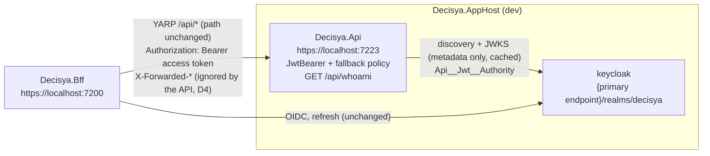

# Architecture note – API host JWT bearer validation (issue #20)

## Context

#20 closes the BFF → `Decisya.Api` data flow that #19 opened. `Decisya.Api` validates the Keycloak access token the BFF attaches, and it protects every endpoint by default. It adds `/api/whoami`, generic error handling, and the Keycloak authority in the AppHost. It adds no module, no `Contracts` project, no Wolverine message and no persisted entity, so `ITenantScoped` does not apply.

Inputs:

- Requirements: `docs/requirements/phase-0/api-jwt-validation.md` (Stories 1-5, NFR-26, NFR-27).
- Prior notes: `docs/architecture/keycloak-realm.md` (issuer, `aud`, `tenant_id`), `docs/architecture/bff-session.md`, and `docs/architecture/bff-api-forwarding.md` (the path is forwarded unchanged; the BFF never parses the token).
- ADRs: [ADR-0002](../adr/0002-keycloak-identity-provider.md) and [ADR-0003](../adr/0003-bff-session-pattern.md).

**No ADR is needed.** This note implements ADR-0002 and ADR-0003 as written.

**Realm: no change.** `deploy/keycloak/decisya-realm.json` already has the `audience-decisya-api` mapper on `decisya-bff`: `oidc-audience-mapper`, `included.custom.audience: decisya-api`, `access.token.claim: true`, `id.token.claim: false`.
- Access tokens the BFF holds today therefore carry `aud` containing `decisya-api`, and #17's `BffLoginFlowTests` already asserts this.
- The ID token's `aud` is `decisya-bff` only.
- Keycloak signs refresh tokens with HS512. The algorithm allow-list rejects them.

## C4 excerpt



## Projects and packages

| Project | Change |
| --- | --- |
| `src/Decisya.Api` | adds a `PackageReference` to `Microsoft.AspNetCore.Authentication.JwtBearer`, which is already pinned at 10.0.12. PR-body line: "first-party JWT bearer handler for access-token validation (ADR-0003)". The project still has one `ProjectReference`, `Decisya.ServiceDefaults`. |
| `tests/Decisya.Api.Tests` | adds `Testcontainers.Keycloak` (already pinned) and links `src/Decisya.AppHost/ContainerImages.cs` as source, the same as `Decisya.Bff.Tests`. |
| `src/Decisya.ServiceDefaults` | `MapDefaultEndpoints` adds `.AllowAnonymous()` to both `MapHealthChecks` calls. Nothing else changes: the endpoints are still Development only and have the same paths and bodies. This is harmless for the BFF, which has no fallback policy. |

- **New packages: none.**
- **Rejected packages:**
  - `Aspire.Keycloak.Authentication` (`AddKeycloakJwtBearer`): it is a preview package, and service-discovery naming would make the metadata host differ from the token's `iss` host.
  - `System.IdentityModel.Tokens.Jwt`: the handler uses `JsonWebTokenHandler`.

## Authentication (namespace `Decisya.Api.Authentication`)

`Program.cs` calls only `builder.AddApiAuthentication()` and `app.MapWhoAmI()`. It never references `JwtBearer` or `Microsoft.IdentityModel` types directly, because `Program` sits in the global namespace and the NetArchTest rule below would otherwise fail.

**`ApiJwtOptions`**, section `Api:Jwt`, bound with `ValidateDataAnnotations().ValidateOnStart()`:

| Key | Rule |
| --- | --- |
| `Api:Jwt:Authority` | Required in every environment, as an absolute URI. It comes from the environment (`Api__Jwt__Authority`). `appsettings*.json` has no value for it. |
| `Api:Jwt:RequireHttpsMetadata` | bool, default `true` |

**`ApiJwtOptionsEnvironmentValidator : IValidateOptions<ApiJwtOptions>`** mirrors `BffOptionsEnvironmentValidator`.
- In Development it returns success.
- Outside Development it fails startup when `Authority` is not absolute `https`, or when `RequireHttpsMetadata` is `false`.
- Its messages name the key, never the value.

**The audience is a constant, not configuration:** `ApiJwtDefaults.Audience = "decisya-api"`.

**`JwtBearerOptions`** (default scheme `JwtBearerDefaults.AuthenticationScheme`, configured through an `IConfigureNamedOptions<JwtBearerOptions>` that reads `IOptionsMonitor<ApiJwtOptions>`, like `OidcOptionsSetup`):

| Option | Value |
| --- | --- |
| `Authority` | `Api:Jwt:Authority`. The issuer and JWKS come from its discovery document. |
| `RequireHttpsMetadata` | `!(IsDevelopment() && !RequireHttpsMetadata && IsLoopback(Authority))`: #18's rule exactly. The loopback hosts are `localhost`, `127.0.0.1` and `::1`. |
| `MapInboundClaims` | `false` |
| `SaveToken` | `false` (the token never enters `AuthenticationProperties`) |
| `IncludeErrorDetails` | `false`. The 401 carries only `WWW-Authenticate: Bearer`, with no `error_description` and an empty body (Story 2). |
| `TokenValidationParameters.ValidAudience` | `decisya-api`; `ValidateAudience = true` |
| `ValidateIssuer`, `ValidateLifetime`, `RequireExpirationTime`, `RequireSignedTokens`, `ValidateIssuerSigningKey` | `true` (set explicitly, not left to defaults) |
| `ValidAlgorithms` | `RS256`, `ES256` |
| `ClockSkew` | `TimeSpan.FromSeconds(60)` (NFR-27) |
| `NameClaimType` | `sub` |
| `RoleClaimType` | not set. Roles are out of scope (G1). |

Two things are forbidden anywhere in `src/**`:
- `IdentityModelEventSource.ShowPII` and `LogCompleteSecurityArtifact`. They stay at their defaults, so neither a token nor a claim value reaches the log.
- A custom `OnChallenge` or `OnAuthenticationFailed` that writes a body.

**Authorization:**

```csharp
options.FallbackPolicy = new AuthorizationPolicyBuilder(JwtBearerDefaults.AuthenticationScheme)
    .RequireAuthenticatedUser()
    .RequireClaim("sub")
    .Build();
```

- Every endpoint, and every unmatched path, requires an authenticated caller with a `sub` claim.
- The only `AllowAnonymous` endpoints are `/health` and `/alive`, through ServiceDefaults.
- No other endpoint may carry `AllowAnonymous`; a test enforces this.
- An anonymous request to an unknown path gets 401, not 404. This means no route discovery.

**Middleware order:**
1. `UseExceptionHandler()` (after `AddProblemDetails()`), in every environment.
2. `UseAuthentication()`
3. `UseAuthorization()`
4. `MapDefaultEndpoints()` and `MapWhoAmI()`

There is no HSTS, no HTTPS redirection and no CORS, because the API has no browser-facing surface.

## Caller identity and `/api/whoami`

- **`CallerIdentity`** is an `internal sealed record CallerIdentity(string UserId, string? TenantId)`, with `static CallerIdentity? From(ClaimsPrincipal)`.
  - It reads only `sub` and `tenant_id` from the validated principal. It never reads `HttpContext.Request.Headers`.
  - It returns `null` when `sub` is missing or when there is more than one `tenant_id` claim.
  - `TenantId` stays the raw string. #22 parses it into `TenantId`.
- **Route: `GET /api/whoami`, not `/whoami` (D1).** The BFF forwards `/api/x` to `https://decisya-api/api/x` unchanged (#19), so the API has to own the `/api` prefix. G1's "`/whoami`, reachable as `/api/whoami`" becomes `/api/whoami` on both hosts. The scenarios' "`GET /whoami`" means `GET /api/whoami` against `Decisya.Api`.
- **Endpoint:** `app.MapGet("/api/whoami", ...)` has no authorization metadata of its own, so it relies on the fallback policy, and that is what the test proves.
  - It returns 200 `WhoAmIResponse { userId, tenantId? }`, a `sealed record` in `Decisya.Api.Authentication`.
  - `tenantId` is left out when absent (`JsonIgnore(WhenWritingNull)`): it is never `""` and never the all-zero GUID.
  - `From` returning `null` gives a 403 generic ProblemDetails.
  - The response carries `Cache-Control: no-store`.
  - It has no roles, no token and no DB access.
- **No OpenAPI file and no `Contracts` type.** No module consumes this DTO. `/api/whoami` is a platform diagnostic, not a `/api/<schema>` module contract. The first module contract starts the OpenAPI document, which is the same decision as `/bff/me` in #18.

## Forwarded headers: off (D4)

- `Decisya.Api` uses neither the scheme nor the remote address for anything: no redirects, no link generation, no IP-based decision and no IP in the logs. Token validation does not depend on either.
- On the host, the BFF's address is loopback, and loopback is already `ForwardedHeadersOptions`' default `KnownProxies`. So "only from the BFF" would in practice mean "from any local process". A real BFF address exists only once 0.16 fixes the deployment network.
- **Decision:** there is no `UseForwardedHeaders`, and `ASPNETCORE_FORWARDEDHEADERS_ENABLED` is never set.
  - Story 5 scenario 1 holds: headers are ignored from every peer.
  - Scenario 2 (applied from the BFF) is **deferred to 0.16**, with `KnownNetworks` set to the BFF's container network. The orchestrator adds it to backlog #83.
  - G1/Marco: please confirm. G3: please rate.

## AppHost (platform-dev)

```csharp
var api = builder.AddProject<Projects.Decisya_Api>("decisya-api", launchProfileName: "https")
    .WithEnvironment("Api__Jwt__Authority", ReferenceExpression.Create(
        $"{keycloak.GetEndpoint("http").Property(EndpointProperty.Url)}/realms/decisya"))
    .WaitFor(keycloak);
```

- The expression is the same one the BFF uses. The API therefore fetches metadata from the same host (`localhost:8080`) that issued the BFF's tokens, the discovery `issuer` equals each token's `iss`, and the scheme follows Aspire's dev-cert termination.
- There is no `WithReference(keycloak)`. Nothing in the API consumes `services__keycloak__*`, and a service-discovery host would not match `iss`.
- There is no new parameter or literal environment value.
- If the Keycloak endpoint turns out to be http because the dev cert is not trusted, the API fails closed: `RequireHttpsMetadata` stays true because the AppHost does not set `Api__Jwt__RequireHttpsMetadata`, and every bearer request gets 401. The BFF behaves the same way. Report it; do not add the flag to the AppHost.

## Tests

**Harness A: local signing key, no Docker, no trait. `tests/Decisya.Api.Tests/Authentication/`**

- `TestTokenIssuer` holds an RSA-2048 key (`RSA.Create`, per test class). It mints tokens with `JsonWebTokenHandler` (which reaches the tests transitively through the JwtBearer package, so no new package) and builds `alg=none` and HS256 tokens by hand: base64url header and payload, and for HS256 an `HMACSHA256` signature.
- The factory sets `Api:Jwt:Authority = https://issuer.test/realms/decisya`, which is never contacted.
- `ConfigureTestServices` sets `PostConfigure<JwtBearerOptions>(scheme, o => o.ConfigurationManager = new StaticConfigurationManager<OpenIdConnectConfiguration>(new() { Issuer = <authority>, SigningKeys = { rsaKey } }))`.
  - `ConfigurationManager` must be replaced, not `Configuration` alone. The framework's post-configure has already built a manager from `Authority`.
- The harness covers:
  - every row of Story 2, including the algorithm confusion with the test key's public key bytes;
  - Story 3;
  - Story 1's shape (with and without `tenant_id`);
  - NFR-27: `exp` = now − 59 s is accepted and now − 61 s is rejected, with the token minted immediately before the request. If this proves flaky, report it; do not widen the margin.
- **Stories 4 and 5:** a test-only `IStartupFilter` appends terminal branches after the app pipeline.
  - `/__test/throw` throws `InvalidOperationException(canary)`: the response is a ProblemDetails 500 with no canary, and the log holds the canary and a `trace_id`. It runs in both Development and Production.
  - `/__test/connection` returns `Request.Scheme` and `Connection.RemoteIpAddress`. Sending `X-Forwarded-Proto: https` and `X-Forwarded-For: 6.6.6.6` changes neither value.
  - Both are called with a valid token. If that filter shape does not reach `UseExceptionHandler`, report it and stop.
- **NFR-27 wording:** its "Verified by" column says Integration. This harness needs no Docker, so G5 moves the row's wording to "`Decisya.Api.Tests` (no trait)".

**Harness B: real Keycloak, `[Trait("Category", "Integration")]`**

- A Keycloak Testcontainers fixture: the #17 pattern, the `ContainerImages` pin and the same realm import.
- The code-flow login uses `OidcTestHelpers.cs` and `SecureCookieRelayHandler.cs`, linked as source from `Decisya.Identity.Tests`. If those files depend on anything else in that project, copy the minimum and say so.
- The API factory runs in Development with `Api:Jwt:Authority` = the **same base URL string** used for the login, and `Api:Jwt:RequireHttpsMetadata=false`. The container host is loopback.
- Cases:
  - `dev-alice` and `dev-admin` access tokens give 200 with the expected `userId` and `tenantId` (Story 1).
  - `dev-alice`'s **ID token** gives 401: a genuine signature with the wrong `aud`.
  - Her refresh token gives 401 (HS512).
  - `alg=none`, and HS256 keyed with the realm's RSA public key taken from JWKS over her genuine claims, both give 401 (NFR-26).
  - Every 401 is checked for an empty body and a bare `WWW-Authenticate: Bearer`.

**Existing tests to update (identity-dev, in the same PR)**

- Every `WebApplicationFactory` in `Decisya.Api.Tests` sets `Api:Jwt:Authority`.
- `HealthEndpointTests`:
  - outside Development, `/alive` and `/health` now answer **401**, because no endpoint exists and the fallback policy applies;
  - the Production endpoint set is exactly `/api/whoami`;
  - the Development set is `/health`, `/alive` and `/api/whoami`;
  - only the health pair carries `IAllowAnonymous`.

## G4 split

| Order | Owner | Paths |
| --- | --- | --- |
| 1 | backend-dev | `src/Decisya.ServiceDefaults/Extensions.cs`: `.AllowAnonymous()` on both health endpoints (one line each) |
| 2 | platform-dev | `src/Decisya.AppHost/AppHost.cs` (above); `docs/GETTING-STARTED.md` smoke row: log in at `https://localhost:7200/bff/login` in Firefox, then open `https://localhost:7200/api/whoami`, which gives `userId` and `tenantId`. VS 2026 (F5 on `Decisya.AppHost`) and CLI (`dotnet run --project src/Decisya.AppHost`) side by side |
| 3 | devops | `.github/workflows/ci.yml`: add `tests/Decisya.Api.Tests/Decisya.Api.Tests.csproj` to the Integration project loop |
| 4 | identity-dev | `src/Decisya.Api/Authentication/**`, `Program.cs`, `Decisya.Api.csproj`, `appsettings*.json` (no Authority value), `tests/Decisya.Api.Tests/**` (both harnesses, csproj, the existing-test updates) |
| G5 | test-engineer | Story 1-5 scenarios; NetArchTest and static rules below; `AppHostConfigurationTests` (`decisya-api` sets `Api__Jwt__Authority` from an expression and `WaitFor(keycloak)`) |

**Fixed interface:**
- configuration keys `Api:Jwt:Authority` and `Api:Jwt:RequireHttpsMetadata`;
- environment key `Api__Jwt__Authority`;
- audience `decisya-api`;
- route `/api/whoami`;
- response fields `userId` and `tenantId`.

## Decisions

- **D1 `/api/whoami` instead of `/whoami`,** so that it works unchanged behind #19's forwarding. This deviates from G1's wording, not from its intent. No ADR.
- **D2 Fallback policy with `sub` required.** Endpoints are secure by default, and the only anonymous endpoints are the health pair. No ADR.
- **D3 Audience as a code constant.** One fewer configuration value to get wrong. The wrong-`aud` tests mint their own tokens. No ADR.
- **D4 Forwarded headers stay off until 0.16.** See the section above. G1/Marco confirm. No ADR.
- **D5 NFR-27 is verified without Docker.** It uses a locally signed token rather than Keycloak, because expiry cannot be forced on a real token without waiting 5 min.

**For G3:**
- D4;
- `RequireHttpsMetadata=false` only in Development with a loopback authority, and the http Testcontainers issuer;
- `IncludeErrorDetails=false` and IdentityModel PII logging left off;
- 401 rather than 404 on unknown paths;
- `WaitFor(keycloak)`, while lazy metadata fetch means a Keycloak outage gives 401, never 500 with detail;
- `RefreshOnIssuerKeyNotFound` (the default, true) handles key rotation.

## NetArchTest rules to add (test-engineer, `tests/Decisya.Api.Tests/Architecture/ApiBoundaryTests`)

| Rule | Assembly |
| --- | --- |
| Only types in `Decisya.Api.Authentication` depend on `Microsoft.AspNetCore.Authentication.JwtBearer` or `Microsoft.IdentityModel` | `Decisya.Api` |
| No type depends on `Microsoft.AspNetCore.HttpOverrides` or `Microsoft.AspNetCore.Builder.ForwardedHeadersExtensions` (D4) | `Decisya.Api` |
| No type depends on `System.IdentityModel.Tokens.Jwt` | `Decisya.Api` |

Static rules, which NetArchTest cannot express:

| Rule | Test class |
| --- | --- |
| `Decisya.Api.csproj` has exactly one `ProjectReference` (`Decisya.ServiceDefaults`), and its only `PackageReference` is `Microsoft.AspNetCore.Authentication.JwtBearer` | `ApiBoundaryTests` |
| No file under `src/` contains `ShowPII` or `LogCompleteSecurityArtifact` | `ApiBoundaryTests` |
| `launchSettings.json`, `appsettings*.json` of `Decisya.Api` and `AppHost.cs` contain no `FORWARDEDHEADERS_ENABLED`, and `appsettings*.json` contain no `Authority` key | `LaunchProfileAndConfigurationTests` |
| Every mapped endpoint except `/health` and `/alive` has no `IAllowAnonymous` metadata | `HealthEndpointTests` (or a new `EndpointAuthorizationTests`) |

<!-- gate: G2 | verdict: PASS | issue: #20 -->
