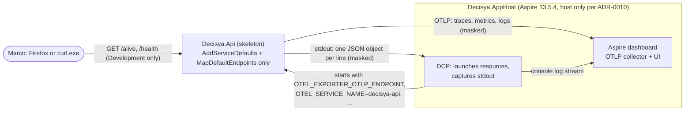
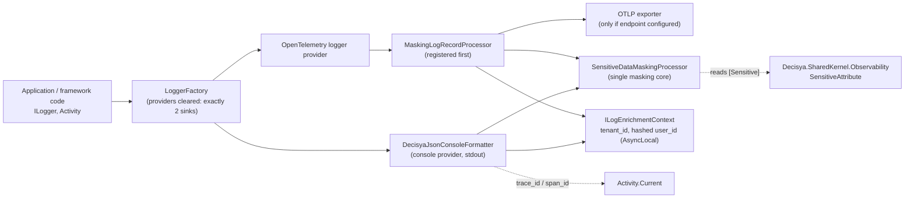

# Architecture note – Aspire AppHost + ServiceDefaults: OTel, health, JSON logs (issue #15)

## Context

Issue #15 (0.03) turns the stock Aspire template into the platform's observability baseline, and adds a `src/Decisya.Api` skeleton so the Done-when can be shown: the Aspire dashboard shows a trace for a health call. Every later host (`Decisya.Api` from #20 on, `Decisya.Bff`, and every module running inside them) inherits this wiring.

This note adds no module and no `Contracts` type. It does add a new host, a cross-cutting logging pipeline, a public attribute in `Decisya.SharedKernel` that future `Contracts` will use, and a new data flow (telemetry from the API to the OTLP collector and to stdout). That is why this note uses the full form.

Inputs:

- Requirements: `docs/requirements/phase-0/apphost-servicedefaults.md` (Stories 1-5) and NFR-10, NFR-11 and NFR-12 in `docs/requirements/nfr.md`.
- Marco's decisions in `docs/ai/pipeline/15.md`:
  - `Decisya.Api` is a real skeleton, not a throwaway host.
  - `/health` and `/alive` are mapped in Development only.
  - G4 and G5 run in the sandbox. Marco does the dashboard check on the host.
- ADRs:
  - 0003: BFF in its own host later, so `Decisya.Api` stays bearer-only.
  - 0005: Contracts reference only SharedKernel. That decides where `[Sensitive]` lives.
  - 0007: nothing here, because #15 adds no storage resource.
  - 0009: .NET 10, Aspire 13.5.4.
  - 0010: the AppHost runs on the host, not in the sandbox.

## C4 excerpt

Container view (dev, as delivered by #15):



Component view of the logging and telemetry path inside every host:



## Project layout

| Path | Kind | References | Owner |
| --- | --- | --- | --- |
| `src/Decisya.Api/Decisya.Api.csproj` | **new**, `Microsoft.NET.Sdk.Web` | `ProjectReference` → `Decisya.ServiceDefaults` only. No `PackageReference`. | backend-dev |
| `src/Decisya.ServiceDefaults/Decisya.ServiceDefaults.csproj` | changed | adds `ProjectReference` → `Decisya.SharedKernel`, and `<InternalsVisibleTo Include="Decisya.ServiceDefaults.Tests" />`. No new package. | backend-dev |
| `src/Decisya.SharedKernel` | changed | adds `Observability/SensitiveAttribute.cs`. No new reference. | backend-dev |
| `src/Decisya.AppHost/Decisya.AppHost.csproj` | changed | adds `ProjectReference` → `..\Decisya.Api\Decisya.Api.csproj`. The Aspire SDK generates `Projects.Decisya_Api`. It does **not** reference ServiceDefaults. | backend-dev |
| `tests/Decisya.ServiceDefaults.Tests` | **new** xunit.v3 project | → ServiceDefaults, SharedKernel | test-engineer (G5). backend-dev may create the project skeleton in G4. |
| `tests/Decisya.Api.Tests` | **new** xunit.v3 project | → Decisya.Api | test-engineer. #20 extends it. |
| `tests/Decisya.AppHost.Tests` | **new** xunit.v3 project, every test `[Trait("Category", "AppHost")]` | → Decisya.AppHost | test-engineer. Runs on the host only (ADR-0010). |

`decisya.slnx`:

- `src/Decisya.Api/Decisya.Api.csproj` goes under `/src/`.
- The three test projects go under `/tests/`.

Test project csprojs copy `tests/Decisya.SharedKernel.Tests/Decisya.SharedKernel.Tests.csproj`:

- `OutputType Exe`, `IsPackable false`;
- the `CA1707` `NoWarn` with its comment;
- the `Xunit` and `AwesomeAssertions` global usings.

Their names end in `.Tests`, so `Directory.Build.props` stamps `Decisya.RepoRoot` automatically.

`Decisya.Api` files:

- `Program.cs`: `WebApplication.CreateBuilder(args)`, then `builder.AddServiceDefaults()`, `builder.Build()`, `app.MapDefaultEndpoints()`, `app.Run()`. Nothing else: no auth, no `AddProblemDetails`, no DbContext, no business endpoint. .NET 10's web SDK generates a public `Program` for `WebApplicationFactory<Program>`. If the test project reports `CS0122` on `Program`, report it and stop (CLAUDE.md). The fallback, `public partial class Program;` at the end of `Program.cs`, needs Marco's approval because it trips `CA1050`.
- `Properties/launchSettings.json`:
  - profiles `http` and `https`, each with a fixed `applicationUrl` on localhost;
  - `ASPNETCORE_ENVIRONMENT=Development`;
  - `launchBrowser: false`;
  - **no `OTEL_*` variable**.
- `appsettings.json`:
  - `Logging:LogLevel` with `Default` = `Information` and `Microsoft.AspNetCore` = `Warning`;
  - **no `OTEL_*` key and no `Logging:Console:FormatterName`**.
- `appsettings.Development.json`: `"Microsoft.AspNetCore.Hosting.Diagnostics": "Information"`. This makes every request write "Request starting" and "Request finished" lines. Story 5 scenario 3 needs a stdout line per health call.

`AppHost.cs`:

```csharp
var builder = DistributedApplication.CreateBuilder(args);
builder.AddProject<Projects.Decisya_Api>("decisya-api");
builder.Build().Run();
```

- The resource name `decisya-api` becomes `OTEL_SERVICE_NAME`, the service name shown on the span (Story 5 scenario 1).
- No `.WithHttpHealthCheck(...)` in #15. Its periodic polling would put a trace in the dashboard every few seconds, now that health requests are traced (see below). Nothing `WaitFor`s the API yet. It is deferred to the deployment issue (0.17) or to the first issue that adds `WaitFor(decisya-api)`, whichever comes first.
- No Postgres, Redis or Keycloak resource. That is the later Phase 0 issue that needs them.

## ServiceDefaults design

Public surface stays in namespace `Microsoft.Extensions.Hosting` for the `Extensions` class (template convention; `ModuleClockUsageRuleTests` references it). New types go in `Decisya.ServiceDefaults.Logging` and `Decisya.ServiceDefaults.Telemetry`.

### Telemetry (Story 1)

- **Exporters:**
  - Keep the template rule: `UseOtlpExporter()` only when `OTEL_EXPORTER_OTLP_ENDPOINT` is non-blank. Move the check into `internal static bool OtlpExporterSelection.IsEnabled(IConfiguration)` so it can be unit tested.
  - **Delete the commented Azure Monitor block** (NFR-12: no vendor SDK, not even as a hint).
  - Register no other exporter: no Console, InMemory, Zipkin or Prometheus exporter.
- **Service name:** don't call `ConfigureResource(...AddService(...))`. The AppHost's `OTEL_SERVICE_NAME` must win, and no host hardcodes it (Story 5 scenario 2).
- **Sources and meters:** replace `AddSource(builder.Environment.ApplicationName)` with `AddSource("Decisya.*")`, and add `AddMeter("Decisya.*")` to metrics. OpenTelemetry .NET supports the wildcard. Every future module's `ActivitySource("Decisya.<Module>")` and `Meter("Decisya.<Module>")` is then picked up without touching ServiceDefaults, which meets the `otel-instrumentation` skill's "added to the ServiceDefaults builders" by construction. Put the prefix in one `internal const string DecisyaTelemetry.SourcePrefix = "Decisya."`.
- **Naming rule for later modules:**
  - Each module declares exactly one `ActivitySource` and one `Meter`, both named `Decisya.<Module>`, in `<Name>Module.cs`, using `System.Diagnostics` only. Modules never reference OpenTelemetry or ServiceDefaults.
  - Span names follow `<Module>.<UseCase>`.
  - Metric names follow `decisya.<module>.<noun>`, with the unit in the `unit` field.
  - Enforcement is deferred to the module-scaffold issue and #22 (see the rules table).
- **Health tracing:**
  - **Remove the `Filter` that excludes `/health` and `/alive` from ASP.NET Core tracing.** The Done-when is a trace *of a health call*. The endpoints exist only in Development, and the AppHost doesn't poll them (above), so there is no noise to filter.
  - The deployment issue (0.17) decides probe exposure and probe sampling in production together.
- **Propagation:** keep `AddHttpClientInstrumentation()` and the default W3C propagator. Outgoing `HttpClient` calls carry `traceparent` (Story 1 scenario 4).
- Keep metrics (ASP.NET Core, HttpClient, runtime), service discovery and `AddStandardResilienceHandler` as in the template.

### Health (Story 2)

`AddDefaultHealthChecks` and `MapDefaultEndpoints` stay as in the template:

- the `self` check is tagged `live`;
- `/alive` evaluates only checks with that tag;
- `/health` evaluates every check, and the default response is 503 on Unhealthy;
- both are mapped only when `IsDevelopment()`.

No change in #15. #20 must keep both anonymous when it adds authorization (note for #20).

### Logging pipeline (Stories 3 and 4)

`ConfigureOpenTelemetry` gains these steps, in this order:

1. `builder.Logging.ClearProviders()`. This removes the Console (simple formatter), Debug, EventSource and EventLog providers that `WebApplication.CreateBuilder` adds. After it, **exactly two sinks exist, and both mask** (fail closed at the provider level).
2. `builder.Services.AddSystemClock()` (SharedKernel) supplies the timestamp. Hosts don't call it again. Tests override it with `FakeClock` after `AddServiceDefaults`.
3. Console sink:
   - `builder.Logging.AddConsole()` and `AddConsoleFormatter<DecisyaJsonConsoleFormatter, DecisyaJsonConsoleFormatterOptions>()`, formatter name `"decisya-json"`.
   - `PostConfigure<ConsoleLoggerOptions>(o => o.FormatterName = "decisya-json")`. `PostConfigure` makes sure configuration (for example `Logging:Console:FormatterName`) can't switch stdout back to an unmasked formatter.
   - `IncludeScopes = true`.
4. OpenTelemetry sink: `builder.Logging.AddOpenTelemetry(o => { o.IncludeFormattedMessage = true; o.IncludeScopes = false; o.AddProcessor(sp => new MaskingLogRecordProcessor(...)); })`, called **before** `AddOpenTelemetryExporters`, so the masking processor sits ahead of the OTLP export processor.
   - `IncludeScopes = false` because the OTLP exporter reads scopes straight from the scope provider, which a processor can't rewrite. Raw scope values would bypass masking. Tenant and user reach OTLP through `ILogEnrichmentContext` instead (below).
5. Register `SensitiveDataMaskingProcessor`, `ILogEnrichmentContext` and `UserIdHasher` as singletons, and bind `DecisyaObservabilityOptions` (below) with `ValidateOnStart()`.

#### JSON line schema (stdout)

`DecisyaJsonConsoleFormatter : ConsoleFormatter` writes one object per record with `Utf8JsonWriter`:

- `Indented = false`;
- `JavaScriptEncoder.Default`, which escapes control characters and newlines, so one record is always exactly one line and log injection can't forge lines;
- a trailing `\n`.

Fields are always present, in this order, and are `null` when there is no value:

| Field | Source |
| --- | --- |
| `timestamp` | `IClock.GetCurrentInstant()`, `InstantPattern.ExtendedIso` (UTC `Z`) |
| `level` | `LogLevel` name |
| `category` | logger category |
| `event_id` | `EventId.Id` |
| `event_name` | `EventId.Name` |
| `message` | see "Message rule" |
| `message_template` | the `{OriginalFormat}` value, or `null` |
| `trace_id` | `Activity.Current?.TraceId.ToHexString()`. `null` when there is no current activity (Story 3 scenario 2) |
| `span_id` | `Activity.Current?.SpanId.ToHexString()`, else `null` |
| `tenant_id` | `ILogEnrichmentContext.TenantId`, else `null` |
| `user_id` | `ILogEnrichmentContext.UserIdHash`, else `null`. A raw id is never written |
| `attributes` | an object: the masked state key/value pairs (without `{OriginalFormat}`), then the masked scope key/value pairs. The state wins on a key clash. A non-key/value scope is masked as a value under key `scope`. |
| `exception` | `exception.ToString()`, or `null` |

Reading `Activity.Current` inside the formatter is correct because `ConsoleLogger.Log` calls the formatter synchronously on the logging thread and only queues the finished string. The NFR-10 test below pins that behaviour, so a framework change that breaks it fails the test.

#### `SensitiveDataMaskingProcessor`: the single masking core

`SensitiveDataMaskingProcessor` is a public sealed class in `Decisya.ServiceDefaults.Logging`. Both sinks call it, so stdout and OTLP can't drift apart. This is the class that `prereqs.py` (`otel-instrumentation`) looks for.

Signature (load-bearing for both sinks and the tests):

```csharp
public sealed class SensitiveDataMaskingProcessor
{
    public const string Mask = "***";
    public MaskedState Process(IReadOnlyList<KeyValuePair<string, object?>>? state);
    public object? ProcessValue(string key, object? value, out bool masked);
}
public readonly record struct MaskedState(
    IReadOnlyList<KeyValuePair<string, object?>> Attributes, bool AnyMasked, string? Template);
```

Rules, applied per key/value pair (the `{OriginalFormat}` pair is kept only as `Template`):

1. **Key deny-list (defence in depth).** The key is compared case-insensitively, with `_`, `-` and `.` removed. If it *contains* one of `password`, `passwd`, `secret`, `token`, `apikey`, `authorization`, `cookie`, `connectionstring` or `querystring`, the value becomes `***`. `querystring` catches ASP.NET Core's own "Request starting" `QueryString` field, which can carry tokens. The list is one `static readonly` array in the class.
2. **Scalars pass through:**
   - `null`, `string`, primitives, `decimal`, `enum`, `Guid`;
   - `DateTime*` values that are handed in (reading them is not banned);
   - `TimeSpan`, `Uri`;
   - NodaTime value types;
   - `Money` (SharedKernel) and `Currency`.
3. **`[Sensitive]` on the value's type** (class, struct or record): the whole value becomes `***`.
4. **Types whose graph contains `[Sensitive]`, or can't be fully determined**, are rendered by the processor, never by `ToString()`. That covers any public instance property or field, at any depth up to 3, that is `[Sensitive]`, or whose declared type is `object`, an interface, abstract, or a collection of any of these. Records' compiler-generated `ToString` prints nested members and would leak them.
   - The value renders as a flat object of its public readable instance properties.
   - Each `[Sensitive]` member becomes `***`. Nested values go through the same rules with depth + 1. At depth > 3 the value becomes `***`.
   - Collections render as `***` unless their element type is scalar.
   - Type shapes are cached in a `ConcurrentDictionary<Type, …>`.
5. **Other non-scalar types** (fully known graph, no `[Sensitive]`) pass through unchanged. The sink renders them with `ToString()`, as Microsoft.Extensions.Logging (MEL) does.
6. **Fail closed** (Story 4 scenario 4, NFR-11):
   - If inspecting a type throws, the whole value becomes `***`.
   - If a property getter throws, that property becomes `***`.
   - The exception is swallowed: never rethrown, never logged through `ILogger` (that could recurse). The record gets the attribute `decisya.masking_error = true`.
   - The rest of the record is always written.
7. **Unstructured state** (state that is not a key/value list, or has no `{OriginalFormat}`): the message becomes `***` and the record gets `decisya.masking_error = "unstructured_state"`. G4 reports any framework log line from `Decisya.Api` startup or a health call that hits this rule. None is expected, because ASP.NET Core logs through `LoggerMessage`.

Message rule, applied by both sinks:

- If `AnyMasked` is false, the message is the MEL-formatted message: the formatter output on stdout, `FormattedMessage` on OTLP.
- If `AnyMasked` is true, the message is the raw **template** (`{OriginalFormat}`). The template holds no values, and all values are in `attributes`, masked. This avoids writing our own template renderer.

`[Sensitive]` is valid on class, struct, property and field only. A parameter-level attribute is invisible in MEL state at run time, so `AttributeTargets` makes the compiler reject it (`CS0592`) rather than silently ignoring it.

#### OTLP adapter: `MaskingLogRecordProcessor`

`MaskingLogRecordProcessor : BaseProcessor<LogRecord>` is internal. In `OnEnd(LogRecord record)`:

- `record.Attributes = masked.Attributes`;
- if `AnyMasked`, or on any masking error, `record.FormattedMessage = null`, so the OTLP body is the template;
- `tenant_id` and `user_id` from `ILogEnrichmentContext` are appended as attributes when they are non-null. OTLP drops null attributes, so the "always present, null" rule applies only to stdout;
- if the whole call throws, `record.Attributes` is replaced by `[decisya.masking_error=true]` and `FormattedMessage = null`. The record is still exported with its level, category, template and trace context.

`OnEnd` runs synchronously on the logging thread, before the batch export processor queues the record, so `ILogEnrichmentContext`'s `AsyncLocal` is still the caller's.

#### Tenant and user context: `ILogEnrichmentContext`

```csharp
public interface ILogEnrichmentContext
{
    string? TenantId { get; }
    string? UserIdHash { get; }
    IDisposable Begin(string? tenantId, string? userId);
}
```

- The implementation is `AsyncLocal`-backed. `Begin` hashes `userId` once and stores only the hash, so the raw id never sits in a log-visible field.
- In #15 nothing calls `Begin` in production code, so both fields are `null` (Story 4 scenario 2).
- Future callers:
  - #20 (0.08): the API's auth middleware, from the validated token;
  - #32 (0.04b): `TenantId` becomes a real type. The logging surface stays `string`, filled from `TenantId.ToString()`;
  - Wolverine tenant middleware (ADR-0005), when messaging lands.
- This replaces "scopes carry TenantId" as the source of `tenant_id`. The `otel-instrumentation` skill's Logs line should be reworded to "`ILogEnrichmentContext` carries the tenant", as a follow-up in a host session, because `.claude/**` is read-only in the sandbox.

`UserIdHasher`:

- HMAC-SHA256 over the UTF-8 user id, keyed with `DecisyaObservabilityOptions.UserIdHashKey`. The output is the first 16 bytes as lowercase hex (32 chars).
- An unkeyed hash is rejected: a dictionary of known ids (emails, usernames) would reverse it.

`DecisyaObservabilityOptions`:

- Bound from section `Decisya:Observability`. Environment variable: `Decisya__Observability__UserIdHashKey`, base64, at least 32 bytes after decoding.
- It is a secret: never in `appsettings*.json` or `launchSettings.json` (invariant 5).
- **Non-Development environments:** a missing or short key fails `ValidateOnStart` and the host refuses to start (fail closed). The deployment issue (0.17) provisions the key.
- **Development:** a missing key generates a random per-process key. The host writes one `Warning` at startup: "user_id hashes are per-process". It never falls back to a raw id.
- The AppHost doesn't supply the key in #15.

### Where `[Sensitive]` lives: SharedKernel

`Decisya.SharedKernel.Observability.SensitiveAttribute` is a `public sealed class SensitiveAttribute : Attribute` with `AttributeTargets.Class | Struct | Property | Field`, `Inherited = true` and no members.

It lives in SharedKernel because:

- the types that carry PII are domain entities, DTOs and **Contracts** messages;
- ADR-0005 allows a Contracts assembly to reference only SharedKernel and other Contracts;
- putting the attribute in ServiceDefaults would force every Contracts assembly to reference ASP.NET Core and OpenTelemetry.

The dependency runs one way: ServiceDefaults → SharedKernel, never back (rule below).

`SensitiveDataMaskingProcessor` lives in ServiceDefaults, because it depends on MEL and OpenTelemetry types.

## Packages

| Package | Status | Used by | Justification |
| --- | --- | --- | --- |
| `OpenTelemetry.Exporter.OpenTelemetryProtocol`, `OpenTelemetry.Extensions.Hosting`, `OpenTelemetry.Instrumentation.AspNetCore`, `.Http`, `.Runtime` | existing | ServiceDefaults | Unchanged. |
| `Microsoft.Extensions.Http.Resilience`, `Microsoft.Extensions.ServiceDiscovery` | existing | ServiceDefaults | Unchanged. |
| `Microsoft.Extensions.Logging.Console`, `System.Text.Json`, `System.Security.Cryptography` | framework | ServiceDefaults | From `Microsoft.AspNetCore.App` (already a `FrameworkReference`). No package. |
| `NodaTime` | existing, transitive via SharedKernel | ServiceDefaults | Timestamp through `IClock` (invariant 4). |
| `Microsoft.AspNetCore.Mvc.Testing` | existing | Decisya.Api.Tests | `WebApplicationFactory<Program>`. |
| `NodaTime.Testing`, `NetArchTest.Rules`, `xunit.v3`, `xunit.runner.visualstudio`, `Microsoft.NET.Test.Sdk`, `AwesomeAssertions` | existing | test projects | Unchanged. |
| **`Aspire.Hosting.Testing` 13.5.4** | **new, test-only** | Decisya.AppHost.Tests | Starts the real AppHost in a test to prove the resource wiring, the OTLP environment injection and the stdout correlation. It must be on the same version as `Aspire.AppHost.Sdk/13.5.4`. Add it with `dotnet add tests/Decisya.AppHost.Tests package Aspire.Hosting.Testing --version 13.5.4` (VS 2026: *Manage NuGet Packages* → version 13.5.4). |

Rejected packages:

- **`OpenTelemetry.Exporter.InMemory`:** a 10-line test-local `CollectingActivityProcessor : BaseProcessor<Activity>` does the same job.
- **`Microsoft.AspNetCore.TestHost`:** the ServiceDefaults tests use real Kestrel on `127.0.0.1:0`.
- **`Microsoft.Extensions.Compliance.Redaction` and `Microsoft.Extensions.Telemetry`** (Microsoft's data-classification and redaction stack):
  - It redacts only `[LoggerMessage]` and `[LogProperties]` call sites. It doesn't cover ad-hoc `ILogger` calls, record `ToString()`, the formatted message or scope values.
  - It would add three packages and put `Microsoft.Extensions.Compliance.Abstractions` into every Contracts assembly.
  - A switch later is a new ADR.

## How G4 proves the Done-when without a browser

G4 runs in the sandbox:

- **Sandbox command:** `dotnet build -warnaserror`, then `dotnet test --filter-not-trait "Category=Integration" --filter-not-trait "Category=AppHost"`. No #15 test needs Docker.
- **VS 2026 equivalent on the host:** *Test Explorer → group by Traits*. Run everything except `Category=AppHost`, then run `Category=AppHost` separately.

Proof layers, from cheapest to closest to the Done-when:

1. **Unit tests** (`Decisya.ServiceDefaults.Tests`, no network):
   - `OtlpExporterSelection.IsEnabled` for set, blank and absent values.
   - `SensitiveDataMaskingProcessor`, one test per rule 1-7 (including a getter that throws, an `object`-typed property holding a `[Sensitive]` type, a record with a nested `[Sensitive]` member, and depth > 3).
   - `DecisyaJsonConsoleFormatter` through its `Write(in LogEntry<T>, IExternalScopeProvider, TextWriter)` with a `StringWriter`:
     - with an `Activity` started by a test `ActivityListener`, `trace_id` and `span_id` match (NFR-10);
     - without an activity, both are `null`;
     - `tenant_id` and `user_id` are present as `null`;
     - a message with `\n` and `"` stays one line and parses with `JsonDocument.Parse`;
     - the raw value of a `[Sensitive]` property appears nowhere in the line, and `***` does.
   - `UserIdHasher`: deterministic for a fixed key, differs across keys, and the output never contains the input.
   - Options validation:
     - Production without a key → `OptionsValidationException` at start;
     - Development without a key → starts and writes one warning.
   - The host has exactly two `ILoggerProvider`s after `AddServiceDefaults` (the console provider and the OpenTelemetry provider), and `ConsoleLoggerOptions.FormatterName == "decisya-json"` even when configuration sets another name.
   - An outgoing `HttpClient` from the host's `IHttpClientFactory`, called inside an activity, sends `traceparent` (capture it with a stub primary handler) (Story 1 scenario 4).
2. **In-process end-to-end** (`Decisya.ServiceDefaults.Tests`, loopback only, so it runs in the sandbox):
   - **Fake OTLP receiver:** `OtlpTestReceiver`, a `WebApplication.CreateSlimBuilder()` bound to `http://127.0.0.1:0` that records request bodies on `POST /v1/traces`, `/v1/logs` and `/v1/metrics`. No protobuf package is needed: the 16 trace-id bytes and the UTF-8 masked/raw strings are searched in the raw body.
   - **Host under test:** a `WebApplication` in environment `Development` on `127.0.0.1:0`, configured like this:
     - `AddServiceDefaults()`;
     - `OTEL_EXPORTER_OTLP_ENDPOINT` = the receiver, and `OTEL_EXPORTER_OTLP_PROTOCOL=http/protobuf`;
     - `MapDefaultEndpoints()`, plus one test-only endpoint that logs an object with a `[Sensitive]` property;
     - a test `CapturingLoggerProvider`, added after `AddServiceDefaults`, which resolves the registered `"decisya-json"` `ConsoleFormatter` and records each formatted line together with `Activity.Current` at log time. This runs the real formatter at real request time without redirecting the process-wide `Console.Out`.
   - **Actions:** send `GET /alive` with a known `traceparent`, then call the test endpoint. Stop and dispose the host; disposal flushes the tracer, meter and logger providers.
   - **Assertions:**
     - the receiver got `/v1/traces` containing the known trace-id bytes (Story 1 scenario 1, the automated proxy for Story 5 scenario 1), and got `/v1/metrics`;
     - every captured line written while an activity was current has matching `trace_id` and `span_id` (NFR-10), and at least one line carries the known trace id;
     - the `/v1/logs` body and every captured line contain `***` and never the raw sensitive string. This proves NFR-11 on both sinks, and that the masking processor runs before the OTLP exporter;
     - without an OTLP endpoint, the same host starts, serves `/alive` and throws nothing (Story 1 scenario 2).
3. **Decisya.Api** (`Decisya.Api.Tests`, `WebApplicationFactory<Program>`, sandbox):
   - in Development, `/alive` and `/health` return 200. With a test-registered failing check, `/health` returns 503 and `/alive` still returns 200;
   - in Production (with a dummy hash key in the configuration), both return 404;
   - the endpoint data source lists exactly `/health` and `/alive`, and no endpoint carries `IAuthorizeData` (Story 5 scenario 4);
   - a `CollectingActivityProcessor` added through `ConfigureTestServices` (`services.ConfigureOpenTelemetryTracerProvider(b => b.AddProcessor(...))`) sees a server span for `GET /alive`;
   - `appsettings*.json` and `Properties/launchSettings.json` contain no key starting with `OTEL_` (Story 5 scenario 2);
   - NFR-12 package closure: `Decisya.Api.deps.json` (copied into the test output by Mvc.Testing) lists no package whose id matches the deny list:
     - `OpenTelemetry.Exporter.*`, except `OpenTelemetry.Exporter.OpenTelemetryProtocol`;
     - `Microsoft.ApplicationInsights*` and `Azure.Monitor.*`;
     - `Datadog.*`, `NewRelic.*`, `Elastic.Apm*`, `Sentry*`, `Honeycomb.*`, `Dynatrace.*` and `Splunk*`.
4. **The real AppHost** (`Decisya.AppHost.Tests`, `Category=AppHost`, **host only**). ADR-0010 keeps the AppHost out of the sandbox, and DCP comes from the Aspire CLI bundle installed on the host.
   - `DistributedApplicationTestingBuilder.CreateAsync<Projects.Decisya_AppHost>()`, then build and start, then wait for the resource `decisya-api` to reach `Running`.
   - Assert that the resource's environment (the `GetEnvironmentVariableValuesAsync` testing extension) holds `OTEL_EXPORTER_OTLP_ENDPOINT` and `OTEL_SERVICE_NAME=decisya-api`. The test must not supply either of them itself. If the testing builder omits the OTLP variables while the dashboard is disabled, set `DisableDashboard = false` in the builder options. If the 13.5 API differs from these names, report the exact compiler or runtime error and stop.
   - `app.CreateHttpClient("decisya-api")`, then `GET /alive` with a known `traceparent`, which returns 200.
   - Watch the resource's console log (`ResourceLoggerService.WatchAsync("decisya-api")`) until a line parses as JSON with `trace_id` equal to the known id, with a 30 s timeout (Story 5 scenario 3).
   - **CI:** `ci.yml`'s unit step gets `--filter-not-trait "Category=AppHost"` added in this PR. Without it, the AppHost test runs on a runner without the Aspire CLI and fails. Running it in CI is a follow-up issue: install the Aspire CLI in the workflow.

G4 evidence in the manifest: the sandbox build and test summary, plus any framework log line hit by rule 7. Marco runs layer 4 on the host after `host-review.py`.

### What Marco checks manually on the host (the literal Done-when)

First run `python .devcontainer/host-review.py` and read `git diff` (ADR-0010).

| Step | Visual Studio 2026 | CLI |
| --- | --- | --- |
| Run the AppHost test | *Test Explorer* → trait `Category=AppHost` → *Run* | `dotnet test --project tests/Decisya.AppHost.Tests` |
| Start the AppHost | Set `Decisya.AppHost` as the startup project, press F5; the dashboard opens in Firefox | `dotnet run --project src/Decisya.AppHost`, then open the dashboard URL with its login token from the console |

Then check in the dashboard:

1. *Resources* shows `decisya-api` as **Running**. Its details show `OTEL_EXPORTER_OTLP_ENDPOINT` and `OTEL_SERVICE_NAME=decisya-api`.
2. Open the resource's http endpoint in Firefox and append `/alive`, or run `curl.exe http://localhost:<port>/alive`. The response is `Healthy`.
3. *Traces* shows a `GET /alive` trace for `decisya-api`. Note the trace id. **This is the Done-when.**
4. *Console logs* → `decisya-api`: one-line JSON records. The "Request starting" and "Request finished" lines carry the same `trace_id`, and `tenant_id` and `user_id` are `null`.
5. *Structured logs*: the same records, linked to the trace.

`docs/GETTING-STARTED.md` step 2 "Verify" text: G4 replaces "the *Resources* page is **empty**…" with steps 1-3 above in the two-column format. G1 decision 1 requires this correction.

## Boundaries and contracts

- **No module and no `Contracts` project.** No Wolverine message. No OpenAPI change, because `/health` and `/alive` are infrastructure endpoints and are not part of the public API contract.
- **New public types:**
  - `Decisya.SharedKernel.Observability.SensitiveAttribute`: used by every future Contracts and Domain assembly.
  - In ServiceDefaults: `SensitiveDataMaskingProcessor`, `MaskedState`, `ILogEnrichmentContext`, `DecisyaObservabilityOptions`, `DecisyaJsonConsoleFormatter` and its options.
- **Dependency directions:**
  - AppHost → Api (project resource only).
  - Api → ServiceDefaults → SharedKernel.
  - SharedKernel depends on nothing in the web or telemetry stack.
  - No project except ServiceDefaults references OpenTelemetry.
- **Tenancy:** no persisted entity, so `ITenantScoped` doesn't apply. `tenant_id` is reserved on every stdout record (invariant 1 covers logs, per ADR-0001's amended context).

## Decisions

- **`[Sensitive]` in SharedKernel, masking in ServiceDefaults, one masking core for both sinks.** No ADR needed: this implements the existing `CLAUDE.md` observability principle within ADR-0005's Contracts rule. A later move to Microsoft.Extensions.Compliance would need an ADR.
- **Health requests are traced, and the AppHost doesn't poll health in #15.** No ADR needed: dev-only behaviour that follows Marco's decision 2. 0.17 revisits it.
- **The `user_id` hash is keyed (HMAC), and a missing key outside Development is fatal.** No ADR needed. It adds a secret that 0.17 must provision. G3 should assess it.
- **OTLP logs without scopes; tenant and user come from `ILogEnrichmentContext`.** No ADR needed. The skill wording update is a follow-up (host session).
- **The AppHost test is host-only and excluded from CI for now.** Consistent with ADR-0010, which keeps the AppHost on the host. Follow-up: a CI issue to install the Aspire CLI in the workflow.

### Deferred, with the issue that owns each item

| Item | Owner |
| --- | --- |
| JWT validation, generic error responses, filling `ILogEnrichmentContext` from the principal, keeping health endpoints anonymous | #20 (0.08) |
| The `TenantId` type | #32 (0.04b) |
| `ITenantScoped`, `Decisya.ArchitectureTests`, repo-wide versions of the rules below | #22 (0.10) |
| Production probes, probe sampling, `WithHttpHealthCheck`, provisioning `UserIdHashKey`, `AllowedHosts` | deployment (0.17) |
| Postgres, Redis and Keycloak resources | the later Phase 0 issue that adds them |
| `Decisya.Bff` | the BFF issue (ADR-0003) |
| Per-module `ActivitySource` and `Meter` | each module's scaffold issue |

### Notes for G3

- Exception text (`exception` field and OTLP `exception.message`) is not masked. It is only as safe as the code that throws, and #20's error middleware is the control.
- The Development-only ephemeral hash key.
- The key deny-list is a heuristic: `[Sensitive]` is the control, and the deny-list is only a backstop.

## NetArchTest rules to add

These rules are implemented by test-engineer in #15. #22 moves them into `Decisya.ArchitectureTests` and widens them.

| Rule | Assemblies | Test class |
| --- | --- | --- |
| SharedKernel does not depend on `Microsoft.AspNetCore`, `Microsoft.Extensions.Logging`, `OpenTelemetry`, `Decisya.ServiceDefaults`, `Decisya.Api` or `Decisya.AppHost` | `Decisya.SharedKernel` | `tests/Decisya.SharedKernel.Tests/Architecture/SharedKernelDependencyTests` |
| ServiceDefaults does not depend on `Decisya.Api`, `Decisya.AppHost` or `Decisya.Modules` | `Decisya.ServiceDefaults` | `tests/Decisya.ServiceDefaults.Tests/Architecture/ServiceDefaultsBoundaryTests` |
| No type depends on a vendor observability namespace: `Microsoft.ApplicationInsights`, `Azure.Monitor`, `Datadog`, `NewRelic`, `Elastic.Apm`, `Sentry`, `Honeycomb` or `Dynatrace` (NFR-12, namespace level; the package-closure check above covers exporters, because the OTLP exporter shares the `OpenTelemetry.Exporter` namespace) | `Decisya.ServiceDefaults`, `Decisya.Api`, `Decisya.SharedKernel` | `ServiceDefaultsBoundaryTests` |
| Only ServiceDefaults depends on `OpenTelemetry`. Hosts get telemetry through `AddServiceDefaults`, and modules will use `System.Diagnostics` only | `Decisya.Api`, `Decisya.SharedKernel` (#22 adds `Decisya.Modules.*`) | `tests/Decisya.Api.Tests/Architecture/ApiBoundaryTests` |
| `SensitiveAttribute` is defined exactly once, in `Decisya.SharedKernel.Observability`, and is sealed. No other `src` assembly declares a type named `SensitiveAttribute` that the masker wouldn't recognise (reflection test over the loaded `Decisya.*` assemblies) | all `Decisya.*` src assemblies | `ServiceDefaultsBoundaryTests` |
| Deferred to #22 and module-scaffold: every static `ActivitySource` or `Meter` field in `Decisya.Modules.*` has `Name == "Decisya." + <Module>` (reflection test) | `Decisya.Modules.*` | `Decisya.ArchitectureTests.TelemetryNamingTests` |

`tests/Decisya.SharedKernel.Tests/Architecture/ModuleClockUsageRuleTests.cs` needs a comment update: ServiceDefaults now references NodaTime through SharedKernel. The test still passes, because ServiceDefaults calls `AddSystemClock()` and never uses `SystemClock` itself. test-engineer updates the comment.

<!-- gate: G2 | verdict: PASS | issue: #15 -->
