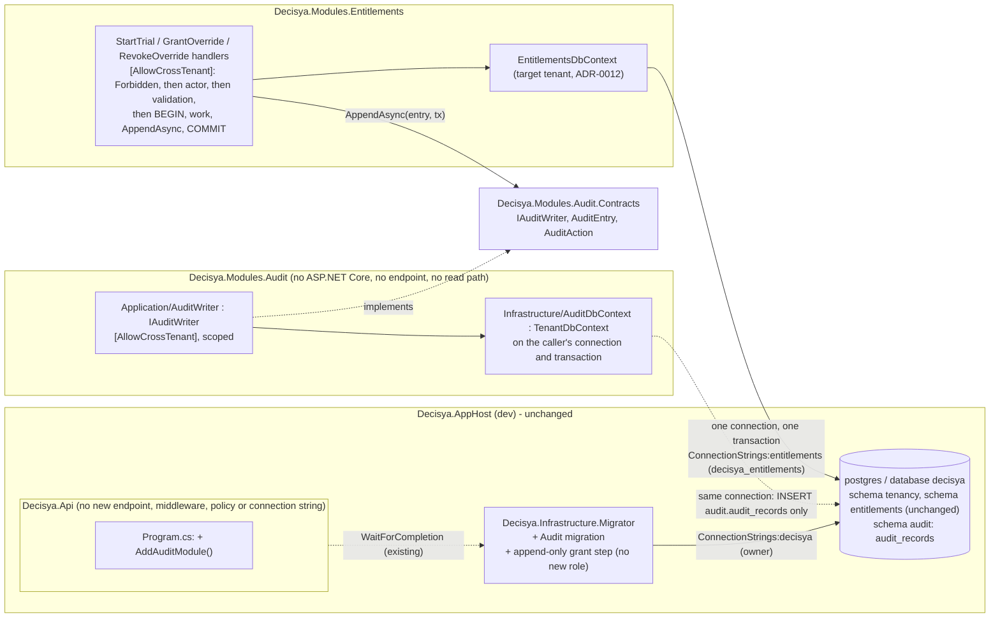

# Architecture note – Modules.Audit: append-only audit log for cross-tenant admin commands (issue #24)

## Context

#24 (0.12) adds `Decisya.Modules.Audit` and `Decisya.Modules.Audit.Contracts` (ADR-0005) with schema `audit` and one table, `audit.audit_records`. It also wires one record into each of the three Entitlements admin handlers (`StartTrial`, `GrantOverride`, `RevokeOverride`) in the same unit of work, which closes #23 G3 C-1.
- **Done when:** no application database role can update or delete an audit row.

Inputs:
- `docs/ai/pipeline/24.md`: Marco's decisions of 2026-10-01 and G1 Q1-Q3.
- `docs/requirements/phase-0/audit-module.md`: Stories 1-6, NFR-36, NFR-37, R-1 to R-5.
- `docs/architecture/entitlements-module.md` (#23) and `docs/architecture/tenancy-module.md` (#21). This note follows them wherever it doesn't say otherwise.
- ADR-0001, ADR-0005 and ADR-0012.

**ADR:** [ADR-0013](../adr/0013-audit-records-in-the-audited-command-transaction.md) (**Accepted, Marco 2026-10-01**) settles G1 R-1, the main risk. The audit row is appended in the audited command's own transaction, on its own connection. As a result, the audited module's role holds `INSERT` on `audit.audit_records` and nothing else in `audit`. This is a role writing into another module's schema, which changes an ADR-0005 platform pattern, so it is recorded as an ADR. Everything else implements ADR-0001, ADR-0005 and ADR-0012 as written.

## C4 excerpt



## Projects and ownership

| Path | Kind | G4/G5 owner |
| --- | --- | --- |
| `src/Modules/Audit/Decisya.Modules.Audit.Contracts/` `IAuditWriter.cs`, `AuditEntry.cs`, `AuditAction.cs` | **written at G2** (fixed surface below). The scaffold adds the `.csproj` and never overwrites these files | architect (done); backend-dev runs the scaffold |
| `src/Modules/Audit/Decisya.Modules.Audit/` (`Domain/`, `Application/`, `Infrastructure/` incl. `Migrations/`, `AuditModule.cs`). **No `Endpoints/`** | new, module-scaffold phases 1 and 2 | backend-dev |
| `src/Modules/Entitlements/Decisya.Modules.Entitlements/` (three handlers, `CallerActor`, errors, log, csproj ProjectReference to `Decisya.Modules.Audit.Contracts`) | changed | backend-dev |
| `src/Decisya.Infrastructure.Migrator/` (`MigrationRunner.cs`, `.csproj`). `Program.cs` is **unchanged** | changed | backend-dev |
| `src/Decisya.Api/Decisya.Api.csproj` (ProjectReference) and `tests/Decisya.Api.Tests/Architecture/ApiBoundaryTests.cs` (expected reference set, now 4) | changed | backend-dev |
| `src/Decisya.Api/Program.cs` (one line) | changed | identity-dev |
| `tests/Decisya.ArchitectureTests/ArchitectureScope.cs`, `ContractsScope.cs` and the csproj references | changed | backend-dev (module-scaffold step 7) |
| `tests/Decisya.ArchitectureTests/` new rules `CrossTenantAuditRule`, `ExplicitTransactionRule` and their fixtures | new | test-engineer (G5) |
| `tests/Modules/Decisya.Modules.Audit.Tests/` (created by `scaffold.py`, run by backend-dev; every later edit) and `tests/Modules/Decisya.Modules.Entitlements.Tests/**` | new / changed | test-engineer (backend-dev's lane gap, manifest decision) |
| `tests/Decisya.Infrastructure.Migrator.Tests/**` | changed | test-engineer |
| `deploy/sql/audit/<timestamp>.sql` (`--idempotent` script) and `.github/workflows/ci.yml` (Integration loop gains the Audit test project) | new / changed | devops |
| `src/Decisya.AppHost/**`, `tests/Decisya.AppHost.Tests/**`, `AppHostConfigurationTests` | **unchanged** (no new resource, parameter, variable or connection string) | platform-dev: nothing to do |
| `decisya.slnx` | root file | backend-dev runs `dotnet sln add`; the orchestrator does it if the write boundary blocks it |

**Packages: none added.** The module uses `Npgsql.EntityFrameworkCore.PostgreSQL`, `NodaTime` and `Microsoft.Extensions.DependencyInjection.Abstractions` (all pinned and in use), and the tests add `NodaTime.Testing`. `System.Data.Common` (`DbTransaction`) is part of the shared framework, not a package. The module has **no** `FrameworkReference` to `Microsoft.AspNetCore.App` and no Wolverine.

## Contracts (`Decisya.Modules.Audit.Contracts`)

These files are already written. backend-dev doesn't change them without G2.

- **`IAuditWriter`** is the only operation:

  ```csharp
  Task AppendAsync(AuditEntry entry, DbTransaction transaction, CancellationToken cancellationToken = default);
  ```

  - It appends one `succeeded` record inside the caller's **open** transaction, on that transaction's connection.
  - It never opens a connection, commits or rolls back.
  - It is registered scoped.
- **`AuditEntry(TenantId TenantId, AuditAction Action, string? FeatureKey)`** is a `sealed record`:
  - `TenantId` is the command's target tenant (G1 Q1);
  - `FeatureKey` is the catalog key for the override actions and **`null`** for trial start. This is the "empty FeatureKey" of G1 Story 2, and G5 asserts `null`.
  - The entry deliberately has **no actor, time, trace id or outcome**. The writer reads the actor from `ICurrentCaller`, the time from `IClock` and the trace id from `Activity.Current`, so a caller can neither forge nor omit them. The outcome is always `succeeded` in #24 (G1 Q2).
- **`AuditAction`** is an enum: `EntitlementsTrialStart = 1`, `EntitlementsOverrideGrant = 2`, `EntitlementsOverrideRevoke = 3`. The stored codes live in the module, not in Contracts.
- `FeatureKey` is a `string`, not Entitlements' `FeatureKey`, so Audit (platform infrastructure) never depends on a business module's contract. The writer enforces the shape (below).
- `TenantId` is allowed in this Contracts assembly. The Entitlements rule "no `TenantId` in a public member" covers only `Decisya.Modules.Entitlements.Contracts`.

Nothing else is public in Contracts: no read, query, update or delete (G1 Story 5).

**OpenAPI: none.** #24 has no HTTP surface, so `api-contract` does not apply.

## Domain and persistence (schema `audit`)

**`AuditRecord`** (`Domain/`, `internal sealed`, `ITenantScoped`):
- every property is get-only;
- there are no mutators and no navigations;
- it has a private parameterless constructor for EF;
- the only factory is `static AuditRecord Create(TenantId tenantId, AuditAction action, string? featureKey, string actorUserId, Instant occurredAt, string? traceId)`, with `Id = Guid.CreateVersion7()` and `Outcome = AuditOutcome.Succeeded`;
- `internal enum AuditOutcome { Succeeded = 1 }`.

There is no FK to any other schema (ADR-0005).

| Column | Type | Notes |
| --- | --- | --- |
| `id` | `uuid` PK | `ValueGeneratedNever()`. There is no store-generated column, so EF's `INSERT` has no `RETURNING` and needs no `SELECT` privilege |
| `tenant_id` | `uuid not null` | target tenant |
| `occurred_at` | `timestamptz not null` | NodaTime `Instant`, through a module-internal `InstantConverter` (the third copy; see Deferred) |
| `actor_user_id` | `varchar(255) not null` | the opaque IdP `sub`, unhashed (G1; R-2) |
| `action` | `varchar(64) not null` | `entitlements.trial.start`, `entitlements.override.grant` or `entitlements.override.revoke`, through an explicit `AuditAction` to code map (`AuditActionConverter`), never enum names |
| `outcome` | `varchar(16) not null` | `succeeded` |
| `feature_key` | `varchar(64) null` | |
| `trace_id` | `varchar(32) null` | W3C trace id, lowercase hex |

Constraints and index, all named explicitly:
- `ck_audit_records_action`: `action IN ('entitlements.trial.start', 'entitlements.override.grant', 'entitlements.override.revoke')`
- `ck_audit_records_outcome`: `outcome IN ('succeeded')`
- `ck_audit_records_feature_key`: `(action = 'entitlements.trial.start') = (feature_key IS NULL)`
- `ck_audit_records_trace_id`: `trace_id IS NULL OR trace_id ~ '^[0-9a-f]{32}$'`
- `ck_audit_records_actor`: `length(btrim(actor_user_id)) > 0`
- `ix_audit_records_tenant_occurred (tenant_id, occurred_at)`, which leads with `tenant_id` (ef-migration skill) for the future reader.

There is no sequence in the schema.

**`AuditDbContext : TenantDbContext`** is `public sealed` (the migrator constructs it):
- the #22 constructor convention and `OnTenantModelCreating` with `HasDefaultSchema("audit")`;
- `ConfigureConventions` calls `base` first, then registers `Instant` and `AuditAction`/`AuditOutcome` converters;
- its only set is `internal DbSet<AuditRecord> Records => Set<AuditRecord>()`. There is **no public `DbSet`**, and `AuditRecord` is internal, so nothing outside the module can name the entity to read it (G1 Story 5).

**`AuditDbContextOptions`** (public static):
- `Configure(DbContextOptionsBuilder, string connectionString)`: `UseNpgsql(cs, o => o.MigrationsHistoryTable("__EFMigrationsHistory", "audit"))`. It is used by the migrator, the design-time factory and the tests;
- `internal static DbContextOptions<AuditDbContext> ForConnection(DbConnection connection)`: `UseNpgsql(connection)`, which the writer uses. Never `contextOwnsConnection: true`: the caller owns the connection.

`internal sealed AuditDesignTimeDbContextFactory` uses `Host=design-time.invalid` and an `Invalid` resolution, as in #23.

**Migration** (ef-migration skill):
- The migration is `AddAuditRecords` in `Infrastructure/Migrations`, with its snapshot.
- CLI: `dotnet ef migrations add AddAuditRecords --project src/Modules/Audit/Decisya.Modules.Audit --startup-project src/Decisya.Infrastructure.Migrator --context AuditDbContext --output-dir Infrastructure/Migrations`.
- VS 2026 (Package Manager Console, default project `Decisya.Modules.Audit`): `Add-Migration AddAuditRecords -Context AuditDbContext -OutputDir Infrastructure/Migrations -StartupProject Decisya.Infrastructure.Migrator`.
- The SQL script is devops's: `dotnet ef migrations script --idempotent … --context AuditDbContext -o deploy/sql/audit/<timestamp>.sql`, or `Script-Migration -Idempotent -Context AuditDbContext …` in the PMC.
- **Rollback header:** `Down` drops `audit.audit_records` and **every audit record with it**. Dump schema `audit` (`pg_dump -n audit`) first. The migrator never runs `Down`.

## The writer (`AuditWriter : IAuditWriter`)

```csharp
[AllowCrossTenant("Writes the audit record of a cross-tenant admin command in a context scoped to the command's target tenant, on the caller's own transaction (ADR-0012, ADR-0013). Insert only.")]
internal sealed class AuditWriter(ICurrentTenant ambient, ICurrentCaller caller, IClock clock) : IAuditWriter
```

`AppendAsync` checks, in this order. Every message is a fixed string that never contains entry or caller values (G1 Story 3):

| # | Check | Failure |
| --- | --- | --- |
| 1 | `entry` and `transaction` not null | `ArgumentNullException` |
| 2 | `transaction.Connection` not null (a completed transaction has none) | `InvalidOperationException` |
| 3 | `entry.TenantId.IsInitialized`; `Enum.IsDefined(entry.Action)`; `FeatureKey` is `null` iff the action is `EntitlementsTrialStart`, and otherwise matches `\A[a-z][a-z0-9_]*\.[a-z][a-z0-9_]*\z` with at most 64 characters | `ArgumentException` |
| 4 | Ambient resolution is `None`, or `Tenant` equal to `entry.TenantId`. `Invalid`, or another tenant, is refused. This keeps a future tenant-scoped caller from auditing into another tenant | `InvalidOperationException` |
| 5 | `caller.UserId` (throws when there is no caller) is non-blank and at most 255 characters | `InvalidOperationException` |

Then:
1. Read `now = clock.GetCurrentInstant()`, and `traceId = Activity.Current?.TraceId` as lowercase hex when the activity exists and its id is not `default`, else `null`. A missing activity never fails the write (G1 Story 3).
2. Create the context: `await using var db = new AuditDbContext(AuditDbContextOptions.ForConnection(connection), new TargetTenant(TenantResolution.For(entry.TenantId)))`. `TargetTenant` is a module-internal copy of the #23 type.
3. Enlist it: `await db.Database.UseTransactionAsync(transaction, ct)`.
4. Add `AuditRecord.Create(…)` and call `SaveChangesAsync` once.

A database error propagates. The caller's transaction is then uncommitted, so the command rolls back too.

**Telemetry:** the module's `ActivitySource` and `Meter` are `Decisya.Audit` (from the scaffold). The writer starts one activity, `Audit.Append`, tagged `decisya.audit.action` (the code). There is **no counter**: an append inside an uncommitted transaction is not a fact, and Entitlements' `admin_commands` counter already records committed outcomes. The writer **logs nothing**.

**`AuditModule`** (public):
- `TelemetryName = "Decisya.Audit"`, `Schema = "audit"`, `RecordsTable = "audit_records"`;
- `AddAuditModule(this IServiceCollection)` takes **no connection string** and registers only `IAuditWriter` → `AuditWriter`, scoped. **No `DbContext` is registered**: nothing reads, and the writer never connects on its own.

## Entitlements handlers (C-1; G1 Stories 2 and 4)

Each handler's constructor gains `ICurrentCaller caller` and `IAuditWriter audit`. The #23 rules on the constructor (ambient tenant and options, never the DI context) still hold. The order is fixed (G1 Q3):

1. **Forbidden** precondition, unchanged (G4-23-01): ambient `Tenant` or `Invalid` gives `entitlements.forbidden`, with no database access.
2. **Actor:** `CallerActor.IsKnown(caller)` is an `internal static` helper in `Application/`. It returns `false` when `caller.UserId` throws `InvalidOperationException` (the documented "no validated caller" contract of `ICurrentCaller`) or is blank. `false` gives **`entitlements.actor_unknown`** (`ErrorCategory.Forbidden`, fixed message "An entitlement admin command was refused: the caller has no validated user id."), with no database access. The shape is the same as `Refuse()`: a Warning `EntitlementsLog.CommandActorUnknown(command)` and the metric outcome set to the code.
3. **Validation**, unchanged.
4. **Unit of work:**

   ```csharp
   await using var db = new EntitlementsDbContext(options, new TargetTenant(TenantResolution.For(command.TenantId)));
   await using var tx = await db.Database.BeginTransactionAsync(cancellationToken);
   // the #23 body, unchanged: reads, SaveChangesAsync, 23505 / concurrency handling, early refusals
   await audit.AppendAsync(new AuditEntry(command.TenantId, <action>, <feature or null>), tx.GetDbTransaction(), cancellationToken);
   await tx.CommitAsync(cancellationToken);
   // success log, then Result.Success()
   ```

   - An early return (`trial_already_used`, the 23505 loser) or any exception leaves `tx` uncommitted, and `DisposeAsync` rolls back. No audit row is written for a refusal (G1 Q2).
   - The success logs move **after** `CommitAsync`.
   - `GetDbTransaction()` is `DbContextTransactionExtensions`, not on the bypass list. The handlers never call `GetDbConnection`.

**The #23 race and re-read paths still work** (G1 R-1, NFR-37):
- EF Core creates a savepoint before each `SaveChangesAsync` inside a user transaction, and rolls back to it when that call fails (auto-savepoints, on by default; no provider setting changes it). A 23505 or concurrency exception therefore leaves the transaction usable. Without the savepoint, every later statement would fail with Postgres's 25P02 ("current transaction is aborted").
- **StartTrial:** a 16-way race still serializes on `ux_trial_grants_tenant`. A loser's insert waits until the winner **commits** (now after the winner's audit insert), then raises 23505 and returns `trial_already_used` with nothing committed. Result: one grant, one record.
- **GrantOverride:** on 23505, `ChangeTracker.Clear()`, re-query, `Replace` and save once more, all in the same transaction. Under READ COMMITTED each statement sees the winner's committed row. `AppendAsync` runs once, **after** the try/catch, so the failed first attempt leaves no orphan record.
- **RevokeOverride:** a missing override still appends one `entitlements.override.revoke` record (G1 Story 2). A `DbUpdateConcurrencyException` rolls back to the savepoint, then `Clear()`, then the record is appended. Two concurrent revokes give two records, one per command.
- `AutoSavepointsEnabled` and `AutoTransactionBehavior` are never set, and no retrying execution strategy is added (ADR-0013; rule below).

**Justification text** for each handler: `"Platform-admin command on an explicit target tenant, run in a context scoped to that tenant (ADR-0012). Audited in the same transaction through IAuditWriter (#24, ADR-0013)."` It still contains `#24` and `ADR-0012`, so the existing test stays green until test-engineer tightens it.

The G4-23-02 reachability rules are **unchanged** (G1 Story 6). #25 relaxes them.

## Database, roles, migrator, AppHost and API

**No new role in #24** (ADR-0013 point 3). The only application role that touches `audit` is `decisya_entitlements`. Its grants in `audit` are `USAGE ON SCHEMA audit` and `INSERT ON audit.audit_records`, and **nothing else**: no `SELECT`, `UPDATE`, `DELETE`, `TRUNCATE`, `REFERENCES`, `TRIGGER` or `CREATE`, and nothing on `audit."__EFMigrationsHistory"` or any sequence. `decisya_tenancy` has nothing in `audit`.

**The generic `ProvisionModuleRoleAsync` does not fit, and stays unchanged.** It creates a login role and grants `SELECT, INSERT, UPDATE, DELETE ON ALL TABLES`. The migrator gets a separate append-only step instead.

**Migrator** (backend-dev):
- `RunAsync`'s signature, `Program.cs` and every configuration key are **unchanged**.
- After the Entitlements migration and role step, `RunAsync` migrates `AuditDbContext` (owner connection, `Invalid` resolution, history table in `audit`). It then calls a new `private static ProvisionAppendOnlyGrantsAsync(ownerConnectionString, schema: AuditModule.Schema, table: AuditModule.RecordsTable, writerRoles: [EntitlementsModule.DatabaseRole], moduleRoles: [TenancyModule.DatabaseRole, EntitlementsModule.DatabaseRole], ct)`.
- That step runs these statements **in one transaction** on a plain `NpgsqlConnection`, so a re-run never has a window with the grant missing. Every identifier goes through `QuoteIdentifier`, as in #21. The migrator is outside `ArchitectureScope`.
  1. `REVOKE ALL ON SCHEMA "audit" FROM PUBLIC`
  2. `REVOKE ALL ON ALL TABLES IN SCHEMA "audit" FROM PUBLIC` and `REVOKE ALL ON ALL SEQUENCES IN SCHEMA "audit" FROM PUBLIC`
  3. for each module role: `REVOKE ALL ON ALL TABLES IN SCHEMA "audit" FROM <role>`, `REVOKE ALL ON ALL SEQUENCES IN SCHEMA "audit" FROM <role>` and `REVOKE ALL ON SCHEMA "audit" FROM <role>`. This narrows first, so a re-run can never widen (G1 Story 1, last scenario).
  4. for each writer role: `GRANT USAGE ON SCHEMA "audit" TO <role>` and `GRANT INSERT ON "audit"."audit_records" TO <role>`
- The ordering matters: the step runs after `decisya_entitlements` exists (Entitlements provisioning) and after the table exists (Audit migration).
- The `.csproj` adds a ProjectReference to `Decisya.Modules.Audit`.

**AppHost** (platform-dev): **no change**. There is no new resource, parameter, environment variable or connection string. The writer uses the Entitlements connection.

**API:**
- identity-dev adds one line to `Program.cs`, **before** `AddEntitlementsModule`: `builder.Services.AddAuditModule();`. `ValidateOnBuild` then proves the handlers' new dependencies resolve. `ICurrentCaller` and `ICurrentTenant` come from #21's `RequestCaller`, and `IClock` from ServiceDefaults.
- No `Decisya.Api.Tests` factory needs a new placeholder.
- backend-dev adds the `Decisya.Modules.Audit` ProjectReference and updates `ApiBoundaryTests` to four references.

## Reconciliation with G1 (for G3, G5 and Marco)

| G1 | In #24 |
| --- | --- |
| Scope "behind its own least-privilege database role"; Story 6 "the module's database role is provisioned … SCRAM verifier" | **Changed by ADR-0013:** there is no Audit login role until a reader exists. G5 asserts instead that no `decisya_audit` role exists, the migrator's configuration keys are unchanged, and `AppHostConfigurationTests` still sees exactly two API connection strings. ADR-0013: Accepted, Marco 2026-10-01 |
| Story 1 "the role that writes the audit table" | `decisya_entitlements`, the only writer role. "Every database role the application uses" (NFR-36) means `decisya_tenancy` and `decisya_entitlements` |
| Story 1 "`GRANT UPDATE ON audit.audit_records TO PUBLIC` fails with 42501" | Postgres raises **WARNING 01007** ("no privileges were granted"), not an error, for a role that holds some privilege on the object without grant option, which `decisya_entitlements` does (INSERT). G5 accepts either 42501 or 01007, then asserts that the table's ACL (`aclexplode(relacl)`) holds only the owner and `decisya_entitlements=a`. For `decisya_tenancy` the statement fails with 42501 (no `USAGE` on the schema) |
| Story 1 "The audit role has no privilege on other modules' schemas" | No audit role exists. The writer role's other privileges are #23's existing assertions |
| Story 2 "an empty FeatureKey" | `feature_key IS NULL` |
| Story 5 isolation | It runs on `AuditDbContext` built directly through `AuditDbContextOptions.Configure` (the test seam) under each ambient. A write for tenant B under A fails the #22 guard, `None` reads zero rows, and `Invalid` throws before SQL |

## Decisions

- **D1 The audit row is appended in the command's own transaction, on its connection.** `decisya_entitlements` gets `INSERT` only on `audit.audit_records`. **ADR-0013** (Accepted, Marco 2026-10-01).
- **D2 There is no `decisya_audit` role, password or connection string in #24.** The first reader adds a `SELECT`-only role. **ADR-0013.**
- **D3 The contract is the single `IAuditWriter.AppendAsync(AuditEntry, DbTransaction, ct)`.** The actor, time and trace id are read by the writer, not passed. The outcome is implicit (`succeeded`). No ADR beyond ADR-0013.
- **D4 The audit record is `ITenantScoped` to the target tenant**, and the writer is an ADR-0012 target-tenant-scope `[AllowCrossTenant]` type. No ADR: this is ADR-0012 applied (G1 Q1).
- **D5 The actor check is `CallerActor.IsKnown`**, with no change to `ICurrentCaller` (its shape test stays). Order: Forbidden, then actor, then validation (G1 Q3). No ADR.
- **D6 The #23 race paths rely on EF Core auto-savepoints inside the explicit transaction.** No `ON CONFLICT`, no raw SQL, no advisory lock. No ADR beyond ADR-0013 point 4.
- **D7 There is no audit counter and no writer log.** The `Decisya.Audit` source and meter are registered. No ADR.
- **D8 The DB enforces append-only with role grants only.** No trigger and no hash chain (G1 deferral; R-3). No ADR.

## NetArchTest and static rules to add (G5 test-engineer unless noted)

| Rule | Assemblies / files | Test class |
| --- | --- | --- |
| `ArchitectureScope` gains `typeof(AuditModule).Assembly`, so the TenantModel, TenantIdImmutability, CrossTenantQuery, AllowCrossTenantJustification and BulkTenantMove rules cover it (**backend-dev**, scaffold step 7) | ArchitectureTests | `ModuleBoundaryTests`, `ArchitectureScopeTests` (existing) |
| `ContractsScope` gains `typeof(IAuditWriter).Assembly`. The existing Contracts rules then apply: only SharedKernel and `*.Contracts`, no EF Core, Npgsql, Wolverine, ASP.NET Core or `SharedKernel.Results` (**backend-dev**) | ArchitectureTests | `ContractsBoundaryTests` (existing) |
| **C-1 guard, new `CrossTenantAuditRule`:** every `[AllowCrossTenant]` type in `ArchitectureScope` outside `Decisya.Modules.Audit` references `Decisya.Modules.Audit.Contracts.IAuditWriter::AppendAsync` (IL scan through `CompilerGeneratedTypeWalk`, so async state machines count). Fixtures: `TenancyViolations/UnauditedCrossTenantHandler` fails and `TenancyCompliant/AuditedCrossTenantHandler` passes. It covers every future module, including #25 | ArchitectureTests | `TenancyRuleTests`, `ModuleBoundaryTests` |
| **ADR-0013, new `ExplicitTransactionRule`:** in `ArchitectureScope`, `DatabaseFacade::BeginTransaction(Async)`, `RelationalDatabaseFacadeExtensions::BeginTransaction(Async)` and `::UseTransaction(Async)`, and `DatabaseFacade::EnlistTransaction` are referenced only by exactly `StartTrialHandler`, `GrantOverrideHandler`, `RevokeOverrideHandler` and `AuditWriter`. No type references `DatabaseFacade::set_AutoSavepointsEnabled` or `::set_AutoTransactionBehavior` | ArchitectureTests | `ModuleBoundaryTests` |
| The three Entitlements handlers and `AuditWriter` reference, from `CrossTenantQueryRule.BypassList`, **only** `TenantResolution.For`: no raw SQL, `GetDbConnection`, `IgnoreQueryFilters`, `GetDatabaseValues` or `Reload`. The attribute permits them, but these types must not use them | Entitlements, Audit | `EntitlementsModuleBoundaryTests`, `AuditModuleBoundaryTests` |
| Each handler's constructor takes `IAuditWriter` and `ICurrentCaller` in addition to #23's set. Each justification contains `ADR-0012`, `ADR-0013` and `IAuditWriter` (replaces the "#24 prerequisite" assertion; G1 Story 6) | Entitlements | `EntitlementsModuleBoundaryTests` |
| `Decisya.Modules.Entitlements` references `Decisya.Modules.Audit.Contracts` and not `Decisya.Modules.Audit` (positive and negative assertion) | Entitlements | `EntitlementsModuleBoundaryTests` |
| All G4-23-02 rules pass **unchanged** (G1 Story 6 scenario 4) | Entitlements | `EntitlementsModuleBoundaryTests` (existing) |
| The scaffold's two rules (no other module's implementation, no `NodaTime.SystemClock`). In addition: no `Microsoft.AspNetCore*` or `Wolverine*` reference, no `FrameworkReference` in the csproj, no `Decisya.Modules.Audit.Endpoints` namespace or folder | Audit | `AuditModuleBoundaryTests` |
| `InternalsVisibleTo` is exactly `Decisya.Modules.Audit.Tests`. The only `[AllowCrossTenant]` type in the module is `AuditWriter`, and it is not public | Audit | `AuditModuleBoundaryTests` |
| Public surface. `Audit.Contracts` exports exactly `IAuditWriter`, `AuditEntry` and `AuditAction`, and `IAuditWriter` has exactly one method, `AppendAsync(AuditEntry, DbTransaction, CancellationToken)`. `Decisya.Modules.Audit` exports exactly `AuditModule`, `AuditDbContext` and `AuditDbContextOptions`. No exported member's signature mentions `AuditRecord`, `DbSet<>` or `IQueryable<>`. `AuditRecord` is internal with no public or internal setter and no instance method besides the getters (G1 Story 5) | Audit | `AuditModuleBoundaryTests` |
| No `Domain` or `Application` type has a `DateTime`, `DateTimeOffset` or `TimeZoneInfo` member or parameter. `AuditRecord.OccurredAt` is `Instant` (G1 Story 3) | Audit | `AuditModuleBoundaryTests` |
| DI: `AddAuditModule()` registers `IAuditWriter` → `AuditWriter` **Scoped**, and registers no `DbContext` or `DbContextOptions` | Audit | `AuditRegistrationTests` |
| EF model: exactly one entity type, in schema `audit`, `ITenantScoped`, default schema `audit`. The five check constraints and `ix_audit_records_tenant_occurred` exist by name (design-time model). `HasPendingModelChanges()` is false through the design-time factory | Audit | `AuditModelTests` |
| Static: the `Decisya.Api.csproj` ProjectReferences are exactly ServiceDefaults, Tenancy, Entitlements and Audit, and the only PackageReference is still JwtBearer (**backend-dev**) | csproj | `ApiBoundaryTests` |
| Static: `AppHostConfigurationTests` passes **unchanged**. `decisya-api` sets exactly `ConnectionStrings__tenancy` and `ConnectionStrings__entitlements`, which proves no new connection string | `AppHost.cs` | `AppHostConfigurationTests` (existing) |
| **Done-when, NFR-36 (Testcontainers):** after `RunAsync`, each of `decisya_tenancy` and `decisya_entitlements` runs `UPDATE`, `DELETE` and `TRUNCATE` on `audit.audit_records`, and each fails with `42501` with the seeded row unchanged. As `decisya_entitlements`: `INSERT` succeeds; `SELECT` on `audit.audit_records` and on `audit."__EFMigrationsHistory"` fails with `42501`; `ALTER TABLE`, `DROP TABLE`, `CREATE TABLE audit.t (id int)` and `SET ROLE postgres` fail with `42501`; `GRANT UPDATE … TO PUBLIC` fails with 42501 or warns 01007 and grants nothing (ACL check). `has_table_privilege` is exactly `INSERT` among `SELECT, INSERT, UPDATE, DELETE, TRUNCATE, REFERENCES, TRIGGER`, `has_schema_privilege(…, 'audit', 'CREATE')` is false, and there are no sequences in `audit`. `decisya_tenancy` has no `USAGE` on `audit`, and `SELECT` and `INSERT` fail with `42501`. No `decisya_audit` role exists. Everything still holds after a second `RunAsync`. The #23 cross-schema tests (tenancy and entitlements cannot read each other) pass unchanged | migrator | `AuditGrantsIntegrationTests` (new), `EntitlementsRoleIntegrationTests` (existing) |
| The Audit migration creates exactly `audit.audit_records` with its constraints and index in schema `audit`, and its history table in `audit` | migrator | `MigrationRunnerIntegrationTests` |

**G5 behaviour tests** (Stories 2-5, NFR-37), with `FakeClock` and a stub `ICurrentCaller` (user id optional; it throws when unset):
- **End to end as `decisya_entitlements`:**
  - Run each of the three commands against a database migrated by `MigrationRunner.RunAsync`, connected as `decisya_entitlements` (the Entitlements test project references the migrator). This is the only proof that EF's insert needs no `SELECT`, and that the savepoint paths work under the real role.
  - Roles are cluster-wide, so use one dedicated container or collection, as the migrator tests do.
- **Fault matrix (NFR-37):**
  - The audit write fails (a test `IAuditWriter` decorator that throws after the real append, and a real DB failure such as a revoked `INSERT` in a dedicated database), and then no entitlement row changes.
  - The entitlement write fails (an EF `SaveChangesInterceptor` that throws), and then no audit row exists.
  - The 16-way `StartTrial` race gives exactly one grant and one record.
  - The `GrantOverride` 23505 re-read path gives one row and exactly one record.
  - A concurrent revoke gives one record per command.
- **Refusals write nothing:**
  - `Forbidden` under `Tenant` and `Invalid`, and `actor_unknown` under `None` with no user id, with the unreachable host: no DB access at all.
  - `actor_unknown` beats validation: an invalid feature and an empty reason under `None` with no user id give `actor_unknown`.
  - `trial_already_used` and validation failures write no record.
- **Content:**
  - Each record's action, feature key, actor, `OccurredAt` equal to the fake clock, trace id equal to the current activity's, and a `null` trace id with no activity.
  - The `MARKER-9f3a` reason never appears in any audit column, log, exception message, metric tag or activity tag, on success or on a failed append.
  - An undefined `AuditAction`, a bad feature key or an action/feature mismatch throws `ArgumentException` before any SQL.
  - The writer refuses an `Invalid` ambient, or a `Tenant` ambient for another tenant.
- **Isolation:** the isolation-test skill over `AuditRecord` (read by collection and by id, the write guard). A command for tenant A adds records only for A.
- **Harness:** the module tests create the audit table next to the Entitlements tables. `EnsureCreated` on a second context in a database that already has tables does nothing, so use `IRelationalDatabaseCreator.CreateTablesAsync()` for `AuditDbContext`, or migrate.

## G4 split and interfaces

| Order | Owner | Delivers | Consumed by |
| --- | --- | --- | --- |
| 1 | backend-dev | <ul><li>Scaffold: `python .claude/skills/module-scaffold/scripts/scaffold.py Audit audit`, then `dotnet sln add src/Modules/Audit/Decisya.Modules.Audit.Contracts src/Modules/Audit/Decisya.Modules.Audit tests/Modules/Decisya.Modules.Audit.Tests`. In VS 2026, run the script in *View → Terminal*, then *Solution Explorer → right-click solution → Add → Existing Project…* for the three `.csproj` files.</li><li>The module csproj: Persistence reference, EF Npgsql, NodaTime, `InternalsVisibleTo Decisya.Modules.Audit.Tests`, no ASP.NET Core.</li><li>`AuditRecord`, `AuditOutcome`, `AuditWriter`, `TargetTenant`, `AuditDbContext` and its options, the converters, the design-time factory, the `AddAuditRecords` migration, and `AuditModule`.</li><li>Entitlements: the ProjectReference to Audit.Contracts, the three handlers as specified, `CallerActor`, `EntitlementsErrors.ActorUnknown` and `EntitlementsLog.CommandActorUnknown`.</li><li>Migrator: the Audit migration and `ProvisionAppendOnlyGrantsAsync`, plus the csproj reference.</li><li>`Decisya.Api.csproj` reference plus `ApiBoundaryTests`.</li><li>`ArchitectureScope`, `ContractsScope` and the ArchitectureTests csproj references.</li></ul> | everyone |
| 2 | identity-dev | `Program.cs`: `builder.Services.AddAuditModule();` before `AddEntitlementsModule` | G5 |
| 3 | test-engineer (G4 fix-up, before the orchestrator's G4 build and test check) | <ul><li>`EntitlementsHarness`: register `AddAuditModule()` and a stub `ICurrentCaller` (default user id `3f2d1c9a-8b7e-4d6c-a5f4-0e1d2c3b4a59`), and create the audit table in the test database; the project gains references to `Decisya.Modules.Audit` (and to the migrator for the end-to-end tests).</li><li>The Audit test project: `Decisya.TestInfrastructure` and `NodaTime.Testing` references.</li></ul>These are needed because the handlers' new constructor dependencies would otherwise fail `ValidateOnBuild` in every Entitlements test | G4 check |
| — | platform-dev | **Nothing**: AppHost unchanged | — |
| 4 | devops | `deploy/sql/audit/<timestamp>.sql`. `ci.yml` Integration loop: add `tests/Modules/Decisya.Modules.Audit.Tests/Decisya.Modules.Audit.Tests.csproj` | G5, CI |
| — | orchestrator | `decisya.slnx` if blocked; the #83 entries (Deferred) | — |
| G5 | test-engineer | The rules table and the behaviour tests above | — |

**Fixed interface:**
- Contracts files as written: `IAuditWriter.AppendAsync(AuditEntry, DbTransaction, CancellationToken)`, `AuditEntry(TenantId, AuditAction, string?)`, `AuditAction` with values 1-3.
- Database:
  - schema `audit`, table `audit_records` with the columns above;
  - checks `ck_audit_records_action`, `ck_audit_records_outcome`, `ck_audit_records_feature_key`, `ck_audit_records_trace_id` and `ck_audit_records_actor`;
  - index `ix_audit_records_tenant_occurred`;
  - stored action codes `entitlements.trial.start`, `entitlements.override.grant` and `entitlements.override.revoke`, and outcome `succeeded`.
- Grants: `decisya_entitlements` holds `USAGE` on `audit` and `INSERT` on `audit.audit_records`, nothing else. No new role.
- Error code: `entitlements.actor_unknown` (Forbidden). The six #23 codes are unchanged.
- `AuditModule.TelemetryName = "Decisya.Audit"`, `Schema = "audit"`, `RecordsTable = "audit_records"`, `AddAuditModule(IServiceCollection)`.
- Configuration keys, AppHost parameters and connection strings: **unchanged**.

## Deferred (orchestrator: to #83 unless owned)

- The audit reader (an audited `[AllowCrossTenant]` handler), the `decisya_audit` `SELECT`-only role, and any tenant-visible view: #25 or later (ADR-0013 point 3; G1 R-5).
- Replacing the `DbTransaction` contract with the Wolverine EF Core outbox when Wolverine arrives (ADR-0013, Bad consequence): to #83.
- Retention, erasure of `actor_user_id` (G1 R-2), a trigger against the owner, a hash chain and WORM export (G1 R-3): to #83.
- Auditing refusals (G1 Q2, R-4), and auditing tenant-user actions or other modules: to #83.
- `InstantConverter`: Audit makes the **third** copy, against the #23 note's "before a third module copies it". This keeps #24 to the C-1 scope. The #83 entry stays, and now says "move into `Decisya.Infrastructure.Persistence` and delete the three copies".
- The lane gap (`tests/Modules/**`, `tests/Decisya.Infrastructure*.Tests/**`, `deploy/sql/**`) is already on #83 per the manifest.

## Notes for G3

- **Cross-schema write (ADR-0013).** `decisya_entitlements` can `INSERT`, and only insert, into `audit.audit_records`. A bug or injection in the Entitlements SQL path could add forged rows for any tenant or actor. It cannot read, change, delete or truncate any row. Rate whether a trigger or an actor-format check is needed before #25. Role separation offers no defence against a compromised API process, which holds every role's connection string.
- **The `DbTransaction` crosses into Audit.** `AuditWriter` runs on the Entitlements connection with that role. A rule limits it to `TenantResolution.For` among the bypass-list members, so it uses no raw SQL and no `GetDbConnection`.
- **The actor is read twice from the same scoped `ICurrentCaller`.** Entitlements reads it for the refusal, and the writer reads it for the record. It is never passed, so it cannot be forged by the caller.
- **The writer's ambient check** refuses `Invalid` and a foreign `Tenant`. Under `None` it trusts the caller's target, which is the ADR-0012 model.
- **Savepoints.** The race paths depend on EF auto-savepoints. A rule bans turning them off, and the end-to-end tests prove the 23505 paths under the real role.
- **No new secret:** no role, password parameter or connection string is added. The migrator's grant step is transactional and narrows before it grants, so a re-run never widens privileges.
- **Logs and errors:** the writer logs nothing, its exception messages are fixed, and the Npgsql detail switches are banned (`NoSensitiveEfSwitchesTests`). The override reason never reaches the audit path.

<!-- gate: G2 | verdict: PASS | issue: #24 -->
