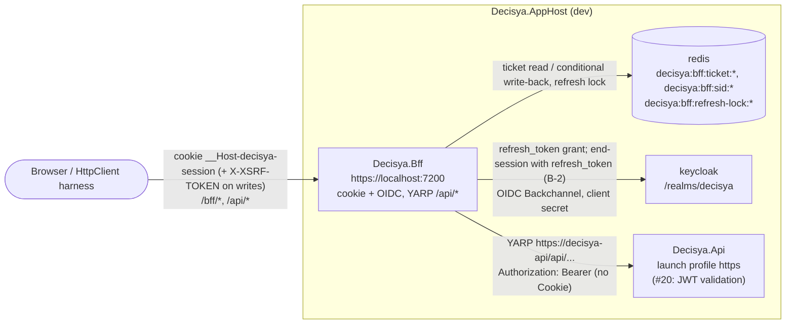

# Architecture note – BFF `/api` forwarding, server-side token injection, refresh (issue #19)

## Context

#19 adds the BFF → `Decisya.Api` data flow promised by ADR-0003: YARP in `Decisya.Bff` forwards `/api/*` with the caller's Keycloak access token attached server-side, refreshes that token under a per-session lock, and closes #18's G3 carry-overs B-1, B-2 and B-3. It adds no module, no `Contracts` project, no Wolverine message and no persisted entity.

Inputs: `docs/requirements/phase-0/bff-api-forwarding.md` (Stories 1-7, NFR-24, NFR-25), `docs/architecture/bff-session.md` (#18, its "#19 boundary"), `docs/security/threat-models/bff-session.md` (B-1..B-3, T-12, T-13), ADR-0002, ADR-0003, ADR-0007. Realm facts used below: `accessTokenLifespan` 300 s, `ssoSessionIdleTimeout` 1800 s, `revokeRefreshToken: true`, `refreshTokenMaxReuse: 0` (strict rotation: a refresh token works once, which is why the lock matters).

**#20 boundary.** `Decisya.Api` does not validate the token in #19 (it has no authentication middleware and no business endpoint). JWT validation (`iss`, `aud`, `exp`, RS256/ES256 allow-list) and the API's `/api/<schema>` endpoints are #20. #19's tests prove only what the BFF attaches and strips, and what it returns to the browser. The BFF never parses the access token, and #20 must not rely on the BFF having checked it.

## C4 excerpt



```mermaid
sequenceDiagram
  participant B as Browser
  participant F as Decisya.Bff
  participant R as Redis
  participant K as Keycloak
  participant A as Decisya.Api
  B->>F: POST /api/x (cookie, X-XSRF-TOKEN)
  F->>R: GET ticket (cookie auth); anonymous -> 401
  F->>F: antiforgery (writes) -> 403
  F->>F: expires_at - now > 30 s? -> forward as is
  F->>R: SET refresh-lock NX PX 10000
  F->>R: re-read ticket (another instance may have refreshed)
  F->>K: grant_type=refresh_token (5 s, no retry)
  alt 200
    F->>R: write ticket IF key exists (new access + rotated refresh)
    F->>A: forward, Authorization: Bearer new
  else 400 invalid_grant (B-1)
    F->>R: SignOut -> delete ticket, clear cookie
    F-->>B: 401
  end
  F->>R: release lock (only if token matches)
```

## Projects and packages

| Project | Change |
| --- | --- |
| `src/Decisya.Bff` | adds `PackageReference`s `Yarp.ReverseProxy` (already pinned, 2.3.0) and `Microsoft.Extensions.ServiceDiscovery.Yarp`. Still exactly one `ProjectReference` (`Decisya.ServiceDefaults`). |
| `Directory.Packages.props` | **new pin:** `Microsoft.Extensions.ServiceDiscovery.Yarp`, same version as the pinned `Microsoft.Extensions.ServiceDiscovery` (10.10.0). PR-body line: "first-party Aspire resolver so YARP resolves `https://decisya-api` through the service discovery ServiceDefaults already registers; no hand-parsing of Aspire's `services:*` configuration." First-party Microsoft, so the host run stays as the manifest records; G3 confirms. |
| `src/Decisya.AppHost` | `decisya-api` gets `launchProfileName: "https"` (today it gets the `http`-only first profile, so no `https` endpoint exists to resolve), and `decisya-bff` gets `.WithReference(api)`. No `WaitFor(api)`: the BFF's `/bff` surface works without the API, and an unreachable API gives YARP's 502. |
| `tests/Decisya.Bff.Tests` | adds `NodaTime.Testing` (already pinned, test-only). No other new package. |

Rejected: reading `services:decisya-api:https:0` by hand (re-implements the resolver and hard-codes Aspire's config shape); `https+http://` (silent downgrade to plaintext for a bearer token when the https endpoint is missing, so we fail loudly instead); Duende BFF / `Duende.AccessTokenManagement` (ADR-0003); an IHttpClientFactory client for the refresh (ServiceDefaults adds the standard resilience handler to every factory client, and a retried refresh POST under strict rotation can burn the refresh token).

## Forwarding (namespace `Decisya.Bff.Proxy`)

- **Route table in code, not configuration:** `AddReverseProxy().LoadFromMemory(...)` with one route and one cluster, plus `AddServiceDiscoveryDestinationResolver()`. There is no `ReverseProxy` section in any `appsettings*.json`, so no configuration source can add a route or destination.
  - Route `api`: `Match.Path = "/api/{**catch-all}"`, `Match.Methods = GET, HEAD, POST, PUT, PATCH, DELETE` (no other verb can slip past the mutating-method check), `AuthorizationPolicy = "default"` (authenticated user).
  - Cluster `decisya-api`, one destination, `Address = BffOptions.Api.Address` (`Bff:Api:Address`, `appsettings.json` value `https://decisya-api`). Validation: required, absolute; outside Development the scheme must be `https` (same pattern as `RequireHttpsMetadata`). Tests override it with the test double's `http://127.0.0.1:<port>` (the resolver passes non-service hosts through).
  - The path is forwarded unchanged (`/api/x` → `https://decisya-api/api/x`); the API owns `/api/<schema>` (#20).
- **Request transforms** (applied to route `api`):

  | Header | Action |
  | --- | --- |
  | `Cookie` | removed (session, antiforgery and XSRF cookies never leave the BFF) |
  | `Authorization` | removed, then set to `Bearer <access token>` from `ForwardedAccessTokenFeature` (a client-supplied value is never forwarded) |
  | `X-XSRF-TOKEN` | removed |
  | `Forwarded` | removed |
  | `X-Forwarded-For/Proto/Host/Prefix` | YARP default (`Set`, which overwrites client values) |
  | `traceparent`/`tracestate` | YARP's propagator, so API spans join the BFF trace |
  | everything else | copied (YARP default) |

- **Response transforms:** `Set-Cookie` is removed (the API must never set a cookie on the BFF origin). Everything else, status code and body pass through unchanged, including a future #20 `401` with `WWW-Authenticate`. The BFF adds nothing.
- **Pipeline order** (401 before 403, nothing forwarded on any rejection):
  1. `UseAuthentication()` / `UseAuthorization()` (existing). Anonymous `/api` → the route's `default` policy → cookie `OnRedirectToLogin` → **401**, never a redirect (#18 already sets that event). Any verb, antiforgery header or not.
  2. `app.MapReverseProxy(pipeline => { ... })` with, in order:
     1. `ApiAntiforgeryMiddleware` (B-3): for POST, PUT, PATCH, DELETE calls the shared check → **403** ProblemDetails.
     2. `AccessTokenMiddleware`: asks `AccessTokenProvider` for a fresh token. `Token` → sets `ForwardedAccessTokenFeature` and continues; `SessionEnded` → `SignOutAsync(cookie scheme)` (deletes the ticket, clears the cookie) and **401**; `Unavailable` → **503** generic ProblemDetails, session kept.
     3. YARP's standard steps (session affinity, load balancing, passive health checks), as its custom-pipeline docs require.
- **B-3, why not the endpoint filter itself.** YARP endpoints are not minimal-API route handlers, so `AddEndpointFilter` on `MapReverseProxy` is silently ignored. The validation body of `AntiforgeryEndpointFilter` moves into `Decisya.Bff.Security.AntiforgeryCheck.ValidateAsync(HttpContext)`; the `/bff` filter and `ApiAntiforgeryMiddleware` both call it, so `/bff` and `/api` share one rule (same methods, same `SkipAntiforgeryMetadata` opt-out, which no `/api` route uses). The G4-18-02 metadata test cannot see the proxy pipeline; its `/api` counterpart is behavioural (Story 6).

## Token refresh (namespace `Decisya.Bff.Session`)

- **Where the tokens live:** unchanged from #18. The ticket at `decisya:bff:ticket:{key}` carries `access_token`, `refresh_token`, `id_token` and `expires_at` (ISO 8601 "o", written by the OIDC handler with `SaveTokens`). The BFF reads `expires_at`; it never decodes the JWT.
- **Session key on the request:** `RedisTicketStore` overrides `ITicketStore.RetrieveAsync(string key, HttpContext httpContext, CancellationToken)` (the overload the cookie handler calls) and, on a successful read, sets an internal `SessionKeyFeature(string Key)`. The key is never logged.
- **Why not `CookieValidatePrincipalContext.ShouldRenew`:** a renew makes the cookie handler recompute `ExpiresUtc` from "now", which would slide #18's absolute 10 h session (D2). Write-back therefore goes straight to the store and the ticket's `ExpiresUtc` is kept as is. The cookie is not reissued (the key does not change).
- **Freshness (NFR-24):** fresh when `expires_at − IClock.now > 30 s`. A missing or unparsable `expires_at` counts as stale. The 30 s lead time is a constant in `AccessTokenProvider`, not configuration.
- **Per-session lock (NFR-25), `RedisRefreshLock`:**
  - Key `decisya:bff:refresh-lock:{sessionKey}`, value a per-attempt GUID, TTL **10 s**, via `IDatabase.LockTakeAsync` / `LockReleaseAsync` (release only if the value still matches, so an expired-and-retaken lock is never released by the wrong holder).
  - It works across BFF instances because it is in the shared Redis. No in-process lock or cache is added.
- **`AccessTokenProvider.GetAsync(HttpContext, CancellationToken)`**, returning `Token(string) | SessionEnded | Unavailable`:
  1. The authenticated ticket (already loaded by the cookie handler) is fresh → `Token`. No Redis or Keycloak call.
  2. Otherwise, up to a **10 s** deadline (by `IClock`):
     - **Lock acquired:** re-read the ticket (`RetrieveAsync(key)`); `null` → `SessionEnded`; fresh (another request or instance refreshed it) → `Token`. Otherwise call Keycloak (below):
       - 200: set `access_token`, `refresh_token` (the rotated one; keep the old one only if the response omits it), `id_token` if present, and `expires_at = IClock.now + expires_in` on `ticket.Properties`. The principal is not rebuilt (claims change at the next login). Then `RedisTicketStore.TryUpdateTokensAsync(key, ticket)`: one transaction with `Condition.KeyExists(ticketKey)`, same protector and TTL computation as `RenewAsync`, so a logout or back-channel logout that raced the refresh is never undone. `false` → `SessionEnded`; `true` → `Token`.
       - 400 with `error=invalid_grant` (**B-1**) → `SessionEnded`.
       - anything else (timeout, network, 5xx, `invalid_client`) → `Unavailable`. The ticket is kept.
       - The lock is released in `finally`.
     - **Lock held by someone else:** wait 100 ms, re-read the ticket: `null` → `SessionEnded` (the holder hit B-1, so every waiter gets 401 too); fresh → `Token`; else try the lock again.
     - Deadline passed → `Unavailable` (503).
  3. Redis exceptions from the lock or the conditional write propagate to `UseExceptionHandler` (generic 500, nothing forwarded), as #18's `Store`/`Remove` do.
- **Keycloak calls, `KeycloakTokenClient`:** uses the OIDC handler's own `OpenIdConnectOptions` (`IOptionsMonitor.Get(OpenIdConnectDefaults.AuthenticationScheme)`): `ConfigurationManager` for `token_endpoint` and `end_session_endpoint`, and `Backchannel` as the `HttpClient` (same TLS and `RequireHttpsMetadata` rules as login, no resilience retries, and the test can count calls on it). Client authentication is `client_secret_post` (`client_id`, `client_secret` from `BffOptions`), the same as the code exchange. Refresh: `grant_type=refresh_token`, `refresh_token`, 5 s linked timeout (below the 10 s lock TTL), no retry, no `scope`.
- **Telemetry:** counter `decisya.bff.token_refreshes` tagged `result` = `success | invalid_grant | error | lock_timeout`. Logs carry the trace id and the result, never a token, the session key or the Keycloak response body.

## B-2: server-side Keycloak logout

- `POST /bff/logout`, before the existing cookie sign-out:
  1. Take the session's refresh lock (same 10 s bounded wait), so logout never sends a refresh token that a concurrent refresh is about to rotate, then re-read the ticket's `refresh_token`.
  2. `KeycloakTokenClient.EndSessionAsync`: `POST {end_session_endpoint}` (discovery; `/realms/decisya/protocol/openid-connect/logout`) form `client_id`, `client_secret`, `refresh_token`, 3 s timeout, no retry. Keycloak answers 204 and ends the whole SSO user session, which is the T-12 residual (the browser's Keycloak SSO cookie can no longer silently re-login). Keycloak then sends its own back-channel logout to `/bff/backchannel-logout`, which is idempotent.
  3. **Fail open locally (G1 decision 2):** any failure (lock timeout, network, timeout, non-2xx, no refresh token) is logged with the trace id and counted in `decisya.bff.keycloak_logout.failures` (tag `reason`); the flow continues.
  4. Then #18's flow unchanged: cookie sign-out (ticket deleted, cookie cleared), then the end-session redirect without `id_token_hint` as the fallback (D3).
- **Chosen over RFC 7009 `revocation_endpoint`:** revocation guarantees the refresh token is dead but not that the SSO session ends, and the SSO session is exactly T-12's residual. The end-session call with a refresh token is Keycloak behaviour on the standard `end_session_endpoint`. It stays in one method of `KeycloakTokenClient`; an IdP replacement (ADR-0002) swaps that method for RFC 7009. #18's G3 recorded that B-2 needs no new ADR.

## Integration test design (identity-dev builds the harness, test-engineer the scenarios)

- **Test double for `Decisya.Api`, test project only:** `ApiDouble`, a minimal `WebApplication` on `http://127.0.0.1:0` inside `tests/Decisya.Bff.Tests`. One catch-all endpoint records method, path and all request headers into a `ConcurrentQueue` and answers 200 with a fixed JSON body `{"ok":true}`. It never echoes a header or body. No probe or echo endpoint is added to `Decisya.Api` or `Decisya.Bff`. The factory sets `Bff:Api:Address` to the double's URL.
- **Expiry by clock control:** the factory registers a NodaTime `FakeClock` as `IClock`, started at the real `SystemClock` instant (the OIDC handler writes `expires_at` from real time). Advancing it past `expires_at` makes the token expired for the BFF (Done-when); `expires_at − 29 s` / `− 31 s` pin the NFR-24 threshold. Because the BFF computes the new `expires_at` from `IClock` + `expires_in`, the refreshed ticket is consistent with the fake time. Rejected: shortening the realm's access-token lifespan (affects every test in the fixture and still needs real waiting).
- **Counting Keycloak calls:** the factory sets `OpenIdConnectOptions.BackchannelHttpHandler` (with `Configure`, which runs before the framework's post-configure builds `Backchannel`) to a counting `DelegatingHandler` that records `grant_type=refresh_token` POSTs and end-session POSTs, and can be told to throw for the end-session path (Story 5, Keycloak unreachable).
- **NFR-25 across instances:** two factories on the same Redis, key-ring directory, `FakeClock` and counting handler (the #18 restart pattern); 5 + 5 concurrent requests with the same cookie. Assert one refresh call, 10 forwarded requests with the same new token, 10 successes.
- **B-1:** end the user's Keycloak sessions through the admin API (the #17 fixture's admin client), advance the clock, call `/api`: 401, ticket key absent in Redis, the double received nothing; a second call: 401.
- **B-2:** read the refresh token from Redis through the store's protector before logout (#18's token-leak pattern), log out, then POST a refresh grant with it directly to Keycloak: `invalid_grant`.
- **Token leak (NFR-21):** every `/api` response is scanned for the ticket's token values, as in #18.

## AppHost wiring (platform-dev)

```csharp
var api = builder.AddProject<Projects.Decisya_Api>("decisya-api", launchProfileName: "https"); // #20 adds .WithReference(keycloak)

builder.AddProject<Projects.Decisya_Bff>("decisya-bff", launchProfileName: "https")
    .WithReference(redis)
    .WithReference(api)          // injects services__decisya-api__https__0 for service discovery
    // existing Bff__Oidc__* environment and WaitFor(redis/keycloak) unchanged
```

No new environment key and no new parameter. If the Api's `https` profile raises a diagnostic under `-warnaserror` or the dev certificate is not trusted for `localhost:7223`, report the exact error and stop; do not fall back to http.

## G4 split

| Order | Owner | Paths |
| --- | --- | --- |
| 1 | platform-dev | `Directory.Packages.props` (the `Microsoft.Extensions.ServiceDiscovery.Yarp` pin), `src/Decisya.AppHost/AppHost.cs` (above) |
| 2 | identity-dev | `src/Decisya.Bff/**` (`Proxy/*`, `Session/AccessTokenProvider`, `RedisRefreshLock`, `KeycloakTokenClient`, `SessionKeyFeature`, `RedisTicketStore` additions, `Security/AntiforgeryCheck`, `BffOptions.Api`, logout change, `appsettings.json` `Bff:Api:Address`), `tests/Decisya.Bff.Tests/**` harness (`ApiDouble`, `FakeClock` wiring, counting backchannel handler) |
| G5 | test-engineer | Story 1-7 scenarios, `BffBoundaryTests` changes below, `AppHostConfigurationTests` (`decisya-api` on the `https` profile, `decisya-bff` references `decisya-api`) |

Interface fixed here: resource name `decisya-api`, configuration key `Bff:Api:Address`, service URL `https://decisya-api`, Redis key prefix `decisya:bff:refresh-lock:`.

## Decisions

- **D1 Refresh on `/api` only, in the proxy pipeline.** `/bff/me` does not refresh; T-13's idle-timeout effect (B-1) arrives on the first `/api` call whose token is within 30 s of expiry. No ADR.
- **D2 Write-back through the store with a `KeyExists` condition, not cookie renewal.** Keeps D2 of #18 (absolute 10 h) and never resurrects a logged-out ticket. No ADR.
- **D3 Redis lock with polling waiters, 10 s TTL and wait bound, 5 s Keycloak timeout.** No ADR; implements ADR-0003's stated consequence.
- **D4 B-3 through a shared check in a proxy middleware**, because endpoint filters do not run on YARP endpoints. Deviation in wording from G1 Story 6 ("the same `AntiforgeryFilter`"), not in behaviour.
- **D5 B-2 through Keycloak's end-session endpoint with the refresh token** (rationale above). No ADR (#18 G3).
- **D6 Non-`invalid_grant` refresh failures → 503, session kept.** Only Keycloak's explicit rejection ends a session.

**For G3:** the new first-party package; https-only destination (`http` only in Development for the test double); the headers stripped and `Set-Cookie` dropped; D5's Keycloak-specific call and its fail-open; D6; the lock residual (a holder that dies leaves waiters 503 for at most 10 s); refresh tokens sent to Keycloak only over the OIDC backchannel.

## NetArchTest rules to add

| Rule | Assemblies | Test class |
| --- | --- | --- |
| Only types in `Decisya.Bff.Proxy` depend on `Yarp.ReverseProxy` | `Decisya.Bff` | `tests/Decisya.Bff.Tests/Architecture/BffBoundaryTests` |
| Types in `Decisya.Bff.Proxy` do not depend on `StackExchange.Redis` (covered by the existing "only `Decisya.Bff.Session`" rule, which stays) | `Decisya.Bff` | `BffBoundaryTests` |
| Only types in `Decisya.Bff.Security` depend on `Microsoft.IdentityModel.JsonWebTokens` (the BFF never parses the access token; `LogoutTokenValidator` is the one reader of a JWT). If existing code already breaks this, report it at G5 and stop | `Decisya.Bff` | `BffBoundaryTests` |
| No type depends on `Yarp` | `Decisya.Api`, `Decisya.ServiceDefaults`, `Decisya.SharedKernel` | `tests/Decisya.Api.Tests/Architecture/ApiBoundaryTests` |

Static rules (replacing #18's "no `Yarp.*` package" rule):

| Rule | Test class |
| --- | --- |
| `Decisya.Bff.csproj` has exactly one `ProjectReference` (`Decisya.ServiceDefaults`); its `Yarp`/`ServiceDiscovery` package references are exactly `Yarp.ReverseProxy` and `Microsoft.Extensions.ServiceDiscovery.Yarp` | `BffBoundaryTests` |
| No `appsettings*.json` of `Decisya.Bff` contains a `ReverseProxy` section (the route table is code-only) | `LaunchProfileTests` |
| `Bff:Api:Address` in `appsettings.json` uses the `https` scheme | `LaunchProfileTests` |

No OpenAPI file (no API contract exists until #20), no `Contracts` type, no ADR.

<!-- gate: G2 | verdict: PASS | issue: #19 -->
