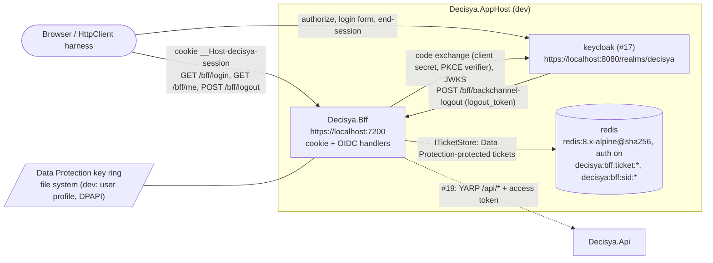

# Architecture note – BFF session: cookie auth, OIDC, Redis ticket store, antiforgery, logout (issue #18)

## Context

#18 adds the `Decisya.Bff` host: a new container, the first Redis resource, and the browser → BFF → Keycloak session data flow. ADR-0003 fixes the design direction. This note describes the concrete shape G4 builds. It adds no module, no `Contracts` project and no Wolverine message.

Inputs: `docs/requirements/phase-0/bff-session.md` (Stories 1-7, decisions 1-4), NFR-20 to NFR-23, ADR-0002, ADR-0003, ADR-0007, ADR-0008, `docs/architecture/keycloak-realm.md` (client `decisya-bff`, issuer, dev origin `https://localhost:7200`).

**#19 boundary.** YARP forwarding of `/api/*`, attaching the access token server-side, token refresh and the per-session refresh lock all belong to #18's successor, #19. #18 references no YARP package, has no `/api` route and has no refresh code. #18 stores the access and refresh tokens in the ticket, and nothing reads them until #19.

## C4 excerpt



## Projects and references

| Project | References | Packages (all already in `Directory.Packages.props`) |
| --- | --- | --- |
| `src/Decisya.Bff` (`Microsoft.NET.Sdk.Web`) | `Decisya.ServiceDefaults` only, which brings in SharedKernel and NodaTime transitively. **No** reference to `Decisya.Api`, to any `Modules.*` project or to the AppHost | `Microsoft.AspNetCore.Authentication.OpenIdConnect`, `Aspire.StackExchange.Redis` |
| `tests/Decisya.Bff.Tests` (xunit.v3, same shape as `Decisya.Identity.Tests`) | `Decisya.Bff`. Links `src/Decisya.AppHost/ContainerImages.cs` as source | `xunit.v3`, `xunit.runner.visualstudio`, `Microsoft.NET.Test.Sdk`, `AwesomeAssertions`, `NetArchTest.Rules`, `Microsoft.AspNetCore.Mvc.Testing`, `Testcontainers.Redis`, `Testcontainers.Keycloak` |
| `src/Decisya.AppHost` | adds a `ProjectReference` to `Decisya.Bff` | `Aspire.Hosting.Redis` |

- **New packages: none.**
- **New artifact:** the Redis image `docker.io/library/redis:8.x.y-alpine@sha256:<index digest>`. G4 picks the newest 8.x patch; the major must be 8 (ADR-0007). The pin goes into `ContainerImages` (`Redis*` constants), then into `.devcontainer/engine/images.Dockerfile` as `AS redis`, and then into the parity test.
- **Rejected packages:**
  - `Microsoft.AspNetCore.DataProtection.StackExchangeRedis`: it would store the keys next to the ciphertext they protect.
  - `Microsoft.Extensions.Caching.StackExchangeRedis`: `IDistributedCache` cannot hold the `sid` index set.
  - Duende BFF: rejected by ADR-0003.
  - `Yarp.ReverseProxy`: belongs to #19.
- **Logout-token validation** uses `Microsoft.IdentityModel.JsonWebTokens`, which the OIDC package already brings in transitively. There is no new reference.
- `Properties/launchSettings.json` has one `https` profile with `applicationUrl: https://localhost:7200`. It has no http URL and no wildcard host.
- `Decisya.Bff` registers an `ActivitySource` and a `Meter` named `Decisya.Bff`, with one counter, `decisya.bff.ticket_store.failures`, tagged by `operation`.

## Endpoints

| Route | Auth | Antiforgery | Behaviour |
| --- | --- | --- | --- |
| `GET /bff/login?returnUrl=` | anonymous | no | `Challenge(OIDC)` with `RedirectUri = returnUrl`. The `returnUrl` must be local: it starts with `/`, not `//` or `/\`. Anything else becomes `/`. An already signed-in caller is sent straight to `returnUrl`. |
| `GET /bff/me` | anonymous allowed | no, but it **issues** the token pair (below) | 200 `{ "isAuthenticated": false }` when anonymous. When signed in: 200 `{ "isAuthenticated": true, "sub", "email", "tenantId"?, "roles": [] }`. `tenantId` is omitted, not null or empty, when there is no `tenant_id` claim. Never a token. |
| `POST /bff/logout` | cookie required (401 otherwise) | **required** | Signs out of the cookie scheme, which runs `ITicketStore.RemoveAsync`, then signs out of OIDC: 302 to Keycloak's end-session endpoint with `client_id`, `post_logout_redirect_uri=https://localhost:7200/signout-callback-oidc` and `state`. No `id_token_hint` is sent (decision D3). |
| `POST /bff/backchannel-logout` | none (Keycloak calls it server to server) | **excluded** | Form field `logout_token`. The validation rules are below. Valid token: deletes every ticket indexed under its `sid`, returns 200. The response is the same 200 when nothing is left to delete (replay). Invalid token: 400 and no deletion. Responses carry `Cache-Control: no-store`. |
| `/signin-oidc`, `/signout-callback-oidc` | OIDC handler | handler `state`/correlation | handler defaults; the realm already registers them |
| `/health`, `/alive` | ServiceDefaults `MapDefaultEndpoints` | no | Redis health check comes from `AddRedisClient` |

- **The `/bff/me` DTO is the SPA contract.** It is a `sealed record` in `Decisya.Bff`, not in a `Contracts` project, because no module consumes it. The entitlements module later adds fields to this record; it will not replace it.
- **No OpenAPI file in #18.** The `api-contract` skill covers module `/api/<schema>` contracts and the generated SPA client, and neither exists yet. The SPA issue documents `/bff/*`.
- **Anonymous callers to protected endpoints.** The cookie `OnRedirectToLogin` event returns 401 and `OnRedirectToAccessDenied` returns 403, never a 302. Only `/bff/login` starts a challenge.

## Middleware order and handler options

1. `UseExceptionHandler()` together with `AddProblemDetails()`: the client gets a generic body with the `traceId`, and the log gets the full detail.
2. `UseHsts()`, outside Development only.
3. `UseAuthentication()`
4. `UseAuthorization()`
5. Endpoints. The `/bff` route group carries an endpoint filter, `AntiforgeryFilter`. For POST, PUT, PATCH and DELETE it calls `IAntiforgery.ValidateRequestAsync`. On `AntiforgeryValidationException` it returns 403 ProblemDetails, and the handler never runs. `/bff/backchannel-logout` opts out with metadata.
   - The filter runs after authentication because the token pair is bound to the user.
   - Do not rely on `UseAntiforgery()`. It enforces tokens only for form-bound minimal-API endpoints, and `/bff/logout` binds no form.
   - #19 applies the same filter to its `/api` routes.

- **No CORS registration.** The SPA and the BFF share one origin (ADR-0003).
- **No HTTP endpoint.**

**Cookie scheme (default scheme)**

| Option | Value |
| --- | --- |
| `Cookie.Name` | `__Host-decisya-session` |
| `Cookie.HttpOnly` | true |
| `Cookie.SecurePolicy` | `Always` |
| `Cookie.SameSite` | `Strict` |
| `Cookie.Path` | `/` (no `Domain`) |
| `ExpireTimeSpan` | 10 h, the same as Keycloak's `ssoSessionMaxLifespan` (36000 s) |
| `SlidingExpiration` | false |
| `IsPersistent` | false (a browser-session cookie, with no `Expires` attribute) |
| `SessionStore` | `RedisTicketStore`, set through `IPostConfigureOptions<CookieAuthenticationOptions>` |

**OIDC scheme (default challenge only via `/bff/login`)**

| Option | Value |
| --- | --- |
| `Authority` | `Bff:Oidc:Authority` |
| `ClientId` | `Bff:Oidc:ClientId` (`decisya-bff`, in appsettings) |
| `ClientSecret` | `Bff:Oidc:ClientSecret`, from the environment only |
| Response type | `code` |
| `UsePkce` | true |
| `Scope` | cleared, then `openid profile email` |
| `SaveTokens` | true (the tokens go into the ticket and never into the cookie) |
| `GetClaimsFromUserInfoEndpoint` | false |
| `MapInboundClaims` | false |
| `NameClaimType` | `sub` |
| `RoleClaimType` | `roles` |
| `TokenValidationParameters.ValidAlgorithms` | `RS256`, `ES256` |
| `CorrelationCookie` and `NonceCookie` | `SameSite=Lax`, `SecurePolicy=Always`, `HttpOnly` |
| `RequireHttpsMetadata` | true. `Bff:Oidc:RequireHttpsMetadata=false` is honoured only in `Development`, for the http Testcontainers Keycloak. |
| `OnRedirectToIdentityProviderForSignOut` | sets `IdTokenHint = null` and `ClientId` |

Options are bound to `BffOptions` with `ValidateDataAnnotations().ValidateOnStart()`. A missing Authority, ClientId or ClientSecret stops startup, and the error message names the key, never the value.

## Ticket store, Data Protection and Redis failure

- **`Decisya.Bff.Session.RedisTicketStore : ITicketStore`**, the only type that touches `StackExchange.Redis`. It keeps no in-process cache (Story 3).
  - **Session key:** 32 bytes from `RandomNumberGenerator`, base64url-encoded. It is never logged.
  - **Ticket:** `decisya:bff:ticket:{key}` holds `protector.Protect(TicketSerializer.Default.Serialize(ticket))`. The protector is `IDataProtectionProvider.CreateProtector("Decisya.Bff.TicketStore.v1")`.
  - **`sid` index:** `decisya:bff:sid:{sid}` is a Redis set of session keys. The `sid` comes from the ID token's `sid` claim, which Keycloak always sends because `backchannel.logout.session.required` is set. The ticket write and the index update go in one `ITransaction`.
  - **TTL:** both keys expire at `ticket.Properties.ExpiresUtc − now`, which is 10 h after sign-in. The current time comes from NodaTime's `IClock`, converted to `DateTimeOffset` at the ASP.NET boundary. `RenewAsync` resets the TTL the same way.
  - **Removal:** `RemoveAsync` deletes the ticket key and removes the key from its `sid` set.
- **Data Protection key ring (ADR-0003's consequence):**
  - `AddDataProtection().SetApplicationName("Decisya.Bff")` always.
  - When `Bff:DataProtection:KeyRingPath` is set, keys are persisted there with `PersistKeysToFileSystem`.
  - When it is unset **in Development**, the framework default applies: `%LOCALAPPDATA%\ASP.NET\DataProtection-Keys` on Marco's Windows host, encrypted at rest with DPAPI. That persists the ring across BFF restarts (NFR-23).
  - **Outside Development the setting is required** (`ValidateOnStart`), so a deployed container can never run on a throwaway key ring.
  - Tests point both BFF instances of the restart test at one per-run temporary directory.
  - The key ring is not stored in Redis. A Redis compromise must not yield both the ciphertext and its keys.
  - Production storage and at-rest protection of the key ring belong to 0.16 and 0.17.
- **Fail closed on a Redis outage (NFR-22):**
  - `AddRedisClient("redis", configureOptions: o => { o.AbortOnConnectFail = false; o.ConnectTimeout = 1000; o.SyncTimeout = 1000; o.AsyncTimeout = 1000; })`.
  - **Retrieve:** `RetrieveAsync` runs under a 1.5 s linked `CancellationTokenSource`. On `RedisException`, `RedisTimeoutException` or cancellation, it logs an error with the trace id (never the key), increments the failure counter and returns `null`. The cookie handler then treats the request as unauthenticated: `/bff/me` answers `isAuthenticated: false`, and protected endpoints answer 401.
  - **Store:** `StoreAsync` failures propagate. The login callback ends in the generic ProblemDetails 500, and no cookie is issued.
  - **Remove:** `RemoveAsync` failures also propagate. Logout returns the generic error rather than falsely reporting success.
  - **No volume:** the Redis container has no data volume. Sessions survive BFF restarts, but not Redis restarts, and ADR-0007's backup scope stays unchanged.
- **Logout-token validation:**
  - `JsonWebTokenHandler` validates against the OIDC handler's `ConfigurationManager`, the same discovery document and JWKS.
  - The token must satisfy all of these:
    - `iss` = the authority's issuer;
    - `aud` = `decisya-bff`;
    - the algorithm is RS256 or ES256;
    - `iat` is checked, with 60 s of clock skew;
    - `events` contains `http://schemas.openid.net/event/backchannel-logout`;
    - `sid` is present;
    - `nonce` is absent.
  - There is no replay cache, because deletion is idempotent (Story 7 scenario 3).

## AppHost wiring (platform-dev)

```csharp
var redis = builder.AddRedis("redis")                    // password: Aspire-generated, persisted; auth always on (ADR-0007)
    .WithImageRegistry(ContainerImages.RedisRegistry)
    .WithImage(ContainerImages.RedisImage, ContainerImages.RedisTag)
    .WithImageSHA256(ContainerImages.RedisSha256);        // no data volume, no Redis Insight/Commander
if (!useEphemeralContainers)
{
    redis.WithLifetime(ContainerLifetime.Persistent).WithContainerName("decisya-redis");
}

builder.AddProject<Projects.Decisya_Bff>("decisya-bff", launchProfileName: "https")
    .WithReference(redis).WaitFor(redis)
    .WithEnvironment("Bff__Oidc__Authority", ReferenceExpression.Create(
        $"{keycloak.Resource.PrimaryEndpoint.Property(EndpointProperty.Url)}/realms/decisya"))
    .WithEnvironment("Bff__Oidc__ClientSecret", bffClientSecret)   // same parameter Keycloak imports
    .WaitFor(keycloak);
```

- The authority comes from Keycloak's primary endpoint, so the scheme follows Aspire's dev-cert termination and is never hard-coded.
- If `PrimaryEndpoint` or `WithImageSHA256` has a different shape in 13.5.4, or raises a diagnostic under `-warnaserror`, report the exact code and stop.
- If Aspire enables TLS on Redis, the injected `ConnectionStrings:redis` carries it and is used unchanged. Never add `ssl=false` or disable certificate validation.
- Redis ports bind to loopback, the same as Postgres.
- Using `WithPersistentLifetime()` is forbidden (`ASPIREPERSISTENCE001`).

## Realm change (identity-dev)

- **Back-channel logout URL:** set `clients[decisya-bff].attributes."backchannel.logout.url"` to `https://host.docker.internal:7200/bff/backchannel-logout`.
  - G4 checks on the host that Keycloak's container resolves the name, reaches the BFF and trusts the .NET 10 dev certificate. That certificate should carry the SAN `host.docker.internal`.
  - If any of that fails, record it in G4 evidence and stop. Do not disable TLS verification or bind to `0.0.0.0`.
  - The automated test (below) does not depend on this path.
- **Roles in the ID token:** add a client protocol mapper `realm-roles-id-token`.
  - Type `oidc-usermodel-realm-role-mapper`.
  - Config: `claim.name: roles`, `multivalued: true`, `id.token.claim: true`, `access.token.claim: false`, `userinfo.token.claim: false`.
  - Why: the built-in `roles` scope puts realm roles only in the access token. The BFF builds its identity from the ID token alone and never parses the access token.
  - With `fullScopeAllowed: false` still in place, only `tenant-user` and `platform-admin` can appear.
- **Test updates:** `RealmExportFileTests` and `RealmConfigurationTests` gain assertions for both changes (test-engineer).
- **Re-import:** the dev volume must be reset for these changes to reach a running Keycloak (Marco, GETTING-STARTED §3).

## G4 split and interface

| Owner | Paths |
| --- | --- |
| identity-dev (first) | `src/Decisya.Bff/**`, `tests/Decisya.Bff.Tests/**`, `deploy/keycloak/decisya-realm.json`, both projects in `decisya.slnx` |
| platform-dev (second) | `src/Decisya.AppHost/**` (`AppHost.cs`, `ContainerImages.cs` Redis constants, csproj references), `.devcontainer/engine/images.Dockerfile` (`AS redis`), `.github/workflows/ci.yml` (add `tests/Decisya.Bff.Tests` to the Integration project list), `docs/GETTING-STARTED.md` (a "BFF" section: VS 2026 and CLI side by side, the Firefox login at `https://localhost:7200/bff/login`, cookie flags checked in Firefox DevTools *Storage*) |
| test-engineer (G5) | `AppHostConfigurationTests` (3 persistent containers, `decisya-redis`, `decisya-bff` wired with parameters only, no new literal `WithEnvironment` keys), `ContainerImageParityTests` (redis), `ApiBoundaryTests` (below), realm tests above |

**Interface between them (fixed here):**

- resource names `redis` and `decisya-bff`;
- the connection string key `ConnectionStrings:redis`;
- environment keys `Bff__Oidc__Authority` and `Bff__Oidc__ClientSecret`;
- launch profile `https` = `https://localhost:7200`;
- `Projects.Decisya_Bff` exists before platform-dev starts;
- the AppHost never sets `Bff:DataProtection:KeyRingPath` (dev uses the default location).

**Test harness (identity-dev):**

- Tests use `WebApplicationFactory<Program>` with `Bff:*` from the Testcontainers Keycloak (the #17 fixture's per-run client secret) and Redis, using `ContainerImages` pins, lazy start, the `Category=Integration` trait and the `SecureCookieRelayHandler` pattern.
- **Redis outage:** stop the Redis container, with a bounded wait.
- **Restart (NFR-23):** dispose the factory, then create a second one on the same key-ring directory.
- **Back-channel logout:** tokens are signed with a test RSA key against a static `OpenIdConnectConfiguration`, so no Keycloak-to-host network path is needed.
- **Token-leak scan (NFR-21):** every response in the flow is scanned for the token values the test reads back from Redis through the store's protector.

## Decisions

- **D1 Key ring on the file system (dev: user-profile default with DPAPI; elsewhere a required path), not in Redis.** No ADR needed: this implements ADR-0003's "persisted and shared" consequence for a single instance (ADR-0001). The deployed location is decided in 0.16/0.17.
- **D2 Absolute 10 h session, not sliding.** No ADR needed. This is G1 decision 3 applied through the cookie handler's own expiration mechanism. The handler default of 14 days sliding would outlive Keycloak's 10 h maximum. Until #19 adds refresh, sessions are also bounded by the absent refresh (G1 out-of-scope note).
- **D3 RP-initiated logout without `id_token_hint`.** This is a deviation from Story 6 scenario 1. A `Location` header carrying the ID token would break the Done-when ("browser never receives a token") and NFR-21. Keycloak 26 therefore shows its logout-confirmation page, one extra click, before it redirects to `/signout-callback-oidc`. The BFF session and ticket are already gone when that page appears.
  - Rejected alternative: ending the Keycloak session server-side with the refresh-token logout call. It is Keycloak-specific (ADR-0002 replaceability) and touches refresh-token handling, which is #19's.
  - G1/Marco: please confirm, and amend Story 6 scenario 1's wording.
- **D4 Antiforgery through an explicit endpoint filter, with double-submit cookie and header.**
  - The HttpOnly cookie `__Host-decisya-af` and header `X-XSRF-TOKEN` validate the request.
  - `GET /bff/me` issues the request token in a JS-readable cookie `__Host-decisya-xsrf` (Secure, SameSite=Strict, Path=/), which the SPA echoes in the header.
  - The antiforgery form field also works, so a plain HTML form POST to `/bff/logout` succeeds.
  - No ADR needed.
- **D5 Roles reach the BFF through a client-level ID-token mapper.** The BFF never parses the access token. No ADR needed.
- **D6 Redis without a volume.** Sessions do not have to survive a Redis restart, so Redis stays out of ADR-0007's backup scope. No ADR needed; ADR-0007 already makes it conditional.

**For G3:** D3; the JS-readable XSRF cookie; `host.docker.internal` plus dev-cert trust for back-channel calls; `RequireHttpsMetadata=false` only in Development; the Redis password shown in the Aspire dashboard; the new image counts as an ADR-0011 trigger (the manifest already says host).

## NetArchTest rules to add

| Rule | Assemblies | Test class |
| --- | --- | --- |
| No type depends on `Decisya.Api` or `Decisya.Modules` | `Decisya.Bff` | `tests/Decisya.Bff.Tests/Architecture/BffBoundaryTests` |
| No type depends on `OpenTelemetry` directly (telemetry only through `AddServiceDefaults`) | `Decisya.Bff` | `BffBoundaryTests` |
| No type depends on a Keycloak SDK namespace (`Keycloak`, `Keycloak.AuthServices`, `FS.Keycloak`), `DotNet.Testcontainers` or `Testcontainers` (the #17 lists) | `Decisya.Bff` | `BffBoundaryTests` |
| Only types in `Decisya.Bff.Session` depend on `StackExchange.Redis` | `Decisya.Bff` | `BffBoundaryTests` |
| No type depends on `Microsoft.Extensions.Caching` (no local fallback cache for sessions) | `Decisya.Bff` | `BffBoundaryTests` |
| No type depends on `Decisya.Bff` | `Decisya.Api`, `Decisya.ServiceDefaults`, `Decisya.SharedKernel` | `tests/Decisya.Api.Tests/Architecture/ApiBoundaryTests` |

Static rules, which NetArchTest cannot express:

| Rule | Test class |
| --- | --- |
| `Decisya.Bff.csproj` has exactly one `ProjectReference`, `Decisya.ServiceDefaults`, and no `Yarp.*` package (this rule changes in #19) | `BffBoundaryTests` |
| `launchSettings.json` URLs are exactly `https://localhost:7200` | `tests/Decisya.Bff.Tests/LaunchProfileTests` |
| `appsettings*.json` contain no `ClientSecret` key | `LaunchProfileTests` |

<!-- gate: G2 | verdict: PASS | issue: #18 -->
