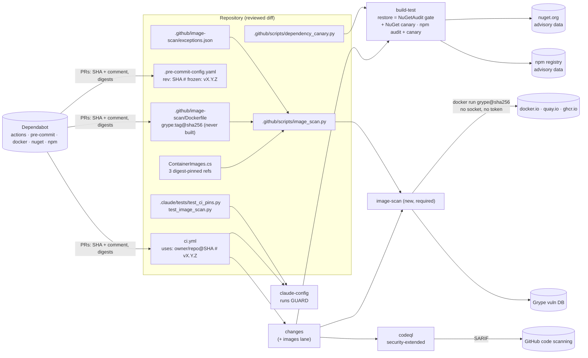

# Architecture note: CI hardening (pinned SHAs, dependency gates, image CVE scan, CodeQL) (issue #28)

## Context

Issue #28 (0.16) closes the CI supply-chain items from the system baseline:
- C-08 / #35 T-16: actions and pre-commit repositories are pinned by mutable tag;
- C-07 / #17 F-2 / L-2: the pinned images are never scanned for CVEs;
- `F-80-1`: the `codeql` decision.

It also proves the dependency gates with a seeded vulnerable package (Done-when). ZAP, the AppHost tests in CI and Playwright in CI are out of scope and move to #29 (manifest).

No product module, `*.Contracts` type, Wolverine message, endpoint or schema changes. What changes is the **CI trust boundary and its data flows**: what code CI executes (pins), which external data decides pass/fail (advisory databases, the scanner database), and a new required check. That is why this note is PASS and not N/A.

ADRs (Accepted, Marco 2026-10-03):
- [ADR-0014](../adr/0014-ci-supply-chain-pinning.md): SHA and digest pinning, how pins stay current, and the guard.
- [ADR-0015](../adr/0015-container-image-cve-scan-grype.md): the image scan with Grype.

ADR-0011 is unchanged. Its "Enforced by" list (NuGet audit, the vulnerable-packages step, `npm audit`) stays true.

## C4 excerpt (CI, not product)



## Boundaries and contracts

- **No product boundary changes.** No module, no Contracts type, no message, no endpoint.
- **CI boundary (new or changed):**
  - Executed third-party code is identified by an immutable reference: a commit SHA or an image digest (D1).
  - The image scanner runs as a container with no Docker socket, no `GITHUB_TOKEN` and no repository write, and reads only public registries (D3).
  - Job tokens are least-privilege, and no checkout persists credentials (D5).
- **Data that decides pass/fail:** nuget.org advisory data (restore audit), npm advisory data (`npm audit`), and the Grype database. Each is an external input. Each gate fails closed when its input is missing (D2, D3).

## Decisions

### D1. SHA pinning (ADR-0014)

1. **Actions.** Every `uses:` in `ci.yml` becomes `<owner>/<repo>[/<path>]@<40 lowercase hex>  # vX.Y.Z`. The SHA is the peeled commit of the exact tag. Today's references and the tag each is pinned at:

   | Today | Pin at |
   | --- | --- |
   | `actions/checkout@v4` (×4) | newest `v4.x.y`, one SHA everywhere |
   | `gitleaks/gitleaks-action@v3` | newest `v3.x.y` |
   | `wagoid/commitlint-github-action@v6.2.1` | `v6.2.1` exactly (the goldens' version; `test_commitlint.py` already reads the comment) |
   | `actions/setup-dotnet@v6` (×3) | newest `v6.x.y` |
   | `actions/setup-node@v7` | newest `v7.x.y` |
   | `github/codeql-action/init@v4`, `…/analyze@v4` | newest `v4.x.y`, one SHA for both |
   | `zaproxy/action-baseline@v0.15.0` | **removed** with the dead `zap-baseline` job (`if: false`). ZAP moved to #29, which re-adds it pinned. |

   G4 resolves each with `git ls-remote https://github.com/<owner>/<repo> refs/tags/<tag> 'refs/tags/<tag>^{}'` and takes the `^{}` line when the tag is annotated. The commands and outputs go in the G4 evidence. "Newest" is the newest patch of the current major. No major bumps happen in #28.
2. **Docker-container actions.** For each pinned action, G4 reads `action.yml` at the pinned SHA. Any `runs.image: docker://…:<tag>` (likely `wagoid/commitlint-github-action`) is listed in the PR body as a residual for G3/G6. A SHA pin does not freeze that image.

   `wagoid/commitlint-github-action` is such an action: it runs a Docker image by tag, with the workspace mounted read-write and the Docker socket. The mirror-drift check does **not** limit it. A swapped image runs before restore, build, audit, canary and tests in `build-test`, so it can falsify every later result in that job. The fix (G3 S-01) is to move both commitlint steps (the action, then the verdict and drift check) to the end of `build-test`, after the SPA steps and before `Summary`. Digest-pinning or replacing the action goes to #83.
3. **pre-commit.** The gitleaks repository becomes `rev: <40 hex>  # frozen: v8.30.1`, the `pre-commit autoupdate --freeze` form. `local` repositories are untouched. `GITLEAKS_VERSION: "8.30.1"` in `ci.yml` stays and must equal the `frozen:` version.
4. **Keeping pins current.** The `github-actions` and `pre-commit` Dependabot entries already exist, and `directory: /` covers `.github/workflows`. Changes to `dependabot.yml`:
   - add `cooldown: { default-days: 7 }` to `github-actions`, `pre-commit` and every `docker` entry;
   - add a `docker` entry for `/.github/image-scan` (D3).

   G4 confirms on the first Dependabot run (or with the "Check for updates" log under *Insights → Dependency graph → Dependabot*) that the `pre-commit` ecosystem rewrites a `frozen` SHA and its comment. If it does not, ADR-0014's fallback applies (`pre-commit autoupdate --freeze` at each phase exit), recorded in the runbook.
5. **Guard: `.claude/tests/test_ci_pins.py`** (main session; offline, stdlib, no subprocess or network, like `test_ruleset.py`). It fails when:
   - any `uses:` token in any `.github/workflows/*.y{a,}ml` (block or flow style, outside comments) is not one of:
     - `./<path>`;
     - `docker://<ref>@sha256:<64 hex>`;
     - `<owner>/<repo>[/<path>]@[0-9a-f]{40}` followed on the same line by `# v\d+\.\d+\.\d+`;
   - the same `<owner>/<repo>` appears with two different SHAs or two different version comments;
   - a workflow has a `container:`, `services:` or `image:` key whose image is not `@sha256:`-pinned (none today; this keeps it closed);
   - a remote `repo:` in `.pre-commit-config.yaml` lacks `rev: [0-9a-f]{40}` with `# frozen: v\d+\.\d+\.\d+`;
   - `.github/image-scan/Dockerfile` does not have exactly one `FROM <registry>/<image>:<tag>@sha256:<64 hex> AS grype` line.

   Red cases, each on an in-memory copy: a tag ref; `@main`; a 7-character SHA; an uppercase SHA; a missing comment; a `latest` comment; two SHAs for `actions/checkout`; a flow-style `{ uses: x@v1 }`; a pre-commit `rev: v8.30.1`; a frozen SHA with no comment; a scanner line without a digest.

   The guard runs in `claude-config` (required) and in the pre-push check (it runs every `.claude` test), with no change to `prepush.py` for this.

### D2. Dependency gates

**NuGet: keep the restore audit as the gate. No `Directory.Build.props` change.** Today:
- `NuGetAudit=true` and `NuGetAuditMode=all` (direct and transitive);
- `NuGetAuditLevel` is unset, so the default is `low`;
- `TreatWarningsAsErrors=true` in `Directory.Build.props` turns NU1901 to NU1904 into restore errors;
- `Directory.Build.targets` DECISYA0005 and `test_build_policy.py` stop anyone weakening this.

So restore already fails on **any** advisory severity, a superset of "High or Critical". It does this in VS 2026, on pre-push and in CI, before any package build code runs. #28 keeps that. Raising the level to `high` would be a weakening, and `test_build_policy.py` deliberately requires a note to Marco for it. No `-warnaserror` is needed on `dotnet restore`; the props carry it, and the canary proves it.

**The `Vulnerable packages` step fails open today.** A `run:` with no `shell:` runs as `bash -e {0}`, without `pipefail`. If `dotnet list package --vulnerable` fails, `tee` masks the failure, the `grep` finds nothing and the step passes. Fix: add `defaults: run: shell: bash` at workflow level, which gives every step `bash --noprofile --norc -eo pipefail {0}`. The lanes block is already tested under exactly that shell (`test_realm_guard_trigger.py`, G6-77-08). G4 checks every other `run:` for a pipeline whose non-zero exit is intended, and adds `|| true` where needed. None was found in this read.

**npm: unchanged.** `npm ci --ignore-scripts`, `npm audit --audit-level=high` and `npm audit signatures` stay.

**Seeded vulnerable package (Done-when): `.github/scripts/dependency_canary.py`.** This stdlib script generates the seeded projects at run time. Nothing vulnerable is ever committed, so there is no Dependabot alert, no Dependabot security PR and no dependency-graph entry.

- `dependency_canary.py nuget` (a step in `build-test`, dotnet lane, right after `Restore`):
  1. Creates `artifacts/dependency-canary/` under the repository root. `artifacts/` is git-ignored, and the location is inside the tree on purpose, so the **real** root `Directory.Build.props` and `Directory.Build.targets` apply, including the CPM policy.
  2. Writes a `Directory.Packages.props` there that imports the root one (`GetPathOfFileAbove`) and adds one `PackageVersion`. It does not touch the root file. Transitive pinning would otherwise pin the vulnerable version into real projects.
  3. Writes `Canary.csproj` (`Microsoft.NET.Sdk`, no source files) with one `PackageReference` to the seeded package.
  4. Runs `dotnet restore Canary.csproj --packages artifacts/dependency-canary/packages`, an isolated package folder so Marco's global cache never holds the package. **Restore only: never build, test or run.**
  5. **Passes only when** restore exits non-zero **and** its output contains `error NU1903` or `error NU1904` naming the seeded package. Any other result fails the step, with the output shown. Restore succeeding means the gate is open. Any other error (NU1301 offline, DECISYA000x) means the proof was not made.
  6. Deletes the directory in a `finally`.

  Seeded package: `Newtonsoft.Json` `12.0.3` (GHSA-5crp-9r3c-p9vr, High; no `build/` assets). G4 confirms the advisory and severity at G4 time. If GitHub ever withdraws or downgrades it, G4 replaces it with another High or Critical advisory, never a lower one.
- `dependency_canary.py npm` (a step in `build-test`, SPA lane, after the real audit):
  - works in a temporary directory **outside** the repository;
  - writes a `package.json` that depends on `lodash` `4.17.20` (GHSA-35jh-r3h4-6jhm, High);
  - runs `npm install --package-lock-only --ignore-scripts`, which resolves metadata only, downloads no tarballs and runs no scripts;
  - then runs `npm audit --audit-level=high`.

  It passes only when the audit exits non-zero and its JSON (`--json`, run separately) lists `lodash` at `high` or `critical`. The real step's `--audit-level=high` and the canary's must be the same string (a `.claude` test checks this).
- Local run: Marco runs the same script; agents do not (the npm subcommand is blocked for project agents by the #101 hook, which is intended). Both paths are documented in the runbook.

  | Visual Studio 2026 | CLI |
  | --- | --- |
  | *View → Terminal*, then the CLI command | `python .github/scripts/dependency_canary.py nuget` (and `npm`) |
- **Showing the canary can turn red (G4 evidence, local only).** The script has an option `--weaken-for-evidence` that adds `-p:TreatWarningsAsErrors=false` to the restore. The script refuses this option when `GITHUB_ACTIONS=true`. With the option, restore succeeds with only a NU1903 warning, and the canary must fail with "gate is open". Record that red output in the G4 evidence. `-p:NuGetAudit=false` is not a suitable weakening: DECISYA0005 would stop the restore, and the canary would report "proof not made" rather than "gate is open".

### D3. Container image CVE scan (ADR-0015)

- **Job `image-scan` in `ci.yml`.** It has `needs: changes`, which is required, so G4-80-03 holds. It has **no job-level `if`**: the gating is at step level, as in `build-test`, so it never becomes a second skip-safe job. Job permissions are `contents: read`.

  ```yaml
  image-scan:
    runs-on: ubuntu-latest
    needs: changes
    permissions:
      contents: read
    steps:
      - uses: actions/checkout@<sha>  # vX.Y.Z
        with:
          persist-credentials: false
      - name: Image CVE scan (High/Critical fail)
        if: needs.changes.outputs.images == 'true'
        run: python3 .github/scripts/image_scan.py
  ```
- **The `images` lane** is added inside the `# lanes:` markers of `changes`. It uses `|| true` so the block stays `-eo pipefail`-safe, and it matches against `$changed` (not `$code`):

  ```bash
  images_changed=$(printf '%s\n' "$changed" | grep -E '^src/Decisya\.AppHost/ContainerImages\.cs$|^\.devcontainer/engine/images\.Dockerfile$|^\.github/image-scan/|^\.github/scripts/image_scan\.py$|^\.github/workflows/ci\.yml$|^ALL$' || true)
  images=false; [ -n "$images_changed" ] && images=true
  echo "images=$images" >> "$GITHUB_OUTPUT"
  ```

  A matching `outputs: images:` line is added. The `ignore` and `ignore_md` regexes do **not** change, so `prepush.py`'s `CI_IGNORE` parity is unaffected.
- **Triggers** are added to `ci.yml`:

  ```yaml
  on:
    pull_request:
    push:
      branches: [main]
    schedule:
      - cron: '17 5 * * 1'
    workflow_dispatch:
  ```

  On `schedule` and `workflow_dispatch`, `github.event.before` is empty, so `changes` yields `ALL`. Every lane runs, including the integration tests: a weekly full run also catches NuGet and npm advisories published since the last push. `codeql` skips on `schedule`, because the schedule payload has no `repository.visibility`. That is acceptable: it ran on the push.

  The concurrency group must include the event, so a scheduled run and a push run on `main` cannot cancel each other: `ci-${{ github.workflow }}-${{ github.event_name }}-${{ github.event.pull_request.number || github.ref }}`.

  Notes:
  - GitHub notifies the user who last changed the cron line about failed scheduled runs. That is Marco, who merges.
  - Scheduled workflows on a public repository are disabled after 60 days without repository activity (runbook note).
- **`.github/scripts/image_scan.py`** (devops, stdlib only):
  1. **Targets:** parses `ContainerImages.cs` for `(Postgres|Keycloak|Redis)(Registry|Image|Tag|Sha256)` constants. Each reference must match `^[a-z0-9.-]+/[a-z0-9._/-]+:[A-Za-z0-9._-]+@sha256:[0-9a-f]{64}$`, and the alias set must be exactly `{postgres, keycloak, redis}`, or the script fails.
  2. **Scanner:** the single `FROM … AS grype` reference from `.github/image-scan/Dockerfile`, validated the same way.
  3. **Database once:** `docker run --rm -v "$RUNNER_TEMP/grype-db:/db" -e GRYPE_DB_CACHE_DIR=/db <scanner> db update`.
  4. **Per image:** `docker run --rm -v …:/db -e GRYPE_DB_CACHE_DIR=/db -e GRYPE_DB_AUTO_UPDATE=false -e GRYPE_CHECK_FOR_APP_UPDATE=false <scanner> registry:<ref> --platform linux/amd64 -o json`.
     - `subprocess` gets an argv list and no shell.
     - No Docker socket mount, no other mount, no token, no other environment variables.
     - A non-zero exit or JSON without `matches` fails the script.
  5. **Policy:** every match with `vulnerability.severity` in `{High, Critical}` is a finding, fixed or unfixed. A finding is excepted only by an unexpired entry that matches image alias, `artifact.name` and id (`vulnerability.id` or any `relatedVulnerabilities[].id`).
     - Expired entries are listed as `expired (not applied)`.
     - Entries that matched nothing are listed as `stale`. This is a warning only.
     - Exit 1 if any finding remains.
  6. **Exceptions schema:** `validate_exceptions()` implements ADR-0015 item 4, and the test imports it. Any schema error exits 2 before scanning.
     - The file is `{"$comment": "...", "exceptions": []}`. It starts empty.
     - `today` comes from `datetime.now(timezone.utc).date()`. This is a Python CI script; invariant 4's analyzer ban applies to .NET code.
  7. **Output hygiene:** all scanner-derived text (package names, ids, versions) is printed between `::stop-commands::<secrets.token_hex(16)>` and the resume marker, with control characters escaped, the same pattern as the `changes` job (T-14, H-10). The step summary table escapes `|`, backticks and newlines. Nothing is written to `$GITHUB_ENV` or `$GITHUB_OUTPUT`.
- **Dependabot digest bumps.** Dependabot bumps `images.Dockerfile`, which sets `images=true`. The PR cannot go green until `ContainerImages.cs` carries the new digest (`ContainerImageParityTests` in `build-test`), and that edit re-runs the scan on the new digest. The runbook's "close and redo by hand" route for Dependabot PRs applies.

### D4. CodeQL: keep, widen the query suite (no ADR; the tool stays)

This repository is **public** (`docs/ai/pipeline/59.md`). Code scanning is free, and the `codeql` job really runs on code PRs today. It is not a no-op. Decision:
- **Keep** `codeql` as a required, skip-safe check. Its `if` stays exactly as it is (`SKIP_SAFE_CONDITION` in `test_ruleset.py`).
- **Languages:** keep `csharp, javascript-typescript`. The SPA (#26) is JS/TS, so that language is now earning its place.
- **Queries:** add `queries: security-extended` to `init`. It costs more findings to triage and no extra minutes worth noting. `security-and-quality` is rejected: the quality noise duplicates the analyzers.
- **Build:** keep the traced `dotnet build`. A per-language `build-mode` would need a matrix, and a matrix is forbidden for a required check (G4-80-04).
- **Permissions:** `security-events: write` moves from workflow level to the `codeql` job only (D5).
- Replace the job's stale comment ("enable in issue 0.16 or delete this job") with a pointer to this note.
- **What `codeql` green means:** the analysis ran and uploaded. Alerts surface in the Security tab and in GitHub's own code-scanning check run on the PR. They **do not block merge**. Making them block needs a ruleset `code_scanning` rule. How that rule behaves when `codeql` is skipped (docs-only PRs) is unverified, and it could lock out every docs PR (T80-01 class). That goes to **#83** with the open question. The runbook's "codeql is skip-safe" section is updated to say this, which closes `F-80-1`.

### D5. Workflow permissions and hygiene (proportionate)

- Top-level `permissions: contents: read` only. `security-events: write` goes onto `codeql` alone.
- `realm-guard` keeps its explicit block. `image-scan` and `codeql` declare their own. The others inherit `contents: read`.
- Every `actions/checkout` gets `persist-credentials: false` (#83). Nothing in CI pushes.
  - `claude-config`'s `gates.py` runs `git fetch origin`. That needs no credentials on a public repository, and G4 confirms it in the run log.
  - `fetch-depth: 0` stays where it is today.
- `defaults: run: shell: bash` at workflow level (D2).
- `gitleaks-action`: set `GITLEAKS_ENABLE_COMMENTS: "false"`. Its PR comments need `pull-requests: write`, which no job has. Today it attempts the comment and fails quietly.
- Not added (proportionate): `timeout-minutes` everywhere, `harden-runner` (ADR-0014 option 4), OSSF Scorecard. Any of them can be proposed in #83.

### D6. Required checks impact

`image-scan` is a new required context, and it joins the drift test's floor set. No other context changes: `zap-baseline` was never required. In the #28 PR:
- `.github/rulesets/main.json` adds `{ "context": "image-scan", "integration_id": 15368 }`.
- `test_ruleset.py`'s `FLOOR` adds `image-scan`.
- `docs/runbooks/main-ruleset.md` updates:
  - Verify check 1 lists six contexts;
  - the floor-set list;
  - the "codeql is skip-safe" section (D4).

**Marco's steps after the #28 PR merges** (the runbook's "add a context" order: the job must report on `main` before it is required):

| # | Step | VS Code / GitHub web UI | CLI (`gh`, Marco's own login) |
| --- | --- | --- | --- |
| 1 | Confirm `image-scan` reported on `main` | *Actions → CI →* the run for the merge commit *→ image-scan* shows a green check | `gh run list --workflow CI --branch main --limit 1`, then `gh run view <run-id> --json jobs --jq '.jobs[] \| select(.name=="image-scan") \| .conclusion'` → `success` |
| 2 | Run the scan once for real (not skipped) | *Actions → CI → Run workflow* (branch `main`), then open *image-scan* and check that the step ran and passed | `gh workflow run CI --ref main`, then `gh run watch` |
| 3 | Read the ruleset diff | VS Code: *Source Control → … → View History*, or the merged PR's *Files changed* → `.github/rulesets/main.json` | `git fetch origin` then `git diff <pre-merge-sha> origin/main -- .github/rulesets/main.json` |
| 4 | Apply | *Settings → Rules → Rulesets → main*, edit or import with the contents of `origin/main`'s `main.json`, *Save changes* | `git show origin/main:.github/rulesets/main.json > <scratch file outside the repo>`, then `gh api -X PUT repos/mpcs2013/decisya/rulesets/23835975 --input <that file>` |
| 5 | Verify (runbook Verify 1 to 4; record in #28's G4 evidence or a dated PR note) | Same page: "Require status checks to pass" lists `changes`, `build-test`, `codeql`, `claude-config`, `realm-guard` and `image-scan` | `gh api repos/mpcs2013/decisya/rules/branches/main` → `required_status_checks` has those six contexts |

Agents never run steps 4 and 5 (runbook rule).

### D7. G4 split

| Owner | Files |
| --- | --- |
| **devops** | `.github/workflows/ci.yml`: pins (D1); the `zap-baseline` job removed; `defaults: run: shell: bash`; the `images` lane and output; `schedule` and `workflow_dispatch`; the concurrency group; the `image-scan` job; the canary steps; `codeql` `security-extended`; permissions; `persist-credentials: false`; `GITLEAKS_ENABLE_COMMENTS` |
| | `.github/dependabot.yml` (cooldowns, the `/.github/image-scan` docker entry), `.github/rulesets/main.json` (`image-scan`) |
| | `.github/image-scan/Dockerfile`, `.github/image-scan/exceptions.json` (empty list), `.github/scripts/image_scan.py`, `.github/scripts/dependency_canary.py` |
| | `.pre-commit-config.yaml` (frozen gitleaks rev) |
| | `docs/runbooks/main-ruleset.md` (D6) and a new `docs/runbooks/ci-security-gates.md`: pin bumps and the frozen fallback, adding or renewing an image exception, running the canary locally, the weekly schedule and the 60-day disable, each step VS 2026 / CLI side by side |
| **main session** | `.claude/tests/test_ci_pins.py` (new, D1) |
| | `.claude/tests/test_image_scan.py` (new): target parsing (exactly three aliases; a malformed or missing constant fails); exception schema red cases (missing justification, a 19-character justification, `expires` more than 90 days after `added`, bad id, unknown alias, missing issue); policy against fixture scanner JSON under `.claude/tests/fixtures/image-scan/` (High fails; Critical unfixed fails; Medium passes; matched unexpired exception passes; expired exception fails; related-id match; a stale exception warns); scanner-text neutralisation (a package named `::add-mask::x` stays between stop and resume); the canary's `--audit-level=high` equals the real step's; the canary refuses `--weaken-for-evidence` under `GITHUB_ACTIONS=true`. It loads the script with `importlib` from `.github/scripts/`, never runs Docker, and stays offline |
| | `.claude/tests/test_gitleaks_parity.py`: `precommit_version()` reads `# frozen: v(\S+)` |
| | `.claude/tests/test_ruleset.py`: `FLOOR` adds `image-scan`. `test_10_conditional_jobs` and `test_g6_80_04_expression_name` reference `zap-baseline`, which is removed. Both build their own throwaway non-required job in the in-memory copy instead (after #28 every job in `ci.yml` is required) |
| | `.claude/scripts/gates.py`: `REVIEW_REQUIRED_PATHS` adds `\.github/(scripts\|image-scan)/.+`, `\.pre-commit-config\.yaml` and `\.claude/tests/test_(ci_pins\|image_scan\|gitleaks_parity)\.py`, with matching `test_gates.py` rows |
| | `.claude/scripts/prepush.py`: `WARN_PREFIXES` adds `.github/image-scan/` and `.github/scripts/`, plus a `test_prepush.py` row. No lane change: `CI_IGNORE` is unchanged |
| **backend-dev** | Nothing. `Directory.Build.props` and `.targets` do not change (D2) |

Order inside the PR: pins, guard and parity-test change land in one commit range, so no intermediate push is red. `main.json` and `FLOOR` change together.

## NetArchTest rules to add

None. No assembly or module boundary changes. The boundaries #28 introduces are CI boundaries, and they are enforced by the `.claude` tests in D7:

| Rule | Enforced by | Runs in |
| --- | --- | --- |
| Every action, pre-commit repo and CI-tool image is SHA- or digest-pinned with a version | `test_ci_pins.py` | `claude-config`, pre-push |
| gitleaks version equal in CI and pre-commit | `test_gitleaks_parity.py` | same |
| Image scan targets come only from `ContainerImages.cs`; exceptions are justified and expiring; High/Critical fail | `test_image_scan.py` + `image-scan` job | same + `image-scan` |
| `image-scan` is required, has no job-level `if`, needs only required jobs | `test_ruleset.py` (`FLOOR`, G4-80-03/04) | `claude-config` |
| NuGet audit cannot be weakened | `test_build_policy.py` (unchanged) + DECISYA0005 + the NuGet canary | `claude-config`, `build-test` |

## Done-when mapping

- **Green pipeline:** all six contexts are green on the #28 PR, and on `main` after merge, including a `workflow_dispatch` run where `image-scan` actually scans.
- **Seeded vulnerable package fails the build:** the `build-test` canary step passes only because the seeded restore failed with NU1903/NU1904 under the real repository props. The G4 evidence also shows the canary turning red when the gate is weakened (D2).

## Deferred to #83

- A ruleset `code_scanning` rule so that CodeQL alerts block merge, once its behaviour on skipped runs is verified (D4).
- Checksum verification of the gitleaks binary that `gitleaks-action` downloads (ADR-0014).
- Docker-container actions whose image is tag-referenced (D1.2), if G3 rates it above Low.
- arm64 image scanning; cosign verification of the scanner image (ADR-0015).
- A policy for `NuGetAuditSuppress` (none exists today; a suppression would show up in the pre-push warning through the `NuGetAudit` token).
- `harden-runner`, OSSF Scorecard, `timeout-minutes`.

ZAP, AppHost-in-CI and Playwright-in-CI are #29, not #83 (manifest).

## Notes for G3

- New external inputs that decide pass/fail: nuget.org and npm advisory data, the Grype database (unpinned by nature), registry pulls of the three vendor images, and the scanner image (digest-pinned).
- New code that handles external text: `image_scan.py` (scanner JSON → stdout and step summary). Check D3 item 7.
- The canary restores one known-vulnerable NuGet package into an isolated folder and never builds it. The npm canary resolves metadata only. Confirm that neither path executes package code.
- Permission reductions (D5) and `persist-credentials: false` could break `gitleaks-action` or `commitlint-github-action` API calls. G4 confirms both on the PR run.
- `schedule` adds a weekly full run on `main`. No secrets are involved beyond the throwaway integration-test values that already exist.

<!-- gate: G2 | verdict: PASS | issue: #28 -->
