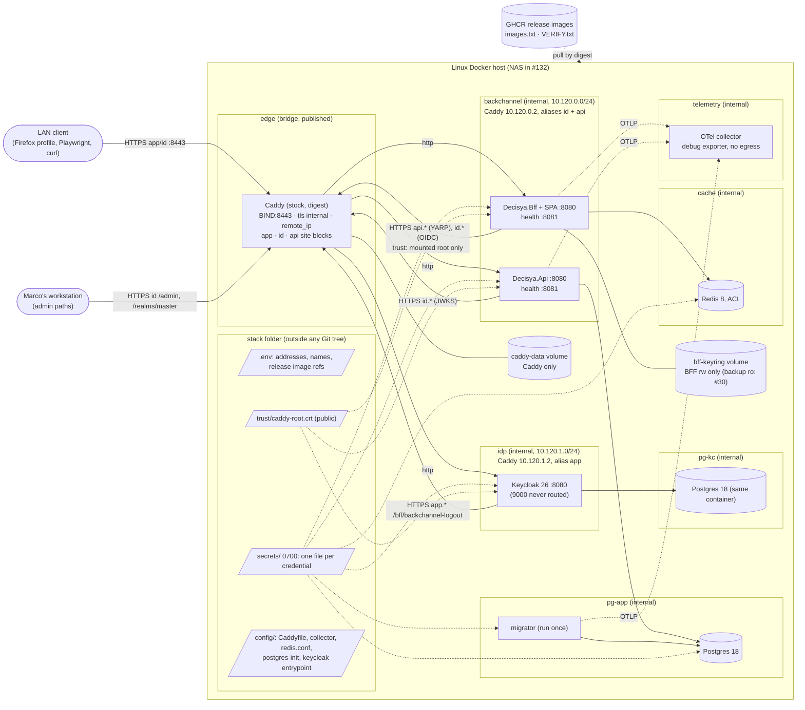

# Architecture note: deployable stack: Compose from `aspire publish`, Caddy, production configuration and secrets (issue #120)

## Context

Issue #120 (0.17b) turns the dev-only AppHost into a stack that starts on a Linux Docker host from a clean clone. It uses the #119 release images by digest, stock Caddy with `tls internal`, and only the prepared secrets and local configuration. The NAS bring-up is #132 (manifest split, Marco 2026-10-05). #120 proves the stack on a local Linux/Docker host.

No product module, `*.Contracts` type, Wolverine message or endpoint changes. What changes:
- the deployment boundary: networks, the edge, trust, secrets and database principals;
- two data flows: **the BFF reaches the Api through Caddy**, and **Keycloak reaches the BFF's back-channel logout through Caddy**.

So this note is not N/A.

Decision record: [ADR-0018](../adr/0018-deployable-stack-compose-secrets-transport.md) (Proposed). It amends ADR-0015 §2 (scan targets) and ADR-0016 R9.6 (B-6), and both carry a dated pointer. ADR-0001 carries the Azure Container Apps review trigger as a dated amendment. Applicable ADRs: 0001, 0002, 0003, 0007, 0014, 0015, 0016 (R9 in full), 0017. Inputs are data: the manifest, the #124 review (`docs/security/reviews/124.md`, B-1 to B-3 and B-6), the system baseline (C-03 to C-06, C-11, C-20), and the #15 threat model (F-3).

## C4 excerpt (deployment, one Linux Docker host)

Postgres is one container attached to both `pg-app` and `pg-kc`. The diagram draws it twice only for readability.

## Boundaries and contracts

- **No product boundary changes:** no module, no Contracts type, no message, no endpoint.
- **New data flows:**
  - BFF to Api: `Bff:Api:Address = https://<api host>:<port>`, served by Caddy on the back-channel network only. The #19 `https` invariant (G4-19-01) is kept.
  - Keycloak to BFF back-channel logout: `https://<app host>:<port>/bff/backchannel-logout`, through Caddy's `app` alias on the `idp` network. This is the caller that #124 G6-124-03(b) asked #120 to show for that alias.
- **Edge contract (Caddyfile, default deny per site block):**

| Site block | Source admitted (`remote_ip`) | Paths | Upstream |
| --- | --- | --- | --- |
| `{$DECISYA_APP_HOST}` | `{$DECISYA_LAN_SUBNET}` | all | `bff:8080` |
| same | `idp` subnet (10.120.1.0/24) | `POST /bff/backchannel-logout` only | `bff:8080` |
| `{$DECISYA_ID_HOST}` | `{$DECISYA_LAN_SUBNET}` | `/realms/decisya/*`, `/resources/*` | `keycloak:8080` |
| same | `{$DECISYA_WORKSTATION_ADDRESS}` | additionally `/admin/*`, `/realms/master/*` | `keycloak:8080` |
| same | back-channel subnet (10.120.0.0/24) | `/realms/decisya/*` only | `keycloak:8080` |
| `{$DECISYA_API_HOST}` | back-channel subnet only | `/api/*` only | `api:8080` |
| every block | anything else | `403`, no body detail | none |

  Every block uses `tls internal`, `request_body max_size` (1 MB), server timeouts and `header -Server`. Global options: `https_port 8443`, `auto_https disable_redirects` (no HTTP listener is published), `skip_install_trust`, `admin off` (SHOULD; Caddy is restarted, not reloaded). No route reaches Keycloak's port 9000 or any `:8081`. If the local proof shows that published ports do not keep LAN source addresses, the admin paths stay unrouted and the allow-list is never widened to a bridge subnet (ADR-0016 R9.8).

## Decisions

### D1. How the Compose file is produced and kept (ADR-0018)

- **Two committed files:**
  - `deploy/compose/docker-compose.yaml` is generated by `aspire publish` from a **publish-mode model** in the AppHost (`src/Decisya.AppHost/Deploy/ComposeStack.cs`, selected by `builder.ExecutionContext.IsPublishMode`). It is never edited by hand. CI regenerates it and fails on any diff (drift check).
  - `deploy/compose/docker-compose.stack.yaml` is the hand-written, reviewed overlay.
- **Key ownership:**
  - The generated file owns services, images, non-secret environment, `depends_on` and healthchecks.
  - The overlay owns `networks` (with `!override` where the generated file adds a default network), aliases and fixed addresses, `ports` (with `!reset` elsewhere), `secrets`, `configs`, volumes and bind mounts, `user`, `cap_drop`, `security_opt`, `read_only` and `tmpfs`, `mem_limit`, `cpus`, `pids_limit`, `logging` and `restart`.
  - A guard fails if the generated file carries an overlay key.
- **Publish-mode model rules (platform-dev):**
  - Plain `AddContainer` for third-party services, with the image from `ContainerImages.cs`. The typed Postgres, Redis and Keycloak integrations are not used here, because they wire secret parameters into the environment.
  - No secret parameter at all.
  - No dev realm and no `RealmSecretRules.EnsureDevUserPassword` call. That check runs only in run mode.
  - Release images appear only as `${DECISYA_API_IMAGE}`, `${DECISYA_BFF_IMAGE}` and `${DECISYA_MIGRATOR_IMAGE}`.
  - `aspire publish` must not build or push an image.
  - **First G4 step is a spike.** If Aspire 13.5 cannot meet these rules, stop and report. Marco then decides ADR-0018 option 3.
- **Release digests:** from the `images.txt` of the release whose tag equals the clone's `version.txt`, after Marco runs the `VERIFY.txt` cosign commands. They are written into the stack's `.env`, never committed. `stackctl.py check` rejects any value that is not `ghcr.io/mpcs2013/decisya-(api|bff|migrator)@sha256:<64 hex>` or that differs from `images.txt`.
- **Local configuration:** in `<stack>/.env` (git-ignored by name and outside any Git tree). Keys:
  - `DECISYA_BIND_ADDRESS`, `DECISYA_HTTPS_PORT`;
  - `DECISYA_LAN_SUBNET`, `DECISYA_WORKSTATION_ADDRESS`;
  - `DECISYA_APP_HOST`, `DECISYA_ID_HOST`, `DECISYA_API_HOST`;
  - the three image keys.

  The overlay uses `${VAR:?}` for every key it references. Caddy receives the address keys as environment (`{$VAR}` in the Caddyfile), each with `:?` in the overlay. If the generated file can only emit `${VAR}`, `stackctl.py check` enforces non-empty values. The committed template is `deploy/compose/.env.example` (allowed by `.gitignore`): keys and comments, **every value empty**.
- **Guards against a committed address:**
  - (a) `deploy/tests/test_no_home_addresses.py` scans every tracked text file for IPv4 and IPv6 literals in private, CGNAT, link-local, ULA and global ranges. The allow-list (`deploy/compose/address-allowlist.txt`) holds the two committed Docker subnets and their fixed Caddy addresses (D2), loopback, `0.0.0.0` and the RFC 5737 / RFC 3849 documentation ranges.
  - (b) `.env.example` values are empty (test).
  - (c) `stackctl.py check` refuses a stack folder inside a Git working tree, and refuses `DECISYA_LAN_SUBNET` or `DECISYA_WORKSTATION_ADDRESS` overlapping a committed Docker subnet.
  - (d) `ops.local/` stays git-ignored.
- **Documented steps (runbook `docs/runbooks/deployable-stack.md`, VS Code / VS 2026 and CLI side by side; #132 extends it for the NAS):**
  1. Clean clone at the release tag.
  2. `aspire publish` to a scratch folder, then `stackctl.py assemble`. It fails unless the output equals the committed file, then copies the generated file, the overlay and `deploy/{caddy,otel-collector,redis,postgres,keycloak}` configuration into `<stack>/`.
  3. `cosign verify` from `VERIFY.txt`.
  4. Fill `.env`.
  5. `stackctl.py secrets init` (first deploy only).
  6. `stackctl.py check`.
  7. Start Caddy, `stackctl.py export-root`, then start the rest.
  8. Run the smoke checks.

  `aspire`'s own generated `.env` is never copied or committed.

### D2. Caddy

- **Image pin:** `ContainerImages.cs` (constants `Caddy*` and `OtelCollector*`), mirrored in `.devcontainer/engine/images.Dockerfile` for Dependabot, with `ContainerImageParityTests` extended.
  - It is the single source for the AppHost publish model (so the generated Compose file carries the literal digest) and for the ADR-0015 scan targets (aliases `caddy` and `otelcollector`). ADR-0007 already asks for one reference per image across the AppHost, the sandbox list and Compose.
  - Images: `docker.io/library/caddy:<2.x>-alpine` and `docker.io/otel/opentelemetry-collector:<x.y.z>` (the core distribution, distroless, non-root). G4 resolves each digest two ways, as in `ContainerImages.cs`.
  - Every bump means a regenerated `docker-compose.yaml` in the same PR (drift check).
- **Caddyfile:** `deploy/caddy/Caddyfile`, mounted read-only. Contract in the edge table above. Name constraint (B-1): **not in #120.** Recommended to #83, unless G3 makes it a MUST. Trust stays limited to a dedicated Firefox profile and Playwright, and the root is regenerated at the Phase 0 exit (ADR-0016).
- **How the Caddyfile is tested:**
  - (a) Structure: the pinned Caddy image runs `caddy adapt` (`--network none`, documentation-range values for the `{$VAR}` keys) and the JSON is asserted (`deploy/tests/test_caddyfile.py`).
  - (b) Behaviour: a Testcontainers test (`Category=Integration`) starts the pinned Caddy with the Caddyfile and stub upstreams (Caddy itself with `respond`). It runs once with the test network's gateway as the workstation and LAN address, and once without. It asserts 200, 403 and the unrouted paths.
  - (c) The stack smoke (Tests and guards, item 12).
- **Networks:**

| Network | `internal` | Subnet | Members (aliases, fixed addresses) |
| --- | --- | --- | --- |
| `edge` | no (needed to publish) | Docker-assigned | Caddy only; `ports: ["${DECISYA_BIND_ADDRESS:?}:${DECISYA_HTTPS_PORT:?}:8443"]` |
| `backchannel` | yes | 10.120.0.0/24 (committed) | Caddy 10.120.0.2 with aliases `${DECISYA_ID_HOST}`, `${DECISYA_API_HOST}`; BFF; Api |
| `idp` | yes | 10.120.1.0/24 (committed) | Caddy 10.120.1.2 with alias `${DECISYA_APP_HOST}`; Keycloak |
| `pg-app` | yes | Docker-assigned | Postgres, Api, migrator (backup job in #30) |
| `pg-kc` | yes | Docker-assigned | Postgres, Keycloak |
| `cache` | yes | Docker-assigned | Redis, BFF |
| `telemetry` | yes | Docker-assigned | OTel collector, Api, BFF, migrator |

  The fixed Caddy addresses are the single trusted proxy:
  - BFF and Api `ForwardedHeaders` `KnownProxies` = 10.120.0.2;
  - Keycloak `KC_PROXY_TRUSTED_ADDRESSES` = 10.120.1.2 (B-3, first half).

  #122 reads the client IP only from that proxy. The Api sees the BFF behind Caddy, so #122 partitions the Api by caller, not by IP.
- **Root export and mounts:**
  - `stackctl.py export-root` copies `/data/caddy/pki/authorities/local/root.crt` from the running Caddy (`docker compose cp`) to `<stack>/trust/caddy-root.crt`. It is public and never the key.
  - The file is mounted read-only as a Compose `configs:` entry (Compose refuses to start when the source is missing, so a missing root can never become an empty directory mount) into:
    - the BFF and Api at `/etc/decisya/trust/caddy-root.crt`;
    - Keycloak, for `KC_TRUSTSTORE_PATHS` (the back-channel logout call).
  - Re-export and restart those three after any loss or regeneration of Caddy's data.
  - Caddy's data volume is mounted by Caddy only.
  - B-2: run Caddy non-root with `cap_drop: [ALL]` if the stock image starts that way (SHOULD; record the outcome).
- **Per-HttpClient trust (B-3, identity-dev):** one internal helper per host builds `SslClientAuthenticationOptions.CertificateChainPolicy`:
  - `TrustMode = CustomRootTrust`, `CustomTrustStore = { root }`, `RevocationMode = NoCheck` (the internal CA publishes no CRL or OCSP; leaf lifetime 12 h);
  - applied to the OIDC handler's `BackchannelHttpHandler` (also used by `KeycloakTokenClient`), to the logout-token and JWKS retrieval, to YARP's forwarder `HttpClient` (BFF), and to `JwtBearerOptions.BackchannelHttpHandler` (Api);
  - never through `SSL_CERT_FILE` or a process-wide store, and never through a `ServerCertificateCustomValidationCallback`.

  Configuration: `Bff:Backchannel:TrustedRootPath` and `Api:Jwt:TrustedRootPath`. When set, the file must exist and hold exactly one CA certificate, otherwise start-up fails, naming the key. When unset, system trust applies (go-live VPS with a public CA).

### D3. C-20: secrets and rotation (ADR-0018)

- **Store:** `<stack>/secrets/`, directory 0700 owned by the account that runs Compose, one file per credential, never in an image, never in `environment:` or `.env`, never on a command line.
  - Mounted through Compose `secrets:` at `/run/secrets/<target>`, read-only.
  - The target name is the .NET configuration key with `__` (read by the key-per-file source, D6).
  - Files are 0444 unless G4 proves Compose applies per-file `uid` and `mode`, in which case 0400 per consumer.
  - `stackctl.py secrets init` generates every value from a CSPRNG (alphanumeric, 48 characters; the hash key as 32 random bytes in base64). It never prints a value.
  - Derived files (connection strings, the Redis ACL hash) are produced by the same tool from the same credential, so one generator owns each credential.
- **Images that read only environment variables** (Keycloak) use a read-only mounted wrapper, `deploy/keycloak/entrypoint-stack.sh` (no `set -x`, no echo). It exports from `/run/secrets` and `exec`s `kc.sh start`. Postgres uses its native `*_FILE` variables. Redis reads an `aclfile`.

| Secret (file) | Consumers (target) | Rotation |
| --- | --- | --- |
| `postgres_superuser_password` | Postgres (`POSTGRES_PASSWORD_FILE`, first init only) | `stackctl.py secrets rotate postgres_superuser`, then `ALTER ROLE postgres` through `docker compose exec postgres psql` with `\password` (verifier computed client-side). Used only by init scripts and break-glass, never by an app. |
| `migrator_db_password` → `ConnectionStrings__decisya` (derived) | Postgres init (`decisya_migrator`), migrator | rotate, `\password decisya_migrator` as superuser, run the migrator |
| `tenancy_db_password` → `Migrator__TenancyRolePassword`; `ConnectionStrings__tenancy` (derived) | migrator; Api | rotate, `docker compose run --rm migrator` (it re-sets the role's SCRAM verifier, `MigrationRunner`), restart the Api |
| `entitlements_db_password` (same shape) | migrator; Api | as tenancy |
| `keycloak_db_password` | Postgres init (`10-keycloak-db.sh`, now also from a file), Keycloak (wrapper) | rotate, `\password keycloak` as superuser, restart Keycloak |
| `keycloak_bootstrap_admin_password` | Keycloak first start only (wrapper) | single use. After the first start, Marco creates his permanent admin (MFA belongs to C-01 and #121) and deletes the temporary one. Later changes go through the admin console. |
| `redis_bff_password` → `redis_acl` (hash form `#<sha256>`, `user default off`) and `ConnectionStrings__redis` (`user=decisya-bff`) | Redis; BFF | rotate (both derived files), restart Redis and the BFF. Sessions end (Redis is not persistent, ADR-0016 R7). |
| `bff_client_secret` → `Bff__Oidc__ClientSecret` | BFF (Keycloak side imported by #121) | regenerate in the admin console (client credentials), write the file, restart the BFF |
| `user_id_hash_key` → `Decisya__Observability__UserIdHashKey` | Api, BFF, migrator (one key per environment, never reused) | at the Phase 0 exit, on the VPS move and on suspected compromise: rotate, restart the three. Cross-rotation correlation is lost (accepted, #15 T-15). |

- **Not file secrets, listed for completeness:**
  - **Realm signing key:** in the Keycloak database. Rotation: add an RS256 key provider with higher priority, keep the old one passive for at least the longest token or session lifetime, then disable it (runbook text; #121 owns the realm).
  - **Data Protection key ring:** `bff-keyring` volume, BFF read-write. #122 decides the rest (`docs/architecture/rate-limit-key-ring.md`, D9 to D14):
    - owner 1654 and modes 0700 and 0600, set by `stackctl.py keyring prepare`;
    - encryption at rest with a certificate in four file secrets (`Bff__DataProtection__Certificate`, its password and an optional previous pair), BFF only;
    - a fail-closed start-up check;
    - rotation through `secrets rotate dataprotection_cert`;
    - the nightly copy without the certificate (#30);
    - `keyring reset` on key loss.
  - **Caddy root key:** in Caddy's data volume, regenerated per ADR-0016.
  - **No OTLP credential:** nothing leaves the box (D5).

### D4. C-06: database principals

- **Bootstrap:** `deploy/postgres/init/` (platform-dev). It runs only on the first init of an empty volume.
  - `10-keycloak-db.sh` reads its password from `DECISYA_KEYCLOAK_DB_PASSWORD_FILE` when set (the dev AppHost keeps the environment form).
  - New `20-decisya-db.sh`:
    - `CREATE ROLE decisya_migrator LOGIN NOSUPERUSER NOCREATEDB CREATEROLE NOINHERIT NOREPLICATION NOBYPASSRLS` (password through `\getenv`, statement logging off, as in `10-`);
    - `CREATE DATABASE decisya OWNER decisya_migrator`;
    - `REVOKE ALL ON DATABASE decisya FROM PUBLIC`;
    - `REVOKE CONNECT ON DATABASE postgres, template1 FROM PUBLIC`;
    - `REVOKE ALL ON SCHEMA public FROM PUBLIC` in `decisya`.
  - In the stack (`DECISYA_STACK=1`), a missing migrator password fails the init loudly. In dev (unset), the script is a no-op, because Aspire's `AddDatabase` creates `decisya`.
- **Migrator:** connects as `decisya_migrator`, never as the superuser. It creates the schemas and the module roles itself (unchanged `MigrationRunner`). On Postgres 18 it holds ADMIN OPTION only on roles it created. The Api keeps DML-only roles and can never `CREATE`, `ALTER` or `DROP`.
- **Authentication:** `scram-sha-256` on TCP (the image default when `POSTGRES_HOST_AUTH_METHOD` is unset; a guard bans that variable). Postgres is never published.
- **Dev:** unchanged (the superuser owner stays dev-only, as C-06 allows).

### D5. C-11: internal transport (ADR-0018)

- **No TLS between containers** on the host's internal bridge networks: Caddy to BFF, Api and Keycloak; BFF to Redis; Api and migrator to Postgres; Keycloak to Postgres; apps to the collector.
  - Why: that traffic never leaves the kernel. Reading it needs host root (which reads process memory anyway) or raw-socket capability on the bridge, and the overlay drops `NET_RAW` in every service (`cap_drop: [ALL]` where the image allows, otherwise at least `NET_RAW`).
  - Internal TLS would need a second CA or exported leaf keys, per-service rotation and CPU on the J3455, and ADR-0016 keeps Caddy the only TLS terminator.
- **TLS (Caddy) on every hop that crosses Caddy:** the browser, BFF to id and api, Api to id, Keycloak to app.
- **Compensating controls:**
  - per-hop networks (D2): each store sees only its own clients;
  - authentication on every store: Postgres SCRAM per role; Redis ACL with `default` off and one user restricted to the BFF's key prefix and command set (G4 lists the commands the BFF uses);
  - no published port except Caddy's;
  - no egress from any service except Caddy's `edge` network, which Caddy does not use (no ACME, no install of trust).
- **Redis configuration** (`deploy/redis/redis.conf`): `aclfile /run/secrets/redis_acl`, `maxmemory 64mb`, `save ""`, `appendonly no`.
- **Review trigger (ADR-0018):** any hop that leaves the host gets verified TLS first.

### D6. Production configuration (#15 F-3 and C-04)

`appsettings.Production.json` is **not** an option: ADR-0017's image check forbids any `appsettings.*.json` other than `appsettings.json` in the images. Production values come from code (fail-closed validation), the generated Compose environment and the stack's `.env` and secret files.

| Item | Where it lives | Owner |
| --- | --- | --- |
| Environment pinned | `ASPNETCORE_ENVIRONMENT=Production` (Api, BFF), `DOTNET_ENVIRONMENT=Production` (migrator), emitted by the publish model; guard: no `Development` in the effective configuration | platform-dev; guard devops |
| Secret files as configuration | ServiceDefaults: outside Development, the key-per-file source over `/run/secrets` (`Microsoft.Extensions.Configuration.KeyPerFile` ships in the ASP.NET Core shared framework, which ServiceDefaults already references; G4 confirms no new package, else a stdlib-only source of about 40 lines) | backend-dev |
| `AllowedHosts` | environment `AllowedHosts=${DECISYA_APP_HOST}` (BFF), `${DECISYA_API_HOST}` (Api); ServiceDefaults validation: outside Development it must be set and must not be `*`, or start-up fails naming the key | platform-dev (environment), backend-dev (validation) |
| Forwarded headers | ServiceDefaults extension called by the BFF and Api: outside Development, `X-Forwarded-For` and `-Proto` from `Decisya:Edge:TrustedProxies` (exactly 10.120.0.2) only; `KnownNetworks` cleared | backend-dev; calls by identity-dev (BFF) and backend-dev (Api) |
| Health on an internal port | ServiceDefaults: outside Development `/health` and `/alive` are mapped only on the management port 8081 (`RequireHost("*:8081")`), with the default writer (status word only). Caddy never routes 8081 (guard). A `--health-probe` argument (handled before the host is built: plain `HttpClient` to `localhost:8081`, exit 0 or 1) serves the Compose healthcheck, because the chiseled images have no shell or curl. #15 G4-15-01 (zero endpoints outside Development) changes on purpose; G3 confirms. | backend-dev |
| Probe tracing and sampling | requests on the management port are excluded from tracing outside Development (T-22). The sampler stays the default `ParentBased(AlwaysOn)`: the BFF starts a new root per request (#27 B-01), so no client decides sampling (T-20). A ratio knob is a SHOULD. | backend-dev |
| `UserIdHashKey` | secret file (D3), per environment, rotation in D3; existing fail-closed validation unchanged | backend-dev (source), devops (wiring) |
| OTLP | `OTEL_EXPORTER_OTLP_ENDPOINT=http://otel-collector:4317` on the internal `telemetry` network, no headers. The collector (`deploy/otel-collector/config.yaml`) has the OTLP receiver, `memory_limiter`, `batch`, and the `debug` exporter at `basic` verbosity. No off-box exporter, so no OTLP credential and no off-host TLS (T-23). Retention is container-log rotation. Any off-box exporter is an ADR-0018 review trigger. | platform-dev (environment), devops (collector configuration) |
| Keycloak production start | `kc.sh start` (never `start-dev`), `KC_HOSTNAME=https://${DECISYA_ID_HOST}:${DECISYA_HTTPS_PORT}`, `KC_HTTP_ENABLED=true` (on `idp` only), `KC_PROXY_HEADERS=xforwarded`, `KC_PROXY_TRUSTED_ADDRESSES=10.120.1.2`, `KC_HEALTH_ENABLED=true` (9000, healthcheck through bash `/dev/tcp`), `KC_TRUSTSTORE_PATHS`. **No realm import in #120:** the Phase 0 realm (C-03: no seeded users, `sslRequired: all`, redirect URIs, events) is #121. A guard ensures the dev realm file is never mounted. | identity-dev (wrapper, environment values), platform-dev (model) |

### D7. Image-scan targets and D-1

- **Targets** (devops, `.github/scripts/image_scan.py`):
  - `ALIASES` becomes `postgres`, `keycloak`, `redis`, `caddy`, `otelcollector`, still fail-closed (ADR-0015 §2 amendment);
  - `EXCEPTION_IMAGES` gains the two;
  - the `$comment` in `exceptions.json` and `test_image_scan.py` follow.
- **Parity guard** (`deploy/tests/test_compose_guards.py`):
  - every literal image in the effective configuration equals `ContainerImages.Reference(...)` of a scan alias;
  - every other image is exactly one of the three release placeholders (scanned at release by #119);
  - nothing is unaccounted for.
- **D-1 re-assessment:** the eight current third-party exceptions (zlib in `postgres` and `redis`; pcre2 and pcre2-syntax in `keycloak`) are justified as "dev-only container on loopback". That stops being true when #120 deploys.
  - devops rewrites each justification for the deployed context, or removes it if a fixed digest exists (bump instead). The deployed context: the service is on internal networks only and is reachable only from its named clients, and the library is not loaded by the network-facing process (to be confirmed per entry from the Grype match; an entry that cannot be confirmed is not renewed).
  - Expiries stay at or before 2026-11-02.
  - The `libc6` `crypt()` entries for `api`, `bff` and `migrator` stand unchanged.
  - **New rule:** no exception for a High or Critical in Caddy (the only LAN-facing process) or in a library Keycloak loads to serve HTTP, without Marco's recorded approval in the PR. Otherwise the deploy waits for a fixed digest.

### D8. ADR-0001 amendment

Written into ADR-0001 as a dated amendment (Proposed until Marco accepts it). It is the Azure Container Apps review trigger: four events, what the review must check, and a new ADR as the only outcome.

### D9. ADRs and G4 routing

- **New ADR:** ADR-0018 (Proposed). It records the Compose split, the file-secret store, single-host transport and C-06 ownership, and it amends ADR-0015 §2 and ADR-0016 R9.6. A separate secret-store ADR is not needed: the store is part of ADR-0018, with a go-live review trigger.
- **Package question for Marco (before G4 starts):** the publisher needs **`Aspire.Hosting.Docker` 13.5.x** in the AppHost. It is first-party, the same family and version as the Aspire packages already pinned, and ADR-0001 and ADR-0007 already name Aspire's Docker Compose publishing. The manifest requires Marco's approval for any new package. No other package is expected: key-per-file is in the shared framework, the guards are stdlib Python, and the Testcontainers core is already present.
- **Order:** backend-dev, then identity-dev, then platform-dev, then devops (the guards need the generated file), then G5.

| Owner | Paths | Work |
| --- | --- | --- |
| backend-dev | `src/Decisya.ServiceDefaults/**`, its tests | key-per-file source outside Development; `AllowedHosts` validation; forwarded-headers extension; management-port health, `--health-probe`, probe trace filter; Api `Program.cs` call of the forwarded-headers extension |
| identity-dev | `src/Decisya.Bff/**`, `src/Decisya.Api/Authentication/**`, `deploy/keycloak/entrypoint-stack.sh`, their tests | CustomRootTrust helper and wiring on every back-channel client (D2), fail-closed root validation, BFF forwarded-headers call, Redis password through `ConnectionStrings__redis`, Keycloak production-start environment values (D6), the trust integration test |
| platform-dev | `src/Decisya.AppHost/**` (`Deploy/ComposeStack.cs`, `ContainerImages.cs`), `.devcontainer/engine/images.Dockerfile`, `deploy/postgres/**`, `tests/Decisya.AppHost.Tests/**`, Testcontainers fixtures | spike first (D1); publish-mode model; Caddy and collector pins (two-way digest resolution); `20-decisya-db.sh` and the `_FILE` form in `10-`; regenerate and commit `deploy/compose/docker-compose.yaml`; the C-06 role test |
| devops | `deploy/compose/**` (overlay, `.env.example`, `stackctl.py`, address allow-list), `deploy/caddy/**`, `deploy/otel-collector/**`, `deploy/redis/**`, `deploy/tests/**`, `.github/**` (drift and guard job, image-scan aliases, exceptions D-1), `docs/runbooks/deployable-stack.md` | everything in D1 to D3, D5 and D7 that is not code in `src/`; the CI job `deploy-guards` (Marco adds it to the ruleset's required checks) |

  G4 records the first-start findings in the manifest:
  - whether Compose honours secret `uid` and `mode`;
  - whether Caddy runs non-root;
  - whether the key ring volume is writable by UID 1654 (mounting at an image path the `app` user owns, if Docker's copy-up needs it). Superseded by #122: `stackctl.py keyring prepare` sets owner and modes (`rate-limit-key-ring.md` D9);
  - whether published ports keep source addresses.

### D10. Tests and guards (Done-when evidence)

Static guards, run in the CI job `deploy-guards` (Docker available) over `docker compose -f docker-compose.yaml -f docker-compose.stack.yaml config --no-interpolate --format json` and over `caddy adapt` output:

1. **Drift:** a fresh `aspire publish` equals the committed `docker-compose.yaml`. The generated file carries no overlay key and no secret-named parameter, and Aspire's `.env` output has only allow-listed keys with empty values.
2. **Digests and scan parity** (D7).
3. **R9 container rules:**
   - no `privileged`, `cap_add`, `devices`, `network_mode: host` or `pid: host`;
   - `no-new-privileges:true` everywhere;
   - `NET_RAW` dropped everywhere (`ALL` where listed);
   - no Docker socket;
   - every bind source is a relative path into an allow-listed `./config/…` or `./trust/…` file;
   - `caddy-data` is mounted only in Caddy;
   - `bff-keyring` is read-write only in the BFF, plus read-only in a service named `backup` if present, and in no other service;
   - every service has `mem_limit` (sum ≤ 3.5 GB), `cpus`, `pids_limit` and rotated logs.
4. **Networks and ports:**
   - only Caddy has `ports`, exactly `${DECISYA_BIND_ADDRESS:?}:${DECISYA_HTTPS_PORT:?}:8443`;
   - the member lists, `internal` flags, subnets, fixed addresses and aliases equal the D2 table;
   - no alias outside `backchannel` and `idp`.
5. **Secrets out of the environment:**
   - no environment name matching `PASSWORD|SECRET|KEY|TOKEN|CONNECTIONSTRING` unless allow-listed as non-secret (`*_FILE` into `/run/secrets`, `KC_BOOTSTRAP_ADMIN_USERNAME`);
   - no value containing `password=` or `Password=`;
   - no `POSTGRES_HOST_AUTH_METHOD`;
   - every `secrets:` source is `./secrets/<name>`.
6. **Keycloak (C-03 interim):** command `start`, never `start-dev`; the dev realm file is never mounted; no `--import-realm` until #121 adds the Phase 0 realm and updates this guard.
7. **Production environment** (D6 row 1) and `AllowedHosts` present for the BFF and Api.
8. **Caddyfile:** the edge table holds exactly, with default deny. Every block has `remote_ip`, `tls internal` and size limits. The back-channel subnet is admitted only on `id` (`/realms/decisya/*`) and `api` (`/api/*`). The `idp` subnet is admitted only on `app` for `POST /bff/backchannel-logout`. The admin paths are admitted only from the workstation variable. No upstream is on port 9000 or 8081. No allow-list holds a Docker-assigned bridge subnet.
9. **No home address** (D1 guard a) and empty `.env.example` values.
10. **`stackctl.py` unit tests** (stdlib, fixtures): rejects a missing or empty key, a non-digest or mismatched image, an overlapping subnet, a stack folder inside a Git tree, a missing or malformed secret file and a world-writable secrets directory. It never prints a secret value (canary test).

Code tests, in the owners' projects:

11. **Code and fixtures:**
    - **ServiceDefaults (unit):**
      - the key-per-file source maps `/run/secrets` names and is off in Development;
      - `AllowedHosts` missing or `*` fails outside Development;
      - health is 404 on 8080 and 200 on 8081 outside Development;
      - forwarded headers are honoured only from the configured proxy;
      - `--health-probe` exit codes;
      - probe requests produce no span.
    - **BFF and Api:**
      - each back-channel client trusts the mounted root and rejects a certificate from another root, and also rejects one from a system-trusted public root;
      - start-up fails when `TrustedRootPath` is set but missing or not a single CA;
      - no `ServerCertificateCustomValidationCallback` in `src/`, which strengthens #121's source rule.
    - **Trust integration (Testcontainers, `Category=Integration`):** the pinned Caddy with `tls internal` serves a stub. The exported root plus the helper succeed, and a fresh second Caddy root fails.
    - **C-06 (Testcontainers, `Category=Integration`, pinned Postgres, the stack init scripts with file secrets):**
      - `decisya_migrator` is not a superuser, has no CREATEDB, owns `decisya`, and `MigrationRunner` completes as it;
      - the module roles cannot `CREATE`, `ALTER` or `DROP`;
      - PUBLIC has no `CONNECT` on `postgres`, `template1`, `decisya` or `keycloak`;
      - a TCP login without a password fails;
      - a missing migrator password with `DECISYA_STACK=1` fails the init.
12. **Clean-clone stack smoke on a Linux Docker host** (`deploy/tests/stack_smoke.py`, run by Marco or G5 on the host, recorded in the manifest; not in CI). Steps:
    - a fresh `git clone` of the branch into a scratch folder;
    - `aspire publish`, `stackctl.py assemble`;
    - a throwaway `.env` from this host's address;
    - release image refs from the latest `images.txt`, or locally built archives tagged by digest for an unreleased branch, recorded as such;
    - `stackctl.py secrets init` and `check`;
    - Caddy, `export-root`, then `up -d`.

    Assertions:
    - every service is running or healthy, and the migrator exits 0 within the F1 bound;
    - `curl --cacert trust/caddy-root.crt --resolve` gives SPA `index.html` 200 on the app host, and `/api/capabilities` 401 without a session;
    - `/admin/` and `/realms/master/` give 403 from a non-workstation source;
    - the bind address on any port other than the HTTPS port is refused, and nothing listens on 9000 or 8081 from the host;
    - **no secret value** (read from `secrets/`) appears in `docker inspect` of any container, in `docker compose config`, or in any container log since start;
    - back-channel routing, checked from a one-shot client container on `backchannel` (the pinned Caddy image, removed afterwards). The chiseled BFF and Api have no shell:
      - `https://<api host>:<port>/api/capabilities` answers 401 from the Api;
      - `/realms/decisya/` on the id host is answered by Keycloak (404 until #121's realm exists);
      - `/realms/master/` and `/admin/` on the id host give 403;
      - certificate trust itself is proven by the trust integration test (item 11), and the BFF and Api starting at all proves the root file validated;
    - whether Caddy's log shows the client's real address (the source-address question) is recorded;
    - `docker stats` at idle gives the D6 headroom input for #132.

### NetArchTest rules to add

None. No assembly or module boundary changes. The deployment boundaries are enforced by the guards in D10 and by the source rule that no production code disables certificate validation (#121, extended by D10 item 11 to ban `ServerCertificateCustomValidationCallback` in `src/`).

## Notes for G3 (candidate MUSTs, at most five)

1. **C-20:** no secret value in an image, a Compose `environment:`, `.env`, argv or a log. Secrets reach containers only as `secrets:` files. Proof: D10 items 5 and 12, the canary scan of `docker inspect`.
2. **Edge and networks (R9.6, R9.8, B-6):**
   - Caddy is the only published service, on the bind address;
   - the network table and default-deny allow-lists hold as specified;
   - admin paths are workstation-only or unrouted;
   - no route to 9000 or 8081.

   Proof: D10 items 4, 8 and 12.
3. **Container isolation (R9.3 to R9.5, R9.12):** no socket, privilege, capability, device or host namespace; `NET_RAW` dropped; only allow-listed mounts; key ring and Caddy data scoped; limits. Proof: D10 item 3.
4. **C-06:** the migrator is not a superuser; least-privilege module roles; PUBLIC `CONNECT` revoked; SCRAM on TCP. Proof: D10 item 11.
5. **B-3 back-channel trust:** per-client CustomRootTrust to the mounted root only, never disabled, fail closed when the root is missing. Proof: D10 items 11 and 12.

Also for G3:
- the deliberate change to #15 G4-15-01 (health on 8081 outside Development);
- the plaintext internal hops (D5) as an accepted residual with its trigger;
- B-1 deferred to #83 unless made a MUST;
- the D-1 rule for Caddy and Keycloak exceptions;
- the BFF-to-Api path through Caddy (it keeps G4-19-01).

<!-- gate: G2 | verdict: PASS | issue: #120 -->
