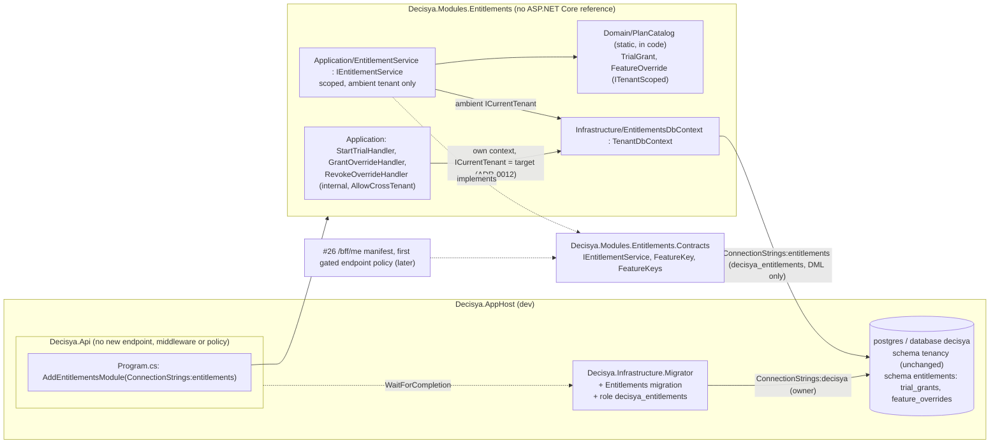

# Architecture note – Modules.Entitlements: plans, features, overrides, trials (issue #23)

## Context

#23 (0.11) adds the second business module: `Decisya.Modules.Entitlements` and `Decisya.Modules.Entitlements.Contracts` (ADR-0005), with schema `entitlements`.
- **Evaluation.** `IEntitlementService` (ADR-0008) answers "is feature X enabled for the current tenant". The answer comes from a code-defined `PlanCatalog`, an implicit Free plan, one `TrialGrant` per tenant and per-feature `FeatureOverride`s.
- **Admin commands.** Three commands act on an explicit target tenant: `StartTrial`, `GrantOverride` and `RevokeOverride`. #23 adds no endpoint (G1 Q5). The commands are tested directly (Marco, 2026-09-30).
- **Done when:** a Free tenant is denied `forecasting.scenarios`, and an admin override grants it.

Inputs:
- `docs/requirements/phase-0/entitlements-module.md`: Stories 1-5, NFR-34 and NFR-35, R-1 to R-3, and Marco's answers to Q1-Q6.
- `docs/architecture/tenancy-module.md` (#21): module shape, migrator, roles and AppHost wiring. This note follows it wherever it doesn't say otherwise.
- `docs/architecture/tenant-query-filter.md` (#22): `TenantDbContext`, `CrossTenantQueryRule` and `[AllowCrossTenant]`.
- ADR-0001, ADR-0005 and ADR-0008.

**ADR:** [ADR-0012](../adr/0012-cross-tenant-admin-commands-target-tenant-scope.md) (Accepted, Marco 2026-09-30) sets how a cross-tenant admin command meets invariant 1 (G1 R-1). The pattern applies to every later admin feature, so it is recorded once as a platform decision. Everything else implements ADR-0001, ADR-0005 and ADR-0008 as written.

## C4 excerpt



## Projects and ownership

| Path | Kind | G4/G5 owner |
| --- | --- | --- |
| `src/Modules/Entitlements/Decisya.Modules.Entitlements.Contracts/` `FeatureKey.cs`, `FeatureKeys.cs`, `IEntitlementService.cs` | **written at G2** (fixed surface below). The scaffold adds the `.csproj`, and never overwrites these files | architect (done); backend-dev runs the scaffold |
| `src/Modules/Entitlements/Decisya.Modules.Entitlements/` (`Domain/`, `Application/`, `Infrastructure/` incl. `Migrations/`, `EntitlementsModule.cs`). **No `Endpoints/`** | new, module-scaffold phases 1 and 2 | backend-dev |
| `tests/Modules/Decisya.Modules.Entitlements.Tests/` | new, created by `scaffold.py` (run by backend-dev); every later edit | test-engineer (backend-dev's lane gap, manifest decision) |
| `src/Decisya.Infrastructure.Migrator/` (`MigrationRunner.cs`, `Program.cs`, `.csproj`) | changed | backend-dev |
| `src/Decisya.Api/Decisya.Api.csproj` (ProjectReference) and `tests/Decisya.Api.Tests/Architecture/ApiBoundaryTests.cs` (expected reference set) | changed | backend-dev |
| `src/Decisya.Api/Program.cs` (one line) and every `Decisya.Api.Tests` factory that sets the `ConnectionStrings:tenancy` placeholder | changed | identity-dev |
| `src/Decisya.AppHost/AppHost.cs`, `tests/Decisya.AppHost.Tests/TenancyMigratorResourceTests.cs` | changed | platform-dev |
| `tests/Decisya.ArchitectureTests/ArchitectureScope.cs`, `ContractsScope.cs` and the project references | changed | backend-dev (module-scaffold step 7) |
| `tests/Decisya.ArchitectureTests/CrossTenantQueryRule.cs` and its fixtures | changed | test-engineer (G5) |
| `tests/Decisya.Infrastructure.Migrator.Tests/**`, `tests/Decisya.ServiceDefaults.Tests/Architecture/AppHostConfigurationTests.cs` | changed | test-engineer (G4 fix-up step, below) |
| `deploy/sql/entitlements/<timestamp>.sql` (`--idempotent` script) and `.github/workflows/ci.yml` (Integration loop gains the module test project) | new / changed | devops |
| `decisya.slnx` | root file | backend-dev runs `dotnet sln add`; the orchestrator does it if the write boundary blocks it |

**Packages: none added.** Already pinned and already in use: `Npgsql.EntityFrameworkCore.PostgreSQL`, `NodaTime`, `Microsoft.Extensions.DependencyInjection.Abstractions` (from the scaffold), and `NodaTime.Testing` (tests). `ILogger` comes transitively through EF Core. The module has **no** `FrameworkReference` to `Microsoft.AspNetCore.App` (D6).

## Contracts (`Decisya.Modules.Entitlements.Contracts`)

These files are already written; backend-dev doesn't change them without G2.

- **`FeatureKey`** is a `readonly struct` wrapping a string shaped `module.feature`:
  - exactly two segments `[a-z][a-z0-9_]*` joined by one dot, at most 64 characters;
  - created only through `Create` (throws `ArgumentException`) or `TryCreate(string?, out FeatureKey)`;
  - ordinal equality;
  - `default(FeatureKey)` is uninitialized: `Value` throws for it and every evaluation denies it.

  A well-formed key isn't necessarily a known one: "known" means the catalog lists it. There is no JSON converter and no `IParsable`, because nothing binds it from HTTP until #25.
- **`FeatureKeys`**: `LedgerTransactions` (`ledger.transactions`) and `ForecastingScenarios` (`forecasting.scenarios`, the Phase 3 key; G1 Q1). Consumers name keys only through this class.
- **`IEntitlementService`**: `Task<bool> IsEnabledAsync(FeatureKey feature, CancellationToken cancellationToken = default)`.
  - The tenant is always the ambient `ICurrentTenant`, never an argument (G1), and a rule keeps it that way (see the NetArchTest table).
  - It returns `bool`, not `Result`, which keeps `SharedKernel.Results` out of Contracts (#32 carry).

Plans, trials, overrides and the commands are **not** in Contracts. `PlanId` and `PlanCatalog` are module-internal, because no consumer needs them. The commands stay `internal` so nothing outside the module can reach them before #24 audits them (D6). If #25 hosts its admin endpoints outside this module, #25 moves the command records into Contracts.

**OpenAPI: none.** #23 has no HTTP surface, so `api-contract` does not apply.

## Domain and persistence (schema `entitlements`)

**`PlanId`** is an enum `{ Free = 1, Pro = 2 }`, stored as a string (`HasConversion<string>()`, `varchar(16)`). It is a value, not an entity.

**`PlanCatalog`** (`Domain/`, `internal sealed`):
- `static PlanCatalog Default`:
  - Free has `ledger.transactions`;
  - Pro has `ledger.transactions` and `forecasting.scenarios`.
- `bool IsKnown(FeatureKey)`: listed by any plan; `false` for `default`.
- `bool Includes(PlanId, FeatureKey)`.
- It is registered as a singleton instance.

An `internal` constructor that takes the plan-to-keys map is the **only test seam**. G1 Story 2 scenario 2 needs "a different Pro-only feature", which the real catalog doesn't have, and inventing a product key for a test would be speculative.

A tenant's plan is **implicit Free** (G1 Q2): no plan row exists and nothing is written at provisioning, so Entitlements has no dependency on Tenancy. The only other plan a tenant can be on is Pro, through an active trial.

**Entities.** Both are `sealed` and `ITenantScoped`, with a get-only `TenantId` set by the constructor and a `Guid.CreateVersion7()` `Id`. There are no navigations and **no FK to `tenancy.tenants`**: a cross-schema FK would couple the modules (ADR-0005).

| Type | Table and columns | Constraints | Behaviour |
| --- | --- | --- | --- |
| `TrialGrant` | `entitlements.trial_grants`: `id uuid` PK, `tenant_id uuid not null`, `plan varchar(16) not null`, `starts_at timestamptz not null`, `ends_at timestamptz not null` | **unique `ux_trial_grants_tenant (tenant_id)`**: one trial per tenant, ever (G1 Q3); check `ck_trial_grants_period`: `ends_at > starts_at` | `static TrialGrant Start(TenantId, Instant now)`: `Plan = Pro`, `EndsAt = now + TrialLength`, where `static readonly Duration TrialLength = Duration.FromDays(14)` (exact elapsed time, no calendar or time-zone arithmetic). `bool IsActiveAt(Instant now) => StartsAt <= now && now < EndsAt` (end-exclusive) |
| `FeatureOverride` | `entitlements.feature_overrides`: `id uuid` PK, `tenant_id uuid not null`, `feature_key varchar(64) not null`, `reason varchar(500) not null`, `granted_at timestamptz not null`, `expires_at timestamptz null` | **unique `ux_feature_overrides_tenant_feature (tenant_id, feature_key)`**; check `ck_feature_overrides_expiry`: `expires_at IS NULL OR expires_at > granted_at` | Constructor `(TenantId, FeatureKey, string reason, Instant grantedAt, Instant? expiresAt)`. `Replace(string reason, Instant? expiresAt, Instant now)` sets the reason and expiry and sets `GrantedAt = now`. `bool IsActiveAt(Instant now) => ExpiresAt is null \|\| now < ExpiresAt`. `Reason` is **`[Sensitive]`** (R-3). `const int MaxReasonLength = 500` |

Both unique indexes lead with `tenant_id` (ef-migration skill). Every name is explicit (`ToTable`, `HasColumnName`, `HasDatabaseName`).

**`EntitlementsDbContext : TenantDbContext`** follows module-scaffold step 6 and the #21 shape:
- the #22 constructor convention, `OnTenantModelCreating` with `HasDefaultSchema("entitlements")`, and `DbSet`s `TrialGrants` and `FeatureOverrides`;
- `ConfigureConventions` calls `base` first, then registers `Instant` to a module-internal `InstantConverter` (a copy of Tenancy's; see Deferred) and `FeatureKey` to a `FeatureKeyConverter` (`k => k.Value`, `s => FeatureKey.Create(s)`). EF applies the `Instant` converter to `Instant?` too. If the model build reports `Instant?` as unmapped, report the exact error and stop;
- `public static EntitlementsDbContextOptions.Configure(DbContextOptionsBuilder, string connectionString)` calls `UseNpgsql(cs, o => o.MigrationsHistoryTable("__EFMigrationsHistory", "entitlements"))`. The API registration, the migrator, the design-time factory and the admin handlers all use it;
- `internal sealed EntitlementsDesignTimeDbContextFactory`: `Host=design-time.invalid`, and an `ICurrentTenant` whose resolution is `Invalid`.

**Migration** (ef-migration skill):
- The migration is `AddTrialGrantsAndFeatureOverrides` in `Infrastructure/Migrations`, with its snapshot.
- CLI: `dotnet ef migrations add AddTrialGrantsAndFeatureOverrides --project src/Modules/Entitlements/Decisya.Modules.Entitlements --startup-project src/Decisya.Infrastructure.Migrator --context EntitlementsDbContext --output-dir Infrastructure/Migrations`.
- VS 2026 (Package Manager Console, default project `Decisya.Modules.Entitlements`): `Add-Migration AddTrialGrantsAndFeatureOverrides -Context EntitlementsDbContext -OutputDir Infrastructure/Migrations -StartupProject Decisya.Infrastructure.Migrator`.
- The SQL script is devops's: `dotnet ef migrations script --idempotent … --context EntitlementsDbContext -o deploy/sql/entitlements/<timestamp>.sql`, or `Script-Migration -Idempotent -Context EntitlementsDbContext …` in the PMC.
- **Rollback header:** `Down` drops both tables. Every trial and override is lost, and every tenant falls back to Free (fail-closed). A tenant whose trial was dropped could then start a second trial.

## Evaluation (`IEntitlementService`, Stories 1-3, NFR-35)

`internal sealed class EntitlementService(EntitlementsDbContext db, ICurrentTenant currentTenant, PlanCatalog catalog, IClock clock) : IEntitlementService` is registered **scoped**. It uses the DI context, so every read goes through the ambient tenant filter and no query names a tenant.

`IsEnabledAsync(feature)`:
1. If `feature` is uninitialized or `!catalog.IsKnown(feature)`, return **false**. No query runs.
2. If `currentTenant.Resolution.Kind != Tenant`, return **false**. No query runs, so `Invalid` never reaches the context and never throws (NFR-35).
3. If `catalog.Includes(Free, feature)`, return **true**. No query runs. Overrides and trials only grant, so short-circuiting on Free gives the same answer as G1's full precedence.
4. Read `now = clock.GetCurrentInstant()` once.
5. Load the override with `db.FeatureOverrides.AsNoTracking().SingleOrDefaultAsync(o => o.FeatureKey == feature)`; the unique index guarantees at most one. If it is not null and `IsActiveAt(now)`, return **true**.
6. Load the trial with `db.TrialGrants.AsNoTracking().SingleOrDefaultAsync()`. If it is not null and `IsActiveAt(now)` and `catalog.Includes(trial.Plan, feature)`, return **true**.
7. Otherwise return **false**.

Expiry is tested in memory against the one `now`. There is no `Instant` comparison in SQL and no expiry job (G1 Q3, Q4). There is no cache, so each call makes at most two indexed reads (R-2; any cache is #26's decision).

A database exception propagates, and a caller's policy turns it into the generic 500, never into "allowed". There are no `Result` types and no logs per evaluation: the meter below covers it.

## Admin commands and invariant 1 (G1 R-1; ADR-0012)

The commands are `internal sealed record`s in `Application/`:
- `StartTrial(TenantId TenantId)`;
- `GrantOverride(TenantId TenantId, FeatureKey Feature, [property: Sensitive] string Reason, Instant? ExpiresAt)`;
- `RevokeOverride(TenantId TenantId, FeatureKey Feature)`.

Each has an `internal sealed` handler with `Task<Result> HandleAsync(<command>, CancellationToken)` (SharedKernel `Result`), registered scoped. The handlers are plain classes, **not Wolverine**: `WolverineFx` stays unreferenced, as in #21, because nothing crosses a module or a bus yet. The `HandleAsync` shape lets Wolverine adopt them later without a rewrite.

**How they satisfy invariant 1 (the answer to R-1):**
1. **Attribute.** Each handler type carries `[AllowCrossTenant("Platform-admin command on an explicit target tenant, run in a context scoped to that tenant (ADR-0012). Audit: #24 follow-up, required before #25 exposes it.")]`. The wording can vary, but it must be non-blank (`AllowCrossTenantJustificationRule`). #24 discovers the handlers through this attribute.
2. **Caller check with no HTTP path**, in two layers:
   - **(a) Reachability.** Types are `internal`, the module has no ASP.NET Core reference and no `Endpoints/`, and nothing outside the module and its test assembly (`InternalsVisibleTo`) can construct or call a handler. Both properties are rule-enforced (NetArchTest table).
   - **(b) Ambient precondition, fail-closed.** The first statement of every handler requires `ICurrentTenant.Resolution.Kind == None`, a platform admin (#20, #21). `Tenant` or `Invalid` returns `entitlements.forbidden` (`Forbidden`) before any validation or database access, and logs a Warning with the resolution kind only. This keeps a tenant user from ever running an admin command, even through a future endpoint with a missing policy. It is **not** authorization: #25 adds the platform-admin role policy on its endpoint, and #24 adds the audit record before #25 exposes anything (G1 Q6).
3. **Target-tenant scope, not a filter bypass.** After validation, the handler builds its own context:

   ```csharp
   await using var db = new EntitlementsDbContext(options, new TargetTenant(TenantResolution.For(command.TenantId)));
   ```

   - `options` is the injected `DbContextOptions<EntitlementsDbContext>`.
   - `TargetTenant` is `internal sealed class TargetTenant(TenantResolution resolution) : ICurrentTenant` in `Infrastructure/`. It only stores the value; the call to `TenantResolution.For` stays in the attributed handler.

   The #22 filter then limits every read to the target, and the `SaveChanges` guard accepts exactly the target's rows. No `IgnoreQueryFilters`, `GetDatabaseValues`, `Reload` or raw SQL is used, the request's scoped `ICurrentTenant` is never changed, and `TenantDbContext` is not modified.
4. **Rule.** `CrossTenantQueryRule`'s list gains `Decisya.SharedKernel.Tenancy.TenantResolution::For`, `::FromClaim` and `::get_NoTenant` (the `NoTenant` getter). Inside `ArchitectureScope`, only an `[AllowCrossTenant]` type may mint a tenant scope. Today no scoped assembly references any of the three. `Decisya.Api` is outside the scope; there, `ApiBoundaryTests.Only_CallerContextMiddleware_mints_a_tenant_resolution_in_Decisya_Api` allows only `CallerContextMiddleware` to call `For`, `FromClaim` or `NoTenant`, and #25's endpoints must not add a second type.

**Validation** runs in this order, after the precondition, and fails before any database access. No row is written on failure.

| Check | Error code (`ErrorCategory`) | Applies to |
| --- | --- | --- |
| `command.TenantId.IsInitialized` | `entitlements.tenant_invalid` (Validation) | all |
| `catalog.IsKnown(Feature)` | `entitlements.feature_unknown` (Validation) | `GrantOverride` only |
| `Feature.IsInitialized` | `entitlements.feature_unknown` (Validation) | `RevokeOverride` (any well-formed key is accepted, so an override for a key later removed from the catalog can still be revoked) |
| `Reason` after `Trim()` is 1-500 characters (the trimmed value is stored) | `entitlements.reason_invalid` (Validation) | `GrantOverride` |
| `ExpiresAt is null \|\| ExpiresAt > clock.GetCurrentInstant()` | `entitlements.expiry_not_in_future` (Validation) | `GrantOverride` |

`DomainError.Message` never contains the reason text (R-3).

**Behaviour.** Each command makes one `SaveChangesAsync`, with no explicit transaction.
- **`StartTrial`** (Story 3):
  1. `db.TrialGrants.AnyAsync()`: true gives `entitlements.trial_already_used` (Conflict).
  2. Otherwise add `TrialGrant.Start(target, now)` and save.
  3. A `DbUpdateException` whose inner exception is a `PostgresException` with `SqlState 23505` and `ConstraintName ux_trial_grants_tenant` also gives `trial_already_used`.

  Postgres raises 23505 only after the competing insert commits, so 16 parallel starts give exactly one success and one row (the #21 D3 reasoning).
- **`GrantOverride`** (Story 2):
  1. Load the target's override for `Feature`, tracked.
  2. Missing: add a new one. Present: `Replace(reason, expiresAt, now)`, so there is exactly one row per tenant and feature.
  3. Save.
  4. On 23505 for `ux_feature_overrides_tenant_feature`: `ChangeTracker.Clear()`, re-query (a query, never `Reload`), `Replace`, and save **once** more. Any further exception propagates.

  Two concurrent grants: the last writer wins (accepted).
- **`RevokeOverride`** (Story 2):
  1. Load the target's override for `Feature`. Missing: `Result.Success()`, changing nothing.
  2. Otherwise `Remove` and save.
  3. A `DbUpdateConcurrencyException` (a concurrent revoke already deleted it): `ChangeTracker.Clear()`, then success.

  This is a **hard delete**. History and audit are #24's.

**Time (invariant 4, ADR-0006).** Every instant comes from the singleton `IClock`: `AddServiceDefaults` already calls `AddSystemClock()`, and tests register `NodaTime.Testing.FakeClock`. Each command reads `clock.GetCurrentInstant()` once and uses that value for validation and for the row. The module has no `DateTime` or `DateTimeOffset` outside `Infrastructure/InstantConverter`.

**Telemetry.** `ActivitySource` and `Meter` are `Decisya.Entitlements` (the scaffold does this; the ServiceDefaults wildcard picks them up):
- counter `decisya.entitlements.evaluations`, tags:
  - `decisya.entitlements.feature`: the catalog key, or `unknown`, so cardinality stays bounded;
  - `decisya.entitlements.outcome`: `granted` or `denied`;
  - `decisya.entitlements.source`: `override`, `trial`, `plan` or `none`;
- counter `decisya.entitlements.admin_commands`, tags:
  - `decisya.entitlements.command`: `start_trial`, `grant_override` or `revoke_override`;
  - `decisya.entitlements.outcome`: `succeeded`, or the error code.

Command logs use a source-generated `EntitlementsLog`, at Information for success and Warning for forbidden. Fields: `target_tenant_id`, `feature` and `expires_at`. **Never the reason.**

**Public module surface (`EntitlementsModule`):**
- constants `TelemetryName = "Decisya.Entitlements"`, `Schema = "entitlements"` and `DatabaseRole = "decisya_entitlements"`;
- `AddEntitlementsModule(this IServiceCollection, string connectionString)`:
  - throws `InvalidOperationException` naming `ConnectionStrings:entitlements`, never the value, when the connection string is null or blank;
  - registers plain `AddDbContext`, with no pooling;
  - `PlanCatalog.Default` as a singleton;
  - `IEntitlementService` → `EntitlementService`, scoped;
  - the three handlers, scoped.

## Database, roles, migrator, AppHost and API

**Least-privilege role: yes, `decisya_entitlements`** (ADR-0005 "one DB role per module"; CLAUDE.md least privilege). It follows the #21 pattern exactly.

**Migrator** (backend-dev):
- `MigrationRunner.RunAsync(string? ownerConnectionString, string? tenancyRolePassword, string? entitlementsRolePassword, CancellationToken)`. Both passwords are validated up front with the existing `[A-Za-z0-9]{32,}` shape. The failure message names `Migrator:EntitlementsRolePassword`, never the value.
- It migrates `TenancyDbContext`, then `EntitlementsDbContext`. Both run with resolution `Invalid`, and each has its own history table in its own schema.
- `ProvisionTenancyRoleAsync` becomes `ProvisionModuleRoleAsync(connection, role, schema, password)` and runs once per module, with the same statements, verifier, quoting, `format(%L)` and idempotency. For `decisya_entitlements` that means `CONNECT` on the database, `USAGE` on `entitlements` only, DML on all tables in `entitlements`, and `REVOKE ALL` on `entitlements."__EFMigrationsHistory"`. It owns nothing and has no `CREATE`.
- `REVOKE ALL ON SCHEMA … FROM PUBLIC` on both schemas means neither module role can read the other's schema. This makes ADR-0005's cross-schema role test possible now; it was deferred in #21 until a second module existed.
- `Program.cs` reads `Migrator:EntitlementsRolePassword`. The `.csproj` adds a ProjectReference to `Decisya.Modules.Entitlements`.

**AppHost** (platform-dev). There is no new resource.
- `var entitlementsDbPassword = builder.AddParameter("entitlements-db-password", new GenerateParameterDefault { MinLength = 32, Special = false }, secret: true, persist: true);`
- `decisya-migrator`: add `.WithEnvironment("Migrator__EntitlementsRolePassword", entitlementsDbPassword)`.
- `decisya-api`: add `.WithEnvironment("ConnectionStrings__entitlements", ReferenceExpression.Create($"Host={pg.Property(EndpointProperty.Host)};Port={pg.Property(EndpointProperty.Port)};Database=decisya;Username=decisya_entitlements;Password={entitlementsDbPassword}"))`. The `WaitForCompletion(migrator)` it already has covers the new schema.
- The API still gets no owner connection (T-12). Marco's persistent volume needs no reset: the migrator is idempotent and the persisted parameter is generated on first run.

**API** (D7). identity-dev adds one line to `Program.cs` after `AddTenancyModule`: `builder.Services.AddEntitlementsModule(builder.Configuration.GetConnectionString("entitlements")!);`.
- There is no middleware, endpoint or policy.
- The value today: `ValidateOnBuild` and `ValidateScopes` check the module's lifetimes in the real host, and #25 and #26 find the module already wired.
- Nothing resolves the service yet, so no connection opens at startup.
- Every `Decisya.Api.Tests` factory that sets the `ConnectionStrings:tenancy` placeholder also sets `ConnectionStrings:entitlements` to `Host=db.invalid;Database=decisya;Username=placeholder;Password=placeholder`, in the same way.

**Module tests** (test-engineer):
- `PostgresFixture.CreateDatabaseAsync<EntitlementsDbContext>()` (built with `EnsureCreated` from the model, including the unique indexes and check constraints) runs Stories 1-4 and the race test.
- The migration itself is proven by the migrator integration tests.
- A no-Docker `HasPendingModelChanges()` test goes through the design-time factory.

## Decisions

- **D1 Plans and features are code** (`PlanCatalog`, `FeatureKeys`), and the default plan is implicit Free (G1 Q1, Q2). No ADR: nothing is persisted, so there is nothing to migrate.
- **D2 The Contracts surface is only `IEntitlementService`, `FeatureKey` and `FeatureKeys`.** The tenant is always ambient. No ADR: this implements ADR-0008.
- **D3 Cross-tenant admin commands run in a target-tenant scope**, with `[AllowCrossTenant]`, an ambient `None` precondition, `TenantResolution.For`/`FromClaim`/`NoTenant` on the rule list, and only `CallerContextMiddleware` minting a resolution in `Decisya.Api`. **ADR-0012.**
- **D4 Trial and override expiry are computed at read time from `IClock`**, end-exclusive, with `Duration.FromDays(14)` for the trial. No job. No ADR.
- **D5 Concurrency is handled by unique indexes plus one handled 23505.** No advisory locks and no `ON CONFLICT` raw SQL (the raw-SQL rule would ban it), as #21 D3. No ADR.
- **D6 Nothing is reachable over HTTP in #23.** The commands are internal and the module has no ASP.NET Core reference, both rule-enforced. #25 lifts the ASP.NET Core rule deliberately, after #24. No ADR: this is G1 R-1's condition.
- **D7 The module is registered in the API now**, with its own role and connection string, but gets no endpoint. No ADR.
- **D8 No Wolverine and no OpenAPI in #23.** No ADR.
- **D9 No FK to `tenancy.tenants`, and no existence check on the target tenant.** A trial or override for an unknown tenant id is inert until that tenant exists. #25 decides whether its endpoint validates the id through a Tenancy Contracts query. No ADR.

## NetArchTest and static rules to add (G5 test-engineer unless noted)

| Rule | Assemblies / files | Test class |
| --- | --- | --- |
| `ArchitectureScope` gains `typeof(EntitlementsModule).Assembly`, so the existing TenantModel, TenantIdImmutability, CrossTenantQuery, AllowCrossTenantJustification and BulkTenantMove rules and the B-4 enumeration cover it (backend-dev, scaffold step 7) | ArchitectureTests | `ModuleBoundaryTests`, `ArchitectureScopeTests` (existing) |
| `ContractsScope` gains `typeof(IEntitlementService).Assembly`, so the existing Contracts rules cover it: only SharedKernel and `*.Contracts`, no EF Core, Npgsql, Wolverine, ASP.NET Core or `SharedKernel.Results` (backend-dev) | ArchitectureTests | `ContractsBoundaryTests` (existing) |
| **ADR-0012:** `CrossTenantQueryRule.BypassList` gains `("Decisya.SharedKernel.Tenancy.TenantResolution", "For")`, `(…, "FromClaim")` and `(…, "get_NoTenant")`. New fixtures: `Fixtures/TenancyViolations/UnattributedTenantScope` (calls `TenantResolution.For` inside an `async` lambda, with no attribute) must fail, and `Fixtures/TenancyCompliant/AttributedTenantScope` must pass | ArchitectureTests | `TenancyRuleTests`, `ModuleBoundaryTests` |
| **ADR-0012:** in `Decisya.Api` (outside `ArchitectureScope`), only `CallerContextMiddleware` references `TenantResolution.For`, `FromClaim` or `NoTenant` (IL scan). #25's admin endpoints must not add a second type | Api | `ApiBoundaryTests.Only_CallerContextMiddleware_mints_a_tenant_resolution_in_Decisya_Api` |
| No public member of any `Decisya.Modules.Entitlements.Contracts` type (method or constructor parameter, property, field) has type `TenantId` or `TenantResolution` (G1: evaluation cannot name another tenant) | Entitlements.Contracts | `EntitlementsModuleBoundaryTests` (module tests) |
| **D6:** `Decisya.Modules.Entitlements` references no `Microsoft.AspNetCore*` assembly and declares no `Decisya.Modules.Entitlements.Endpoints` namespace. #25 removes this rule deliberately, citing #24 | module | `EntitlementsModuleBoundaryTests` |
| **ADR-0012:** the types in `Decisya.Modules.Entitlements` that carry `[AllowCrossTenant]` are exactly `StartTrialHandler`, `GrantOverrideHandler` and `RevokeOverrideHandler`, and none is public. The explicit list makes a new cross-tenant type a reviewed change | module | `EntitlementsModuleBoundaryTests` |
| The scaffold's two rules: no reference to another module's implementation (this includes `Decisya.Modules.Tenancy`), and no direct `NodaTime.SystemClock` | module | `EntitlementsModuleBoundaryTests` (scaffold) |
| `Decisya.Modules.Entitlements.Domain` does not depend on `Microsoft.EntityFrameworkCore` (existing rule over the scope). No `Domain` or `Application` type has a property, field or parameter of type `DateTime` or `DateTimeOffset` (Story 5 scenario 3) | module | `ModuleBoundaryTests` (existing), `EntitlementsModuleBoundaryTests` |
| The module does not depend on `DatabaseFacade` or `RelationalDatabaseFacadeExtensions` (the #21 serving-process rule, now over this module too) | module | `ModuleBoundaryTests` |
| Every `EntitlementsDbContext` entity type maps to schema `entitlements` (ADR-0005 EF model test) | module | `EntitlementsModelTests` |
| DI: `AddEntitlementsModule` registers `IEntitlementService` and the three handlers **Scoped**, `PlanCatalog` Singleton, and `EntitlementsDbContext` not pooled | module | `EntitlementsRegistrationTests` |
| Static: `Decisya.Api.csproj` ProjectReferences are exactly `Decisya.ServiceDefaults`, `Decisya.Modules.Tenancy` and `Decisya.Modules.Entitlements`; its only PackageReference is still JwtBearer (**backend-dev**, with the csproj change) | csproj | `ApiBoundaryTests` |
| Static: `decisya-api`'s block sets exactly `ConnectionStrings__tenancy` and `ConnectionStrings__entitlements`, in that order, each from a `ReferenceExpression`, with `Username=decisya_entitlements`; `decisya-migrator` gets `Migrator__EntitlementsRolePassword` and no `ConnectionStrings__entitlements` | `AppHost.cs` | `AppHostConfigurationTests`; dynamic proof in `TenancyMigratorResourceTests` (Category=AppHost, platform-dev) |
| Role privileges, as `decisya_entitlements`:<ul><li>`CREATE TABLE`, `ALTER TABLE`, `DROP TABLE` and `CREATE SCHEMA` fail with `42501`;</li><li>`SELECT` on `entitlements."__EFMigrationsHistory"` fails;</li><li>DML on both tables succeeds.</li></ul>**ADR-0005 cross-schema:** `decisya_entitlements` reading `tenancy.tenants` and `decisya_tenancy` reading `entitlements.trial_grants` both fail with `42501` | migrator (Testcontainers) | `MigrationRunnerIntegrationTests` |

G5 also covers Stories 1-5 and NFR-34 and NFR-35 with `FakeClock`:
- the Done-when pair (Free denies `forecasting.scenarios`; after `GrantOverride` it is allowed);
- expiry boundaries at `EndsAt` and `ExpiresAt` exactly;
- 16 parallel `StartTrial` calls, each with its own scope and context;
- `Forbidden` with no row written for a `Tenant` and an `Invalid` ambient;
- a command for tenant A changes no row of tenant B;
- the isolation-test skill over `TrialGrant` and `FeatureOverride` (read by collection and by id, update and delete by id);
- `IsEnabledAsync` under `Invalid` returns false without throwing.

## G4 split and interfaces

| Order | Owner | Delivers | Consumed by |
| --- | --- | --- | --- |
| 1 | backend-dev | <ul><li>Scaffold phases 1 and 2: `python .claude/skills/module-scaffold/scripts/scaffold.py Entitlements entitlements`, then `dotnet sln add`.</li><li>Module csproj: Persistence reference, EF Npgsql, NodaTime, `InternalsVisibleTo Decisya.Modules.Entitlements.Tests`, no ASP.NET Core.</li><li>Domain, `PlanCatalog`, the service, commands, handlers, `TargetTenant`, the DbContext and its options, converters, the design-time factory and the migration. `EntitlementsModule`.</li><li>Migrator: `RunAsync` signature, `ProvisionModuleRoleAsync`, `Program.cs`, csproj.</li><li>`Decisya.Api.csproj` reference plus `ApiBoundaryTests`.</li><li>`ArchitectureScope`, `ContractsScope` and their references.</li></ul> | everyone |
| 2 | platform-dev | AppHost: `entitlements-db-password`, the migrator variable and `ConnectionStrings__entitlements`. `TenancyMigratorResourceTests` | G5 |
| 3 | identity-dev | `Program.cs`: `AddEntitlementsModule(…)`. The `ConnectionStrings:entitlements` placeholder in every `Decisya.Api.Tests` factory that sets the tenancy placeholder | G5 |
| 4 | test-engineer (G4 fix-up, before the orchestrator's G4 build and test check) | <ul><li>`tests/Decisya.Infrastructure.Migrator.Tests/**`: call sites for the new `RunAsync` parameter, and the validation test for `Migrator:EntitlementsRolePassword`.</li><li>`AppHostConfigurationTests`: the two-key assertion.</li><li>The module test project: `Decisya.TestInfrastructure` and `NodaTime.Testing` references.</li></ul>These are needed because backend-dev and platform-dev cannot write those paths and the build would otherwise be red | G4 check |
| 5 | devops | `deploy/sql/entitlements/<timestamp>.sql`. `ci.yml` Integration loop: add `tests/Modules/Decisya.Modules.Entitlements.Tests/Decisya.Modules.Entitlements.Tests.csproj` | G5, CI |
| — | orchestrator | `decisya.slnx` if blocked; the #83 entries (Deferred) | — |
| G5 | test-engineer | The rules table and the Story and NFR tests above | — |

**Fixed interface:**
- Configuration keys:
  - `ConnectionStrings:entitlements` (API);
  - `Migrator:EntitlementsRolePassword` (migrator).
- AppHost parameter: `entitlements-db-password`.
- Database:
  - role `decisya_entitlements`, schema `entitlements`;
  - tables `trial_grants` and `feature_overrides`;
  - indexes `ux_trial_grants_tenant` and `ux_feature_overrides_tenant_feature`;
  - checks `ck_trial_grants_period` and `ck_feature_overrides_expiry`.
- Error codes: `entitlements.forbidden`, `entitlements.tenant_invalid`, `entitlements.feature_unknown`, `entitlements.reason_invalid`, `entitlements.expiry_not_in_future` and `entitlements.trial_already_used`.
- Meter instruments and tags as above.
- The Contracts files, and the public and internal signatures named in this note.

## Deferred (orchestrator: to #83 unless owned)

- The audit record for the three commands: the #24 follow-up, required before #25 (G1 Q6).
- The admin endpoint, the platform-admin role policy, and removing the D6 rule: #25.
- Validating that the target tenant exists (D9): #25.
- An evaluation cache and staleness handling (R-2), and the `/bff/me` manifest: #26.
- The ADR-0008 endpoint-metadata test and the entitlement authorization policy: the first gated endpoint (G1).
- Starting a trial automatically at sign-in, and a self-service trial start (G1 Q3): to #83.
- Override and trial history (soft delete) beyond the audit log: to #83, revisit with #24.
- Moving `InstantConverter` into `Decisya.Infrastructure.Persistence` instead of keeping a copy per module: to #83, before a third module copies it.
- The lane gap between `.claude/boundaries.json` (backend-dev: `tests/Decisya.Modules.*/**`) and the real `tests/Modules/**` layout, and backend-dev's missing lane for `tests/Decisya.Infrastructure.Migrator.Tests/**`: already on #83 per the manifest; add the migrator tests to that entry.

## Notes for G3

- **R-1 residual.** The commands are marked `[AllowCrossTenant]` but not audited until #24. The accepted controls are that they are unreachable over HTTP (internal types, no ASP.NET Core reference; both rule-enforced) and that an ambient-`None` precondition refuses any tenant caller. Rate whether the `None` check needs more before #25, for example an `ICurrentCaller` role claim.
- **ADR-0012 bounds a handler to its one target.** Any row outside the target fails the #22 guard, and filtered reads can't return one. `TenantResolution.For` and `FromClaim` join the bypass rule list.
- **Unknown target tenant (D9).** A grant for an unknown tenant id is inert until that tenant exists.
- **`Reason` (R-3)** is `[Sensitive]`, 500 characters at most, and never logged or placed in a `DomainError.Message`.
- **Fail-closed evaluation.** Unknown key, `None` and `Invalid` return false with no query. A database error propagates and is never turned into "allowed".
- **One new role and one password parameter**, with the same shape, verifier and `format(%L)` path as #21. The API still has no owner connection.

<!-- gate: G2 | verdict: PASS | issue: #23 -->
