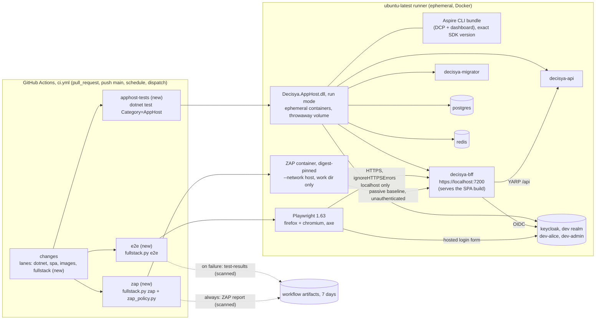

# Architecture note: full-stack CI with AppHost tests, Playwright E2E and ZAP (issue #123)

## Context

Today three suites have only run on Marco's host:
- the `Category=AppHost` tests (#15 F-5; `ci.yml` filters them out of the unit step);
- the Playwright E2E suite with axe (#26, #121, #122; `ci.yml:173` defers it "until the AppHost job exists");
- any DAST of the BFF.

This issue brings all three into CI as jobs in `ci.yml`. It adds no module, no contract and no product data flow. It does add:
- a CI data flow: a generated credential, a running stack, and artifacts;
- a new third-party scanner image;
- a new CI tool (the Aspire CLI);
- three candidate required checks.

Hence the full form.

Links:
- ADR-0019 (new, Accepted by Marco on 2026-10-09, M4): the target, the password, ZAP and the policy;
- ADR-0011 (host default, unchanged);
- ADR-0014 (pinning; ZAP follows item 3);
- ADR-0015 (image scan; ZAP is a CI tool and not a target, the same as Grype);
- ADR-0017 and ADR-0018 (release and Compose stack: not the CI target, see D1);
- `docs/runbooks/main-ruleset.md`, `docs/runbooks/ci-security-gates.md`.

## C4 excerpt (CI, not product)

## Boundaries and contracts

- **No product boundary changes.** There is no new module, Contracts type, Wolverine message, endpoint or schema. `playwright.config.ts` and the E2E specs are expected to stay as they are (D4).
- **New CI boundaries:**
  - **The password boundary.** The dev password exists only inside one harness process tree per job (`.github/scripts/fullstack.py`, or the single test step in `apphost-tests`). It never reaches `$GITHUB_ENV`, `$GITHUB_OUTPUT`, a file, an artifact or the job log.
  - **The scanner boundary.** The ZAP container gets a fresh work directory and nothing else: no repository mount, no Docker socket, no `-e`, no token.
  - **The artifact boundary.** Nothing is uploaded until a scan for the run's password and for JWT-shaped strings has passed. A hit deletes the whole directory.
  - **The required-check boundary.** The three jobs follow the `image-scan` skip-safe pattern: `needs: changes`, no job-level `if`, gating at step level. A required check therefore always reports.

## Decisions

### D1. Target environment: the AppHost on the runner (ADR-0019)

E2E and ZAP run against the built AppHost DLL in run mode on `ubuntu-latest`. The Compose stack is not used. Why:

- **It is the stack E2E was written for.** The dev realm seeds `dev-alice` and `dev-admin` from one password (`Parameters:dev-user-password`). Run mode turns `Authentication__RequireAdminMfa` off. The specs sign in as those two users and expect `https://localhost:7200`.
- **The Compose stack would add a release-image build, a Caddy edge with NAS host names and LAN allow-lists, and synthetic users.** The production realm has no users, so E2E would need users created through the admin API at test time, and admin MFA would block `dev-admin`. That is a separate harness several times larger than this issue.
- **The cost is fidelity.** Dev mode has no HSTS, no Caddy headers, no production realm and no MFA. The ZAP verdict is therefore about the BFF's own headers, cookies and content (D5), not about the edge. A production-shaped ZAP baseline against the Compose stack goes to #83, as a host-run addition next to `deploy/tests/stack_smoke.py`.

How the stack starts (the `fullstack.py up` part, shared by `e2e` and `zap`):
1. Generate the password: `secrets.token_hex(24)`. That is 48 hex characters, which satisfies `RealmSecretRules` and the realm password policy. Print `::add-mask::<value>` as the very first output line.
2. Generate the volume name `decisya-apphosttests-<secrets.token_hex(16)>`. This is the only shape `AppHost.cs` accepts with `AppHost:UseEphemeralContainers=true`, so Postgres, Keycloak and Redis get Aspire's Session lifetime and are removed when the AppHost stops.
3. Start `dotnet <TargetPath of Decisya.AppHost, Release>` with:
   - `--Postgres:DataVolumeName=<name> --AppHost:UseEphemeralContainers=true`;
   - the password in the child environment only, as `Parameters__dev-user-password`.

   Never `dotnet run`: #120 found it taken over by the Aspire CLI.
   - **stdout and stderr go to a file under `RUNNER_TEMP`, never to the job log.** The dashboard login line carries a browser token (`/login?t=`). On failure, the harness prints the last 200 lines with every `login?t=` line dropped. The log file is never uploaded.
4. Readiness. Each check has a hard deadline, 6 minutes in total, and the harness fails with the name of the check that did not pass:
   - `GET https://localhost:7200/bff/me` returns 200 with `isAuthenticated: false`;
   - `GET /api/capabilities` through the BFF returns 401, which proves BFF to Api forwarding and that the Api is up;
   - Keycloak's `/realms/decisya/.well-known/openid-configuration` returns 200.

   Then the harness makes one warm-up `GET /` so the first sign-in in Playwright is not a cold start.
5. Stop. SIGINT, then SIGTERM after 30 s, then kill the process group. Every `subprocess` call has a timeout (the bounded-runs lesson). A leftover container on an ephemeral runner is harmless, but the harness still runs `docker ps --filter name=decisya-apphosttests` for the log.

Linux prerequisites, both unproven until the spike (D9):
- **The Aspire CLI bundle.** `AspireUseCliBundle=true` takes DCP and the dashboard from the installed CLI. Install it as `dotnet tool install Aspire.Cli --version <V> --tool-path "$RUNNER_TEMP/aspire-cli"` and put it on `PATH`. `<V>` is read at run time from the `Aspire.AppHost.Sdk/<V>` attribute of `src/Decisya.AppHost/Decisya.AppHost.csproj`, which keeps one source of the version. It is an exact version from nuget.org, never an install script (S-120-06).
  - If the spike shows the dotnet-tool package does not provide the bundle, the fallback is the release archive for that exact version, verified against a SHA-256 committed in the repository.
  - **Alternative, not chosen:** a `.config/dotnet-tools.json` local manifest gives Dependabot visibility, but it adds a repo-root file that host tooling also sees. Marco approved the tool-path install (M3, 2026-10-09). A test asserts the version is derived from the csproj, not hard-coded.
- **The dev certificate.** Run `dotnet dev-certs https` and then `dotnet dev-certs https --trust`, and export `SSL_CERT_DIR=$HOME/.aspnet/dev-certs/trust:/usr/lib/ssl/certs` to the harness. The BFF reaches the Api (`https://decisya-api`) and Keycloak over the dev certificate. Playwright keeps `ignoreHTTPSErrors`, which `playwright.config.ts` limits to loopback hosts.

### D2. Job layout

There are three new jobs. They run in parallel with `build-test`, not after it, so the wall-clock time barely grows. Every one has these properties:
- `runs-on: ubuntu-latest`;
- `needs: changes` and nothing else (G4-80-03: a required job may only need required jobs);
- no job-level `if`, no `continue-on-error`, no `environment:`, no `secrets.*`;
- `permissions: { contents: read }` repeated at job level, as in `image-scan`;
- `timeout-minutes` set;
- `actions/checkout` with `persist-credentials: false`;
- the existing SHA-pinned `setup-dotnet`, plus `setup-node` where needed;
- the first step echoes the lane, and every later step carries `if: needs.changes.outputs.fullstack == 'true'`. When the lane is false the job reports success after one step: the documented skip-safe pattern of `image-scan`.

| Job | Steps (when the lane is true) | Timeout | Expected run |
| --- | --- | --- | --- |
| `apphost-tests` | setup-dotnet; Aspire CLI (D1); dev certs; `dotnet build -warnaserror`; one step that generates and masks the password, then `timeout 1200 dotnet test --project tests/Decisya.AppHost.Tests --no-build --filter-trait "Category=AppHost" --report-xunit-trx` with `Parameters__dev-user-password` set on that command only | 25 min | about 9 min (4 min of tests) |
| `e2e` | setup-dotnet, setup-node; Aspire CLI; dev certs; the SPA package guard (D4); `npm ci --ignore-scripts`; `npm run build` (into `Decisya.Bff/wwwroot`); AppHost Release build; `npx playwright install --with-deps firefox chromium`; `python3 .github/scripts/fullstack.py e2e`; upload `test-results/` **only if the step failed** and only what survived the scan | 30 min | about 12 to 14 min |
| `zap` | as `e2e` up to the AppHost build, with no Playwright install; `python3 .github/scripts/fullstack.py zap`, which starts the stack, runs ZAP, then `zap_policy.py`; upload the ZAP report (`always()`, after the scan) | 25 min | about 10 to 12 min |

**The new `fullstack` lane** in the `changes` job's `lanes: begin/end` block. It is fail-closed: it lists what to exclude, not what to include.
- **Definition:** the existing `code` set (`.claude/` included, docs and `*.md` excluded), minus:
  - `^\.claude/`;
  - `^\.devcontainer/`;
  - `^\.pre-commit-config\.yaml$`;
  - `^deploy/(caddy|otel-collector|tests)/`;
  - `^\.github/` **except** `^\.github/workflows/ci\.yml$`, `^\.github/scripts/(fullstack|zap_policy|spa_package_guard)\.py$` and `^\.github/zap/`.
- **Two always-on conditions:** `ALL` always yields `true`, and so does the `*.sln*` presence check that `dotnet` uses.
- **Why the rest stays in:** `src/**` (the SPA included), `tests/**`, `deploy/keycloak/**`, `deploy/postgres/**` (both used by the AppHost), `deploy/compose/**` (read by `ComposeStackPublishTests`), `deploy/sql/**` and the root build files.
- **Test:** `.claude/tests/test_ci_fullstack.py` checks a table of paths against it, in the style of `test_ci_integration.py`.

Not chosen:
- **One combined `fullstack` job** (build once, AppHost tests, then E2E, then ZAP). It saves about 10 runner-minutes, but the serial run is about 25 min and only one check name reports for three different failures.
- **`needs: build-test`.** It would add about 12 min of wall-clock to every PR.
- **A matrix per browser.** G4-80-04 forbids a matrix on a required check, and the config already runs both projects in one invocation.

**Caching: none in this issue.**
- Playwright's own guidance is that restoring browsers takes about as long as downloading them.
- A NuGet cache adds an action and a cache-poisoning surface (a PR can write a cache that `main` later restores only under specific scoping rules) to save about a minute.
- Revisit in #83 if wall-clock time hurts.

**Weekly `schedule`.** The weekly run yields `ALL`, so all three jobs run weekly too.

### D3. AppHost tests: a separate job, and the unit step keeps its filter

- **`build-test` keeps `--filter-not-trait "Category=AppHost"`.** Removing it would put DCP, the Aspire CLI and about 4 min into `build-test`, the job that every lane depends on. The separate job also names the failure.
- **`AppHostCategoryTraitGuardTests` stays as it is and keeps running in `build-test`.** It still matters: a DCP test without the trait would fail `build-test`.
- **`KeycloakResourceTests` stays skipped (#70).** CI reports it as skipped. Fixing #70 is out of scope.
- **platform-dev changes the text, not the behaviour:**
  - `AssemblyInfo.cs`, `AppHostCategoryTraitGuardTests` and the class summaries say "host only (ADR-0010) / not in CI (F-5)"; that becomes "the `apphost-tests` CI job and Marco's host".
  - If the spike shows the tests that start the AppHost do not read `Parameters__dev-user-password` from the environment, they get the value as a `--Parameters:dev-user-password=` argument read from that variable, the form `RunModeAdminMfaTests` already uses. The variable stays unset on Marco's host, where user-secrets apply.
- **Leftover state on the runner.** Run mode persists the generated parameters (`persist: true`) into the AppHost's user-secrets on the runner. That is ephemeral, and the file is never uploaded.

### D4. Playwright in CI

- **Browsers.** `npx playwright install --with-deps firefox chromium` installs exactly the builds of `@playwright/test` 1.63.0 from `package-lock.json`, the pinned version, and the OS dependencies through apt. No checksum is checked: this is the residual named in ADR-0019. There is no cache (D2). Both projects run in one invocation, and `axe.spec.ts` and the shell's axe check run in both.
- **The SPA package guard runs before `npm ci` in this job too.** Move the inline check from `build-test` into `.github/scripts/spa_package_guard.py`, a stdlib port, and call it from both jobs, so the guard and its trigger cannot drift. `npm ci --ignore-scripts` stays explicit.
- **`E2E_DEV_PASSWORD` is generated per run, not a GitHub secret.** This deviates from the issue text, and the reasons are in ADR-0019:
  - fork and Dependabot PRs get no Actions secrets, so a required `e2e` would fail on every Dependabot PR;
  - a protected environment would hold every PR for approval;
  - the value guards a realm that lives for one job.

  It is the integration step's precedent. **Decided by Marco (M1, 2026-10-09): generated per run.**
- **Keeping it out of logs:**
  - The mask is the first output line.
  - The value goes only into the child environments of the AppHost (`Parameters__dev-user-password`) and of `npx playwright test` (`E2E_DEV_PASSWORD`).
  - It is never written to `$GITHUB_ENV`, `$GITHUB_OUTPUT` or a file.
  - It never appears in a `run:` line as an expression.
  - Reporter `list` prints titles only. `support.ts` already never logs it.
- **The teardown scan stays as it is** (`global-teardown.ts`, four encodings, delete and fail). Because a killed run skips Playwright's teardown, `fullstack.py` runs the same scan over `test-results/` after Playwright exits, for any reason. It also adds a JWT-shape check (`eyJ[\w-]+\.[\w-]+\.`) and the session cookie name followed by `=`. Any hit, or any error while scanning, deletes the whole directory and fails the step.
- **Artifacts.**
  - `trace: 'off'` and `video: 'off'` stay as they are. Traces would hold the Keycloak form POST and the cookies.
  - `screenshot: 'only-on-failure'` stays.
  - `actions/upload-artifact` (new, SHA-pinned) uploads `src/Decisya.Web/test-results/` with `if: failure()` at step level and `retention-days: 7`.
  - The repository is public, so artifacts can be downloaded by any signed-in user. That is acceptable only because the scan has run and every value is throwaway.
- **Config changes: none expected,** so frontend-dev is not needed. If the spike shows the first sign-in exceeding the 20 s heading wait, the harness warm-up is extended. The spec timeout is not loosened.

### D5. ZAP (ADR-0019)

- **Mode.** `zap-baseline.py`: the traditional spider plus the AJAX spider (`-j`), with spider time capped at 2 min (`-m 2`), passive rules only. (Amended: no AJAX spider and no `-j`; the scan is the traditional spider, the hook's seeded endpoints `/`, `/bff/me`, `/api/capabilities` and the passive rules. See ADR-0019 Amendment 1.)
- **Target.** `https://localhost:7200`, the BFF. The Api is scanned only through `/api/*` on the BFF: in production it is reachable only behind the BFF and the back channel, and in CI it answers 401 there.
  - **Out of scope:** Keycloak is a third-party product, covered by `image-scan`, and the spider's scope keeps it out.
  - **Not possible yet:** an API scan, because no OpenAPI document exists. It follows the first Contracts OpenAPI file (#83).
- **Unauthenticated.** It covers the anonymous surface: the shell and its assets with their CSP and headers, `/bff/me`, `/bff/login` and its redirect, `/bff/logout`, `/bff/backchannel-logout`, and `/api/*` returning 401.
  - **Deferred authenticated scan (#83).** The design: Playwright signs in through a ZAP daemon used as a proxy. The open issue is that ZAP would record the Keycloak form POST in its session.
  - **Never:** a session cookie or header injected on ZAP's command line.
- **Image.**
  - **Pin:** `ghcr.io/zaproxy/zaproxy:<stable version>@sha256:<64 hex>` in `.github/zap/Dockerfile`, never built, resolved two ways as `ContainerImages.cs` documents. Dependabot gets a `docker` entry for `/.github/zap` with a 7-day cooldown.
  - **Not an ADR-0015 target.** It is a CI tool like Grype: never deployed, ephemeral runner, throwaway stack. Its Java and Firefox CVEs would block every week with no product exposure. **Marco approved the new image (M3, 2026-10-09).** The exact pin is resolved at G4, past the 7-day cooldown, and shown to Marco; the PR body gets one line.
  - **Run command:** `docker run --rm --network host --user "$(id -u):$(id -g)" -v "$RUNNER_TEMP/zap-wrk:/zap/wrk:rw" <pinned ref> zap-baseline.py -t https://localhost:7200 -j -m 2 -J report.json -r report.html`. (Amended: without `-j`, see ADR-0019 Amendment 1; the committed argv in `fullstack.py` and `test_ci_fullstack.py` is authoritative.)
  - `--network host` is needed because Kestrel and the DCP proxy bind loopback only. There is no other mount, no `-e` and no socket.
- **Rules and baseline.** There is no `rules.tsv` suppression. The verdict comes from `.github/scripts/zap_policy.py` (stdlib):
  - **Fail:** any alert of risk Medium (2) or High (3), at any confidence except False Positive, unless an unexpired entry in `.github/zap/exceptions.json` covers it. An entry is `{pluginId, path, justification ≥ 20 chars, issue "#n", added, expires ≤ added + 90 d}`. `path` is an exact path or a prefix ending in `/`.
  - **Report only:** Low and Informational alerts go into the job summary as a table of plugin id, name, risk, count and whether an exception applied.
  - **Fail-closed:**
    - ZAP exits 3, or the report is missing or unparsable;
    - the report names a site other than `https://localhost:7200`;
    - the scanned URLs do not include `/` and `/bff/me`;
    - an exception file entry is invalid (exit 2, as in `image_scan.py`).
  - **The baseline** is the first CI run's result:
    - Medium and High findings are fixed in this PR when trivial; otherwise each gets an exception with an issue in #83.
    - Expected Low items such as missing HSTS in dev mode stay reported only.
    - The runbook records the first run's table.
- **Output hygiene.** Alert names, URLs and evidence come from our own app's responses, and are attacker-shaped if a response is ever compromised. The policy script therefore writes the summary with `::stop-commands::<random token>`, like the `changes` job (T-14, H-10), and never writes to `$GITHUB_ENV` or `$GITHUB_OUTPUT`.
  - **The report artifact** (`report.json`, `report.html`, 7 days) is uploaded with `always()`, after `fullstack.py` has scanned the work directory for the run's password and JWT shapes.
- **Runtime.** The image pull (about 1.5 GB) takes about 1 min. The baseline with the AJAX spider takes 3 to 5 min (amended: no AJAX spider, see ADR-0019 Amendment 1). The whole job takes about 10 to 12 min.

### D6. Permissions and supply chain

- The workflow keeps `permissions: contents: read`. Each new job repeats `contents: read` and adds nothing. `upload-artifact` needs no extra scope.
- Never: `pull_request_target`, `environment:`, `secrets.*`, writing a credential to `$GITHUB_ENV`/`$GITHUB_OUTPUT`, or `paths:` on the trigger.
- **New action:** `actions/upload-artifact`, at its 40-hex commit SHA with a `# vX.Y.Z` comment (ADR-0014; `test_ci_pins.py` covers it). There is no ZAP action (ADR-0019 option 4).
- **New tool:** the Aspire CLI (D1), at an exact version. **Marco approved it (M3, 2026-10-09).** The exact version is resolved at G4, past the cooldown, and shown to Marco; the PR body gets one line.
- **New image:** ZAP, digest-pinned (D5).
- **Review-required paths.** `REVIEW_REQUIRED_PATHS` in `.claude/scripts/gates.py` already covers `ci.yml`, `main.json`, `dependabot.yml` and `.github/scripts/*.py`, so `fullstack.py`, `zap_policy.py` and `spa_package_guard.py` are covered. It does not cover `.github/zap/`: devops adds `|\.github/zap/.+`, next to `\.github/image-scan/.+`. The pin and the exceptions decide what passes, and `gates.py` is itself review-required.

### D7. Required checks

**Decided by Marco (M2, 2026-10-09): all three are required (`apphost-tests`, `e2e`, `zap`).** Each always reports because of the step-level gating (D2), and the ZAP verdict is our own fail-closed policy with only Medium and High failing. The alternative, `zap` advisory for two weeks of burn-in, was not chosen.

- **Same PR:** add the three contexts to `.github/rulesets/main.json` and to `FLOOR` in `.claude/tests/test_ruleset.py`, as #28 did for `image-scan`. None goes into `SKIP_SAFE`, because none has a job-level `if`.
- **The live ruleset is applied by Marco only after merge,** in the order of the runbook's "Adding a required check":
  1. the jobs report on `main`;
  2. a `workflow_dispatch` run on `main` shows all three really ran, not as one-step lane skips;
  3. read the diff;
  4. apply;
  5. verify.
- **Runbook section:** "Adding `apphost-tests`, `e2e` and `zap` as required checks (issue #123)" in `docs/runbooks/main-ruleset.md`.
- **Flakes.** A flaky required check is re-run. It is never bypassed. A flake that repeats becomes an issue. Break-glass stays what it is.

### D8. Cost and time

| | Today (code PR) | Added |
| --- | --- | --- |
| Runner-minutes | build-test about 12 to 14, others about 6 | **about 30 to 35** (9 + 13 + 11) |
| Wall-clock | about 14 min (build-test) | **about 0 to 2 min**: the new jobs run in parallel and none is longer than `build-test` |
| Concurrency | about 7 jobs | about 10 (free plan limit: 20) |

The repository is public, so standard GitHub-hosted minutes cost nothing. The real cost is the wait on every rebase under `strict_required_status_checks_policy` (Dependabot `@dependabot rebase` included), which stays at the length of `build-test`. **This is acceptable for a solo developer.** If the repository goes private (2,000 free minutes a month), one combined job is the fallback layout (D2). These figures are estimates, and the spike replaces them with measured ones in the manifest's G4 evidence.

### D9. G4 routing and the spike

**A spike is needed, and it is the first G4 step.** The Linux parts cannot be proven on Marco's Windows host:
1. **S1:** the Aspire CLI from the tool-path install provides the bundle, so DCP and the dashboard start, on `ubuntu-latest`.
2. **S2:** the built AppHost DLL in run mode, with the trusted dev certificate, reaches readiness (D1 step 4). That means BFF to Api and BFF to Keycloak over TLS.
3. **S3:** `dotnet test … Category=AppHost` passes, and shows whether the env-var password reaches the testing builder (D3).
4. **S4:** measured times for D8.

devops pushes the `apphost-tests` job and the `fullstack.py up` path first, on the PR branch. Agents cannot read `gh run`, so Marco reports the job logs back. If S1 fails with both install routes, stop and report: the fallback is an ADR change, not a workaround.

| Implementer | Files |
| --- | --- |
| **devops** (main) | `.github/workflows/ci.yml` (the `fullstack` lane and the three jobs); `.github/scripts/fullstack.py`, `zap_policy.py`, `spa_package_guard.py`; `.github/zap/Dockerfile` and `exceptions.json` (`[]`, or the baseline entries); `.github/dependabot.yml` (`/.github/zap`); `.github/rulesets/main.json`; `.claude/scripts/gates.py` (`REVIEW_REQUIRED_PATHS` gets `.github/zap/`, D6); `.claude/tests/test_ci_fullstack.py`, `test_zap_policy.py`, and extensions to `test_ci_pins.py` and `test_ruleset.py` (FLOOR); `docs/runbooks/ci-security-gates.md` (gate table rows, "ZAP baseline" and "Add or renew a ZAP exception" sections, update "Where the old gaps went"); `docs/runbooks/main-ruleset.md` (D7 section) |
| **platform-dev** | `tests/Decisya.AppHost.Tests/**`: doc-comment updates (D3); the password argument only if S3 needs it |
| **frontend-dev** | none expected (D4); only if S2 or S4 shows a config change is unavoidable |

`ci.yml:173`'s comment is replaced by a pointer to the `e2e` job.

## Marco's decisions (decided 2026-10-09)

- **M1, decided:** `E2E_DEV_PASSWORD` is generated per run, instead of the protected secret named in the issue (D4).
- **M2, decided:** all three jobs are required now; no advisory burn-in for `zap` (D7).
- **M3, decided:** the new tool (Aspire CLI, tool-path install, D1) and the new image (OWASP ZAP stable, digest-pinned and exempt from `image-scan`, D5) are approved. The pins are resolved at G4, past the cooldown, and shown to Marco. Each gets one PR-body line.
- **M4, decided:** ADR-0019 is accepted.

## NetArchTest rules to add

None. No module, assembly reference or Contracts boundary changes. The CI boundaries above are enforced by offline tests in `.claude/tests`, which the required `claude-config` job runs:

| Rule | Files read | Test |
| --- | --- | --- |
| The three jobs have `needs: changes` only; no job-level `if`, `environment:`, `secrets.` or `continue-on-error`; `contents: read` only; `timeout-minutes` set | `ci.yml` | `test_ci_fullstack.py` |
| No `$GITHUB_ENV`/`$GITHUB_OUTPUT` write in the three jobs; no `dotnet run`; the AppHost is started only through `fullstack.py` | `ci.yml`, `fullstack.py` | `test_ci_fullstack.py` |
| The ZAP image is referenced only through the digest pin; `docker run` has no `-v` other than the work directory, no socket, no `-e` | `fullstack.py`, `.github/zap/Dockerfile` | `test_ci_fullstack.py`, `test_ci_pins.py` |
| The Aspire CLI version is derived from `Decisya.AppHost.csproj`, never a literal | `ci.yml` | `test_ci_fullstack.py` |
| The `fullstack` lane: table of paths and expected results (fail-closed exclusions) | `ci.yml` lanes block | `test_ci_fullstack.py` |
| Policy: Medium and High fail; Low and Info only report; exception schema and expiry; fail-closed on a missing report, wrong site, too few URLs or exit 3; workflow commands neutralised | `zap_policy.py` | `test_zap_policy.py` |
| The artifact scan deletes on a password (four forms), JWT shape or cookie hit, and on a scan error | `fullstack.py` | `test_ci_fullstack.py` (fixture directory) |
| The three contexts are required and in FLOOR | `main.json` | `test_ruleset.py` |
| Every other AppHost test class carries `Category=AppHost` (unchanged) | `Decisya.AppHost.Tests` | `AppHostCategoryTraitGuardTests` |

## Done-when mapping

"All three run on every PR that touches the relevant paths":
- **"Relevant paths":** the `fullstack` lane (D2), plus the weekly schedule and dispatch.
- **"As required checks or with Marco's decision recorded":** D7 and M2 (all three required).

## Deferred to #83

- A production-shaped ZAP baseline against the Compose stack, run by hand next to `stack_smoke.py`.
- The authenticated ZAP scan (Playwright through a ZAP proxy).
- The ZAP API scan, once the first OpenAPI document exists.
- SPA route coverage in the ZAP scan: binding the AJAX spider to the BFF context, or another way to reach client-side routes that only JavaScript renders (ADR-0019 Amendment 1, 2026-10-09).
- Browser and Aspire CLI checksums or signatures.
- CI caching, if wall-clock time hurts.
- Fixing #70 (`KeycloakResourceTests` under the test host).

## Notes for G3

Threat-delta inputs:
1. The password lifecycle in `fullstack.py`: mask first, child environments only, the scan after a kill.
2. The dashboard token in the AppHost console: a file only, filtered on failure, never uploaded.
3. ZAP with `--network host`: it can reach every loopback service on the runner (dashboard, Keycloak admin, Postgres, Redis), but it gets no credential.
4. Public artifacts: Playwright failures and the ZAP report.
5. ZAP report content reaching the job summary (workflow-command injection).
6. Run-time downloads without checksums: Playwright browsers and apt, the Aspire CLI if the archive fallback is not used, the ZAP vulnerability rules inside the pinned image.
7. Pressure from a flaky required check toward break-glass.
8. The dev certificate trusted on the runner: its key is generated there.
9. The AppHost user-secrets file with the persisted generated parameters on the runner.

<!-- gate: G2 | verdict: PASS | issue: #123 -->
