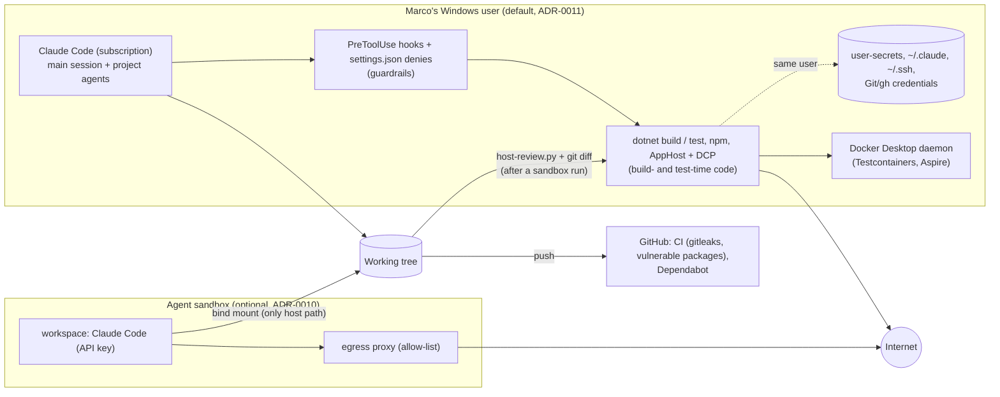

# Architecture note – host development by default; agent sandbox optional (issue #56)

## Context

Issue #56 records Marco's decision of 2026-09-26: development, including the agents' code gates G4 and G5, runs on the host (VS 2026, VS Code, Claude Code on Marco's subscription). The ADR-0010 sandbox stays available as an option, recommended when an issue brings in a new third-party package or feeds external content to an agent. The manifest records which one was used. The subscription-token idea from #15 is dropped. This changes no product module, contract or runtime data flow. It changes the development trust boundary, which ADR-0010 made structural, so it needs an ADR.

- Decision: [ADR-0011](../adr/0011-host-development-default.md) (Accepted, 2026-09-26), which partly supersedes [ADR-0010](../adr/0010-agent-sandbox-devcontainer.md).
- Background: `docs/ai/pipeline/15.md` (Decisions, the first host exception) and `docs/security/reviews/15.md` (ruling 1, its conditions).
- Threat delta: G3, `docs/security/threat-models/host-development-default.md`.

## C4 excerpt

The development environment, not the product. On a host run, the agent, its tools and the code it builds and tests share the dashed boundary with Marco's secret stores. The sandbox path is optional.



## Boundaries and contracts

- No module, `*.Contracts` type, Wolverine message, endpoint or schema is added or changed.
- **Trust boundary change:** on a host run, TB6 (sandbox to host) from the ADR-0010 threat model does not exist. Agent-written and package-supplied build-time and test-time code runs at Marco's privilege. ADR-0011's Consequences list the accepted risk and the controls. G3 rates it.
- **Process contract:** the issue manifest records where the code gates ran (`host`, or `sandbox` with its trigger). This is set at G0 and confirmed at G4, so that G3 and G6 rate T-04-class threats against the boundary actually used (the #15 G6 condition).

## Decisions

- Host by default, sandbox optional with named triggers, and the subscription-token idea dropped: ADR-0011.
- ADR-0010 keeps its history and its status line reads "Accepted (partly superseded by ADR-0011)", with a note at the top that names exactly what is replaced.
- The sandbox's design, amendments, procedures and `lint.py` `sandbox-config` checks are unchanged. No ADR is needed for them.
- Pre-push check: planned, in a separate issue to be filed. ADR-0011 names what it should flag.

## NetArchTest rules to add

None. No assembly boundary changes. The enforcement for this decision is in ADR-0011, "Enforced by": central package management, the `agent_boundaries.py` package rules, the secret guard, gitleaks, and CI's vulnerable-package gates.

| Rule | Assemblies | Test class |
| --- | --- | --- |
| — | — | — |

## Changes in this gate (architect lane)

| File | Change |
| --- | --- |
| `docs/adr/0011-host-development-default.md` | New, Accepted, 2026-09-26 |
| `docs/adr/0010-agent-sandbox-devcontainer.md` | "Partly superseded by ADR-0011" note at the top; status line updated; history kept |
| `docs/adr/README.md` | 0011 row added; 0010 status reads "Accepted (partly superseded by 0011)" |
| `docs/runbooks/agent-sandbox.md` | "When to use" marks it optional with the triggers; the rules apply to sandbox runs only; `host-review.py` is required after a sandbox run; procedures unchanged |
| `docs/runbooks/issue-pipeline.md` | New section "Where agents run" (host by default, sandbox optional, both columns); new step 7, read the diff before committing (`host-review.py` after a sandbox run only); steps renumbered |

## For the main session (outside the architect lane)

### CLAUDE.md, "Working agreements": replace the two sandbox bullets

Current (the two bullets beginning "Agent sessions that change code run in the sandbox" and "Exception: issues that change the sandbox or agent tooling itself"). Replace both with:

```markdown
- Development runs on the host by default (ADR-0011): VS 2026, VS Code and Claude Code, the code gates G4 and G5 included. The ADR-0010 sandbox (`docs/runbooks/agent-sandbox.md`, started with `.devcontainer/sandbox.py claude`) is optional and recommended when an issue brings in a new third-party package or feeds external content (web pages, third-party issues or PRs, package READMEs) to an agent. The issue's manifest records `host` or `sandbox`.
- After a sandbox run: the VS 2026 solution stays closed while the agent runs; before reopening it, building, committing or starting a host Claude session, run `.devcontainer/host-review.py` and read `git diff`. Issues that change `.devcontainer/**` or `.claude/**` (read-only inside the sandbox) run on the host. After a host run, read `git diff` before committing.
```

### `.claude/hooks/secret_guard.py` docstring

The line numbers below are the file's. The brief's "5-6" and "23-28" map to the two passages that rely on the sandbox boundary: file lines 5-6 and file lines 27-30.

File lines 5-6. Current:

```text
the obvious forms for every session and agent. It is a guardrail, not a security boundary
(CLAUDE.md); the sandbox's "no secrets mounted" is the boundary (ADR-0010).
```

Replacement:

```text
the obvious forms for every session and agent. It is a guardrail, not a security boundary
(CLAUDE.md). Host sessions are the default (ADR-0011), and there nothing stands behind it: any
code that runs as the user can read these files. Only an optional sandbox run (ADR-0010) has a
boundary, because no host secret is mounted there.
```

File lines 27-30. Current:

```text
Accepted residuals (out of scope; the sandbox boundary covers them): names built at run time
($(printf ...), variables, chr(), base64), recursive readers that never name the file
(grep -r X ., find -exec cat), scripts the agent writes and runs, indirect disclosure through
process or container environments, listing the user-secrets folder via an environment variable.
```

Replacement:

```text
Accepted residuals (out of scope for a pattern guard; ADR-0011 accepts them for host sessions,
and only a sandbox run (ADR-0010) removes the files they would reach): names built at run time
($(printf ...), variables, chr(), base64), recursive readers that never name the file
(grep -r X ., find -exec cat), scripts the agent writes and runs, indirect disclosure through
process or container environments, listing the user-secrets folder via an environment variable.
```

### Follow-ups (not in #56's Done-when)

- `.claude/skills/issue/SKILL.md`: add a manifest header field such as `- Runs on: host` or `- Runs on: sandbox (<trigger>)`, set at G0. Optionally, have `.claude/scripts/gates.py` require it once G4 is not `pending`. Until then, ADR-0011 lists the record under "Not enforced".
- File the pre-push-check issue that ADR-0011 names. It should flag `Directory.Packages.props`, `package.json` and lock files, `.props`/`.targets`, and `.csproj` `Import`/`Exec`/`UsingTask`/`VersionOverride`.
- Possibly extend `agent_boundaries.py` to `npm install|ci|i` for project agents. Today only `dotnet`, `aspire`, `gh` and `pre-commit` commands are covered, which is a gap ADR-0011 records.

<!-- gate: G2 | verdict: PASS | issue: #56 -->
