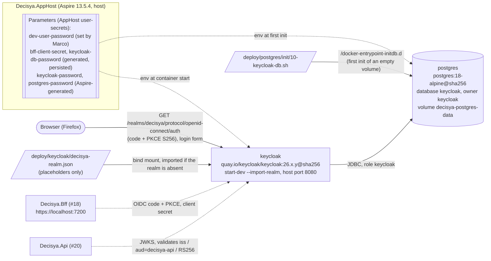
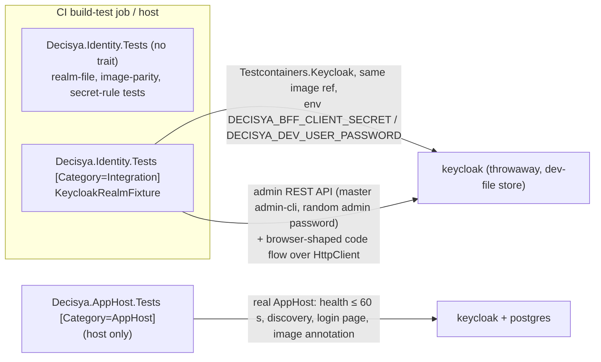

# Architecture note – Keycloak realm export, `decisya-bff` client, seeded users (issue #17)

## Context

Issue #17 (0.05) adds the platform's first external integration: a Keycloak container in the AppHost. It imports a version-controlled `decisya` realm when it starts, and it stores its data in its own Postgres database and role. This issue adds no module, no `Contracts` type and no Decisya endpoint. It does add:

- a new identity data flow: browser → Keycloak, and later the BFF (#18) and the API (#20) → Keycloak;
- the first Postgres server resource;
- two new secrets that flow through the AppHost;
- the interface that #18, #20 and #22 build on: issuer, client, redirect URIs, audience and the `tenant_id` claim.

That is why this note uses the full form.

Inputs:

- Requirements: `docs/requirements/phase-0/keycloak-realm.md` (Stories 1-7 and Marco's decisions 1-4), and NFR-15 and NFR-16 in `docs/requirements/nfr.md`.
- Manifest: `docs/ai/pipeline/17.md`. The issue runs on the host. The new Keycloak image was accepted there as an ADR-0011 trigger.
- ADRs:
  - 0001: single realm; `tenant_id` claim; `platform-admin` backs `[AllowCrossTenant]`.
  - 0002: Keycloak, the `decisya-bff` confidential client with PKCE S256, a secret from the environment, and Keycloak's own database and role. Its "Enforced by" line is this issue's test list.
  - 0003: the BFF is the only OIDC client; tokens ≤ 5 min; RS256/ES256.
  - 0007: `postgres:18-alpine` pinned by digest; one image reference everywhere; Keycloak's database is part of the backup scope.
  - 0010 and 0011: host by default; the sandbox image list.
- `docs/architecture/apphost-servicedefaults.md` (#15): AppHost conventions and the `Category=AppHost` host-only tests.
- **Not read:** the issue comments on #18, #20 and #22. This session had no shell, so `gh issue view` could not run. The interface this issue fixes for them is listed under "Interface for later issues". The orchestrator should compare it with those comments before G3.

## C4 excerpt

Container view (dev, as delivered by #17; dashed = later issues):



Test view:



## File layout and owners

| Path | Kind | Owner |
| --- | --- | --- |
| `deploy/keycloak/decisya-realm.json` | **new**. A hand-curated partial realm representation (below) | devops |
| `deploy/postgres/init/10-keycloak-db.sh` | **new**. Creates the `keycloak` role and database | devops |
| `src/Decisya.AppHost/AppHost.cs` | changed | devops |
| `src/Decisya.AppHost/ContainerImages.cs` | **new**. `internal static class`: the image constants, the single source of truth | devops |
| `src/Decisya.AppHost/RealmSecretRules.cs` | **new**. `internal static class`: the charset and length rule for placeholder values | devops |
| `src/Decisya.AppHost/Decisya.AppHost.csproj` | adds `PackageReference`s to `Aspire.Hosting.PostgreSQL` and `Aspire.Hosting.Keycloak` (both already pinned centrally) | devops |
| `.devcontainer/engine/images.Dockerfile` | adds the `keycloak` line (ADR-0002 Bad consequence: "by the first issue that uses them") | devops (host run, CLAUDE.md exception already recorded) |
| `.github/workflows/ci.yml` | Integration step (below) | devops |
| `.gitleaks.toml` | only if gitleaks flags a placeholder (below) | devops |
| `docs/GETTING-STARTED.md` | new section "3. Keycloak (issue 0.05)" | devops |
| `tests/Decisya.Identity.Tests/**` | **new** xunit.v3 project | test-engineer (devops may create the skeleton in G4) |
| `tests/Decisya.ServiceDefaults.Tests/Architecture/AppHostConfigurationTests.cs` | rewrite one test (below) | test-engineer |
| `tests/Decisya.AppHost.Tests/KeycloakResourceTests.cs` | **new**, `Category=AppHost` | test-engineer |
| `tests/Decisya.Api.Tests/Architecture/ApiBoundaryTests.cs` | two added rules | test-engineer |
| `decisya.slnx` | `tests/Decisya.Identity.Tests/Decisya.Identity.Tests.csproj` under `/tests/`, and `deploy/**` files as solution items under a `/deploy/` folder | test-engineer / devops |

**File name.** Use `decisya-realm.json`, the G1 spelling, not `realm-decisya.json`. Keycloak's directory import (`--import-realm` over `/opt/keycloak/data/import`) picks up only files named `<realm>-realm.json`. That name keeps the file valid whether the AppHost mounts the file or the directory.

`.gitattributes` already forces LF for `*` (`text=auto eol=lf`). This matters because the Postgres image runs `10-keycloak-db.sh` under `sh`, so no extra rule is needed.

## The realm export: `deploy/keycloak/decisya-realm.json`

### How placeholders resolve

- **Mechanism.** At import time, the Keycloak (Quarkus) distribution resolves `${…}` placeholders in string values of a realm file while it reads the JSON. This happens inside Keycloak, not in Aspire. Aspire's `WithRealmImport` only mounts the file and adds `--import-realm` to the start command. Testcontainers does the same through `WithResourceMapping` and `WithCommand("--import-realm")`.
- **Syntax.** Use `${env.DECISYA_BFF_CLIENT_SECRET}` and `${env.DECISYA_DEV_USER_PASSWORD}`, as G1 decision 1 says. The `env.` prefix makes the replacer read an environment variable of the Keycloak process. Keycloak's server guide also documents an unprefixed `${VAR}` form for environment variables.
  - G4 check: if the pinned 26.x version doesn't resolve the `env.` form, the integration test's secret-equality and login assertions fail. In that case switch both placeholders to the documented `${VAR}` form, record the observed behaviour in the G4 evidence, and change nothing else.
  - Use no `:default` suffix, ever. A default would be a literal secret in source.
- **Fail-open hazard (G3 should rate it).** An unresolved placeholder is left in place as literal text. The client secret would then become the public string `${env.DECISYA_BFF_CLIENT_SECRET}`, and every dev password would become the matching public string. Three controls stop that:
  1. The AppHost refuses to start when the dev password is missing or malformed. The two generated values are always present.
  2. The Testcontainers fixture always sets both variables.
  3. The integration test asserts that the client secret stored in Keycloak equals the environment value, and that a login with the environment password succeeds. Both are impossible when the value is the literal placeholder.
- **Value rule.** This rule lives in `RealmSecretRules.cs` and is shared by the AppHost and the tests.
  - Values match `^[A-Za-z0-9_-]+$`. The client secret is 32-128 characters and the dev password 16-128.
  - Why: whether Keycloak substitutes before or after JSON tokenisation is an implementation detail we don't rely on, so a value can never contain `"`, `\`, `$`, `{` or `}` and can't break or inject into the realm JSON.
  - Hex from a CSPRNG satisfies the rule and the password policy.
- **Allowed placeholders.** The file contains exactly two distinct placeholders. No other `${` may appear anywhere in it (static test).

### Content (hand-curated, not a raw Admin Console export)

A full export carries realm key material (`components` → `org.keycloak.keys.KeyProvider` with `privateKey`), hashed credentials (`secretData` and `credentialData`) and generated ids. The file must hold **none** of them. Keycloak generates keys and ids at import. If G4 starts from an export, it strips all three kinds of field (static test below).

**Realm:**

| Setting | Value | Why |
| --- | --- | --- |
| `realm`, `displayName`, `enabled` | `decisya`, `Decisya`, `true` | ADR-0002 |
| `sslRequired` | `external` | dev over http on localhost. 0.17 sets `all` for deployment |
| `registrationAllowed`, `resetPasswordAllowed`, `rememberMe`, `editUsernameAllowed` | `false` | no self-service identity changes in phase 0. Self-registration would create users with no tenant |
| `loginWithEmailAllowed`, `duplicateEmailsAllowed`, `verifyEmail` | `true`, `false`, `false` | |
| `accessTokenLifespan` | `300` | NFR-15 |
| `accessCodeLifespan` | `60` | |
| `ssoSessionIdleTimeout`, `ssoSessionMaxLifespan` | `1800`, `36000` | |
| `revokeRefreshToken`, `refreshTokenMaxReuse` | `true`, `0` | refresh-token rotation (ADR-0003). #18 owns the per-session lock |
| `defaultSignatureAlgorithm` | `RS256` | CLAUDE.md, ADR-0003 |
| `bruteForceProtected` | `true` | ADR-0002 Enforced-by |
| brute-force details | `permanentLockout: false`, `failureFactor: 5`, `waitIncrementSeconds: 60`, `maxFailureWaitSeconds: 900`, `quickLoginCheckMilliSeconds: 1000`, `minimumQuickLoginWaitSeconds: 60`, `maxDeltaTimeSeconds: 43200` | |
| `passwordPolicy` | `length(12) and maxLength(128) and notUsername and notEmail and passwordHistory(3)` | "non-trivial" (ADR-0002). Deliberately no character-class rules, so a hex value always passes |
| OTP policy | `otpPolicyType: totp`, `otpPolicyAlgorithm: HmacSHA1`, `otpPolicyDigits: 6`, `otpPolicyPeriod: 30` | OTP is permitted (ADR-0002). SHA1 is used for authenticator-app compatibility. The default required action `CONFIGURE_TOTP` stays enabled. Enforcing MFA is a later issue |
| `roles.realm` | `tenant-user`, `platform-admin`, each with a one-line `description` | G1 decision 3 |
| `scopeMappings` | `[{ "client": "decisya-bff", "roles": ["tenant-user", "platform-admin"] }]` | needed because the client sets `fullScopeAllowed: false` |

**Client `decisya-bff`:**

| Setting | Value |
| --- | --- |
| `clientId`, `name`, `enabled`, `protocol` | `decisya-bff`, `Decisya BFF`, `true`, `openid-connect` |
| `publicClient`, `clientAuthenticatorType`, `secret` | `false`, `client-secret`, `${env.DECISYA_BFF_CLIENT_SECRET}` |
| `standardFlowEnabled` | `true` |
| `implicitFlowEnabled`, `directAccessGrantsEnabled`, `serviceAccountsEnabled`, `consentRequired`, `frontchannelLogout` | all `false` |
| `fullScopeAllowed` | `false` (least privilege: only the two realm roles reach the token; no `account` audience, no `offline_access`) |
| `redirectUris` | exactly `["https://localhost:7200/signin-oidc"]`. No wildcard, no http |
| `webOrigins` | `[]`. The BFF is server-side and needs no CORS at Keycloak |
| `defaultClientScopes` | `["basic", "profile", "email", "roles", "acr", "web-origins"]` |
| `optionalClientScopes` | `[]` |
| `attributes."pkce.code.challenge.method"` | `S256` |
| `attributes."access.token.lifespan"` | `300` (a client-level override, so a later realm change can't lengthen it silently) |
| `attributes."access.token.signed.response.alg"`, `"id.token.signed.response.alg"` | `RS256` |
| `attributes."post.logout.redirect.uris"` | `https://localhost:7200/signout-callback-oidc` |
| `attributes."backchannel.logout.session.required"` | `true`. #18 adds `backchannel.logout.url` (ADR-0003 back-channel logout); it needs a container-to-host address, which is #18's design |
| `attributes."oauth2.device.authorization.grant.enabled"`, `"oidc.ciba.grant.enabled"` | `false` |
| `protocolMappers` | the two mappers below |

**Mappers (on the client):**

1. `tenant_id`, `protocolMapper: oidc-usermodel-attribute-mapper`, config:
   - `user.attribute: tenant_id`, `claim.name: tenant_id`, `jsonType.label: String`, `multivalued: false`, `aggregate.attrs: false`;
   - `id.token.claim: true`, `access.token.claim: true`, `userinfo.token.claim: true`, `introspection.token.claim: true`.
   - This mapper emits no claim when the attribute is absent (Story 3 scenario 2). Nothing may add a default value.
2. `audience-decisya-api`, `protocolMapper: oidc-audience-mapper`, config:
   - `included.custom.audience: decisya-api`, `access.token.claim: true`, `id.token.claim: false`, `introspection.token.claim: true`.
   - #20 validates `aud = decisya-api`. No `decisya-api` client is created in Keycloak, because the API is bearer-only and never talks OIDC to Keycloak except for JWKS.

**User profile (Keycloak 26 declarative user profile).** Declare it as a realm `components` entry:

- provider type: `org.keycloak.userprofile.UserProfileProvider`;
- `providerId: declarative-user-profile`;
- `config: { "kc.user.profile.config": ["<the UP JSON as a string>"] }`.

The UP JSON contains:

- The default `username`, `email`, `firstName` and `lastName` attributes, unchanged from Keycloak 26's defaults.
- `tenant_id`:
  - `displayName: "Tenant"`, `multivalued: false`, not `required`, because `platform-admin` has none;
  - `validations.pattern.pattern: "^[0-9a-f]{8}-[0-9a-f]{4}-[0-9a-f]{4}-[0-9a-f]{4}-[0-9a-f]{12}$"`, the lowercase `D` format that `TenantId.Parse` accepts;
  - **`permissions: { "view": ["admin"], "edit": ["admin"] }`**.
- **No `unmanagedAttributePolicy`** (Keycloak's default: unmanaged attributes disabled).

The `edit: ["admin"]` permission is the tenant-isolation control on the Keycloak side. A user must never be able to set their own `tenant_id` through the account console or an update-profile form. G3 should rate this, and the integration test asserts it.

**Seeded users.** All are `enabled: true`, `emailVerified: true`, `requiredActions: []`. `firstName` and `lastName` are set so the default user profile triggers no update-profile step on first login, which would break the scripted login. Each has `credentials: [{ "type": "password", "value": "${env.DECISYA_DEV_USER_PASSWORD}", "temporary": false }]`.

| `username` | `email` | `realmRoles` | `attributes.tenant_id` |
| --- | --- | --- | --- |
| `dev-alice` | `alice@decisya.test` | `tenant-user` | `["7c9e6679-7425-40de-944b-e07fc1f90ae7"]` |
| `dev-bob` | `bob@decisya.test` | `tenant-user` | `["2f1a8d5e-3b4c-4e6f-9a7b-1c2d3e4f5a6b"]` |
| `dev-admin` | `admin@decisya.test` | `platform-admin` | none (the key is absent, not empty) |

- `.test` is reserved by RFC 2606.
- The two tenant GUIDs are fixed so that #22's two-tenant isolation tests can refer to them.
- They are dev data, not secrets.

**What "re-import on restart" means (Story 1 scenario 2, Story 5).** `--import-realm` uses Keycloak's default strategy: a realm that already exists is **skipped** and logged, with no error and no duplicate. With the Postgres volume, a restart therefore keeps the realm as it is in the database (Story 5). An edited export is applied only after the operator resets the volume (GETTING-STARTED, below). The test containers always start empty, so CI always checks the file as committed. G3 and Marco: this is how Story 1 scenario 2's "match the export exactly" holds. It holds for an unchanged file, and runtime state such as failed-login counters is allowed to differ, as Story 5 requires.

## AppHost wiring

### `ContainerImages.cs` (single source of truth for image references)

```csharp
namespace Decisya.AppHost;

internal static class ContainerImages
{
    public const string PostgresRegistry = "docker.io";
    public const string PostgresImage = "library/postgres";
    public const string PostgresTag = "18-alpine";                       // ADR-0007: major/image change = ADR change
    public const string PostgresSha256 = "77f585114c32fbca283dc835b0596f4e52b51b4c6662d7810b2f4084f60a1873";

    public const string KeycloakRegistry = "quay.io";
    public const string KeycloakImage = "keycloak/keycloak";
    public const string KeycloakTag = "26.x.y";                          // G4: exact patch, never a floating tag
    public const string KeycloakSha256 = "<64 lowercase hex>";           // G4: multi-arch index digest

    public static string Reference(string registry, string image, string tag, string sha256)
        => $"{registry}/{image}:{tag}@sha256:{sha256}";
}
```

- **Postgres:** the digest is the one already in `.devcontainer/engine/images.Dockerfile` (PR #51). It is not re-resolved here.
- **Keycloak:** at G4, devops picks the newest `26.x.y` patch on `quay.io/keycloak/keycloak`, the official registry named in the manifest. It must be major 26: the user-profile component format, `--import-realm` and the management port 9000 are all 26 behaviour.
  - Record the index digest with `docker buildx imagetools inspect quay.io/keycloak/keycloak:26.x.y`. Alternatively, run `docker pull` and then `docker inspect --format "{{index .RepoDigests 0}}"`.
  - If `Aspire.Hosting.Keycloak` 13.5.4-preview's own default tag is on a different major, report it and stop, rather than mixing majors.
- The same file is **linked** into `Decisya.Identity.Tests` (`<Compile Include="..\..\src\Decisya.AppHost\ContainerImages.cs" Link="Linked\ContainerImages.cs" />`). The Testcontainers image and the AppHost image are therefore equal at compile time; no reflection or text parsing is needed. The parity test covers the remaining copy, `images.Dockerfile`.
- `.devcontainer/engine/images.Dockerfile` gains `FROM quay.io/keycloak/keycloak:26.x.y@sha256:<digest> AS keycloak`, which fits `sandbox.py`'s `IMAGE_FROM_RE`. Update its header comment from "Postgres only" to "Postgres and Keycloak (#17)".
- Dependabot's `/.devcontainer/engine` entry already tracks that file. A Dependabot digest bump then fails the parity test until `ContainerImages.cs` is bumped in the same PR. That is the intended one-PR move (ADR-0007: "only digests bump freely", all references at once).

### `AppHost.cs`

```csharp
using Decisya.AppHost;

var builder = DistributedApplication.CreateBuilder(args);

// Set by Marco once (GETTING-STARTED §3). Fails fast, naming the key, never echoing the value.
RealmSecretRules.EnsureDevUserPassword(builder.Configuration["Parameters:dev-user-password"]);

var devUserPassword    = builder.AddParameter("dev-user-password", secret: true);
var bffClientSecret    = builder.AddParameter("bff-client-secret",
    new GenerateParameterDefault { MinLength = 32, Special = false }, secret: true, persist: true);
var keycloakDbPassword = builder.AddParameter("keycloak-db-password",
    new GenerateParameterDefault { MinLength = 32, Special = false }, secret: true, persist: true);

var postgres = builder.AddPostgres("postgres")                     // superuser password: Aspire-generated, persisted
    .WithImageRegistry(ContainerImages.PostgresRegistry)
    .WithImage(ContainerImages.PostgresImage, ContainerImages.PostgresTag)
    .WithImageSHA256(ContainerImages.PostgresSha256)
    .WithDataVolume("decisya-postgres-data")
    .WithInitFiles(Path.Combine("..", "..", "deploy", "postgres", "init"))
    .WithEnvironment("DECISYA_KEYCLOAK_DB_PASSWORD", keycloakDbPassword);

var pg = postgres.GetEndpoint("tcp");

builder.AddKeycloak("keycloak", port: 8080)                        // admin password: Aspire-generated, persisted
    .WithImageRegistry(ContainerImages.KeycloakRegistry)
    .WithImage(ContainerImages.KeycloakImage, ContainerImages.KeycloakTag)
    .WithImageSHA256(ContainerImages.KeycloakSha256)
    .WithRealmImport(Path.Combine("..", "..", "deploy", "keycloak", "decisya-realm.json"))
    .WithEnvironment("KC_DB", "postgres")
    .WithEnvironment("KC_DB_URL", ReferenceExpression.Create(
        $"jdbc:postgresql://{pg.Property(EndpointProperty.Host)}:{pg.Property(EndpointProperty.TargetPort)}/keycloak"))
    .WithEnvironment("KC_DB_USERNAME", "keycloak")
    .WithEnvironment("KC_DB_PASSWORD", keycloakDbPassword)
    .WithEnvironment("DECISYA_BFF_CLIENT_SECRET", bffClientSecret)
    .WithEnvironment("DECISYA_DEV_USER_PASSWORD", devUserPassword)
    .WaitFor(postgres);

builder.AddProject<Projects.Decisya_Api>("decisya-api");            // unchanged; #20 adds .WithReference(keycloak)

builder.Build().Run();
```

Load-bearing points:

- **Fixed host port 8080.** The issuer Keycloak writes into tokens comes from the request host. A fixed port gives #18 and #20 a stable `http://localhost:8080/realms/decisya`. If 8080 is taken on Marco's machine, change it in this one place and in GETTING-STARTED.
- **Why no `AddDatabase("keycloak")`.** Aspire's `AddDatabase` creates the database as the superuser. ADR-0002 wants a dedicated role that owns its own database. The init script does that once, on the first start of an empty volume.
  - `KC_DB_URL` is built from the server endpoint. For a container consumer, Aspire resolves an `EndpointReference` to the container-network alias and the target port.
  - G4 check: the dashboard shows `KC_DB_URL = jdbc:postgresql://postgres:5432/keycloak`.
- **Postgres init script.** `deploy/postgres/init/10-keycloak-db.sh`:

  ```sh
  #!/bin/sh
  set -eu
  psql -v ON_ERROR_STOP=1 --username "$POSTGRES_USER" --dbname postgres \
       -v kc_password="$DECISYA_KEYCLOAK_DB_PASSWORD" <<'EOSQL'
  CREATE ROLE keycloak LOGIN PASSWORD :'kc_password' NOSUPERUSER NOCREATEDB NOCREATEROLE NOINHERIT;
  CREATE DATABASE keycloak OWNER keycloak;
  REVOKE ALL ON DATABASE keycloak FROM PUBLIC;
  EOSQL
  ```

  - The value is passed as a psql variable and quoted with `:'…'`. It is never spliced into SQL text, and the script never echoes it (no `set -x`).
  - On Postgres 15 and later, the `public` schema belongs to `pg_database_owner`, so the `keycloak` role can create its tables without further grants.
  - Later module roles (ADR-0005) go in their own numbered scripts in the same folder.
  - The same folder serves the Compose output (0.16) and the restore drill (0.18). Both cover this database (ADR-0007).
- **Secrets never come from source.**
  - `dev-user-password`: Marco sets it in the AppHost's user-secrets.
  - `bff-client-secret` and `keycloak-db-password`: generated on the first run and persisted to the same user-secrets store.
  - The Keycloak admin password and the Postgres superuser password: Aspire's own generated, persisted parameters.
  - #18 passes `bffClientSecret` to the BFF with `.WithEnvironment(...)`, so the BFF and Keycloak always agree.
  - Any literal passed to `WithEnvironment` is a non-secret setting (`KC_DB`, `KC_DB_USERNAME`). A static test enforces this (below).
- **Where G4 stops and reports.** If `WithImageSHA256`, `WithInitFiles`, `WithRealmImport` or `GenerateParameterDefault` has a different shape in 13.5.4, or raises an experimental or obsolete diagnostic under `-warnaserror`, report the exact diagnostic code and stop. Don't suppress it or swap in another API without a G2 amendment.
- **Health (NFR-16).** `Aspire.Hosting.Keycloak` enables Keycloak's management interface and registers a readiness health check on it. No extra `WithHttpHealthCheck` is needed.
- **Keycloak telemetry.** Keycloak 26's own OTLP tracing is deferred to the deployment issue. It is a third-party process, and CLAUDE.md's OTel rule governs Decisya code.

## Token and client settings: summary for #18, #20 and #22

| Item | Value |
| --- | --- |
| Issuer (dev) | `http://localhost:8080/realms/decisya` |
| Discovery | `http://localhost:8080/realms/decisya/.well-known/openid-configuration` |
| Client | `decisya-bff`, confidential, `client_secret_basic` or `client_secret_post`, secret from the Aspire parameter `bff-client-secret` |
| Flow | authorization code, PKCE S256 required, `scope=openid profile email` |
| BFF dev origin (#18 pins its `https` launch profile to it) | `https://localhost:7200` |
| Redirect URI and post-logout URI | `/signin-oidc`, `/signout-callback-oidc` (ASP.NET Core OIDC handler defaults) |
| Access token | ≤ 300 s, RS256, `aud` contains `decisya-api`, `tenant_id` (string, lowercase GUID `D` format) when the user has one, realm roles under `realm_access.roles` |
| ID token | RS256, contains `tenant_id` when the user has one |
| Roles | `tenant-user`, `platform-admin` (no `tenant_id`) |

## The realm-configuration test: `tests/Decisya.Identity.Tests`

The project copies the shape of `tests/Decisya.SharedKernel.Tests/Decisya.SharedKernel.Tests.csproj`: `OutputType Exe`, `IsPackable false`, the `CA1707` `NoWarn` with its comment, and the `Xunit` and `AwesomeAssertions` global usings. The name ends in `.Tests`, so `Decisya.RepoRoot` is stamped automatically. Copy `RepoPaths.cs`.

- `PackageReference`s: `xunit.v3`, `xunit.runner.visualstudio`, `Microsoft.NET.Test.Sdk`, `AwesomeAssertions`, `Testcontainers.Keycloak`. All are already pinned. There are **no project references**. `ContainerImages.cs` and `RealmSecretRules.cs` are linked in as source.
- JSON comes from `System.Text.Json`; JWT header and payload decoding use `System.Buffers.Text.Base64Url` (framework). No JWT, HTML-parser or Keycloak-SDK package is added.

### Static tests: no trait, run in CI's unit step, no Docker

- `RealmExportFileTests`, on `deploy/keycloak/decisya-realm.json`:
  - The file parses as JSON.
  - The set of distinct `${…}` tokens is exactly `{ ${env.DECISYA_BFF_CLIENT_SECRET}, ${env.DECISYA_DEV_USER_PASSWORD} }`.
  - `clients[decisya-bff].secret` is exactly the first placeholder, and every `users[*].credentials[*].value` is exactly the second.
  - No `privateKey`, `secretData`, `credentialData`, `hashedSaltedValue` or `org.keycloak.keys.KeyProvider` key or value appears anywhere.
  - Every user email ends in `.test`, and every username starts with `dev-`.
- `ContainerImageParityTests`:
  - `.devcontainer/engine/images.Dockerfile` has lines with aliases `postgres` and `keycloak`.
  - Their `repo:tag@sha256:digest` strings equal `ContainerImages.Reference(...)` for each image. The registry prefix is compared as written: `docker.io/library/postgres` and `quay.io/keycloak/keycloak`.
  - This implements ADR-0007's image-equality test, widened to Keycloak.
- `RealmSecretRulesTests`: covers the accept and reject cases, including `"`, `\`, `$`, `{`, `}`, whitespace, too short, too long, and the literal placeholder text.
- `IntegrationCategoryTraitGuardTests`: every class that uses `KeycloakRealmFixture` carries `[Trait("Category", "Integration")]`. It mirrors `AppHostCategoryTraitGuardTests`.

### `KeycloakRealmFixture`

This is an xunit.v3 assembly fixture: one container for all the read-only test classes.

- **Image:** `ContainerImages.Reference(KeycloakRegistry, KeycloakImage, KeycloakTag, KeycloakSha256)`. Pass it through the `KeycloakBuilder` constructor or `WithImage`, whichever 4.15.0 does not mark obsolete (`-warnaserror`).
- **Admin:** `WithUsername("admin")`, and `WithPassword(<RandomNumberGenerator hex, per run>)`. Don't use the library default.
- **Import:** `WithResourceMapping(<RepoPaths.Find("deploy/keycloak/decisya-realm.json")>, "/opt/keycloak/data/import/")` and `WithCommand("--import-realm")`.
- **Secrets:** read `DECISYA_BFF_CLIENT_SECRET` and `DECISYA_DEV_USER_PASSWORD` from the process environment.
  - When a variable is **unset** (host runs from VS Test Explorer), generate a per-run CSPRNG hex value and write one informational test-output line that names the variable, never the value.
  - When a variable is **set but fails `RealmSecretRules`**, fail the fixture.
  - Pass both values to the container with `WithEnvironment`, and give them to the tests. The container is throwaway, so a generated value protects nothing and costs nothing.
  - CI sets both variables explicitly, as G1 decision 1 requires.
  - G3: this per-run fallback is a design choice, not in G1's text; please confirm.
- **No literal:** the fixture never writes a secret to test output or an assertion message. Compare secrets with `CryptographicOperations.FixedTimeEquals` or a boolean and assert on the boolean. This is the #15 L-1 rule.
- **Admin token:** `POST /realms/master/protocol/openid-connect/token` with `grant_type=password` and `client_id=admin-cli`. This is the master realm's own admin client, not `decisya-bff`.

### `RealmConfigurationTests` [Category=Integration], through the admin REST API

- `GET /admin/realms/decisya`:
  - `accessTokenLifespan` ≤ 300 (NFR-15);
  - `defaultSignatureAlgorithm` ∈ {RS256, ES256};
  - `bruteForceProtected` is true and `failureFactor` > 0;
  - `passwordPolicy` contains `length(n)` with n ≥ 12, plus `notUsername`;
  - `otpPolicyType` = `totp`;
  - `registrationAllowed` is false;
  - `sslRequired` ≠ `none`.
- `GET /admin/realms/decisya/required-actions/CONFIGURE_TOTP`: `enabled` is true (OTP is permitted).
- `GET /admin/realms/decisya/clients?clientId=decisya-bff`, a single result:
  - `publicClient` is false; `clientAuthenticatorType` is `client-secret`;
  - `standardFlowEnabled` is true;
  - `implicitFlowEnabled`, `directAccessGrantsEnabled` and `serviceAccountsEnabled` are false;
  - `fullScopeAllowed` is false;
  - `attributes["pkce.code.challenge.method"]` = `S256`;
  - `attributes["access.token.lifespan"]`, when present, is ≤ 300, and so is the realm value, which covers the "effective" lifespan;
  - both `*.signed.response.alg` attributes ∈ {RS256, ES256}, and no client attribute value equals `HS256`, `HS384`, `HS512` or `none`;
  - `redirectUris` equals `["https://localhost:7200/signin-oidc"]` exactly, and contains no `*`.
- Protocol mappers on that client:
  - `tenant_id` has `protocolMapper = oidc-usermodel-attribute-mapper`, `user.attribute = claim.name = tenant_id`, and `id.token.claim` and `access.token.claim` both `"true"`;
  - the audience mapper has `included.custom.audience = decisya-api` and `access.token.claim = "true"`.
  - Keycloak mappers have no enabled flag, so "enabled" means present with these flags.
- `GET …/clients/{id}/client-secret`: the value equals the fixture's secret. This proves the placeholder resolved; compare with a boolean.
- `GET /admin/realms/decisya/users/profile`:
  - the `tenant_id` attribute exists;
  - `permissions.edit` = `["admin"]` and `permissions.view` contains no `user`;
  - `unmanagedAttributePolicy` is absent.
- Users (`GET …/users?briefRepresentation=false`, plus `GET …/roles/{role}/users`):
  - at least two enabled `tenant-user` users with `tenant_id` values that are well-formed, non-empty and distinct;
  - exactly one enabled `platform-admin` user, with no `tenant_id` key;
  - every email ends in `.test`.

### `BffLoginFlowTests` [Category=Integration], browser-shaped, no browser

A helper drives the real code flow with `HttpClient` (`CookieContainer`, `AllowAutoRedirect = false`):

1. `GET /realms/decisya/protocol/openid-connect/auth` with `client_id=decisya-bff`, `response_type=code`, `scope=openid`, the registered `redirect_uri`, a random `state` and `nonce`, and an S256 `code_challenge`.
   - **Expect:** 200 with an HTML `form id="kc-form-login"`, and the page references realm `decisya`, not `master` (Story 6 scenario 1).
2. POST `username` and `password` to the form's `action`. HTML-decode `&amp;` from a regex on the form tag; no HTML package.
   - **Expect:** 302, `Location` starts with the `redirect_uri`, it has a `code`, and `state` matches (Story 6 scenario 2). The redirect is never followed.
3. `POST` to the token endpoint with the code, the verifier and the client secret (basic auth).
   - **Expect:** 200 with `access_token` and `id_token`.
4. Decode both JWTs:
   - header `alg` ∈ {RS256, ES256}, and `kid` is found in `/protocol/openid-connect/certs` with `kty` RSA or EC;
   - `iss` ends with `/realms/decisya`;
   - the access token's `aud` contains `decisya-api`;
   - `exp - iat` ≤ 300;
   - for `dev-alice`, `tenant_id` equals her attribute in **both** tokens;
   - for `dev-admin`, **no** `tenant_id` claim in either token: not empty, not the all-zero GUID.
5. Negative cases:
   - an auth request with `code_challenge_method=plain`, and one with no `code_challenge`, gets no login form. Keycloak answers with an `error=invalid_request` redirect or an error page;
   - a token request with a wrong client secret gets 401;
   - a code exchange without the verifier fails.

Don't test a wrong password here: it would bump brute-force counters on the shared fixture.

### `RealmReimportTests` [Category=Integration], with its own container

Start a container, then `StopAsync` and `StartAsync` it with the same import.

- **Expect:** it becomes ready again, and the realm, client and three users are still present (Story 1 scenario 2).
- Then assert that the container logs (`GetLogsAsync`) of the first start contain a realm-import line for `decisya` (Story 1 scenario 1). G4 pins the exact substring from the observed 26.x output.

### AppHost tests (host only, `Category=AppHost`)

`tests/Decisya.AppHost.Tests/KeycloakResourceTests`:

- Start the real AppHost, which needs `Parameters:dev-user-password` in the AppHost user-secrets. Otherwise the guard fails the test with its message.
- `keycloak` reaches Healthy within **60 s** of `StartAsync` returning (NFR-16), measured with the images already pulled. Document that a first-ever run includes the image pull and is excluded.
- `GET` discovery through `app.CreateHttpClient("keycloak", "http")` returns 200, and `issuer` ends with `/realms/decisya`.
- The login-page request from step 1 above returns 200 with `kc-form-login` (Story 6 scenario 3).
- The `keycloak` and `postgres` resources' `ContainerImageAnnotation` (registry, image, tag, SHA256) equals `ContainerImages`.
- For `keycloak`'s environment, check **keys only**, plus the values of the two non-secret keys:
  - `KC_DB` = `postgres`;
  - `KC_DB_USERNAME` = `keycloak`;
  - `KC_DB_URL` ends with `/keycloak`;
  - the keys `KC_DB_PASSWORD`, `DECISYA_BFF_CLIENT_SECRET` and `DECISYA_DEV_USER_PASSWORD` exist.
  - Never assert on the whole dictionary (#15 L-1).

The existing `AppHostResourceTests` now starts Postgres and Keycloak too, so it needs the same user-secret. Add a note to its XML doc.

`tests/Decisya.ServiceDefaults.Tests/Architecture/AppHostConfigurationTests.AppHost_cs_adds_only_the_decisya_api_project_resource_with_no_secret_environment` asserts `NotContain("WithEnvironment")`, so it **will fail** after this change. Replace it with `AppHost_cs_passes_secrets_only_through_parameters`:

- `AddProject<Projects.Decisya_Api>("decisya-api")` is still present.
- Every `.WithEnvironment("<KEY>", "<string literal>")` call has `<KEY>` in the allow-list `{ KC_DB, KC_DB_USERNAME }`.
- The three `AddParameter(` calls for `dev-user-password`, `bff-client-secret` and `keycloak-db-password` each pass `secret: true`.
- `AppHost.cs` contains no `:default` or `Parameters:` value literal other than the guard's key lookup.

Story 5's restart-with-volume check stays manual (Marco's checklist below). Automating it would need the AppHost test to stop and restart DCP against Marco's own dev volume, which the test must not touch.

## CI: the Integration step

Replace the current step with:

```yaml
      - name: Integration tests (Testcontainers)
        if: steps.detect.outputs.dotnet == 'true'
        # Per-run dev-only values for the realm placeholders (G1 decision 1). Generated here, masked,
        # never stored as repository secrets; the Keycloak container is discarded after the run.
        run: |
          DECISYA_DEV_USER_PASSWORD="$(openssl rand -hex 24)"
          DECISYA_BFF_CLIENT_SECRET="$(openssl rand -hex 32)"
          echo "::add-mask::$DECISYA_DEV_USER_PASSWORD"
          echo "::add-mask::$DECISYA_BFF_CLIENT_SECRET"
          export DECISYA_DEV_USER_PASSWORD DECISYA_BFF_CLIENT_SECRET
          dotnet test --no-build --filter-trait "Category=Integration" --report-xunit-trx
```

- **`--ignore-exit-code 8` and its TODO go.** Exit code 8 (zero tests ran) now means the trait filter is broken, and it must fail the job. That is exactly the risk the TODO describes.
- **The environment variables** are `DECISYA_DEV_USER_PASSWORD` (dev password) and `DECISYA_BFF_CLIENT_SECRET`. The step generates them for each run.
  - This means no GitHub secret and no new job, as Story 7 scenario 2 requires.
  - The values are exported only inside this step's shell and are not written to `$GITHUB_ENV`, so no other step sees them.
- **The unit step is unchanged.** It already excludes `Category=Integration`, so the static identity tests run there and the Docker ones don't.
- **Change detection.** A PR that touches only `deploy/**` counts as code under the `changes` job's ignore regex, so the dotnet lane runs. That is intended: a realm edit must run the realm test.
- **Gitleaks.** If the `Secret scan` step flags either placeholder line (possible on the generic-secret rule), add a narrow allow-list regex `\$\{env\.DECISYA_[A-Z_]+\}` to `.gitleaks.toml`, next to the existing `keycloak-admin-password-placeholder` entry. Don't add a path allow-list for `deploy/`, because a real secret pasted there must still be caught.

## Packages

| Package | Status | Where | One-line justification (for the PR body) |
| --- | --- | --- | --- |
| `Aspire.Hosting.PostgreSQL` 13.5.4 | already pinned, new reference | AppHost | Keycloak's own Postgres database and role (ADR-0002, ADR-0007) |
| `Aspire.Hosting.Keycloak` 13.5.4-preview.1.26464.4 | already pinned, new reference | AppHost | the Keycloak resource with realm import. The preview was accepted in ADR-0002's Bad consequences |
| `Testcontainers.Keycloak` 4.15.0 | already pinned, new reference | Decisya.Identity.Tests | the realm-configuration test named in ADR-0002's Enforced-by line |
| container image `quay.io/keycloak/keycloak:26.x.y@sha256:…` | **new artifact** | AppHost, tests, sandbox list | the identity provider itself (ADR-0002), pinned by digest, from the official registry |

No new NuGet id enters `Directory.Packages.props`. The following were considered and rejected: `System.IdentityModel.Tokens.Jwt` or `Microsoft.IdentityModel.*` (the tests only need to read a JWT header and payload), `AngleSharp` (one regex on one form tag is enough), `Keycloak.AuthServices.Sdk` (the admin REST calls are plain JSON), and `Testcontainers.PostgreSql` (the realm test doesn't need Postgres; Keycloak's dev-file store is enough for a throwaway container).

## GETTING-STARTED: section "3. Keycloak (issue 0.05)"

Marco does this step himself, once per clone. Agents never read or write user-secrets (CLAUDE.md).

| Step | VS 2026 | CLI |
| --- | --- | --- |
| Generate a dev password | none (use the CLI cell) | PowerShell: `[Convert]::ToHexString([Security.Cryptography.RandomNumberGenerator]::GetBytes(24)).ToLowerInvariant()` |
| Store it | *Solution Explorer* → right-click `Decisya.AppHost` → *Manage User Secrets* → add `"Parameters:dev-user-password": "<value>"` | `dotnet user-secrets set "Parameters:dev-user-password" "<value>" --project src/Decisya.AppHost` |
| Start | F5 on `Decisya.AppHost` | `dotnet run --project src/Decisya.AppHost` |
| Verify healthy | Dashboard → *Resources*: `postgres`, `keycloak` **Healthy** | same |
| Open the login page (Done-when) | In Firefox: `http://localhost:8080/realms/decisya/protocol/openid-connect/auth?client_id=decisya-bff&response_type=code&scope=openid&redirect_uri=https%3A%2F%2Flocalhost%3A7200%2Fsignin-oidc&code_challenge=E9Melhoa2OwvFrEMTJguCHaoeKdcaUlVRNHuA0Q9BSM&code_challenge_method=S256&state=dev` (the RFC 7636 Appendix B example challenge) | `curl.exe -s -o NUL -w "%{http_code}" "<same URL>"` → `200` |
| Log in | `dev-alice` with your dev password. Firefox then shows a connection error on `https://localhost:7200/signin-oidc?...&code=...`. The `code=` in the address bar is the proof; the BFF arrives in #18 | none |
| Reset the realm after editing the export | Stop the AppHost → Docker Desktop → *Volumes* → delete `decisya-postgres-data` → start | stop the AppHost, then `docker volume rm decisya-postgres-data` |

- Keycloak's admin console is at `http://localhost:8080/admin/`, user `admin`, password from the dashboard's `keycloak-password` parameter. Don't copy it into issues, chats or screenshots.
- **Deviation from G1 decision 1's wording** ("document the local default value there"). GETTING-STARTED documents how to **generate** the value, not a value. A committed password, even a dev-only one, conflicts with CLAUDE.md invariant 5 and with ADR-0002's gitleaks control. G3 and Marco: please confirm.

**Manual Story 5 check (Marco, host):**

1. Start the AppHost and log in once as `dev-bob` with a wrong password. The brute-force counter changes.
2. Stop and start the AppHost.
3. The Keycloak log says the realm exists and the import is skipped. `dev-bob` still exists, and the admin console shows the failed login under *Users → dev-bob → Brute-force status* (or the realm's events, if enabled).

## Boundaries and contracts

- **No module, `Contracts` project, Wolverine message or OpenAPI change.** The OIDC endpoints belong to Keycloak, not to Decisya's API contract.
- **Tenancy:** no Decisya aggregate is persisted, so `ITenantScoped` doesn't apply. Keycloak's database is third-party state, outside EF and the query filters. `tenant_id` is populated here and consumed by #20 and #22.
- **Dependency directions:**
  - The AppHost references `Aspire.Hosting.*` only. No `src` project references Testcontainers or a Keycloak SDK.
  - Decisya code talks to Keycloak only through standard OIDC and JWT (#18, #20), which keeps the IdP replaceable (ADR-0002 option analysis).
- **Secret flow:** user-secrets or generated Aspire parameters → container environment → Keycloak's import-time placeholder resolution → Keycloak's database (hashed passwords, stored client secret). No secret is in `deploy/`, `AppHost.cs`, `appsettings*.json`, `launchSettings.json`, `ci.yml` or test source.

### Interface for later issues (to compare with their issue comments)

- **#18:**
  - the BFF's dev origin is `https://localhost:7200`, with the default OIDC paths;
  - the client secret comes from the `bff-client-secret` parameter;
  - the BFF adds `backchannel.logout.url` to the export, plus its test.
- **#20:**
  - the issuer is `http://localhost:8080/realms/decisya`;
  - `aud` = `decisya-api`;
  - RS256 only;
  - the roles claim is `realm_access.roles`.
- **#22:**
  - the claim is `tenant_id`, a single string in lowercase `D`-format GUID;
  - absent for `platform-admin`;
  - the tenant GUIDs are the seed values above;
  - moving to Organizations would change the source, not the shape (G1 decision 2).

## Decisions

- **`tenant_id` from a user attribute plus a mapper now, with the attribute admin-editable only.** No ADR needed. ADR-0002 lists the user attribute as one of the two allowed mechanisms, and #22 keeps the final call; G1 decision 2 records Marco's approval. If #22 confirms the user attribute, #22 records that in its own note. If it moves to Organizations, that needs an ADR.
- **The Postgres server resource is added now, and Keycloak gets its own database and role through an init script, not `AddDatabase`.** No ADR needed; this implements ADR-0002 and ADR-0007 as written. Module schemas and roles (ADR-0005) reuse the same server and init-script folder in their own issues.
- **Image references live in one C# file, linked into the tests, with a parity test against the sandbox list.** No ADR needed; this implements ADR-0007's Enforced-by line and extends it to Keycloak.
- **Fixed dev port 8080 for Keycloak and fixed BFF dev origin `https://localhost:7200`.** No ADR needed; these are dev settings. 0.17 sets `KC_HOSTNAME` and the production redirect URIs.
- **A per-run generated secret when the test's environment variables are unset (host only), and explicit generation in CI.** No ADR needed. G3 should confirm (see above).
- **Import strategy: skip an existing realm, reset the volume to re-apply.** No ADR needed; this is Keycloak's default and matches Story 5.

### Deferred, with the issue that owns each item

| Item | Owner |
| --- | --- |
| BFF OIDC handlers, `backchannel.logout.url`, the ticket store | #18 |
| JWT validation (`iss`, `aud`, `exp`, alg allow-list), `.WithReference(keycloak)` on the API | #20 |
| Final tenant-claim mechanism, `ITenantScoped`, `Decisya.ArchitectureTests` | #22 |
| Production mode (`start`, `KC_HOSTNAME`, `sslRequired: all`, TLS), Keycloak OTLP tracing, login/admin events retention, `private_key_jwt` review (ADR-0002) | 0.17 / before the first external tenant |
| Compose output including the init script and the realm file | 0.16 |
| Backup and restore drill covering the `keycloak` database | 0.18 |
| Running `Category=AppHost` tests in CI (Aspire CLI in the workflow) | the existing follow-up from #15 |

### Notes for G3

- The unresolved-placeholder fail-open, and its three controls.
- The `tenant_id` user-profile permissions (`edit: ["admin"]`) and the disabled unmanaged attributes: the IdP-side tenant-escape control.
- The per-run fallback secret in the test fixture, and not documenting a literal dev password (both deviate from G1's literal wording).
- `sslRequired: external` and http on localhost are dev-only.
- The Keycloak admin password and the Postgres superuser password are Aspire-generated and shown in the dashboard.
- The init script's psql-variable quoting.
- The charset rule on placeholder values.
- The HMAC realm key stays. Keycloak uses it internally; the client-level alg attributes and the issued-token header check are the controls against HS256 on `decisya-bff` tokens.

## NetArchTest rules to add

| Rule | Assemblies | Test class |
| --- | --- | --- |
| No type depends on a Keycloak client-SDK namespace (`Keycloak`, `Keycloak.AuthServices`, `FS.Keycloak`). Decisya reaches Keycloak through standard OIDC and JWT only | `Decisya.Api`, `Decisya.ServiceDefaults`, `Decisya.SharedKernel` (#18 adds `Decisya.Bff`) | `tests/Decisya.Api.Tests/Architecture/ApiBoundaryTests` |
| No type depends on `DotNet.Testcontainers` or `Testcontainers` (test-only) | same | `ApiBoundaryTests` |

Static configuration rules, which NetArchTest can't express, are specified above and implemented by test-engineer:

| Rule | Test class |
| --- | --- |
| The realm export holds only the two allowed placeholders, no key material and no hashed credentials, and only `.test` / `dev-` seed identities | `tests/Decisya.Identity.Tests/RealmExportFileTests` |
| AppHost, Testcontainers and sandbox image references are identical (ADR-0007) | `tests/Decisya.Identity.Tests/ContainerImageParityTests` |
| `AppHost.cs` passes secrets only through `secret: true` parameters; literals only for allow-listed non-secret keys | `tests/Decisya.ServiceDefaults.Tests/Architecture/AppHostConfigurationTests` (rewritten test) |
| Every Docker-using identity test carries `Category=Integration` | `tests/Decisya.Identity.Tests/IntegrationCategoryTraitGuardTests` |

<!-- gate: G2 | verdict: PASS | issue: #17 -->
