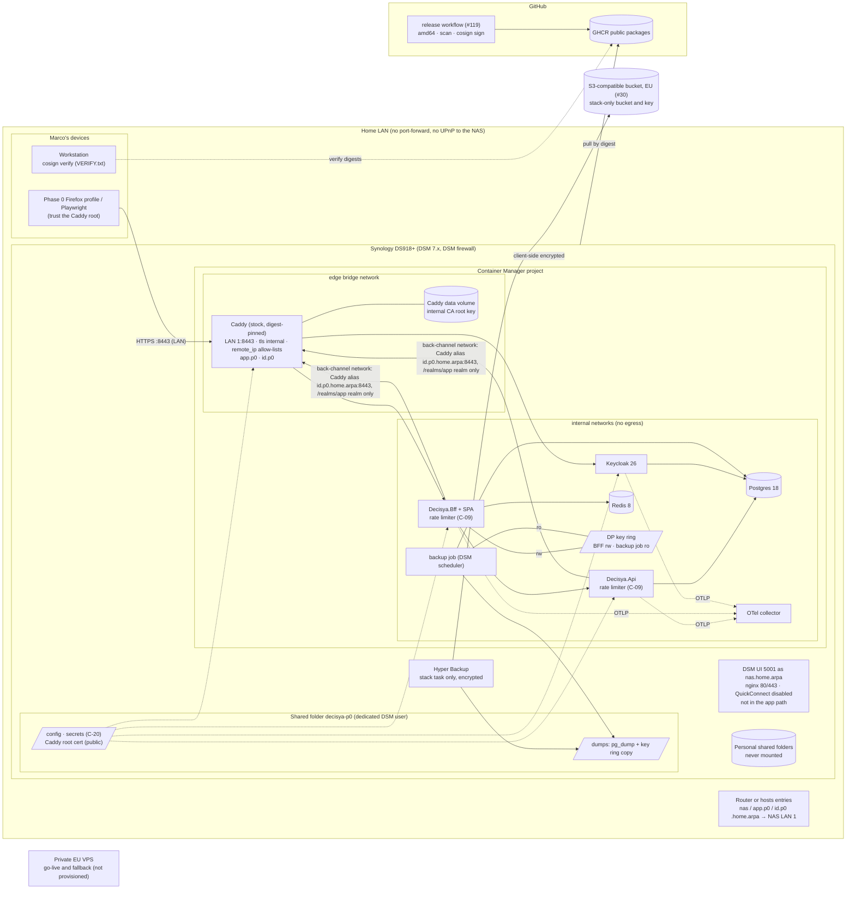

# Architecture note: hosting for Phase 0 on the home NAS, private VPS as fallback (issue #124)

## Context

Issue #124 (0.17-pre) decides where and how Phase 0 is deployed: [ADR-0016](../adr/0016-phase-0-hosting.md), **Accepted** (Marco, 2026-10-05).

Phase 0 runs on Marco's home NAS (Synology DS918+, Celeron J3455, x86-64-v2, 4 cores, 8 GB RAM, DSM 7.x with Container Manager), next to his personal files and backups. The private EU VPS from the first draft is (a) the go-live target per [ADR-0001](../adr/0001-multi-tenant-single-instance.md) and (b) the Phase 0 fallback (triggers F1 to F6 in the ADR). Synthetic users only.

No product module, `*.Contracts` type, Wolverine message, endpoint or schema changes. What #124 fixes is the **deployment trust boundary**: which networks reach the box, what a container may see on a box shared with personal data, which third parties sit in the path, where TLS terminates and who trusts its root, and where data leaves the box. That is why this note is not N/A.

Applicable ADRs: 0001 (production ladder), 0003 (key ring consequence), 0007 (S3-compatible storage, restore drill), 0014 (pin by digest), 0015 (image scan), 0017 (release images, keyless cosign). Release blockers from `docs/security/threat-models/system-baseline.md` to close first: C-01, C-03, C-05, C-09, C-10, C-20 (and C-04, C-06, C-11 before any non-dev deployment).

## C4 excerpt (deployment)

## Boundaries and contracts

- **No product boundary changes.** No module, no Contracts type, no message, no endpoint.
- **Deployment boundaries:**
  - **Network:** nothing in the stack is reachable from the internet. No port-forward, no UPnP, no VPN, QuickConnect disabled (R9.13). Caddy publishes only `<LAN 1 address>:8443`. `remote_ip` allow-lists: the LAN subnet on both site blocks; the back-channel subnet only on `id.p0` and only for `/realms/<app realm>/*`; `/admin/*` and `/realms/master/*` only from Marco's workstation; Keycloak's port 9000 never routed (ADR-0016 R9.8). Every other service is on `internal: true` networks; the back-channel network (fixed subnet) holds only Caddy, BFF, Api and Keycloak.
  - **Box sharing:** containers see only the dedicated shared folder and named volumes; never the Docker socket, a personal folder, a `/volume*` root or a DSM path. `decisya-p0` is readable only by the stack user and administrators; 2FA on every DSM account. The other project that uses the NAS as a backup target keeps its own folders, accounts and backup tasks. Full MUST list: ADR-0016 R9.
  - **TLS and trust:** Caddy is the only TLS terminator, using its internal CA for the `.home.arpa` names. The root's private key stays in Caddy's data volume (mounted by Caddy only, not backed up). The public root is trusted only by a dedicated Phase 0 Firefox profile and Playwright's browsers (OS store only where nothing else works, recorded in #120; no enterprise-roots) and, read-only mounted, by the BFF and Api. It is removed and regenerated at the Phase 0 exit, on the move to the VPS and on suspected compromise. Certificate validation is never disabled.
  - **Third parties in the path:** GitHub (images, signatures) and the backup provider (one bucket-scoped key, #30). No DNS provider, no ACME CA, no VPN coordinator, no DSM relay.
  - **No inbound credential from CI.** Marco deploys from the LAN.
  - **Data leaving the NAS:** encrypted Hyper Backup archives of `dumps`, image pulls, and telemetry only if #120 sends it off-box.

## Decisions

Recorded from Marco's choices (2026-10-04 and 2026-10-05); the ADR holds the options and rejection reasons.

| # | Decision |
| --- | --- |
| D0 Host | Phase 0 on the DS918+. The drafted private VPS (WireGuard on the VPS, provider firewall, SSH on `wg0`, 4 vCPU / 8 GB / 80 GB) is the go-live target and the fallback (F1 to F6). |
| D1 CPU | x86-64, `linux/amd64` images only. J3455 is x86-64-v2 (no AVX/AVX2): UBI 10 / RHEL 10 bases are excluded (F6). |
| D2 Access | LAN only. No VPN, no port-forward, no UPnP. Later remote access: router WireGuard first, then a mesh VPN with an ACL to port 8443 only. |
| D3 Names | `nas.home.arpa` (DSM), `app.p0.home.arpa` and `id.p0.home.arpa` (Decisya), all to the NAS's LAN 1 address. Router host override if supported, else hosts entries; #120 records which and checks Firefox (with DoH) and Playwright. Inside Compose, Caddy carries the network alias `id.p0.home.arpa` only on the dedicated back-channel network (Caddy, BFF, Api, Keycloak; fixed subnet). |
| D4 TLS | Caddy's internal CA (`tls internal`): `.home.arpa` (RFC 8375) cannot get publicly trusted certificates. No domain, no DNS token, no ACME. Trust: a dedicated Phase 0 Firefox profile, Playwright's browsers (OS store only where nothing else works, recorded in #120; no enterprise-roots) and the BFF and Api containers. Root removed everywhere and regenerated at the Phase 0 exit, on the move to the VPS and on suspected compromise; a name-constrained CA is a SHOULD for #120. Public domain with DNS-01 or HTTP-01 comes with the go-live VPS. |
| D5 Caddy | Stock image, pinned by digest; #120 adds Caddy and the OTel collector to the ADR-0015 scan targets. No xcaddy build, no DNS module, no `caddy-ratelimit` in Phase 0 (the custom build is kept only for the go-live VPS if a DNS module is needed there). `https_port 8443` on a bridge network, published as `<LAN 1 address>:8443:8443`, no HTTP listener; `remote_ip` allow-lists (ADR-0016 R9.8), `request_body max_size` and server timeouts on both site blocks. |
| D6 Size | About 3.5 GB of hard limits (table below); DSM keeps at least 4 GB. |
| D7 Images | Public GHCR, pulled by digest; `cosign verify` with the `VERIFY.txt` commands of each release (#119, `v0.1.0` on 2026-10-04) on Marco's workstation. No pull token and no cosign on the NAS. |
| D8 Backup | Nightly dumps plus key ring copy, Hyper Backup client-side encrypted to an EU S3-compatible bucket; bucket provider chosen in #30. Caddy's data volume is not backed up (a lost root is re-issued and re-trusted). |
| D9 VPS provider | Picked when a fallback trigger fires or at go-live: GDPR Article 28 agreement, EU data centre with snapshots, provider firewall, hardware-key 2FA, scoped API tokens, amd64 plans at the VPS size, IPv4. Different provider from the bucket. Verify current prices then. |
| D10 Isolation | ADR-0016 R9 in full. QuickConnect disabled (Marco, 2026-10-05; R9.13). 2FA on every DSM account; `decisya-p0` readable only by the stack user and administrators; the other project that uses the NAS as a backup target kept separate (R9.14). SSH for `mpcs_nas`: key only, LAN only through the DSM firewall, off when not in use; password login re-checked as refused after every DSM update. |
| D11 Fallback | F1 Keycloak ready > 180 s; F2 login p95 > 3 s; F3 `/api/capabilities` p95 > 500 ms; F4 available memory < 1 GB sustained 5 min, swap in use more than 256 MB above the at-rest swap recorded at the start of each run (1844 MB on 2026-10-04, for context), or any OOM kill; F5 end of DS918+ security updates; F6 image or R9 incompatibility. Measured in #120 and #29; crossing one switches to the VPS without a new ADR. |

Starting memory limits for #120 (replaced by its measurement):

| Component | `mem_limit` | `cpus` | Note |
| --- | --- | --- | --- |
| Keycloak 26 | 1.25 GB | 2.0 | heap inside the limit; consider `start --optimized` |
| Postgres 18 | 768 MB | 1.0 | `shared_buffers` 128 to 256 MB |
| Redis 8 | 128 MB | 0.5 | `maxmemory` 64 MB; sessions only |
| Api | 384 MB | 1.0 | |
| BFF (with SPA) | 384 MB | 1.0 | |
| Caddy | 128 MB | 0.5 | |
| OTel collector | 256 MB | 0.5 | `memory_limiter` required |
| backup job / migrator | 256 MB | 0.5 | run-once, not concurrent |
| **Total** | **≈ 3.5 GB** | | `cpus` are caps; four cores shared |

Headroom check in #120: DSM's use with the stack stopped (including a Hyper Backup run), the stack's use with `docker stats` at smoke and idle, sum of limits plus DSM's peak under 7 GB, limits shown as enforced (`docker info` warnings recorded).

## Ripple into the downstream issues

| Issue | What it receives from ADR-0016 |
| --- | --- |
| **#119 release images** (done, `v0.1.0`) | No change needed. `linux/amd64` images `api`, `bff` (with the SPA) and `migrator`, scanned and keyless-signed, public on GHCR, with `images.txt` and `VERIFY.txt`. No Caddy release image: Caddy is the stock image. |
| **#120 Compose, Caddy, secrets** | Targets the NAS. **Stock, digest-pinned Caddy with its internal CA**: site blocks `app.p0.home.arpa` and `id.p0.home.arpa`, `https_port 8443`, `tls internal`, published as `<LAN 1 address>:8443:8443`, `remote_ip` allow-lists per ADR-0016 R9.8 (back-channel subnet on `id.p0` for `/realms/<app realm>/*` only; `/admin/*` and `/realms/master/*` from Marco's workstation only; port 9000 never routed; never widened to the bridge subnet), size limits and timeouts; the back-channel network (fixed subnet; Caddy, BFF, Api, Keycloak) carries the only `id.p0.home.arpa` alias. **Scan targets**: add Caddy and the OTel collector to ADR-0015's targets. **Root export and trust distribution**: export the public root from Caddy's data volume into `decisya-p0`, mount it read-only into the BFF and Api, and document the steps for a dedicated Phase 0 Firefox profile and Playwright (no enterprise-roots; OS store only where nothing else works, recorded) with UI and CLI paths side by side; re-trust after any loss of Caddy's data; root removal and regeneration at the Phase 0 exit, on the move to the VPS and on suspected compromise; name-constrained CA as a SHOULD. **DSM checks**: QuickConnect unticked (*Control Panel → External Access → QuickConnect*), 2FA on every DSM account, `decisya-p0` permissions, the other project's separation and firewall rule, password SSH refused after every DSM update. R9 MUSTs with guard tests; C-20 secret files as Compose `secrets:` (DB and Keycloak-admin passwords, client secret; no DNS token); every image starts on the J3455; DS918+ support end date, DSM and Container Manager versions recorded; name resolution method recorded; D6 headroom check and the first F1 to F4 measurement (F4 from the at-rest swap recorded at the start of the run) in Done-when. Deploy runbook: `cosign verify` from `VERIFY.txt` on the workstation, then Container Manager > Project > Update, or `ssh` (key, LAN, enabled for the session) and `sudo docker compose pull && sudo docker compose up -d`. The VPS hardening moves to the go-live runbook; the Azure Container Apps review trigger stays here. |
| **#121 Keycloak hostname** | `KC_HOSTNAME=https://id.p0.home.arpa:8443`; realm redirect URIs and web origins on `https://app.p0.home.arpa:8443`; `KC_PROXY_HEADERS=xforwarded` from Caddy only, Keycloak not published. **Back-channel trust**: the BFF (OIDC discovery, token endpoint) and the Api (JWKS, issuer validation) reach `https://id.p0.home.arpa:8443` through Caddy's alias on the back-channel network, so the issuer is identical on front and back channel, and they validate Caddy's certificate against the mounted root; no disabled validation, no `KC_HOSTNAME_BACKCHANNEL_DYNAMIC` needed. Admin console not on the app-facing path (C-03): `/admin/*` and `/realms/master/*` from Marco's workstation only, unrouted if source addresses are not kept; management port 9000 never routed. Healthcheck `start_period` sized to the measured F1. Names and port are variables, so the VPS changes configuration only. |
| **#122 rate limiting, key ring backup** | **C-09 in the BFF and the Api** (ASP.NET Core rate limiter, partition by session, else client IP; 429 ProblemDetails); **no Caddy rate-limit module**. Client IP from Caddy's `X-Forwarded-For`, trusted from Caddy's address only; #120 confirms Docker publishing preserves LAN source addresses (else partition by session only). Key ring (C-05) on a named volume mounted read-write into the BFF and read-only into the backup job, in no other service; non-root, mode 0700; copied into `dumps` by the backup job; never with Redis. |
| **#29 deployment** | Done-when: "a tagged build deploys to the private NAS from a clean clone", images verified with the release's `VERIFY.txt`. Re-measure F1 to F4 at the phase-exit rehearsal (F4 from the at-rest swap at the start of the run) and record any switch to the VPS. At the Phase 0 exit, remove the Caddy root from every store and regenerate it. The VPS hardening runbook moves to go-live. |
| **#30 backup** | **Chooses the EU S3-compatible bucket provider** (Hyper Backup custom S3 server, per-bucket keys, versioning or object lock, GDPR Article 28; verify current prices). Nightly dumps of every Postgres database plus a key ring copy into `decisya-p0/dumps`; a stack-only Hyper Backup task, client-side encrypted; password and key file off the NAS; Redis, Postgres data directory and Caddy's data volume excluded. Restore drill (ADR-0007): restore the archive on another machine into a local Compose stack and prove a synthetic user signs in with the restored key ring. On the VPS later, restic or an equivalent. |

## NetArchTest rules to add

None. No assembly or module boundary changes. The deployment boundaries are enforced by checks in the downstream issues:

| Rule | Enforced by | Issue |
| --- | --- | --- |
| Every image in the deploy Compose file is pinned by digest; the Api, BFF and migrator images are the signed release images | guard test over the Compose file; `cosign verify` from `VERIFY.txt` | #120, #119 |
| Every third-party digest in the deploy Compose file (Caddy and the OTel collector included) is an ADR-0015 scan target | parity guard test over the Compose file and the scan targets | #120 |
| No service mounts the Docker socket, a path outside the dedicated shared folder, or a DSM path; only Caddy mounts Caddy's data volume | guard test over the Compose file | #120 |
| The key ring volume is mounted read-write in the BFF, read-only in the backup job, and in no other service | guard test over the Compose file | #120, #122 |
| No service is `privileged`, adds capabilities or devices, or uses the host network or PID namespace; every service sets `no-new-privileges` | guard test over the Compose file | #120 |
| Only Caddy publishes a port, as `<LAN 1 address>:8443:8443`; every other service is on `internal: true` networks only | guard test over the Compose file | #120 |
| The back-channel network has a fixed subnet and exactly Caddy, BFF, Api and Keycloak as members; the `id.p0.home.arpa` alias exists only there. *Amended 2026-10-05 (#120, B-6):* back channel = Caddy, BFF, Api only; Caddy and Keycloak on their own `internal: true` network; see `deployable-stack.md` | guard test over the Compose file | #120 |
| Every service has `mem_limit`, `cpus` and `pids_limit`, and rotated logs | guard test over the Compose file | #120 |
| Every Caddy site block carries a `remote_ip` allow-list and `tls internal` (Phase 0); the back-channel subnet is admitted only on `id.p0` for `/realms/<app realm>/*`; `/admin/*` and `/realms/master/*` only from Marco's workstation address (or unrouted); no route to Keycloak port 9000; no allow-list contains the bridge subnet | guard test over the Caddyfile | #120 |
| No production code disables TLS certificate validation (`DangerousAcceptAnyServerCertificateValidator`, a `ServerCertificateCustomValidationCallback` returning true, `RequireHttpsMetadata = false` outside Development) | architecture/source test | #121 |
| Rate limiter registered on every BFF and Api route class | integration tests per route class | #122 |
| Key ring restorable from the off-site backup | restore drill | #30 |

## Notes for G3

- QuickConnect disabled (Marco, 2026-10-05; R9.13); DSM control still equals stack control, so R9.2, R9.9 and R9.14 bound DSM accounts.
- Caddy internal CA: the root key on the NAS can sign for any name in every browser that trusts it. Trust is limited to a dedicated Firefox profile and Playwright and regenerated at the Phase 0 exit; only Caddy mounts its data volume.
- Shared box: review R9, in particular socket and mount rules, capabilities, internal networks and container-to-DSM reachability.
- DSM firewall vs Docker-published ports: the 8443 boundary rests on the LAN and Caddy's `remote_ip` allow-list.
- C-09 is met in-app with no edge limiter on a LAN-only box.
- SSH for `mpcs_nas`: key only, LAN only, off when unused.

<!-- gate: G2 | verdict: PASS | issue: #124 -->
