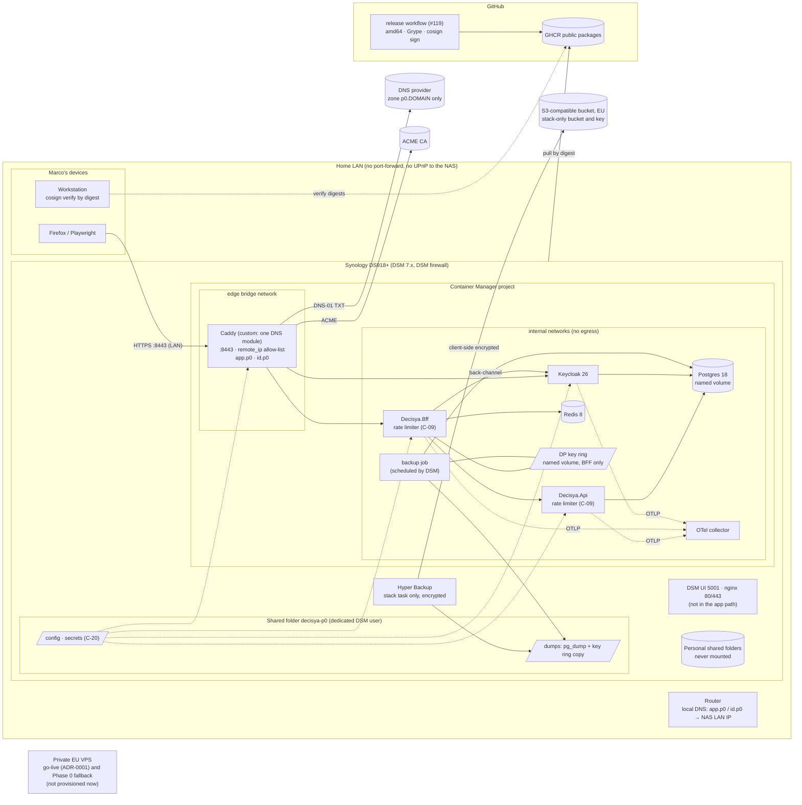

# Architecture note: hosting for Phase 0 on the home NAS, private VPS as fallback (issue #124)

## Context

Issue #124 (0.17-pre) decides where and how Phase 0 is deployed. The draft is [ADR-0016](../adr/0016-phase-0-hosting.md) (Proposed).

**Revision 2026-10-04:** Marco decided that Phase 0 runs on his home NAS (Synology DS918+, Celeron J3455, 4 cores, 8 GB RAM, DSM 7.x with Container Manager). The NAS also holds his personal files and probably his backups. The private EU VPS from the first draft becomes (a) the go-live target per [ADR-0001](../adr/0001-multi-tenant-single-instance.md) and (b) the Phase 0 fallback if the NAS is too slow (fallback triggers F1 to F6 in the ADR). Synthetic users only.

No product module, `*.Contracts` type, Wolverine message, endpoint or schema changes. What #124 fixes is the **deployment trust boundary**: which networks reach the box, what a container may see on a box shared with personal data, which third parties hold credentials in the path, where TLS terminates, and where data leaves the box. That is why this note is not N/A. It is BLOCK only because some rows are still Marco's to choose.

Applicable ADRs: 0001 (production ladder), 0003 (key ring consequence), 0007 (S3-compatible storage, backup and restore drill), 0014 (pin by SHA or digest), 0015 (image scan). Release blockers from `docs/security/threat-models/system-baseline.md` that this deployment must close first: C-01, C-03, C-05, C-09, C-10, C-20 (and C-04, C-06, C-11 before any non-dev deployment).

## C4 excerpt (deployment, recommended set)

## Boundaries and contracts

- **No product boundary changes.** No module, no Contracts type, no message, no endpoint.
- **Deployment boundaries introduced (recommended set):**
  - **Network:** nothing on the NAS is reachable from the internet. No router port-forward, no UPnP, QuickConnect off (open row). Caddy publishes only 8443, allow-listed to the LAN subnet by `remote_ip`, because the DSM firewall may not filter Docker-published ports. Every other service sits on `internal: true` networks: no published port, no egress.
  - **Box sharing:** containers see only the dedicated shared folder and named volumes; never the Docker socket, a personal shared folder, a `/volume*` root or a DSM path. No privileged container, no added capability, no host network. The full MUST list is ADR-0016 R9.
  - **TLS:** Caddy is the only TLS terminator for the app. DSM's nginx (80/443) and DSM's UI (5000/5001) are not in the app path.
  - **Third parties in the path:** GitHub (images, signatures), the DNS provider (one zone-scoped token), the ACME CA, the backup provider (one bucket-scoped key). No VPN coordinator (if LAN only).
  - **No inbound credential from CI.** Marco deploys from the LAN. GitHub holds no key or token for the NAS.
  - **Data leaving the NAS:** encrypted Hyper Backup archives of the `dumps` folder, ACME and DNS API calls, image pulls, and telemetry only if #120 sends it off-box.

## Decisions

Each row: options, trade-offs for a solo developer, one recommendation, and the ripple. The ADR holds the rejected-option reasons.

### D0. Phase 0 host (decided)

**Home NAS**, decided by Marco on 2026-10-04. The private EU VPS is the go-live target and the fallback; its first-draft design (WireGuard on the VPS, provider firewall, SSH on `wg0`, 4 vCPU / 8 GB / 80 GB) is kept in the ADR for that use.

### D1. CPU architecture (direction recorded)

x86-64, confirmed by the J3455. #119 builds `linux/amd64` only. Constraint: the J3455 (Goldmont) is x86-64-v2, without AVX or AVX2. All current images in the stack (Debian-based Postgres and Redis, UBI 9-based Keycloak, Go-built Caddy and collector, .NET 10) run on v2. A base image that moves to x86-64-v3 (for example RHEL 10 or UBI 10) will not start: #120 checks each image starts, and this is fallback trigger F6.

### D2. Private access

| Option | For | Against |
| --- | --- | --- |
| **LAN only (Phase 0)** | No new service, account or open port; the LAN is already private | No remote access |
| WireGuard on the home router | No third party; nothing forwarded to the NAS; peers by hand | Depends on the router model; the router opens one UDP port for itself |
| Tailscale Synology package | No inbound port anywhere; easy enrolment | Third-party control plane can add nodes (Tailnet Lock); the whole NAS (DSM, SMB) joins the tailnet unless the ACL allows only port 8443; userspace networking on DSM 7 may hide client addresses from Caddy |
| DSM VPN Server (OpenVPN, L2TP) | Built in | Needs a port-forward to the NAS (forbidden); DSM service on the internet next to personal data |
| WireGuard container | Self-run | Needs `NET_ADMIN` and `/dev/net/tun` (against R9) and a port-forward to the NAS |

**Recommendation: LAN only for Phase 0.** Remote access is not a Phase 0 need and every remote option adds a path into a box that holds personal data. Review trigger: the first real need for remote access; then router WireGuard if the router supports it, else the Tailscale package with Tailnet Lock and an ACL that allows only Marco's devices to `nas:8443`.

### D3. Domain, DNS, certificates and name resolution

DNS-01 with a delegated `p0.<domain>` zone and a zone-scoped token is kept (Marco's direction). Open: the DNS provider (must offer per-zone API tokens limited to DNS edits and a maintained `caddy-dns` module), and how LAN devices resolve the names to the NAS's LAN address:

| Option | For | Against |
| --- | --- | --- |
| **Router local DNS override** | No service on the NAS; all LAN devices resolve | Not every router supports custom host records |
| DSM DNS Server package | Works with any router | One more NAS service; if DHCP hands it out, LAN resolution depends on the NAS |
| Public A records to the private LAN address in the `p0` zone | No local service | Publishes the LAN address; routers with rebind protection drop the answer unless exempted |
| Hosts file on Marco's devices | Nothing to run | Per device; easy to forget |

**Recommendation: router override if the router supports it, hosts file as the fallback.** DSM DNS Server only if neither works, and then only as the resolver for Marco's devices. Firefox with DNS over HTTPS ignores private addresses in DoH answers and falls back to the system resolver, so router overrides and hosts entries still apply; #120 confirms this in Firefox and in Playwright's browsers.

### D4. Caddy build, publishing and the edge rate limit

Build (Marco's direction): custom xcaddy build with exactly the DNS module; no `caddy-ratelimit` in Phase 0. G3/G6 confirm that "LAN boundary + `remote_ip` allow-list + in-app limiter" meets C-09's edge requirement for a private box; if not, the cost is one more `--with` line.

Publishing, since DSM holds 80/443 and 5000/5001:

| Option | For | Against |
| --- | --- | --- |
| **Port 8443 on a bridge network** | Caddy stays the only TLS terminator; no DSM change; works with any later VPN that ends on the router or on DSM; one variable differs from production | `:8443` in every URL, in `KC_HOSTNAME` and in the realm's redirect URIs and web origins |
| macvlan, own LAN address, port 443 | Production-identical URLs | The host cannot reach macvlan children, so a VPN ending on DSM cannot reach Caddy without an unsupported shim; LAN-specific settings in the Compose file |
| DSM reverse proxy in front | Port 443, DSM UI configuration | DSM's nginx terminates TLS: Caddy is no longer the only terminator; DSM certificate handling and forwarded headers enter the trust path |
| Move DSM off 80/443 | Port 443 for Caddy | Unsupported edits to DSM's nginx; updates revert them |

**Recommendation: port 8443 on a bridge network.** Caddyfile: `https_port 8443`, no HTTP listener (DNS-01 needs none), site blocks `app.p0.<domain>` and `id.p0.<domain>` each with a `remote_ip` allow-list (LAN subnet, later the VPN subnet), `request_body max_size`, server timeouts. Compose publishes `8443:8443` only. The cookies are unaffected: `app.p0` and `id.p0` are separate hosts on the same site, as in production.

### D5. Size (fixed hardware, shared with DSM)

The stack gets hard per-container limits; DSM keeps at least 4 GB (its packages, page cache for file serving, Hyper Backup runs). Starting values for #120, to be replaced by the measurement:

| Component | `mem_limit` | `cpus` | Note |
| --- | --- | --- | --- |
| Keycloak 26 | 1.25 GB | 2.0 | Heap by `JAVA_OPTS_KC_HEAP` inside the limit; start-up and hashing are the CPU peaks; consider `start --optimized` |
| Postgres 18 | 768 MB | 1.0 | `shared_buffers` 128 to 256 MB |
| Redis 8 | 128 MB | 0.5 | `maxmemory` 64 MB; sessions only |
| Api | 384 MB | 1.0 | .NET 10 honours the container limit |
| BFF | 384 MB | 1.0 | as Api |
| Caddy | 128 MB | 0.5 | |
| OTel collector | 256 MB | 0.5 | `memory_limiter` processor required |
| backup job | 256 MB | 0.5 | runs nightly only |
| **Total of limits** | **≈ 3.5 GB** | | `cpus` are caps, not reservations; four cores are shared |

**Headroom check in #120** (part of its Done-when): (1) DSM's memory use measured with the stack stopped, over a normal day, including a Hyper Backup run; (2) the stack's use with `docker stats` during a smoke run and at idle; (3) the sum of limits plus DSM's peak stays under 7 GB; (4) `docker stats` shows the limits are enforced (Synology's kernel may not support swap limits; `docker info` warnings are recorded). The F4 thresholds come from the same run.

Disk: images (current and previous release) and named volumes live in Container Manager's data root on the volume; dumps and configuration in the dedicated shared folder. Keep container logs rotated.

For the VPS (fallback and go-live): 4 vCPU, 8 GB RAM, at least 80 GB SSD, as in the first draft.

### D6. Image pulls (direction recorded)

Public GHCR packages, pinned by digest, no pull token on the NAS. `cosign verify` runs on Marco's workstation against the release workflow's identity, for the exact digests written into the Compose file, before the deploy. The NAS pulls by digest, so it runs exactly what was verified and needs no cosign binary.

### D7. Backup (direction recorded; bucket provider open)

- A backup job (same digest-pinned Postgres image, run by DSM Task Scheduler with `docker compose run --rm`) writes nightly `pg_dump` custom-format dumps of every database (the module databases and Keycloak's) and a copy of the Data Protection key ring into `decisya-p0/dumps`. Local retention: a few days.
- A Hyper Backup task for the stack only: source `decisya-p0/dumps` only; destination an S3-compatible bucket at an EU provider; client-side encryption on; its own bucket and bucket-scoped access key; Hyper Backup's own version rotation.
- The encryption password and Hyper Backup's key file are kept off the NAS (an offline copy). Without them the archive cannot be restored.
- Bucket versioning where offered; the access key cannot delete old versions where the provider allows that. #30 confirms Hyper Backup works with those settings.
- Never in this task: Redis, the Postgres data directory, Caddy's certificate storage, any personal folder. Never in personal tasks: the stack's folder.
- Optional second layer: DSM Snapshot Replication of `decisya-p0` (same box; fast rollback only).

Bucket provider checklist: EU region, S3 API that Hyper Backup accepts as a custom S3 server, per-bucket keys, versioning or object lock, GDPR Article 28 agreement. Verify current prices.

### D8. Provider and region (VPS and bucket; not needed now)

Applies to the go-live VPS and the Phase 0 fallback. Marco picks it when a fallback trigger fires or at go-live, with this checklist (verify current prices and terms then): GDPR Article 28 agreement for an individual customer; EU data centre with snapshots; provider-level firewall; hardware-key 2FA; scoped API tokens; amd64 plans at the VPS size; IPv4 included. Once the VPS exists, the backup bucket is at a different provider from it.

### D9. NAS isolation (MUST, for #120)

The list is ADR-0016 R9. Summary: dedicated DSM user with no application privileges; dedicated shared folder; no Docker socket mount; no personal or system path mounts; no privileged container, no `cap_add`, no `devices`, no host network or PID namespace, `no-new-privileges` everywhere; only Caddy publishes a port; backends on `internal: true` networks; no port-forward or UPnP; DSM firewall rules plus Caddy's `remote_ip` allow-list; no container reaches DSM's ports 5000, 5001, 22; DSM admin hardening (default `admin` off, 2FA, auto-block, SSH off by default); DSM and Container Manager updated; DS918+ support status recorded as fallback trigger F5; per-container limits and log rotation.

One extra row needs Marco: **QuickConnect**. It relays DSM itself to the internet without a port-forward. Whoever controls DSM controls Container Manager and so the stack. Recommendation: off. If Marco relies on it for personal use, G3 records it as an accepted risk instead.

### D10. Fallback triggers

The thresholds F1 to F6 are in the ADR. F1 to F4 are proposals for Marco to confirm or adjust: Keycloak ready > 180 s; login p95 > 3 s; `/api/capabilities` p95 > 500 ms; sustained available memory < 1 GB, swap growth > 256 MB or any OOM kill. Measured in #120 and #29. Crossing one switches Phase 0 to the VPS without a new ADR.

## Ripple into the downstream issues

| Issue | What it receives from ADR-0016 (recommended set) |
| --- | --- |
| **#119 release images** | Unchanged in substance. `linux/amd64` only, default .NET baseline (runs on x86-64-v2). Images `api`, `bff`, the SPA (own image or inside the BFF, per #120) and the **custom Caddy** (xcaddy from digest-pinned `caddy:<v>-builder` and `caddy:<v>`, one DNS module pinned to an exact version). Grype scan of every release image (extend ADR-0015 beyond `ContainerImages.cs`), cosign keyless signing (identity = release workflow on `main`), public GHCR packages, check that no image contains a secret, runbook entry for the manual Caddy module bump. If F1 is close: an optimized Keycloak image (`kc.sh build`) becomes a fourth release image. |
| **#120 Compose, Caddy, secrets** | Targets the NAS. Container Manager project in `decisya-p0`; every image pinned by digest; R9 isolation MUSTs with guard tests; Caddy on 8443 with `remote_ip` allow-lists; backends on `internal: true` networks; C-20 secret files in `decisya-p0/secrets`, mounted as Compose `secrets:` (DNS token, DB and Keycloak-admin passwords, client secret; the backup credentials stay in Hyper Backup); key ring and Postgres data in named volumes. Checks: DSM firewall and reachability from outside the allow-list and from inside a container; each image starts on the J3455; DS918+ support status recorded; DSM and Container Manager versions recorded. D5 headroom check and the first F1 to F4 measurement in Done-when. Deploy runbook: workstation `cosign verify` → DSM UI path (Container Manager > Project > Build/Update) and CLI path (`ssh` on the LAN → `sudo docker compose pull && up -d`), side by side. The VPS hardening (WireGuard, provider firewall, SSH on `wg0`) moves to the go-live runbook. The Azure Container Apps production review trigger stays here. |
| **#121 Keycloak hostname** | `KC_HOSTNAME=https://id.p0.<domain>:8443`; realm redirect URIs and web origins `https://app.p0.<domain>:8443`; proxy headers from Caddy only (`KC_PROXY_HEADERS=xforwarded`, Keycloak not published); back-channel from the BFF over the internal network (decide `KC_HOSTNAME_BACKCHANNEL_DYNAMIC` or route through Caddy); admin console not on the app-facing site block (C-03), reached through a separate, `remote_ip`-restricted path or block; healthcheck `start_period` sized to the measured F1. The port is a variable, so the VPS drops it. |
| **#122 rate limiting, key ring backup** | C-09 in-app as before: ASP.NET Core rate limiter in the BFF (partition by session, else client IP) and the Api, 429 ProblemDetails. Client IP from Caddy's `X-Forwarded-For`, trusted from Caddy's address only; #120 confirms Docker's port publishing preserves LAN source addresses (if not, partition by session only). Key ring (C-05) on a named volume mounted into the BFF only, non-root owner, mode 0700; the backup job copies it into `dumps` (D7); never with Redis. `ProtectKeysWithCertificate` stays #122's call. |
| **#29 deployment** | Done-when becomes "**a tagged build deploys to the private NAS from a clean clone**". The VPS hardening runbook moves to go-live. #29 re-measures F1 to F4 at the phase-exit rehearsal and records any switch to the VPS. |
| **#30 backup** | D7: nightly dumps of every Postgres database plus a key ring copy into `decisya-p0/dumps`; a stack-only Hyper Backup task, encrypted, to an EU S3-compatible bucket with versioning; password and key file off the NAS; Redis excluded. Restore drill (ADR-0007): restore the Hyper Backup archive on another machine (Hyper Backup Explorer or a second DSM) into a local Compose stack on Marco's workstation, and prove a synthetic user signs in with the restored key ring. For the VPS later, restic or an equivalent replaces Hyper Backup. |

## NetArchTest rules to add

None. No assembly or module boundary changes. The deployment boundaries are enforced by checks in the downstream issues:

| Rule | Enforced by | Issue |
| --- | --- | --- |
| Every image in the deploy Compose file is pinned by digest; the Caddy, Api, BFF and SPA images are the signed release images | guard test over the Compose file; `cosign verify` in the deploy runbook | #120, #119 |
| No service mounts the Docker socket, a path outside the dedicated shared folder, or a DSM path | guard test over the Compose file | #120 |
| No service is `privileged`, adds capabilities or devices, or uses the host network or PID namespace; every service sets `no-new-privileges` | guard test over the Compose file | #120 |
| Only Caddy publishes a port (8443); every other service is on `internal: true` networks only | guard test over the Compose file | #120 |
| Every service has `mem_limit`, `cpus` and `pids_limit`, and rotated logs | guard test over the Compose file | #120 |
| Every Caddy site block carries a `remote_ip` allow-list | guard test over the Caddyfile | #120 |
| Release images (including the custom Caddy) are scanned for High/Critical | release workflow's Grype step | #119 |
| Rate limiter registered on every BFF and Api route class | integration tests per route class (C-09 fix) | #122 |
| Key ring restorable from the off-site backup | restore drill | #30 |

## Notes for G3

- Shared box: the stack runs beside personal data on an older DSM kernel. Review R9 as the control set, in particular socket and mount rules, capability rules, internal networks, and container-to-DSM reachability.
- QuickConnect and DSM admin accounts: DSM control equals stack control. Confirm the QuickConnect row and admin hardening.
- DSM firewall vs Docker-published ports: the 8443 boundary rests on the LAN and Caddy's `remote_ip` allow-list; confirm that is acceptable.
- C-09 edge-limit interpretation (D4) for a LAN-only box.
- Third parties: DNS provider (zone-scoped token on the NAS), ACME CA, backup provider (bucket key held by Hyper Backup), GitHub. The Hyper Backup password and key file must be off the NAS.
- No CI credential reaches the NAS; deploys are run by Marco on the LAN.

## Decisions Marco must make

Already set by Marco on 2026-10-04 (object if any is misread): Phase 0 on the NAS, VPS as go-live and fallback; x86-64; DNS-01 with a delegated `p0` zone; custom Caddy with the DNS module only; public GHCR with digest pins and `cosign verify`; Hyper Backup, encrypted, to an off-site EU bucket, Redis excluded; the R9 isolation list.

Still open:

1. **Remote access (D2):** recommend LAN only for Phase 0; when remote access is needed, router WireGuard if the router supports it, else the Tailscale package with Tailnet Lock and an ACL limited to port 8443.
2. **Caddy publishing (D4):** recommend port 8443 on a bridge network (Caddy stays the only TLS terminator; works with any later VPN).
3. **LAN name resolution (D3):** recommend a router DNS override, hosts file as the fallback. Tell me the router model if unsure whether it supports host overrides (and WireGuard, for row 1).
4. **DNS provider (D3):** pick one with per-zone, DNS-only API tokens and a maintained `caddy-dns` module; delegate `p0.<domain>` to it.
5. **Backup bucket provider (D7):** pick an EU S3-compatible provider from the D7 checklist that Hyper Backup accepts as a custom S3 server; verify current prices.
6. **Memory budget (D5):** recommend about 3.5 GB of hard limits for the stack, DSM keeps at least 4 GB, adjusted by #120's measurement.
7. **Fallback thresholds (D10):** confirm or adjust F1 > 180 s, F2 p95 > 3 s, F3 p95 > 500 ms, F4 (available memory < 1 GB sustained, swap growth > 256 MB, any OOM kill).
8. **QuickConnect (D9):** recommend off; if you need it for personal use, G3 records it as an accepted risk.

Not needed now: the VPS provider (D8), picked when a fallback trigger fires or at go-live.

<!-- gate: G2 | verdict: BLOCK | issue: #124 | reason: awaiting Marco's choices on the remaining rows -->
