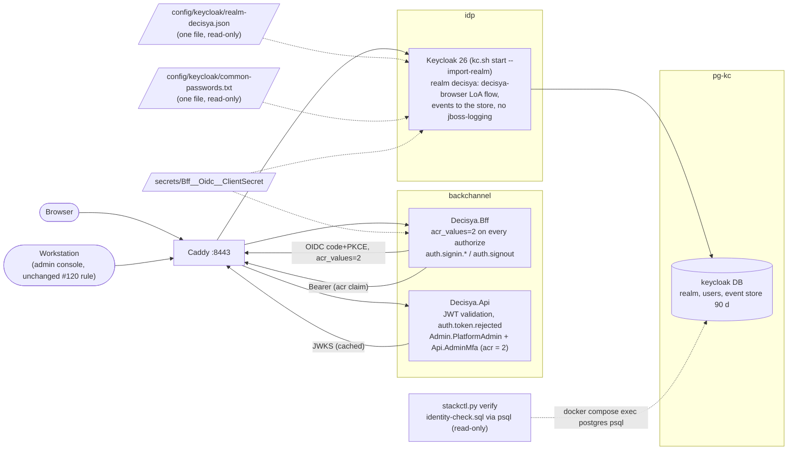

# Architecture note: production identity: production realm, admin MFA, auth event logging (issue #121)

## Context

Issue #121 (0.17c) gives the #120 stack its realm and closes C-03, #25 C-5 and C-10. It also designs C-02 and adds the trip-wire for it.

Requirements: `docs/requirements/phase-0/production-identity.md` (G1 PASS; D1 to D4 and Q1 to Q8 decided by Marco on 2026-10-07). Applicable decisions:
- ADR-0002: Keycloak, one realm, realm file with placeholders;
- ADR-0003: BFF session;
- ADR-0016: Phase 0 hosting, synthetic users only;
- ADR-0018: Compose split, file secrets, transport;
- the #120 note `docs/architecture/deployable-stack.md` (D1 to D10).

No product module, `*.Contracts` type, Wolverine message or endpoint changes. What changes:
- **authorisation on `/api/admin/**`**: a second requirement, the MFA proof;
- **the identity data flow**:
  - the BFF asks for an authentication level;
  - the stack mounts and imports a realm;
  - Keycloak keeps login and admin events in its database;
  - `stackctl.py verify` reads Keycloak's database read-only.

So this note is not N/A.

**No new ADR.** Every decision below falls under one of these:
- ADR-0002, a realm file with placeholders: a second file is an instance of it;
- ADR-0018:
  - stack mounts, guards and file secrets;
  - one more consumer of an existing secret;
- ADR-0016, synthetic users in Phase 0: that is what makes the rebuild migration acceptable.

Review trigger, recorded in the go-live gate (D5): the first non-synthetic user ends the rebuild path (D2). The non-destructive realm migration then needs its own decision, and an ADR if it adds a tool.

## C4 excerpt (containers touched)

## Boundaries and contracts

- **No module or Contracts change.** The Admin module's `Admin.PlatformAdmin` policy is unchanged. The MFA requirement is a second, Api-owned policy on the same route group (D3). So the Admin module, SharedKernel and `ICurrentCaller` do not change.
- **Token contract, BFF to Api:** the access token carries `acr`. The Api accepts the MFA proof only as exactly one `acr` claim, of value type string, ordinal-equal to `"2"`.
- **Authorisation request contract, BFF to Keycloak:** `acr_values=2` on every authorization request (non-essential; no `claims` parameter).
- **Realm contract (the production file):**
  - realm `decisya`;
  - roles `tenant-user` and `platform-admin`;
  - client `decisya-bff` with the same mappers and scopes as the dev realm, including the existing `acr` default client scope;
  - `acr.loa.map` `{"1":1,"2":2}`.
- **Stack contract:**
  - one realm file mounted at `/opt/keycloak/data/import/realm-decisya.json`;
  - one password list file at `/opt/keycloak/data/password-blacklists/common-passwords.txt`;
  - Keycloak also receives the `Bff__Oidc__ClientSecret` secret file;
  - two required environment values `DECISYA_APP_HOST` and `DECISYA_HTTPS_PORT`.
- **Log contract:** five event names, each with a fixed template and a closed field list (D4). They are part of the observability contract (NFR-45 and NFR-46).

## Decisions

### D1. The production realm file

**Path:** `deploy/keycloak/production/realm-decisya.json`.
- The dev AppHost imports one named file (`WithRealmImport` of the dev file), never a directory, so it can never pick this one up.
- The name does not contain the dev needle `decisya-realm.json`, so `RealmGuard` keeps meaning "the dev file".
- A new Python scope guard (D1 guards, item e) allow-lists where the production name may appear, and checks that `src/Decisya.AppHost/**` never names it.

**Content:** a copy of the dev realm with exactly the differences on the parity allow-list below. The values are:
- `sslRequired: "all"`;
- `users` absent, and no `credentials` anywhere;
- `registrationAllowed`, `resetPasswordAllowed` and `rememberMe` false (as in dev);
- `accessTokenLifespan` 300 (as in dev);
- the MFA flow (D3);
- the password policy (D5);
- the events (D4);
- the `synthetic` attribute in the declarative user profile (D5). It is admin-only for view and edit, with validation `^true$`. Without it, the declarative profile drops an unmanaged attribute.

**How the file reaches the stack (F-77-2: one file, never the directory):**
- `stackctl.py` `ASSEMBLE_MAP` gains:
  - `deploy/keycloak/production/realm-decisya.json` → `config/keycloak/realm-decisya.json`;
  - `deploy/keycloak/production/common-passwords.txt` → `config/keycloak/common-passwords.txt`.
- The overlay adds two read-only long-syntax binds to `keycloak`:
  - `./config/keycloak/realm-decisya.json` → `/opt/keycloak/data/import/realm-decisya.json`;
  - `./config/keycloak/common-passwords.txt` → `/opt/keycloak/data/password-blacklists/common-passwords.txt`.

**Guard changes (`deploy/compose/stackguards.py`):**
- (a) `BIND_MOUNTS["keycloak"]` holds exactly the wrapper and the two files above, each read-only. Any other source or target is already "bind mount of an unlisted path". That is how the dev file, the `deploy/keycloak` directory and a directory target are refused.
- (b) `_keycloak_problems` **replaces** the #120 rule "no realm file or import folder may be mounted" with "exactly one mount targets the import directory, and it is the file above". Add the explicit refusal of a target equal to the import directory itself, with or without a trailing `/`, and of a `type: volume` there. The rule is replaced, not removed (Story 2).
- (c) `--import-realm`, `start-dev`, `import`, `export` and `build` stay banned in `entrypoint` and `command`. `command` stays empty.
- (d) `SECRET_CONSUMERS["keycloak"]` gains `Bff__Oidc__ClientSecret`.
- (e) The Keycloak environment carries `DECISYA_APP_HOST: "${DECISYA_APP_HOST:?}"` and `DECISYA_HTTPS_PORT: "${DECISYA_HTTPS_PORT:?}"`. This is the same deliberate overlay exception as Caddy's five values. The guard asserts both are required references.
- (f) `inspect_problems` (`verify`) checks the Keycloak container's bind destinations equal the table, so a hand-edited running stack is caught too.
- (g) The Api environment must not carry `Authentication__RequireAdminMfa` at all (D3).
- (h) New `deploy/tests/test_production_realm_scope.py`: the production realm file name appears only in:
  - `deploy/compose/stackctl.py`;
  - `deploy/compose/stackguards.py`;
  - `deploy/compose/docker-compose.stack.yaml`;
  - `deploy/tests/**`;
  - `tests/**`;
  - `docs/**`;
  - Markdown.

**`RealmGuard` (C#, #77) needs one new exemption.** The overlay and `stackguards.py` must name the container import directory, which is one of the two needles. Add one **conditional** rule:
- it covers exactly `deploy/compose/docker-compose.stack.yaml` and `deploy/compose/stackguards.py` (exact paths);
- it applies only while the file does not contain `decisya-realm.json`.

What changes with it:
- the pinned description list;
- the "sole reason" meta-test;
- new rows in `realm-guard-cases.json`;
- `PinnedExemptionRuleDescription`.

The wrapper does **not** name the directory: realm presence is checked by `verify` (D5). The test files take the constant from `stackguards.py`. Per G4-77-09, a widened exemption is a G6 BLOCK unless G3 amends `docs/security/threat-models/realm-guard-scope.md`. **G3 must record that amendment.**

**Placeholders.** Keycloak's import syntax is `${VAR}`, with `${VAR:default}` for a default. **`${VAR:?}` would therefore mean "default `?`" to Keycloak, not "required".** The production realm uses plain `${NAME}` only, and "required" is enforced in three places:
1. Compose: `${…:?}` on the Keycloak environment entries (guard e above).
2. `entrypoint-stack.sh`, before `exec`:
   - each required variable is set and non-empty;
   - each matches the `stackguards.value_problem` rule (lowercase DNS name; port `8443`);
   - the secret file is readable, non-empty and `[A-Za-z0-9]{32,}`.

   Messages name the variable only. The wrapper then exports the derived values below.
3. A static test (identity-dev, `tests/Decisya.Identity.Tests`):
   - every `${…}` in the production file is one of the names below, with no `:`;
   - the wrapper's required list equals that set;
   - every string holds at most one placeholder.

| Placeholder in the realm | Set by | Used in |
| --- | --- | --- |
| `${DECISYA_REALM_APP_ORIGIN}` | wrapper: `https://$DECISYA_APP_HOST:$DECISYA_HTTPS_PORT` after validation | `redirectUris` (`…/signin-oidc`), `post.logout.redirect.uris` (`…/signout-callback-oidc`), `backchannel.logout.url` (`…/bff/backchannel-logout`) |
| `${DECISYA_BFF_CLIENT_SECRET}` | wrapper: read from `/run/secrets/Bff__Oidc__ClientSecret` (same name as the dev realm) | client `secret` |

- `webOrigins` stays `[]`, as in dev: the BFF pattern needs no CORS.
- `KC_HOSTNAME` stays in the environment (#120), not in the realm.
- One placeholder per string avoids depending on how Keycloak replaces several placeholders in one string.

**Parity test** (`tests/Decisya.Identity.Tests/ProductionRealmParityTests.cs`, unit):
- deep-compares the dev and production files by JSON path;
- fails on any difference whose path is not on this named list (`ParityAllowList`, pinned by a meta-test like `RealmGuard`'s).

| # | Allowed difference | JSON paths |
| --- | --- | --- |
| P1 | users | `users` |
| P2 | TLS | `sslRequired` |
| P3 | hostname-derived URIs | `clients[decisya-bff].redirectUris`, `…attributes["post.logout.redirect.uris"]`, `…attributes["backchannel.logout.url"]` |
| P4 | MFA | `browserFlow`, `authenticationFlows`, `authenticatorConfig`, `requiredActions`, `attributes["acr.loa.map"]` |
| P5 | password policy | `passwordPolicy` |
| P6 | events | `eventsEnabled`, `eventsExpiration`, `eventsListeners`, `enabledEventTypes`, `adminEventsEnabled`, `adminEventsDetailsEnabled`, `attributes["adminEventsExpiration"]` |
| P7 | user profile | the `synthetic` entry inside `components…UserProfileProvider…kc.user.profile.config` (compared after parsing the embedded JSON; every other profile attribute equal) |
| P8 | secret placeholders | none today (both use `${DECISYA_BFF_CLIENT_SECRET}`); kept as a named, empty slot so a future placeholder difference needs a reviewed list change |

Clients are matched by `clientId`, not by array index.

The no-dev-data check (Story 1) is a unit test over the production file:
- no `users`, no `credentials`, no `"type": "password"` or `"otp"`, no `hashedSaltedValue` or `secretData`;
- no `dev-` username and no `.test` address anywhere.

It reports the JSON path, never the value. A Python twin in `deploy/tests` runs it in the `deploy-guards` job.

### D2. Realm migration strategy

Keycloak's `--import-realm` skips a realm that already exists. Restarts are therefore safe and never overwrite later edits (Story 2, last scenario).

| Situation | Path | Who |
| --- | --- | --- |
| First start of a stack | `--import-realm` from the mounted file | the wrapper (fixed argument) |
| Restart, same or changed file | no effect on the existing realm | — |
| **Phase 0 change, small** (one setting, one flow step, one mapper) | The PR changes the production file **and** adds a dated entry under "Realm changes" in `docs/runbooks/deployable-stack.md`. The entry gives the admin-console path and the `kcadm.sh` equivalent (run with `docker compose exec keycloak`), side by side. `verify` (D5) then proves the security-relevant settings match. | the issue's implementer writes the entry; Marco applies it |
| **Phase 0 change, large** (flows, profile) or any doubt | **Rebuild:** `stackctl.py secrets rotate keycloak_bootstrap`, stop Keycloak, drop and recreate the `keycloak` database as superuser (new `stackctl.py realm rebuild --confirm`, which never prints a value), start. This gives a fresh import. Then recreate the permanent admin with TOTP, retire the bootstrap secret and re-provision the synthetic users (D5). Allowed only because ADR-0016 keeps Phase 0 synthetic. | devops (command), Marco (run) |
| **After the first non-synthetic user** | Rebuild is forbidden (`realm rebuild` refuses when the identity check counts a non-synthetic user). A non-destructive, versioned migration (for example keycloak-config-cli, a new third-party tool) is decided at the go-live gate with G3. | go-live gate item C-03b |

### D3. Admin MFA

**Realm side (production file):**
- **Browser flow `decisya-browser`**, bound as `browserFlow`:
  - Cookie — ALTERNATIVE
  - `decisya-forms` — ALTERNATIVE
    - `level-1` — CONDITIONAL: *Condition - Level of Authentication* (level 1, max age 36000), then *Username Password Form* (REQUIRED)
    - `level-2-admin` — CONDITIONAL: *Condition - Level of Authentication* (level 2, max age 1800) **and** *Condition - User Role* `platform-admin`, then *OTP Form* (REQUIRED)
    - `level-2-tenant` — **DISABLED in Phase 0** (the C-02 switch): *Condition - Level of Authentication* (level 2, max age 1800) **and** *Condition - User Role* `tenant-user`, then *OTP Form* (REQUIRED)
- Realm attribute `acr.loa.map` = `{"1":1,"2":2}`. `CONFIGURE_TOTP` is enabled as a required action. The OTP policy is unchanged from dev (TOTP, 6 digits, 30 s).
- **How this behaves:**
  - An admin always passes `level-2-admin`. A missing OTP credential makes *OTP Form* (REQUIRED) force `CONFIGURE_TOTP` before any code is issued (Story 4). The token gets `acr` `"2"`.
  - A tenant user skips both level-2 sub-flows, because the role condition is false, so the token gets `acr` `"1"` (non-essential request). A sub-flow skipped by its condition never raises the level, so a tenant user can never get `"2"` without an OTP.
  - Wrong OTPs count toward brute-force protection (realm setting unchanged).
- **Turning the C-02 tenant switch on:** set `level-2-tenant` to CONDITIONAL. That is one admin-console step or one `kcadm.sh update` command, documented in the go-live gate.

**BFF side** (`OidcOptionsSetup`):
- `OnRedirectToIdentityProvider` sets `ProtocolMessage.AcrValues = "2"` on every sign-in challenge.
- The value is a constant, not configuration: the dev realm has no level-of-authentication conditions and completes at its only level. The G4 spike confirms the dev Playwright login still passes.
- `acr_values` was chosen over `claims` because it is the parameter Keycloak's step-up documents and needs no JSON on the URL.
- Not essential: an essential request would fail tenant users' sign-in.

**Api side** (identity-dev, `src/Decisya.Api/Authentication/**`; the Admin module is untouched):
- **Parsing.** `CallerIdentity` gains `HasMfaLevel`. It is true only when the validated principal has exactly one claim of type `acr`, `ValueType` string, ordinal-equal to `"2"`. Duplicated, non-string or other values give false. This stays the one claim parser. `RequestCaller` carries the fact; `ICurrentCaller` is not changed.
- **Policy** `Api.AdminMfa`:
  - `AdminMfaRequirement` and `AdminMfaAuthorizationHandler`, registered by `AddApiAuthentication`;
  - exposed as `RouteGroupBuilder RequireAdminMfa(this RouteGroupBuilder)`;
  - `Program.cs` calls `app.MapAdminEndpoints().SkipTenantMembership().RequireAdminMfa();`, next to the G4-25-02 coupling;
  - ASP.NET Core combines both policies: both must succeed.
- **Handler behaviour:**
  - It succeeds when `!RequireAdminMfa`, or when `IsPlatformAdmin && HasMfaLevel`.
  - When the caller is a platform admin without the level, it fails and logs `auth.admin.mfa_required` once.
  - When the caller is not a platform admin, it fails silently: the Admin handler already logs `AccessRefused`, and G1 wants no MFA event then.
  - The 403 body comes from the existing `ProblemDetailsAuthorizationResultHandler` (generic, no `code`).
  - Authorisation runs before the endpoint and the group skips the membership gate, so there are zero database commands and zero audit records.
  - No network call: the claim comes from the already validated token.
- **Setting `Authentication:RequireAdminMfa`:**
  - bound bool, default **true**;
  - `ValidateOnStart` with an environment validator, in the style of `ApiJwtOptionsEnvironmentValidator`: false outside `Development` fails start-up, naming the key and never the value;
  - a value that does not bind as a bool also fails start-up.
  - The dev AppHost (run mode only) sets `Authentication__RequireAdminMfa=false` for the Api, because `dev-admin` has no OTP and the dev realm is unchanged (G1 D4).
  - The publish model never sets it (guard g).
- **Coupling test (instead of a NetArchTest rule):** an Api test enumerates every `RouteEndpoint` whose pattern starts with `/api/admin`. Each must carry both `Admin.PlatformAdmin` and `Api.AdminMfa`.

### D4. Events

**Keycloak (realm file):**

| Setting | Value |
| --- | --- |
| `eventsEnabled` | `true` (this *is* the store: Keycloak's JPA event store is not an entry in `eventsListeners`) |
| `eventsListeners` | `[]` (no `jboss-logging`, Q5). G1's "contains the store" maps to `eventsEnabled` and `adminEventsEnabled`. |
| `enabledEventTypes` | the twelve from G1 D3 |
| `eventsExpiration` | `7776000` |
| `adminEventsEnabled` / `adminEventsDetailsEnabled` | `true` / `false` |
| `attributes.adminEventsExpiration` | `"7776000"` |

- If the pinned Keycloak no longer emits `UPDATE_TOTP` or `REMOVE_TOTP` (deprecated in favour of `UPDATE_CREDENTIAL` and `REMOVE_CREDENTIAL`), G4 replaces them one for one. G4 records the mapping in the manifest, and the configuration test pins the result. Any other type is out.
- Keycloak stores the attempted username in `LOGIN_ERROR` details. A password typed into the username field therefore lands in the event store, which only the workstation admin can read. This is a residual risk for G3.

**Decisya events** (source-generated `[LoggerMessage]`, fixed `EventName`, no exception parameter, no free text):

| Event | Level | Emitted in | Fields besides `trace_id`, `span_id` |
| --- | --- | --- | --- |
| `auth.signin.succeeded` | Information | BFF, after the session ticket is stored. This is the cookie scheme's `OnSignedIn` for an OIDC sign-in, so exactly one event per sign-in and none when the store fails. | `tenant_id` (when present), hashed `user_id` |
| `auth.signin.failed` | Warning | BFF: OIDC `OnAccessDenied` (`access_denied`), `OnRemoteFailure` (classified by exception type: correlation or state gives `state_invalid`, token endpoint gives `token_exchange_failed`, `HttpRequestException` or timeout gives `remote_failure`), a ticket-store failure during sign-in (`ticket_store_unavailable`), anything else `other`. The handler calls `HandleResponse` and returns the existing generic failure. | `reason` (closed list) |
| `auth.signout` | Information | BFF: `POST /bff/logout` (`initiator=user`), and `POST /bff/backchannel-logout` after a valid logout token removed a session (`initiator=backchannel`) | `initiator`, hashed `user_id` |
| `auth.token.rejected` | Warning | Api: `JwtBearerEvents.OnAuthenticationFailed` in `JwtBearerOptionsSetup`. It never fires for a missing token. | `reason` (closed list) |
| `auth.admin.mfa_required` | Warning | Api: `AdminMfaAuthorizationHandler` (D3) | hashed `user_id` |

Token rejection reason mapping, by exception type only (never `Message`):

| Exception | Reason |
| --- | --- |
| `SecurityTokenExpiredException` | `expired` |
| `SecurityTokenInvalidSignatureException`, `SecurityTokenSignatureKeyNotFoundException` | `bad_signature` |
| `SecurityTokenInvalidIssuerException` | `bad_issuer` |
| `SecurityTokenInvalidAudienceException` | `bad_audience` |
| `SecurityTokenInvalidAlgorithmException` | `bad_algorithm` |
| `SecurityTokenMalformedException` and `ArgumentException` from parsing | `malformed` |
| anything else | `other` |

- If the pinned handler reports `alg: none` or HS256 as a signature failure, `bad_algorithm` is decided from the token's **unvalidated header `alg`** not being in the allow-list. Only the reason is logged, never the header. The 401 response and `WWW-Authenticate` are untouched (NFR-26).
- **Masking:**
  - The user id never goes in as a message argument. It reaches the record through the existing ServiceDefaults enrichment (`ILogEnrichmentContext`, HMAC with `UserIdHashKey`), the same path every other event uses.
  - In the BFF at sign-in time, `HttpContext.User` is not yet the new principal. G4 sets the enrichment from the signed-in principal's `sub` for that one call, never logging `sub` itself.
  - No `[Sensitive]` value is needed because nothing sensitive is passed. The canary matrix (NFR-45) proves it.
- **Retention outside Keycloak** is C-04 (#29). The runbook says so.

### D5. C-02: gate, `synthetic=true`, the check, password policy

- **Gate file** `docs/runbooks/go-live-gate.md` (devops writes it at G4). It holds one blocking checklist with C-02, C-03 (including C-03b: non-destructive realm migration decided, D2), C-05, C-09, C-10 and C-20. The C-02 line is G1's sentence, word for word. It also records:
  - the two switch-on steps (tenant MFA: D3; breached list: below);
  - the review trigger for G3;
  - that #132 and #29 point to it.

  The pointer lines in the Done-when of #132 and #29 are GitHub issue edits. The orchestrator proposes them at G7 and Marco applies them; a repository test cannot see issues. The static test (`deploy/tests/test_go_live_gate.py`) asserts:
  - the file exists;
  - it names the six controls, `#132` and `#29`;
  - it carries the C-02 sentence.
- **`synthetic=true`:** a user-profile attribute (D1), set by the documented provisioning step for every Phase 0 user in the runbook. That step is the admin console or `kcadm.sh create users … -s attributes.synthetic=true`. The permanent platform admin is synthetic too in Phase 0: Marco's operator account holds no financial data.
- **The check:**
  - Read-only SQL in `deploy/keycloak/production/identity-check.sql`, one statement, output one `key=value` line of counts and booleans only. It never selects a username, email, id or attribute value.
  - Run by **`stackctl.py verify`**, so also at the end of `up`, and therefore by #132's smoke. The command is `docker compose exec -T postgres psql -U postgres -d keycloak -At -v ON_ERROR_STOP=1` with the SQL on stdin, the same access path `secrets rotate --apply-db` already uses.
  - Reported as problems:
    - realm `decisya` missing;
    - `ssl_required` not `ALL`;
    - events or admin events off, admin details on, a `jboss-logging` listener present, or expiration not 7776000;
    - `browser_flow` not `decisya-browser`, or `level-2-admin` not CONDITIONAL;
    - the native password policy parts missing;
    - **`users_without_synthetic > 0` while either C-02 switch is off.**
  - The switch states are read from the database:
    - tenant MFA: the `level-2-tenant` requirement;
    - breached list: the policy names `breached-passwords.txt`.
  - Tests:
    - CI, unit: `deploy/tests` drives the parser and decision with fixture outputs;
    - CI, Integration: the SQL runs against a Postgres-backed Testcontainers Keycloak with the production realm, in `tests/Decisya.Identity.Tests`. It covers zero users, one synthetic user, then one without the attribute.
  - The SQL is tied to Keycloak's schema. A Keycloak bump runs that Integration test, so schema drift fails CI, not the NAS.
  - SHOULD: count master-realm users without an OTP credential once the bootstrap secret is retired (C-01). G3 decides whether it becomes a MUST.
- **Native password policy (enforced now):** `length(12) and maxLength(128) and notUsername and notEmail and passwordHistory(3) and passwordBlacklist(common-passwords.txt)`. Add `notContainsUsername` if the pinned Keycloak offers it; the spike confirms.
  - `common-passwords.txt` is lowercase, one per line, under `deploy/keycloak/production/`. It holds a public common-password list plus the product name in its common forms.
  - **The list is new third-party data. The G4 implementer stops for Marco's approval of the source and licence**, and puts a line in the PR body.
  - Keycloak refuses the realm import if the file is missing. That is fail-closed, and the bind table guarantees the mount.
- **Context-specific words:**
  - the username and email: native, now;
  - the product name: via the list (exact forms only; Keycloak's list is exact-match);
  - tenant name and the user's own name: no native option. Designed for go-live with the breached check.
- **Breached-password check (designed only, Q2):**
  - **Chosen option:** an offline plaintext breached-password list, merged into the same `passwordBlacklist` mechanism as `breached-passwords.txt`. Keycloak loads it into a Bloom filter in memory; the memory headroom is checked against the 1024 MB limit at go-live.
  - **No egress and no new package.** It is a new **data asset** with a refresh duty.
  - G3 reviews the source, the licence, the refresh and the memory cost before the switch is turned on.
  - The HIBP k-anonymity SPI stays rejected for Phase 0 (egress, new package).
  - #121 adds neither.

### D6. Wrapper (`deploy/keycloak/entrypoint-stack.sh`)

- It still refuses `start-dev`, `--import-realm`, `import`, `build` and `export` as caller arguments.
- It validates the D1 environment and secret before anything else.
- It ends with `exec /opt/keycloak/bin/kc.sh start --import-realm "$@"`. The flag is fixed and wrapper-added.
- The header comment and the wrapper test change with it. The other #120 rules (no `set -x`, no echo of values) stay.

### D7. G4 spike (identity-dev, first; findings go in the manifest)

Against the pinned Keycloak 26.7.5, each item recorded as observed:
1. With `acr_values=2` (non-essential):
   - an admin is forced to `CONFIGURE_TOTP`, then gets `acr` `"2"`;
   - a tenant user gets `"1"` with no OTP prompt;
   - the dev realm still completes its login.
2. A refreshed access token keeps `acr` `"2"` within the session.
3. The import substitutes the two placeholders, and fails or leaves no literal `${` when one is unset (the wrapper prevents that case anyway).
4. The event type names and `adminEventsExpiration`.
5. `notContainsUsername` and `passwordBlacklist` file loading at that path.
6. `sslRequired: all` behind `KC_PROXY_HEADERS=xforwarded` in the Testcontainers fixture (send `X-Forwarded-Proto: https` from the test client).

If item 1 or 2 fails, stop and report to Marco. Do not fall back silently to `default.acr.values` or a hard-coded claim.

### D8. G4 routing and order

| Order | Owner | Paths | Work |
| --- | --- | --- | --- |
| 1 | identity-dev | `deploy/keycloak/production/**` (realm, `common-passwords.txt` after Marco's approval, `identity-check.sql`), `deploy/keycloak/entrypoint-stack.sh`, `src/Decisya.Bff/**`, `src/Decisya.Api/Authentication/**`, `src/Decisya.Api/Program.cs` (the one `RequireAdminMfa()` call), `tests/Decisya.Identity.Tests/**` (`RealmGuard` exemption and cases, parity, no-dev-data, placeholder, realm-configuration, import with zero users, MFA end-to-end, identity-check SQL, Keycloak event-store scan), `tests/Decisya.Bff.Tests/**`, `tests/Decisya.Api.Tests/**` (log-capture, MFA policy, coupling test, start-up validation) | D7 spike, then D1, D3, D4, D6 and the SQL of D5 |
| 2 | platform-dev | `src/Decisya.AppHost/**` (publish model: Keycloak environment `DECISYA_APP_HOST` and `DECISYA_HTTPS_PORT`; run mode: `Authentication__RequireAdminMfa=false` for the Api), regenerated `deploy/compose/docker-compose.yaml`, `tests/Decisya.AppHost.Tests/**` | the drift check stays green |
| 3 | devops | `deploy/compose/**` (overlay, `stackguards.py`, `stackctl.py`: assemble map, `verify` identity check, `realm rebuild`, `bff_client` rotation next step now including the Keycloak update), `deploy/tests/**` (guards a to h, production-realm scope, gate-file test, identity-check parser), `docs/runbooks/deployable-stack.md` (realm first start, realm changes, provisioning with `synthetic=true`, admin TOTP, signing-key rotation carried over from #120 D3), `docs/runbooks/go-live-gate.md` | D1 guards, D2 commands, D5 gate |
| 4 | test-engineer (G5) | the whole matrix of G1 Stories 1 to 6 and NFR-43 to NFR-48; the canary scan; the stack smoke re-run with the realm (records `/realms/decisya/` 200 and `verify` OK) | — |

The Admin module, SharedKernel and the SPA do not change, so backend-dev and frontend-dev are not routed.

### D9. Carried over from #135

The one-line correction in `docs/ai/pipeline/135.md` goes in the first commit (manifest). It is not an architecture item.

## NetArchTest rules to add

None. No assembly or module boundary is introduced: the MFA policy lives in `Decisya.Api.Authentication`, and the Admin module and SharedKernel are unchanged. The existing rule that `Program.cs` references no JwtBearer or IdentityModel type covers the new extension, because `RequireAdminMfa()` is an `Authentication` entry point. The new boundaries are enforced by these tests instead:

| Boundary | Enforced by | Test |
| --- | --- | --- |
| every `/api/admin` endpoint carries `Admin.PlatformAdmin` and `Api.AdminMfa` | endpoint-metadata test | `tests/Decisya.Api.Tests/.../AdminMfaCouplingTests` |
| `RequireAdminMfa=false` only in Development; absent from the stack | options validator test; guard g | `Decisya.Api.Tests`; `deploy/tests/test_compose_guards.py` |
| one realm file, never the directory or the dev file | guards a, b, f | `deploy/tests/test_compose_guards.py` |
| the production realm name never reaches the dev AppHost | scope guard h | `deploy/tests/test_production_realm_scope.py` |
| the dev realm guard widened by exactly one conditional rule | pinned `RealmGuard` meta-tests | `tests/Decisya.Identity.Tests/RealmGuardTests.cs` |
| production differs from dev only on P1 to P8 | parity test | `tests/Decisya.Identity.Tests/ProductionRealmParityTests.cs` |

## Notes for G3 (candidate MUSTs, at most five)

1. **Admin MFA in the token:** `acr` exactly `"2"`, single, string, from the validated token, on every `/api/admin` endpoint (coupling test). It is fail-closed by default and opt-out only in Development. Proof: D3 tests, NFR-44.
2. **One realm file, required placeholders, no dev data:** guards a to h, the wrapper validation, the no-dev-data and parity tests. Proof: NFR-43, NFR-47.
3. **Events without secrets:** a fixed template, closed fields, the exception type only, no provider text, Keycloak with no stdout listener and admin details off. Proof: the canary matrix (NFR-45).
4. **C-02 trip-wire:** `verify` fails on a non-synthetic user while a switch is off, and `realm rebuild` refuses after that point. Proof: NFR-48.
5. **The `RealmGuard` amendment:** one conditional, exact-path exemption, recorded in `realm-guard-scope.md` (required by G4-77-09).

Also for G3:
- the new data asset `common-passwords.txt` (now) and `breached-passwords.txt` (go-live);
- the Keycloak client secret now reaches a second container, only through the wrapper's environment, as with the database password (ADR-0018 accepted residual);
- attempted usernames in the `LOGIN_ERROR` details;
- `identity-check.sql` runs as the Postgres superuser, read-only by construction (`SELECT` only; a test asserts no other statement);
- the rebuild path is destructive. It is acceptable only while every user is synthetic.

<!-- gate: G2 | verdict: PASS | issue: #121 -->
