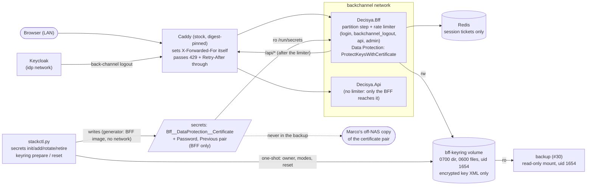
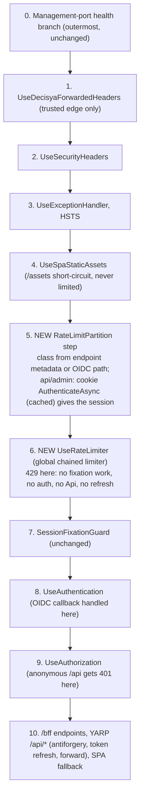

# Architecture note: abuse and key protection: rate limiting and the Data Protection key ring (issue #122)

## Context

Issue #122 (0.17d) closes C-09a (the BFF rate limiter) and implements C-05 (the Data Protection key ring), apart from the restore drill, which belongs to #30.

Requirements: `docs/requirements/phase-0/rate-limit-key-ring.md` (G1 PASS, 11 stories, NFR-49 to NFR-56). Marco decided Q1 to Q7 on 2026-10-08, as recorded in `docs/ai/pipeline/122.md`.

Decisions that apply:
- ADR-0003: the BFF session pattern; the key ring persisted, never in Redis;
- ADR-0016: R4 (stock Caddy, "C-09 is met in-app (#122)") and R7.1 (key ring copy in the nightly set, not Redis, not Caddy data);
- ADR-0018: Compose split, file secrets, one generator per credential;
- ADR-0007: storage portability (unchanged: the ring is a plain file volume);
- the #120 note `docs/architecture/deployable-stack.md` (D2 networks, D3 secrets, D6 configuration) and the #121 note `production-identity.md` (event style, hashed `user_id`).

What changes:
- **the BFF request pipeline:** a partition step and the ASP.NET Core rate limiter run before session-fixation handling, authentication, authorization and YARP;
- **a new file secret and its consumer:** the key-ring wrapping certificate goes to the BFF only;
- **the key ring data flow:** keys are encrypted at rest, the BFF fails closed at start-up, the stack tooling prepares the volume, and the backup contract with #30 is fixed.

No product module, no `*.Contracts` type, no Wolverine message and no Api endpoint changes. No OpenAPI change: the Api never emits the 429 (D7). The note is not N/A, because auth-pipeline order, a secret and a data flow change.

## C4 excerpt (containers touched)

### The BFF pipeline after #122

## Boundaries and contracts

- **New namespace `Decisya.Bff.RateLimiting`:**
  - the route-class metadata and classifier, the partition step and the limiter registration;
  - the 429 writer, `RateLimitLog` and the options type with its validator.
  - Program.cs only calls `AddBffRateLimiting()` and `UseBffRateLimiting()`.
- **New namespace `Decisya.Bff.KeyRing`:**
  - `AddBffDataProtection()`, which moves the Data Protection set-up out of Program.cs;
  - certificate loading and validation, the start-up check, and the certificate generator CLI mode.
- **Configuration keys (new):**
  - `Bff:RateLimits:<class>:*` (D5);
  - `Bff:DataProtection:Certificate`, `:CertificatePassword`, `:PreviousCertificate` and `:PreviousCertificatePassword` (D10).
- **Telemetry (new):**
  - the counter `decisya.bff.ratelimit.rejected` on the existing `Decisya.Bff` Meter (`BffTelemetry`);
  - the log event `ratelimit.rejected`.
  - No new Meter or ActivitySource.
- **Stack (new):**
  - four secret files, consumed by `bff` only;
  - `stackctl.py` commands for the certificate and the volume (D12, D14).
- **No change:**
  - `Decisya.Api`, every module, every `*.Contracts`, the AppHost run model and publish model (`ComposeStack.cs`), the generated `docker-compose.yaml`, the Caddyfile;
  - no new NuGet, npm or Python package. `System.Threading.RateLimiting`, `Microsoft.AspNetCore.RateLimiting` and `X509CertificateLoader` are in the shared framework.

## Decisions

### D1. Where the limiter runs (C-09a)

- **Before** session-fixation handling, authentication and authorization, and before YARP (pipeline steps 5 and 6 above).
  - A rejected request makes no call to Keycloak, none to the Api, no token refresh, and no Redis call except the single ticket read that identifies an `api` or `admin` session (G1 rule 3).
  - `login` and `backchannel_logout` run with no authentication work at all.
- **The OIDC callback is not an endpoint.** The OIDC handler serves `/signin-oidc`, `/signout-callback-oidc` and `/signout-oidc` inside `UseAuthentication`. A limiter placed after authentication could not cover the callback, and Story 1 requires it.
- **The limiter runs before `SessionFixationGuard`.** A refused callback therefore does no ticket delete in Redis.
  - The partition step never calls `AuthenticateAsync` for the `login` class, so the T-05 premise holds: nothing populates the cookie handler on the callback path.
  - A test pins this.
- **The partition step (5)** classifies the request.
  - For `api` and `admin` only, it awaits `AuthenticateAsync` on the cookie scheme. `RedisTicketStore.RetrieveAsync` then sets `SessionKeyFeature`.
  - The handler caches its result per request, so `UseAuthentication` at step 8 reuses it: one Redis read, not two. Spike S1 confirms this.
  - The step stores an internal `RateLimitPartitionFeature` holding the class, the partition kind, the partition value and, when signed in, the principal (for log enrichment only).
- **The limiter (6)** is the built-in `UseRateLimiter` with a **global** limiter only, `PartitionedRateLimiter.CreateChained(classLimiter, apiLimiter)`, which reads the feature.
  - Endpoint policies are not used: the callback paths have no endpoint, and one classifier keeps every class in one place.
  - A request with no class (the SPA fallback, unknown paths) gets `RateLimitPartition.GetNoLimiter`.
- **`/health` and `/alive`** sit on the management-port branch outside Development, outside this pipeline. `/assets/*` is short-circuited at step 4. Neither is ever limited (G1 rule 6).

### D2. Route classes

| Class | Requests | Source of the class |
| --- | --- | --- |
| `login` | `GET /bff/login`, `POST /bff/logout`, and the OIDC handler paths `CallbackPath`, `SignedOutCallbackPath` and `RemoteSignOutPath` | endpoint metadata on the two endpoints; path equality with the three `OpenIdConnectOptions` values, read from `IOptionsMonitor` so a path change follows |
| `backchannel_logout` | `POST /bff/backchannel-logout` | endpoint metadata |
| `api` | the YARP route `/api/{**catch-all}`, and `GET /bff/me` | metadata through `MapReverseProxy(...).WithMetadata(...)` and on `/bff/me` |
| `admin` | any `api` request whose path, after repeated `/` are collapsed, starts with the segments `/api/admin` (case-insensitive, on the decoded `Request.Path`) | classifier upgrade of the `api` class |

- **The code is the record for logout.** G1 says "`GET /bff/logout`", but the code maps `POST /bff/logout`, and the `login` class covers that.
- **`/bff/me` is in `api`.** It is session-partitioned when signed in and IP-partitioned when anonymous.
  - The SPA today reads any `/bff/me` failure as "signed out". frontend-dev maps a 429 there to the same "Too many requests" state as `/api/*` (G4 routing).
- **Admin is classified by path, not by a second YARP route.** A second route would duplicate the T-01 header transforms, the access-token transform and the upstream-error transform on a security-critical path.
  - A wrong class changes only which bucket counts. It never changes access: the Api still authorizes `/api/admin/**`.
  - Doubtful forms round up to `admin`: case variants, `%61dmin`, `//admin`. A test covers these three forms.
- **Coverage rule:** every endpoint whose route pattern starts with `/bff` or `/api` must carry the class metadata. A test enumerates `EndpointDataSource` and fails on any endpoint without it (Story 6).

### D3. Partition keys

| Kind | Used by | Value |
| --- | --- | --- |
| `session` | `api`, `admin`, when step 5 authenticated a ticket | `HMAC-SHA256(Decisya:Observability:UserIdHashKey, "decisya.bff.ratelimit.session.v1\0" + SessionKeyFeature.Key)`, first 16 bytes as hex |
| `ip` | `login` and `backchannel_logout` always; `api` and `admin` when anonymous | `HttpContext.Connection.RemoteIpAddress` after step 1. IPv4-mapped IPv6 is mapped to IPv4. IPv6 is reduced to its /64 prefix, so a client cannot rotate inside its own prefix. |
| `unknown` | any class, when the address is null or unusable | one shared bucket per class: never "no limit" (G1 rule 1) |

- **The session value is derived from the server-side ticket key, never from the cookie bytes or a token.**
  - The keyed hash uses the existing user_id key with its own domain label. That is the same HMAC construction as `UserIdHasher`, computed in the BFF from the public `DecisyaObservabilityOptions`, so ServiceDefaults does not change.
  - The input is 256 random bits, so the key is defence in depth.
  - The derived value lives only in the limiter's memory. It is never logged, tagged or sent anywhere.
- **The address is trusted only from the edge.** `UseDecisyaForwardedHeaders` honours `X-Forwarded-For` only from the configured edge address, with `ForwardLimit = 1`. A header from any other peer is ignored, so the partition is the peer itself (Story 1).
  - The deploy guard already requires `Decisya:Edge:TrustedProxies` in the stack.
  - In Development there is no proxy, so the loopback address is the partition.
- **Back-channel logout** reaches the BFF through Caddy from the idp network. Its partition is Keycloak's own address as Caddy forwards it.
  - No Keycloak retry is assumed: a refused logout token is lost, and that session lives until its expiry. The limit is therefore set well above any real logout burst (300 per 60 s, D5). The identity-dev spike records Keycloak 26.7.5's behaviour (G1, Story 2).

### D4. Algorithm, chaining and state

- **Sliding windows (`SlidingWindowRateLimiter`)**, `QueueLimit = 0` (never queue; reject at once):
  - 4 segments for `login` and `backchannel_logout`;
  - 6 segments for `api` and `admin`;
  - segments are fixed in code; the window and permits are configuration (D5).
- **Admin double count.** `classLimiter` holds the `login`, `backchannel_logout` and `admin` buckets. `apiLimiter` holds one bucket per partition for every `api` **and** `admin` request (300 for a session, 60 for an anonymous address).
  - The chain acquires the class bucket, then the api bucket, and the tighter one decides.
  - Window permits are not returned on release, so an admin request refused by the api bucket still counts once in the admin bucket. That errs on the safe side.
- **Bounded state.** Each partition's limiter is created with `AutoReplenishment = false`.
  - The partitioned limiter's own single heartbeat then replenishes it, and evicts it once it has been idle (window empty) for the framework's idle limit. That avoids one timer per partition.
  - A thin wrapper around each partition limiter, created per partition, carries two things: a "first rejection in this window" flag for the log (D6), and a tracked-partition count that the eviction test reads (Story 5: 20,000 single-use addresses fall back below 1,000).
  - The de-dup state therefore lives and dies with the partition, and is never a separate cache. `Microsoft.Extensions.Caching` stays banned in the BFF (existing NetArchTest rule).
- **Single instance.** Limits are per BFF process. ADR-0016 runs one BFF.
  - Review trigger: a second BFF replica multiplies the effective limits, and needs a shared store or an edge limiter (C-09b) first.

### D5. Configuration

| Key | Default | Range |
| --- | --- | --- |
| `Bff:RateLimits:login:PermitLimit` / `:WindowSeconds` | 10 / 60 | 1 to 100000 / 1 to 3600 |
| `Bff:RateLimits:backchannel_logout:PermitLimit` / `:WindowSeconds` | 300 / 60 | same |
| `Bff:RateLimits:api:PermitLimit` / `:AnonymousPermitLimit` / `:WindowSeconds` | 300 / 60 / 60 | same |
| `Bff:RateLimits:admin:PermitLimit` / `:WindowSeconds` | 30 / 60 | same |

- **Binding and validation.**
  - The options type in `Decisya.Bff.RateLimiting` binds with `ValidateDataAnnotations().ValidateOnStart()` in **every** environment.
  - A non-integer fails in the binder, which names the key. An out-of-range value fails in the validator, naming the key.
  - **An unknown child of `Bff:RateLimits`** also fails start-up, naming it, so a typo cannot silently leave the defaults in place.
  - None of these values is a secret.
- **Read once at start:** a change needs a restart. That is enough for Phase 0.
- **The Development values are raised** in `src/Decisya.Bff/appsettings.Development.json`. The Playwright suite signs in about 11 times per browser project from loopback, each sign-in making two `login`-class requests plus sign-outs, so it would trip `login` at 10 per minute.
  - The stack image carries only `appsettings.json` (ADR-0017 image check), so production always runs the defaults or the stack's values.

### D6. The 429, the event and the metric

- **The response is written by `RateLimiterOptions.OnRejected` through `IProblemDetailsService`.**
  - Status 429, `application/problem+json`, `title` "Too many requests", `type` the RFC 6585 section 4 URI (the same status-specific RFC link pattern as the framework defaults), and `traceId`.
  - No `detail` and nothing class- or partition-specific (NFR-50).
  - `Cache-Control: no-store`. No cookie is written: the endpoint never runs. The security headers come from step 2.
- **`Retry-After`** uses the failed lease's `RetryAfter` metadata when the limiter supplies it.
  - Otherwise the BFF sends `ceil(window / segments)`, the earliest moment any permit can return, clamped to 1 through `WindowSeconds`.
  - Spike S1 records which case applies on .NET 10. No `X-RateLimit-*` headers.
- **Event `ratelimit.rejected`.**
  - Source-generated `LoggerMessage`, Warning, a proposed EventId of 1820 (identity-dev takes the next free id after #121's 1810 to 1812).
  - Template: `ratelimit.rejected: a request was refused by the rate limiter ({RouteClass}, {PartitionKind}).`
  - The arguments come from closed lists only.
  - `tenant_id` and the hashed `user_id` come through `ILogEnrichmentContext.Begin` from the principal that step 5 captured, as `AuthEvents` does. At step 6 `HttpContext.User` is still anonymous.
  - **One event per partition per window:** the partition wrapper's flag, timed with NodaTime `IClock`.
- **Counter `decisya.bff.ratelimit.rejected`** on `BffTelemetry.Meter`, tag `route_class` only, incremented on every rejection.
- **Framework telemetry.** The framework's own `Microsoft.AspNetCore.RateLimiting` meter and its Debug log carry no address, session or partition value, so they stay on.

### D7. Is the Api limited too? No: only through the BFF

- `/api/*` reaches `Decisya.Api` only through the BFF's YARP forwarder. The Caddy api-host block admits `/api/*` from the back-channel subnet only.
  - That network holds Caddy, the BFF and the Api (ADR-0016 R9.6, #120 D2).
  - Keycloak is on the idp network, and nothing on the LAN can reach the api host.
- Every request the Api receives has therefore passed the BFF limiter, and the `admin` bucket guards the audit path (NFR-39 holds for a refused request: zero audit rows).
- **Review trigger:** any second caller of the Api, such as a mobile client, a webhook or a public API key, needs an Api-side limiter or the edge limiter first.

### D8. Edge duties (Story 7) and C-09b

- **The current Caddyfile already does what Story 7 needs, so it does not change.**
  - **Forwarded address:** `reverse_proxy` has no `trusted_proxies`. Stock Caddy then ignores a client-supplied `X-Forwarded-For` and sets its own value from the connecting peer. `test_caddyfile.py` already bans `trusted_proxies`.
  - **429 pass-through:** no `handle_response`, `intercept` or `header_down` exists on the app-host block, so status, body and `Retry-After` go through unchanged.
- **Guards to add (devops, `deploy/tests/test_caddyfile.py`, on the adapted JSON):**
  1. No `header_up` that sets or copies any `X-Forwarded-*` or `Forwarded` header, in any site block.
  2. The app-host block has no `handle_response` or `intercept`, and no `header_down` that touches `Retry-After`.
- **Runtime check (devops, `deploy/tests/stack_smoke.py`):** from the workstation, send 11 `GET /bff/login` requests, each with a different invented `X-Forwarded-For` value.
  - Expect the 11th to be 429, `application/problem+json`, with a whole-second `Retry-After` from 1 to 60.
  - One check proves both the overwrite (the forged values did not open new buckets) and the pass-through.
  - Run it last in the smoke: it spends the workstation's `login` budget for a minute.
- **C-09b (edge limit) is a go-live item, not #122.** It means `caddy-ratelimit` in a self-built Caddy image.
  - That needs an ADR-0016 R4 amendment (custom build) and the image scan and parity rules of ADR-0015/ADR-0017 for a self-built image. The Compose split of ADR-0018 is unaffected.
  - It is coarse: a per-address ceiling above the BFF limits, which also returns 429 with `Retry-After`.
  - It blocks the first public-internet exposure (the go-live VPS). The BFF limiter stays underneath it as defence in depth.
- **`docs/runbooks/go-live-gate.md` needs the split.** It is devops's file, edited at G4. The blocking list changes like this:
  - **C-09** becomes **C-09a**, "BFF limiter per route class, 429 ProblemDetails, tests: closed by #122 on merge";
  - plus **C-09b**, "edge limit at Caddy (`caddy-ratelimit`, ADR-0016 R4 amendment): open; blocks public-internet exposure";
  - **C-05** changes owner to "#122; restore drill #30" and closes when #122 has merged **and** the #30 drill is recorded;
  - `test_go_live_gate.py` checks C-09a and C-09b instead of C-09.

### D9. Key ring: location and access (C-05)

- **Location:** the `bff-keyring` named volume, at `/home/app/keyring` (`Bff:DataProtection:KeyRingPath`, set by `ComposeStack.cs`, unchanged).
  - `PersistKeysToFileSystem` and `SetApplicationName("Decisya.Bff")` are unchanged.
  - Never Redis, never a database (NetArchTest rule 5).
- **Owner and modes:** directory `1654:1654` mode `0700`, key files `0600`.
  - The chiseled BFF image has no such directory, so Docker creates a new volume root-owned. #120 left writability as an open first-start item.
  - **`stackctl.py keyring prepare`** (devops) makes the volume right. It is idempotent and is run by `up` before the BFF starts:
    - one-shot `docker run --rm --network none --read-only --security-opt no-new-privileges --cap-drop ALL --cap-add CHOWN --cap-add DAC_OVERRIDE --cap-add FOWNER --user 0:0`;
    - the pinned Caddy image (the same utility pattern as `stack_smoke.py`) with the volume mounted;
    - a fixed script that creates the volume if missing, chowns everything to `1654:1654`, and sets the directory to `0700` and every file to `0600`.
  - It never reads file contents.
  - The same command normalises a restored ring (D13).
- **The BFF also checks** (outside Development, on Linux), in the start-up check (D11):
  - the directory exists, is writable, and has no group or other bits. Otherwise start-up fails, naming `Bff:DataProtection:KeyRingPath` and pointing to `keyring prepare`.
  - Key files written by the framework must come out `0600`. Spike S2 checks the framework's mode on .NET 10.
  - If it is wider, `Decisya.Bff.KeyRing` subclasses `FileSystemXmlRepository` to set `0600` after each store. A repository is allowed; an encryptor is not.
- **Mounts:**
  - read-write in `bff` only (the existing guard);
  - #30 adds one read-only mount in a service named `backup` and extends `NAMED_VOLUMES`. That guard must then require `read_only: true`, `user: "1654:1654"`, `cap_drop: [ALL]` and no network.
  - No host path, Caddy, Api, Keycloak, Redis, Postgres or migrator mount (existing guard test).
- **Integrity, stated for G3:** encryption at rest gives confidentiality of copies (volume copies, backups, snapshots). It gives no integrity against someone who can write the volume.
  - The certificate is public-key encryption, so a writer could plant a key wrapped with the public certificate.
  - The integrity control is that only the BFF mounts the volume read-write.

### D10. Key ring: protection at rest

- **Mechanism:**
  - `ProtectKeysWithCertificate(current)`, plus `UnprotectKeysWithAnyCertificate(current, previous?)`, so both decrypt;
  - `SetDefaultKeyLifetime(TimeSpan.FromDays(90))`, explicit in code;
  - no hand-rolled `IXmlEncryptor` or `IXmlDecryptor` (NetArchTest rule 4).
- **Secret files and configuration keys.** Key-per-file, so the target name is the configuration key, as in #120 D3.

  | File (target) | Content | Shape (stackctl) |
  | --- | --- | --- |
  | `Bff__DataProtection__Certificate` | standard base64, no line breaks, of a PKCS#12 holding one RSA key and its self-signed certificate | strict base64, decodes to 1 to 16 KiB |
  | `Bff__DataProtection__CertificatePassword` | the PKCS#12 password | at least 32 letters and digits |
  | `Bff__DataProtection__PreviousCertificate` | empty, or the previous certificate, same form | empty or as above |
  | `Bff__DataProtection__PreviousCertificatePassword` | empty, or its password | empty or as above; empty exactly when the previous certificate is empty |

  - **Why base64 and not a raw PFX file.**
    - `stackctl` requires every secret file to be valid UTF-8 with no trailing newline.
    - The key-per-file source turns every file under `/run/secrets` into a configuration string.
    - A binary file would break both. Base64 keeps the existing convention with no path setting and no `AddSecretFiles` change.
  - The "previous" pair always exists and is empty when unused, the same pattern as the retired bootstrap password. That keeps `secret_problems`' "every file present" rule.
- **Loading:**
  - `X509CertificateLoader.LoadPkcs12(Convert.FromBase64String(value), password, X509KeyStorageFlags.EphemeralKeySet)`;
  - ephemeral, so nothing is written to the read-only root filesystem or to a user key store.
- **Validation (an `IValidateOptions<BffOptions>`):**
  - **Outside Development**, `Certificate` and `CertificatePassword` are required (fail closed, Q4).
  - **In every environment, when set**, the value must:
    - decode;
    - load with its password;
    - have a private key;
    - be RSA with at least 3072 bits.
  - The previous pair, when set, follows the same rules and must have a different thumbprint.
  - Each failure names the key, never a value or a path content.
  - Validity dates are not enforced: `EncryptedXml` ignores them, and rotation is calendar-driven (D12).
- **No other secret changes.** Neither the certificate nor its password is ever on the key ring volume, in an image, in `environment:`, in `.env` or on a command line.

### D11. Start-up check: fail closed, no silent new ring

- **Form:** a `KeyRingStartupCheck`, registered as an `IHostedLifecycleService`, does its work in `StartingAsync`.
  - That runs after `ValidateOnStart` and before any `StartAsync`, including the framework's `DataProtectionHostedService`, which would otherwise build the key ring and **create a new default key** when none decrypts (bff-session T-09, "a fresh key ring looks healthy").
  - It also runs before Kestrel starts, so no request is served first. Spike S2 confirms the ordering on .NET 10.
  - If the ordering fails, the check moves before host start in Program.cs, and G2 is told.
- **When it runs:** outside Development, and in Development whenever a certificate is configured.
- **What it checks, in this order:**
  1. **Directory:** as in D9.
  2. **Keys:** `IKeyManager.GetAllKeys()`, which reads and never creates. Every key that is not revoked and whose expiration is later than now minus the session lifetime (10 h, `ExpireTimeSpan`) must decrypt: its descriptor resolves.
     - Keys that expired before that point are ignored, so retiring the previous certificate after its 90 days and 10 hours is safe.
     - Spike S2 names the .NET 10 API that surfaces a decryption failure (`IKey.Descriptor` throwing, or `CreateEncryptor()` returning null).
  3. **Plaintext keys:** no key file in that same set may hold a plaintext `masterKey`, which means a key element without `encryptedSecret` (NFR-54).
     - This also catches the unencrypted keys #120 wrote on an existing stack (D14).
- **Failure:** throw with a generic message and log the full detail (the key id, which rule failed, never key material) through a source-generated event with the trace id. The host stops.
  - The check writes nothing, so no new key file appears (NFR-56).
- **Empty directory:** a normal first start. The framework creates the first key, encrypted, on its first use.

### D12. The certificate: generation, rotation, retirement

- **Generator: the BFF image itself, as a CLI mode.**
  - Invocation: `dotnet /app/Decisya.Bff.dll --generate-keyring-certificate`, handled before the host is built (the same pattern as `--health-probe`).
  - Input: the password on stdin, one line.
  - Output: the base64 PKCS#12 on stdout.
  - The key is RSA 4096 (above the 3072 floor); the certificate is self-signed with subject `CN=Decisya BFF Data Protection`, valid 25 months, and exported with `Pkcs12ExportPbeParameters.Pbes2Aes256Sha256`.
  - It refuses (exit 2, fixed message) when stdout is a terminal. Other failures exit 1 with a fixed message that names no value.
  - **Why this generator:**
    - `stackctl.py` is stdlib-only, so it cannot make an RSA key or a PKCS#12.
    - The `openssl` CLI varies by host (LibreSSL and old OpenSSL default to legacy PKCS#12 ciphers).
    - The Python `cryptography` package would be a new third-party dependency.
    - The release image is pinned and verified (ADR-0017), and is the same .NET that later reads the file.
- **`stackctl.py` (devops):**
  - Logical credential `dataprotection_cert` gets the current pair.
    - `stackctl` generates the password (CSPRNG, 48 letters and digits).
    - It runs the generator with `docker run --rm -i --network none --read-only --cap-drop ALL --security-opt no-new-privileges --user 1654:1654 --entrypoint dotnet <DECISYA_BFF_IMAGE>`, with the password on stdin.
    - It captures stdout in memory and writes both files atomically, mode 0444, as every other secret. It never prints the values.
  - `secrets init` writes the current pair and an empty previous pair.
    - It now needs the BFF image locally; it pulls it by the digest in the environment file.
  - **An existing #120 stack** needs a way to create files that do not exist yet without touching the others. `secrets init` refuses when any file exists, and `rotate` only replaces.
    - Proposed: `secrets add dataprotection_cert`, which writes only a credential whose files are all absent and never overwrites. devops picks the name.
  - **`secrets rotate dataprotection_cert`** moves the current pair into the previous pair, then writes a new current pair.
    - It refuses while the previous pair is non-empty, unless `--drop-previous` is given; the message says the BFF will refuse to start if keys wrapped by the dropped certificate are still live.
    - Next step: restart the BFF, copy the new pair off the NAS.
  - **`secrets retire dataprotection_previous`** empties the previous pair, 90 days and 10 hours after a rotation; then restart the BFF.
- **When to rotate** (Q4): at the Phase 0 exit, on the move to the VPS, and yearly. Sessions survive a rotation.
- **A suspected compromise is not a rotation.**
  - Keys wrapped by a leaked certificate are exposed to whoever also holds a copy of the ring.
  - The response is a new certificate **plus** the operator reset (D14): everyone signs in again, and that is all it costs.
- **Off-NAS copy (Q5):** after `init`, `add` or `rotate`, Marco copies the two current files to his off-NAS store, beside the Hyper Backup password. The runbook says so.

### D13. Backup and restore (contract for #30)

- **What is copied:** the nightly job copies the whole `bff-keyring` volume, through the `backup` service's read-only mount as uid 1654 (D9), into the `dumps` folder.
  - Hyper Backup sends **only** `dumps`, encrypted (ADR-0016 R7.1).
  - The copy holds encrypted key XML only.
- **Never in the backup:**
  - **the secrets folder:** neither certificate pair nor any other secret. #30's task source must be `dumps` alone, and #30's guard checks that the `dumps` folder holds no file named like a secret;
  - Redis (R7.1), so no archive holds ticket ciphertext and the ring together.
- **Snapshots:** DSM Snapshot Replication of the stack folder does include `secrets/`. It stays on the same box (R7.1). Replicating those snapshots off the box would carry the certificate, so it is not allowed without a new decision.
- **Restore sequence (#30's drill runbook):**
  1. Stop the BFF.
  2. Copy the files onto the volume.
  3. Run `keyring prepare` (owner and modes).
  4. Have the certificate pair in `secrets/`.
  5. Start the BFF.
  - Expected results:
    - payloads protected before the backup still unprotect;
    - without the certificate, the BFF refuses to start and writes no file (D11);
    - sessions do not survive, because Redis is not restored.
- **Tests:**
  - **#122 ships** the BFF-level copy-and-restore test (NFR-55) and the certificate-missing test;
  - **#30 owns** the `backup` service, its guard row and the drill record. G5 records the deferred Story 10 criteria as such.

### D14. Operator reset, and the migration of an existing stack

- **`stackctl.py keyring reset --confirm`** (devops):
  1. Stop the BFF.
  2. A one-shot container (D9 pattern) moves every top-level `*.xml` into `attic-<UTC timestamp>/` inside the volume, which keeps mode `0700`. The framework reads top-level `*.xml` only (S2 confirms).
  3. Run `keyring prepare`.
  4. Start the BFF.
  - Results:
    - the next start creates a new encrypted ring;
    - every old cookie fails to unprotect, so the caller is anonymous: 401 on `/api`, never 500 (NFR-56);
    - orphaned Redis tickets expire within 10 h and cannot be read.
  - The command refuses without `--confirm`.
- **An existing #120 stack** whose ring holds unencrypted keys:
  1. `secrets add dataprotection_cert`;
  2. assemble;
  3. `keyring reset --confirm`;
  4. `up`.
  - Phase 0 has synthetic users only (ADR-0016), so one forced sign-in is the whole cost. The runbook carries it as a one-time step.

### D15. The dev environment

- **The AppHost is unchanged.** It sets no `KeyRingPath` and no certificate. Development keeps the framework's per-user ring (DPAPI on Windows), and the start-up check does not run.
- **The limiter is on in Development.** It uses raised values from `appsettings.Development.json` (D5), so the pipeline and its order are the same everywhere and the E2E suite is not refused.
- **Tests** set `Bff:DataProtection:*` and `Bff:RateLimits:*` through configuration.
  - **Mode checks:** the Unix mode checks run only on Linux, which means CI and the stack; Windows host runs skip them by design.
  - **Window test:** the framework limiters are not clock-injectable (S1 confirms). The "window slides" scenario therefore uses a short real window (1 to 2 s) with a bounded wait. The log de-dup uses a NodaTime `FakeClock`. G5 records this deviation from Story 1's "fake clock".

## ADRs

**No new ADR, and no amendment in #122.**
- **D1 to D8:** ADR-0016 R4 already places C-09 in the BFF for Phase 0. C-09b's amendment of R4 (custom Caddy build with `caddy-ratelimit`) is a go-live item, recorded in the go-live gate (D8).
- **D9 to D14:** these implement ADR-0003 (persisted ring, never Redis) and ADR-0018:
  - a file secret with one generator, extended to a certificate;
  - guards over mounts and consumers.
  - They change neither decision.
  - The generator CLI mode and the one-shot volume-preparation container follow the existing `--health-probe` and `stack_smoke.py` patterns.
- **Review triggers in this note:** a second BFF replica (D4); a second caller of the Api (D7); off-box snapshot replication (D13).

## NetArchTest rules to add

| # | Rule | Assemblies | Test class |
| --- | --- | --- | --- |
| 1 | Only types in `Decisya.Bff.RateLimiting` depend on `System.Threading.RateLimiting` or `Microsoft.AspNetCore.RateLimiting` | `Decisya.Bff` | `BffBoundaryTests` |
| 2 | Only types in `Decisya.Bff.KeyRing` depend on `Microsoft.AspNetCore.DataProtection.KeyManagement`, `Microsoft.AspNetCore.DataProtection.XmlEncryption` or `Microsoft.AspNetCore.DataProtection.Repositories` | `Decisya.Bff` | `BffBoundaryTests` |
| 3 | Only types in `Decisya.Bff.KeyRing` implement `IXmlRepository` | `Decisya.Bff` | `BffBoundaryTests` |
| 4 | No type implements `IXmlEncryptor` or `IXmlDecryptor` | `Decisya.Bff` | `BffBoundaryTests` |
| 5 | No type depends on `Microsoft.AspNetCore.DataProtection.StackExchangeRedis` or `Microsoft.AspNetCore.DataProtection.EntityFrameworkCore`; the csproj has neither package | `Decisya.Bff` | `BffBoundaryTests` |
| (existing) | `Decisya.Bff.RateLimiting` must not reach Redis or YARP, and the de-dup must not use a cache: already enforced by "only Session depends on StackExchange.Redis", "only Proxy depends on Yarp.ReverseProxy" and "no Microsoft.Extensions.Caching" | `Decisya.Bff` | `BffBoundaryTests` (unchanged) |

Structural tests that NetArchTest cannot express (identity-dev, `Decisya.Bff.Tests`):
- **every `/bff` and `/api` endpoint has a class:** endpoint enumeration (D2);
- **the OIDC class paths:** the three paths in the `login` class equal the current `OpenIdConnectOptions` values;
- **pipeline order, proven by behaviour:**
  - a forged `X-Forwarded-For` from an untrusted peer stays in the peer's bucket (forwarded headers come before the limiter);
  - the anonymous 61st `/api` request gets 429, not 401 (the limiter comes before authorization);
  - a refused `/api` request makes 0 Api calls and no token refresh (the limiter comes before YARP);
  - a refused `/signin-oidc` with a session cookie makes 0 Redis calls (the limiter comes before `SessionFixationGuard`; the partition step never authenticates on OIDC paths);
  - an authenticated `/api` request reads its ticket from Redis exactly once.

## Spike (first G4 step, identity-dev, timeboxed to half a day, results in the manifest's G4 evidence)

- **S1, rate limiter on .NET 10:**
  - whether `SlidingWindowRateLimiter` failed leases carry `RetryAfter`;
  - whether `CreateChained` returns the failing inner lease with its metadata (else a two-step acquire in one `PartitionedRateLimiter<HttpContext>` subclass replaces it);
  - heartbeat replenishment and idle eviction for `AutoReplenishment = false` partitions behind a wrapper;
  - whether any `TimeProvider` support exists;
  - cookie `AuthenticateAsync` before `UseAuthentication` is served from the per-request cache (one Redis read).
- **S2, Data Protection on .NET 10:**
  - `ProtectKeysWithCertificate` with an `EphemeralKeySet` PKCS#12, plus `UnprotectKeysWithAnyCertificate(current, previous)`, round-trips on Windows and in the chiseled Linux image with a read-only root;
  - which API surfaces an undecryptable key without creating one;
  - `DataProtectionHostedService` starts after every `IHostedLifecycleService.StartingAsync`;
  - the mode of written key files;
  - the repository reads top-level `*.xml` only.
- **S3, Keycloak 26.7.5 back-channel logout:** whether Keycloak retries a logout token the BFF answered with 429 (G1 Story 2). The design assumes it does not (D3), so either result needs no new G2.
- **If a premise fails:**
  - S1 items have the fallbacks named in D4 and D6, and need no new G2.
  - An S2 failure on decryption or ordering goes back to G2 before more code is written.

## G4 routing and order

1. **identity-dev** (`src/Decisya.Bff/**`, `tests/Decisya.Bff.Tests/**`, and integration cases where Redis is needed):
   - the spike;
   - D1 to D6 (limiter, classifier, partition step, options, 429, event, metric, `appsettings.Development.json`);
   - D9 to D11 (`AddBffDataProtection`, certificate options and validator, start-up check, `0600` fallback if needed);
   - D12's generator CLI mode;
   - the NetArchTest rules and the structural tests, and the tests for NFR-49 to NFR-53 and the BFF parts of NFR-54 to NFR-56.
   - **Done first:** devops depends on the key names and the generator contract.
2. **frontend-dev** (`src/Decisya.Web/**`), independent of 1 and can run in parallel:
   - a 429 from `/api/*` (`apiFetch`, `loadManifest`) and from `/bff/me` shows "Too many requests. Please wait a moment and try again."; it is no longer read as signed out;
   - no automatic retry before `Retry-After`, and no seconds shown;
   - Vitest cases (Story 3, last scenario).
3. **devops** (`deploy/compose/**`, `deploy/tests/**`, `docs/runbooks/deployable-stack.md`, `docs/runbooks/go-live-gate.md`):
   - overlay: four secrets on `bff`, top-level `secrets:` entries;
   - `stackguards.py`: `SECRET_CONSUMERS["bff"]` gains the four names, and no other consumer is allowed;
   - `stackctl.py`:
     - shapes for the four files and the pair rule (previous empty together);
     - `dataprotection_cert` in `init`, `add`, `rotate` and `retire`;
     - `keyring prepare` (called by `up`) and `keyring reset --confirm`;
   - `verify` reports the ring's owner, the modes and the count of encrypted versus plaintext files. It reports counts only, never contents;
   - the D8 Caddyfile guards and the smoke check, and the smoke's key-ring probe moves from "writable" to the owner and mode checks of Story 8;
   - the go-live gate split (D8);
   - the runbook: rotation, retirement, reset, the off-NAS copy, the one-time migration for an existing stack (D14), each step in two columns (VS Code or VS 2026, and CLI).
4. **platform-dev:** not needed. The AppHost run model, `ComposeStack.cs` and the generated Compose file are unchanged (D15, and the new keys arrive as key-per-file secrets).
5. **backend-dev:** not needed (ServiceDefaults unchanged; D3).
6. **G5:** test-engineer.

## Points for G3

- **Pipeline and limiter:**
  - the limiter now sits before `SessionFixationGuard`. The T-05 premise is kept because the partition step never authenticates on OIDC paths (D1);
  - the admin class comes from the path, not from a route. A wrong class affects only which bucket counts (D2);
  - the shared `unknown` bucket and the household that shares one address for `login` affect availability only (D3).
- **Key reuse:** the user_id hash key is reused, with its own domain label, for an in-memory value (D3).
- **Stack tooling with privileges:**
  - the certificate generator runs inside the production image, with no network, the password on stdin and the secret on a stdout pipe (D12);
  - the one-shot volume-preparation container uses `CAP_CHOWN`, `CAP_DAC_OVERRIDE` and `CAP_FOWNER`, no network, and a fixed script (D9).
- **Key ring integrity:** encryption at rest protects copies, not integrity against a volume writer (D9).

## Changes

- 2026-10-08, Marco, after G3 S-122-01: the `backchannel_logout` default limit rises from 30 to 300 per 60 s per client IP (D5). No Keycloak retry of a refused logout token is assumed (D3); the identity-dev spike records Keycloak 26.7.5's behaviour (S3). G1 is updated to match. The G2 verdict is unchanged.

<!-- gate: G2 | verdict: PASS | issue: #122 -->
