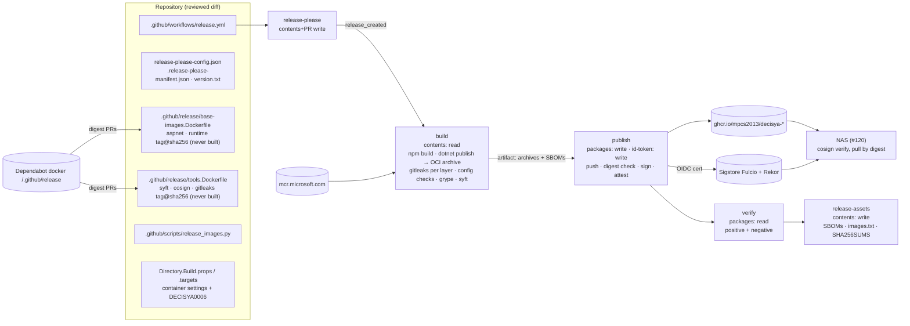

# Architecture note: release supply chain (release-please, GHCR images, SBOM, cosign) (issue #119)

## Context

Issue #119 (0.17a) adds the first release path. The manifest (`docs/ai/pipeline/119.md`) fixes the inputs:
- the CPU target is `linux/amd64` on x86-64-v2 (the NAS has a Celeron J3455, without AVX);
- the GHCR packages are public, under five conditions;
- the scope is the app images. Caddy is #120.

There are no Dockerfiles today. The AppHost runs Api, Bff and Migrator as host processes. The SPA is built by Vite into `src/Decisya.Bff/wwwroot` (git-ignored) and served by the BFF (`spa-shell.md` D5).

No product module, Contracts type, Wolverine message, endpoint or schema changes. What is new is a **trust boundary and data flow**: CI publishes artifacts that the NAS will run, under an identity that consumers verify. So the verdict is PASS, not N/A.

Decision record: [ADR-0017](../adr/0017-release-images-sdk-containers-cosign.md) (Proposed). It amends ADR-0015's target set (D7). ADR-0016 is referenced as a draft on #124. Its F6 trigger (no x86-64-v3 bases) is applied here.

## C4 excerpt (release, not product)



## Decisions

### D1. How images are built: SDK container publishing (ADR-0017)

- **Method.** `dotnet publish <proj> -c Release -r linux-x64 -t:PublishContainer -p:ContainerArchiveOutputPath=<tmp>/<name>.tar -p:ContainerBaseImage=<pinned> -p:Version=<v> -p:ContainerImageTag=<tag>`.
  - It writes an OCI archive and never pushes. The Docker daemon is not used for the build.
  - Rejected: Dockerfiles with BuildKit. They bring build context, `ARG`/`ENV` and SDK-image pins for no gain (ADR-0017).
- **Images.** `decisya-api`, `decisya-bff` and `decisya-migrator`. **No Web image:** the BFF image carries `wwwroot` (the release builds the SPA first). Caddy (#120) only terminates TLS in front of the BFF.
- **Central settings, no csproj edits.**
  - `Directory.Build.props` gets one `PropertyGroup` conditioned on `MSBuildProjectName` ∈ {`Decisya.Api`, `Decisya.Bff`, `Decisya.Infrastructure.Migrator`}. It sets `IsDecisyaReleaseImage=true`, `EnableSdkContainerSupport=true` (the Migrator is a console app), `ContainerRuntimeIdentifier=linux-x64`, `ContainerUser=1654`, `ContainerImageFormat=OCI`, `SelfContained=false`, `PublishReadyToRun=false` and `PublishAot=false`, plus `ContainerRepository` for each project. `RuntimeIdentifier` is passed only on the command line, so the normal build and tests are unaffected.
  - `Directory.Build.targets` gets two additions:
    - for release-image projects, `appsettings.Development.json` is set to `CopyToPublishDirectory="Never"` (`Content Update`; it must sit after the SDK globs, which is why it lives in `.targets`);
    - target `DecisyaReleaseImagePolicy` (`BeforeTargets="PublishContainer"`) fails with **DECISYA0006** unless every one of these holds:
      - `ContainerBaseImage` matches `^mcr\.microsoft\.com/dotnet/(aspnet|runtime):10\.0[^@]*-noble-chiseled-extra@sha256:[0-9a-f]{64}$`;
      - `ContainerUser` is not empty, `root` or `0`;
      - `PublishAot` and `PublishReadyToRun` are not `true`;
      - `@(ContainerEnvironmentVariable)` is empty;
      - `ContainerRuntimeIdentifier` is `linux-x64`.

    A csproj cannot set these back, because `.targets` evaluates last.
- **Bases.** Pinned in `.github/release/base-images.Dockerfile`:

  ```
  FROM mcr.microsoft.com/dotnet/aspnet:10.0-noble-chiseled-extra@sha256:<64 hex> AS aspnet
  FROM mcr.microsoft.com/dotnet/runtime:10.0-noble-chiseled-extra@sha256:<64 hex> AS runtime
  ```

  `release_images.py` maps Api and Bff to `aspnet` and Migrator to `runtime`, and passes the reference as `-p:ContainerBaseImage`. That makes the file the single source of truth, with no parity test against props.
  - The bases are chiseled (distroless, no shell, no package manager) and non-root (`app`, 1654).
  - `-extra` is required: `InvariantGlobalization=false` needs ICU, and NodaTime does not need tzdata, but ICU does.
  - G4 resolves both digests two ways (registry API and the `Docker-Content-Digest` header), as `ContainerImages.cs` documents.
- **x86-64-v2.** The images are framework-dependent, with no ReadyToRun and no AOT. The JIT selects instruction sets at run time, and .NET 10's x64 floor is x86-64-v2. Ubuntu 24.04 amd64 needs only v1. A base outside the DECISYA0006 regex fails. Switching distro (for example to UBI 10, which needs x86-64-v3, ADR-0016 F6) is therefore a reviewed edit of the regex and of the guard test. The real-CPU smoke run happens on the NAS in #120.
- **Read-only friendly.** No app writes into its own directory. Writable paths are mounted by the consumer (#120): a tmpfs `/tmp`, and a volume for `Bff:DataProtection:KeyRingPath`, which the BFF requires outside Development. The images run with `--read-only`.
- **Dependabot.** A new `docker` entry for `/.github/release` (weekly, `cooldown: { default-days: 7 }`) covers both pin files. It ignores `version-update:semver-major` for `dotnet/aspnet` and `dotnet/runtime`, so a .NET major stays an ADR-level change.
  - A gitleaks bump in `tools.Dockerfile` fails `test_gitleaks_parity.py` until `GITLEAKS_VERSION` and the pre-commit `frozen:` rev move in the same PR. That is the existing hand-edit pattern.
- **Grype coverage (ADR-0015 amendment, D7).** The release build scans each archive. The weekly `image-scan` scans the two bases.

### D2. Release flow

- **release-please.** It runs `googleapis/release-please-action@<sha>  # v4.x.y` with:
  - `release-please-config.json`: `release-type: simple`; one package `.`, `package-name: decisya`; `include-component-in-tag: false`, so tags are `vX.Y.Z`; `bump-minor-pre-major: true`; `changelog-path: CHANGELOG.md`; `bootstrap-sha` set to the full SHA of `main` before #119 merges (G4 resolves it), so the first changelog does not list all history;
  - `.release-please-manifest.json` `{".": "0.0.0"}`;
  - `version.txt`.

  **One version for the whole app:** the migrator's schema, the API and the BFF+SPA are one deployable unit.
- **`release.yml` triggers:**
  - `push: branches: [main]`: release-please, then build → publish → verify → release-assets only when `release_created == 'true'`;
  - `workflow_dispatch`, with no inputs (S-08 rule): a dry run on `main` only (`if: github.ref == 'refs/heads/main'`). It builds, publishes `sha-<12 hex>` tags, signs and verifies. It creates no GitHub release and runs no release-please;
  - `pull_request` with `paths:` (`release.yml`, `.github/release/**`, `.github/scripts/release_images.py`, `Directory.Build.*`, `Directory.Packages.props`, `src/**/*.csproj`, `src/Decisya.Web/package*.json`, `.dockerignore`): **`build` only** (archives, all pre-push checks, SBOMs). Nothing is pushed or signed. This is how condition 5 is proven before the first push. It is not a required check: path-filtered.

  There is no `pull_request_target`, no `workflow_run` and no `release:` trigger. A release created with `GITHUB_TOKEN` would not fire one anyway, and avoiding that keeps any PAT or App secret out.
- **Jobs and permissions.** The workflow level is `permissions: {}`, and each job declares its own:

  | Job | Runs when | Permissions | Third-party code |
  | --- | --- | --- | --- |
  | `release-please` | push to main | `contents: write`, `pull-requests: write` | release-please-action only; no checkout |
  | `build` | release created, dispatch, PR | `contents: read` | setup-dotnet/node, `npm ci --ignore-scripts`, Vite build, NuGet restore, tool images |
  | `publish` | release created, dispatch | `contents: read`, `packages: write`, `id-token: write` | only `actions/checkout` (pin files and script, `persist-credentials: false`), `actions/download-artifact`, the docker CLI and the cosign image |
  | `verify` | after publish | `contents: read`, `packages: read` | `actions/checkout`, the cosign image |
  | `release-assets` | release created, after verify | `contents: write` | `gh release upload` (runner CLI) |

  - Every checkout uses `persist-credentials: false`. The build checks out `release_created`'s `sha` output, never a branch head.
  - Values from release-please outputs reach `run:` only through `env:`. They are validated by the script (`^\d+\.\d+\.\d+$`, `^[0-9a-f]{40}$`).
  - Concurrency is `release-${{ github.ref }}` with `cancel-in-progress: false`.
- **Release PR mechanics.** release-please's PR is opened by `GITHUB_TOKEN`, so no `pull_request` workflow fires. Before merging, Marco **closes and reopens** it (VS Code / web: *Pull requests → the release PR → Close → Reopen*; CLI: `gh pr close <n>` then `gh pr reopen <n>`). The required checks then run.
  - `claude-config`'s **Pipeline gates** step gets a second exemption, next to Dependabot's. It applies only when all three of these hold:
    - the PR author is `github-actions[bot]`;
    - the head ref is exactly `release-please--branches--main`;
    - `git diff --name-only base...head` is a subset of {`CHANGELOG.md`, `version.txt`, `.release-please-manifest.json`}.

    The actor is not checked, because Marco's reopen is the event. The file-set rule replaces that check: a human push of any other file to that branch fails the gates.
  - CLAUDE.md's "Dependabot PRs are exempt" line needs "and release-please PRs". That edit is **Marco's** (CLAUDE.md is not an agent path).

### D3. SBOM

- **Generator.** `syft` runs from `ghcr.io/anchore/syft:v<x.y.z>@sha256:…` (in `tools.Dockerfile`) with `--network none` and read-only mounts:
  - per image: `oci-archive:/in/<name>.tar -o cyclonedx-json=/out/decisya-<name>-<v>.cdx.json` (G4 confirms the scheme the SDK archive needs, `oci-archive:` or `docker-archive:`). It catalogs the dpkg status of the chiseled base and the `.deps.json` NuGet graph;
  - SPA: `dir:/in/src/Decisya.Web` restricted to `package-lock.json`, production dependencies only → `decisya-bff-spa-<v>.cdx.json`. The bundled JS carries no package metadata, so the image SBOM alone would miss it.
- **Format.** CycloneDX JSON. No SPDX.
- **Distribution.** Each SBOM is a release asset, and each is attested to its image with `cosign attest --type cyclonedx --predicate … <ref>@sha256:…`. The BFF gets two attestations: the image and the SPA.

### D4. Signing and verification

- **cosign** runs from `ghcr.io/sigstore/cosign/cosign:v<x.y.z>@sha256:…` (`tools.Dockerfile`), invoked by `release_images.py` with an argv list and no shell.
  - In `publish`, the container receives `ACTIONS_ID_TOKEN_REQUEST_URL` and `ACTIONS_ID_TOKEN_REQUEST_TOKEN` and a read-only mount of the docker config written by `docker login ghcr.io --password-stdin`. It receives no other environment.
  - Every `sign`/`attest` target is `<repo>@sha256:<64 hex>`, never a tag (`--yes`, Rekor upload on).
- **Push integrity.** `docker load` and `docker push` are used if the runner's Docker loads the SDK's OCI archive. Otherwise `crane push` from a digest-pinned image is added to `tools.Dockerfile`; G4 decides and records which. After the push, the pushed manifest's **config digest must equal the archive's**. That proves the bytes that were scanned are the bytes that were pushed, even if the push recompresses layers. Then the pushed manifest digest is signed.
- **What `cosign verify` checks** (the `verify` job, the runbook and #120 use exactly this):

  ```
  cosign verify ghcr.io/mpcs2013/decisya-<name>@sha256:<digest> \
    --certificate-identity https://github.com/mpcs2013/decisya/.github/workflows/release.yml@refs/heads/main \
    --certificate-oidc-issuer https://token.actions.githubusercontent.com \
    --certificate-github-workflow-repository mpcs2013/decisya \
    --certificate-github-workflow-trigger push \
    --certificate-github-workflow-sha <release commit sha>
  ```

  - For dispatch dry runs, the trigger is `workflow_dispatch`. Consumers always pass `push`, so a dry-run image never verifies as a release.
  - `--certificate-identity-regexp` and `--certificate-oidc-issuer-regexp` are banned.
  - `cosign verify-attestation --type cyclonedx` uses the same flags.
- **Negative case (Done-when).** The `verify` job fails unless both of these **fail**:
  1. `cosign verify` with the flags above on the digest-pinned `aspnet` base, which is unsigned by our identity;
  2. `cosign verify` on our own signed image with `--certificate-identity …/.github/workflows/ci.yml@refs/heads/main`.

  The script requires the exit to be non-zero and the output to name a missing signature (case 1) or an identity mismatch (case 2). Any other error, a network error for example, counts as "proof not made".
- **Test release without polluting versions.** Signing cannot be proven before merge: PRs never get `id-token: write`, and dispatch needs the workflow on `main`.
  1. **Before merge (G4):** the `pull_request` build proves conditions 1 and 2, the SBOMs and the Grype scan.
  2. **Right after merge:** Marco runs the dispatch dry run (VS Code / web: *Actions → Release → Run workflow* on `main`; CLI: `gh workflow run release.yml --ref main`). It pushes `sha-<12 hex>` tags only (no SemVer, no GitHub release) and runs verify, positive and negative.
  3. **First real release:** Marco merges release-please's PR (`v0.1.0`). That proves Done-when 1.

  `sha-` versions can be deleted from the package page later.
- **Package visibility (condition 5).** G4 checks whether the first `GITHUB_TOKEN` push creates the packages private (expected). If so, Marco switches each package to public (*package → Package settings → Change visibility*) only after reading the dispatch run's pre-push results. If the packages come out public, the PR-time build (step 1) is the proof that condition 1 already held.

### D5. Public-image conditions

1. **No secrets or environment settings.** SDK publishing has no build arguments or build context. `appsettings.Development.json` is excluded (D1), and DECISYA0006 bans `ContainerEnvironmentVariable`. The `build` job checks each image config:
   - `User` = `1654`;
   - every `Env` key is in an allow-list (`PATH`, `APP_UID`, `ASPNETCORE_HTTP_PORTS`, `DOTNET_RUNNING_IN_CONTAINER`, `DOTNET_VERSION`, `ASPNET_VERSION`, `DOTNET_SYSTEM_GLOBALIZATION_INVARIANT`; G4 adjusts it to the base's real set, and every addition is a reviewed diff);
   - no `ASPNETCORE_ENVIRONMENT` or `DOTNET_ENVIRONMENT`.

   The job also checks each layer's files:
   - none matches `appsettings.*.json` (except `appsettings.json`), `.env`/`.env.*`, `secrets.json`, `launchSettings.json`, `*.pfx`, `*.p12` or `*.key`;
   - `*.pem`/`*.crt` are allowed only under `/etc/ssl/` and `/usr/share/ca-certificates/`;
   - the BFF has `app/wwwroot/index.html`.

   The CI runner has no user-secrets store, and no repository secret is referenced (only `GITHUB_TOKEN`).
2. **Secret scan before push.** It runs in `build`, with no write token:
   - `release_images.py` unpacks **each layer separately** with `tarfile` (`filter="data"`: no absolute paths, no `..`, no links out) into `$RUNNER_TEMP/layers/<image>/<n>/`;
   - then it runs `docker run --rm --network none -v <dir>:/scan:ro <gitleaks pin> dir /scan --redact --no-banner --exit-code 1 --report-format json --report-path /dev/stdout`. Each layer is scanned on its own, so a secret deleted by a later layer's whiteout is still found;
   - any finding fails;
   - allow-list entries live only in `.github/release/gitleaks-image.toml` (`[extend] useDefault = true`, path allow-lists for the base's CA bundle if needed). That file starts empty of allow-lists and is review-required.

   Trivy stays rejected (ADR-0015).
3. **Pull by digest.** The release publishes `images.txt` with `ghcr.io/…@sha256:…` lines and the cosign command. There is no `latest` tag. #120 consumes the digests.
4. **Signed and verified:** D4.
5. **Before the first push:** D4, "Package visibility". The PR build runs every condition-1 and condition-2 check.

- **`.dockerignore`** (repository root). SDK publishing does not read it. It protects any future `docker build .` (#120's Caddy context gets its own). It lists:

  ```
  .git
  .vs
  .vscode
  .claude
  .agent-logs
  .devcontainer
  **/.env
  **/.env.*
  **/secrets.json
  **/appsettings.Development.json
  **/*.user
  **/bin
  **/obj
  artifacts
  **/node_modules
  **/test-results
  **/playwright-report
  TestResults
  ```
- **BuildKit-secrets rule** (for every Dockerfile from now on, #120 included):
  - a secret enters a build only through `RUN --mount=type=secret,id=…`;
  - no `ARG` or `ENV` whose name matches `(?i)(secret|token|passw|pwd|key|credential)`;
  - no `COPY` of `.env*` or `secrets.json`.

  The guard is a test (D8). Today's Dockerfiles have no such line.

### D6. Repository files

| File | Content |
| --- | --- |
| `.github/workflows/release.yml` | D2 jobs; `defaults: run: shell: bash`; every `uses:` SHA-pinned; `run:` steps call `release_images.py` subcommands (`build`, `inspect`, `sbom`, `push`, `sign`, `verify`, `assets`) |
| `.github/release/base-images.Dockerfile`, `tools.Dockerfile`, `gitleaks-image.toml` | Pins (never built) and the gitleaks image config |
| `.github/scripts/release_images.py` | Stdlib only. Parses pins (exact aliases `aspnet`, `runtime`, `syft`, `cosign`, `gitleaks`, optionally `crane`; anything else fails closed). Runs tools with argv lists, `--network none` where possible, only the mounts needed. Prints tool output between `::stop-commands::<token_hex(16)>` markers (T-14/H-10 pattern). Writes `$GITHUB_OUTPUT` only outside those markers |
| `.github/scripts/image_scan.py` | `--archive <alias>=<path>` mode (aliases `api`, `bff`, `migrator`); target aliases extended with `aspnet`, `runtime` read from `base-images.Dockerfile`; exception `image` values extended to match |
| `.github/workflows/ci.yml` | `images` lane regex adds `^\.github/release/`; Pipeline gates step adds the release-please exemption (D2) |
| `.github/dependabot.yml` | `docker` entry `/.github/release` (D1) |
| `release-please-config.json`, `.release-please-manifest.json`, `version.txt` | D2 |
| `Directory.Build.props`, `Directory.Build.targets` | D1 |
| `.dockerignore` | D5 |
| `docs/runbooks/release.md` | Release PR close/reopen; dispatch dry run; package visibility; local `cosign verify` (VS 2026 *View → Terminal* / VS Code terminal and CLI side by side, using either a cosign binary Marco installs or the same digest-pinned image through `docker run`); bumping a base |

### D7. ADR-0015 amendment (via ADR-0017)

- `image-scan` targets become `postgres`, `keycloak`, `redis` (from `ContainerImages.cs`) **plus** `aspnet`, `runtime` (from `base-images.Dockerfile`). Any other set fails closed.
- The policy, the exceptions schema and the expiry rule do not change. Allowed `image` aliases add `aspnet`, `runtime`, `api`, `bff` and `migrator`.

### D8. Guards (tests and CI checks)

| Rule | Enforced by | Runs in |
| --- | --- | --- |
| `release.yml` permissions are exactly the D2 table: workflow `{}`; `id-token: write` and `packages: write` only in `publish`; `contents: write` only in `release-please` and `release-assets`; `pull-requests: write` only in `release-please` | `test_release_workflow.py` (new) | `claude-config`, pre-push |
| No `pull_request_target`, `workflow_run` or `release:` trigger; `workflow_dispatch` has no `inputs`; `publish`, `verify` and `release-assets` have `if:` excluding `pull_request`; dispatch jobs require `refs/heads/main` | same | same |
| `publish` uses no action other than `actions/checkout` and `actions/download-artifact`, no `setup-*`, no `npm`/`dotnet`; every checkout has `persist-credentials: false`; no `secrets.` other than `GITHUB_TOKEN` | same | same |
| No `identity-regexp`/`issuer-regexp` anywhere in `release.yml`, `release_images.py` or the runbook; the identity string equals `…/release.yml@refs/heads/main` | same + `test_release_images.py` | same |
| Every `uses:` SHA-pinned (existing); every `FROM` in `.github/release/*.Dockerfile` is `tag@sha256` with a known alias | `test_ci_pins.py` (extended) | same |
| gitleaks version: `tools.Dockerfile` tag = `GITLEAKS_VERSION` = pre-commit `frozen:` | `test_gitleaks_parity.py` (extended) | same |
| Layer unpacking rejects traversal and absolute links; each layer is scanned separately; forbidden-file and Env allow-list checks; BFF `index.html`; the negative-verify classifier (missing signature / identity mismatch vs other error); argv contains `@sha256:` for sign/attest | `test_release_images.py` (new, fixtures under `.claude/tests/fixtures/release-images/`, offline, no Docker) | same |
| Base image regex, no RTR/AOT/env vars, non-root, linux-x64 | DECISYA0006 (`Directory.Build.targets`) + a `test_build_policy.py` row that the target exists unchanged | publish / `claude-config` |
| No secret-named `ARG`/`ENV`, no `COPY` of `.env*`/`secrets.json`, in any `Dockerfile*`/`*.Dockerfile` | `test_release_images.py` (repo scan) | same |
| `.dockerignore` contains the D5 entries | same | same |
| `image-scan` aliases and the archive mode | `test_image_scan.py` (extended) | same |
| Release-please gates exemption: all three conditions, file-set subset; red cases (other author, other branch, an extra file) | `test_dependabot.py`-style test (`test_release_pr_exemption.py`, new) | same |
| Done-when: signed images verify; unsigned and wrong-identity fail | `release.yml` `verify` job | every release and dry run |

`gates.py` `REVIEW_REQUIRED_PATHS` adds `.github/release/`, `.github/scripts/release_images.py`, `.github/workflows/release.yml`, `release-please-config.json`, `.dockerignore` and the new tests. `prepush.py` `WARN_PREFIXES` adds `.github/release/`. `test_ruleset.py` is unchanged: no release job is a required check.

## G4 split

| Owner | Files |
| --- | --- |
| **devops** | `.github/workflows/release.yml`, `ci.yml` (lane, exemption), `dependabot.yml`, `.github/release/**`, `.github/scripts/release_images.py`, `image_scan.py`, `Directory.Build.props`, `Directory.Build.targets`, `.dockerignore`, `release-please-config.json`, `.release-please-manifest.json`, `version.txt`, `docs/runbooks/release.md` |
| **main session** | `.claude/tests/test_release_workflow.py`, `test_release_images.py`, `test_release_pr_exemption.py` (new); `test_ci_pins.py`, `test_gitleaks_parity.py`, `test_image_scan.py`, `test_build_policy.py`, `test_gates.py`, `test_prepush.py` (extended); `.claude/scripts/gates.py`, `prepush.py` |
| **backend-dev, identity-dev, frontend-dev** | Nothing. No csproj, `src/` or SPA file changes; container settings are central (D1) |
| **Marco** | CLAUDE.md exemption line (D2); package visibility; dispatch dry run; merging the first release PR |

No NuGet or npm package is added. `Microsoft.NET.Build.Containers` ships in the SDK. New CI tools (all digest-pinned images): syft, cosign, gitleaks (image form), and crane only if needed. New action: `googleapis/release-please-action` (SHA-pinned). `actions/upload-artifact` and `actions/download-artifact` are first-party and also SHA-pinned.

## NetArchTest rules to add

None. No assembly or module boundary changes. The new boundaries are CI and release boundaries, enforced by D8.

## Done-when mapping

1. **A release tag produces signed images in GHCR and a release with SBOMs.** The first release-please release (`v0.1.0`) produces:
   - three GHCR images tagged `0.1.0`, signed, with CycloneDX attestations;
   - a GitHub release with four SBOMs, `images.txt` and `SHA256SUMS`.

   `release-assets` runs only after `verify` passes.
2. **`cosign verify` succeeds on each image and fails on an unsigned one.** The `verify` job (D4) proves the positive case per image and two negative cases. It runs first in the dispatch dry run, then in the release run. Marco repeats it locally from the runbook.

**Marco decides at G7:** proof happens after merge (D4), so the PR body should say `Refs #119` rather than `Closes #119`. Marco then closes #119 after the dry run and `v0.1.0` are green. The default is `Refs`.

## Deferred to #83

- A tag ruleset protecting `v*` against deletion or move.
- SLSA build provenance (`actions/attest-build-provenance` or cosign `slsaprovenance`).
- Release as draft until assets exist.
- Verifying the signatures of the tool images themselves (ADR-0015's open item, now covering syft, cosign and gitleaks).
- Scheduled re-verification of published images.
- Removing `sha-` dry-run versions automatically.

## Notes for G3

- **`id-token: write` scope.** Rate whether `publish` is minimal. It runs `actions/checkout` and `actions/download-artifact` (first-party, SHA-pinned), the docker CLI and the cosign image. Any of them can mint a Fulcio certificate for `release.yml@refs/heads/main`.
- **Build-output trust.** `build` runs Vite plugins and MSBuild/NuGet code with `contents: read`. A malicious dependency there can alter the archive, which is then signed. The artifact handoff (`upload-artifact` → `download-artifact`, same run) is the boundary. The config-digest check proves pushed = scanned, not scanned = honest.
- **release-please-action** holds `contents: write` and `pull-requests: write` on every push to `main`. It has no checkout and no id-token.
- **The release-please gates exemption** (D2): actor-independent by design. Attack the file-set rule.
- **Dispatch dry-run identity.** It shares the SAN with releases and is separated only by `--certificate-github-workflow-trigger`. Consumers that omit that flag would accept dry-run images.
- **Rekor publicity.** Signatures and the workflow identity are recorded in a public log.
- **Tool output** (gitleaks, Grype, syft, cosign) is printed only between stop-commands markers. gitleaks runs with `--redact`.
- **Public-package irreversibility** (condition 5): confirm that the PR build plus a private first push is enough proof.

<!-- gate: G2 | verdict: PASS | issue: #119 -->
