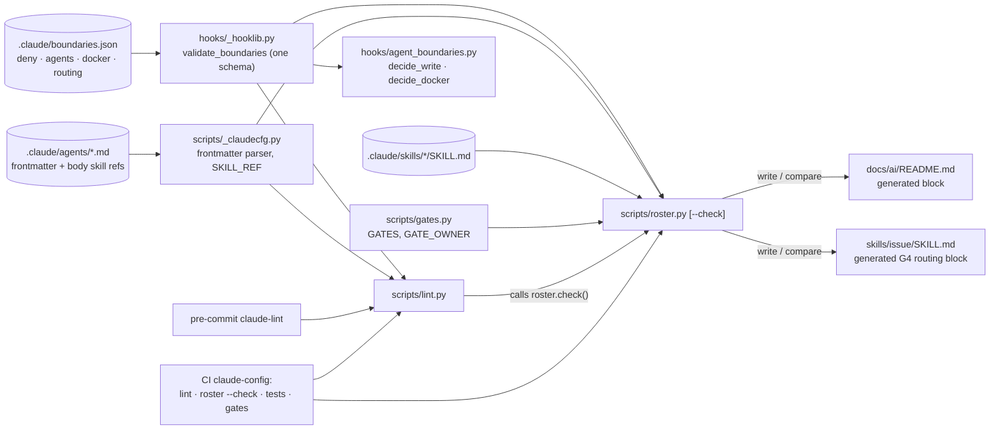

# Architecture note – generated roster, Docker allow-list as config, `Docs:` line in G7 (issue #76)

## Context

After #74 split the implementers, `docs/ai/README.md` went stale ("11 agents / 16 skills", pre-split lanes) and nothing caught it. Issue #76 makes the roster section a generated block, moves the per-agent Docker allow-list from `agent_boundaries.py` into `.claude/boundaries.json`, and adds a `Docs:` line to the G7 PR body. Inputs: G1 `docs/requirements/phase-0/roster-docs.md` (Stories 1 to 6, implementation notes 1 to 3).

This is agent tooling. No product module, `*.Contracts` type, Wolverine message, endpoint, schema or cross-module dependency changes. What changes is a **config data flow**: Docker regexes become data that the fail-closed hook reads, and one file feeds both enforcement and docs. That is why this note carries PASS and not N/A. No ADR is needed. ADR-0010 and ADR-0011 are unaffected, and the decisions below are tooling mechanics, recorded here.

## C4 excerpt (tooling, not product)



## Decisions

### D1. Docker allow-list: top-level `docker` key; regexes validated as data

Shape (sibling of `deny` and `agents`, as G1 note 3 proposes; `agents.<name>` stays a plain glob list, so `decide_write` and every lane entry are unchanged):

```json
"docker": {
  "platform-dev": [
    { "label": "ps", "pattern": "(ps|container (ls|ps))\\b" },
    { "label": "logs (no -f)", "pattern": "(logs|container logs)\\b(?!.*(\\s-[a-z]*f|--follow\\b))" },
    { "label": "port", "pattern": "(port|container port)\\b" },
    { "label": "volume ls", "pattern": "volume ls\\b" }
  ],
  "devops": [ "... the five current devops patterns, each with a label ..." ]
}
```

- The patterns move byte-for-byte (JSON-escaped). The G6-74-06/09 rationale comments move into `$comment`. The `label` is what the roster renders: raw regexes contain `|`, which breaks Markdown table cells. Labels are documentation only and never enforced; that limit is stated below.
- **Validation lives in `_hooklib.validate_boundaries`**, so the hook and lint share one schema, as today. `_TOP_KEYS` gains `docker` and `routing`. Both keys are optional to the schema. Lint requires them in the real file, because the roster needs them. Rules, each raising `ConfigError`:
  1. `docker` is an object whose keys are a subset of `agents` keys (no entry for an unlisted agent). Each value is a non-empty list of objects with exactly `label` and `pattern`, both non-empty strings. `label` is ≤ 40 chars with no `|`, backtick, `"` or newline (safe in Markdown and Mermaid). `pattern` is ≤ 200 chars.
  2. `re.compile(pattern)` succeeds; `re.error` becomes `ConfigError("docker.<agent>[<i>]: pattern does not compile")`. Compilation happens on every load (hook and lint), not only at lint time, so a bad pattern can never reach `decide_docker` uncompiled.
  3. **Anchoring.** The hook keeps `re.match` (anchored at the start of the normalised subcommand, open at the end so arguments follow). Config patterns must therefore begin with a literal subcommand: `^\(?[a-z]`. That rejects `.*`, `^`, `\w`, `\S` and similar leading wildcards. Inline flag groups (`(?i)`, `(?s)`, and so on; regex `\(\?[aiLmsux]`) are rejected. Lookaheads `(?!`/`(?=` stay allowed.
  4. **Forbidden-probe check (keeps #74 R-01 true by construction).** No pattern may `re.match` any fixed probe: `""`, `inspect x`, `container inspect x`, `exec x sh`, `container exec x`, `cp x:/a b`, `run alpine`, `rm x`, `stop x`, `volume rm x`, `volume prune`, `system prune`, `compose config`, `compose exec x`, `compose run x`, `compose down -v`, `compose down -vt1`, `compose down --volumes`, `compose down --rmi all`, `logs -f x`, `logs --follow x`, `compose logs -f`. The probes live in `_hooklib` next to the schema. The current patterns pass all of them.
- **Fail closed.** `decide_docker(command, agent, allow=None)` and `decide_bash(payload, agent, config=None)` keep their current call shapes; the new parameter is optional, so `test_agent_roster.py` runs unchanged. `main()` passes the validated config. When it is `None` (file unreadable or any schema error, including a malformed `docker` key), `decide_docker` loads it through `lib.load_boundaries()`. If that raises **and** the command contains at least one Docker invocation, the `ConfigError` propagates, and `main()` denies with `fail_closed_reason` and the audit record `deny-error`. The socket check runs first and needs no config. Non-Docker Bash keeps today's behaviour when config is broken: the #39 command policy is code, not config. Writes already fail closed on a broken config. A listed agent with no `docker` entry gets `[]`, so every Docker command is denied, as today.
- **Limits.** Labels can disagree with patterns; G3/G6 review covers this, because `boundaries.json` is already in `REVIEW_REQUIRED_PATHS`. The probe set cannot prove a pattern safe, only that it does not match the known-bad forms. Catastrophic backtracking is bounded by `MAX_COMMAND` and by reviewed authorship, not by the validator.

### D2. G4 routing: a declared `routing` key, not derived from lanes; the skill table is generated

Lanes cannot yield routing: they overlap (`src/Decisya.AppHost/**` belongs to platform-dev and devops; `tests/Decisya.Identity.Tests/**` to platform-dev and identity-dev; `tests/Decisya.Api.Tests/**` to backend-dev and identity-dev), and they cannot express intent ("business endpoints" as opposed to `Authentication/**`). Routing is therefore declared in `boundaries.json`, next to the lanes it must agree with:

```json
"routing": {
  "G4": [
    { "agent": "backend-dev", "summary": "modules, API endpoints", "paths": "`src/Modules/**`, `src/Decisya.Api/**` (business endpoints), ..." },
    { "agent": "platform-dev", "summary": "AppHost, containers", "paths": "..." },
    { "agent": "identity-dev", "summary": "BFF, JWT, realm", "paths": "..." },
    { "agent": "frontend-dev", "summary": "UI", "paths": "..." },
    { "agent": "devops", "summary": "CI, devcontainer", "paths": "..." }
  ]
}
```

- The rows are the five rows of today's skill table, in the same order. `summary` feeds the diagram edge label and the roster's Gate(s) column. `paths` is the Markdown cell.
- Validated in `validate_boundaries`: only the `G4` key; each `agent` is in `agents`; `summary` follows the same character rules as a Docker `label`. Lint adds a consistency check: **every backticked path in `paths` must equal one of that agent's lane globs, or be matched by one** (`glob_to_regex`). A route to an agent that cannot write there fails lint.
- **Consistency with the issue skill:** the G4 routing table in `.claude/skills/issue/SKILL.md` becomes a second generated block, rendered from the same `routing.G4` rows. The main session moves it out of the numbered list into a column-0 subsection `### G4 routing` (generated), and step 2's G4 bullet points to it. `roster.py --check` covers both files, so the skill table and the diagram cannot drift apart.
- Known mismatch, not fixed here: `gates.py` `GATES` names the G4 owner "backend/platform/identity/frontend-dev" without devops. The roster reads its G1/G2/G3/G5/G6 owners from `GATE_OWNER` and its G4 owners from `routing`, so the text is never parsed.

### D3. `roster.py`

- **Location and runtime:** `.claude/scripts/roster.py`, stdlib only (`json`, `re`, `pathlib`, `sys`, `argparse`). Usage: `python .claude/scripts/roster.py` writes; `--check` compares and never writes.
- **Inputs:** `boundaries.json` through `_hooklib.load_boundaries()` (one schema); `.claude/agents/*.md` (frontmatter `name`, `model`, `tools`; body skill references); `.claude/skills/*/SKILL.md` (frontmatter `name`, `description`); `gates.py`'s `GATES` and `GATE_OWNER` (imported, since the module has no import-time side effects).
- **Shared parsing:** a new `.claude/scripts/_claudecfg.py` holds a pure `parse_frontmatter(text) -> (dict, body_start, problems)` and `SKILL_REF`. `lint.py` and `roster.py` both import it, so lint's dangling-reference check and the roster's skill column cannot disagree.
- **Skills per agent:** the backticked `` `<name>` skill `` references (`SKILL_REF`) in the agent **body** (after the frontmatter), deduplicated. Checked against today's agents, this reproduces the hand-written column exactly. A frontmatter `skills:` key is rejected: Claude Code preloads the named skills, so it would change agent behaviour, not just the docs. Lint's frontmatter rules restrict skills, not agents, but this issue should not change runtime. Limit: a negated reference ("not the `x` skill") counts as a use. Agents are written by the main session, and review catches it.
- **Markers.** Two blocks, each delimited by its own-line comments that `GATE_LINE` cannot match:
  - `docs/ai/README.md`: `<!-- roster:begin (generated by python .claude/scripts/roster.py; do not edit) -->` … `<!-- roster:end -->`. The block replaces today's §4 agent table and the §5 skill table with: the agent table; a skill table (Skill | Used by | Purpose, the first sentence of the frontmatter description; the "Needs first" column is dropped in favour of a pointer to `prereqs.py`, which is the source); the gates→agents diagram; the agents→skills diagram. The counts in the §2 file tree ("11 agents", "16 skills") move inside the block or are removed from the hand-written text.
  - `.claude/skills/issue/SKILL.md`: `<!-- routing:begin (generated …) -->` … `<!-- routing:end -->`.
  - Exactly one begin and one end marker, in that order. Anything else exits 2 naming the file. Bytes outside the markers are never touched.
- **Determinism:** no timestamps, counts or paths from the environment. Agents are ordered by first gate (G1 … G6, G4 in `routing` order), then agents with no gate, by name. Skills are sorted by name. Lanes, tools and Docker labels keep their source order, which is file content and therefore stable. Output is LF. On write, the file's existing newline style (CRLF or LF) is kept. `--check` normalises `\r\n` to `\n` before comparing, so a Windows checkout with `autocrlf` does not fail.
- **Table columns:** Agent · Model · Gate(s) (from `GATE_OWNER`, plus `G4: <summary>` from routing, else —) · May write (lane globs in code spans) · Docker (labels, else —) · Skills · Tools beyond Read/Grep/Glob (frontmatter order; `Bash(x*)` rendered as `` `x*` ``).
- **Mermaid (GitHub-renderable):** fenced ```` ```mermaid ```` blocks, `flowchart LR`. Node ids are `[a-z0-9_]` (hyphens become `_`); labels are quoted `["…"]`, with `"` escaped as `#quot;`.
  - Gates→agents: a chain `G0 --> … --> G7`; `G0`, `G4`'s evidence step and `G7` link to one `main session` node; each agent gate links to its `GATE_OWNER` agent; `G4 -->|summary| <agent>` once per routing row. `classDef sec` is applied with `class G3,G6 sec` (G1 note 2).
  - Agents→skills: one edge per (agent, named skill). Skills that no agent names (today only `issue`) are omitted from the diagram and appear in the skill table with "Used by: you (`/<name>`)" when `disable-model-invocation: true`, or "—" otherwise.
- **`--check`:** exit 0 when both blocks match. Otherwise exit 1 with `roster: docs/ai/README.md is stale; run: python .claude/scripts/roster.py`, naming the stale file(s). A `ConfigError` exits 1 with `run python .claude/scripts/lint.py`.
- **Wiring:**
  - `lint.py` calls `roster.check()` and reports its message as a problem. That puts it inside the pre-commit `claude-lint` hook (Story 3's wording).
  - The hook's `files:` becomes `^(\.claude/|CLAUDE\.md$|docs/ai/README\.md$)`, so a hand edit to the generated block also triggers it.
  - CI `claude-config` gains a named step after "Lint Claude Code config": `Roster is current` → `python3 .claude/scripts/roster.py --check`. The duplicate run costs milliseconds and gives CI a step named after the failure.
- `REVIEW_REQUIRED_PATHS` widens `scripts/(gates|lint)\.py` to `scripts/(gates|lint|roster|_[a-z]+)\.py`, because `roster.py` and `_claudecfg.py` now feed lint.

### D4. `Docs:` line in G7: required by manifest novelty, not by presence

Rule (in `check_gate` for `G7`, applied only when its status is `passed`): the `Docs:` line is **required** when either condition holds.

1. `n >= DOCS_LINE_FROM` (a constant, `76`), **or**
2. the manifest is **absent from `origin/main`** (`git cat-file -e origin/main:docs/ai/pipeline/<n>.md` fails), which is true for every issue branch, because each issue adds its manifest. This test runs only when git answers; `origin` is already fetched by `changed_files()`, and CI checks out with `fetch-depth: 0`.

Why this rule: leaving the line out cannot switch the check off. Every earlier manifest (#14 to #74) is on `main` and numbered below 76, so none is affected (Story 5, scenario 4). #76 dogfoods it. Condition 2 also covers an old-numbered issue started after this ships. A template marker alone was rejected: deleting the marker is the same bypass as leaving out the line.

Syntax:
- Searched only inside `## G7 PR body draft` (up to the next `## ` heading), outside code fences.
- One line matching `^(\*\*)?Docs:(\*\*)?\s+(.+)$`.
- The value is either `none: <reason>` (non-empty reason), or a comma-separated list of repository-relative POSIX paths (`artifact_path_problem`-style: no drive letter, no leading `/`, no `..`).
- A value starting with `<` (the template placeholder) fails.
- `init()` writes `Docs: <files touched, or none: reason>` under the G7 heading. The issue skill's G7 step and README §3 name the line.

Failure message: `G7: PR body draft has no 'Docs:' line (files touched, or 'none: <reason>')`.

Limits:
- The paths are checked for syntax, not for truth. Listing the wrong docs is caught only in Marco's review; comparing against `changed_files()` would be noisy, because manifests and requirements are always docs.
- Offline, with no `origin/main`, only condition 1 applies. An old-numbered issue is then unchecked locally but checked in CI.
- After merge the manifest is on `main`, so condition 2 no longer fires. That is harmless: the line was checked at PR time, and condition 1 still holds for n ≥ 76.
- `DOCS_LINE_FROM` sits in `gates.py`, which is in `REVIEW_REQUIRED_PATHS`.

### D5. Migration, owners, rollback

**Migration.** One PR, in this order, with the unchanged tests green after each step:
1. `_hooklib` schema accepts optional `docker` and `routing`, with the D1 and D2 rules and probes.
2. `boundaries.json` gains both keys, and `DOCKER_ALLOW` is deleted from the hook, which now reads config (`test_agent_roster.py` passes unchanged).
3. `_claudecfg.py` is extracted and `lint.py` switches to it (`test_lint.py` unchanged).
4. `roster.py` is added, the markers go into both files, and the blocks are generated.
5. Wiring: lint calls roster, the pre-commit `files:` pattern widens, the CI step is added, `REVIEW_REQUIRED_PATHS` widens.
6. `gates.py` gets the Docs rule and `init` template, and the skill and README text is updated, including §7 "Changing the setup": the Docker allow-list and G4 row now go in `boundaries.json`, then run `roster.py`.

No historical manifest, review or ADR is rewritten.

**Owners.**
- The main session owns everything in the G4 scope: `.claude/**`, `docs/ai/**`, the `.pre-commit-config.yaml` and `ci.yml` edits (manifest G4 note). `.claude/tests/**` is outside test-engineer's `tests/**` lane, so the main session writes the tests from G5's traceability.
- Going forward, `docs/ai/**` is the main session's and runbooks and onboarding are tech-writer's (Story 6). The generated blocks are owned by `roster.py`: they are never edited by hand.

**Rollback.** Revert the PR; no data and no runtime state are involved. The revert must be **atomic**: an old hook (with `_TOP_KEYS` = `$comment, deny, agents`) reading a new `boundaries.json` fails validation, and every listed agent's writes are denied (fail closed; safe, but it blocks G4). Manifests created meanwhile keep a harmless `Docs:` line. Partial rollback, if the roster check proves noisy: remove the `roster.check()` call from lint and the CI step. That leaves enforcement (D1) untouched.

## Verification (for the manifest's local/CI table)

| Check | Local (VS 2026: *View → Terminal*) and CLI | CI |
| --- | --- | --- |
| Schema, probes, routing↔lane | `python .claude/scripts/lint.py` | claude-config: Lint |
| Roster current | `python .claude/scripts/roster.py --check` | claude-config: Roster is current |
| Docker and lane regressions, roster red/green, Docs rule on #14–#74 and a fresh `init` | `python -m unittest discover -s .claude/tests -p "test_*.py"` | claude-config: Test hooks |
| Gates for #76 (including its own Docs line) | `python .claude/scripts/gates.py 76` | claude-config: Pipeline gates |
| Mermaid renders | PR "Files changed" → `docs/ai/README.md` (manual) | — |

## Tests to add (G5 / main session; no NetArchTest)

No assembly boundary changes, so no NetArchTest rule. The `.claude/tests` cases this design needs:
- `validate_boundaries` rejects each of the following, and both lint and the hook react: a non-compiling pattern; a leading wildcard; an inline flag; a probe-matching pattern such as `"(inspect|ps)\\b"`; a `docker` or `routing` entry for an unlisted agent; a label containing `|`.
- With a malformed `docker` key, `docker ps` by platform-dev is denied as `deny-error`, and `dotnet build` is not affected.
- A `routing` path outside the agent's lane fails lint.
- The roster is idempotent (two runs, no diff) and does not depend on enumeration order (shuffled glob results).
- `--check` is red on a stale block for each change type named in Story 3 (agent, lane, tool, skill, Docker entry) and green after regeneration. CRLF is tolerated.
- Marker errors (none, duplicated, reversed) exit 2.
- Docs rule: fails with no line or with the placeholder; passes with `none: x` or a path list; the manifests of #14, #15, #17, #32, #35, #36, #39, #41, #56, #59, #72 and #74 give unchanged results.

<!-- gate: G2 | verdict: PASS | issue: #76 -->
