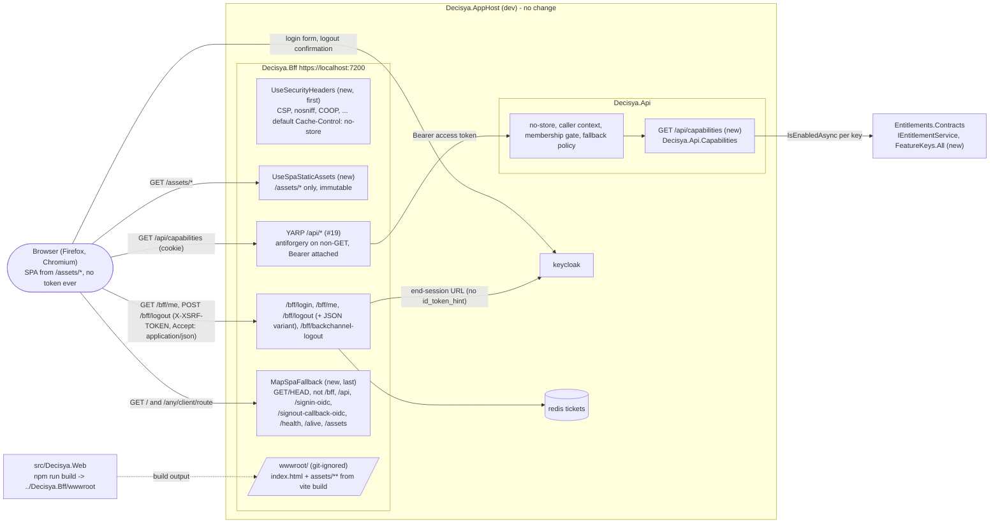

# Architecture note – React SPA shell with capability manifest (issue #26)

## Context

#26 (0.14) puts the first browser UI on the platform. It adds:
- `src/Decisya.Web`: a Vite + React + TypeScript SPA, built to static files and served by `Decisya.Bff` at `/` on the same origin (G1 Q2).
- `GET /api/capabilities` on `Decisya.Api`: the capability manifest (G1 Q1). It moves the manifest out of `/bff/me`, so ADR-0008 needs an amendment.
- A JSON variant of `POST /bff/logout` (G1 Q4), and the post-logout landing on `/`.
- The ADR-0008 no-entitlement marker and its endpoint-metadata test. This is the first issue that needs them (#25 G2 carry-forward).
- Security headers and a strict CSP on every BFF response (NFR-42).
- Playwright (`firefox`, `chromium`) against the real AppHost, with axe (NFR-40).

**Done when:** a Playwright login flow passes in Firefox and Chromium, and axe reports zero violations.

Inputs:
- `docs/ai/pipeline/26.md`: Marco's decisions of 2026-10-03, G1 answers Q1-Q6, and the carry-forwards (#58 C-1 to C-6, #23 C-3, #25 marker).
- `docs/requirements/phase-0/spa-shell.md`: Stories 1-8, NFR-40 to NFR-42.
- ADR-0002, ADR-0003, ADR-0008, ADR-0011, and the notes `bff-session.md` (#18), `bff-api-forwarding.md` (#19) and `admin-api.md` (#25).
- Code read on `issue/26-spa-shell`:
  - `Decisya.Bff`: `Program.cs`, `Endpoints/BffEndpoints.cs`, `MeResponse.cs`, `Proxy/*`, `Security/*`, `Session/OidcOptionsSetup.cs`, `Session/CookieOptionsSetup.cs`.
  - `Decisya.Api`: `Program.cs`, `Authentication/*`.
  - Modules: Tenancy's `TenantMembershipMiddleware` and `TenancyModule`, `AdminModule`, Entitlements' `IEntitlementService`, `FeatureKeys`, `FeatureKey`, `EntitlementService` and `PlanCatalog`.
  - The AppHost, `.github/workflows/ci.yml`, `.gitignore`, `.node-version`, `.claude/boundaries.json`.
  - The repo-scanning tests: `RealmGuardTests`, `NoSensitiveEfSwitchesTests`, `ApiBoundaryTests`, `AppHostConfigurationTests`.
  - `EndpointAuthorizationTests`, `LogoutTests`, `BffLoginFlowTests` and `GettingStartedAdminDocTests`.
- `gh issue view 26 --comments` was not run (no shell in this session). The carry-forwards come from the manifest.

**ADR: [ADR-0008 amendment 1](../adr/0008-spa-capability-manifest.md#amendment-1-issue-26-the-manifest-is-get-apicapabilities-not-bffme) (Accepted, Marco 2026-10-03).** It does three things:
- it moves the manifest to `GET /api/capabilities`;
- it changes the staleness rule to "re-fetch `/api/capabilities` once on a 403";
- it names the marker type.

Everything else implements ADR-0003 and ADR-0008 as written. No other ADR is needed (see Decisions).

## C4 excerpt



```mermaid
sequenceDiagram
  participant B as Browser (SPA)
  participant F as Decisya.Bff
  participant A as Decisya.Api
  participant K as Keycloak
  B->>F: GET / (fallback) -> index.html, CSP, no-cache
  B->>F: GET /bff/me
  F-->>B: 200 {isAuthenticated,...} + __Host-decisya-xsrf
  alt signed in
    B->>F: GET /api/capabilities (cookie)
    F->>A: GET /api/capabilities (Bearer)
    A->>A: membership gate (tenant user only), IsEnabledAsync x N (sequential)
    A-->>B: 200 {"capabilities":{...}} no-store, or 500 generic (never partial)
  end
  B->>F: POST /bff/logout, X-XSRF-TOKEN, Accept: application/json
  F->>F: antiforgery, lock, Keycloak end-session (B-2), cookie sign-out (ticket deleted)
  F->>F: OIDC SignOutAsync -> 302 Location built; rewritten to 200 JSON
  F-->>B: 200 {"redirectUri":"<end-session URL, client_id, post_logout_redirect_uri, state>"}
  B->>K: window.location.assign(redirectUri)
  K-->>B: logout confirmation page (D3 of #18), user confirms
  K->>F: GET /signout-callback-oidc?state=...
  F-->>B: 302 / (RedirectUri "/", new)
```

## Projects and ownership

| Path | Kind | G4/G5 owner |
| --- | --- | --- |
| `src/Modules/Entitlements/Decisya.Modules.Entitlements.Contracts/FeatureKeys.cs` (`All`) and `IEntitlementService.cs` (doc reference) | **written at G2** | architect (done) |
| `docs/adr/0008-spa-capability-manifest.md` (amendment 1, Accepted, Marco 2026-10-03) and `docs/adr/README.md` | **written at G2** | architect (done) |
| `src/Decisya.SharedKernel/Authorization/NoEntitlementRequiredAttribute.cs` | new | backend-dev |
| `src/Decisya.Api/Capabilities/` (`CapabilitiesEndpointRouteBuilderExtensions.cs`, `CapabilitiesResponse.cs`) | new | backend-dev |
| `src/Modules/Tenancy/Decisya.Modules.Tenancy/Endpoints/TenancyEndpoints.cs`, `src/Modules/Admin/Decisya.Modules.Admin/Endpoints/AdminEndpoints.cs` (marker on each group) | changed | backend-dev |
| `src/Decisya.Api/Program.cs` (`app.MapCapabilities()`), `src/Decisya.Api/Authentication/WhoAmIEndpointRouteBuilderExtensions.cs` (marker) | changed | identity-dev |
| `src/Decisya.Bff/**`: `Program.cs`, `Endpoints/BffEndpoints.cs` (logout), new `LogoutResponse.cs`, new `Security/SecurityHeaders.cs`, new `Spa/SpaHosting.cs`, `BffLog` (one message), `MeResponse.cs` (doc comment only) | changed / new | identity-dev |
| `src/Decisya.Web/**`: app, configs, `e2e/` | new | frontend-dev (files); Marco (`.npmrc`, installs, lockfile) |
| `.github/workflows/ci.yml` (SPA lane) | changed | devops |
| `.gitignore` (one line) | root file | orchestrator (no agent lane covers it) |
| `docs/GETTING-STARTED.md` | changed | tech-writer (or the orchestrator) |
| `tests/**` (rules and behaviour tests below, plus the G4 fix-ups) | new / changed | test-engineer |
| `src/Decisya.AppHost/**`, `deploy/**`, the migrator, `Directory.Packages.props` | **unchanged** | platform-dev: nothing to do |

**NuGet packages: none.** Static files, file providers and `Microsoft.Net.Http.Headers` are part of `Microsoft.AspNetCore.App`.

**npm packages:**
- the Q6 list;
- plus three type-only packages that the Q6 list cannot work without: `@types/react`, `@types/react-dom` and `@types/node` (D8; **confirmed, Marco 2026-10-03**).

## 1. The capability manifest: `GET /api/capabilities` (Q1)

**D1: the endpoint lives in `Decisya.Api`, namespace `Decisya.Api.Capabilities`, and is owned by backend-dev.** Options:
- **In Entitlements.** Rejected: G4-23-02 (no ASP.NET Core in Entitlements) stays. It is the module's cheapest reachability guarantee, and #25 kept it for the same reason.
- **In `Modules.Admin`.** Rejected: that module is the platform-admin surface, with a policy every route inherits.
- **A new module.** Rejected: one endpoint, no persistence and no state is not a module (#84).
- **In `Decisya.Api`, beside `/api/whoami`.** **Chosen.** The host already composes the modules. The endpoint uses only `Entitlements.Contracts` types and mints nothing, so `ApiBoundaryTests.Only_CallerContextMiddleware_mints_a_tenant_resolution_in_Decisya_Api` passes unchanged. `Decisya.Api.csproj` keeps its five references.

**Shape.** `public static IEndpointRouteBuilder MapCapabilities(this IEndpointRouteBuilder endpoints)` maps `GET /api/capabilities`:

```csharp
endpoints.MapGet("/api/capabilities", async (IEntitlementService entitlements, CancellationToken cancellationToken) =>
{
    var capabilities = new Dictionary<string, bool>(FeatureKeys.All.Count, StringComparer.Ordinal);
    foreach (var key in FeatureKeys.All)
    {
        // Sequential on purpose: one scoped EntitlementsDbContext per request, never concurrent.
        capabilities[key.Value] = await entitlements.IsEnabledAsync(key, cancellationToken).ConfigureAwait(false);
    }

    return TypedResults.Ok(new CapabilitiesResponse { Capabilities = capabilities });
})
.WithMetadata(new NoEntitlementRequiredAttribute());
```

- **Authorization:** the **fallback policy**: authenticated, with a `sub` claim, on JwtBearer (#20 D2), exactly as `/api/whoami`. **No `.RequireAuthorization()`.** That call would replace the fallback with the default policy, which lacks the `sub` requirement.
- **No `try`/`catch` and no `Task.WhenAll`.** An exception from `IsEnabledAsync` (a database failure, cancellation) propagates to `UseExceptionHandler`. The client gets the generic #20 500 (`status`, `title`, `traceId`), and the detail goes only to the log, with the trace id. The body is written only after the loop completes, so a partial manifest cannot exist (#23 C-3, NFR-41).
- **`IEntitlementService` comes from DI** (scoped, the one registration `AddEntitlementsModule` makes). The endpoint never constructs it, and the policies of later gated endpoints resolve the same registration (ADR-0008).
- **Order** follows `FeatureKeys.All`. Tests compare the JSON semantically, never as a string.
- **`CapabilitiesResponse`** is `public sealed record` in `Decisya.Api.Capabilities`, with one property `public required IReadOnlyDictionary<string, bool> Capabilities { get; init; }`. It is a host wire DTO like `WhoAmIResponse`, not a module Contract.
  - The keys are serialized as-is: the web defaults set no `DictionaryKeyPolicy`. The Api must never set one (test).
- **Caching:** `Cache-Control: no-store` comes from `UseNoStoreResponses` (#25), on 200, 401, 403 and 500 alike. The endpoint sets no header of its own.
- **Telemetry:** no new instrument. Each evaluation already counts in `decisya.entitlements.evaluations` (#23). The Api adds no log line.

**Membership gate and caller kinds (fixed):**

| Caller | Pipeline | Response |
| --- | --- | --- |
| anonymous, or an expired/invalid token | JwtBearer + fallback policy | 401, no body, `WWW-Authenticate: Bearer` (#20). Through the BFF, its own route policy answers 401 first |
| invalid identity or malformed `tenant_id` | `CallerContextMiddleware`, pre-routing | 403 generic (#21) |
| tenant user (`Tenant`) | **membership gate runs** (no `SkipTenantMembership`): JIT provisions the tenant on the first call, or refuses | refused: 403 generic. Otherwise 200 with the evaluated keys |
| platform admin (`None`, `IsPlatformAdmin`) | gate does not run for `None` (#21) | 200, every key `false` (`EntitlementService` denies `None` before any query) |
| a realm user with no `tenant_id` and no admin role (`None`) | same | 200, every key `false` |

Why the gate stays on:
- the manifest reads tenant data, so it gets the same membership check as every later gated endpoint;
- it is the shell's first `/api` call after sign-in, so it provisions dev-alice's tenant without a separate step. That also simplifies #25's smoke check.

The opt-out set in `EndpointAuthorizationTests` stays exactly `/api/whoami` plus the three admin routes.

**D2: `FeatureKeys.All` (written at G2) is the key list.** `PlanCatalog` is internal, and `IEntitlementService` stays pinned to one method (#25 rule), so the Contracts expose the list.
- `All` lists only catalog keys: an unknown or malformed key can never appear (G1 Story 4).
- A key added to `FeatureKeys` must be added to `All` and to the catalog. A test pins all three together, so the manifest follows with no SPA change.

**D3: the ADR-0008 no-entitlement marker is `Decisya.SharedKernel.Authorization.NoEntitlementRequiredAttribute`.**

```csharp
namespace Decisya.SharedKernel.Authorization;

/// <summary>ADR-0008 (amendment 1): endpoint metadata stating that an /api endpoint is deliberately not gated by a feature key.
/// Every /api endpoint carries this marker or an entitlement policy; Decisya.Api.Tests enumerates them.</summary>
[AttributeUsage(AttributeTargets.Class | AttributeTargets.Method | AttributeTargets.Delegate, Inherited = false, AllowMultiple = false)]
public sealed class NoEntitlementRequiredAttribute : Attribute;
```

- **Why SharedKernel:** Tenancy, Admin and the Api all need it.
  - In Entitlements.Contracts, it would add a Tenancy → Entitlements.Contracts edge, next to the existing Entitlements → Tenancy.Contracts one, only for a marker.
  - `AllowCrossTenantAttribute` is the precedent: a platform-wide marker in SharedKernel with no dependency.
  - The future feature-policy metadata (it carries a `FeatureKey`) belongs in Entitlements.Contracts, with the first gated endpoint.
- **Applied with `.WithMetadata(new NoEntitlementRequiredAttribute())`** on:
  - the `/api/tenancy` group (inside `TenancyEndpoints.Map`);
  - the `/api/admin` group (inside `AdminEndpoints.Map`; the #25 carry-forward);
  - `/api/whoami`;
  - `/api/capabilities`.
- **The marked set is exactly seven endpoints:** `GET /api/whoami`, `GET /api/tenancy/me`, `GET /api/tenancy/members`, the three admin routes and `GET /api/capabilities`.

## 2. Logout: the JSON variant and the landing on `/` (Q4)

**D4: the endpoint runs the OIDC sign-out itself, then either leaves the handler's 302 alone or rewrites it into 200 JSON.** The handler stays the only code that builds the end-session URL, including `state`, `client_id` and the absent `id_token_hint`.

`MapLogout` changes only after the existing `finally` block. Antiforgery (group filter), `RequireAuthorization()`, the refresh lock, the B-2 Keycloak end-session call and the cookie sign-out that deletes the ticket all stay as they are:

```csharp
var properties = new AuthenticationProperties { RedirectUri = ReturnUrlValidator.Default }; // "/" (was "/signout-callback-oidc")
await context.SignOutAsync(OpenIdConnectDefaults.AuthenticationScheme, properties).ConfigureAwait(false);
// OidcOptionsSetup's OnRedirectToIdentityProviderForSignOut still clears IdTokenHint (D3 of #18).

context.Response.Headers.Vary = HeaderNames.Accept;
if (!WantsJson(context.Request))
{
    return Results.Empty;                      // the handler's 302 + Location, unchanged (#18 Story 6)
}

var location = context.Response.Headers.Location.ToString();
EnsureEndSessionLocation(location, ...);       // throws InvalidOperationException (fixed message, no URL) -> generic 500
context.Response.Headers.Location = StringValues.Empty;
return Results.Json(new LogoutResponse(location), statusCode: StatusCodes.Status200OK);
```

- **`WantsJson`.** True iff `Request.GetTypedHeaders().Accept` contains a media type equal (ordinal, ignore case) to `application/json` whose quality is absent or greater than 0.
  - `*/*`, `application/*` and `application/problem+json` do **not** count.
  - A browser form post or a client with no `Accept` header (every #18/#19 test, `HttpClient`'s default) keeps the 302.
- **`EnsureEndSessionLocation`** requires all of these, or the request ends in a 500:
  - the status is 302;
  - `Location` is an absolute URI;
  - its scheme is `https`, or `http` only when `OpenIdConnectOptions.RequireHttpsMetadata` is false (the existing Development + loopback relaxation);
  - its scheme, host and port equal those of `BffOptions.Oidc.Authority`.

  By then the session is already gone, which is the same "fail after local logout" behaviour as a `RemoveAsync` failure (#18).
- **`LogoutResponse`** is `internal sealed record LogoutResponse(string RedirectUri)` in `Decisya.Bff`, next to `MeResponse`. It serializes to exactly `{"redirectUri":"..."}`. `Content-Type: application/json; charset=utf-8`. `Cache-Control: no-store` comes from the global default (§3).
- **What `redirectUri` contains:** Keycloak's `end_session_endpoint` (from discovery) with `client_id=decisya-bff`, `post_logout_redirect_uri=https://localhost:7200/signout-callback-oidc` and `state` (the Data-Protection-protected `AuthenticationProperties`, which holds `RedirectUri="/"`). It may also carry the handler's `x-client-SKU`/`x-client-ver` telemetry parameters, as the 302 does today. It never contains `id_token_hint` or a token value.
- **Unchanged responses:** 401 (no session) and 403 (antiforgery) are the same in both variants. The `Set-Cookie` that clears `__Host-decisya-session` is in both. Exactly one Keycloak end-session call happens in both.
- **Landing on `/`.** `post_logout_redirect_uri` stays the realm-registered `/signout-callback-oidc`. **No realm change.** Only `RedirectUri` moves to `/`:
  - The handler's signed-out callback unprotects `state` and redirects to `/`.
  - Today it redirects to `/signout-callback-oidc` a second time (no state), which then falls through to `SignedOutRedirectUri` (`/`). The double hop disappears.
- **The #18 tests stay true unchanged.** `BffLoginFlowTests` (302, cleared cookie, `Location` without `id_token_hint`, with `client_id`), `LogoutTests` (302 ×3, ticket deleted, end-session counted), `AntiforgeryTests`, `TokenLeakScanTests` and `LogScanTests` all send no `Accept` header.
- **`AuthenticationMethod` stays `RedirectGet`** (the default). A `FormPost` sign-out would write an HTML body with an inline script, which the CSP blocks and the rewrite cannot handle. A test pins it.
- **CSRF:** Unchanged, and not provided by `Accept` (a CORS-safelisted header that a cross-site `fetch` can send). The controls are the `SameSite=Strict` session cookie and the antiforgery header pair; with no CORS, no other origin can read the JSON.

**SPA side (fixed for frontend-dev):**
1. Read `__Host-decisya-xsrf` from `document.cookie`, only after `/bff/me` has answered.
2. `fetch('/bff/logout', { method: 'POST', credentials: 'same-origin', headers: { 'X-XSRF-TOKEN': token, 'Accept': 'application/json' } })`, with no body.
3. On 200, parse `{redirectUri}`. If it is an absolute `http:` or `https:` URL, call `window.location.assign(redirectUri)`. On anything else, show the `role="alert"` failure.
4. On 403 or a network error, show the alert, stay signed in, and move focus to the alert (Story 3).
5. On 401, the session is already gone: re-fetch `/bff/me` and show the signed-out state.

## 3. Serving the SPA (Q2)

**D5: Vite builds straight into `src/Decisya.Bff/wwwroot`, which is git-ignored. The BFF serves `/assets/*` as static files and everything else through one SPA fallback endpoint.**

Options:
- **The BFF serves `src/Decisya.Web/dist`** (a second content root, or `Content` items copied at build). Rejected:
  - the BFF would carry a path into another project;
  - `dotnet publish` and `aspire publish` would need a custom MSBuild include;
  - the BFF tests would depend on the SPA's location.
- **Vite writes to `wwwroot`.** **Chosen.**
  - It is the Web SDK's own web root: `dotnet publish` and the container `PublishContainer` that `aspire publish` uses copy it with no project change.
  - The BFF code knows only "the web root".
- **An `.esproj` or MSBuild target that runs npm during `dotnet build`.** Rejected:
  - it would make every `dotnet build`, including the agents' and CI's .NET lane, run npm;
  - it would put npm under MSBuild, outside the #58 allow-list.

**Build output, per environment:**

| Where | How `wwwroot` gets the SPA |
| --- | --- |
| Marco's dev loop | `npm run build` once, before `dotnet run --project src/Decisya.AppHost` (or F5). `npm run dev` (= `vite build --watch`) rebuilds on save; reload the page to see it. **Restart the BFF after the very first build**: a web root that did not exist at start-up stays a `NullFileProvider` until restart |
| CI | The .NET lane does **not** build the SPA. The BFF tests point the host at a per-test temporary web root with fixture files (§G5), so no test reads `src/Decisya.Bff/wwwroot`. The SPA lane runs `npm run build` as a build check only |
| `aspire publish` / container | Out of scope (0.16). The pipeline must run `npm ci && npm run build` before publishing the BFF. Without it, the image serves 404 on `/` and logs the start-up warning below. Deferred to #83 |

- **`.gitignore`** gains `src/Decisya.Bff/wwwroot/` (orchestrator). `dist/` is already ignored and stays.
- **Nothing tracked may live under `wwwroot`.** Vite's `emptyOutDir: true` deletes it on every build.
- **Vite config (fixed):**
  - `outDir: '../Decisya.Bff/wwwroot'`, `emptyOutDir: true` (required: the outDir is outside the Vite root), `assetsDir: 'assets'`;
  - `publicDir: false`, so the build emits exactly `index.html` plus `assets/**`. The favicon is imported through `index.html` (`<link rel="icon" href="/src/favicon.svg">`) and lands in `assets/`. That link also stops the browser's implicit `/favicon.ico` request, which would be a failed request in the console (Story 1);
  - `assetsInlineLimit: 0`, so no `data:` URIs and `img-src 'self'` holds;
  - `modulePreload: { polyfill: false }`, so no injected polyfill code (both browsers support `modulepreload`);
  - `sourcemap: false`.
- **Start-up warning.** `BffLog.SpaIndexMissing` (Warning, fixed text, no path) is logged once at start-up when the web root has no `index.html`.

**Static files (`Decisya.Bff.Spa.SpaHosting.UseSpaStaticAssets`):**
- It is placed after `UseExceptionHandler`/`UseHsts` and **before** `SessionFixationGuard` and `UseAuthentication`, so an asset request never touches the cookie handler or Redis.
- `app.UseWhen(ctx => ctx.Request.Path.StartsWithSegments("/assets"), b => b.UseStaticFiles(options))`:
  - it serves only `wwwroot/assets/**` from `IWebHostEnvironment.WebRootFileProvider`;
  - `ServeUnknownFileTypes = false` (the default; never set it true);
  - no `UseDirectoryBrowser` and no `UseDefaultFiles`;
  - `OnPrepareResponse` sets `Cache-Control: public, max-age=31536000, immutable`, because Vite file names are content-hashed.
- **Path traversal.** `PhysicalFileProvider`, behind `WebRootFileProvider`, returns not-found for any path that resolves outside its root (`..`, encoded `%2e%2e`/`%2f`/`%5c`, absolute paths). It also excludes hidden, system and dot files (`ExclusionFilters.Sensitive`). The fallback (below) only ever opens the constant `index.html`. No code builds a file path from request data.

**SPA fallback (`SpaHosting.MapSpaFallback`, mapped last):**
- It is `app.MapFallback(handler)` with the framework's default pattern `{*path:nonfile}`, so a last segment with a dot never matches.
- **No authorization metadata.** The BFF has no fallback policy, so the endpoint is anonymous.
- **The handler, in order:**
  1. If the method is not GET or HEAD, return 404, empty. The shell is never the answer to POST and other verbs (Story 8).
  2. If the path `StartsWithSegments` any reserved prefix (ordinal ignore-case, segment-aware), return 404, empty. Reserved prefixes: `/bff`, `/api`, `/signin-oidc`, `/signout-callback-oidc`, `/health`, `/alive`, `/assets`. They live in one `static readonly PathString[]`, pinned by a test. So `/bff/does-not-exist` and an extension-less `/assets/x` get 404, never the shell.
     - `/api/*` GET/HEAD is matched by the YARP route first, and the API's own 404 passes through (#19).
     - For an `/api` verb that YARP does not list, such as OPTIONS, routing falls to this endpoint, and step 1 or 2 answers 404.
  3. `WebRootFileProvider.GetFileInfo("index.html")`. If it does not exist, return 404 with an empty body (Story 1: no path, no stack trace).
  4. Otherwise return 200 with the file stream, `Content-Type: text/html; charset=utf-8` and `Cache-Control: no-cache`.
- **No `Set-Cookie`.** The fallback never issues the antiforgery pair; only `/bff/me` does.

**D6: security headers on every BFF response (`Decisya.Bff.Security.SecurityHeaders`, `app.UseSecurityHeaders()`, first in the pipeline).** Like the Api's `UseNoStoreResponses`, it registers `Response.OnStarting`, so the 500s, 401s, redirects, proxied `/api` responses, assets and the shell all carry the headers. Headers are set only when absent, so a later, more specific value wins (assets, index.html):

| Header | Value |
| --- | --- |
| `Content-Security-Policy` | `default-src 'self'; script-src 'self'; style-src 'self'; img-src 'self'; font-src 'self'; connect-src 'self'; object-src 'none'; base-uri 'none'; form-action 'self'; frame-ancestors 'none'; frame-src 'none'; worker-src 'none'` |
| `X-Content-Type-Options` | `nosniff` |
| `Referrer-Policy` | `no-referrer` |
| `X-Frame-Options` | `DENY` (legacy companion of `frame-ancestors`) |
| `Cross-Origin-Opener-Policy` | `same-origin` |
| `Cross-Origin-Resource-Policy` | `same-origin` |
| `Permissions-Policy` | `accelerometer=(), camera=(), geolocation=(), gyroscope=(), magnetometer=(), microphone=(), payment=(), usb=()` |
| `Cache-Control` | `no-store` when nothing else set it. This also closes a small #18 gap: `/bff/me` carries the email and set no cache header |

- **No `'unsafe-inline'`, `'unsafe-eval'`, nonce or hash anywhere.** The SPA source must therefore have:
  - no inline `<script>` or `<style>` in `index.html`;
  - no `style="..."` markup;
  - no `dangerouslySetInnerHTML`;
  - no `eval` or `new Function`;
  - no React Router framework-mode components that inject inline scripts (`ScrollRestoration`, `Scripts`).

  React's `style={{…}}` prop sets CSSOM properties, which CSP allows, but the shell should not need it.
- **Navigations are not governed by CSP**, so `/bff/login` → Keycloak and `window.location.assign(redirectUri)` both work.
- HSTS is unchanged (outside Development).
- **Deferred to #83:** Trusted Types (`require-trusted-types-for 'script'`), whose browser support differs between the two Playwright projects, and a CSP reporting endpoint.

**Same-site note (for G3):**
- In dev, `https://localhost:8080` and `https://localhost:7200` are same-site (ports are ignored).
- In production, Keycloak may be cross-site. Then the first document load after the login redirect carries no `SameSite=Strict` cookie. That is harmless: the document is static and identical for everyone, and the SPA's own `fetch` calls to `/bff/me` and `/api/*` are same-site and carry the cookie. This is one reason the shell asks `/bff/me` instead of rendering identity server-side.

## 4. `src/Decisya.Web` and Playwright (Q5)

**D7: one npm project, `src/Decisya.Web`, with the E2E suite in `src/Decisya.Web/e2e/`. `tests/e2e/` stays unused.**
- Playwright resolves `@playwright/test` from the test file's own directory upward. A suite in `tests/e2e` would need its own `package.json`, lockfile, `.npmrc`, audit and install (a second supply-chain surface), or a module-path workaround.
- **Lane consequence:**
  - frontend-dev writes the E2E suite at G4 (it is the Done-when);
  - test-engineer (`tests/**`) cannot write there. At G5 it maps the scenarios to the specs and asks the orchestrator to route any change to frontend-dev;
  - aligning the lanes (`src/Decisya.Web/e2e/**` for test-engineer) is a `.claude/` change, so it goes to #83.

**Layout (frontend-dev; file names are binding where tests or scripts depend on them):**

```text
src/Decisya.Web/
  .npmrc                 Marco only (D8)
  package.json           scripts below; dependencies written by Marco's installs
  package-lock.json      Marco's install; committed
  index.html             lang="en", <title>Decisya</title>, one module script tag, favicon link; nothing inline
  vite.config.ts         D5 build options + Vitest `test: { include: ['src/**/*.test.ts'], environment: 'node' }`
  tsconfig.json          strict; include src, e2e and the config files
  eslint.config.js       flat config: typescript-eslint (recommended, type-checked), jsx-a11y (strict), react-hooks
  playwright.config.ts   below
  src/
    main.tsx, App.tsx, routes.ts     route table as plain data: path, title, feature key or null
    api/bff.ts, api/capabilities.ts  fetch wrappers; capabilities.ts holds parseManifest/isAllowed (pure, unit-tested)
    capabilities.test.ts             Vitest: absent key denied, non-200/invalid body all-denied, one re-fetch on 403
    favicon.svg, styles.css
  e2e/
    global-setup.ts      fails fast if E2E_DEV_PASSWORD is unset (names the variable, never the value)
    global-teardown.ts   scans test-results/ for the password bytes; fails if found
    audited-pages.ts     the axe page/state list (Story 6)
    *.spec.ts            login flow, admin, stubbed Pro manifest, axe, CSP and storage checks
```

**`package.json` (C-6, fixed):**

```json
{
  "name": "decisya-web",
  "private": true,
  "type": "module",
  "engines": { "node": ">=26 <27" },
  "scripts": {
    "dev": "vite build --watch",
    "build": "vite build",
    "typecheck": "tsc --noEmit -p tsconfig.json",
    "lint": "eslint .",
    "test": "vitest run",
    "test:e2e": "playwright test"
  }
}
```

- **No `preinstall`, `install`, `postinstall`, `prepare` or other lifecycle script, and no `allowScripts`.** G6 reviews the scripts (C-5).
- **No script downloads anything.** Browser installation is Marco's manual step (D8), so `npm run` stays a safe allow-listed verb for agents.
- `dev` is a watch build, not a dev server. HMR is deferred (Q2, #83). `vite build --watch` writes into the BFF web root, so the same-origin cookies and the CSP apply in dev too.
- Unit tests are `src/**/*.test.ts` (Vitest). E2E specs are `e2e/**/*.spec.ts` (Playwright `testMatch`). The two globs never overlap.
- **ESLint ignores** `node_modules`, `test-results` and `playwright-report`.

**`playwright.config.ts` (fixed rules):**
- `baseURL = process.env.E2E_BASE_URL ?? 'https://localhost:7200'`.
  - The config **throws** unless `new URL(baseURL).hostname` is `localhost`, `127.0.0.1` or `[::1]`.
  - The message says that `ignoreHTTPSErrors` is limited to the local dev certificate.
  - `ignoreHTTPSErrors: true` is set only after that check. It applies to the whole context, so Keycloak's localhost pages are covered too.
- `projects`: `firefox` (`devices['Desktop Firefox']`) and `chromium` (`devices['Desktop Chrome']`). No `webkit`, no project-level `grep` or `testIgnore`. `forbidOnly: true`, `retries: 0`, `workers: 1` (one Keycloak, shared dev users).
- `trace: 'off'`, `video: 'off'`, `screenshot: 'only-on-failure'` (Keycloak's password field renders masked), `reporter: 'list'`.
  - There is no HTML report: action titles and traces can record `fill()` values.
  - `global-teardown.ts` re-checks `test-results/` for the password.
- `globalSetup` checks that `E2E_DEV_PASSWORD` is set.
  - Tests read it through one helper and pass it only to `locator.fill()` on Keycloak's password field.
  - Never `console.log` it, never put it in a test title or `test.step` title, and never read `.env`, `secrets.json` or user-secrets.
- **Never `bypassCSP`.** The CSP check depends on the real policy. If `@axe-core/playwright` cannot inject under the CSP in either browser, report the exact error and stop: no exclusion, no bypass.
- **CSP violations:**
  - `page.addInitScript` registers a `securitypolicyviolation` listener that collects into `window`;
  - each spec asserts the list is empty at the end;
  - console errors are collected as well.
- **Keycloak login:** use the hosted form by label or role: username, password, the sign-in button. Wait for `baseURL + '/'` (or the deep link).
- **Keycloak logout confirmation (D3 of #18):**
  - after `window.location.assign`, the helper waits for either the confirmation button (`getByRole('button', { name: /log ?out/i })`), which it clicks, or a direct return to `baseURL`;
  - then it waits for `baseURL + '/'` and asserts the signed-out state and a fresh `/bff/me` with `isAuthenticated: false`;
  - the B-2 end-session call has usually ended the SSO session already, so Keycloak may skip straight to the redirect, and the helper must accept both.
- **Each test uses a fresh browser context** (the Playwright default). dev-admin uses the same `E2E_DEV_PASSWORD`: all three dev users share `DECISYA_DEV_USER_PASSWORD` in the realm file.
- **Pro variant:** `page.route('**/api/capabilities', …)` fulfils `{"capabilities":{"ledger.transactions":true,"forecasting.scenarios":true}}` in exactly one test, whose title contains `stubbed manifest`.
- **"The audited set cannot shrink" (Story 6):** a Vitest test imports `src/routes.ts` and `e2e/audited-pages.ts`, and fails unless every route path, plus the not-found and denial states, appears in the audited list.
  - `e2e/audited-pages.ts` imports nothing from `@playwright/test`, so Vitest can load it.
  - `tsconfig` covers both.

**Manifest handling in the SPA (fixed, NFR-41):**
1. `GET /bff/me`. If anonymous, show the signed-out state and make no `/api` call.
2. `GET /api/capabilities` with `Accept: application/json`.
3. `parseManifest` accepts only an object whose only property is `capabilities`, an object of booleans. Anything else, or any non-200, means "no capabilities": every gated item is hidden and the `role="status"` notice is shown.
4. A 401 re-runs step 1 once.
5. A 403 from another `/api` call triggers exactly one manifest re-fetch per page load. A 403 from `/api/capabilities` itself never does.
6. Keys the SPA does not know are ignored. Keys it knows but the manifest lacks are denied.
7. No `localStorage` or `sessionStorage` is used, for anything.

The platform-admin label comes from `/bff/me`'s `roles` (display only; the server decides).

## 5. The npm sequence (#58 C-1 to C-6) – Marco's steps

**D8: no `npm create vite`.**
- It downloads and executes the `create-vite` package. That is the `npx` path #58 denies to agents, and unreviewed code execution for Marco.
- It writes a template whose dependency ranges are unpinned and whose files would be rewritten anyway: the ESLint config, the inline-styled CSS and the counter demo.
- **Instead, frontend-dev writes every file by hand, and Marco installs.**

**Package additions beyond Q6 (confirmed, Marco 2026-10-03; type declarations only, no runtime code, no install script):**

| Package | Justification |
| --- | --- |
| `@types/react`, `@types/react-dom` | React ships no TypeScript declarations; without them `npm run typecheck` cannot type JSX. |
| `@types/node` | `playwright.config.ts`, `vite.config.ts` and `e2e/global-*.ts` use `process.env`, `fs` and `URL`; Vite and Playwright declare Node types as a peer. Pinned to the `.node-version` major (26). |

**Order (G4):**
1. **frontend-dev** writes `src/Decisya.Web/package.json` exactly as in §4, with no dependencies, plus every source and config file.
   - The first `Edit`/`Write` of `package.json` is the C-4 probe: the ask rule must prompt Marco. Marco records in G4 evidence whether it did.
   - frontend-dev runs **no** `npm` command yet.
2. **Marco** runs the steps below.
3. **frontend-dev** then runs `npm run typecheck`, `npm run lint`, `npm test` and `npm run build`, and fixes its own files.
4. **Marco** runs the E2E (§6 table).

| Step | VS 2026 | CLI (PowerShell, in `src/Decisya.Web`) |
| --- | --- | --- |
| 0. Turn off VS's automatic npm restore, so no install runs outside these steps | *Tools → Options → Projects and Solutions → Web Package Management → Package Restore*: set **Restore On Project Open** and **Restore On Save** to False. If VS 2026 names it differently, record the path in G4 evidence | — |
| 1. Check the toolchain | *View → Terminal*, then the CLI line | `node --version` (major must be 26, as `.node-version`); `npm --version`; `npm config get ignore-scripts` (must print `true`; the user-level setting) |
| 2. Create `.npmrc` **before any install** (C-1) | *Solution Explorer → Show All Files → src/Decisya.Web → Add → New Item → Text File* named `.npmrc`, with the four lines in the next column | `Set-Content -Path .npmrc -Value "ignore-scripts=true","save-exact=true","engine-strict=true","fund=false"` |
| 3. Pick the cool-down date: today minus 7 days (a release must have been public a week; mitigates a freshly compromised version) | — | `$before = (Get-Date).AddDays(-7).ToString('yyyy-MM-dd')` |
| 4. Runtime dependencies | *View → Terminal* (`cd src\Decisya.Web`), then the CLI line | `npm install --save-exact --before=$before react react-dom react-router` |
| 5. Dev dependencies | same | `npm install --save-dev --save-exact --before=$before vite @vitejs/plugin-react typescript @types/react @types/react-dom @types/node@26 eslint typescript-eslint eslint-plugin-jsx-a11y eslint-plugin-react-hooks vitest @playwright/test @axe-core/playwright` |
| 6. Audit (C-3), before any `npm run` | same | `npm audit` then `npm audit signatures`. Any High or Critical finding, or an invalid signature: **stop** and report it. Never `npm audit fix` |
| 7. Read the lockfile (C-3) | same | Run the lockfile check below. It must print no `SOURCE` line. List every `SCRIPT` line in G4 evidence (expected: at most `esbuild`, and `fsevents`, which is macOS-only and not installed). Check that `package.json` lists exactly the packages of steps 4-5, each pinned without `^` or `~` |
| 8. Browsers for Playwright (a download, not an npm script) | same | `npx --no playwright install firefox chromium` (Marco only; it uses the locally pinned Playwright) |
| 9. First build (C-2: the toolchain works with `ignore-scripts`) | same | `npm run build`. If a step fails with a missing native binary, note the package name and run `npm rebuild <that-package>` only after G6 has reviewed it (C-5); otherwise stop and report |

Lockfile check for step 7 (PowerShell, in `src/Decisya.Web`; it reads only `package-lock.json`). It prints `SOURCE <path>` for any package not from `https://registry.npmjs.org/` or without an `integrity` hash, and `SCRIPT <path>` for any package that declares an install script:

```powershell
node -e "const l=require('./package-lock.json');for(const[k,v]of Object.entries(l.packages)){if(!k)continue;if(!(v.resolved||'').startsWith('https://registry.npmjs.org/')||!v.integrity)console.log('SOURCE',k);if(v.hasInstallScript)console.log('SCRIPT',k)}"
```

- **On `ERESOLVE` (a peer-dependency conflict) in step 5:** never use `--force` or `--legacy-peer-deps`. If the conflict names `eslint`, re-run step 5 with `eslint@9`, the newest major every listed plugin supports. Otherwise stop and report the exact message.
- **Commit:** `package.json`, `package-lock.json` and `.npmrc`. Never `node_modules`, `test-results`, `playwright-report` or `src/Decisya.Bff/wwwroot` (all git-ignored).
- **The PR body** names every package with its justification line (Q6 table plus the three above), the `--before` date, the `SCRIPT` list and the browser download.

## 6. Running it, and CI

| Task | VS 2026 | CLI |
| --- | --- | --- |
| Build the SPA into the BFF | *View → Terminal*: `cd src\Decisya.Web; npm run build` | `cd src/Decisya.Web && npm run build` |
| Start the stack | F5 on `Decisya.AppHost` | `dotnet run --project src/Decisya.AppHost` |
| Open the shell | Firefox: `https://localhost:7200/` | same |
| E2E (Marco's shell only; agents never set or read the variable) | *View → Terminal*: `$env:E2E_DEV_PASSWORD = Read-Host -MaskInput 'dev password'`, then `cd src\Decisya.Web; npm run test:e2e` | same in PowerShell 7. In bash: `read -rs E2E_DEV_PASSWORD && export E2E_DEV_PASSWORD && npm run test:e2e` |

**CI (devops), `.github/workflows/ci.yml` SPA lane:**
- **Replace the existing "Playwright (firefox + chromium, axe)" step with nothing.** Playwright in CI is deferred to #83 (Q5). Without the AppHost and `E2E_DEV_PASSWORD`, `global-setup.ts` fails the job by design.
- The lane becomes: `npm ci`, `npm audit --audit-level=high`, `npm audit signatures`, `npm run typecheck`, `npm run lint`, `npm test`, `npm run build`. `npm ci` reads the committed `.npmrc`, so `ignore-scripts` holds on the runner.
- **The .NET lane does not build the SPA.** The BFF tests use a fixture web root (§G5), so the lanes stay independent, and a Web-only change still skips the .NET lane (the existing `changes` filter).
- The `realm-guard` job is unchanged (its checkout has no `node_modules`).

## HTTP contract (fixed interface)

| Route | Auth | Response |
| --- | --- | --- |
| `GET /api/capabilities` (Api; through the BFF at the same path) | fallback policy; membership gate for tenant callers; marker | 200 `application/json`, `{"capabilities":{"ledger.transactions":bool,"forecasting.scenarios":bool}}`: exactly the keys of `FeatureKeys.All`, values `true`/`false` only, no other property. 401 / 403 / 500 per §1, generic bodies. `Cache-Control: no-store` always |
| `POST /bff/logout` with `Accept: application/json` | cookie + antiforgery (unchanged) | 200 `{"redirectUri":"<absolute end-session URL>"}`, `Vary: Accept`, `no-store`; session cookie cleared and ticket deleted in the same response |
| `POST /bff/logout` without it | unchanged | 302 to the end-session URL (unchanged) |
| `GET /signout-callback-oidc?state=…` | OIDC handler | 302 `Location: /` (was a second hop through `/signout-callback-oidc`) |
| `GET`/`HEAD` any non-reserved path whose last segment has no dot | anonymous | 200 `index.html`, `text/html; charset=utf-8`, `no-cache`; 404 empty when the build is missing |
| `GET /assets/*` | anonymous | the file, `public, max-age=31536000, immutable`; 404 otherwise |
| every BFF response | — | D6 headers |

**OpenAPI: deferred again.** The `api-contract` prerequisites still fail:
- `tests/Decisya.ContractTests` does not exist;
- `gen:api` needs a generator package outside Q6.

This table, the C# response-shape test and the SPA's `parseManifest` are the contract for now. `/api/capabilities` joins the existing #83 OpenAPI entry (Admin, Tenancy).

## Decisions

- **D1 `/api/capabilities` in `Decisya.Api.Capabilities`**, under the fallback policy and the membership gate, with sequential evaluation, no catch and `no-store`: **ADR-0008 amendment 1 (Accepted, Marco 2026-10-03)**.
- **D2 `FeatureKeys.All`** in Entitlements.Contracts is the manifest's key list. No ADR: it is an additive Contracts member that the amendment names.
- **D3 `NoEntitlementRequiredAttribute`** in SharedKernel, on all seven current `/api` endpoints: **ADR-0008 amendment 1, point 5**.
- **D4 Logout JSON variant** by rewriting the handler's own 302 on an explicit `Accept: application/json`, with the landing on `/`. No ADR: it extends the ADR-0003 BFF endpoint contract additively, and every #18 behaviour holds for other callers.
- **D5 Vite → `src/Decisya.Bff/wwwroot` (git-ignored)**, `/assets/*` static files, one guarded fallback, no MSBuild-npm coupling. No ADR: it implements ADR-0008's "served by the BFF on the same origin". Publishing it is a 0.16 concern (#83).
- **D6 Security headers and a strict CSP on every BFF response**, plus `no-store` by default. No ADR: it implements ADR-0008's "allows a strict CSP" and NFR-42.
- **D7 One npm project, E2E in `src/Decisya.Web/e2e`**, Playwright against the real AppHost, password from `E2E_DEV_PASSWORD` only. No ADR. The lane gap goes to #83.
- **D8 Hand-written files, no `npm create vite`**; Marco's install sequence with `.npmrc`, `--save-exact`, a 7-day `--before` cool-down, audit, signatures and a lockfile read. The three `@types/*` additions and the cool-down are confirmed (Marco, 2026-10-03). No ADR: it applies #58.
- **D9 No AppHost, realm, migrator, `deploy/` or NuGet change.** No ADR.

## NetArchTest and static rules to add (G5 test-engineer unless noted)

| Rule | Assemblies / files | Test class |
| --- | --- | --- |
| **ADR-0008 enumeration:** every `RouteEndpoint` of the real Api host whose pattern starts with `/api`:<br>• carries no `IAllowAnonymous`;<br>• either carries `NoEntitlementRequiredAttribute` (matched by type) or has an entitlement policy. None exists yet, so the test asserts the marker and says so in its message.<br>The marked set is **exactly** the seven endpoints of D3 (verb + pattern). `/api/capabilities` has no `IAuthorizeData` (fallback policy) and no `SkipTenantMembershipMetadata`. The opt-out set stays `/api/whoami` plus the three admin routes. The anonymous set stays `/health`, `/alive` | Api | new `EntitlementMarkerTests`; `EndpointAuthorizationTests` (unchanged assertions re-run) |
| The Production endpoint set gains `GET /api/capabilities` | Api | `HealthEndpointTests` (amended) |
| Types in `Decisya.Api.Capabilities` depend on no `Microsoft.EntityFrameworkCore*`, `Npgsql*`, `Decisya.Modules.Entitlements.Contracts.Admin`, `Decisya.Modules.Tenancy*` or `Decisya.Modules.Admin*`. Among `Decisya.*` they depend only on `Decisya.Modules.Entitlements.Contracts` and `Decisya.SharedKernel` | Api | `ApiBoundaryTests` (new fact) |
| `Only_CallerContextMiddleware_mints_a_tenant_resolution_in_Decisya_Api` and the 5-reference csproj rule pass **unchanged** | Api | existing |
| The Api's `JsonOptions` has `DictionaryKeyPolicy == null` (manifest keys serialized as-is) | Api | new fact in the manifest tests |
| `NoEntitlementRequiredAttribute` is public, sealed, in `Decisya.SharedKernel.Authorization`, declares no member, and `SharedKernel` still references no `Microsoft.AspNetCore*` (**backend-dev**, with the type) | SharedKernel | `SharedKernelBoundaryTests` (new fact) |
| `FeatureKeys.All` equals the public static `FeatureKey` properties of `FeatureKeys`, in declaration order, with no duplicate and none uninitialized. As a set it equals `PlanCatalog.Default`'s known keys. `IEntitlementService` stays exactly `IsEnabledAsync(FeatureKey, CancellationToken)` | Entitlements | `EntitlementsModuleBoundaryTests` (new fact) and `EntitlementsDomainTests` |
| No type in `Decisya.Bff` depends on `Decisya.Modules`, `Decisya.Api` or `Decisya.SharedKernel.Authorization` (existing BFF rule, plus the marker namespace). No type depends on `Microsoft.AspNetCore.SpaServices`, `Microsoft.AspNetCore.SpaProxy`, `Microsoft.AspNetCore.SpaServices.Extensions` or `Microsoft.AspNetCore.NodeServices` (no dev-server proxy; HMR deferred) | Bff | `BffBoundaryTests` |
| Only types in `Decisya.Bff.Spa` depend on `Microsoft.AspNetCore.StaticFiles` or `Microsoft.Extensions.FileProviders` | Bff | `BffBoundaryTests` |
| Static: no `.cs` file under `src/Decisya.Bff` contains `UseDirectoryBrowser`, `UseDefaultFiles`, `ServeUnknownFileTypes = true`, `UseSpa(`, `MapStaticAssets` or `FormPost`. `Decisya.Bff.csproj` has exactly the one `ProjectReference` (ServiceDefaults), no `Exec` task, no `npm`, and no `.esproj` exists anywhere under `src/` | Bff, `src/**` | `BffBoundaryTests` (new facts) |
| Static: `.gitignore` contains the line `src/Decisya.Bff/wwwroot/`, and `node_modules/`, `dist/`, `test-results/` and `playwright-report/` stay | repo | `BffBoundaryTests` (new fact) |
| Static (C-1, C-5, C-6): `src/Decisya.Web/.npmrc` contains `ignore-scripts=true`. `package.json` has the six scripts `dev`, `build`, `typecheck`, `lint`, `test` and `test:e2e` with exactly the values in §4. It has no lifecycle script (`preinstall`, `install`, `postinstall`, `prepare`, `prepublish`, `prepack`, `postpack`) and no `allowScripts` key. Every dependency version is exact (no `^`, `~`, `*`, `x`, `latest`, URL or `git`/`file:` spec). The dependency names are exactly the Q6 list plus the three `@types/*` packages | `src/Decisya.Web` | new `tests/Decisya.Bff.Tests/SpaPackageTests` (C# reads the JSON; no Node needed in the .NET lane) |
| `OpenIdConnectOptions.AuthenticationMethod == RedirectGet` (the rewrite in D4 depends on it); `RemoteSignOutPath` stays empty | Bff | `OidcChallengeShapeTests` (new fact) |
| The reserved-prefix set of `SpaHosting` is exactly `/bff`, `/api`, `/signin-oidc`, `/signout-callback-oidc`, `/health`, `/alive` and `/assets` | Bff | new `SpaHostingTests` |

**G4 fix-ups (test-engineer, before the orchestrator's G4 test run).** These are needed because Marco's working tree will contain `src/Decisya.Web/node_modules` (tens of thousands of files) and `src/Decisya.Bff/wwwroot`. Three scans walk it today:
- `RealmGuardTests.No_file_in_the_working_tree_offends_the_scoped_guard` (the whole repository);
- `NoSensitiveEfSwitchesTests` (every `.cs`/`.json` under `src/`);
- `ApiBoundaryTests.FilesUnderSrcContaining`, and the `.mcp.json` scan in `AppHostConfigurationTests`.

The fix:
- Each scan skips **exactly** the repo-relative directory `src/Decisya.Web/node_modules/`. Match on the path relative to the repository root, segment by segment, as G6-77-07 requires for `.git`: not a substring of the absolute path, and not any directory merely named `node_modules`.
- `src/Decisya.Bff/wwwroot` stays scanned: it is our own output.
- Each scan keeps its "not vacuous" guard.
- Add a case to `RealmGuardTests` proving that a file under `src/Decisya.Web/src/` is still scanned.

## G5 behaviour tests (Stories 1-8, NFR-40 to NFR-42)

- **`Decisya.Api.Tests`, no Docker** (local signing key; `ConfigureTestServices` stub `IEntitlementService`; placeholder databases prove there is no query where expected):
  - The shape for a tenant token: exactly `capabilities`, the keys of `FeatureKeys.All`, booleans only, `no-store`.
  - Values equal the stub's answer per key, which proves the endpoint uses the DI registration.
  - A stub that throws on the second key gives 500, a body with only `status`, `title` and `traceId`, no `capabilities` property, `no-store`, and the exception logged with the trace id.
  - A dev-admin-shaped token (role, no `tenant_id`) gives 200 all-false with the **real** `EntitlementService`, and no database command.
  - Anonymous, expired and wrong-`aud` tokens give 401. A malformed `tenant_id` gives 403.
  - Canaries (`MARKER-9f3a`, the e-mail) appear in no body, log line or tag.
- **`Decisya.Api.Tests`, Integration** (real Postgres, the #25 fixture): Story 4's Free, Pro-trial, override, expired-override and tenant-B scenarios with a fake `IClock`, through HTTP. The first call for a new tenant provisions it (membership gate).
- **Entitlements module tests:** the `FeatureKeys.All` facts above.
- **`Decisya.Bff.Tests`, no Docker** (a `BffWebApplicationFactory` variant with `UseSetting(WebHostDefaults.WebRootKey, <per-test temp dir>)` holding a fixture `index.html` and `assets/app-abc123.js`; if setting the web root throws under minimal hosting, report the exact exception and stop):
  - Story 1, root and client routes: `/`, `/transactions` and `/no/such/page` give 200, `text/html`, `no-cache`, the D6 headers with the exact CSP, and no `Set-Cookie`. `HEAD /` gives the headers.
  - Story 1, server routes: `/bff/does-not-exist`, `/BFF/x`, `/signin-oidc/x`, `/health/x` and `/assets/x` give 404 and never the fixture document. `/api/does-not-exist` reaches `ApiDouble` and its 404 passes through.
  - Story 8, other verbs: POST, PUT and DELETE to `/` and `/transactions` give 404, not the document.
  - An asset gives 200 with `immutable`. `/favicon.ico` gives 404.
  - Path traversal gives 404 and never the content of `appsettings.json`, `Program.cs` or the temp directory's parent: `/assets/../appsettings.json`, `/assets/%2e%2e/%2e%2e/appsettings.json`, `/assets/..%2f..%2fappsettings.json`, `/assets/..%5c..%5cappsettings.json`, `/%2e%2e/appsettings.json`, `/assets/.hidden`.
  - An empty web root gives `/` → 404 with an empty body, plus the one start-up Warning (fixed text, no path).
  - The D6 headers are on a `/bff/me` response, a proxied `/api` response and a 500.
- **`Decisya.Bff.Tests`, Integration** (Keycloak + Redis, the #18 harness):
  - Logout with `Accept: application/json`: 200, body exactly `{redirectUri}`, the URI with `client_id`, `post_logout_redirect_uri` and `state`, and without `id_token_hint`. The session cookie is cleared, the ticket is gone from Redis, exactly one end-session call happens, `Vary: Accept` and `no-store` are set. Each response in the flow passes the token-leak scan.
  - With `Accept: */*`, `text/html` or `application/json;q=0`: 302 as before.
  - Without antiforgery and with the JSON `Accept`: 403 and the session still valid.
  - Following `/signout-callback-oidc?state=<from the URI>` gives `Location: /`.
  - The existing #18/#19/#20 suites pass unchanged (Story 8).
- **Playwright (frontend-dev writes at G4; Marco runs; the result goes in G4 evidence):** Stories 1-3 and 5-7 in both projects, axe on every row of Story 6's table with the five WCAG tags and no rule disabled, CSP violations zero, storage and cookie checks (Story 2), and the credential rules (Story 7).
- **Vitest:** `parseManifest`/`isAllowed`, the one-re-fetch rule, and the route-table-vs-audited-pages check.
- **Manual (recorded at G5 with reason):**
  - 320 px reflow and 200% zoom spot checks beyond what axe proves;
  - the VS 2026 restore setting (step 0);
  - the C-4 probe prompt.

## G4 split and interfaces

| Order | Owner | Delivers | Consumed by |
| --- | --- | --- | --- |
| 1 | backend-dev | <ul><li>`NoEntitlementRequiredAttribute` (SharedKernel) and its shape fact.</li><li>The marker on the Tenancy and Admin groups.</li><li>`src/Decisya.Api/Capabilities/` (`MapCapabilities`, `CapabilitiesResponse`).</li><li>The `ApiBoundaryTests` Capabilities fact.</li></ul> | identity-dev (Program.cs), G5 |
| 2 | identity-dev | <ul><li>Api `Program.cs`: `app.MapCapabilities();` after `MapTenancyEndpoints()`.</li><li>The marker on `/api/whoami`.</li><li>BFF: `SecurityHeaders` + `UseSecurityHeaders()` first; `Spa/SpaHosting` (`UseSpaStaticAssets` before the session guard, `MapSpaFallback` last, the start-up check); logout D4 + `LogoutResponse`; `BffLog.SpaIndexMissing`; the `MeResponse` doc comment ("identity-only; ADR-0008 amendment 1").</li><li>Existing `Decisya.Api.Tests` and `Decisya.Bff.Tests` updates that these changes break (`HealthEndpointTests` endpoint set; any test pinning the absence of `Cache-Control` on `/bff/me`).</li></ul> | G5, frontend-dev |
| 3 | test-engineer (G4 fix-up) | The `node_modules` skips in the four scans (above) | orchestrator's G4 test run |
| 4 | frontend-dev | Every file of §4 (the `package.json` first: the C-4 probe), with no npm command until Marco's step 5 is done. Then `npm run typecheck`, `lint`, `test` and `build` green, and the Playwright suite | Marco |
| 5 | Marco | §5 steps 0-9, then the §6 E2E run in both browsers. G4 evidence: the `--before` date, audit and signature output, the `SCRIPT` list, the probe result, the E2E summary (no password) | G5, G6 |
| 6 | devops | The `ci.yml` SPA lane (§6) | CI |
| 7 | orchestrator | The `.gitignore` line. The #83 entries | — |
| 8 | tech-writer (or the orchestrator) | `docs/GETTING-STARTED.md`, per Story 8:<ul><li>replace "Firefox shows an error" and the logout script with the shell's Sign in and Sign out;</li><li>add the build step and the E2E run (VS 2026 and CLI side by side, as §6);</li><li>add the VS restore setting (step 0);</li><li>never a password value.</li></ul>**Keep the strings `GettingStartedAdminDocTests` pins** (the kcadm and admin smoke sections, and both side-by-side table headers) | Marco |
| — | platform-dev | **Nothing.** The AppHost, its tests and the container pins are unchanged | — |
| G5 | test-engineer | The rules table and the behaviour tests | — |

**Fixed interface:**
- Routes and bodies as in the HTTP contract table.
- The CSP string and the D6 header values.
- The reserved-prefix set.
- `FeatureKeys.All`.
- `Decisya.SharedKernel.Authorization.NoEntitlementRequiredAttribute`.
- `Decisya.Api.Capabilities.CapabilitiesResponse` and `MapCapabilities`.
- `Decisya.Bff.LogoutResponse`.
- `SpaHosting.UseSpaStaticAssets` and `SpaHosting.MapSpaFallback`.
- The Vite `outDir` `../Decisya.Bff/wwwroot`.
- The `package.json` scripts, the `e2e/` location and `E2E_BASE_URL`/`E2E_DEV_PASSWORD`.
- **Unchanged:** configuration keys, AppHost parameters, realm, database roles and grants.

## Deferred (orchestrator: to #83 unless owned)

- Vite dev-server HMR through the BFF (Q2), including the websocket question against `UpgradeRejectionMiddleware`.
- Playwright in CI with an AppHost job (Q5); remove the step now, re-add it then.
- Building the SPA in the publish path (`aspire publish`, the container image) before the BFF is published: 0.16.
- Trusted Types and a CSP reporting endpoint.
- `/api/capabilities` in OpenAPI and the generated client (the existing OpenAPI entry).
- The lane gap: test-engineer cannot write `src/Decisya.Web/e2e/**` (a `.claude/boundaries.json` change).
- The entitlement-policy half of the ADR-0008 enumeration test and the "403 on a direct call" API test: the first feature-gated endpoint (Phase 1 ledger).
- `bff-session.md` still describes `/bff/me` as later extended with the manifest and the logout redirect as landing on `/signout-callback-oidc`. This note supersedes both rows. A tech-writer pass may add a pointer.

## Decisions by Marco (2026-10-03)

1. **ADR-0008 amendment 1: Accepted, Marco 2026-10-03.**
2. **The three `@types/*` packages beyond the Q6 list (D8): confirmed.** `@types/react`, `@types/react-dom` and `@types/node@26` are in the step 5 install line. Story 8's "only the Q6 packages" reads as "Q6 plus these three".
3. **The 7-day `--before` cool-down for the first install (D8): confirmed.** The audit and lockfile read stay as well.

## Notes for G3

- **CSP and headers (D6).**
  - Rate the exact policy, `form-action 'self'` and `Referrer-Policy: no-referrer`.
  - Rate applying the headers to proxied `/api` responses and the 302s.
  - Rate the default `Cache-Control: no-store` on the BFF (it changes `/bff/me`).
- **Fallback (D5).**
  - Rate the reserved-prefix list as the only thing between an unknown server path and the shell: a missing prefix serves the shell document, never data.
  - The fallback is anonymous; the document is static and identical for every caller.
  - Rate `UseWhen` + `WebRootFileProvider` as the traversal defence.
- **Logout JSON (D4).**
  - The end-session URL becomes readable by same-origin script. It carries `state` (Data-Protection-protected properties) and no token.
  - Rate the `Accept` rule and the origin check on `Location`, and whether a failed check after the local logout (500) is acceptable.
- **Manifest (D1).**
  - The gate runs for tenant callers, so the first manifest call can JIT-provision.
  - Admins get all-false with no query.
  - A 500 never carries a partial manifest.
  - Rate the information value of the booleans: plan inference is possible, but it is the caller's own tenant.
- **E2E credentials (D7).**
  - `E2E_DEV_PASSWORD` lives in Marco's shell. Agents never set or read it, and `npm run test:e2e` is Marco's step.
  - There are no traces, no video and no HTML report, plus a teardown scan.
  - `ignoreHTTPSErrors` is refused for a non-localhost base URL.
- **npm (D8).** Hand-written files, no `npm create`, `ignore-scripts` in `.npmrc`, exact pins, a 7-day `--before`, `npm audit` plus `npm audit signatures`, the lockfile source/integrity/`hasInstallScript` read, `npx --no playwright install` by Marco only, no lifecycle scripts, and the VS auto-restore turned off. ADR-0011: the manifest records `host`, and CLAUDE.md recommends the sandbox when an issue brings new third-party packages. Marco chose host; rate the residual.
- **Repo scans.** The `node_modules` skip is exact and repo-relative (G6-77-07 shape). Rate it.

<!-- gate: G2 | verdict: PASS | issue: #26 -->
