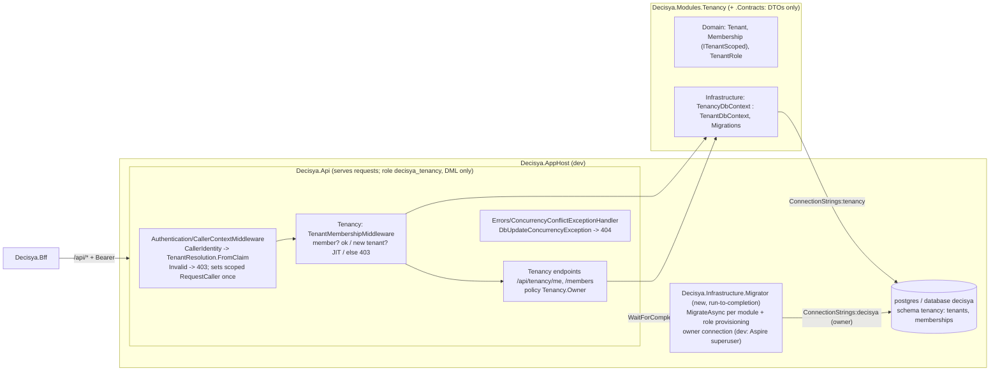

# Architecture note – Modules.Tenancy: tenants, memberships, roles (issue #21)

## Context

#21 (0.09) is the first business module. It adds `Decisya.Modules.Tenancy` and `Decisya.Modules.Tenancy.Contracts` (ADR-0005), schema `tenancy`, the aggregates `Tenant` and `Membership`, JIT provisioning on first sign-in, `GET /api/tenancy/me` and `GET /api/tenancy/members`, and the production request-scoped `ICurrentTenant`. It also adds the first EF migration, and with it the migrator process and the first per-module database role, which ADR-0005 and `apphost-servicedefaults.md` assign to "the first issue that runs EF migrations".

Inputs:
- `docs/requirements/phase-0/tenancy-module.md`: Stories 1-6, NFR-31 to NFR-33, and Marco's confirmations: JIT provisioning, Owner-only roles, invitations deferred to #83.
- `docs/architecture/tenant-query-filter.md` (#22): `TenantDbContext`, the constructor convention, `ArchitectureScope` and the rules.
- `api-jwt-validation.md` (#20): `CallerIdentity` and the fallback policy.
- `keycloak-realm.md`: dev tenant ids.
- ADR-0001 and ADR-0005.
- The #22 G3 carry-ins B-1 to B-4 and #20's B-5.

**No ADR.** This note implements ADR-0001 (the tenant filter plus a membership check) and ADR-0005 (module pair, schema per module, one role per module, a migrator that owns DDL) as written. It changes no invariant.

## C4 excerpt



## Projects and ownership

| Path | Kind | G4/G5 owner |
| --- | --- | --- |
| `src/Modules/Tenancy/Decisya.Modules.Tenancy.Contracts/` | new, via module-scaffold phase 1 (refs SharedKernel only) | backend-dev |
| `src/Modules/Tenancy/Decisya.Modules.Tenancy/` (`Domain/`, `Application/`, `Infrastructure/` incl. `Migrations/`, `Endpoints/`, `TenancyModule.cs`) | new, via module-scaffold phases 1 and 2 | backend-dev |
| `tests/Modules/Decisya.Modules.Tenancy.Tests/` | new, via scaffold | scaffold and project reference: backend-dev; tests: test-engineer |
| `src/Decisya.SharedKernel/Tenancy/ICurrentCaller.cs` | new interface (BCL only) | backend-dev |
| `src/Decisya.Infrastructure.Migrator/` (namespace and assembly `Decisya.Infrastructure.Migrator`) | new console host, inside backend-dev's existing lane `src/Decisya.Infrastructure*/**` | backend-dev |
| `src/Decisya.Api/Errors/ConcurrencyConflictExceptionHandler.cs` | new | backend-dev |
| `src/Decisya.Api/Authentication/` (`RequestCaller`, `CallerContextMiddleware`, `UseCallerContext`), `Program.cs`, `Decisya.Api.csproj`, `MapWhoAmI` (`.SkipTenantMembership()`), existing `Decisya.Api.Tests` factories and endpoint-set tests | changed | identity-dev |
| `tests/Decisya.TestInfrastructure/PostgresFixture.cs` (`CreateEmptyDatabaseAsync`), `src/Decisya.AppHost/AppHost.cs`, `AppHostConfigurationTests` | changed | platform-dev |
| `tests/Decisya.ArchitectureTests/ArchitectureScope.cs` and the project reference to the module | changed | backend-dev (module-scaffold step 7) |
| `.github/workflows/ci.yml`: add `tests/Modules/Decisya.Modules.Tenancy.Tests/Decisya.Modules.Tenancy.Tests.csproj` to the Integration loop | CI | devops |
| `decisya.slnx` (module-scaffold step 2, plus `Decisya.Infrastructure.Migrator`) | root file | backend-dev runs `dotnet sln add`; the orchestrator does it if the write boundary blocks it |
| `.claude/skills/ef-migration/SKILL.md` and `prereqs.py`: the startup project becomes `src/Decisya.Infrastructure.Migrator` | `.claude/**`, text only | main session |

**Packages: none added.** Already pinned:
- The module uses `Npgsql.EntityFrameworkCore.PostgreSQL`.
- `Decisya.Infrastructure.Migrator` uses `Microsoft.EntityFrameworkCore.Design` with `PrivateAssets="all"`. It is the design-time startup project, so Design never reaches `Decisya.Api`.

The module also gets `<FrameworkReference Include="Microsoft.AspNetCore.App" />` for `Endpoints/`. That is not a package. No `Aspire.Npgsql.EntityFrameworkCore.PostgreSQL`: its `AddNpgsqlDbContext` pools contexts, which the #22 constructor convention forbids. PR body line (G7): "Microsoft.EntityFrameworkCore.Design (already pinned): first use; design-time migrations in Decisya.Infrastructure.Migrator only."

## Domain and persistence (schema `tenancy`)

**Entities.** Both are `ITenantScoped`. Each is `sealed` and has a get-only `TenantId` that its constructor sets.

| Type | Table and columns | Notes |
| --- | --- | --- |
| `Tenant(TenantId tenantId, Instant createdAt)` | `tenancy.tenants`: `tenant_id uuid` **PK**, `created_at timestamptz not null` | No `Id` property and no display name (G1). The key **is** `TenantId`, so the tenant filter restricts a caller to her own tenant row. The #22 guard, which requires an added entity's `TenantId` to equal the current tenant, is exactly "a tenant can only create itself". `TenantModelRule` makes the key property a concurrency token too. If EF rejects that on a key, report the exact error and stop; do not add a duplicate `id` column without G2. |
| `Membership(TenantId tenantId, string userId, TenantRole role, Instant createdAt)` | `tenancy.memberships`: `id uuid` PK (`Guid.CreateVersion7()`), `tenant_id uuid not null` FK to `tenants(tenant_id)` `ON DELETE RESTRICT`, `user_id varchar(255) not null`, `role varchar(16) not null`, `created_at timestamptz not null`; **unique index `ux_memberships_tenant_user (tenant_id, user_id)`** | `UserId` is the token's `sub`. The unique index leads with `tenant_id`, as the ef-migration skill requires. No navigation properties. |
| `TenantRole` enum `{ Owner = 1, Member = 2 }` | stored as a string (`HasConversion<string>()`) | A value object, not an entity: no table, so `ITenantScoped` does not apply. #21 assigns only `Owner`; `Member` exists for #83. |

- Names are explicit (`ToTable`, `HasColumnName`), with no naming-convention package.
- `Instant` maps to `timestamptz` through a module-internal `InstantConverter` (`Instant.ToDateTimeOffset()` and `Instant.FromDateTimeOffset`). It is registered in `TenancyDbContext.ConfigureConventions` after `base`, so no `Npgsql.EntityFrameworkCore.PostgreSQL.NodaTime` is needed. Time comes from `IClock`; `Program.cs` calls `AddSystemClock()`.

**`TenancyDbContext : TenantDbContext`** follows module-scaffold step 6:
- It uses the #22 constructor convention and overrides `OnTenantModelCreating`, with `HasDefaultSchema("tenancy")`.
- One public static `TenancyDbContextOptions.Configure(DbContextOptionsBuilder builder, string connectionString)` calls `UseNpgsql(cs, o => o.MigrationsHistoryTable("__EFMigrationsHistory", "tenancy"))`. The API registration, the migrator and the design-time factory all use it.
- `EnableSensitiveDataLogging` and `EnableDetailedErrors` are never called anywhere under `src/`, which answers B-3's second half with a static test.

**Migrations (ef-migration skill).**
- The first migration is `AddTenantsAndMemberships`, in `Infrastructure/Migrations`, with its snapshot and `deploy/sql/tenancy/<timestamp>.sql` from `--idempotent`.
- Design time: `internal sealed class TenancyDesignTimeDbContextFactory : IDesignTimeDbContextFactory<TenancyDbContext>` uses `Host=design-time.invalid` (add and script never connect) and an `ICurrentTenant` whose resolution is `Invalid`.
- CLI: `dotnet ef migrations add AddTenantsAndMemberships --project src/Modules/Tenancy/Decisya.Modules.Tenancy --startup-project src/Decisya.Infrastructure.Migrator --context TenancyDbContext --output-dir Infrastructure/Migrations`.
- VS 2026 (Package Manager Console, default project `Decisya.Modules.Tenancy`): `Add-Migration AddTenantsAndMemberships -Context TenancyDbContext -OutputDir Infrastructure/Migrations -StartupProject Decisya.Infrastructure.Migrator`.
- Rollback header: `Down` drops both tables and loses all tenant and membership rows. The next sign-in re-provisions them through JIT, but `created_at` is lost.

## Request pipeline: caller context, membership gate, 403s (B-1, B-2, B-5)

**`ICurrentCaller`** (new, `Decisya.SharedKernel.Tenancy`): `string UserId { get; }`. It is the validated `sub`, and it throws `InvalidOperationException` when the request has no validated caller. Modules need the caller for object-level authorization (BOLA), and `CallerIdentity` is internal to the API. `ICurrentTenant` stays as #22 defined it.

**`RequestCaller : ICurrentTenant, ICurrentCaller`** (internal, `Decisya.Api.Authentication`):
- It is registered once as `AddScoped<RequestCaller>()`. `ICurrentTenant` and `ICurrentCaller` are forwarded to the same scoped instance (`sp => sp.GetRequiredService<RequestCaller>()`). There is no singleton and no transient registration.
- `internal void Set(TenantResolution resolution, string userId)` throws `InvalidOperationException` on a second call ("set once").
- Before `Set`, `Resolution` is `default`, which is `Invalid` and fails closed in `TenantDbContext`, and `UserId` throws.
- `AddApiAuthentication()` registers it, so `Program` still calls only entry points.

**DI scope validation (B-1).** `Program.cs` calls `builder.Host.UseDefaultServiceProvider(o => { o.ValidateScopes = true; o.ValidateOnBuild = true; })` in **every** environment, not just Development. A singleton that captures `ICurrentTenant`, `ICurrentCaller` or `TenancyDbContext` then fails at startup.

**Middleware order in `Program.cs`** (identity-dev). `UseRouting` is called explicitly, so the `Invalid` rejection literally runs before routing (B-2):

```csharp
app.UseExceptionHandler();
app.UseAuthentication();
app.UseCallerContext();       // Decisya.Api.Authentication
app.UseRouting();
app.UseTenancyMembership();   // Decisya.Modules.Tenancy (needs the endpoint's metadata)
app.UseAuthorization();
app.MapDefaultEndpoints();
app.MapWhoAmI();              // + .SkipTenantMembership()
app.MapTenancyEndpoints();
```

**`CallerContextMiddleware`** (identity-dev):
1. If `User.Identity?.IsAuthenticated != true`, call `next` and do nothing else. The resolution stays `Invalid`, the fallback policy gives 401, and the anonymous `/health` and `/alive` endpoints are untouched.
2. Compute `CallerIdentity.From(User)`. A `null` result gives **403**.
3. Compute `TenantResolution.FromClaim(identity.TenantId)`:
   - `Invalid` gives **403**, before routing, so no endpoint, authorization handler or DbContext query runs (Story 4 scenario 3).
   - `None` and `Tenant` go on to step 4.
4. Call `RequestCaller.Set(resolution, identity.UserId)`.
5. Wrap `next` in `ILogEnrichmentContext.Begin(tenantIdOrNull, identity.UserId)`: `tenant_id` only for `Tenant`, and the user id hashed by the context (B-5, from `CallerIdentity` and never from a header).

Every 403 in this note is the same generic `ProblemDetails` (status 403, standard title, `traceId`), sent through `IProblemDetailsService` with `Cache-Control: no-store`. The client never learns which check failed. The log gets a Warning with the reason code (`InvalidIdentity`, `InvalidTenantClaim` or `MembershipRefused`) and never the claim value.

**`TenantMembershipMiddleware`** (module, `Endpoints/`, exposed as `UseTenancyMembership()`). It runs only when **all** of these hold:
- the resolution is `Tenant`;
- the endpoint is not `null`;
- the endpoint has no `IAllowAnonymous` metadata;
- the endpoint has no `SkipTenantMembershipMetadata`.

It is fail-closed for every future module endpoint: membership is required unless an endpoint opts out explicitly. `/health` and `/alive` stay anonymous and never reach the gate. `/api/whoami` is the only explicit opt-out; it returns claims only, and it keeps #20's no-Docker test harness working (confirmed by Marco, 2026-09-28). The middleware calls `TenantMembershipGate.EnsureAsync` (below). `Refused` gives 403 and anything else continues.

## JIT provisioning (Story 1, NFR-32)

JIT provisioning lives in `Application/TenantMembershipGate` (internal, scoped) and runs from the middleware, not in a handler. That way it covers the first request to *any* tenant endpoint, and the Owner policy never runs before the membership exists. The resolution is already `Tenant(t)`, so the #22 `SaveChanges` guard allows exactly the rows for `t` (#22's note: onboarding runs as the new tenant).

`EnsureAsync(CancellationToken)` returns `Member | Provisioned | Refused`:
1. `Memberships.AnyAsync(m => m.UserId == caller.UserId)` (filtered to `t`). If true, return `Member`.
2. `Tenants.AnyAsync()` (filtered to `t`). If true, return **`Refused`**: the tenant exists and this caller has no membership, so she is never joined automatically (Story 1 scenario 4).
3. Otherwise, add `Tenant(t, now)` and `Membership(t, userId, Owner, now)` and call `SaveChangesAsync` once. That is one implicit transaction, and it inserts the tenant first. Return `Provisioned`.
4. Catch `DbUpdateException` whose `InnerException` is a `PostgresException` with `SqlState == PostgresErrorCodes.UniqueViolation` (the `tenants` PK or `ux_memberships_tenant_user`). Then call `ChangeTracker.Clear()` and repeat step 1 **once**:
   - the membership exists: return `Member` (the same user's parallel first request won);
   - it does not: return **`Refused`** (another user's request created the tenant).

   There is no retry loop. Any other exception propagates as a generic 500.

Why this is idempotent: Postgres raises 23505 only after the competing transaction **commits**. If that transaction rolls back, the waiting insert succeeds. So the re-read in step 4 always sees the winner. Two users racing for one new `tenant_id` give exactly one tenant and one Owner, and the loser gets 403. G5 proves NFR-32 in the module tests with N parallel `EnsureAsync` calls: separate contexts and the same `t`, first with one user and then with two users.

Telemetry: the `Decisya.Tenancy` meter gets counters `decisya.tenancy.tenants.provisioned` and `decisya.tenancy.memberships.refused`. The provisioning log (Information) and the refusal log (Warning) carry no raw `sub`; enrichment adds the hash.

## Endpoints and contracts (Stories 2, 3)

`MapTenancyEndpoints()` maps `MapGroup("/api/tenancy")`. Nothing in it is `AllowAnonymous`, so the fallback policy still applies. Every response carries `Cache-Control: no-store`.

| Route | Authorization | Behaviour |
| --- | --- | --- |
| `GET /api/tenancy/me` | fallback policy | `None` gives 200 `{}`. `Tenant` gives 200 `{ "tenant": { "id" }, "membership": { "role" } }`, read through the filter. |
| `GET /api/tenancy/members` | policy **`Tenancy.Owner`** | 200 `{ "members": [ { "userId", "role" } ] }`, ordered by `created_at`, then `user_id`. No paging in phase 0 (at most 1 member until #83). |

- **`Tenancy.Owner`** (`Endpoints/TenancyPolicies`): a `TenantOwnerRequirement` with a scoped `AuthorizationHandler` that succeeds only when the resolution is `Tenant` **and** the caller's own `Membership.Role == Owner`, read through the filter. `None` gives 403, and so does `Member` (Story 3 scenarios 2 and 3). The policy is registered in `AddTenancyModule`.
- **Contracts** (`Decisya.Modules.Tenancy.Contracts`, public `sealed record`s, System.Text.Json):
  - `TenancyMeResponse(TenantDto? Tenant, MembershipDto? Membership)`, with both properties `[JsonIgnore(Condition = WhenWritingNull)]`;
  - `TenantDto(TenantId Id)`, which uses the existing `TenantIdJsonConverter`;
  - `MembershipDto(string Role)`;
  - `TenancyMembersResponse(IReadOnlyList<MemberDto> Members)`;
  - `MemberDto(string UserId, string Role)`.

  `role` is `"Owner"` or `"Member"`. No `created_at` goes on the wire, so there is no `Instant` serializer question in phase 0.
- **OpenAPI: deferred.** The `api-contract` prerequisites are missing: `src/Decisya.Web/package.json` (#26) and `tests/Decisya.ContractTests`. The wire shape above is the fixed contract. `openapi/tenancy.yaml`, the contract test and the generated client come with the first issue whose `api-contract` prerequisites pass. The orchestrator adds this to #83.
- **Public module surface** (`TenancyModule`):
  - `AddTenancyModule(this IServiceCollection, string connectionString)` throws `InvalidOperationException` naming `ConnectionStrings:tenancy` (never a value) when the connection string is null or blank. It uses plain `AddDbContext`, with no pooling.
  - `UseTenancyMembership(this IApplicationBuilder)`.
  - `MapTenancyEndpoints(this IEndpointRouteBuilder)`.
  - `SkipTenantMembership<TBuilder>(this TBuilder) where TBuilder : IEndpointConventionBuilder`.
  - `const string Schema = "tenancy"` and `const string DatabaseRole = "decisya_tenancy"`.
  - `TelemetryName`.

## Concurrency conflict (Story 5, B-3, NFR-33)

`ConcurrencyConflictExceptionHandler : IExceptionHandler` lives in `src/Decisya.Api/Errors`. It is registered with `AddExceptionHandler<>()` before `AddProblemDetails()`; `UseExceptionHandler` is already first in the pipeline. It handles `DbUpdateConcurrencyException`, including when the exception is wrapped as an `InnerException`:
- It logs a Warning with the exception object; the trace id and tenant come through the log pipeline.
- It writes a **404** `ProblemDetails` with status and title only. No `detail`, no `Entries`, no entity or column names, no values.
- It never calls `GetDatabaseValues` or `Reload`. `CrossTenantQueryRule` already bans both outside `[AllowCrossTenant]` types.

All other exceptions keep #20's generic 500. #21 has no update path of its own, so G5 raises a real conflict through a test-only endpoint (the #20 `TestOnlyEndpointsStartupFilter` pattern): a detached `Update` of another tenant's `Membership`, which the #22 concurrency token turns into zero rows.

## Wolverine

**Not in #21.** No cross-module message, no handler and no outbox: the endpoints call module services in-process, and nothing consumes a Tenancy event yet. `WolverineFx` stays unreferenced. The envelope-tenant middleware and the outbox-versus-model-guard conflict (#22 note) belong to the messaging issue.

## Database, roles, migrator, AppHost and tests

**What #21 does now:**

- **`Decisya.Infrastructure.Migrator`** is a new console host (`Host.CreateApplicationBuilder`, `AddServiceDefaults` for JSON logs). It runs `MigrationRunner.RunAsync(string ownerConnectionString, string tenancyRolePassword, CancellationToken)` and exits 0, or non-zero with the missing key named.
  - Configuration:
    - `ConnectionStrings:decisya` is the owner connection;
    - `Migrator:TenancyRolePassword` is the module role's password.
  - It migrates `TenancyDbContext` (resolution `Invalid`; DDL runs no filtered query).
  - It then provisions the role over a plain `NpgsqlConnection`: no EF raw SQL, and the migrator is outside `ArchitectureScope`. The steps are idempotent and run on every start:
    - `CREATE ROLE decisya_tenancy` (catching `duplicate_object`, because roles are cluster-wide and tests share one container);
    - `ALTER ROLE decisya_tenancy WITH LOGIN NOSUPERUSER NOCREATEDB NOCREATEROLE NOINHERIT NOREPLICATION NOBYPASSRLS PASSWORD …`. The statement text is built server-side with `format('%I … %L')` from parameters, under `SET log_statement = 'none'`, and is never logged;
    - `REVOKE ALL ON DATABASE <db> FROM PUBLIC`, then `GRANT CONNECT ON DATABASE <db> TO decisya_tenancy`;
    - `REVOKE ALL ON SCHEMA tenancy FROM PUBLIC`, then `GRANT USAGE ON SCHEMA tenancy TO decisya_tenancy`;
    - `GRANT SELECT, INSERT, UPDATE, DELETE ON ALL TABLES IN SCHEMA tenancy TO decisya_tenancy`, then `REVOKE ALL ON tenancy."__EFMigrationsHistory" FROM decisya_tenancy`.

    The role owns nothing and has no `CREATE` anywhere, so it cannot `CREATE`, `ALTER` or `DROP` (CLAUDE.md least privilege; ADR-0005).
  - The migrator never logs a connection string or a password.
- **The API** connects only through `ConnectionStrings:tenancy`, as `decisya_tenancy`. It never calls `Migrate`, `EnsureCreated` or any `DatabaseFacade` member (rule below).
- **AppHost** (platform-dev):
  - `var tenancyDbPassword = builder.AddParameter("tenancy-db-password", new GenerateParameterDefault { MinLength = 32, Special = false }, secret: true, persist: true);`
  - `var decisyaDb = postgres.AddDatabase("decisya");`
  - `var migrator = builder.AddProject<Projects.Decisya_Infrastructure_Migrator>("decisya-migrator").WithReference(decisyaDb).WithEnvironment("Migrator__TenancyRolePassword", tenancyDbPassword).WaitFor(decisyaDb);`
  - On `api`, add:
    - `.WithEnvironment("ConnectionStrings__tenancy", ReferenceExpression.Create($"Host={pg.Property(EndpointProperty.Host)};Port={pg.Property(EndpointProperty.Port)};Database=decisya;Username=decisya_tenancy;Password={tenancyDbPassword}"))`. Use the host `Port`, not `TargetPort`: the API runs on the host;
    - `.WaitForCompletion(migrator)`.
  - The migrator is idempotent, so Marco's existing persistent volume needs no reset. `AppHostConfigurationTests` assert this wiring.
- **Module tests.**
  - `PostgresFixture.CreateDatabaseAsync<TenancyDbContext>()` (#22; `EnsureCreated` from the model, including the unique index and FK) runs the isolation tests (Story 6, isolation-test skill: `Tenant` by read, `Membership` by read, update and delete by id) and the NFR-32 race tests.
  - A test with no Docker asserts `HasPendingModelChanges()` is false, through the design-time factory. It catches a forgotten migration.
- **API tests.** platform-dev adds `Task<string> PostgresFixture.CreateEmptyDatabaseAsync(CancellationToken)`, which returns the owner connection string of a fresh empty database. It stays in-process and is never printed; G3 should rate it.
  - The API test fixture runs `MigrationRunner.RunAsync(ownerCs, fixturePassword)`. The password is generated **once per fixture**, because the role is cluster-wide and changing it would break pooled connections.
  - It sets `ConnectionStrings:tenancy` to the owner string with `Username=decisya_tenancy;Password=fixturePassword`, so Stories 1-5 run through the real least-privilege role.
  - Existing no-Docker factories set a placeholder `Host=db.invalid;…`. Nothing connects at startup, `/api/whoami` skips the gate, and the Invalid-claim 403 needs no database.

**Deferred** (orchestrator: to #83):
- a dedicated non-superuser migrator/owner role, and production credentials (0.16: Compose publishing);
- ADR-0005's "a module role cannot read another module's schema" test (needs a second module);
- Npgsql/EF telemetry sources and a database health check;
- caching the membership lookup;
- member paging;
- the OpenAPI file, contract test and client (above).

## Decisions

- **D1 The key of `Tenant` is its `TenantId`.** This satisfies `ITenantScoped` without a redundant column, and the filter and guard then mean "a tenant sees and creates only itself". No ADR.
- **D2 Membership is checked by middleware, fail-closed, for every authorized endpoint.** A claim alone never grants tenant access (BOLA; G1 "never inferred from the claim"). Opting out is explicit (`SkipTenantMembership`). No ADR: this adds to ADR-0001 and changes nothing in it.
- **D3 JIT in the gate: read, insert, then one re-read on 23505.** No advisory locks and no `ON CONFLICT` raw SQL (which the raw-SQL rule would ban). No ADR.
- **D4 The migrator owns DDL; the API is DML-only through `decisya_tenancy`.** This implements ADR-0005. The dev owner is Aspire's superuser until 0.16. No ADR.
- **D5 `ICurrentCaller` goes in SharedKernel.Tenancy**, next to `ICurrentTenant`: one scoped `RequestCaller`, set once. No ADR.
- **D6 No Wolverine and no OpenAPI file in #21** (see above).
- **D7 The migrator is the design-time startup project**, so `Microsoft.EntityFrameworkCore.Design` never enters the API. The ef-migration skill and `prereqs.py` text change accordingly (orchestrator).

## NetArchTest and static rules to add (G5 test-engineer unless noted)

| Rule | Assemblies / files | Test class |
| --- | --- | --- |
| **B-4:** `ArchitectureScope.Assemblies` names ⊇ every `src/Modules/*/*/Decisya.Modules.*.csproj` except `*.Contracts`, enumerated from the repository. Adding `Decisya.Modules.Tenancy` to the scope is backend-dev's job | `ArchitectureScope` | `ArchitectureScopeTests` (ArchitectureTests) |
| The existing TenantModel, TenantIdImmutability, CrossTenantQuery, AllowCrossTenantJustification and BulkTenantMove rules now run over Tenancy, no longer vacuously | `ArchitectureScope` | `ModuleBoundaryTests` (existing) |
| Every `Decisya.Modules.*.Contracts` assembly (enumerated like B-4): its `Decisya.*` references are only `Decisya.SharedKernel` and `*.Contracts`, and it has no dependency on `Microsoft.EntityFrameworkCore`, `Npgsql`, `Wolverine` or `Microsoft.AspNetCore` (ADR-0005) | Contracts | `ContractsBoundaryTests` (ArchitectureTests) |
| Contracts do not depend on `Decisya.SharedKernel.Results` (#32 carry) | Contracts | same |
| `Decisya.Modules.Tenancy.Domain` does not depend on `Microsoft.EntityFrameworkCore` (existing rule) or `Microsoft.AspNetCore` | module | `ModuleBoundaryTests` |
| Only `Decisya.Modules.Tenancy.Endpoints` depends on `Microsoft.AspNetCore` | module | `TenancyModuleBoundaryTests` (module tests) |
| `Decisya.Api` and `Decisya.Modules.*` do not depend on `Microsoft.EntityFrameworkCore.RelationalDatabaseFacadeExtensions` or `Microsoft.EntityFrameworkCore.Infrastructure.DatabaseFacade` (no `Migrate`, `EnsureCreated`, raw SQL or connection access in the serving process) | Api, modules | `ApiBoundaryTests`, `ModuleBoundaryTests` |
| `Decisya.Api` does not reference `Decisya.Infrastructure.Migrator`. No module references `Decisya.Api` or `Decisya.Infrastructure.Migrator` | Api, modules | `ApiBoundaryTests`, `TenancyModuleBoundaryTests` |
| Static rule, update (identity-dev): `Decisya.Api.csproj` has ProjectReferences exactly `Decisya.ServiceDefaults` and `Decisya.Modules.Tenancy`, and its only PackageReference is still JwtBearer | csproj | `ApiBoundaryTests` |
| Static rule: no file under `src/` contains `EnableSensitiveDataLogging`, `EnableDetailedErrors` or `AddDbContextPool` | `src/**/*.cs` | `ApiBoundaryTests` |
| DI (B-1): the service descriptors for `ICurrentTenant` and `ICurrentCaller` are `Scoped`; the host builds with `ValidateScopes` and `ValidateOnBuild` in Production | Api | `CallerContextTests` (Api tests) |
| Endpoint metadata: every endpoint except `/health`, `/alive` and `/api/whoami` runs through the gate (it has no `SkipTenantMembershipMetadata`), and `/api/tenancy/members` carries policy `Tenancy.Owner` | Api | `EndpointAuthorizationTests` |

## G4 split and interfaces

| Order | Owner | Delivers | Consumed by |
| --- | --- | --- | --- |
| 1 | backend-dev | Scaffold phases 1 and 2. `ICurrentCaller`. Domain, `TenancyDbContext`, migration and SQL script. Gate, endpoints, policy and DTOs. `TenancyModule` public surface. `Decisya.Infrastructure.Migrator` with `MigrationRunner`. `ConcurrencyConflictExceptionHandler`. `ArchitectureScope` | everyone |
| 2 | platform-dev | `PostgresFixture.CreateEmptyDatabaseAsync`. AppHost: `tenancy-db-password`, `decisya` database, `decisya-migrator`, `ConnectionStrings__tenancy`, `WaitForCompletion`. `AppHostConfigurationTests`. `GETTING-STARTED.md` smoke row: in Firefox, log in at `https://localhost:7200/bff/login` as `dev-alice`, then open `/api/tenancy/me` and `/api/tenancy/members`. VS 2026 (F5 on `Decisya.AppHost`) and CLI (`dotnet run --project src/Decisya.AppHost`) side by side | identity-dev, G5 |
| 3 | identity-dev | `RequestCaller`, `CallerContextMiddleware`, `UseCallerContext` and the `AddApiAuthentication` registration. `Program.cs`: scope validation, the pipeline order above, `AddSystemClock`, `AddTenancyModule(builder.Configuration.GetConnectionString("tenancy"))`, `AddExceptionHandler<ConcurrencyConflictExceptionHandler>()`. `.SkipTenantMembership()` on whoami. The csproj reference. Existing `Decisya.Api.Tests` factories (placeholder connection string) and endpoint-set tests | G5 |
| 4 | devops | `ci.yml` Integration loop gains the module test project | G5 |
| — | orchestrator (main session) | `decisya.slnx` if blocked; ef-migration skill and `prereqs.py` startup project; #83 entries (Deferred list) | — |
| G5 | test-engineer | Stories 1-6, NFR-31 to NFR-33, the role privilege test (as `decisya_tenancy`, `CREATE TABLE`, `ALTER TABLE`, `DROP TABLE` and `CREATE SCHEMA` fail with `42501`, `SELECT` on `__EFMigrationsHistory` fails, DML on `tenants` and `memberships` succeeds), and the rules above | — |

**Fixed interface:**
- Configuration keys: `ConnectionStrings:tenancy` (API), `ConnectionStrings:decisya` and `Migrator:TenancyRolePassword` (migrator).
- AppHost names: parameter `tenancy-db-password`, resources `decisya` and `decisya-migrator`.
- Database names: role `decisya_tenancy`, schema `tenancy`, tables `tenants` and `memberships`, index `ux_memberships_tenant_user`.
- HTTP: routes `/api/tenancy/me` and `/api/tenancy/members`, policy `Tenancy.Owner`, and the JSON fields above.
- The public signatures named in this note.

## Notes for G3

- Every 403 is the same generic body: invalid identity, `Invalid` claim, and membership refused. The claim value is never logged.
- The gate is fail-closed by default for new endpoints. `/health` and `/alive` are anonymous and never reach it; the only explicit opt-out is `/api/whoami` (confirmed by Marco, 2026-09-28).
- An unknown well-formed `tenant_id` is materialised (G1: the claim is admin-only in Keycloak). An existing tenant is never joined.
- Rate `CreateEmptyDatabaseAsync` returning an owner connection string in-process, and the dev owner being Aspire's superuser until 0.16.
- The migrator builds the role password statement server-side with `format(%L)`, under `log_statement = none`. The password is alphanumeric (`Special = false`).

<!-- gate: G2 | verdict: PASS | issue: #21 -->
