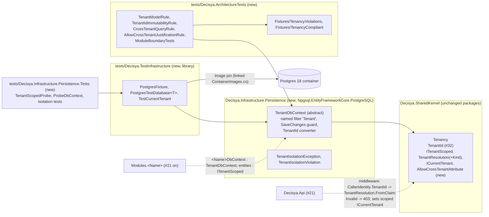

# Architecture note – Global tenant query filter + NetArchTest ITenantScoped rule (issue #22)

## Context

Issue #22 (0.10) ships the platform side of `CLAUDE.md` invariant 1 and ADR-0001's "Enforced by" line: `ITenantScoped`, a `TenantDbContext` base class with a per-query tenant filter and a `SaveChanges` guard, the `[AllowCrossTenant]` marker, the architecture rules, and `PostgresFixture`. It adds no module, no `Contracts` project, no endpoint and no Wolverine message. #21 (`Modules.Tenancy`) is the first consumer; `prereqs.py module-scaffold --phase tenancy` must report all five items present after this PR.

Inputs: `docs/requirements/phase-0/tenant-query-filter.md` (Stories 1-9, three adopted open-question answers: host middleware deferred to #21, throw on a bad write, no auto-stamp), NFR-28 to NFR-30, ADR-0001, ADR-0005, the #32 note (`tenantid-result-types.md`), `CallerIdentity` (#20).

G1 names renamed here (allowed by G1): `ICurrentTenantContext` becomes `ICurrentTenant`; `TenantClaimResolver`/`TenantClaimResolution` become `TenantResolution.FromClaim`/`TenantResolution`; `CrossTenantWriteException` becomes `TenantIsolationException` (one type for read, write and model violations, with a `Violation` enum).

## C4 excerpt



## Project layout and ownership

| Path | Kind | G4/G5 owner |
| --- | --- | --- |
| `src/Decisya.SharedKernel/Tenancy/ITenantScoped.cs`, `TenantResolution.cs`, `TenantResolutionKind.cs`, `ICurrentTenant.cs`, `AllowCrossTenantAttribute.cs` | new, `namespace Decisya.SharedKernel.Tenancy`, BCL only | backend-dev |
| `src/Decisya.Infrastructure.Persistence/` (`TenantDbContext.cs`, `TenantIsolationException.cs`, `TenantIsolationViolation.cs`, internal `TenantIdValueConverter.cs`) | new project, refs SharedKernel | backend-dev |
| `tests/Decisya.ArchitectureTests/` (project, rule classes, `ArchitectureScope.cs`, `ModuleBoundaryTests.cs`, `Fixtures/TenancyViolations/*`, `Fixtures/TenancyCompliant/*`) | new test project + two fixture projects | backend-dev; rule red/green tests by test-engineer (G5) |
| `tests/Decisya.TestInfrastructure/` (`PostgresFixture.cs`, `PostgresTestDatabase.cs`, `TestCurrentTenant.cs`, linked `ContainerImages.cs`) | new class library (not a test project) | platform-dev |
| `tests/Decisya.Infrastructure.Persistence.Tests/` (`TenantScopedProbe`, `ProbeDbContext`, Stories 2-5, 8, 9 tests) | new test project | test-engineer (G5) |
| `tests/Decisya.SharedKernel.Tests/Tenancy/*` (Story 1, 3, 6 unit tests), `BannedApi/BannedSymbolsSyncTests.cs` (two new entries) | existing project | test-engineer (G5) |
| `decisya.slnx` (five new projects), `BannedSymbols.txt` (two lines) | root files, in no agent lane | orchestrator |
| `.github/workflows/ci.yml`: add `tests/Decisya.Infrastructure.Persistence.Tests/Decisya.Infrastructure.Persistence.Tests.csproj` to the Integration loop (`test_ci_integration.py` fails until it is) | CI | devops |
| `.claude/skills/isolation-test/references/template.md`, `.claude/skills/module-scaffold/SKILL.md` steps 6-7 (text only, see "Skill text") | `.claude/**` | orchestrator (host run) |

Order: backend-dev, then platform-dev (TestInfrastructure references Persistence), then devops, then G5.

**Packages: none added to `Directory.Packages.props`.** `Decisya.Infrastructure.Persistence` and `Decisya.TestInfrastructure` reference the already-pinned `Npgsql.EntityFrameworkCore.PostgreSQL` 10.0.3 (brings EF Core 10, which has named query filters; Postgres is the only provider, ADR-0007). `Decisya.TestInfrastructure` also references the pinned `Testcontainers.PostgreSql` 4.15.0. It does **not** reference xUnit: the fixture needs only `IAsyncDisposable` (xUnit v3 disposes fixtures through it), and a start that is lazy needs no `IAsyncLifetime`. The custom IL rule uses `Mono.Cecil` types that NetArchTest.Rules 1.3.2 already exposes through `ICustomRule`; no direct `Mono.Cecil` reference. PR body line (G7): "Npgsql.EntityFrameworkCore.PostgreSQL (already pinned): first use; EF Core provider for TenantDbContext and PostgresFixture."

## Public API surface (load-bearing for G4 and G5)

### SharedKernel.Tenancy (BCL only; the #32 `Tenancy` namespace rule stays green)

```csharp
public interface ITenantScoped
{
    TenantId TenantId { get; }
}

public enum TenantResolutionKind { Invalid = 0, None = 1, Tenant = 2 }

public readonly struct TenantResolution : IEquatable<TenantResolution>
{
    public TenantResolutionKind Kind { get; }
    public TenantId TenantId { get; }                          // InvalidOperationException unless Kind == Tenant
    public static TenantResolution Invalid => default;
    public static TenantResolution NoTenant { get; }
    public static TenantResolution For(TenantId tenantId);     // ArgumentException when !tenantId.IsInitialized
    public static TenantResolution FromClaim(string? claimValue);
    // Equals, GetHashCode, ==, !=; ToString(): "Invalid" | "None" | "Tenant(<id>)"
}

public interface ICurrentTenant
{
    TenantResolution Resolution { get; }
}

[AttributeUsage(AttributeTargets.Class, AllowMultiple = false, Inherited = false)]
public sealed class AllowCrossTenantAttribute(string justification) : Attribute
{
    public string Justification { get; } = justification;
}
```

- `FromClaim` (Story 3): `null` gives `NoTenant`; `TenantId.TryParse` success gives `For(id)`; anything else, including `""` and whitespace, gives `Invalid`. `CallerIdentity.TenantId` is the input (#21 wires it). "None" is never `default(TenantId)` or the zero GUID.
- **`default(TenantResolution)` is `Invalid`.** An `ICurrentTenant` that nobody populated (missing middleware, a background job) fails closed with an exception, not with an empty result that looks like "no data".
- `ITenantScoped.TenantId` is implemented implicitly as a get-only auto-property, `public TenantId TenantId { get; }`, set by the entity's constructor (G1 answer 3, no auto-stamp). No `set`, `private set` or `init`. EF writes the compiler backing field on materialisation. Explicit interface implementation is not allowed (EF maps by the name `TenantId`).
- The attribute constructor does not throw: a throwing attribute constructor would break reflection over the whole assembly. The non-empty justification is enforced by an architecture rule (Story 6 scenario 3). `Justification` is public, so #24 reads it back by reflection (Story 6 scenario 4).

### Decisya.Infrastructure.Persistence

```csharp
namespace Decisya.Infrastructure.Persistence;

public abstract class TenantDbContext : DbContext
{
    public const string TenantFilterName = "Tenant";

    protected TenantDbContext(DbContextOptions options, ICurrentTenant currentTenant);

    protected abstract void OnTenantModelCreating(ModelBuilder modelBuilder);
    protected sealed override void OnModelCreating(ModelBuilder modelBuilder);
    protected override void ConfigureConventions(ModelConfigurationBuilder configurationBuilder); // overrides must call base

    public sealed override int SaveChanges(bool acceptAllChangesOnSuccess);
    public sealed override Task<int> SaveChangesAsync(bool acceptAllChangesOnSuccess, CancellationToken cancellationToken = default);

    private TenantId? CurrentTenantFilter { get; }   // read by the query filter on every query
}

public enum TenantIsolationViolation { InvalidTenant, NoTenant, UntenantedEntity, TenantMismatch, TenantChanged, UnscopedEntityType }

public sealed class TenantIsolationException : InvalidOperationException
{
    public TenantIsolationViolation Violation { get; }
    public IReadOnlyList<string> EntityTypeNames { get; }   // CLR full names only
}
```

**Constructor convention.** Every concrete subclass has a public constructor `(DbContextOptions<TSelf> options, ICurrentTenant currentTenant)`. `PostgresFixture` and `TenantModelRule` construct contexts through it, and the rule fails a context without it. The context keeps the `ICurrentTenant` **reference**, never a copied value. Pooling (`AddDbContextPool`) is not possible with that constructor, and must not be worked around.

**Model (`OnModelCreating`, sealed).** It calls `OnTenantModelCreating` first, so the derived context registers every entity, schema and configuration. Then it walks `modelBuilder.Model.GetEntityTypes()`, skipping owned types (they share the owner's row):

1. If the CLR type does not implement `ITenantScoped`, collect its name. After the walk, a non-empty list throws `TenantIsolationException(UnscopedEntityType, names)`. This is the fail-closed runtime guard: a context that maps an unscoped entity, or an implicit many-to-many join (a property bag, so model an explicit join entity that implements `ITenantScoped`), cannot be used at all.
2. Otherwise, configure property `TenantId` as required and as a **concurrency token**.
3. On root entity types only (`BaseType == null`, as EF requires for filters on hierarchies), add the **named** filter `HasQueryFilter(TenantFilterName, e => e.TenantId == CurrentTenantFilter)`. Build it in a generic instance method (`ApplyTenantFilter<TEntity>() where TEntity : class, ITenantScoped`, called through `MakeGenericMethod`), so the lambda closes over `this`.

Why it is built this way:

- **Evaluated per query, not cached per model.** EF caches the model per context type, but a filter that references a member of the context instance becomes a query parameter: EF substitutes the executing context and reads `CurrentTenantFilter` on every execution. The getter reads `_currentTenant.Resolution` at that moment. A value captured into a local inside `OnModelCreating` would be frozen into the cached model for every later context and every tenant; that is the leak this design rules out, and G5 proves it (see test approach).
- **`CurrentTenantFilter`:** `Tenant` returns the id. `None` returns `null`: the non-nullable `tenant_id` column compared with a `NULL` parameter matches no row, which is Story 4's "zero rows, never all rows" (the SQL null semantics G1 Story 8 names). `Invalid` throws `TenantIsolationException(InvalidTenant)` while EF extracts parameters, before any SQL is sent (Story 3 scenario 4). EF may wrap it in an `InvalidOperationException`; G5 asserts on the exception or its inner exception.
- **The named filter (EF Core 10).** A module adding its own filter later (for example, soft delete) cannot silently replace the tenant filter, as the single unnamed `HasQueryFilter` did before EF 10. A bypass names it: `IgnoreQueryFilters([TenantDbContext.TenantFilterName])`.
- **Concurrency token.** EF's `UPDATE`/`DELETE` carries `WHERE id = @id AND tenant_id = @original`. An attached, detached entity (`ctx.Update(new Probe(idOfB, tenantA))`, or `Remove`) therefore affects zero rows and raises `DbUpdateConcurrencyException`, so tenant B's row is unchanged (Story 9 scenario 2). Without the token, EF's key-only `WHERE` would reach B's row.
- **If EF cannot translate** the lifted `TenantId == TenantId?` comparison (with the value converter and the user-defined `==`), report the exact error and code and stop, per `CLAUDE.md`. Do not fall back to client evaluation or a sentinel GUID.

**Conventions.** `ConfigureConventions` registers `TenantIdValueConverter` for every `TenantId` property: `id => id.Value` to `uuid`, and `g => TenantId.From(g)` back. A stored `Guid.Empty` throws on read (fail loud). A derived override that skips `base` leaves `TenantId` unmappable, so the model build fails, which is also fail-closed.

**`SaveChanges` guard (Story 5, G1 answer 2).** Both sealed overloads (the other two `DbContext` overloads delegate to them) call `ChangeTracker.DetectChanges()`, then check every `ITenantScoped` entry in state `Added`, `Modified` or `Deleted` before calling `base`:

| Condition | Violation |
| --- | --- |
| resolution `Invalid` | `InvalidTenant` |
| resolution `None` | `NoTenant` (a write always needs a tenant) |
| `Added` and `!TenantId.IsInitialized` | `UntenantedEntity` |
| `Added` and `TenantId != current` | `TenantMismatch` |
| `Modified`/`Deleted` and original `TenantId != current` | `TenantMismatch` |
| `Modified` and current `TenantId != original` | `TenantChanged` |

It throws on the first violation, before any SQL. The message is fixed per violation and names only the entity CLR type: no tenant ids, no entity values. Once #21 has a host, an unhandled throw becomes #20's generic `ProblemDetails`.

## Boundaries and contracts

- No module, `Contracts` type, message or OpenAPI change.
- `Decisya.SharedKernel` stays free of EF Core; the #32 assembly allow-list test (`SharedKernelBoundaryTests`) already enforces that and stays as it is. Domain code depends only on `ITenantScoped` and `TenantId`.
- `Decisya.Infrastructure.Persistence` is shared platform infrastructure, like `Decisya.ServiceDefaults`, not a module. Modules reference it from their `Infrastructure/` folder. It references only `Decisya.SharedKernel` plus EF Core/Npgsql.
- `[AllowCrossTenant]` is a compile-time marker, not a runtime switch. The only runtime bypass is `IgnoreQueryFilters`, which is:
  - banned by `BannedSymbols.txt` (RS0030 is an error under `TreatWarningsAsErrors`);
  - allowed only with a local `#pragma warning disable RS0030` inside a type that carries `[AllowCrossTenant("<justification>")]`, which `CrossTenantQueryRule` enforces (ADR-0001).

  Discovery for #24 is reflection over `AllowCrossTenantAttribute`. #24 owns the audit record.
- `BannedSymbols.txt`, two lines, with the message "Tenant filter bypass: only in [AllowCrossTenant] types (ADR-0001)":
  - `M:Microsoft.EntityFrameworkCore.EntityFrameworkQueryableExtensions.IgnoreQueryFilters``1(System.Linq.IQueryable{``0})`
  - the EF 10 overload with `System.Collections.Generic.IReadOnlyCollection{System.String}`

  Confirm both documentation IDs against EF Core 10's XML docs. If they differ, report it; don't guess.

### PostgresFixture (platform-dev)

```csharp
namespace Decisya.TestInfrastructure;

public sealed class PostgresFixture : IAsyncDisposable
{
    public Task<PostgresTestDatabase<TContext>> CreateDatabaseAsync<TContext>(CancellationToken cancellationToken = default)
        where TContext : TenantDbContext;
    public ValueTask DisposeAsync();
}

public sealed class PostgresTestDatabase<TContext> where TContext : TenantDbContext
{
    public TContext CreateContext(ICurrentTenant currentTenant);
    public TContext CreateContext(TenantId tenant);   // TestCurrentTenant with TenantResolution.For(tenant)
}

public sealed class TestCurrentTenant : ICurrentTenant
{
    public TenantResolution Resolution { get; set; }   // default Invalid
}
```

- **Lazy start (testcontainers skill).** The constructor does nothing. The first `CreateDatabaseAsync` starts the container, guarded by a `SemaphoreSlim`, with a bounded two-minute timeout and a message naming Postgres. Nothing starts in the unit lane, so an `[assembly: AssemblyFixture(typeof(PostgresFixture))]` is safe and gives one container per test assembly (Story 8: started once, shared).
- **Image.** `ContainerImages.Reference(PostgresRegistry, PostgresImage, PostgresTag, PostgresSha256)`, with `src/Decisya.AppHost/ContainerImages.cs` linked as source (the Identity/Bff/Api tests precedent). No project reference to the AppHost. Random container name, no volumes, Ryuk on.
- **A database per call, not a schema per test.** Module contexts hard-code their schema (module-scaffold step 6), so schema-per-test would force every context to take a schema parameter. `CreateDatabaseAsync` runs `CREATE DATABASE` with a fixture-generated name (`t_` plus 32 hex characters; never caller input), then `Database.EnsureCreatedAsync()` through a context whose resolution is `Invalid` (DDL runs no filtered query). Test databases are removed with the container.
- **Credentials.** A per-run random password generated in-process (`RandomNumberGenerator`), in CI and on the host alike: no consumer outside the process needs it. It is never printed. Connection strings stay inside the fixture; the public API hands out contexts only.

## Decisions

- **`ITenantScoped`, `TenantResolution`, `ICurrentTenant` and `[AllowCrossTenant]` go in SharedKernel.Tenancy.** Domain entities, host middleware and future Wolverine middleware all need them without EF Core. No ADR needed: this implements ADR-0001.
- **`TenantDbContext` goes in a new `Decisya.Infrastructure.Persistence`,** not in each module and not in SharedKernel (which must stay EF-free). No ADR needed: shared infrastructure, like ServiceDefaults; ADR-0005's two-projects rule covers modules only.
- **`default(TenantResolution)` is `Invalid`; `None` gives zero rows; writes need a tenant.** No ADR needed: this implements the #20/#83 B-5 carry-in and G1 Stories 3-5.
- **TenantId is a concurrency token and the filter is named.** No ADR needed: these are implementation details of ADR-0001's filter.
- **A runtime model guard plus an architecture rule.** The rule catches a violation in CI for every assembly in `ArchitectureScope`. The guard catches any context the scope list forgot. No ADR needed.
- **Host middleware (claim to `ICurrentTenant`, `Invalid` to 403) and the scoped settable `ICurrentTenant` implementation are deferred to #21** (G1 answer 1). #22 ships the interface only; tests use `TestCurrentTenant`. #21 note: onboarding a new tenant runs with the resolution set to that new tenant, because a `None` caller cannot write.
- **The #32 SharedKernel boundary rules stay in `Decisya.SharedKernel.Tests`,** not moved into `Decisya.ArchitectureTests` as the #32 note suggested. Moving them adds churn and no coverage. The "Contracts do not expose `Results` types" rule and ADR-0005's Contracts-reference rules land with the first Contracts assembly (#21).
- **Known future conflict, not solved here (no speculative extension point).** Wolverine's EF Core outbox maps envelope entities into a `DbContext` (ADR-0005). They are not `ITenantScoped`, so the model guard will reject them. The messaging issue decides how, with an ADR amendment if the invariant's wording must change.

## NetArchTest rules to add

All are in `tests/Decisya.ArchitectureTests`. Each rule is a static class with `Evaluate(params Assembly[] assemblies)` returning `IsSuccessful` and `FailingTypeNames`, like #32's `ModuleClockUsageRule`. `ArchitectureScope.Assemblies` is `typeof(TenantDbContext).Assembly` plus every module assembly: empty today, and #21 adds `Modules.Tenancy`, per module-scaffold step 7.

| Rule | Assemblies | Test class |
| --- | --- | --- |
| **TenantModelRule (Done-when, Story 7).** NetArchTest selects `Inherit(typeof(TenantDbContext))`, `AreNotAbstract()`. Each context is built through the constructor convention, with `UseNpgsql("Host=model-only.invalid")` (building the model never connects) and `TestCurrentTenant`-like `Invalid`, and `.Model` is read. The rule fails, naming the type, on: a missing constructor; `TenantIsolationException(UnscopedEntityType)` (it reports `EntityTypeNames`); any entity type that is not `ITenantScoped`; a root type without the `Tenant` named filter; or `TenantId` not being a concurrency token. | `ArchitectureScope`; fixtures | `ModuleBoundaryTests`, `TenancyRuleTests` |
| **TenantIdImmutabilityRule (Story 1).** Classes that `ImplementInterface(typeof(ITenantScoped))` declare a public `TenantId` property with no set accessor of any visibility (`init` included). | same | same |
| **CrossTenantQueryRule (Story 6).** An `ICustomRule` over each Mono.Cecil `TypeDefinition` finds `call` instructions to `EntityFrameworkQueryableExtensions.IgnoreQueryFilters`. A type that has one passes only if its **outermost declaring type** carries `AllowCrossTenantAttribute`, so async state machines and lambda closures count as their declaring type. Report the outermost type name. | same | same |
| **AllowCrossTenantJustificationRule (Story 6).** For every type with the attribute, read the constructor argument through `CustomAttributeData` (no attribute construction); fail on null, empty or whitespace, naming the type. | same | same |
| Domain types (`Decisya.Modules.*.Domain*`) do not depend on `Microsoft.EntityFrameworkCore` (module-scaffold step 7). | module assemblies in `ArchitectureScope` | `ModuleBoundaryTests` |

**Fixtures (the red run without breaking the build).** There are two separate fixture projects under `tests/Decisya.ArchitectureTests/Fixtures/`. Both are real projects in `decisya.slnx`, referenced by `ProjectReference`, with `Compile Remove="Fixtures/**"` in the test project, the #32 `NonCompliantClockUsage` pattern:

- **`TenancyViolations`** contains:
  - `UnscopedEntity` mapped by `ViolatingDbContext`;
  - `MutableTenantEntity : ITenantScoped` with `{ get; set; }`;
  - `UnattributedCrossTenantQuery` (calls `IgnoreQueryFilters` under `#pragma warning disable RS0030`, no attribute);
  - `[AllowCrossTenant(" ")] BlankJustificationQuery`.
- **`TenancyCompliant`** contains:
  - `ScopedEntity : ITenantScoped` mapped by `CompliantDbContext`;
  - `[AllowCrossTenant("reconciliation report for platform support ticket #123")] AttributedCrossTenantQuery`, which calls `IgnoreQueryFilters` inside an `async` method with a lambda, to exercise the walk to the outermost type.

`TenancyRuleTests`: each rule fails against `TenancyViolations`, naming the fixture type, and passes against `TenancyCompliant`. `ModuleBoundaryTests`: each rule passes over `ArchitectureScope`. It is never empty, because it always includes `Decisya.Infrastructure.Persistence`.

**Recorded Done-when run (G5 evidence).** No `git stash` is used; the edit is made and then reverted by hand:

1. Remove `: ITenantScoped` from `TenancyCompliant.ScopedEntity`. Run `dotnet test --project tests/Decisya.ArchitectureTests`. The compliant `TenantModelRule` test fails, naming `ScopedEntity`. Paste the failure.
2. Restore the interface and run again: green. Paste the summary.

VS 2026: *Test Explorer → Decisya.ArchitectureTests → Run*.

## Test approach (G5, what needs a specific technique)

- **Project.** `tests/Decisya.Infrastructure.Persistence.Tests` holds `TenantScopedProbe` (constructor `(TenantId, string name)`, `Guid` id from `Guid.CreateVersion7()`, which does not throw on `default(TenantId)`, so Story 1 scenario 3 and Story 5 can reach the guard) and `ProbeDbContext` (schema `probe`). The Postgres tests carry `[Trait("Category", "Integration")]`. The project also keeps at least one test without that trait, so the unit lane (and pre-push) do not see a zero-test project. The `Invalid`-resolution query and the `SaveChanges` rejections throw before any connection is opened, so they can run without Docker as well as against Postgres.
- **Per-query evaluation.** One context, with the `TestCurrentTenant` resolution switched from A to B between two queries, returns different rows. Two contexts of the same type with different tenants prove the cached model holds no tenant.
- **Story 9 scenario 2 covers three paths:**
  - `ExecuteUpdateAsync`/`ExecuteDeleteAsync` by B's id as A: zero affected, because the filter applies;
  - `FindAsync(B's id)` as A: `null`;
  - a detached `Update`/`Remove` carrying B's id as A: `DbUpdateConcurrencyException`.

  B's row is re-read unchanged through B's context each time.
- **Story 5 scenario 3.** Change the tenant through `entry.Property(e => e.TenantId).CurrentValue` (there is no setter).

## Skill text (orchestrator, this PR)

These fix instructions #21 will follow; they are text only.

- `isolation-test/references/template.md`: `pg.CreateContext<T>(b)` becomes `var db = await pg.CreateDatabaseAsync<T>();` then `db.CreateContext(b)`. Also add the `Update`/`Remove` detached case.
- `module-scaffold/SKILL.md` step 6: override `OnTenantModelCreating` (not `OnModelCreating`), with the constructor convention `(DbContextOptions<T>, ICurrentTenant)`; `MigrationsHistoryTable` belongs in the `UseNpgsql` options. Step 7: the rules are "every entity type in the module's `DbContext` model implements `ITenantScoped` (TenantModelRule)" and "no Domain type references `Microsoft.EntityFrameworkCore`".

## Notes for G3

- Fail-closed choices:
  - the default resolution is `Invalid`, and it throws;
  - `None` gives zero rows and no writes;
  - the model guard;
  - `ConfigureConventions` without `base` fails the model build;
  - `SaveChanges` is sealed.
- **Residual gaps, all code-level:**
  - `ExecuteUpdate(s => s.SetProperty(e => e.TenantId, …))` can move the caller's own rows to another tenant, because `SaveChanges` does not see it;
  - `Database.ExecuteSql*` bypasses the filter (`FromSql` on a `DbSet` composes with it);
  - an `[AllowCrossTenant]` type that calls `IgnoreQueryFilters` also skips the `Invalid` check, so #21's 403 middleware is the primary guard for `Invalid`;
  - Postgres RLS (ADR-0001 option 4) stays deferred.

  G3 decides which of these, if any, need a MUST.
- `TenantIsolationException` messages carry the entity type name only.
- The `PostgresFixture` password is random per run, generated in-process and never printed.

<!-- gate: G2 | verdict: PASS | issue: #22 -->
