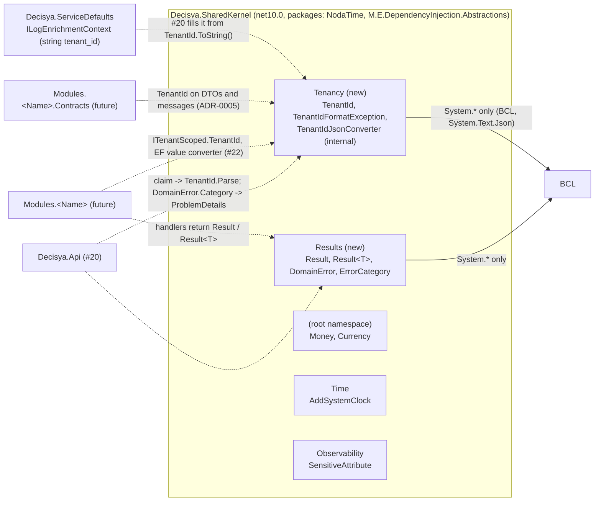

# Architecture note – SharedKernel: TenantId and result types (issue #32)

## Context

Issue #32 (0.04b) adds the `TenantId` value type and the `Result`, `Result<T>` and `DomainError` types to `Decisya.SharedKernel`. This is the rest of #16's scope. The note adds no module, no `Contracts` project, no Wolverine message, no endpoint and no new data flow. It still uses the full form for two reasons:

- These are **public types that every future `Contracts` assembly will expose**. ADR-0005 lets Contracts reference only SharedKernel, so `TenantId` on a message or DTO comes from here.
- `TenantId` is the value that ADR-0001's tenancy model hangs on: `ITenantScoped` (#22), the envelope tenant (ADR-0005), `tenant_id` in logs (#15), and Redis and object-storage key prefixes.

Inputs:

- Requirements: `docs/requirements/phase-0/tenantid-result-types.md` (Stories 1-5). NFR-13 and NFR-14 in `docs/requirements/nfr.md`.
- Marco's decisions in `docs/ai/pipeline/32.md`:
  - `Guid` inside, with `New()` minting UUIDv7;
  - lenient parsing, meaning any GUID version;
  - `Result` hand-rolled, with no new package;
  - implicit conversions from `T` and from the error type, and no conversion to `bool`;
  - `tenant_id` is logged unmasked.
- Marco's decision of 2026-09-26, relayed by the coordinator during G2: G1's `Error` type is renamed `DomainError` (see Decisions).
- ADRs:
  - 0001: tenant id on every store, claim `tenant_id`.
  - 0005: Contracts reference only SharedKernel.
  - 0006: `Money` and `Currency` set the style precedent.
- The existing code: `Currency`, `InvalidCurrencyCodeException`, `MoneyAllocationPropertyTests`, `ServiceDefaultsBoundaryTests`.

**Naming note.** G1's requirements call the error type `Error`. In this note and in the code it is `DomainError`. Every G1 scenario that mentions `Error` as a type means `DomainError`. `ErrorCategory` and the `Error` property on `Result` and `Result<T>` keep their G1 names.

## C4 excerpt

Component view of `Decisya.SharedKernel` after #32. Dashed arrows are future consumers and their owning issues. None of them is built here.



## Project layout and file placement

The layout adds no project, no `ProjectReference` and no `PackageReference`. `System.Text.Json` is part of `Microsoft.NETCore.App` on net10.0, so it needs no package.

| Path | Kind | Owner |
| --- | --- | --- |
| `src/Decisya.SharedKernel/Tenancy/TenantId.cs` | new, `namespace Decisya.SharedKernel.Tenancy` | backend-dev |
| `src/Decisya.SharedKernel/Tenancy/TenantIdFormatException.cs` | new, same namespace | backend-dev |
| `src/Decisya.SharedKernel/Tenancy/TenantIdJsonConverter.cs` | new, `internal sealed`, same namespace | backend-dev |
| `src/Decisya.SharedKernel/Results/DomainError.cs`, `ErrorCategory.cs`, `Result.cs`, `ResultOfT.cs` | new, `namespace Decisya.SharedKernel.Results` | backend-dev |
| `tests/Decisya.SharedKernel.Tests/Tenancy/*.cs` | new, `namespace Decisya.SharedKernel.Tests.Tenancy` | test-engineer |
| `tests/Decisya.SharedKernel.Tests/Results/*.cs` | new, `namespace Decisya.SharedKernel.Tests.Results` | test-engineer |
| `tests/Decisya.SharedKernel.Tests/Architecture/SharedKernelBoundaryTests.cs` | new | test-engineer |

Why these namespaces work:

- The folder matches the namespace, like `Time` and `Observability`.
- `Money` sits in the root namespace only because of CS0118: a namespace segment named `Money` would clash with the type `Money`. That clash cannot happen here, because no type is named `Tenancy` or `Results`.
- The plural `Results` is deliberate. A namespace named `Result` would shadow the type.

Consumers write `using Decisya.SharedKernel.Tenancy;` and `using Decisya.SharedKernel.Results;`. The module-scaffold skill can add them as global usings later.

## Public API surface (load-bearing for G4 and G5)

### `TenantId`

```csharp
namespace Decisya.SharedKernel.Tenancy;

[JsonConverter(typeof(TenantIdJsonConverter))]
public readonly struct TenantId : IEquatable<TenantId>
{
    private readonly Guid _value;              // Guid.Empty only in default(TenantId)
    private TenantId(Guid value);

    public Guid Value { get; }                 // throws InvalidOperationException when !IsInitialized (Currency.Code precedent)
    public bool IsInitialized => _value != Guid.Empty;

    public static TenantId New();              // Guid.CreateVersion7()
    public static TenantId From(Guid value);   // Guid.Empty -> TenantIdFormatException
    public static TenantId Parse(string? value);                          // TenantIdFormatException
    public static bool TryParse(string? value, out TenantId tenantId);    // false -> tenantId = default
    public static bool TryParse(ReadOnlySpan<char> value, out TenantId tenantId);

    public bool Equals(TenantId other);        // _value equality
    public override bool Equals(object? obj);
    public override int GetHashCode();         // _value.GetHashCode()
    public override string ToString();         // _value.ToString("D") (lowercase), or string.Empty when !IsInitialized
    public static bool operator ==(TenantId left, TenantId right);
    public static bool operator !=(TenantId left, TenantId right);
}
```

#### Parse rules

`Parse`, both `TryParse` overloads and the JSON converter all use one private `TryParseCore(ReadOnlySpan<char>)`:

1. Trim ASCII whitespace only, with the same helper shape as `Currency.TrimAsciiWhitespace`.
2. Require that exactly 36 characters remain. Otherwise the input fails.
3. `Guid.TryParseExact(span, "D", out var guid)`.
4. Reject `Guid.Empty`.

**Decision for G3 and Marco: accept the hyphenated `D` form only.**

- Rejected forms: `N` (32 hex digits), `B` (`{…}`), `P` (`(…)`) and `X`.
- This narrows the text *format*. It does not narrow the GUID *version*: any version still parses, so Marco's "lenient" decision holds (G1 open question 2).
- Reasons:
  - there is one wire form, and it is the form `ToString()` emits;
  - the input length is bounded before any parsing;
  - two different strings can never name the same tenant in a cache key or log search.
- Keycloak emits `D`, and `Guid.ToString()` defaults to `D`.
- If Marco wants every `Guid` text form, step 3 becomes `Guid.TryParse` and step 2 becomes a length cap of 68. The G1 scenarios pass either way.

Step 2's exact length also stops Unicode whitespace from getting through. `Guid` parsing trims whitespace internally, but a 36-character span that starts with an em space fails `D`.

#### Other `TenantId` rules

- **No `IParsable<TenantId>` or `ISpanParsable<TenantId>`.** Minimal APIs bind route and query parameters through `IParsable`. The tenant must come from the validated claim (ADR-0001, BOLA), never from a route segment, so SharedKernel doesn't make route binding easy. #20 can revisit this with an ADR if a platform-admin route ever needs it.
- **No `IComparable`.** Tenant ordering has no domain meaning, and .NET's `Guid.CompareTo` does not follow UUIDv7 byte order anyway.
- **No `[Sensitive]`** on the type or any member (G1 Story 3).
- `New()` uses `Guid.CreateVersion7()`, which reads the system clock internally. That call is allowed, because `BannedSymbols.txt` bans only direct `DateTime*.Now`/`UtcNow` references. The embedded timestamp is a way to keep index locality. It is not business time: nothing may derive a creation instant from a `TenantId`, and no `CreatedAt` accessor is added (invariant 4).

### `TenantIdFormatException`

```csharp
public sealed class TenantIdFormatException : FormatException
{
    public TenantIdFormatException();   // fixed message: "The supplied value is not a valid tenant identifier."
}
```

- **The message has no preview of the input at all.** G1 Story 1 scenario 4 allows "or no preview at all". A tenant id has no human-meaningful part worth echoing, so the sanitiser that `InvalidCurrencyCodeException` needs is unnecessary here.
- There is **no raw-value property**, unlike `InvalidCurrencyCodeException.Code`. The caller already has its input, and not storing it means an exception object that gets logged or serialised can't carry an unbounded hostile string.
- `From(Guid.Empty)`, `Parse(null)`, `Parse("")` and any malformed input all throw this type, per G1 Story 1.
- `FormatException` is the conventional base for `Parse`. `Currency`'s exception derives from `ArgumentException` because it validates a factory argument; here, parsing is the main operation.

### `TenantIdJsonConverter` (internal)

```csharp
internal sealed class TenantIdJsonConverter : JsonConverter<TenantId>
```

- It is applied by `[JsonConverter]` on the struct, so callers register nothing (G1 Story 2 scenario 5). That covers default `JsonSerializerOptions`, ASP.NET Core and Wolverine's System.Text.Json serializer.
- `Read`:
  - If `reader.TokenType != JsonTokenType.String`, throw `JsonException`. This covers JSON `null`: System.Text.Json passes `null` to a value-type converter. `TenantId?` still works, because the serializer's built-in nullable wrapper handles `null` before it reaches this converter.
  - If the raw token is longer than 128 bytes (`reader.HasValueSequence ? reader.ValueSequence.Length : reader.ValueSpan.Length`), throw `JsonException` without allocating the string.
  - Otherwise call `reader.GetString()`, then `TenantId.TryParse`. On `false`, throw `JsonException` with a fixed message and no input echo.
- `Write`:
  - If `!value.IsInitialized`, throw `JsonException("An uninitialized TenantId cannot be serialized.")`. Writing `""` would produce JSON that the converter's own `Read` rejects, and a message or DTO with no tenant must fail at the sender, not at the receiver (ADR-0005: a message without a tenant fails).
  - Otherwise call `writer.WriteStringValue(value.Value)`. `Utf8JsonWriter` writes a `Guid` in lowercase `D` form without allocating.
- `ReadAsPropertyName` and `WriteAsPropertyName` are not overridden, so `Dictionary<TenantId, …>` is unsupported until a consumer needs it (YAGNI).

### `ErrorCategory` and `DomainError`

```csharp
namespace Decisya.SharedKernel.Results;

public enum ErrorCategory
{
    Failure = 0,      // default(ErrorCategory) is the generic failure
    Validation = 1,
    NotFound = 2,
    Conflict = 3,
    Forbidden = 4,
}

public sealed class DomainError : IEquatable<DomainError>
{
    public const int MaxCodeLength = 100;

    private DomainError(string code, string message, ErrorCategory category);

    public string Code { get; }
    [JsonIgnore] public string Message { get; }
    public ErrorCategory Category { get; }

    public static DomainError New(string code, string message, ErrorCategory category = ErrorCategory.Failure);

    public bool Equals(DomainError? other);    // ordinal Code && Category; Message ignored (G1 Story 5)
    public override bool Equals(object? obj);
    public override int GetHashCode();         // HashCode.Combine(string.GetHashCode(Code, StringComparison.Ordinal), Category)
    public override string ToString();         // $"{Code} ({Category})", never Message
    public static bool operator ==(DomainError? left, DomainError? right);
    public static bool operator !=(DomainError? left, DomainError? right);
}
```

#### `DomainError.New` validation

Each failure throws `ArgumentException` or a subclass of it, as G1 Story 5 scenario 1 requires:

- A `null` code throws `ArgumentNullException`.
- An empty or whitespace code, a code longer than `MaxCodeLength`, or a code that doesn't match `^[a-z][a-z0-9_]*(\.[a-z][a-z0-9_]*)*$` throws `ArgumentException`.
  - Examples that match: `tenant.not_found`, `money.currency_mismatch`.
  - Implement the check as an ASCII character loop, not `Regex`.
  - The exception message does not echo the code.
- A `null` message throws `ArgumentNullException`. An empty message is allowed.
- An undefined `category`, such as `(ErrorCategory)42`, throws `ArgumentOutOfRangeException`. #20's category-to-status mapping then never sees a value outside the enum.

#### Why `DomainError` looks like this

- `DomainError` is a **class**. A `default(DomainError)` struct would have a `null` `Code`, which is exactly the state this type exists to rule out.
- The **code pattern** narrows G1's "non-empty, non-whitespace identifier". It is the one `DomainError` member #20 may put into a client-facing `ProblemDetails`, so it must be a safe, stable, lowercase dotted token. Every G1 scenario still holds.
- **No HTTP status member**, and no dependency on `System.Net` or `Microsoft.AspNetCore` (G1 Story 5 scenario 2). An architecture rule enforces this (below).
- **`[JsonIgnore]` on `Message`**, plus `ToString()` without `Message`, is defence in depth. `DomainError` is not a wire type, so no converter or public constructor exists. If one is still serialised by accident, into a response body or a message, only `Code` and `Category` leave the process. This supports the principle "generic message to the client, full detail to the structured log". The detail reaches the log only when a handler logs `Message` on purpose.
- There are no `DomainError.NotFound(...)`-style shortcuts. `New(code, message, category)` is enough, and every extra public member costs coverage under NFR-13. Add the shortcuts later if call sites show they are needed.

### `Result` and `Result<T>`

```csharp
public sealed class Result : IEquatable<Result>
{
    public bool IsSuccess { get; }
    public bool IsFailure => !IsSuccess;
    public DomainError Error { get; }                         // InvalidOperationException on success

    public static Result Success();                           // may return a cached instance
    public static Result Failure(DomainError error);          // ArgumentNullException on null
    public static Result<T> Success<T>(T value) where T : notnull;             // ArgumentNullException on null
    public static Result<T> Failure<T>(DomainError error) where T : notnull;   // ArgumentNullException on null

    public static implicit operator Result(DomainError error);   // == Failure(error)

    public TOut Match<TOut>(Func<TOut> onSuccess, Func<DomainError, TOut> onFailure);   // null delegate -> ArgumentNullException

    // IEquatable, Equals(object), GetHashCode, ==, !=
    public override string ToString();                        // "Success" or $"Failure: {Error}" (DomainError.ToString, so no Message)
}

public sealed class Result<T> : IEquatable<Result<T>> where T : notnull
{
    public bool IsSuccess { get; }
    public bool IsFailure => !IsSuccess;
    public T Value { get; }                                   // InvalidOperationException on failure
    public DomainError Error { get; }                         // InvalidOperationException on success

    public static implicit operator Result<T>(T value);            // == Result.Success(value)
    public static implicit operator Result<T>(DomainError error);  // == Result.Failure<T>(error)

    public TOut Match<TOut>(Func<T, TOut> onSuccess, Func<DomainError, TOut> onFailure);

    // IEquatable, Equals(object), GetHashCode, ==, !=
    public override string ToString();                        // "Success" or $"Failure: {Error}"; never renders Value
}
```

#### How the Result design meets the G1 scenarios

- **Factories live on the non-generic `Result`.** `AnalysisLevel` `latest-recommended` with `TreatWarningsAsErrors` turns CA1000 ("do not declare static members on generic types") into a build error. G1's notation `Result<int>.Success(42)` and `Result<int>.Failure(error)` therefore maps to `Result.Success(42)` and `Result.Failure<int>(error)`. The implicit operators are not affected by CA1000. If CA1000 fires anyway, report it and stop, per CLAUDE.md. Do not suppress it.
- **Both types are sealed classes, with no inheritance between them.** This rules out an invalid `default` state, keeps equality symmetric, and avoids the `Result<T> : Result` ambiguity with the implicit `DomainError` operators.
- **Equality:**
  - two successes: `Result` successes are always equal, and `Result<T>` successes compare with `EqualityComparer<T>.Default.Equals(Value, other.Value)`;
  - two failures: `DomainError` equality;
  - a success and a failure are never equal.
- **Hash codes are consistent with equality:**
  - a success hashes to a constant, or for `Result<T>` to `Value`'s hash;
  - a failure hashes to the `DomainError`'s hash, combined with a failure marker.
- **No `bool` conversion.** There is no `implicit` or `explicit` operator to `bool`, and no `operator true` or `operator false` (G1 Story 4 scenario 7).
- **`Match` invokes exactly one delegate, exactly once.** There are no `Action` overloads.
- **`ToString()` never renders `Value`.** A `Result<SomeDto>` that gets logged must not bypass the `[Sensitive]` masking rules, which work on the value itself, not on a `Result` string.

#### Known limits of the implicit conversions

Record these limits in the XML docs:

- C# does not apply a user-defined conversion from an interface type. When `T` is an interface, write `return Result.Success(value);`.
- `Result<DomainError>` is not a supported instantiation, because the two conversions would collide.
- Neither type is a wire type. Contracts DTOs and messages carry their own shapes, not `Result`. A NetArchTest rule for that belongs to the module-scaffold work and #22, not here (deferred below).

## Boundaries and contracts

- **No module, no `Contracts` project, no Wolverine message, no OpenAPI change.**
- **New public types in `Decisya.SharedKernel`**:
  - `TenantId` and `TenantIdFormatException` in `.Tenancy`;
  - `Result`, `Result<T>`, `DomainError` and `ErrorCategory` in `.Results`.
- **Dependency direction:**
  - `.Tenancy` and `.Results` depend on the BCL only. That includes `System.Text.Json`, and excludes NodaTime, `Microsoft.Extensions.*`, other SharedKernel namespaces and each other.
  - Every future Contracts assembly can take `TenantId` without pulling in anything else.
- **`ILogEnrichmentContext` stays `string`-typed** (#15 note). #20 fills it from `TenantId.ToString()`. ServiceDefaults is unchanged in #32.
- **Tenancy:** no persisted entity, so `ITenantScoped` doesn't apply. `TenantId` is the type that #22's `ITenantScoped.TenantId` will hold.

## Decisions

- **Hand-rolled `Result`, `DomainError` and `TenantId` with no new package.** Marco decided this (manifest, 2026-09-26). No ADR needed: no existing ADR or invariant changes.
- **The error type is `DomainError`, not G1's `Error`.** Marco decided this on 2026-09-26: a public type named `Error` triggers CA1716 (identifier clashes with a VB reserved keyword), which is a build error at this repo's analyzer level. `ErrorCategory` and the `Result.Error` property keep their names. No ADR needed.
- **The `D` text format only, any GUID version.** No ADR needed. It sits within Marco's "lenient" decision, which is about GUID versions. It is flagged above for G3 and Marco, and is a one-line change to reverse.
- **No `IParsable<TenantId>`,** so tenants come from claims and not from routes. No ADR needed. #20 may revisit it with an ADR.
- **`DomainError` is safe by construction:**
  - its code has a fixed pattern;
  - `Message` is ignored by JSON and omitted from `ToString`;
  - it has no HTTP member.

  No ADR needed. This implements the CLAUDE.md error principle. #20 owns the `ProblemDetails` mapping.
- **Result factories on the non-generic type,** because CA1000 would otherwise fail the build. No ADR needed.
- **Serializing an uninitialized `TenantId` fails.** No ADR needed. It enforces ADR-0005's rule that a message without a tenant fails, at the earliest point.

### Test approach (G5)

**NFR-14: no new package.** `FsCheck`, `CsCheck` and `Hedgehog` are not in `Directory.Packages.props`. Use `MoneyAllocationPropertyTests`' pattern: a `[Fact]` running a fixed-seed `new Random(<seed>)` loop of at least 10,000 cases, with the case index in the assertion reason. Put it in `Tenancy/TenantIdPropertyTests.cs`. Each case does the following:

1. Pick a source at random:
   - `TenantId.New()` (UUIDv7); or
   - `TenantId.From(new Guid(bytes))` with 16 `random.NextBytes` bytes. Draw again if the result is `Guid.Empty`. This covers every version and variant, which proves the leniency.
2. Format the text with `ToString()`, then randomly vary it:
   - flip the case of individual hex letters;
   - add 0-3 leading and trailing ASCII whitespace characters from `' ', '\t', '\r', '\n'`.
3. Assert the round trip:
   - `TenantId.Parse(variant) == original`;
   - `Parse(variant).Value == original.Value`;
   - `Parse(variant).ToString() == original.Value.ToString("D")`, which is the lowercase canonical form.
4. Assert the JSON round trip: `JsonSerializer.Deserialize<TenantId>(JsonSerializer.Serialize(original)) == original`.

A second `[Fact]`, with a different seed and 10,000 cases, covers robustness. It generates random strings:

- lengths 0-80;
- characters from hex digits, `-`, `{`, `}`, whitespace, control characters and non-ASCII letters.

For every string, one of two things holds: `TryParse` returns `false` and `Parse` throws `TenantIdFormatException`, or the parsed `ToString()` equals the lowercase, ASCII-trimmed input. There is never any other exception type.

**NFR-13.** `dotnet test --project tests/Decisya.SharedKernel.Tests --coverage --coverage-output-format cobertura`. The `Microsoft.Testing.Extensions.CodeCoverage` package is already referenced. G5 evidence shows at least 95% line coverage for `TenantId`, `TenantIdFormatException`, `TenantIdJsonConverter`, `Result`, `Result<T>` and `DomainError`, read from the cobertura report. NFR-13 names the type `Error`; it means `DomainError`. VS 2026 equivalent: *Test → Analyze Code Coverage for All Tests*.

**Other G1 scenarios that need a specific technique:**

- **Story 3 scenario 3:** call `SensitiveDataMaskingProcessor.ProcessValue("tenant_id", tenantId, out var masked)`. The test project already references ServiceDefaults. Assert that `masked` is `false`, and that the returned value's `ToString()` is the canonical text.
- **Story 3 scenario 2 and Story 4 scenario 7:** reflection over the types' attributes and over `op_Implicit`, `op_Explicit`, `op_True` and `op_False`.
- **Story 5 scenario 4:** the "`DomainError` has no HTTP member" rule in the table below, plus a reflection check that no public property of `DomainError` is named `*Status*` or typed `int`.

## NetArchTest rules to add

test-engineer implements these in #32. #22 moves them into `Decisya.ArchitectureTests`.

| Rule | Assemblies | Test class |
| --- | --- | --- |
| Types in namespace `Decisya.SharedKernel.Tenancy` only have dependencies on `System` and `Decisya.SharedKernel.Tenancy` (`OnlyHaveDependenciesOn`). This keeps `TenantId` BCL-only for every Contracts assembly. | `Decisya.SharedKernel` | `tests/Decisya.SharedKernel.Tests/Architecture/SharedKernelBoundaryTests` |
| Types in namespace `Decisya.SharedKernel.Results` only have dependencies on `System` and `Decisya.SharedKernel.Results` | `Decisya.SharedKernel` | `SharedKernelBoundaryTests` |
| Types in namespace `Decisya.SharedKernel.Results` do not depend on `System.Net` or `Microsoft.AspNetCore`. There is no HTTP status in `DomainError`; #20 owns the mapping (G1 Story 5). | `Decisya.SharedKernel` | `SharedKernelBoundaryTests` |
| SharedKernel's package dependencies stay on an allow-list. `typeof(TenantId).Assembly.GetReferencedAssemblies()` names are only `System.*`, `netstandard`, `NodaTime` and `Microsoft.Extensions.DependencyInjection.Abstractions`. The last one is already there for `AddSystemClock`, so the allow-list is "NodaTime plus DI abstractions", not NodaTime alone. This is a reflection test next to the NetArchTest rules: NetArchTest checks type dependencies, not assembly references. | `Decisya.SharedKernel` | `SharedKernelBoundaryTests` |
| The existing rule stays unchanged: SharedKernel does not depend on `Microsoft.AspNetCore`, `Microsoft.Extensions.Logging`, `OpenTelemetry`, `Decisya.ServiceDefaults`, `Decisya.Api` or `Decisya.AppHost` | `Decisya.SharedKernel` | `tests/Decisya.ServiceDefaults.Tests/Architecture/ServiceDefaultsBoundaryTests` (existing) |
| Deferred to module-scaffold and #22: Contracts types do not expose `Decisya.SharedKernel.Results` types on messages or DTOs | `Modules.*.Contracts` | `Decisya.ArchitectureTests.ContractsShapeTests` |

If `OnlyHaveDependenciesOn` reports compiler-generated types (for example `Microsoft.CodeAnalysis.EmbeddedAttribute` from nullable metadata), report the exact failing type names and stop. Don't widen the allow-list silently.

### Deferred, with the issue that owns each item

| Item | Owner |
| --- | --- |
| `ITenantScoped`, the EF Core value converter for `TenantId`, the global query filter | #22 (0.10) |
| The `tenant_id` claim to `TenantId.Parse` step, filling `ILogEnrichmentContext`, and the `DomainError.Category` to `ProblemDetails` status mapping | #20 (0.08) |
| Wolverine envelope tenant middleware using `TenantId` | the messaging issue (ADR-0005) |
| Global usings for `.Tenancy` and `.Results` in module projects | module-scaffold |

### Notes for G3

- The `D`-only format narrowing, and the 128-byte pre-check in the JSON converter.
- `TenantIdFormatException` carries no input at all, neither in its message nor in a property.
- The `DomainError.Code` pattern, and `Message` being `[JsonIgnore]` and missing from `ToString`, are what keep detail out of client responses until #20 exists.
- Serializing `default(TenantId)` throws.

<!-- gate: G2 | verdict: PASS | issue: #32 -->
