<!-- gate: G3 | verdict: PASS-WITH-NOTES | issue: #25 -->
# Threat delta: Modules.Admin API, the first cross-tenant HTTP surface (issue #25)

- **Scope.** This is a delta on top of `api-jwt-validation.md` (#20), `tenancy-module.md` (#21), `tenant-query-filter.md` (#22), `entitlements-module.md` (#23), `audit-module.md` (#24), `keycloak-realm.md` (#17) and `bff-api-forwarding.md` (#19). It covers only what #25 adds:
  - the `realm-roles-access-token` mapper and the flat `roles` claim in the access token (D1);
  - `CallerIdentity.HasPlatformAdminRole`, `RequestCaller.Set(…, isPlatformAdmin)` and `ICurrentCaller.IsPlatformAdmin` (D2);
  - the `Admin.PlatformAdmin` policy on the `/api/admin` group, the membership-gate opt-out and the handler precondition `None && IsPlatformAdmin` (D2, D3, D5);
  - `ProblemDetailsAuthorizationResultHandler` (every policy 403) and `NoStoreResponses` (D5);
  - `ITenantExistence` under the minted target scope (D4, ADR-0012 amendment 1 point 6);
  - the `reason` crossing HTTP (D6), and the BFF path for the three verbs (R-8).

  The #20 token validation, the #21 JIT gate, the #22 filter and guard, the #23 roles and evaluation, the #24 writer and transaction, and the #19 forwarding are not re-audited.
- **Mode.** Threat delta, written before code. G6 checks each MUST against the diff.
- **Inputs.**
  - `docs/ai/pipeline/25.md` (Marco's decisions of 2026-10-02, G1 Q1-Q4, ADR-0012 amendment 1 accepted);
  - `docs/requirements/phase-0/admin-api.md` (G1, Stories 1-7, NFR-38, NFR-39, R-1 to R-8);
  - `docs/architecture/admin-api.md` (G2, D1-D8, "Notes for G3");
  - ADR-0012 with amendment 1, ADR-0013;
  - the carry-forwards C-2 and S-5 (`entitlements-module.md`) and C-4 (`audit-module.md`), #21 S-2, #17 F-6 and T-16;
  - current code: `JwtBearerOptionsSetup`, `CallerIdentity`, `CallerContextMiddleware`, `RequestCaller`, `ApiAuthenticationBuilderExtensions`, `Program.cs`, `TenantMembershipMiddleware`, `TenantMembershipGate`, `AntiforgeryCheck`, the G2-written `ITenantExistence` and `OverrideGrantRequest`, and `deploy/keycloak/decisya-realm.json` (clients, mappers, user profile, users, scope mappings).
- **ASVS.** 5.0 Level 2; **Level 3 for V6 and V7**. Mapped at section level, as in the earlier deltas. #25 touches V6 only through the admin role's authentication strength (T-14), and V7 only through the BFF session that carries an admin's calls (T-12).
- **Runs on:** host (manifest). No package and no external content. No secret value was read.
- Ids T-xx, G4-25-xx, S-x and C-x are local to this file.
- Reviewer: security-reviewer agent, 2026-10-02.

## Verdict

**PASS-WITH-NOTES.** The admin decision is sound: one parser (`CallerIdentity`), one fact set once (`RequestCaller.Set`), computed as role **and** `None` so it can never be true for a tenant caller, checked twice (group policy and handler). The membership-gate opt-out is safe because it applies only to routes whose policy already refuses every `Tenant` caller. The target-scope existence check adds no grant and no bypass. No High threat lacks a mitigation. The notes:

1. **The opt-out and the policy must stay coupled (T-05).** `SkipTenantMembership` on a route that does *not* require `None` would let a tenant caller with no membership reach tenant data. Today only `/api/whoami` and the admin group carry it. G4-25-02 pins the coupling by test.
2. **The 403 change is an improvement, not a leak (T-07).** Today a member who is not an owner gets the JwtBearer empty 403 from `Tenancy.Owner`, while a refused JIT gets the ProblemDetails 403, so the two are distinguishable. One body for every 403 removes that oracle and closes #21 S-2. G4-25-03 pins it.
3. **The 8 KiB limit is silently skipped when the body-size feature is read-only or absent (T-10).** G4-25-04 closes it with a `Content-Length` fallback.
4. **MFA for `platform-admin` (#17 F-6) does not block #25, but it is not dropped (T-14).** The existence probe returns one bit to a caller who already holds the role, so it is not the "cross-tenant read" F-6 gates. #25 does ship cross-tenant **writes** with a single-factor role, which is worse than the read F-6 named. While every account is a synthetic dev account and nothing is deployed, the residual is Low; once deployed it is Medium. C-5 makes it a #29 release blocker.
5. **NFR-38 is slightly over-stated for unmatched paths and verbs (T-06).** A non-admin gets 404 for an unknown `/api/admin/x` and 405 (after a membership query) for a wrong verb on an admin route. It leaks only the public route shape. G5 tests the real behaviour and the PR body states it (S-3).

There are **five MUSTs** (G4-25-01 to G4-25-05), all fix-now, and four SHOULDs.

### Answers to the orchestrator's questions

| Question | Answer | Where |
| --- | --- | --- |
| Can the `roles` claim be spoofed? | Not by a user. The claim is in a token Keycloak signs and the API validates (`iss`, `aud`, RS256/ES256, `typ`, `MapInboundClaims = false`, #20). `decisya-bff` is the only client with the `decisya-api` audience mapper. `admin-cli` has no flow enabled, and no client has a service account or direct grants. The only attribute mapper is `tenant_id`, and no attribute mapper writes `roles`. The realm-role mapper reads role assignments, which only a realm admin can change. `fullScopeAllowed: false` and the scope mappings limit the claim to `tenant-user` and `platform-admin`. Registration is off, the user profile lets a user edit only `username`, `email`, `firstName` and `lastName` (none mapped into a token), and `tenant_id` is admin-edit-only. A forged header, query value, cookie or body field is never read (D2). | T-01; G4-25-01 |
| Is ignoring `realm_access` right? | Yes. Reading one flat claim through one parser is safer than a second JSON parser. The built-in mapper still emits `realm_access.roles`, so the G5 truth table must include a token that carries `platform-admin` **only** in `realm_access` and expects `false`. Removing the built-in scope stays optional (#83). | T-02; G4-25-01 |
| Case and duplicate claims | Ordinal and exact: `Platform-Admin` is a different Keycloak role and is refused. A JSON array becomes one string claim per value, so `["tenant-user","platform-admin"]` with no `tenant_id` is an admin, which is correct. A non-string `roles` element (object, array, number) makes the whole set false. A duplicate JSON key inside the signed payload can only come from Keycloak itself. Whatever the parser does with it, the result is a set of string claims or a non-string claim, and both are handled. A duplicate `sub` or `tenant_id` is already a pre-routing 403 (#21). | T-02; G4-25-01 |
| `IsPlatformAdmin` set once | Correct, provided it is set only inside the existing set-once `Set` call, as `HasPlatformAdminRole && resolution.Kind == None`, and has no other setter. Before `Set` it is false and `Resolution` is `Invalid`, so both checks fail closed. The default interface member keeps every other `ICurrentCaller` (`TestCurrentCaller`, `StubCurrentCaller`, a future job caller) non-admin. | T-03; G4-25-01 |
| Policy on the whole group | Right. Group conventions reach routes added later. The only way to weaken it is `AllowAnonymous` on a route, or a route mapped outside the group under the same prefix. The G2 metadata test (exactly three routes, policy present, no `IAllowAnonymous`) covers both. | T-04; G4-25-02 |
| Admin with a `tenant_id` | Refused twice. The middleware computes `IsPlatformAdmin = false` because the kind is `Tenant`, so the policy fails. The handler refuses `Tenant` whatever the role. The user keeps working as a tenant user, which is the least surprising result of a Keycloak misconfiguration. The Warning has fixed text and no claim value. | T-03; G4-25-01 |
| Double check, policy and handler | Both read the same scoped `RequestCaller`, so they cannot disagree within a request. The handler check now stands on its own (ADR-0012 A1 point 2). It must stay the first statement, before validation, so that a direct non-admin call learns no catalog key or error code. | T-03; G4-25-01 |
| Can a non-admin reach anything through the membership skip? | No. The gate only runs for `Tenant` callers, and every route that carries the skip under `/api/admin` refuses every `Tenant` caller at the policy. For admins (`None`) the gate never ran anyway. So the skip only removes a database round trip and a JIT write for callers who are refused anyway. The order holds: `UseAuthentication` → `UseCallerContext` (sets the fact or writes 403) → `UseRouting` → `UseTenancyMembership` (skipped) → `UseAuthorization` (policy). An authenticated caller either gets the pre-routing 403 or has `Set` run before the policy reads it. An anonymous caller fails `RequireAuthenticatedUser` and gets the 401 challenge. The risk is the skip spreading later to a route without a `None`-only policy (note 1). | T-05; G4-25-02 |
| Information leaks from the unified 403 body | None, if the handler writes only `type`, `title`, `status` and `traceId` and never `AuthorizationFailure.FailureReasons`, the policy name or the requirement. `traceId` is a correlation id and reveals nothing. The change *removes* an existing oracle (note 2). Only `Forbidden` is rewritten; `Challenged` keeps the bare `WWW-Authenticate: Bearer` 401 of #20. | T-07; G4-25-03 |
| `ITenantExistence`: an enumeration or timing oracle? | Not for a non-admin. The policy refuses before the route values are parsed and before any database command, so the 403 is the same in body and in work done for an existing tenant, an unknown tenant, a malformed id, an unknown feature key or a bad body. Only an authenticated admin sees 404 versus 204/409 (Q3, accepted). A tenant caller can only pass its own ambient resolution, so through this interface it can only learn that its own tenant exists. Nothing reaches HTTP that way. | T-08; G4-25-03 |
| No new grant? | Confirmed by design: `TenantExistence` runs on `ConnectionStrings:tenancy` as `decisya_tenancy`, which already reads `tenancy.tenants` for JIT. `decisya_entitlements` gains nothing. The ADR-0005 cross-schema tests stay unchanged. G6 checks that `deploy/sql/**` and the migrator are untouched. | T-09 |
| ADR-0012 A1 point 6: is the argument sound? | Yes for every assembly the mint rule covers (`ArchitectureScope` through `CrossTenantQueryRule`, `Decisya.Api` through `ApiBoundaryTests`). `TenantResolution.For` and `FromClaim` are public in SharedKernel, so an assembly outside both (Migrator, ServiceDefaults, Infrastructure.*) is not covered. None of them references `Tenancy.Contracts` today. A rule that limits `ITenantExistence` callers to the three handlers is not needed for #25 (S-2, backlog). | T-09; S-2 |
| The reason over HTTP | The design is complete: explicit read after authorization, JSON content type, 8 KiB, strict options (`Disallow`, no duplicates, `MaxDepth 4`), exception not logged, `ToString` and `PrintMembers` overrides, no HTTP or W3C logging, no `EnableBuffering`, `Include Error Detail` banned. Npgsql already redacts the server `Detail` without that switch. The EF sensitive-logging switches are already banned. ServiceDefaults has no EF Core or Npgsql tracing instrumentation, so no `db.statement` parameter can carry it. YARP's category is at Warning, and YARP does not log bodies. One gap: the size limit (note 3). | T-10, T-11; G4-25-04 |
| Antiforgery and CSRF | Covered by construction. `AntiforgeryCheck` treats every verb except GET, HEAD, OPTIONS and TRACE as unsafe and validates before forwarding. The YARP route forwards only GET, HEAD, POST, PUT, PATCH and DELETE, and the session cookie is `SameSite=Strict`. No host enables `UseHttpMethodOverride`, so a GET cannot become a DELETE at the API. G5 proves the three verbs through the BFF. | T-12; G4-25-05 |
| Repudiation with no audit of refusals (Q4) | Low residual, accepted. Every 2xx writes one record in the command's transaction (actor `sub`, target tenant, action, feature key), so an admin cannot deny a change. What remains: (a) refused attempts, including an admin's probing 404s and a stolen tenant session hammering `/api/admin`, exist only as Warning log lines with the trace id and hashed user id, with no retention or integrity guarantee and no reader; (b) the audit record holds no reason (#24 design), so the justification for a grant is lost when a PUT replaces it or a DELETE revokes it; (c) `dev-admin` is a shared synthetic account, so the actor names an account, not a person, until named admin accounts arrive (#17 F-1, #29). (a) is on #83 (Q4). (b) and (c) are not merge-relevant for #25. | T-13; S-4 |
| MFA for `platform-admin` against #17 F-6 | Low now (dev-only, synthetic accounts, nothing deployed), Medium once deployed. Not a #25 merge blocker (note 4). F-6 widens from "reads" to "reads and writes" and moves to #29 as a release blocker: Keycloak conditional OTP (or WebAuthn) required for holders of `platform-admin`, **and** the API requiring an MFA `acr`/`amr` value on `/api/admin`, so that a password-only session cannot use the role even if the realm is misconfigured. | T-14; C-5 |
| Local Keycloak: volume reset or hand-added mapper | Fails closed either way. A running realm without the mapper gives `dev-admin` no `roles` claim, so every admin call is 403. A mapper added in the wrong place or with a wrong flag can only add `roles` to `decisya-bff` tokens: `fullScopeAllowed: false` still limits the values, and `realm_access` is never read. The volume reset only loses synthetic data. Two small risks remain. First, the CLI path as written (an admin token for `POST …/protocol-mappers/models`) invites a Keycloak admin password on the command line or in shell history. Second, drift between the file and a running realm is not detected (#17 T-20, already on #29). S-1 fixes the first in GETTING-STARTED. | T-15; S-1 |

## Trust boundaries

```mermaid
flowchart LR
  subgraph browser["Browser (untrusted)"]
    spa["SPA / Firefox<br/>session cookie, X-XSRF-TOKEN"]
  end
  subgraph bff["Decisya.Bff (trusted, holds tokens)"]
    af["ApiAntiforgeryMiddleware<br/>non-safe verbs"]
    yarp["YARP /api/{**}<br/>Bearer attached, Cookie stripped"]
  end
  subgraph api["Decisya.Api (trusted)"]
    jwt["JwtBearer (#20)<br/>iss, aud, alg, exp, typ"]
    cc["CallerContextMiddleware<br/>CallerIdentity + roles<br/>Set(resolution, sub, isPlatformAdmin) once"]
    gate["UseTenancyMembership<br/>skipped for /api/admin"]
    pol["Admin.PlatformAdmin policy<br/>IsPlatformAdmin && None"]
    ep["Modules.Admin endpoints<br/>parse path, read body (8 KiB, strict)"]
    h["Entitlements handlers [AllowCrossTenant]<br/>None && IsPlatformAdmin, validate,<br/>ExistsAsync(target), BEGIN, write, audit, COMMIT"]
    te["Tenancy TenantExistence<br/>own context under target scope"]
  end
  subgraph data["Postgres (trusted)"]
    ten[("tenancy.tenants<br/>decisya_tenancy, SELECT")]
    ent[("entitlements.*, audit.audit_records<br/>decisya_entitlements")]
  end
  kc["Keycloak (trusted IdP)<br/>realm-role mapper -> roles"]
  spa -- "TB1: cookie + antiforgery" --> af --> yarp
  yarp -- "TB2: Bearer access token" --> jwt --> cc --> gate --> pol --> ep
  ep -- "TB3: Contracts.Admin" --> h
  h -- "TB4: TenantResolution crosses a module" --> te
  te -- "TB5" --> ten
  h -- "TB5" --> ent
  jwt -. "JWKS" .-> kc
```

- **TB1 browser → BFF.** New use, no new code: the three admin verbs. CSRF is the threat (T-12).
- **TB2 BFF → API.** New claim: `roles` in the access token. Spoofing and parsing are the threats (T-01, T-02).
- **TB2a inside the API, caller context → policy.** The new admin fact, the membership opt-out and the 403 shape (T-03 to T-08).
- **TB3 Admin → Entitlements.** New public contract. Reachability is rule-limited to Admin (T-04).
- **TB4 Entitlements → Tenancy.** New: a minted resolution crosses a module (T-09).
- **TB5 data stores.** No new grant (T-09). The reason reaches `entitlements.feature_overrides` only (T-10, T-11).

## Threats

| Id | Element / flow | STRIDE | Threat | Severity | Mitigation | ASVS 5.0 id | Status |
| --- | --- | --- | --- | --- | --- | --- | --- |
| T-01 | TB2, `roles` source | S, E | A tenant user obtains `platform-admin` through a user attribute, self-service profile edit, another client, a forged header or the ID token | High | Signed and validated access token only (#20); `decisya-bff` the only client with the API audience; no attribute mapper writes `roles`; realm roles admin-assigned only; registration off; user-editable profile attributes are not mapped; `fullScopeAllowed: false`; `CallerIdentity` reads no header, cookie, query or body | V8.2, V8.3, V9.2, V10.3 | Mitigated; G4-25-01 (tests) |
| T-02 | `CallerIdentity` roles parsing | S, E | The role is matched case-insensitively, inside `realm_access`, `groups` or a custom claim, as a prefix, or from a mixed-type claim set | High | Exact ordinal `platform-admin` in claims of type exactly `roles`; any non-string `roles` claim makes the set false; never nulls the identity | V8.2, V9.2 | G4-25-01 |
| T-03 | `RequestCaller`, handler precondition | E | `IsPlatformAdmin` true for a `Tenant` caller (dual claim), set twice, set before validation, or read alone; a direct handler call by a non-admin `None` caller | High | Computed as role && `None` inside the single set-once `Set`; default false (DIM and before `Set`); policy and handler both check `None && IsPlatformAdmin`; handler check first | V8.2, V8.3 | G4-25-01 |
| T-04 | `/api/admin` routing | E | A route added later skips the policy, is `AllowAnonymous`, or is mapped outside the group; another module calls `Contracts.Admin` | High | Group-level policy; endpoint-metadata test from the real host (exactly three routes, policy, no `IAllowAnonymous`); `AdminReachabilityTests` | V8.1, V8.2 | G4-25-02 |
| T-05 | Membership opt-out | E | `SkipTenantMembership` later reaches a route that serves tenant data without a `None`-only policy, so a non-member tenant caller reads it | Medium (future) | Opt-out set pinned to `/api/whoami` + the three; every skipped route other than `/api/whoami` must carry `Admin.PlatformAdmin` | V8.2, V8.3 | G4-25-02 |
| T-06 | Unmatched admin path or verb | I, D | A non-admin gets 404 or 405 instead of 403; a wrong verb on an admin route runs the membership query and JIT for a tenant caller | Low | Reveals only the public route shape; the JIT on a 405 is existing #21 behaviour on every route | V8.2 | S-3 (backlog) |
| T-07 | 403 body | I | The new result handler echoes the failure reason, the policy name or claims; 403 shapes differ by cause and act as an oracle (member-not-owner versus non-member, admin-with-tenant versus tenant user) | Medium | One ProblemDetails (`type`, `title`, `status`, `traceId`) for every 403 source; `Forbidden` only, 401 unchanged; nothing written if the response has started | V16.5, V8.2 | G4-25-03 |
| T-08 | Tenant existence / feature catalog oracle | I | A non-admin learns that a tenant id exists, or which feature keys exist, from the status, body or timing | Medium | Policy before route parsing and before any database command; identical 403 for every input; admin-only 404 (Q3) | V8.2, V2.2 | G4-25-03 |
| T-09 | TB4, `ITenantExistence` | E, I | The check becomes a cross-tenant read without the attribute, adds a grant, or is called with a caller-chosen tenant | Medium | Takes a resolution, not a raw id; `Tenant` kind only, else `ArgumentException` before SQL; own context under `TargetTenant`; returns `bool`; `decisya_tenancy` only; no grant; mint rule on `ArchitectureScope` and `Decisya.Api` | V8.3, V8.4, V15.2 | G2 rules and G5 isolation test; S-2 (backlog) |
| T-10 | Reason body, size and parsing | D, T | A large or deeply nested body is read in full; duplicate or unknown members change the meaning; `tenantId` in the body retargets the call | Medium | Read only after authorization; JSON content type; 8 KiB including a `Content-Length` fallback when the feature is read-only or absent; `Disallow` unmapped members; no duplicate properties; `MaxDepth 4`; body never bound to the tenant | V2.2, V4.1, V15.3 | G4-25-04 |
| T-11 | Reason confidentiality | I | The reason (free text, possibly personal data) leaks through a log, exception message, `ToString`, ProblemDetails, metric or activity tag, or the Npgsql `Detail` | Medium | Exception not logged and its message unused; `PrintMembers` and `ToString` overrides; `[Sensitive]`; no HTTP or W3C logging or buffering; `Include Error Detail` banned; generic 500; canary tests | V16.2, V16.5, V14.2 | G4-25-04 |
| T-12 | TB1, CSRF on POST, PUT and DELETE | T, E | A cross-site page makes a signed-in admin's browser grant an override or start a trial | High | `SameSite=Strict` cookie; antiforgery for every non-safe verb before forwarding; no method override at the API; G5 tests per verb | V3.5, V7.2 | G4-25-05 |
| T-13 | Repudiation | R | Refused and probing calls leave no audit record; the audit record has no reason; a shared dev admin account | Low | Successes audited in the command's transaction (#24); Warning logs and counter with trace id for refusals; Q4 accepted | V16.3, V16.4 | S-4 (#83, already listed) |
| T-14 | Admin authentication strength | S | A phished or reused `platform-admin` password gives cross-tenant write power with a single factor | Low now (dev-only, synthetic), Medium once deployed | OTP permitted, brute-force protection on, no external users; MFA enforcement and an API-side `acr`/`amr` check before release | V6.3, V6.8 (L3) | C-5 (#29 release blocker) |
| T-15 | Local Keycloak refresh | I, T | A Keycloak admin password lands in shell history while adding the mapper; the running realm drifts from the file | Low | Fails closed without the mapper; prompt-based CLI path; drift check on #29 (#17 T-20) | V13.3 | S-1 (fix-now) |
| T-16 | Role revocation latency | E | An admin who loses the role keeps it until the access token expires | Low | Access token at most 5 min plus 60 s skew (#20); BFF refresh picks up the change | V7.4, V9.2 | Accepted |

## MUSTs for G4 (G6 checks each one)

- **G4-25-01 (fix-now; T-01, T-02, T-03; identity-dev, backend-dev, test-engineer).** The admin fact has exactly one source and one setter.
  - `CallerIdentity.HasPlatformAdminRole` is as D2: claims of type exactly `roles`, all `ClaimValueTypes.String`, at least one ordinal-equal to `platform-admin`. It never reads `realm_access`, `resource_access`, `groups`, a header, a cookie, the query or the body, and odd roles never make `From` return `null`.
  - `IsPlatformAdmin` is assigned only in `RequestCaller.Set`, as `HasPlatformAdminRole && resolution.Kind == None`, under the existing set-once guard. It has no public or internal setter. It is false before `Set`, and the `ICurrentCaller` default interface member returns false.
  - Each of the three handlers' first statement refuses unless `Resolution.Kind == None && caller.IsPlatformAdmin`, before validation and any database command.
  - Tests: the truth table in G2 (including a token with `platform-admin` **only** in `realm_access.roles`, `Platform-Admin`, `platform-admin-x`, `admin`, `groups`, a custom claim, a non-string `roles` element next to a string `platform-admin`, and the multi-value array `["tenant-user","platform-admin"]`); dual claim refused at the policy **and** at the handler; the precondition matrix `None`/`Tenant`/`Invalid` × admin with zero database commands; the forged-header scenario.
- **G4-25-02 (fix-now; T-04, T-05; identity-dev, test-engineer).** The policy and the membership opt-out stay coupled.
  - `Admin.PlatformAdmin` is applied on the `/api/admin` **group**, and `SkipTenantMembership` on that same group in `Program.cs`.
  - The endpoint-metadata test from the real host asserts: exactly the three routes under `/api/admin`; each requires `Admin.PlatformAdmin`; none has `IAllowAnonymous`; the opt-out set is exactly `/api/whoami` plus the three; **and every endpoint carrying `SkipTenantMembershipMetadata`, other than `/api/whoami`, requires `Admin.PlatformAdmin`**. The last check is new: it stops the skip from spreading to a tenant-data route.
  - A tenant caller's 403 on each admin route issues zero database commands (placeholder database, as in G1 Story 1).
- **G4-25-03 (fix-now; T-07, T-08; identity-dev, test-engineer).** One 403, no oracle.
  - `ProblemDetailsAuthorizationResultHandler` rewrites only `PolicyAuthorizationResult.Forbidden`. It delegates every other result to the framework handler, so 401 stays the bare `WWW-Authenticate: Bearer` challenge. It writes nothing if `Response.HasStarted`, and never includes `AuthorizationFailure` reasons, the policy name, the requirement or a claim value.
  - A test asserts that the JSON member set of the 403 is exactly `type`, `title`, `status`, `traceId`, and identical for every source: the pre-routing 403 (#21), the membership-gate 403, the `Tenancy.Owner` policy 403, the admin policy 403 and the handler `Forbidden`.
  - A non-admin test sends, to each verb: an existing tenant, an unknown tenant, `not-a-guid`, the all-zero GUID, an unknown feature key and an invalid body. Every case gets the same 403 body with zero database commands.
  - The #20/#21 tests that pinned the empty `Tenancy.Owner` 403 are updated, and the PR body says S-2 (#21) is closed.
- **G4-25-04 (fix-now; T-10, T-11; backend-dev, test-engineer).** The reason stays in the body and the one column.
  - The PUT endpoint reads the body explicitly, after authorization, as D6. If `IHttpMaxRequestBodySizeFeature` is absent or read-only, the endpoint refuses with 400 when `Content-Length` is missing or above 8192, so the limit never silently disappears.
  - `JsonException`, `BadHttpRequestException` and any parsing exception are caught. They are not logged, and their message is never used; only `AdminLog.RequestRejected(action, "body_invalid")` is written.
  - `GrantOverride.PrintMembers` omits `Reason`. No `AddHttpLogging`, `UseHttpLogging`, `AddW3CLogging`, `UseW3CLogging` or `EnableBuffering` appears in `src/**`, and no `Include Error Detail` or `IncludeErrorDetail` appears in `src/**` or `appsettings*.json` (static rules, G2).
  - Canary test (`MARKER-9f3a`, the e-mail, the IBAN) over the response body and headers, every captured log line **at Trace level for all categories** (`Microsoft.AspNetCore.*`, `Microsoft.EntityFrameworkCore.*` and `Npgsql` included), activity tags and metric tags. It covers: a success; each 400 row; and a forced database failure on the grant (for example a stub `IEntitlementAdminCommands` that throws an exception whose inner message would contain the request), proving the 500 path's exception log carries no canary.
- **G4-25-05 (fix-now; T-12; test-engineer).** CSRF through the BFF, per verb.
  - In `Decisya.Bff.Tests` against `ApiDouble`, for POST, PUT and DELETE on `/api/admin/tenants/{id}/…`: no `X-XSRF-TOKEN` gives 403 and the double receives nothing; a token from another session gives 403; a valid pair is forwarded with `Authorization: Bearer`, no `Cookie` and no `X-XSRF-TOKEN`.
  - A static rule: no `UseHttpMethodOverride` in `src/**`.

## SHOULDs

- **S-1 (fix-now, Low; T-15; tech-writer or orchestrator).** In `docs/GETTING-STARTED.md`, the CLI path for the hand-added mapper uses `kcadm.sh` inside the Keycloak container with its interactive password prompt (`kcadm.sh config credentials … --user admin` with no `--password`), never a password or token on the command line, in a `curl -d` or in an environment variable typed into the shell. It names the target (`decisya-bff` → `decisya-bff-dedicated`) and the exact flags, and gives the check: dev-admin gets 204 and dev-alice gets 403 on the trial smoke call. It states that the volume reset deletes all local Keycloak, tenancy, entitlements and audit data.
- **S-2 (backlog #83, Low; T-09).** Extend the `TenantResolution` mint rule to every `src/**` assembly (Migrator, ServiceDefaults, Infrastructure.*), and limit `ITenantExistence` callers to the three handlers by rule, before a second point-6 query appears.
- **S-3 (backlog #83, Low; T-06).** G5 tests and the PR body states the actual behaviour for an authenticated non-admin on an unknown `/api/admin/x` (404) and a wrong verb on an admin route (405, after the #21 gate), and NFR-38 is read as "the three routes". A group catch-all that returns 404 behind the policy is the later fix if it is wanted.
- **S-4 (backlog, already on #83 for Q4; T-13).** When refusals are audited or the audit reader lands, alert on `decisya.admin.requests{outcome="forbidden"}` from one hashed user, and decide whether the audit record keeps a reference to the grant reason.

## Carry-forward status

- **C-2 (#23): met by #25** once G4-25-01 passes. `None` alone no longer passes the handler.
- **S-5 (#23): the existence half is met by #25** (D4, G5 Story 5). The other half, a way to undo a trial started against the wrong tenant, is not in #25's scope. The orchestrator confirms it is on #83.
- **C-4 (#24): met for #25.**
  - No new `[AllowCrossTenant]` type, and `Decisya.Modules.Admin` is in `ArchitectureScope` with no attribute and no mint (G2 rules).
  - The three handlers gain a step, so each one's fault matrix gains two rows: `ExistsAsync` throws, and `ExistsAsync` returns false. Both give no transaction, no entitlement row and no audit record (G2 G5 list).
  - The audited reader and `decisya_audit` stay deferred (#83).
- **C-5 (new, from #17 F-6; binds #29).** Before any non-dev deployment, holders of `platform-admin` must authenticate with MFA (Keycloak conditional OTP or WebAuthn), and `/api/admin` must require an MFA `acr` or `amr` value in the validated access token, with a 403 for a password-only session. F-6 is widened from cross-tenant reads to cross-tenant reads and writes. The orchestrator posts this on #29 (not only #83), because it is a release blocker, not a backlog item.

No High or Medium flaw was found in code that #25 does not change. The `Tenancy.Owner` empty-body 403 (#21 S-2) is a Low existing oracle, and #25 closes it.
