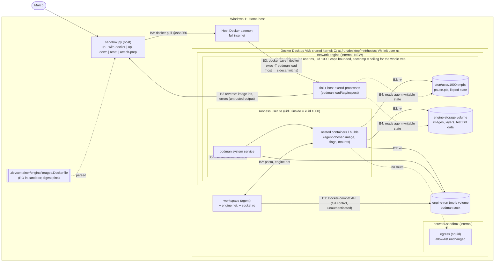

<!-- gate: G3 | verdict: PASS-WITH-NOTES | issue: #41 -->
# Threat model: agent sandbox container-engine sidecar (issue #41)

- Scope: option B in `docs/architecture/agent-sandbox-docker-sidecar.md` (G2 PASS) and the ADR-0010 amendment "2026-09-24 (issue #41)" (Proposed). **Nothing is built yet.** Branch `issue/41-docker-sidecar` at `0354cb6`.
- Mode: threat delta **before** implementation (G3). This is a delta on `docs/security/threat-models/agent-sandbox.md` (cited as **36:T-xx** and **36:G4-xx**). Everything that model covers and this one doesn't mention stays as it is.
- Manifest decisions taken as given (`docs/ai/pipeline/41.md`, "Decisions after G2"):
  - rootless Podman in an unprivileged sidecar, behind the opt-in overlay;
  - relaxations capped at the note's bounded set;
  - fallback if B fails: **no sidecar (option C), never privileged**;
  - Ryuk disabled;
  - Postgres is the only pre-loaded image.
- Change class: ci-tooling. No Decisya application boundary changes: no browser, BFF, API or data-store changes.
- Reviewer: security-reviewer agent, 2026-09-24.

## Verdict

**PASS-WITH-NOTES.** Option B is the right shape. It has:

- no `privileged`;
- no host bind, port or namespace;
- a unix socket instead of TCP;
- an `internal` network without `egress`;
- a digest-pinned allow-list that the host pre-loads;
- an overlay that leaves the #36 stack byte-identical when off.

Together these remove every *configuration* path from an agent-controlled engine to the Docker Desktop VM and `C:`. What is left is the **kernel**. The engine exists to hand the agent unprivileged user namespaces and a relaxed seccomp filter, and that is exactly the kernel surface Docker's default profile hides.

Three things keep this from being a clean PASS. Each is a High with a concrete G4 requirement, so the verdict is not BLOCK:

1. **The relaxation ladder is too permissive at the top (T-41-02).** Two rungs turn "one kernel bug away" into "one *userspace* bug away":
   - `systempaths=unconfined` together with `no-new-privileges` off (which is expected) and a setuid or file-capability helper. It makes `/proc/sys` writable, so real uid 0 in the sidecar reaches `kernel.core_pattern`, and with it VM root.
   - `seccomp=unconfined`. It is a debugging shortcut, not a need.

   G3 **tightens the stop rule** (G4-41-02). Rung 4 is never shipped. Rung 5b is allowed only with `no-new-privileges` on. If either would be needed, B has failed, and Marco's standing decision (option C) applies.
2. **Host-initiated `docker exec` into the sidecar runs in the VM's initial user namespace and reads state the agent can write (T-41-04).** The pre-load does this, and so does the runbook's `podman system prune`. That state is `XDG_RUNTIME_DIR` (the pause-process pid file) and the storage volume. The design's ID-only "already present" skip also lets tampered image layers persist across sessions (T-41-05). G4-41-04 requires a **fresh engine on every enable** (recreated sidecar and volumes, pre-load before any agent session), and G4-41-05 restricts host exec.
3. **"Every plain `up` turns the engine off" doesn't cover every path (T-41-11).** `attach-prep` calls `down` with `compose.yaml` only, which leaves an orphaned `docker` sidecar running with its nested containers. The G2 table lists `attach-prep` as "unchanged".

**T-08 re-rated for B** at the recommended ceiling (rungs 1–3, 5a, 6 within Docker's default set, 7): impact **Critical** (VM root means all of `C:`), likelihood **Low**, **residual Medium**. That is the same band as A's #36 rating, but lower within it. B closes every non-kernel path. It doesn't close the dominant path, a kernel local privilege escalation reachable from an unprivileged user namespace, and A doesn't either. The residual exists **only while `--with-docker` is on**. See [T-08 re-rated](#t-08-re-rated-for-option-b).

G6 will **BLOCK** if any "must" in [Requirements for G4](#requirements-for-g4) is neither evidenced in `docs/ai/pipeline/41.md` nor explicitly accepted by Marco with a reason. G6 will also block if the shipped relaxation set goes past the [tightened stop rule](#stop-rule-tightened-by-g3).

## ASVS mapping note

As in #36, these are tooling threats mapped **by analogy**, cited at section level. Confirm requirement numbers against the official ASVS 5.0 text before any compliance use. Sections used:

- V8.2 General authorization design (least privilege)
- V13.1 Configuration documentation
- V13.2 Backend communication configuration (outbound allow-lists)
- V13.4 Unintended information leakage
- V14.2 General data protection
- V15.1 Documentation of dangerous functionality and dependency risk
- V15.2 Isolation of dangerous functionality, pinning, resource limits
- V15.3 Defensive coding (parsing untrusted output)
- V16.3 Security events

## Data flow and trust boundaries

| Id | Boundary | Direction that matters | Enforced by | Strength |
| --- | --- | --- | --- | --- |
| B1 (= G2 SB3) | `workspace` ↔ Podman API socket | agent → engine | Socket only in the overlay; ro mount; tmpfs `mode=0750 uid=1000`. There is **no authentication**: whoever connects controls the engine. | Absent by default. When on, full control **by design**. |
| B2 (= G2 SB9, part) | Nested containers ↔ sidecar ↔ internal `engine` network | nested → sidecar paths and network peers | Mount and network namespaces resolve in the **sidecar**. The sidecar has no binds and no devices beyond the defaults plus `tun` (and `fuse`). Its only peer is `workspace`. | Hard for paths and routes (configuration) |
| B3 (new) | Host Docker daemon and `sandbox.py` ↔ sidecar (image transfer) | agent-influenced sidecar output → host launcher; host → sidecar data | Digest pull on the host; strict parsing of `images.Dockerfile`; output parsing (G4-41-06) | Medium until G4-41-06 |
| B4 (new) | Sidecar init user namespace (host `docker exec`) ↔ rootless user namespace (agent-steerable state) | agent → a process one level up | Nothing in the G2 design. G4-41-04 and G4-41-05 add freshness and minimal exec. | Weak until G4-41-04 and G4-41-05 |
| B5 (= G2 SB9, kernel) | Rootless user namespace and the sidecar ↔ VM kernel | nested → VM | Unprivileged sidecar, the seccomp ceiling, the device cgroup, capability bounding, masked `/proc` paths | **The residual: T-08.** Medium at most. See the ladder. |

## What the agent can do with full Podman API access

The agent in `workspace` can drive every Docker-compat and libpod endpoint. The table traces each capability to where it lands. The rule behind it: **every flag resolves in the sidecar's namespaces, and the sidecar's seccomp filter is inherited and can't be removed.** Whatever the sidecar can't do, a nested container can't do either, whatever flags the agent passes.

| Capability (API or flag) | Lands in | New reach vs `workspace` alone | Threat |
| --- | --- | --- | --- |
| Any image with any command, as "root" | Rootless user ns: uid 0 = kuid 1000, subuids = kuid 100000+ | Namespace-local capabilities, so it can create user, net, mount and pid namespaces, mount tmpfs, proc, overlay and FUSE, and use raw sockets. **This is the kernel-surface increase (B5).** | T-41-01 |
| `-v`/`--mount` bind of any path, `--volume` in builds, kube `hostPath` | The **sidecar's** mount namespace. There is no host bind in the sidecar, so there is no path to the VM or `C:`. Reachable: the image rootfs (ro), `/run/decisya-engine` (socket), the storage volume, `/run/user/1000`, tmpfs, and the sidecar's `/proc` and `/sys` (ro). | Tampering with the engine's own state: images, layers, the pause pid file and the socket | T-41-04, T-41-05, T-41-12 |
| `--privileged`, `--cap-add ALL`, `--security-opt seccomp=unconfined` on a nested container | Capabilities in the rootless user ns only. It drops **Podman's** nested filter; the sidecar filter stays. Devices: only what the sidecar's `/dev` has (defaults, `tun`, `fuse`). | None beyond the rootless user ns. Proof: G2 section 7 + G4-41-12. | T-41-03 |
| `--pid host`, `--ipc host`, `--uts host`, `--cgroupns host`, `--userns host`, `--network ns:<path>` / `--pid ns:<path>` | The sidecar's (or the rootless user ns's) namespaces. No VM namespace file exists in the sidecar, and joining an init-owned namespace needs `CAP_SYS_ADMIN` in the VM's init user ns. | Visibility of the sidecar's processes. Signals to kuid-1000 processes are allowed: DoS of the engine, which the agent controls anyway. ptrace across the user ns is denied. | T-41-03 |
| `--network host`, `pasta:<options>`, custom `podman network create` | The sidecar netns or rootless-netns. Peers: `workspace` over `engine`, itself. No default route, no `egress`. `--pcap`-style pasta options write only to sidecar paths. | Nested → `workspace` listening ports. A relay to `egress` needs agent code in `workspace`, which already has `egress`. | T-41-07 |
| `--device`, `--device-cgroup-rule` | The sidecar `/dev` only. No VM block device exists there, and the cgroup rule is ignored rootless. | None | T-41-08 |
| `build` from agent-written Dockerfiles | `RUN` = nested container. `FROM`/`ADD <url>` needs a pull or network, which fails. | Same as running a container | T-41-03 |
| `load`/`import` of agent-built archives, `tag` | The storage volume | The agent can **re-tag its own image as the allow-listed name**. The pre-load ID check catches that, but not in-place layer edits. | T-41-05 |
| Pull, push, `image scp`, manifest push | Network: none. Policy: G4-41-07 | None (fail closed twice) | T-41-14 |
| Resource use (fork, memory, disk, image builds) | The sidecar cgroup (nested cgroups disabled) plus the storage volume on the VM's VHDX | Disk is **not** bounded by any cgroup | T-41-09 |
| Hand the socket to a nested container | Only by explicit mount. Ryuk is disabled, so nothing does it by default. | Third-party image code (Postgres, and later Keycloak) would control the engine | T-41-16 |

## Relaxation ladder: marginal cost on the shared kernel

Baseline for comparison: a default Docker container (the #36 `workspace`). The kernel is shared by the whole Docker Desktop VM, including `egress`, `workspace` and every other container Marco runs. Wherever this table says "VM", read "all of `C:`".

| Rung | What it opens | Marginal escape cost | G3 position |
| --- | --- | --- | --- |
| 1 `cap_drop ALL` + `SETUID`, `SETGID`; NNP on; default seccomp; `/dev/net/tun` | `tun` driver. The capabilities are in the bounding set only (uid 1000 holds none effective). | Low. `tun` is reachable only with `CAP_NET_ADMIN` in some user ns, which needs rung 3. | Acceptable |
| 2 NNP **off** | Setuid and file-capability binaries in the sidecar image can raise privileges **in the VM init user ns** (bounded by the capability set). A bug in `newuidmap`/`newgidmap`, or in any other setuid binary left in the Fedora image (`su`, `passwd`, `chage`…), gives real uid 0 in the sidecar. | Medium on its own. Uid 0 is still in a default-capability, masked-`/proc`, device-cgroup container, so it needs a kernel bug. It **becomes High combined with 5b**. Nested containers can't use these helpers: a setuid bit owned by an unmapped uid is ignored in a user ns. | Acceptable **only with G4-41-03** (every setuid and file-capability bit removed except `newuidmap`/`newgidmap`) |
| 3 Custom seccomp: default + `unshare`/`clone` namespace flags, `setns`, `mount`, `umount2`, `pivot_root` (and `keyctl` in the G2 list) | Unprivileged user namespaces for the whole tree. With them come namespace-local `CAP_NET_ADMIN` (nf_tables and netlink), overlayfs, the mount API and FUSE mounts inside the user ns. **This is the main likelihood driver.** Most of the container-relevant kernel local privilege escalations of recent years (nf_tables use-after-frees, overlayfs copy-up, user-ns and mount-API bugs) need exactly this and are blocked by Docker's default profile. | **Medium.** This rung is why T-08 isn't Low. It is narrowed by G4-41-01 (keep `keyctl`, `io_uring`, `bpf`, `perf_event_open`, `userfaultfd` blocked) and G4-41-11 (deny `NETLINK_NETFILTER`). | Acceptable. **This is the ceiling for seccomp.** |
| 4 `seccomp=unconfined` | Everything in 3, plus `io_uring`, `bpf` (subject to `unprivileged_bpf_disabled`), `perf_event_open` (subject to `perf_event_paranoid`), `keyctl`/`add_key`, `userfaultfd`, `ptrace` and so on, **for every nested container too** | Medium-High. It adds several independent local-privilege-escalation-prone subsystems, and it is never *needed*: rung 3 can always be extended one recorded syscall at a time. | **Not acceptable. Never shipped** (diagnostic use only, recorded). Needing it triggers the stop rule. |
| 5a `pidns = "host"` for nested (`containers.conf`) | Nested containers share the sidecar pidns and see its processes. They can signal kuid-1000 processes (DoS of the engine). ptrace across the user ns is denied. | Low. Nothing new toward the VM. | Acceptable |
| 5b `systempaths=unconfined` on the sidecar | `/proc/sys`, `/proc/sysrq-trigger`, `/proc/irq`, `/proc/bus` become **writable mounts**. `/proc/kcore`, `/proc/keys`, `/proc/timer_list` and `/sys/firmware` are unmasked. Writes to `/proc/sys` are gated by file mode (uid 0) for most sysctls, not by a capability. So **real uid 0 in the sidecar can set `kernel.core_pattern` to a pipe, and the VM runs it as root**, or it can write `sysrq-trigger` (VM crash). | **High when NNP is off** (rung 2), because one setuid or file-capability helper bug then equals VM root, with no kernel bug needed. Low-Medium with NNP on and no setuid binary. | **Stop rule** unless NNP stays on and `find -perm /6000` plus `getcap` show nothing (G4-41-02) |
| 6 Capabilities widened within Docker's default set | They enter the bounding set only, so they matter after a uid-0 or file-capability gain. `SETFCAP` is **expected**: kernels ≥ 5.12 require `CAP_SETFCAP` in the parent ns to write a uid map that maps uid 0 (U-41-21). | Low per capability. `NET_RAW` and `MKNOD` are the ones to avoid unless an error is recorded. | Acceptable, one capability at a time with its recorded error. Anything outside Docker's default set is the G2 stop rule. |
| 7 `/dev/fuse` (+ fuse-overlayfs) | The FUSE driver for the tree. FUSE is also a classic race-widening helper in kernel exploits. | Low-Medium | Acceptable only after the native-overlay error is recorded |
| 8 `apparmor=unconfined` | A no-op if AppArmor isn't active in the VM (U-41-4). Otherwise it removes a MAC layer. | None / Medium | Acceptable **only if** `docker info` shows no AppArmor in `SecurityOptions`. Otherwise stop. |

### Stop rule, tightened by G3

The G2 stop rule stays: `privileged`, `CAP_SYS_ADMIN` or any capability outside Docker's default set, a host namespace, a host bind, or a device other than `/dev/net/tun` and `/dev/fuse` all mean **B has failed**. G3 adds these triggers:

1. `seccomp=unconfined` in the shipped configuration (rung 4).
2. `systempaths=unconfined` while `no-new-privileges` is off, or while any setuid or file-capability binary remains in the engine image (rung 5b).
3. `apparmor=unconfined` while AppArmor is active in the VM (rung 8).
4. `keyctl`/`add_key`/`request_key` allowed without a recorded error after `keyring = false` was tried (G4-41-01).

When the stop rule triggers, the manifest decision applies: **option C, no sidecar, never privileged**. G4 records "B failed: <rung, exact error>" and stops.

## T-08 re-rated for option B

| Configuration | Chain from the agent to VM root | Impact | Likelihood | Residual |
| --- | --- | --- | --- | --- |
| Engine **off** (default; plain `up`) | No engine. #36 state. | — | — | **None added** (T-08 doesn't apply) |
| B at the ceiling (rungs 1, 2 with G4-41-03, 3 per G4-41-01, 5a, 6 in the default set, 7, 8 as a no-op) | (i) A kernel bug reachable from an unprivileged user ns under the custom filter, which **alone** gives kernel code execution and so everything. Or (ii) a rootless-user-ns escape, then a uid-0 gain via a helper bug, then a container escape from a default-capability, masked, unprivileged container: **three bugs**. Path (i) dominates. | Critical (VM root means `C:`, UserSecrets, `%USERPROFILE%\.claude`) | Low: it needs a prompt-injected agent **and** a working exploit for the exact Docker Desktop kernel. Patch level is the lever (G4-41-10). | **Medium** |
| B + rung 4 | (i) with a larger surface (`io_uring`, `bpf`, `keyctl` and more) | Critical | Low-Medium | Medium-High, **rejected** |
| B + rung 5b with NNP off | (i), or (ii) shortened to **one userspace bug** (setuid helper) then `core_pattern` | Critical | Medium | **High, rejected** |
| A (privileged dind-rootless), for reference | (i), or a rootless-ns escape then **trivial** VM root | Critical | Low-Medium | Medium (#36 rating). **Excluded by Marco's decision.** |

B is strictly better than A because it closes path (ii)'s trivial last step. It lands in the same Medium band because path (i), the kernel, is common to both, and user namespaces are the reason the engine exists. The residual is accepted only with the G4-41 requirements. The runbook must say it plainly (G4-41-15): **while `--with-docker` is on, a kernel exploit run by the agent can read all of `C:`. Turn the engine off when you're not running integration tests.**

## Threats

| Id | Element / flow | STRIDE | Threat | Severity | Mitigation | ASVS 5.0 id | Status |
| --- | --- | --- | --- | --- | --- | --- | --- |
| T-41-01 | B5: rootless user ns and the seccomp ceiling → VM kernel (**36:T-08 re-rated, R-2**) | E | The agent runs arbitrary code with namespace-local capabilities under a relaxed filter. A kernel local privilege escalation reachable from an unprivileged user ns (nf_tables, overlayfs, mount API, FUSE, `tun`) gives kernel code execution in the shared VM, and so all of `C:`. | High (impact Critical), residual **Medium** | Design: opt-in overlay, off by default; no `privileged`, `SYS_ADMIN`, host ns or binds. **G4-41-01** (derived custom profile with a minimal, recorded delta), **G4-41-11** (deny `NETLINK_NETFILTER`), **G4-41-10** (version floor), **G4-41-15** (runbook residual), G2 section 0 | V15.2, V8.2 | Accepted residual with G4 requirements |
| T-41-02 | Relaxation ladder rungs 2 + 4 + 5b + 8 | E | Shipping `seccomp=unconfined`, or `systempaths=unconfined` with NNP off, turns T-41-01's chain into one userspace bug (a setuid helper, then real uid 0, then writable `/proc/sys` `core_pattern`, then VM root) or a much wider kernel surface. The G2 stop rule doesn't list these. G2 even lists rung 4 as a permitted step. | High | **G4-41-02** (tightened stop rule), **G4-41-03** (setuid and file-capability strip), **O-41-01** (line lint for the forbidden options now) | V15.2 | Open; requirement for G4 |
| T-41-03 | B1/B2: nested privilege flags and namespace options | E | `--privileged`, `--cap-add ALL`, `--pid/ipc/uts/cgroupns host`, `ns:<path>` joins, `--userns host`, nested `seccomp=unconfined`, builds. The worry is that one of them resolves to the VM rather than the sidecar. | Medium (by design Low, pending proof) | Design: everything resolves in the sidecar, and the sidecar filter is inherited. G2 section 7, plus **G4-41-12** (b)(c)(d): `ns:` joins, `/proc/sys` read-only, the sidecar's `Seccomp: 2` seen from a nested `--privileged` container | V15.2 | Mitigated by design; verify at G4 |
| T-41-04 | B4: host `docker exec` into the sidecar (pre-load, runbook prune) | E, T | The exec'd `podman` starts as uid 1000 in the **VM init user ns**, with `newuidmap` usable (NNP off). It trusts `XDG_RUNTIME_DIR` (`/run/user/1000`: `pause.pid`, libpod state) and the storage DB. A nested container can write both (`-v /run/user/1000:/x`, `-v ~/.local/share/containers:/s`: nested root = kuid 1000 = owner). Agent-planted state steers a process that is one level above the rootless ns: it joins attacker-chosen namespaces, parses attacker files, and may exec helpers with attacker-chosen `mount_program`/hook paths. G3 found no concrete escape through this, but it is a bridge built from agent-writable state, and the G2 design re-uses a long-lived sidecar and volumes across sessions. | Medium | **G4-41-04** (fresh sidecar and volumes on every `--with-docker`; pre-load before any session; refuse while `claude` runs), **G4-41-05** (exec only as the service user, a fixed command set, never `--privileged`/`-u 0`; housekeeping by `down`/`reset`, not exec) | V8.2, V15.2 | Open; requirement for G4 |
| T-41-05 | B3: pre-loaded image integrity and tag handling | T | (a) The skip check compares the image **ID** (config digest) only. Layers edited in place in the storage volume (reachable as T-41-04 shows) keep the ID and survive later `--with-docker` runs as "already present", so a later clean session tests against a backdoored `postgres`. (b) Re-tagging an agent image as `postgres:17-alpine` is caught by the ID mismatch (good). (c) Short-name resolution: if a pull were ever possible, a mistyped tag would pull from a search registry. | Medium | **G4-41-04** (fresh storage, so there is no persistence to skip), **G4-41-07** (`policy.json` rejects every remote transport; empty search registries; `short-name-mode = "enforcing"`), G2 section 4. If Marco prefers a persistent store for speed, the residual (a) must be accepted by name in the manifest. | V15.2 | Open; requirement for G4 |
| T-41-06 | B3 reverse: sidecar output → `sandbox.py` and Marco's terminal | T, E | `sandbox.py` parses `podman image inspect`/`load` output and prints image names. The agent influences that output (tags, labels, storage DB), including terminal escape sequences (OSC 52 clipboard writes, title spoofing) and values that flow into later argv. `images.Dockerfile`'s `(\S+)` repository group accepts a leading `-`, which is argument injection into `docker pull`/`save`. The file is read-only in the sandbox and host-reviewed, which is why this is Low. | Low | **G4-41-06** (strict reference grammar with no leading `-`; `--` before positionals; output matched by an exact `sha256` regex; control characters stripped before printing; never used in a shell) | V15.3 | Open; requirement for G4 |
| T-41-07 | B2: nested network egress and lateral movement (**36:T-10 extended**) | I, E | A nested container (agent- or third-party-image code) tries the internet, `egress:3128`, `192.168.65.0/24`, `host.docker.internal`, `http.docker.internal:3128`, IPv6, DNS exfiltration through Docker's embedded resolver or pasta's DNS forward, a custom rootless network, `--network host`, and pasta options. It can reach `workspace` listeners over `engine`. | Medium | Design: `engine` `internal`, no `egress` member, `dns: [127.0.0.1]`, no IPv6. G2 section 5, plus **G4-41-12** (e)(f): custom network probe, random-name lookup from nested. SB2 re-verified (G2 section 10). A relay in `workspace` gives nested containers only what `workspace` already has, so it is accepted. | V13.2, V13.4 | Mitigated by design; verify at G4 |
| T-41-08 | B2: nested access to Windows drives and VM paths | I | `-v /run/desktop/mnt/host/c:/c`, `-v /:/host`, `--device /dev/sda`, `mknod`, `/sys` or `/proc` of the VM | Medium (by design Low, pending proof) | Design: no binds and no extra devices in the sidecar; `C:` exists only in the VM's mount ns. G2 section 6 (canary grep), plus **G4-41-12** (a) (the `docker inspect .Mounts` whitelist is repeated after the final ladder) | V15.2, V14.2 | Mitigated by design; verify at G4 |
| T-41-09 | Resources (**36:T-21 extended**) | D | CPU, memory and pids are bounded by the sidecar cgroup (nested cgroups disabled, and `/sys/fs/cgroup` is read-only, so nested can't leave it). **Disk is not bounded**: image builds and layers in the storage volume grow the Docker Desktop VHDX on `C:`. The limits total 14.25 GiB against the VM memory setting (U-41-16). | Low | Design limits. **G4-41-04** (the storage volume is recreated on every enable, so growth is per session). G2 section 9. | V15.2 | Open; requirement for G4 |
| T-41-10 | Storage volume: data from nested containers | I | Test databases, anonymous volumes and container logs (`k8s-file`) persist in `decisya-sandbox-engine-storage` until `reset`, including after a crash with Ryuk off. Today it is synthetic test data only. If a test ever used real exports or real credentials, they would sit on the VHDX. | Low | **G4-41-04** (fresh per enable); `reset` removes the volume (design); runbook: integration tests use synthetic data only | V14.2 | Open; requirement for G4 |
| T-41-11 | Overlay-off guarantee (**36:G4-12(a)**) | E | "Every plain `up` turns the engine off" holds for `up`, but `attach-prep` calls `down` with `compose.yaml` only. The `docker` container becomes an orphan and keeps running with its nested containers, the `engine` network and the storage volume, so the T-08 exposure continues without Marco knowing. A failed or partial `up` (the `--wait` timeout) can also leave `workspace` on the overlay. VS Code's "Reopen in Container" path uses `compose.yaml` without `--remove-orphans`. | Medium | **G4-41-08** (every stop path passes both files + `--remove-orphans`; a post-condition check after plain `up`; an engine ON/OFF banner in `claude` and `shell`) | V13.1, V15.2 | Open; requirement for G4 |
| T-41-12 | B1: engine socket (**36:T-25**) | S, I | **36:T-25 is removed**: there is no TCP listener and no certificates. The replacement surface is an unauthenticated unix socket. Reach: `workspace` (uid 1000, ro), the sidecar, and any nested container the agent mounts it into. A nested container can also unlink the socket and plant an impostor on the rw side (agent against agent, so no gain). | Low | Design: tmpfs `0750 uid=1000`, ro in `workspace`, overlay only. G2 section 3 (no `0A` listener, 2375/2376 refused). | V8.2 | Mitigated by design; verify at G4 |
| T-41-13 | Supply chain: engine image and test images (**36:T-16 extended**) | T | `quay.io/podman/stable` (Fedora, with setuid tooling) becomes the **most privileged image in the stack**: NNP off, running in the VM init user ns. The Postgres image runs third-party code in nested containers. A digest pin stops mutation, not a bad original. Digest bumps come from Dependabot PRs (external input) or manual edits. | Medium | Design: `@sha256` pins, vendor namespaces, host-side pull, `images.Dockerfile` read-only in the sandbox and flagged by host-review. **G4-41-03**, **G4-41-13** (provenance, cadence, no unpinned `dnf` in the engine Dockerfile, build context `.devcontainer/engine`, `--platform` on save, one-line justification per image in the PR) | V15.1, V15.2 | Open; requirement for G4 |
| T-41-14 | Registries and `egress` (**36:T-11**, **36:G4-10(b)**) | I | Would adding registries open an upload channel? It doesn't. | Low | Design: registries are **never** allow-listed; `egress` is unchanged. This meets 36:G4-10(b) in its strongest form. G2 section 4 (`git diff` on `.devcontainer/egress` is empty; no engine subnet in the squid log). G4-41-07 as a second layer. | V13.2 | Mitigated by design; verify at G4 |
| T-41-15 | Regression guard: `lint.py` `sandbox-config` (**36:T-18**) | T | The overlay is now scanned (`lint.py:160`, commit `0354cb6`), but the line-regex list has no entry for `seccomp=unconfined`, `systempaths=unconfined`, `apparmor=unconfined`, `SYS_ADMIN`, host `pid`/`ipc`/`network_mode`/`userns_mode`, or a `local`-driver bind in `driver_opts`. A later edit could cross the stop rule silently until #39 lands. | Medium | **O-41-01** (add those patterns to `SANDBOX_FORBIDDEN` now, with scratch negatives); #39 parse-based rules as specified in the G2 note | V15.2, V13.1 | Open; requirement for orchestrator |
| T-41-16 | Nested containers holding the engine socket (Ryuk, O-3) | E | Ryuk, or a test fixture that mounts `DOCKER_HOST`'s socket into a container, hands engine control to **third-party image code**. That code isn't the agent, so the "agent already controls it" argument doesn't apply. | Low | Design: Ryuk disabled in the sandbox (the more secure choice; agreed). **G4-41-14**: no test or fixture mounts the socket; re-run G3 if O-3 flips. | V8.2 | Mitigated by design |
| T-41-17 | Detection | R | Engine activity (images built, containers run, flags used) leaves no record outside the sidecar. Squid logs show nothing because there's no egress. | Low | **Should:** `events_logger = "file"` with the path on the storage volume, and the runbook shows `podman events --since` via an exec *before* the next enable recreates the store. Accepted otherwise. | V16.3 | Open; recommendation |

### Status of the #36 items this issue inherits

The #36 file keeps its verdict line and statuses. G6 for #41 records the outcome here.

| #36 item | Status under #41 option B |
| --- | --- |
| T-08 / R-2 | Re-rated as **T-41-01**: residual **Medium**, lower than A within the band, and only while `--with-docker` is on. The ladder is capped by the tightened stop rule (T-41-02). |
| T-10 | Extended to nested containers (T-41-07). G2 sections 5 and 10 are the probes. |
| T-11, G4-10(b) | Met in the strongest form: registries never allow-listed (T-41-14) |
| T-16 | Extended by T-41-13 |
| T-21 | Extended by T-41-09 (the disk is the new unbounded part) |
| T-25 | **Removed**: no TCP listener. Replaced by T-41-12 (Low). |
| G4-12 (a) off by default | Met by the overlay (Marco accepted O-5). Strengthened by G4-41-08. |
| G4-12 (b) non-root daemon | `podman info … Rootless` = `true`, `id -u` = 1000 (G2 section 2) |
| G4-12 (c) no `ports:`, only the certs volume shared, no host bind | Now: no `ports:`, only `decisya-sandbox-engine-run` shared, no bind (G2 section 2) |
| G4-12 (d) limits | G2 sections 2 and 9 |
| G4-12 (e) current Docker Desktop, `wsl --update` | Runbook (G2 section 11) **plus** the G4-41-10 version floor |
| G4-12 (f) digest pin and cadence | G4-41-13 |
| G4-12 "should" (evaluate rootless Podman) | Delivered: the G2 section 0 spike is the evaluation of record |

## Requirements for G4

"Must" items are conditions for G6 PASS. For each one, paste the command and its output into `docs/ai/pipeline/41.md` under "G4 evidence", or record Marco's explicit acceptance with a reason. **All checklist items in the G2 note ("What G4 must verify", sections 0–11) are "must" as well.** The items below add to them.

| Id | Level | Requirement | Covers |
| --- | --- | --- | --- |
| G4-41-01 | must | **Seccomp profile (rung 3).** `.devcontainer/engine/seccomp.json` is derived from moby's `profiles/seccomp/default.json` **for the recorded Docker Engine version**. Record the upstream URL and commit in the G4 evidence. The delta is **additions only**, and each one is justified by a recorded failing command and error. Expected candidates: `unshare`, `clone`/`clone3` with namespace flags, `setns`, `mount`, `umount2`, `pivot_root`. `keyctl`, `add_key` and `request_key` stay blocked: set `keyring = false` in `containers.conf` first, and add them only with a recorded error that persists. `io_uring_*`, `bpf`, `perf_event_open`, `userfaultfd`, `kexec_*`, `open_by_handle_at`, `init_module`/`finit_module` and `delete_module` stay as upstream has them. **Evidence:** a script-produced or pasted diff of the committed profile against upstream that shows only the recorded additions; `[engine] grep Seccomp /proc/self/status` shows `2`. | T-41-01, T-41-02 |
| G4-41-02 | must | **Tightened stop rule** ([section above](#stop-rule-tightened-by-g3)). The shipped `docker` service has none of: `seccomp=unconfined`; `systempaths=unconfined` while NNP is off or a setuid or file-capability binary remains; `apparmor=unconfined` while AppArmor is active; a capability outside {`SETUID`, `SETGID`} plus the recorded additions within Docker's default set. Rung 4 may be tried **diagnostically only**, and the output is recorded. If B works only past this line, record "B failed: <rung, error>" and stop; option C applies (manifest). **Evidence:** the one-line final relaxation set (G2 section 0) and `docker inspect <docker> --format '{{.HostConfig.SecurityOpt}} {{.HostConfig.CapAdd}}'`. | T-41-02 |
| G4-41-03 | must | **No stray privilege helpers in the engine image.** The engine `Dockerfile` removes the setuid and setgid bits and file capabilities from every file except `newuidmap` and `newgidmap`. **Evidence:** `[engine] find / -xdev \( -perm -4000 -o -perm -2000 \) -type f` lists only those two (or nothing, if they use file capabilities). `[engine] getcap -r / 2>/dev/null` lists only those two, with exactly `cap_setuid`/`cap_setgid` (plus `cap_setfcap` if U-41-21 requires it). `[engine] grep NoNewPrivs /proc/self/status` is recorded. | T-41-02, T-41-13 |
| G4-41-04 | must | **Fresh engine on every enable.** `sandbox.py up --with-docker`: (1) refuses while a `claude` process runs in `workspace` (reuse `process_running_in_workspace`); (2) stops and removes the `docker` container, then removes and recreates `decisya-sandbox-engine-storage` and `decisya-sandbox-engine-run` (tolerating their absence); (3) runs `up` with `--force-recreate` for `docker`; (4) pre-loads every image **before returning**, so no agent session has touched the store when the host execs into it. The ID-based "already present" skip (U-41-12) becomes moot. If Marco prefers to keep a persistent store for speed, T-41-04 and T-41-05(a) are recorded as accepted residuals in the manifest. **Evidence:** two consecutive `up --with-docker` runs show different `docker volume inspect … --format '{{.CreatedAt}}'` values for both volumes, and every image "loaded"; the refusal while `claude` runs is shown. | T-41-04, T-41-05, T-41-09, T-41-10 |
| G4-41-05 | must | **Host exec discipline.** `sandbox.py` execs into `docker` only as the service user (no `-u`/`--user`, never `--privileged`, never `-e` other than what `podman` needs), and only `podman load`, `podman tag` and `podman image inspect`/`podman images`. The runbook replaces "`podman system prune` via `docker … exec docker`" with `down` / `reset` / `up --with-docker`. Any remaining debug exec is labelled "debugging only, engine state is agent-controlled". **Evidence:** `Select-String -Path .devcontainer\sandbox.py,docs\runbooks\agent-sandbox.md -Pattern 'exec'` with each hit accounted for. | T-41-04 |
| G4-41-06 | must | **Parsing at B3.** The `images.Dockerfile` regex is tightened: the repository follows the OCI reference grammar (lower-case `[a-z0-9]` start, `[a-z0-9._/-]`, an optional `host[:port]/` prefix) and **never starts with `-`**; the tag is `[A-Za-z0-9_][A-Za-z0-9._-]{0,127}`; the digest is `[0-9a-f]{64}`. Positional image arguments come after `--` wherever the CLI accepts it. Sidecar output is matched against `^(sha256:)?[0-9a-f]{64}$` (IDs) or the exact expected tag; anything else fails closed. Nothing from the sidecar is printed without first stripping C0/C1 control characters. **Evidence:** scratch copies with `FROM -x:1@sha256:<64 hex> AS a` and with a `RUN` line are refused (extends G2 section 4). | T-41-06 |
| G4-41-07 | must | **Pulls fail closed regardless of the network.** In the engine image: `/etc/containers/policy.json` has `default: [{"type":"reject"}]` and `insecureAcceptAnything` only for the `docker-archive`, `oci-archive` and `containers-storage` transports; `registries.conf` has `unqualified-search-registries = []` and `short-name-mode = "enforcing"`. There is no writable user-level override: `/home/podman/.config` is on the read-only rootfs. **Evidence:** `[engine] podman pull docker.io/library/alpine:3` fails with a **policy** error (record it); the pre-load and the G2 section 8 smoke test still pass. If the policy breaks the Testcontainers path, record the error and Marco decides whether to downgrade this to "should" (U-41-22). | T-41-05, T-41-14 |
| G4-41-08 | must | **Engine off on every stop path.** `down`, `reset` **and `attach-prep`** pass both `-f` files and `--remove-orphans`. After plain `up`, `sandbox.py` asserts that no container with `com.docker.compose.service=docker` exists in the project and that `workspace`'s networks are exactly `{decisya-sandbox_sandbox}`. If not, it exits non-zero with a clear message. `claude` and `shell` print `container engine: ON` or `OFF` before starting. **Evidence:** `up --with-docker`, then `attach-prep`, then `docker compose -p decisya-sandbox ps --all` shows no `docker`; `up --with-docker`, then `up`, shows the post-condition passing; the banner is shown in both states. | T-41-11 |
| G4-41-09 | must | **Nested probes (G2 section 7), run with the final relaxation set, not an intermediate rung.** If the ladder changes after the probes, they are re-run. | T-41-03, T-41-08 |
| G4-41-10 | must | **Kernel and patch floor.** `up --with-docker` reads `docker version --format '{{.Server.Version}}'` and `docker info --format '{{.KernelVersion}}'`, prints both, and refuses below a floor constant in `sandbox.py`. The floor is set to the G4-recorded Docker Desktop engine version and bumped with the image-digest cadence. **Evidence:** the output line; a scratch copy with the floor above the current version refuses. | T-41-01 |
| G4-41-11 | should | **Deny `NETLINK_NETFILTER`.** In the custom profile, return `EPERM` for `socket` with `AF_NETLINK` (16) and protocol `NETLINK_NETFILTER` (12). This removes nf_tables from the tree, the most frequent user-ns local-privilege-escalation surface. Keep it if the smoke test passes (default pasta networking shouldn't need it, U-41-23). Revisit it when the first multi-container test needs a custom rootless network (U-41-9); record which way it went. | T-41-01 |
| G4-41-12 | must | **Additional probes** (append to the G2 checklist): (a) after the final ladder, `docker inspect <docker> --format '{{json .Mounts}}'` again shows only the two engine volumes and tmpfs; (b) `[engine] grep -E ' /proc/(sys\|sysrq-trigger) ' /proc/self/mountinfo` shows `ro` (rung 5b not in use), and `[engine] sh -c 'echo x > /proc/sys/kernel/core_pattern'` fails; (c) record `[engine] cat /proc/sys/user/max_user_namespaces /proc/sys/kernel/unprivileged_bpf_disabled /proc/sys/kernel/perf_event_paranoid /proc/sys/vm/unprivileged_userfaultfd 2>&1` (U-41-24); (d) `[engine] podman run --rm --privileged --security-opt seccomp=unconfined <probe> grep Seccomp /proc/self/status` shows `2` (the sidecar filter is inherited), and `podman run --rm --network ns:/proc/1/ns/net <probe> ip addr` shows only the sidecar's interfaces; (e) `[engine] podman network create t && podman run --rm --network t <probe> sh -c 'wget -T 5 -qO- http://1.1.1.1; nslookup example.com'` fails (skip, with a note, if custom networks don't work: U-41-9); (f) `[nested] nslookup $(head -c8 /dev/urandom \| od -An -tx1 \| tr -d ' \n').example.com` fails, and no engine-subnet client appears in the squid access log. | T-41-03, T-41-07, T-41-08 |
| G4-41-13 | must | **Supply chain.** The engine `Dockerfile` has `FROM quay.io/podman/stable@sha256:…` and no unpinned package install (if a `dnf install` is unavoidable, pin the exact NEVRA and record why). The build context is `.devcontainer/engine`. `images.Dockerfile` holds only `docker.io/library/postgres:<tag>@sha256:…` (O-4: Postgres only). The pre-load uses `docker save --platform linux/amd64` (or the host architecture), per U-41-25. Dependabot covers `/.devcontainer/engine`, or, if U-41-17 fails, the runbook has a monthly manual bump with the date of the last bump. The PR body gives a one-line justification per image (CLAUDE.md working agreement). | T-41-13 |
| G4-41-14 | should | **The socket stays with the agent.** No test, fixture or `containers.conf` default mounts `/run/decisya-engine` or sets `DOCKER_HOST` inside a nested container. G6 greps `tests/**` and `.devcontainer/engine/**` for `podman.sock`, `decisya-engine` and `DOCKER_SOCKET_OVERRIDE`. If O-3 is reversed (Ryuk on), G3 is re-run first. | T-41-16 |
| G4-41-15 | must | **Runbook.** In the "What the sandbox does not protect" section: the T-41-01 residual in plain words (engine on means a kernel exploit reaches `C:`); "enable only for integration runs; `up` or `down` afterwards"; update Docker Desktop and run `wsl --update` before enabling (36:G4-12(e)); after a suspected prompt injection, `reset`; integration tests use synthetic data only (T-41-10). Each step in VS 2026 \| CLI form. | T-41-01, T-41-10, T-41-11 |
| G4-41-16 | should | **Engine audit trail.** `events_logger = "file"` with `events_logfile_path` on the storage volume; the runbook shows how to read it before the next enable recreates the store. | T-41-17 |

### Requirements for the orchestrator (outside the devops lane)

| Id | Requirement | Covers |
| --- | --- | --- |
| O-41-01 | Add these to `SANDBOX_FORBIDDEN` in `.claude/scripts/lint.py` now, with the `allow-privileged` exemption **not** applying to them: `seccomp[=:]\s*unconfined`, `systempaths[=:]\s*unconfined`, `SYS_ADMIN`, `(pid\|ipc\|network_mode\|userns_mode):\s*"?host`, and `o:\s*"?[^"]*\bbind\b` / `type:\s*(none\|bind)` inside `driver_opts`. `apparmor=unconfined` goes in too if G4 doesn't need rung 8. Add a scratch negative for each. The parse-based rules stay with #39. | T-41-02, T-41-15 |
| O-41-02 | If G4-41-04 changes `sandbox.py`'s `up --with-docker` behaviour (always-fresh store), ask the architect for a one-line amendment to the G2 note's pre-load step 2 (the ID skip) and to the `sandbox.py` subcommand table (`attach-prep` is no longer "unchanged"). | T-41-04, T-41-11 |

## What G6 must see per rung

For each rung, G6 needs the rung's **error** (why it was climbed) or its **absence** (proof it wasn't). An intermediate rung that was tried and then backed out needs its output recorded too.

| Rung | If used, G6 needs | If not used, G6 needs |
| --- | --- | --- |
| 1 | `docker inspect` caps, security options and devices; `[engine] grep -E 'Cap(Eff\|Bnd)' /proc/self/status` | — (always used) |
| 2 NNP off | The exact failure with NNP on (typically `newuidmap: write to uid_map failed`), **and** G4-41-03's `find`/`getcap` output | `grep NoNewPrivs` = 1 |
| 3 custom seccomp | The failing command and error per added syscall; the upstream diff (G4-41-01); `Seccomp: 2` | `Seccomp: 2` with the unmodified default profile |
| 4 unconfined | Must **not** be shipped. Diagnostic output only, if tried, plus the final `SecurityOpt` without it. | `SecurityOpt` without it |
| 5a `pidns=host` | The nested `/proc` mount error without it; the nested `ps` count equal to the sidecar's (G2 section 7) | — |
| 5b `systempaths` | Only with NNP **on** and an empty `find`/`getcap`; otherwise it's the stop rule | G4-41-12(b): `/proc/sys` `ro`, and the `core_pattern` write fails |
| 6 capabilities | The error per capability (expected: `SETFCAP` for mapping uid 0, U-41-21); capabilities ⊆ Docker's default set | `CapAdd` = `[SETUID SETGID]` exactly |
| 7 `/dev/fuse` | The native-overlay error on the ext4 volume; `podman info --format '{{.Store.GraphDriverName}}'` | `Devices` shows only `/dev/net/tun` |
| 8 AppArmor | `docker info --format '{{.SecurityOptions}}'` without `apparmor` (proves it's a no-op) | The same output |
| All | The one-line final relaxation set; `docker version`, `KernelVersion`, the Docker Desktop version (G4-41-10) | — |

## New unverified assumptions (add to the G4 evidence)

| Id | Assumption | Threat |
| --- | --- | --- |
| U-41-21 | On the VM kernel (≥ 5.12), `newuidmap` needs `CAP_SETFCAP` in the parent ns to map uid 0. In that case `SETFCAP` joins `cap_add`, and the helper's file capabilities include it. | T-41-02 (rung 6) |
| U-41-22 | `podman load` of a `docker-archive` stream passes under a `policy.json` whose default is `reject`, and Testcontainers' "image exists" path issues no pull request that the policy would fail | T-41-05 |
| U-41-23 | Default pasta networking and port publishing work with `socket(AF_NETLINK, *, NETLINK_NETFILTER)` denied by seccomp | T-41-01 |
| U-41-24 | Docker Desktop's VM has `kernel.unprivileged_bpf_disabled` ≥ 1, `perf_event_paranoid` ≥ 2 and `vm.unprivileged_userfaultfd` = 0. These bound the surface that rung 4 would add (recorded for context; rung 4 stays forbidden). | T-41-01 |
| U-41-25 | `docker save <repo>@sha256:<index digest>` works under the containerd image store with `--platform`, and `podman load` accepts the resulting archive | T-41-13 |
| U-41-26 | `keyring = false` in `containers.conf` lets crun run with `keyctl` blocked by seccomp | T-41-02 |

## Residual risk after G4

- **Kernel escape while the engine is on** (T-41-01, Medium). It is bounded by the opt-in, the patch floor and a minimal seccomp delta. It exists only between `up --with-docker` and the next `up`/`down`/`attach-prep`/`reset`. Accepted on the terms above. Past the tightened stop rule the answer is option C, not A.
- **An engine the agent controls, by design.** Inside the rootless user ns the agent can run, build and load anything. Its reach is the sidecar's paths and `workspace`'s ports, and nothing that `workspace` itself can't reach.
- **CI and sandbox engine divergence** (Docker with Ryuk vs Podman without it). That's correctness, not security. The digest pin in the sandbox and a tag in CI can differ; a shared test-image constant (G2 follow-up) closes it.
- **Prompt injection** (cc:T-10) is unchanged. This issue changes only what an injected agent can reach while the engine is on.
