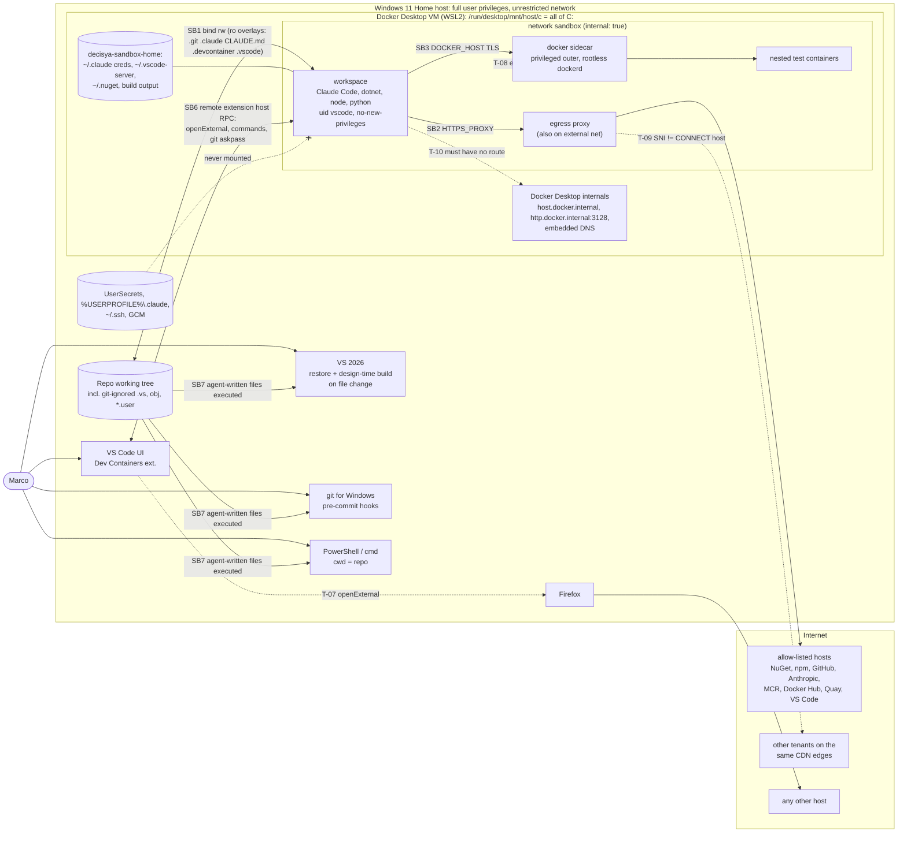

<!-- gate: G3 | verdict: PASS-WITH-NOTES | issue: #36 -->
# Threat model: agent sandbox devcontainer (issue #36)

- Scope: the ADR-0010 design as specified in `docs/architecture/agent-sandbox.md` (G2 PASS) and `docs/adr/0010-agent-sandbox-devcontainer.md` (Accepted). **Nothing is built yet.** Branch `issue/36-agent-sandbox` at `982821a`.
- Mode: threat delta **before** implementation (G3). The requirements below are design inputs for G4 (devops) and the orchestrator.
- Change class: ci-tooling. No Decisya application boundary (browser, BFF, API, data stores) changes.
- Prior context: `docs/security/threat-models/claude-config.md` (cited as **cc:T-xx**) and `docs/security/reviews/35.md`. This issue exists to mitigate cc:T-01 (Bash gets around write boundaries), cc:T-02 (pattern-scoped `tools:` not enforced) and cc:T-04 (the secret guard is pattern-based).
- Reviewer: security-reviewer agent, 2026-09-23.

## Verdict

**PASS-WITH-NOTES.** The design is sound for what it structurally encloses. With only the repository bind-mounted, no host Docker socket and an internal network with a proxy as the only exit, cc:T-01 and cc:T-04 are closed for **host paths**. cc:T-02 stops mattering outside the repository. User-secrets and the host `.claude` are absent by construction.

The design does not yet hold up in five places. Each one is a **High** with a concrete G4 requirement below, so none is unmitigated, which is why the verdict is not BLOCK:

1. **The repository is a two-way channel into the host.** The read-only overlays cover only some of the files that run code on the host. Three automatic paths stay open:
   - `.pre-commit-config.yaml` runs on Marco's `git commit` (T-01).
   - `global.json` can redirect the host SDK (T-02).
   - Files that are git-ignored and therefore invisible to `git diff` are auto-imported by MSBuild or VS 2026: `*.user`, `obj/*.nuget.g.targets` and `.vs/` (T-04).

   On top of that, VS 2026 restores and runs design-time builds as soon as files change, so "review the diff before building" (R-5) comes too late (T-03). Windows also searches the current directory for executables, so planting `python.bat` or `git.exe` in the repository root may defeat the read-only `.devcontainer` (T-05).
2. **An attached VS Code window trusts the container.** In-container code can do three things through it:
   - open URLs in the host browser (`$BROWSER`, `code --openExternal`), which bypasses the egress proxy entirely;
   - reach the host's Git credential bridge (`GIT_ASKPASS` / `VSCODE_GIT_IPC_HANDLE`);
   - plant extension code under `~/.vscode-server` that runs VS Code commands in the host UI.

   This contradicts the design's use of the VS Code extension as the agent entry point (T-07).
3. **A CONNECT-only domain allow-list can be bypassed on shared CDNs.** The agent sends `CONNECT <allowed-host>:443` and then a TLS SNI for any other site on the same CDN (Cloudflare fronts `production.cloudflare.docker.com`). The proxy must check SNI (T-09).
4. **The privileged DinD sidecar is one kernel bug away from the Docker Desktop VM**, which mounts all of `C:` under `/run/desktop/mnt/host/c` (T-08, R-2). Accepting this is reasonable only with the profile off by default and the hardening in G4-12.
5. **Exfiltration and credential theft are accepted residuals**, and both depend on how the credential is chosen (T-11, T-12). The Claude credential has to be a spend-capped API key, not a claude.ai subscription login.

G6 will **BLOCK** if any "must" requirement in [Requirements for G4](#requirements-for-g4) is neither evidenced in `docs/ai/pipeline/36.md` nor explicitly accepted by Marco with a reason.

## ASVS mapping note

ASVS 5.0 is written for applications. As in `claude-config.md`, tooling threats are mapped **by analogy** and cited at section level, because the curated `l2-controls.md` stops at chapter level. Confirm the requirement numbers against the official 5.0 text before copying them into a compliance artefact. Sections used:

- V8.2 General authorization design (least privilege, deny by default)
- V12.3 Service-to-service communication security (TLS on internal hops)
- V13.1 Configuration documentation
- V13.2 Backend communication configuration (allow-lists of outbound resources)
- V13.3 Secret management
- V13.4 Unintended information leakage
- V14.2 General data protection
- V15.1 Secure coding and architecture documentation (dangerous functionality, dependency risk)
- V15.2 Security architecture and dependencies (pinning, isolation of dangerous functionality, resource limits)
- V15.3 Defensive coding
- V16.3 Security events
- V16.4 Log protection

N/A means no ASVS control fits.

## Data flow and trust boundaries

Trust boundaries. SB1 to SB5 are from the architecture note; SB6 to SB9 are added here.

| Id | Boundary | Direction that matters | Strength after G4 requirements |
| --- | --- | --- | --- |
| SB1 | Host file system ↔ `workspace` | container → host paths | Hard for paths outside the repository |
| SB2 | `workspace` ↔ internet | container → internet | Hard for routing. Domain-level only after G4-08, and upload-capable domains remain (T-11). |
| SB3 | `workspace` ↔ Docker sidecar | container → VM | Medium (privileged sidecar, T-08) |
| SB4 | Built-in sandbox inside `workspace` | Bash → container | Optional, probably unavailable (see T-26) |
| SB5 | Lanes inside the repository | agent → other lanes | Guardrail only (cc:T-01, cc:T-02, R-6) |
| **SB6** | VS Code UI (host) ↔ VS Code server and extension host (container) | **container → host** | **None by default.** The local window trusts the remote (T-07). |
| **SB7** | Agent-written repository content ↔ host tools that execute or parse it (VS 2026, MSBuild, NuGet, git, pre-commit, npm, Explorer, host Claude sessions) | **container → host** | Read-only overlays for some paths, the rest is review only (T-01 to T-06, T-15, T-19, T-20) |
| **SB8** | Egress proxy ↔ internet and Docker Desktop internals | proxy → anywhere | Only as good as squid's ACLs and patch level (T-09, T-10, T-17) |
| **SB9** | Nested containers ↔ sidecar ↔ VM | nested → VM | Rootless daemon user plus a privileged outer container (T-08) |

## Host-executed files written from the sandbox

The task asked which of these files are read-only in the design. "Auto" means it runs without Marco taking a deliberate build or run action. "Diff-visible" means it shows up in `git diff`/`git status` without `--ignored`.

| File or path | What runs on the host | Trigger | RO in design? | Diff-visible? | Threat |
| --- | --- | --- | --- | --- | --- |
| `.git/**` (hooks, `config`: `core.fsmonitor`, `core.hooksPath`, `core.sshCommand`, filters) | arbitrary commands | any host `git` command | **Yes** | n/a | Mitigated by design |
| `.devcontainer/**` (`initializeCommand`, compose, Dockerfile) | host command, host daemon build | next container start | **Yes** | n/a | Mitigated by design; see T-05 |
| `.vscode/**` (`tasks.json` `runOn: folderOpen`, `settings.json`) | host tasks | folder open | **Yes** | n/a | Mitigated by design |
| `.claude/**`, `CLAUDE.md` | hooks, settings in host sessions | host Claude session | **Yes** | n/a | Mitigated by design |
| `.pre-commit-config.yaml` (`repo: local`, `language: system`) | arbitrary command | **every `git commit` on Windows (auto)** | **No** | Yes | **T-01 High** |
| `global.json` (.NET 10 `sdk.paths`, `msbuild-sdks`) | SDK and MSBuild SDK loaded from the repository or NuGet | **every host `dotnet` or VS 2026 load (auto)** | **No** | Yes | **T-02 High** |
| `dotnet-tools.json`, **`.config/dotnet-tools.json`** (shadows the root file) | tool package from nuget.org | `dotnet tool restore`, `dotnet ef` | No | Yes | T-02 |
| `*.csproj`, `*.slnx`, `Directory.Build.props/.targets`, `Directory.Packages.props`, `Directory.Solution.*`, `Directory.Build.rsp`, `*.props`, `*.targets`, nested copies of any of these | MSBuild tasks, `Exec`, inline `RoslynCodeTaskFactory`, `-logger:` in `.rsp`, analyzers and source generators loaded into VS | **VS 2026 restore and design-time build on file change (auto)**, host build | No | Yes | **T-03 High** |
| `NuGet.config` / `nuget.config` (any directory) | package sources, and with them package build targets | restore (auto in VS) | No | Yes | T-03 |
| `**/Properties/launchSettings.json` | `commandName: Executable`, env vars | F5 | No | Yes | T-03 |
| **`*.csproj.user`** (auto-imported by `Microsoft.Common.targets`) | MSBuild targets | VS load or build (auto) | No | **No (git-ignored)** | **T-04 High** |
| **`obj/*.nuget.g.props`, `obj/*.nuget.g.targets`, `obj/project.assets.json`, `project.nuget.cache`** in host `obj/` | MSBuild imports | VS load or build (auto); a no-op restore does not regenerate them | No | **No** | **T-04 High** |
| **`.vs/**`** (`ProjectEvaluation` cache, `*.suo`, `launch.vs.json`, `tasks.vs.json`, `VSWorkspaceState.json`) | cached evaluation, binary deserialisation, tasks | VS 2026 open (auto) | No | **No** | **T-04 High** |
| `python.bat`/`.cmd`/`.exe`, `git.exe`, `dotnet.exe`, `py.exe`, DLLs in the repository root | planted binary instead of the real one | `initializeCommand` at container start, pre-commit `entry: python …`, any cmd.exe or `CreateProcess` with cwd = repo (auto) | No | Yes (untracked) | **T-05 High (verify)** |
| `.devcontainer.json`, `.devcontainer/<name>/devcontainer.json` | host `initializeCommand` | "Reopen in Container" if Marco picks that config | **Root file: No**; subfolder: Yes | Yes | T-05 |
| nested `**/.git/` (`config` with `core.fsmonitor`, `hooks/`) | arbitrary command | VS 2026 / git for Windows repository discovery | No | Partly (shows as an untracked dir) | T-06 Medium |
| `package.json` scripts, `.npmrc` (`node-options`, `script-shell`, registry), `.yarnrc*` | lifecycle scripts, preloaded JS | host `npm ci`, VS JavaScript project restore | No (host `node_modules` for `src/Decisya.Web` is masked) | Yes | T-03 |
| symlinks, `*.url`, `*.lnk`, `desktop.ini`, `*.library-ms`, `*.searchConnector-ms` | follow-through writes; UNC icon fetch, which leaks the NTLM hash | host tools; Explorer renders the folder | No | Yes | T-15 Medium |
| `.mcp.json`, `CLAUDE.local.md`, nested `**/CLAUDE.md`, nested `**/.claude/` | MCP server commands, instructions | host (unsandboxed) Claude session | No (only the root `.claude` and `CLAUDE.md` are RO) | `CLAUDE.local.md` is often ignored | T-19 Medium |
| `.github/workflows/**` | workflow with repository secrets (`ANTHROPIC_API_KEY`) | when Marco pushes the branch | No | Yes | T-20 Medium |
| `Phase-0-PlatformFoundations.ps1`, runbook commands in `docs/runbooks/**` | whatever Marco pastes or runs | manual | No | Yes | T-03 (review) |
| `.gitattributes`, `.lfsconfig`, `.gitmodules` | only drivers already defined in host config; the LFS endpoint | `git add`, `git push` | No | Yes | Low; listed in host-review |

## Threats

| Id | Element / flow | STRIDE | Threat | Severity | Mitigation | ASVS 5.0 id | Status |
| --- | --- | --- | --- | --- | --- | --- | --- |
| T-01 | SB7: `.pre-commit-config.yaml` → `git commit` on Windows | E, T | The file is rw in the sandbox. An agent adds a `repo: local` hook with `language: system` and any `entry:`. The hook runs as Marco on the host on his next `git commit`, which is the step where Marco reviews the change. The existing `claude-lint` entry shows this pattern already runs. | High | **G4-01:** add `.pre-commit-config.yaml` to the read-only overlays. Changes to it become host-session changes, like `.claude/**`. **G4-02:** the host-review script lists it. | V15.2, V8.2 | Open; requirement for G4 |
| T-02 | SB7: `global.json`, dotnet tool manifests | E, T | .NET 10 `global.json` `sdk.paths` can point the muxer at an SDK inside the repository (for example a planted `.dotnet/sdk/…`). `msbuild-sdks` pins MSBuild SDK packages. Every host `dotnet` command and VS 2026 SDK resolution would run agent-supplied code, before any build Marco chooses to start. `.config/dotnet-tools.json` shadows the root manifest, so a reviewer who looks only at `dotnet-tools.json` misses it. | High | **G4-01:** make `global.json` read-only (ADR-0009 fixes the SDK, so it changes rarely). **G4-02:** the host-review script flags `.config/dotnet-tools.json`, `dotnet-tools.json` and any `.dotnet/` directory. | V15.2 | Open; requirement for G4 |
| T-03 | SB7: MSBuild, NuGet and npm surface → VS 2026 | E, T | An agent edits `.csproj`, `Directory.Build.*`, `.rsp`, `NuGet.config`, analyzer references or `launchSettings.json`. If VS 2026 has the solution open, it notices the file change and runs restore and design-time builds. Evaluation-time property functions, targets hooked into design-time builds, and analyzers or source generators all run in or under `devenv.exe` **without a deliberate build**. The design's R-5 mitigation, "review the diff before a host build", assumes a build is the trigger. | High | **G4-03:** runbook rule. While an agent session runs, **close the solution in VS 2026**. Reopen it only after running the host-review script (G4-02) and reading its output and `git diff`. **G4-02:** the host-review script flags MSBuild/NuGet/npm files and content patterns (`<Exec`, `<UsingTask`, `TaskFactory`, `<Analyzer`, `Import Project=`, `-logger`, `preinstall\|postinstall\|prepare`, `node-options`). Residual: procedural. **Recommended (ADR follow-up if the rule proves unreliable):** agents work in a separate host clone or worktree that VS 2026 never opens. | V15.1, V15.2 | Open; requirement for G4; residual accepted by Marco (pending) |
| T-04 | SB7: git-ignored host-consumed files | E, T | MSBuild auto-imports `<proj>.csproj.user` and `obj/<proj>.*.nuget.g.props/targets`. VS 2026 reads `.vs/**`: the evaluation cache, the binary `.suo`, and `launch.vs.json`/`tasks.vs.json`. All of these are git-ignored and **rw in the sandbox**, and none of them appears in `git diff` or `git status`. The review control in T-03 is blind to them. `.vs/` and host `obj/` exist today. | High | **G4-04:** in `workspace`, mask `/workspaces/decisya/.vs` with an empty read-only tmpfs or volume. **G4-05:** redirect the **host** build output out of the tree as well, for example `UseArtifactsOutput`/`ArtifactsPath` or `BaseIntermediateOutputPath` under `%LOCALAPPDATA%\decisya\build` when `DECISYA_SANDBOX` is not `true`, then delete the in-tree `bin/` and `obj/`. After that, no git-ignored file in the tree is consumed by host MSBuild. **G4-02:** the host-review script runs `git status --porcelain --ignored --untracked-files=all` and flags `*.user`, `bin/`, `obj/` and `.vs/` entries. | V15.2, V15.3 | Open; requirement for G4 |
| T-05 | SB7: Windows executable search, container start | E | Dev Containers runs `initializeCommand: python .devcontainer/precheck.py` on the host with cwd = the repository (unverified, U-20). cmd.exe and `CreateProcess` search the **current directory before `PATH`**, so a `python.bat`/`python.exe` planted in the repository root may run on the next container start. `precheck.py` calls `git` the same way, and pre-commit's `entry: python …` (T-01) does too. A root-level `.devcontainer.json`, which is not covered by the `.devcontainer/` overlay, adds a second configuration with its own `initializeCommand` that Marco might pick. | High (pending U-20) | **G4-06:** call the interpreter by absolute path (`"initializeCommand": ["${localEnv:DECISYA_PYTHON}", ".devcontainer/precheck.py"]`, with the runbook setting `DECISYA_PYTHON` to the full path of `python.exe`). In `precheck.py`, resolve `git` with `shutil.which` after removing the cwd from the search, and run subprocesses with `cwd` set outside the repository. The runbook sets the user environment variable `NoDefaultCurrentDirectoryInExePath=1`. `precheck.py` refuses to start when the tree contains untracked `*.exe, *.dll, *.bat, *.cmd, *.com, *.ps1, *.vbs, *.js` in the root, or a root `.devcontainer.json`. **G4 evidence:** in a scratch copy of the repository (never the real one), plant `python.bat` that writes a canary file, start the container, and show that the canary is not written. | V15.2, V15.3 | Open; requirement for G4 |
| T-06 | SB7: nested `.git` | E | An agent creates `src/x/.git/` with `config` `core.fsmonitor = <cmd>` or hooks. Host git (VS 2026 multi-repository discovery, a posh-git prompt, `git -C`) run inside that directory runs the command. Files written through the Docker Desktop bind mount are owned by Marco on the host, so `safe.directory` does not trigger. | Medium | **G4-02:** host-review flags any `.git` other than the root one. **G4-06:** `precheck.py` refuses to start when one exists. Keep Git for Windows current. | V15.2 | Open; requirement for G4 |
| T-07 | SB6: VS Code UI ↔ container | E, I | The VS Code local window trusts the remote extension host and server. From the agent's Bash, inside the container: (a) `"$BROWSER" <url>`, `code --openExternal` or the `VSCODE_IPC_HOOK_CLI` socket open a URL in **Firefox on the host**, over the host's unrestricted network, which is an egress bypass and a drive-by on the host browser; (b) `GIT_ASKPASS`/`VSCODE_GIT_IPC_HANDLE` ask the host VS Code for Git credentials (the G4 checklist tests `git credential fill` only in a `docker compose exec` shell, where these variables are not set); (c) `~/.vscode-server` lives on the rw home volume, so the agent can change extension JavaScript or `code --install-extension ./x.vsix`. At the next attach, that code runs in the extension host and can run workbench commands in the host UI, for example opening a local terminal and sending keystrokes; (d) `remote.autoForwardPorts` (default on) publishes any port the agent opens on host `localhost`. That is same-site with the future BFF on `localhost` (SameSite ignores ports) and reachable from Firefox. Claude Code started from the VS Code extension inherits all of these. | High | **G4-07 (must choose one and evidence it):** **(A) Headless agent sessions (recommended):** agents run only through `docker compose -p decisya-sandbox exec workspace claude` or `devcontainer exec`, **with no VS Code window attached** to the sandbox while an agent runs, and `~/.vscode-server` on a separate volume that is deleted before any later attach (or VS Code never attaches at all). **(B) Split users:** VS Code server runs as `vscode` and Claude runs as a separate `agent` uid that can't read or write `~vscode`, `/tmp/vscode-*`, the IPC sockets or `~/.vscode-server`. Both: set `remote.autoForwardPorts: false` and `remote.forwardOnOpen: false` in `devcontainer.json`, and keep `github.gitAuthentication: false` and `git.terminalAuthentication: false`. **Evidence (from the agent's own Bash, in the mode the runbook prescribes):** `env \| grep -E 'BROWSER\|VSCODE_\|GIT_ASKPASS'` is empty; `ls -l /tmp/vscode-* ~/.vscode-server` is absent or not accessible; `"$GIT_ASKPASS"` and `git credential fill` return nothing; an attempt to open `https://example.com` on the host does not open Firefox. **Architecture note amendment needed** (architect): the `anthropic.claude-code` extension and "Claude from the VS Code terminal" conflict with (A). | V8.2, V13.2, V13.3 | Open; requirement for G4; design amendment |
| T-08 | SB3/SB9: privileged DinD sidecar (R-2) | E | The agent fully controls the rootless daemon and can run any image with any flags inside it. `privileged: true` on the outer container disables seccomp, AppArmor and the device cgroup. A kernel local privilege escalation from the rootless user (more reachable, because rootless needs unprivileged user namespaces) gives root in a privileged container, and from there the Docker Desktop VM: `/run/desktop/mnt/host/c` (all of C:, including UserSecrets and `%USERPROFILE%\.claude`), every volume, and the `egress` configuration. The impact is total host compromise; the likelihood is low. | High (impact), residual Medium | **G4-12:** (a) the `docker` profile is **off by default** and on only for integration-test runs; the runbook says so. (b) Evidence that dockerd runs as a non-root user: `docker compose exec docker id -u` ≠ 0, and `docker info` shows `rootless`. (c) No `ports:` on `docker`, only the certs volume shared, and no host bind (lint). (d) `pids_limit`, `mem_limit` and `cpus` are set. (e) The runbook requires current Docker Desktop and `wsl --update` before enabling the profile. (f) The image is pinned by digest with an update cadence. **Recommended ADR follow-up:** evaluate rootless Podman as the Testcontainers target without `privileged` (`/dev/fuse` plus user namespaces only), or keep integration tests on CI (option 6). | V15.2, V8.2 | Accepted residual with requirements for G4 |
| T-09 | SB2/SB8: proxy allow-list keyed on the CONNECT host | E, I | Squid allows `CONNECT production.cloudflare.docker.com:443` (or another allow-listed host on a shared CDN: Cloudflare, Fastly, Akamai, Azure Front Door). The client then sends TLS with SNI and `Host` set to **any other site on that CDN**, and the edge serves it. This gives full egress to a large share of the internet and defeats the Done-when egress claim. | High | **G4-08:** squid peeks at the TLS ClientHello and splices only when `ssl::server_name` matches the allow-list (`ssl_bump peek step1`, `ssl_bump splice allowed_sni`, `ssl_bump terminate all`). This needs no decryption and no CA in the client. The allow-list lists the CONNECT host and the SNI from the same file. Requires a squid build with OpenSSL (U-22). **Evidence:** `openssl s_client -proxy egress:3128 -connect production.cloudflare.docker.com:443 -servername www.cloudflare.com` is terminated, while the same command with a matching `-servername` completes. Residual: Host-header fronting inside a TLS session whose SNI is allow-listed depends on the CDN, and most major CDNs now reject it. That residual is Low. | V13.2 | Open; requirement for G4 |
| T-10 | SB2/SB8: routing and DNS side channels | I, E | The workspace network is `internal: true`, but Docker Desktop offers other exits: `host.docker.internal`, `gateway.docker.internal`, **`http.docker.internal:3128`** (Docker Desktop's own HTTP proxy, if configured), the `192.168.65.0/24` services, IPv6, and the embedded DNS resolver (127.0.0.11) forwarding external names, which is a DNS exfiltration channel (U-17). Squid adds its own: if any `dst` (IP) ACL is evaluated before the domain deny, squid resolves the attacker's name, which is DNS exfiltration through the proxy. It could also be used to reach host or VM services. | Medium | **G4-09:** in `squid.conf`, the first rule is `http_access deny !allowed_domains`. Then deny `to_localhost`, the private, link-local and ULA ranges (`10/8`, `172.16/12`, `192.168/16`, `127/8`, `169.254/16`, `fc00::/7`, `fe80::/10`), `manager` and non-443 CONNECT. Squid listens only on 3128 (no ICP, HTCP or SNMP). Compose has no `enable_ipv6`. **Evidence (from `workspace`, and from a nested container when the profile is on):** `curl` to `host.docker.internal`, `gateway.docker.internal`, `http://192.168.65.1`, `-x http://http.docker.internal:3128 https://example.com` and `curl -6 https://api.nuget.org` all fail. `getent hosts <random>.example.com` fails. A capture on the egress netns shows no DNS query for a denied random name (for example from the host: `docker run --rm --net container:<egress> nicolaka/netshoot tcpdump -ni any port 53`, run only outside the sandbox). | V13.2, V13.4 | Open; requirement for G4 |
| T-11 | SB2: upload-capable allow-listed services (R-1) | I | With attacker-supplied credentials, the agent can push data to allow-listed services: `git push` or a gist to github.com and api.github.com, `npm publish` to registry.npmjs.org, pushes to Docker Hub or Quay, and uploads to an attacker's Anthropic account (Files or Batches API) at api.anthropic.com. The valuable data in the sandbox is the source code, the Claude credential (T-12) and transcripts. | Medium | Accepted as the design states, with minimisation. **G4-10:** (a) every allow-listed host is justified by a deny-log entry or a failing command at G4. `.git` is read-only and the sandbox has no GitHub credential, so `git fetch` can't succeed or write; drop `github.com`, `api.github.com` and `codeload.github.com` unless a build or tool step proves it needs them. The Done-when *permits* GitHub but does not require it. (b) Container registries are allow-listed only while the `docker` profile runs (a second allow-list file included by the profile), and the VS Code hosts only if G4-07 option B is chosen. (c) No wildcard `*.anthropic.com`, `*.githubusercontent.com` or `*.docker.io`. The breadth beyond the four Done-when categories (MCR, Docker Hub, Quay, VS Code) needs Marco's explicit approval in the G4 evidence. | V13.2, V13.4 | Accepted residual; requirement for G4 |
| T-12 | Claude credential in `~/.claude` (R-3) | I, E | The agent runs as the credential's owner and can read it, then exfiltrate it through T-11 or T-07. A claude.ai subscription OAuth login would give the attacker Marco's plan usage without a spend cap, plus any claude.ai connectors the account has. An agent in a loop can also run up spend. | Medium (High if subscription OAuth is used) | **G4-11:** use an **API key from a dedicated Console workspace with a monthly spend limit**, not the claude.ai subscription login. The runbook documents rotation (revoke, `docker volume rm`, re-login) and when to rotate (suspected injection or unexpected egress denials). **Recommended:** a credential-injecting reverse proxy in `egress` (`ANTHROPIC_BASE_URL=http://egress:<port>`) holds the key, so it never enters `workspace`. The key then lives in a host file outside the tree, which `egress` reads and `workspace` can't. | V13.3 | Open; requirement for G4 |
| T-13 | Home volume persistence (SB5 in the next session) | T, E | `.claude/**` is read-only, but the **user-level** configuration on the rw home volume is not: `~/.claude/settings.json` (allow rules, `defaultMode`, hooks, MCP servers, `apiKeyHelper`), `~/.claude/CLAUDE.md`, `~/.claude/{agents,skills,commands}`, `~/.bashrc`, `~/.npmrc`, `~/.nuget/NuGet/NuGet.Config` and `~/.gitconfig`. An injected agent can widen its own permissions or plant instructions for every later session. This partly undoes the design's claim that an agent can't widen its own settings for the next session (cc:T-01, cc:T-02). The effect stays inside the sandbox. | Medium | **G4-13:** managed settings set `permissions.disableBypassPermissionsMode: "disable"`, deny all MCP servers not listed there, and use `allowManagedHooksOnly` and `allowManagedPermissionRulesOnly` if they exist with the reported meaning (U-23; the second would also drop project rules, so G4 decides and records the choice). In the image, make `~/.claude` sticky (`chmod +t`) and pre-create root-owned `settings.json`, `CLAUDE.md`, `agents/`, `skills/` and `commands/`, so that `vscode` can't replace them. Evidence: `echo > ~/.claude/settings.json` and `mv ~/.claude/CLAUDE.md x` fail. The runbook's "reset" section removes the home volume. | V8.2, V15.2 | Open; requirement for G4 |
| T-14 | Secret files in the tree (R-4) | I | (a) A `.env` created on the host mid-session is readable: when SB4 is off, only the `Read` deny rules and `secret_guard.py` stand in the way, and Bash gets around both (cc:T-04). (b) A TOCTOU gap between the precheck and the mount. (c) The precheck covers only git-ignored `.env*` and `secrets.json`. It misses `*.pfx`, `*.pem`, `*.key`, `appsettings.*.json` with real connection strings, `.npmrc` `_authToken`, `launchSettings.json` environment variables, and untracked files that are not ignored. | Medium | **G4-14:** `precheck.py` also runs `gitleaks dir` over the working tree (excluding `.git`), fails closed if gitleaks is missing, and adds the extensions above. The runbook rule is that secret material never lives in the working tree (`%USERPROFILE%\.decisya\env\`). **Evidence:** the checklist adds a mid-session `.env` canary, created on the host after start, and records honestly whether `cat` from Bash reads it. The expected result is "readable" when SB4 is disabled. Record this as the accepted residual, and do not claim the Done-when property for mid-session files. | V13.3 | Open; requirement for G4 |
| T-15 | SB7: symlinks and Windows shell artefacts | T, I | (a) `ln -s` on the bind mount can create links that host tools follow when they write (build output, `git checkout`), sending host writes outside the repository. How Docker Desktop represents Linux symlinks on NTFS is unverified (U-21). (b) `*.url`, `*.lnk`, `desktop.ini`, `*.library-ms` and `*.searchConnector-ms` files with a UNC or WebDAV icon path make Explorer authenticate to the attacker when it renders the folder, which leaks the NTLM hash. | Medium | **G4-02:** host-review flags symlinks, reparse points and these extensions. **G4 evidence:** in the sandbox, `ln -s /home/vscode docs/probe-link`, then on the host `Get-Item docs\probe-link \| Select LinkType,Target`. Record what the host sees, then delete it. If the host sees a real symlink, `precheck.py` refuses to start when the tree contains untracked symlinks. | V15.3 | Open; requirement for G4 |
| T-16 | Supply chain: images, proxy, toolchain, VS Code | T | The images involved: the base `mcr.microsoft.com/devcontainers/dotnet`, the `squid` image, `docker:dind-rootless`, Node, `gh`, the docker CLI, Claude Code, and the VS Code server and extensions downloaded at attach. Digest pinning stops later mutation but not a bad original. `curl \| bash` installers, unpinned extensions and apt repositories without keys add risk. The Dockerfile build runs on the host daemon with full internet access, and `build.context: ..` sends the whole tree, including any `.env`, to the builder. | Medium | **G4-15:** (a) every `FROM` and `image:` is `@sha256:`-pinned, from the vendor's own namespace (`mcr.microsoft.com`, the Docker official `docker`, and Canonical `ubuntu/squid` or a Debian build of `squid-openssl`). (b) No `curl \| bash`. Node comes from the nodejs.org tarball, checked against `SHASUMS256.txt`. `gh` and docker come from their apt repositories with a pinned keyring. Claude Code is installed at an exact version with integrity checked (an npm lockfile under `.devcontainer/` or the published checksum). (c) Extensions are pinned as `anthropic.claude-code@<version>`, and no Dev Container features come from `ghcr.io`. (d) The build context is `.devcontainer/`, not `..`. (e) Dependabot `docker` (and `devcontainers`, if used) ecosystems cover `.devcontainer/**` digests. Low: test images inside DinD (`postgres:17-alpine` and others) are tag-pinned and contained in SB9. | V15.2 | Open; requirement for G4 |
| T-17 | SB8: egress proxy as an attack surface | E | Squid has a long parser CVE history. A compromised proxy has the external network, so unrestricted egress plus `host.docker.internal` and Docker Desktop services. The agent can reach it directly. | Medium | **G4-16:** in `egress`: non-root user, `read_only: true` with tmpfs for runtime paths, `cap_drop: [ALL]`, `no-new-privileges`, `cache deny all`, no `ports:` published to the host, `pids_limit`/`mem_limit`, an update cadence for the digest, and access and deny logs on a volume `workspace` can't mount. | V15.2, V16.4 | Open; requirement for G4 |
| T-18 | `lint.py` `sandbox-config` (the regression guard) | T | The check at `.claude/scripts/lint.py:36-44,160-162` is a line-regex denylist. It does not implement four of the six rules the architecture note lists: exactly one host bind, internal-network-only, digest pins, and no `sandbox` block in project settings. It also misses `pid:`, `ipc:`, `network_mode: host`, `userns_mode: host`, `cap_add` (`SYS_ADMIN`, `NET_ADMIN`, `NET_RAW`), `security_opt: seccomp:unconfined`/`apparmor:unconfined`, `devices:`, credential mounts written as absolute paths or `~/.ssh`, and `/:/` binds. The `allow-privileged` marker exempts **any** line that carries it, not only the `docker` service. | Medium | **Orchestrator (O-1):** parse `compose.yaml` and `devcontainer.json` (JSONC), and check an **allow-list** per service: `workspace` binds are exactly the repository plus the listed read-only overlays, every rule from the architecture table, `privileged` only on the service named `docker`, and a negative test for each rule. Until that lands, G6 checks these by hand. | V15.2, V13.1 | Open; requirement for orchestrator |
| T-19 | SB7: host Claude sessions | E, T | Host sessions (allowed for `.claude/**` and `.devcontainer/**` issues) are unsandboxed and read sandbox-written content: a root `.mcp.json` (MCP server commands), `CLAUDE.local.md`, nested `CLAUDE.md`, and nested `.claude/skills`. The result is persistent prompt injection or code running on the host with full rights (cc:T-10). | Medium | **G4-03:** runbook rule. A host session starts only on a tree where `git status --porcelain --ignored` shows no agent-written changes (commit, stash or clean first), or on a fresh clone or worktree. **G4-02:** host-review flags these files. Keep `enableAllProjectMcpServers` unset. | V8.2 | Open; requirement for G4 |
| T-20 | SB7: `.github/workflows/**` → CI | E, I | An agent-written workflow with `on: push` runs with repository secrets, including `ANTHROPIC_API_KEY` (`claude-review.yml:26`), as soon as Marco pushes the branch. This happens before PR review. | Medium | **G4-02:** host-review flags `.github/**`. **Follow-up (#28 / FU-3):** move `ANTHROPIC_API_KEY` into a GitHub Environment with a required reviewer, so that only `claude-review` can use it. | V13.3 | Open; follow-up recommended |
| T-21 | Resource exhaustion | D | A fork bomb, a disk-filling `workspace` (the host repository or the Docker Desktop VHDX), or runaway nested containers. | Low | **G4-12(d)** and **G4-16:** `pids_limit`, `mem_limit` and `cpus` on `workspace`, `docker` and `egress`. The runbook covers `docker system df` and reset. | V15.2 | Open; requirement for G4 |
| T-22 | Detection and repudiation | R | No record of what the agent did besides transcripts and the proxy deny log. | Low | The squid access log (host names, status and bytes only; no URLs with query strings) is kept on the `egress` log volume. The runbook shows how to read it and says to review it after any session that saw untrusted input. | V16.3 | Open; recommendation |
| T-23 | Transcripts on the home volume | I | `~/.claude/projects` holds full transcripts, including anything the agent read. | Low | Covered by the design (`docker volume rm`). The runbook says the volume is sensitive and must not be exported. | V14.2 | Mitigated by design |
| T-24 | Anthropic-side tools and connectors | I | Claude Code sends WebSearch queries through Anthropic's servers. claude.ai connectors, loaded under an OAuth login, reportedly go through an Anthropic MCP proxy host. Both are channels past the local proxy. | Low | **G4-11** (API-key auth, so no claude.ai connectors) and **G4-13** (managed MCP deny). The Anthropic hosts are listed exactly. Deny `WebSearch` in managed settings unless an agent needs it. | V13.2 | Open; requirement for G4 |
| T-25 | SB3: Docker API over TCP | S, I | Access to the daemon is gated only by the TLS client certificates on the shared volume. A published 2376 port, or plain TCP 2375, would give anyone on the network (or the LAN, if published) the daemon. | Low | `DOCKER_TLS_VERIFY=1`, no `ports:` on `docker` (G4-12c), and the certs volume mounted read-only in `workspace` only. | V12.3 | Mitigated by design; verify at G4 |
| T-26 | SB4: inner layer | E | Bubblewrap needs user namespaces. Docker's default seccomp profile filters namespace creation unless the process has `CAP_SYS_ADMIN`, so SB4 is likely unavailable (U-5). The design already forbids weakening SB1 to SB3 to enable it. That is correct and must hold. Mount locking means a read-only bind inherited into a user namespace can't be remounted rw, so SB4 can't be used to lift the overlays. | Low | Covered by the design rule. The G4 evidence records "SB4 disabled: <reason>" if so, and the runbook and this model then treat T-14(a) as unmitigated by SB4. | V15.2 | Mitigated by design |

Existing residuals R-1 to R-6 from the architecture note, reassessed:

| R | Design position | This model |
| --- | --- | --- |
| R-1 exfiltration through allowed domains | accepted | T-11, **Medium**, accepted with minimisation (G4-10). Upgraded in scope by T-09 (SNI) and T-07 (host browser), which are not "allowed domains" and must be closed. |
| R-2 privileged sidecar | accepted | T-08, **High impact / residual Medium**, accepted only with G4-12. |
| R-3 readable Claude credential | accepted with a dedicated credential | T-12, **Medium**, provided the credential is an API key with a spend cap (G4-11). |
| R-4 `.env` mid-session | accepted | T-14, **Medium**, accepted. The Done-when claim must be worded as "at start" (see below). |
| R-5 agent code runs on the host | accepted with review | **Split into T-01 to T-06, T-15, T-19 and T-20, several High.** "Review before build" is not sufficient: several triggers are automatic, and T-04 files are invisible to the diff. Requirements G4-01 to G4-06. |
| R-6 lanes are guardrails | accepted | Unchanged, plus T-13 (user-level settings persistence inside the sandbox). |

## Done-when testability

| Done-when claim | Testable as specified? | Gap and fix |
| --- | --- | --- |
| Agents run sandboxed on Windows 11 (devcontainer) | Yes: `docker compose ps`, `claude -p` through the proxy | Test in the mode the runbook prescribes (G4-07), not only in the one that is easiest to test. |
| Writes outside the repository fail | Yes for **host** paths (`findmnt`, probes). For the container rootfs only if U-9 holds. | Word the claim as "writes to any host path other than the repository fail". Record whether the container rootfs is read-only. Note that this does **not** mean the host is safe from repository writes (T-01 to T-06). |
| Reads of secret files fail | Partly. Host user-secrets and host `.claude` can be tested (root `grep` canary; good). A `.env` present at start is caught by the precheck. A `.env` created **mid-session** is readable unless SB4 is on (T-14). The sandbox's own Claude credential is readable by design (T-12). | Add the mid-session canary test (G4-14) and state the result. Word the runbook claim precisely: "host secret stores are absent; working-tree secrets are refused at start; the sandbox Claude credential is readable by the agent". |
| Egress limited to an allow-list (NuGet, npm, GitHub, Anthropic) | The checklist tests direct and no-proxy paths only | Add the bypass tests: SNI mismatch (T-09), `http.docker.internal`, `gateway.docker.internal` and IPv6 (T-10), DNS through the proxy (T-10), and host browser / `$BROWSER` (T-07). The actual list is broader than the four named categories (MCR, Docker Hub, Quay, VS Code). Marco approves that at G4 (G4-10). |
| `dotnet build -warnaserror` and `dotnet test` green inside | Yes for build and unit tests. The repository has **no integration test yet**, so "green" doesn't exercise Testcontainers. | Keep the scratch Testcontainers smoke test (U-15) as the evidence. Re-verify when the first `Category=Integration` test lands. |
| Runbook with VS 2026 \| CLI steps | Yes, by review | The runbook must include the rules from G4-03, G4-07 and G4-11 and the "what the sandbox does not protect" section with T-03, T-07, T-11 and T-14. |

## Requirements for G4

"Must" items are conditions for G6 PASS. For each one, paste the command and its output into `docs/ai/pipeline/36.md` under "G4 evidence", or record Marco's explicit acceptance with a reason. "Should" items are recommended; if one is skipped, give the reason.

| Id | Level | Requirement | Covers |
| --- | --- | --- | --- |
| G4-01 | must | Add read-only overlays in `workspace` for `.pre-commit-config.yaml` and `global.json`, next to the existing `.git`, `.claude`, `CLAUDE.md`, `.devcontainer` and `.vscode`. Create `.vscode/` on the host (committed) so that its overlay source exists. Evidence: `findmnt` and write probes for each. | T-01, T-02 |
| G4-02 | must | Add `.devcontainer/host-review.py`. It is read-only in the sandbox and runs on the host with an absolute interpreter path. It prints a flagged list from `git status --porcelain=v1 --ignored --untracked-files=all` plus content greps, and exits non-zero if anything is flagged. Patterns: every row of the "Host-executed files" table above. That includes `*.user`, host `bin/` and `obj/`, `.vs/`, nested `.git`, `.config/dotnet-tools.json`, `.dotnet/`, `**/Directory.*`, `*.props`, `*.targets`, `*.rsp`, `[Nn]u[Gg]et.config`, `launchSettings.json`, `package.json`, `.npmrc`, `.yarnrc*`, `.github/**`, `.mcp.json`, `CLAUDE.local.md`, nested `CLAUDE.md` and `.claude/`, `.devcontainer.json`, executables and scripts, symlinks, and `*.url`, `*.lnk`, `desktop.ini`, `*.library-ms` and `*.searchConnector-ms`. Content greps: `<Exec`, `<UsingTask`, `TaskFactory`, `<Analyzer`, `Import Project=`, `-logger`, `preinstall\|postinstall\|prepare`, `node-options`, `script-shell`. It never prints file contents beyond the matching line, and never for `.env*`. Evidence: it flags a planted `foo.csproj.user` and `src/x/.git/config` in a scratch copy, and is clean on the real tree. | T-01 to T-06, T-15, T-19, T-20 |
| G4-03 | must | Runbook rules, each with VS 2026 \| CLI steps: (1) close the solution in VS 2026 while an agent session runs; (2) run `host-review` and read `git diff` before reopening it, before any host build, before `git commit` and before a host Claude session; (3) host Claude sessions only on a tree without pending agent changes, or on a fresh clone. | T-03, T-19 |
| G4-04 | must | Mask `/workspaces/decisya/.vs` in `workspace` with an empty read-only mount (tmpfs `ro` or an empty read-only volume). Evidence: `touch .vs/probe` fails, and the host `.vs` is unchanged. | T-04 |
| G4-05 | must | Redirect **host** build output out of the working tree (`Directory.Build.props`, for example `ArtifactsPath`/`UseArtifactsOutput` or `BaseOutputPath`/`BaseIntermediateOutputPath` under `%LOCALAPPDATA%\decisya\build` when `DECISYA_SANDBOX` is not `true`), and delete the in-tree `bin/` and `obj/`. Evidence: after a VS 2026 Rebuild, `git status --ignored` shows no `bin/` or `obj/` in the tree, and `dotnet build -warnaserror` is green on both sides. If VS 2026 can't tolerate this, record why, and host-review must then treat any host `obj/` change as flagged. | T-04 |
| G4-06 | must | Harden the host-side start path: `initializeCommand` in array form with an absolute interpreter (`${localEnv:DECISYA_PYTHON}`). `precheck.py` resolves `git` without searching the cwd and runs subprocesses with `cwd` outside the repository. It refuses to start on untracked executables or scripts in the root, a root `.devcontainer.json`, a nested `.git`, or (if U-21 holds) untracked symlinks. The runbook sets `NoDefaultCurrentDirectoryInExePath=1`. Evidence: the planted-`python.bat` canary in a **scratch copy** is not executed (U-20). | T-05, T-06, T-15 |
| G4-07 | must | Close SB6 by choosing (A) headless agent sessions with no VS Code attached while an agent runs, and `~/.vscode-server` on its own volume deleted before any later attach, or (B) separate uids for VS Code and the agent. In both cases set `remote.autoForwardPorts: false` and `remote.forwardOnOpen: false`, and keep `github.gitAuthentication: false` and `git.terminalAuthentication: false`. Evidence from the agent's own Bash in the prescribed mode: no `BROWSER`/`VSCODE_*`/`GIT_ASKPASS` variables; VS Code IPC sockets are absent or inaccessible; `"$GIT_ASKPASS"` and `git credential fill` return nothing; no host browser opens; `~/.vscode-server` can't be written (B) or is absent (A). Ask the architect to amend the note (extension and entry point). | T-07 |
| G4-08 | must | Squid enforces the allow-list on the TLS SNI (`ssl_bump peek` then `splice` on `ssl::server_name`, and `terminate` otherwise) without decryption. Evidence: the `openssl s_client` mismatch test is terminated and the matching one completes, and `dotnet restore` and `npm ci` still work. | T-09 |
| G4-09 | must | Squid ACL order and scope: the domain deny comes first; deny private, loopback, link-local and ULA destinations, `manager` and non-443 CONNECT; listen on 3128 only; no `enable_ipv6`. Evidence: the T-10 probes fail from `workspace` and, with the profile on, from a nested container; no DNS query leaves for a denied name. | T-10 |
| G4-10 | must | Allow-list minimisation: each host justified by a deny-log line or a failing command; GitHub hosts dropped unless proven needed; registries only with the `docker` profile; VS Code hosts only if G4-07(B); no broad wildcards. Marco approves the final list in the G4 evidence, because it goes beyond the four Done-when categories. | T-11, T-24 |
| G4-11 | must | Claude auth is an API key from a dedicated Console workspace with a monthly spend limit. No claude.ai subscription OAuth in the sandbox. The runbook documents rotation and reset. **Should:** a credential-injecting reverse proxy in `egress`, so the key never enters `workspace`. | T-12, T-24 |
| G4-12 | must | Sidecar: profile off by default; `docker compose exec docker id -u` ≠ 0; `rootless` in `docker info`; no `ports:`; only the certs volume shared; `pids_limit`, `mem_limit` and `cpus` set; the runbook requires current Docker Desktop and `wsl --update` before enabling it. **Should:** open an ADR follow-up to evaluate rootless Podman without `privileged`. | T-08, T-21, T-25 |
| G4-13 | must | Managed settings: `disableBypassPermissionsMode: "disable"`, an MCP deny-all, `WebSearch` denied unless needed, and `allowManagedHooksOnly`/`allowManagedPermissionRulesOnly` evaluated and the decision recorded (U-23). Root-owned user-level Claude config under a sticky `~/.claude`. Evidence: writing or renaming `~/.claude/settings.json` and `~/.claude/CLAUDE.md` fails, and `claude` still logs in and runs. | T-13, T-24 |
| G4-14 | must | `precheck.py` adds `gitleaks dir` over the tree (fail closed if missing) and the extra secret-file patterns. The checklist adds the mid-session `.env` canary and records the result. The runbook states the precise secrets claim. | T-14 |
| G4-15 | must | Supply chain: every image digest-pinned from its vendor's namespace; no `curl \| bash`; Node checked against the checksum; `gh` and docker through keyed apt repositories; Claude Code at an exact version with integrity checked; the extension pinned `@<version>`; build context `.devcontainer/`; Dependabot `docker` updates for `.devcontainer/**`. The PR body gives a one-line justification for each image (CLAUDE.md working agreement). | T-16 |
| G4-16 | must | Harden `egress`: non-root, `read_only`, `cap_drop: [ALL]`, `no-new-privileges`, `cache deny all`, no host `ports:`, resource limits, logs on a volume `workspace` can't mount. **Should:** the runbook shows how to read the deny log after sessions that saw untrusted input. | T-17, T-21, T-22 |
| G4-17 | must | Put the `workspace` resource limits (`pids_limit`, `mem_limit`, `cpus`) and `cap_drop: [ALL]` into compose, and paste the `docker inspect` output showing default seccomp and no added capabilities. | T-21, T-26 |
| G4-18 | should | Test symlink behaviour on the bind mount and record it (U-21). If the host sees a real link, G4-06 enforces the precheck rule. | T-15 |

### Requirements for the orchestrator (outside the devops lane)

| Id | Requirement | Covers |
| --- | --- | --- |
| O-1 | Rewrite `lint.py` `sandbox-config` as a parse-based **allow-list** check covering all six rules in the architecture note's table, plus the T-18 misses. `privileged` is allowed only on the service named `docker`. Add a negative test per rule, not only for `docker.sock`. | T-18 |
| O-2 | Add the ADR-0010 working-agreement line to `CLAUDE.md`, extended with "close the VS 2026 solution while an agent session runs; run host-review before building or committing agent changes". | T-03 |
| O-3 | Add to #28 (FU-3): move `ANTHROPIC_API_KEY` into a GitHub Environment with a required reviewer. | T-20 |
| O-4 | Ask the architect for an amendment to `docs/architecture/agent-sandbox.md`: the G4-07 entry point, the extra overlays (G4-01, G4-04), the host build redirect (G4-05) and the reduced allow-list (G4-10). | T-01, T-02, T-04, T-07, T-11 |

### New unverified assumptions (add to the G4 evidence)

| Id | Assumption | Threat |
| --- | --- | --- |
| U-20 | Dev Containers on Windows runs `initializeCommand` with cwd = the workspace folder, and the executable lookup searches the cwd first unless `NoDefaultCurrentDirectoryInExePath` is set | T-05 |
| U-21 | How Docker Desktop's Windows bind mount represents a symlink created in the container, as seen from the host | T-15 |
| U-22 | The chosen squid image is built with OpenSSL and supports `ssl_bump peek`/`splice` with `ssl::server_name` | T-09 |
| U-23 | The managed-settings keys `disableBypassPermissionsMode`, `allowManagedHooksOnly`, `allowManagedPermissionRulesOnly` and the MCP allow/deny lists exist with the reported meaning in the pinned Claude Code version | T-13 |
| U-24 | A remote (container) VS Code extension host can open URLs on the host and run UI-side workbench commands, and `$BROWSER` and `VSCODE_IPC_HOOK_CLI` are exposed to terminals and to the extension's child processes | T-07 |
| U-25 | Docker Desktop's `http.docker.internal:3128` proxy and the `192.168.65.0/24` services are unreachable from an `internal: true` network | T-10 |

## Residual risk after G4

- **Host exposure through the shared tree remains procedural.** G4-01, G4-04 and G4-05 remove the automatic and invisible paths. After that, a deliberate host build, run or commit of agent code still depends on Marco's review, helped by `host-review` (G4-02, G4-03). If that proves unreliable, the structural fix is a separate host clone or worktree for agents, which needs an ADR amendment.
- **Accepted exfiltration channels:** upload-capable allow-listed services with attacker credentials (T-11), limited by keeping nothing valuable in the sandbox except a spend-capped, revocable key (T-12).
- **Kernel-level escape through the privileged sidecar** (T-08). Only while the profile is on; the likelihood depends on the patch level.
- **Guardrails inside the sandbox** stay guardrails (R-6, T-13).
- **Prompt injection** (cc:T-10) is not reduced by this issue. Only its blast radius is.
