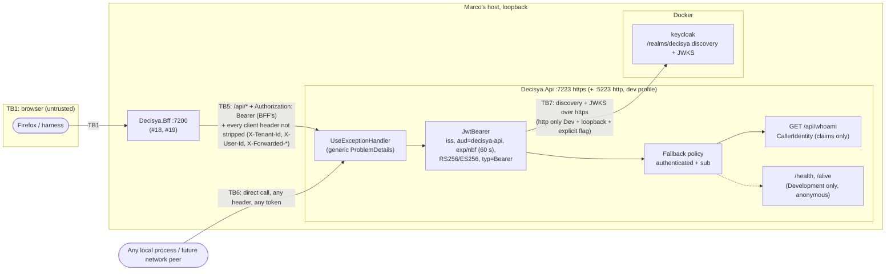

<!-- gate: G3 | verdict: PASS-WITH-NOTES | issue: #20 -->
# Threat delta: API host JWT bearer validation (issue #20)

- **Scope.** A delta on top of `docs/security/threat-models/bff-api-forwarding.md` (#19) and its "#20 boundary" list. It covers only what #20 adds:
  - `Decisya.Api.Authentication` (`ApiJwtOptions`, its environment validator, the `JwtBearerOptions` setup, the fallback policy, `CallerIdentity`, `/api/whoami`);
  - `UseExceptionHandler` and `AddProblemDetails` in `Decisya.Api`;
  - the `.AllowAnonymous()` change to `MapDefaultEndpoints` in `Decisya.ServiceDefaults`;
  - the AppHost wiring of `Api__Jwt__Authority`;
  - the decision to keep forwarded headers off (D4).
  #18 and #19 threats are not re-audited. Ids here are local; #19's are written "#19 T-nn".
- **Mode.** Threat delta, written before code. G6 checks the MUSTs against the diff.
- **Inputs.**
  - `docs/requirements/phase-0/api-jwt-validation.md` (G1, Stories 1-5, NFR-26, NFR-27), read with Marco's decisions of 2026-09-28: D1 (route `GET /api/whoami`) and D4 (no forwarded headers; Story 5 scenario 2 deferred to 0.16). The product-owner is amending G1 to match;
  - `docs/architecture/api-jwt-validation.md` (G2, D1-D5 and "For G3");
  - `docs/security/threat-models/bff-api-forwarding.md` (#19 T-05, T-15, T-19 and the #20 boundary);
  - the current `src/Decisya.Api` (`Program.cs`, `launchSettings.json`, `appsettings*.json`), `src/Decisya.ServiceDefaults/Extensions.cs` and its masking processor, `src/Decisya.AppHost/AppHost.cs`, `src/Decisya.Bff/Session/OidcOptionsSetup.cs` (#18's loopback rule), and `deploy/keycloak/decisya-realm.json` (clients, mappers, `accessTokenLifespan` 300, `defaultSignatureAlgorithm` RS256);
  - ADR-0002, ADR-0003, ADR-0011.
- **ASVS.** 5.0, L2, and **L3 for V6 and V7**. Controls are mapped at section level, as in the earlier models. Check the requirement numbers against the official 5.0 text before they go into a compliance artefact.
- **Runs on:** host (manifest). That is correct: the only new package reference is the first-party `Microsoft.AspNetCore.Authentication.JwtBearer`, which is already pinned. No secret value was read for this review.
- Reviewer: security-reviewer agent, 2026-09-28.

## Verdict

**PASS-WITH-NOTES.** The G2 design closes every item on #19's #20 boundary list except "reachable only from the BFF", which stays with 0.16/0.17 as G1 scoped it. Five threats are rated High, and each has a mitigation in #20 that a MUST proves: T-01 algorithm confusion, T-02 wrong audience, T-07 an endpoint without authorization, T-08 identity or tenant taken from a header, and T-09 an exception that reflects the token.

G3 adds one design point that G2 does not cover:

- **Check the token type (T-03, ASVS V9.2).** At the moment only the audience keeps an ID token or a logout token out. The `aud` of Keycloak's ID token is `decisya-bff` only because the `audience-decisya-api` mapper sets `id.token.claim: false`. If one realm flag changes, ID tokens authenticate at the API. ASVS 5.0 L2 requires the receiving service to check that the token is the right type for the purpose. Keycloak access tokens carry the claim `typ: "Bearer"`; ID tokens carry `"ID"`, refresh tokens `"Refresh"` and logout tokens `"Logout"`. The header `typ` is `JWT` for all of them, so `ValidTypes` cannot be used. Reject any token whose `typ` claim is not exactly `Bearer` at the **authentication** stage (for example `JwtBearerEvents.OnTokenValidated` → `context.Fail(...)`, which writes no body and so stays inside G2's rule about events), so that the result is 401 rather than 403. This is a few lines in a file the PR creates, and it is part of G4-20-01. If harness B shows that a real `dev-alice` access token has no `typ: "Bearer"`, report it and stop. Do not drop the check.

### Answers to G2's "For G3" and the orchestrator's list

1. **Validation parameters: accepted.**
   - **Issuer.** Taken from the discovery document at `Api:Jwt:Authority`, with `ValidateIssuer = true`. The trust anchor is the configured authority plus TLS. Pinning `ValidIssuer` to the configured authority as well costs one line, and it means a metadata document that names another issuer cannot widen trust (S-1).
   - **Audience as a constant (D3).** Accepted. It is one fewer value to misconfigure. Tokens whose `aud` array contains `decisya-api` among other values are accepted; that is the standard behaviour. Only `decisya-bff` carries the audience mapper, and the realm defines no `decisya-api` client whose role scope could add the audience. `azp` is not pinned (T-19, backlog).
   - **Algorithm allow-list `RS256, ES256`, and `RequireSignedTokens`.** Accepted. `alg=none` fails on `RequireSignedTokens`. Classic HS256 with the public key fails twice: the algorithm is not on the list, and IdentityModel will not use an `RsaSecurityKey` as an HMAC key. The allow-list itself is proved only by a token that is **correctly signed with the realm's RSA key under a non-listed algorithm** (`PS256`, `RS512`). Without `ValidAlgorithms` that token validates. This is the red test that matters (G4-20-01). The JWKS also publishes Keycloak's `RSA-OAEP` key with `use: enc`. `JsonWebKeySet.GetSigningKeys` skips keys whose `use` is not `sig`, and G4 must not add keys by hand. Header parameters `jwk`, `jku` and `x5u` are never honoured by `JsonWebTokenHandler`, and a test pins this.
   - **`ClockSkew` 60 s (NFR-27).** Accepted. The 300 s default would double the effective lifetime. The 59 s / 61 s boundary test must mint the token immediately before the request. If it proves flaky, report it rather than widening the margin (G2).
   - **JWKS retrieval and key rotation.** Accepted, Low (T-13). `RefreshOnIssuerKeyNotFound` (default true) picks up a rotated key. A flood of tokens with unknown `kid` values causes at most one metadata refresh per `RefreshInterval` (default 5 min). G4 must not lower `RefreshInterval` or `AutomaticRefreshInterval`, and G6 checks this. The metadata client is the handler's own backchannel, not an `IHttpClientFactory` client, so neither service discovery nor the resilience handler touches it. That is the same reasoning G2 used to reject `AddKeycloakJwtBearer`.
   - **`RequireHttpsMetadata` relaxed only in Development with a loopback authority.** Accepted (T-05). The host comparison must be an exact match on `Uri.Host`, the same as #18's `IsLoopbackAuthority`, never `StartsWith`, `Contains` or a DNS lookup. Note: `Uri.Host` returns `[::1]` with brackets, so #18's `"::1"` branch never matches. That fails closed (the flag stays true), which is safe. G4 may either copy the rule or match `[::1]`; both are acceptable. Outside Development, `ApiJwtOptionsEnvironmentValidator` fails startup, so the relaxation cannot leak into Production through configuration.
   - **`SaveToken = false`, `MapInboundClaims = false`, `NameClaimType = sub`.** Accepted. The token never enters `AuthenticationProperties`, and claim names stay as Keycloak issues them, so `sub` and `tenant_id` are read without a mapping table.
2. **What a 401 may carry (T-06).** Only the following:
   - status 401;
   - exactly one `WWW-Authenticate` header whose value is exactly `Bearer`, with no `realm`, `error`, `error_description`, `error_uri` or `scope` parameter;
   - an empty body (`Content-Length: 0`, or no content type).

   With `IncludeErrorDetails = false`, `JwtBearerHandler` writes the bare `Options.Challenge` for every failure, so a missing token, an expired token and a forged token give **byte-identical** responses. That removes the oracle an attacker would otherwise use to tell "signature good, audience wrong" from "signature bad". G4-20-03 asserts identical responses across every Story 2 row. If G4 later adds `UseStatusCodePages`, a generic ProblemDetails body with only `type`, `title`, `status` and `traceId` would also be acceptable, but the tests as written expect an empty body, and changing that needs a G6 note.
3. **The 403 cases of `/api/whoami`.** There are two, and neither echoes a claim value:
   - a valid token without `sub` fails the fallback policy → `JwtBearerHandler.HandleForbiddenAsync` → 403 with an empty body;
   - `CallerIdentity.From` returns `null` (more than one `tenant_id`; with S-2 also more than one `sub`, or an empty or whitespace `sub` or `tenant_id`) → 403 generic ProblemDetails.

   Both fail closed. Anonymous callers always get 401 before any 403.
4. **Fallback policy and the anonymous health endpoints, including the ServiceDefaults change (T-07, T-15).** Accepted.
   - `AuthorizationPolicy.CombineAsync` applies the fallback policy when the endpoint has no authorization metadata **and** when there is no endpoint at all. That is why an unknown path and a 405 on `/api/whoami` answer 401 to an anonymous caller. This is desirable: no route discovery.
   - The `.AllowAnonymous()` in `MapDefaultEndpoints` is Low. The endpoints still exist only in Development, and the only check is `self`. It is harmless for the BFF, which has no fallback policy. One consequence to record: whoever exposes the probes outside Development (0.17) inherits anonymous access. That is the right default for probes, but 0.17 must keep their output to a status word (backlog B-4).
   - The "only the health pair carries `IAllowAnonymous`" test is the control that keeps D2 honest. It is part of G4-20-04.
5. **`/api/whoami` output (T-14).** Accepted, Low. It returns the caller's own `sub` (an opaque Keycloak id) and `tenant_id`, with no path or query parameter, so there is no object id to tamper with (no BOLA surface). `Cache-Control: no-store` also partly closes #19 S-7 for this endpoint. Roles, `email`, `preferred_username` and the token are not in the response, and must not be added.
6. **Tenant and user from claims only (T-08, #19 T-19).** Accepted, High, mitigated. `CallerIdentity` reads only `sub` and `tenant_id` from the validated principal and never reads `Request.Headers`. The BFF copies every client header it does not strip (#19), so `X-Tenant-Id`, `X-User-Id` and `X-Forwarded-*` are attacker-controlled. ASVS V4.1 (a header an intermediary sets must not be overridable by the end user) and V10.3 (identify the user from non-reassignable `iss` + `sub`) are met because the API reads no header at all for identity.
7. **`UseExceptionHandler` in every environment (T-09).** Accepted, High, mitigated. This is the second layer behind #19's G4-19-02.
   - `WebApplication` still inserts the developer exception page outermost in Development. `UseExceptionHandler` sits inside it, handles the exception first, and the developer page never sees it.
   - The residual paths are exceptions that `ExceptionHandlerMiddleware` rethrows: the response has already started (then nothing more can be written), or the handler produces a 404. G4 must keep `UseExceptionHandler()` first in the pipeline, as G2 orders it.
   - The Story 4 test must send **both** `Accept: text/html` and `Accept: application/json`. It must assert that the bearer token itself is absent from the response, not only the canary: the token is exactly what the developer page's JSON and HTML forms print (#19 T-05).
8. **Forwarded headers off (D4, T-10).** Accepted, Low. The API uses neither scheme nor remote address for anything, and on the host the "BFF address" is loopback, the same as every other local process. So `KnownProxies` would add configuration without adding protection. The static bans (no `UseForwardedHeaders`, no `FORWARDEDHEADERS_ENABLED`) plus Story 5 scenario 1 are enough for #20.
   - Note for 0.16 (B-3): `ASPNETCORE_FORWARDEDHEADERS_ENABLED=true` does not mean "trust the BFF". It **clears** `KnownNetworks` and `KnownProxies` and trusts every peer. The deployment must configure the middleware in code with the BFF's network. A deployment-time check that the variable is unset belongs to 0.16.
   - `X-Forwarded-Host` (the client's `Host`) must never build a URL. The API builds none today.
9. **AppHost: the Keycloak URL, not service discovery (T-12).** Accepted, Low. Fetching metadata from the same `{keycloak http endpoint}/realms/decisya` the BFF uses makes the discovery `issuer` equal each token's `iss`. A service-discovery host would not match, and the API would then fail closed, never open. `WaitFor(keycloak)` plus lazy metadata fetch means that a Keycloak outage gives 401, not a 500 with detail (G4-20-02). The API receives **no secret**: it is a bearer-only resource server and needs neither the client secret nor any Keycloak admin credential. S-3 pins this in the AppHost test. If the Keycloak endpoint turns out to be http, the API fails closed, as G2 says. Do not add `Api__Jwt__RequireHttpsMetadata` to the AppHost.
10. **Tokens or claims in logs (T-11).** Medium, mitigated by defaults that must stay as they are.
    - `IdentityModelEventSource.ShowPII` and `LogCompleteSecurityArtifact` stay false (G2's static rule). IdentityModel's validation exception messages (IDX10214 audience, IDX10223 lifetime, IDX10503/IDX10511 signature) then carry `[PII of type ... is hidden]` and `[Security Artifact of type ... is hidden]` in place of values and the token.
    - `JwtBearerHandler` logs "Failed to validate the token" at Information, with the exception, under `Microsoft.AspNetCore.Authentication.JwtBearer`. `appsettings*.json` already hold `Microsoft.AspNetCore` at Warning, and the ServiceDefaults masking processor replaces JWT-shaped and `Bearer <token>`-shaped values. Neither ASP.NET Core nor the OTel instrumentation logs request headers by default.
    - What remains is a developer who logs the principal, a claim or the header "for diagnosis". G4-20-05's log-capture scan runs at `Debug` so that level settings cannot hide a regression.
    - #20 does not call `ILogEnrichmentContext.Begin`, so no `tenant_id` or hashed `user_id` reaches the logs yet. When a later issue wires it, it must use `CallerIdentity`, never a header (B-5).

## Data flow and trust boundaries

- **TB5, BFF → API.** The bearer is trusted **only after validation**. Every other header on this flow is attacker-controlled (#19 T-19). The API assumes nothing that the BFF checked.
- **TB6, direct callers (new).** On the host, any local process can reach `:7223` and the plaintext `:5223` of the dev `https` profile. Outside Development, network restriction to the BFF is 0.16/0.17. #20's controls must hold for a caller who bypasses the BFF entirely, and they do: nothing in the API depends on the peer.
- **TB7, API → Keycloak (new).** The metadata and JWKS define which keys are trusted. The trust anchor is `Api:Jwt:Authority` (environment only, absolute, https outside Development) plus TLS.

## Threats

| Id | Element / flow | STRIDE | Threat | Severity | Mitigation | ASVS 5.0 id | Status |
| --- | --- | --- | --- | --- | --- | --- | --- |
| T-01 | JwtBearer: signature and algorithm | S, E | Forged token accepted: `alg=none` (any case variant), HS256 with a random secret or keyed with the realm's RSA public key (PEM, DER), a non-listed algorithm under the genuine key (`PS256`, `RS512`), an embedded `jwk`/`jku` header, an unknown `kid`, a key from another realm | High | `RequireSignedTokens`, `ValidateIssuerSigningKey`, `ValidAlgorithms = RS256, ES256`; keys only from the authority's JWKS (`use: sig`) | V9.1, V11.x | G4-20-01 |
| T-02 | JwtBearer: audience | S, E | A genuine realm token meant for another audience (the `decisya-bff` ID token, `account`, a future client) is accepted | High | `ValidAudience = "decisya-api"` constant, `ValidateAudience = true`; realm mapper only on `decisya-bff` | V9.2, V10.3 | G4-20-01 |
| T-03 | JwtBearer: token type | S | An ID, refresh or logout token with `aud` containing `decisya-api` authenticates (today blocked only by one realm flag) | Low (L2 gap) | **G3:** reject `typ` claim ≠ `Bearer` at authentication (401); refresh tokens also fail on HS512 | V9.2 | G4-20-01 |
| T-04 | JwtBearer: lifetime | S | Expired token accepted inside the 300 s default skew, or a token without `exp`, or `nbf` far in the future | Medium | `ValidateLifetime`, `RequireExpirationTime`, `ClockSkew` 60 s (NFR-27) | V9.2 | G4-20-01 |
| T-05 | TB7 metadata trust, `RequireHttpsMetadata` relaxation | S, T | JWKS fetched over http outside Development, or the relaxation granted to a non-loopback host (`localhost.evil.test`, `localhost@evil.test`, `127.0.0.1.nip.io`) so an on-path host serves its own keys; wrong `iss` accepted | Medium | Environment validator (https and flag true outside Development, messages name the key); relaxation only when Development + explicit `false` + exact loopback host; issuer from discovery (S-1 pins it) | V12.3, V13.2, V9.1 | G4-20-02 |
| T-06 | 401/403 responses | I | `error_description`, claim values or the failure reason in `WWW-Authenticate` or the body; distinguishable responses give an oracle | Medium | `IncludeErrorDetails = false`; no body-writing `OnChallenge`, `OnAuthenticationFailed` or `OnForbidden`; empty bodies | V16.5, V13.4 | G4-20-03 |
| T-07 | Endpoint surface | E, I | A current or future endpoint without authorization metadata is anonymous; route discovery via 404 vs 401 | High | Fallback policy (authenticated + `sub`) on every endpoint and every unmatched path; only `/health` and `/alive` carry `IAllowAnonymous` (test-enforced) | V8.2, V8.3, V4.1 | G4-20-04 |
| T-08 | Caller identity (#19 T-19) | S, E | `X-Tenant-Id`, `X-User-Id` or similar headers copied by the BFF decide the user or tenant: cross-tenant access once #22 filters by tenant | High | `CallerIdentity` reads only validated `sub` and `tenant_id`; never `Request.Headers`; fails closed on duplicate claims | V4.1, V8.2, V10.3 | G4-20-04 |
| T-09 | Unhandled exception (#19 T-05, second layer) | I | The Development exception page (HTML or JSON) prints request headers, so the access token and exception detail reach the BFF, and through a 4xx path or a BFF regression, the browser | High | `AddProblemDetails` + `UseExceptionHandler()` first, in every environment; #19 G4-19-02 replaces 5xx bodies at the BFF | V16.5, V13.4 | G4-20-05 |
| T-10 | `X-Forwarded-*` | S, T | Spoofed scheme or client address changes a security decision or a log field | Low | D4: no `UseForwardedHeaders`, no `FORWARDEDHEADERS_ENABLED`; the API uses neither value | V4.1 | G4-20-04; B-3 for 0.16 |
| T-11 | Logs | I | The token, a payload segment, `sub`, `email` or `preferred_username` in a log record (handler failure logs, IdentityModel messages, developer logging) | Medium | `ShowPII` and `LogCompleteSecurityArtifact` banned; masking processor; `SaveToken = false`; no logging of the principal | V16.2, V16.3, V14.2 | G4-20-05 |
| T-12 | AppHost wiring | I, S | The API receives a secret it does not need; a service-discovery host makes `iss` mismatch | Low | Keycloak URL expression, no `WithReference(keycloak)`, no secret parameter (S-3) | V13.2, V13.3 | G4-20-02, S-3 |
| T-13 | Keycloak outage, key rotation, `kid` flooding | D | Keycloak down gives 500 with detail; random `kid` values force a JWKS fetch per request | Low | Handler catches metadata failures → 401; `RefreshOnIssuerKeyNotFound` rate-limited by `RefreshInterval` (5 min, not lowered) | V16.5, V15.2 | G4-20-02; G6 check |
| T-14 | `/api/whoami` output | I, T | Claim values beyond `sub`/`tenant_id` exposed; cached; duplicate or empty claims coerced into an identity | Low | Fixed DTO, `no-store`, `JsonIgnore(WhenWritingNull)`, 403 on duplicate `tenant_id`; S-2 | V8.2, V14.2, V14.3 | S-2 |
| T-15 | ServiceDefaults `.AllowAnonymous()` | I | Health output anonymous in every host | Low | Development only; `self` check only; BFF has no fallback | V13.4 | Accepted; B-4 |
| T-16 | Plaintext `:5223` in the `https` dev profile | I | A local caller sends a bearer over loopback http | Low | Loopback only, Development only; the BFF uses https with #19's final-URI check | V12.2 | B-4 |
| T-17 | Revocation window | S | An access token stays valid at the API for up to 300 s after logout or session revocation | Low | 300 s lifespan (realm), only the BFF holds tokens (ADR-0003, #19 T-13) | V7.4, V9.2 | Accepted |
| T-18 | New package reference | T | Tampered or vulnerable `Microsoft.AspNetCore.Authentication.JwtBearer` / `Microsoft.IdentityModel.*` | Low | First-party, central pin 10.0.12; G6 runs `dotnet list package --vulnerable --include-transitive` for `Decisya.Api` | V15.2, V13.1 | G6 |
| T-19 | `azp` and lifetime not pinned | S | A future client gains the `decisya-api` audience; a client-level lifespan override issues longer tokens that the API accepts | Low | Only `decisya-bff` has the mapper; realm lifespan 300 s | V9.2, V10.3 | B-1, B-2 |

## Requirements for G4

Five MUSTs, all **fix-now**. Each names the red test that must fail before the code exists. Harness A (local key, no trait) and harness B (Testcontainers Keycloak, `Category=Integration`) are G2's. Canaries are built at run time.

- **G4-20-01, only a genuine, current, RS256/ES256 access token for `decisya-api` authenticates (T-01..T-04; Story 2, NFR-26, NFR-27).**
  - Red theory `TokenValidationTests.Invalid_tokens_are_rejected` (harness A). Every row gives 401, and no downstream code sees an authenticated principal. The rows are every Story 2 row, plus:
    - a token **correctly signed with the test RSA key** under `PS256`, and one under `RS512` (the only rows that prove `ValidAlgorithms` is set);
    - `alg` spelled `none`, `None` and `NONE`, with an empty and with a non-empty signature segment;
    - HS256 keyed with the test key's public key as PEM (SubjectPublicKeyInfo) text **and** as DER bytes;
    - an embedded `jwk` header carrying an attacker RSA key that signed the token (and the real `kid`);
    - a genuine signature with an unknown `kid`; a token signed by a second RSA key that is not in the configuration;
    - no `exp`; `nbf` = now + 120 s;
    - **G3 point:** a genuine, correctly signed token with `aud` `decisya-api` and `typ` claim `ID`, and one with no `typ` claim.
  - Positive rows in the same class: RS256 with `typ: "Bearer"` → 200; ES256 under a test EC P-256 key → 200 (proves ES256 stays on the list); `exp` = now − 59 s → 200 and now − 61 s → 401 (NFR-27).
  - Red test `JwtBearerOptionsTests.Validation_parameters_are_pinned`. Resolve `IOptionsMonitor<JwtBearerOptions>.Get(JwtBearerDefaults.AuthenticationScheme)` and assert: `ValidAlgorithms` is exactly {`RS256`, `ES256`}; `ValidAudience` `decisya-api`; `ClockSkew` 60 s; `ValidateIssuer`, `ValidateAudience`, `ValidateLifetime`, `RequireExpirationTime`, `RequireSignedTokens`, `ValidateIssuerSigningKey` true; `SaveToken`, `IncludeErrorDetails`, `MapInboundClaims` false. This catches a silent change of default that no behavioural row would.
  - Harness B cases as G2 lists them (ID token, refresh token, `alg=none` and HS256 over `dev-alice`'s genuine claims, the HS256 key taken from the realm's JWKS, as PEM and DER). `dev-alice` and `dev-admin` access tokens give 200.
- **G4-20-02, the key source cannot be downgraded or redirected (T-05, T-12, T-13).**
  - Red tests `ApiJwtOptionsTests`, environment `Production`: `Api:Jwt:Authority` missing, relative, or `http://…` → startup fails; `Api:Jwt:RequireHttpsMetadata=false` with an https authority → startup fails. Each message names the key and never the value (assert the configured canary value is absent from the exception text).
  - Red theory `ApiJwtOptionsTests.Https_metadata_relaxed_only_for_loopback_in_development`. Assert the post-configured `JwtBearerOptions.RequireHttpsMetadata`, because harness A's `StaticConfigurationManager` bypasses the fetch. In Development with the flag `false`: `http://localhost:8080/realms/decisya` and `http://127.0.0.1:8080/...` → `false`; `http://localhost.evil.test/...`, `http://localhost@evil.test/...`, `http://127.0.0.1.nip.io/...` and `http://keycloak/...` → `true`. With the flag absent → `true` for every host. For `http://[::1]:8080/...` either value is accepted (see answer 1).
  - Red test `TokenValidationTests.Metadata_unavailable_gives_401` (harness A). A configuration manager whose `GetConfigurationAsync` throws: a valid-looking token gets the same bare 401 as G4-20-03, never 500, and no exception text appears in the response.
  - `AppHostConfigurationTests` (G2): `decisya-api` sets `Api__Jwt__Authority` from an expression over Keycloak's endpoint and waits for Keycloak (S-3 extends it).
- **G4-20-03, rejections carry nothing (T-06; Story 2 "no detail").**
  - Red test `ChallengeResponseTests.All_rejections_are_identical`. For every G4-20-01 negative row, plus no header, the `Basic` scheme, `Bearer ` with an empty value and `Bearer not.a.jwt`: status 401; exactly one `WWW-Authenticate` value, equal to `Bearer` (ordinal); empty body; the **same header set** (names, and values apart from `Date`) as the no-token response. No response contains `error`, `invalid_token`, `IDX`, a claim value or the token.
  - Red test `ForbiddenResponseTests`: a valid token without `sub` → 403 with an empty body and no `WWW-Authenticate`; a token with two `tenant_id` values → 403 generic ProblemDetails (`type`, `title`, `status`, `traceId` only) that contains neither `tenant_id` value nor the `sub`.
  - Harness B: every 401 is checked the same way (G2).
- **G4-20-04, deny by default; identity only from claims; forwarded headers ignored (T-07, T-08, T-10; Stories 1, 3, 5).**
  - `EndpointAuthorizationTests` (G2's static rule): every endpoint except `/health` and `/alive` has no `IAllowAnonymous`, and the Production endpoint set is exactly `/api/whoami`.
  - Red theory `FallbackPolicyTests`, anonymous, environment `Production`: `GET /api/whoami`, `POST /api/whoami`, `GET /api/does-not-exist`, `GET /`, `GET /health` → 401 with the G4-20-03 shape, never 404 or 405. In Development, `/health` and `/alive` → 200 anonymously.
  - Red test `CallerIdentityTests.Headers_never_supply_identity` (Story 3). A valid `dev-alice`-shaped token plus `X-Tenant-Id`, `X-User-Id`, `X-Forwarded-User` and `X-Forwarded-Host`: the response's `userId` and `tenantId` equal the token's claims. Also: a token with **no** `tenant_id` plus `X-Tenant-Id: <guid>` → 200 with `tenantId` absent (the header does not fill a gap).
  - Story 5 scenario 1 (`/__test/connection`, G2) in both Development and Production, plus the static bans on `UseForwardedHeaders` and `FORWARDEDHEADERS_ENABLED` (G2).
- **G4-20-05, no detail or token out through errors, and none into the logs (T-09, T-11; Story 4).**
  - Red theory `ExceptionHandlingTests.Unhandled_exception_is_generic` (G2's `/__test/throw`), over {Development, Production} × {`Accept: text/html`, `Accept: application/json`, no `Accept`}: status 500; a ProblemDetails body; the body and headers contain **neither the canary, nor the bearer token (raw or its payload segment), nor the string `Authorization`, nor the `sub` value**. The log holds the canary and a `trace_id`.
  - Red test `LogCaptureTests.No_token_or_claim_reaches_any_log`. Capture every record at `Debug` for `Decisya`, `Microsoft.AspNetCore` (including `Authentication`, `Authorization` and `Diagnostics`) and `Microsoft.IdentityModel`, across: a 200 `/api/whoami`, every G4-20-01 negative row, the metadata-failure case, both 403 cases, and `/__test/throw`. Mint the tokens with canary values for `sub`, `email` and `preferred_username`. No record's message, state values or exception text (the `/__test/throw` canary excepted) may contain:
    - the token raw, or its header, payload or signature segment;
    - the `sub`, `email` or `preferred_username` canary;
    - the HS256 secret or the PEM text used in the confusion rows.

G6 checks, which need no new test:
- no `ShowPII`, `LogCompleteSecurityArtifact`, `RefreshInterval` or `AutomaticRefreshInterval` assignment in `src/**`;
- no logger call takes a `ClaimsPrincipal`, a claim value, `HttpContext.Request.Headers` or the token;
- `UseExceptionHandler()` is the first middleware in `Decisya.Api`, and nothing precedes it except what `WebApplication` adds itself;
- the API receives no secret from the AppHost;
- `dotnet list package --vulnerable --include-transitive` for `Decisya.Api` shows no High or Critical.

### SHOULD

**Fix-now (Low; a few lines each, in files this PR creates or changes):**

- **S-1 (T-05).** Set `TokenValidationParameters.ValidIssuer` to the configured `Api:Jwt:Authority` (trailing `/` trimmed) as well as taking it from discovery. Harness A's wrong-`iss` row then does not depend on the static configuration manager, and a metadata document that names another issuer cannot widen trust. If harness B shows that Keycloak's `iss` differs from the configured string (scheme, port or trailing slash), report it and stop. Do not normalise the token side.
- **S-2 (T-14).** `CallerIdentity.From` also returns `null` (→ 403) when there is more than one `sub`, or when `sub` or `tenant_id` is empty or whitespace. The response never shows `"tenantId": ""`, as G1 requires, and the claim is not quietly treated as absent either. Add those rows to `ForbiddenResponseTests`.
- **S-3 (T-12).** In `AppHostConfigurationTests`, assert that `decisya-api`'s environment carries no secret parameter (`bff-client-secret`, `dev-user-password`, `keycloak-db-password`, the Keycloak admin password) and no `services__keycloak__*`. The API is bearer-only and needs none of them.

**Backlog (#83):**

- **B-1 (T-19).** Pin `azp` to an allow-list (`decisya-bff`) at the API, or add a realm-guard test that only `decisya-bff` carries an `oidc-audience-mapper` for `decisya-api`. Do it before a second client (mobile, service account) is added.
- **B-2 (T-19).** Reject tokens whose `exp − iat` exceeds 300 s + skew, or add a realm-guard test that no client overrides `access.token.lifespan`. That keeps CLAUDE.md's "≤ 5 min" true even under a client-level override.
- **B-3 (T-10, 0.16).** Story 5 scenario 2: `ForwardedHeadersOptions` configured in code, with `KnownNetworks` limited to the BFF's container network, and a deployment check that `ASPNETCORE_FORWARDEDHEADERS_ENABLED` is unset, because that variable clears the known lists and trusts every peer.
- **B-4 (T-15, T-16, 0.16/0.17).** Outside Development: network restriction of the API to the BFF (#19 boundary), no plaintext listener, and a decision on probe exposure. Probes stay anonymous and return a status word only.
- **B-5 (#22 boundary).** When #22 parses `tenant_id` and wires the tenant filter:
  - a principal **without** `tenant_id` (`dev-admin`) gets no tenant data at all, never "all tenants"; cross-tenant access only through `[AllowCrossTenant]` handlers (invariant 1);
  - `ILogEnrichmentContext.Begin` is fed from `CallerIdentity`, never from a header;
  - an unparsable `tenant_id` is 403, not a default GUID.

## Proportion note

T-15 to T-18 are recorded for completeness and change nothing in the merge decision. No High or Medium flaw was found in code that #20 does not touch.
