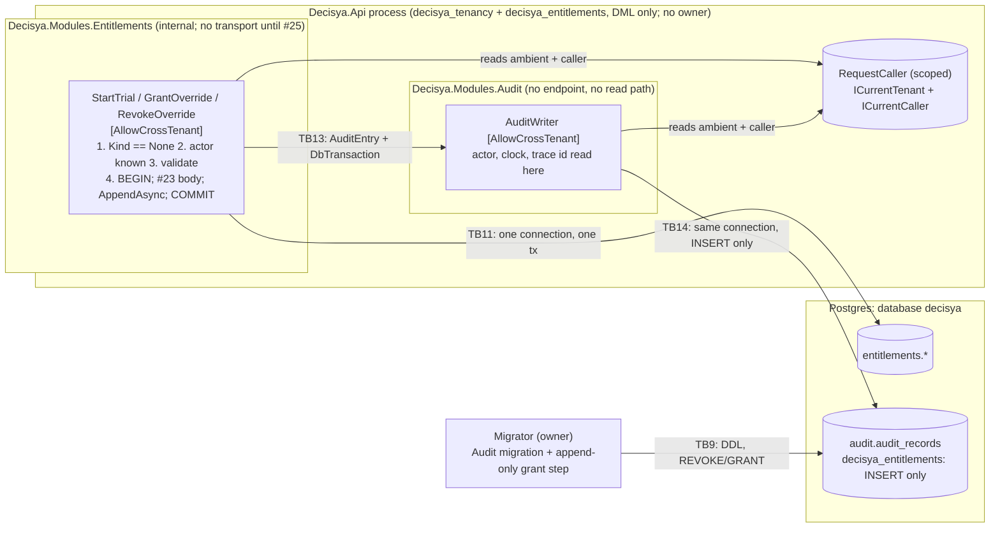

<!-- gate: G3 | verdict: PASS-WITH-NOTES | issue: #24 -->
# Threat delta: Modules.Audit, append-only audit records in the audited command's transaction (issue #24)

- **Scope.** This is a delta on top of `entitlements-module.md` (#23), `tenant-query-filter.md` (#22) and `tenancy-module.md` (#21). It covers only what #24 adds:
  - the `audit.audit_records` table and the append-only grant to `decisya_entitlements` (ADR-0013);
  - `IAuditWriter.AppendAsync(AuditEntry, DbTransaction, ct)` and `AuditWriter`;
  - the explicit transaction in the three Entitlements admin handlers, and the actor check;
  - the record content (actor id, trace id, no reason);
  - the new rules `CrossTenantAuditRule` and `ExplicitTransactionRule`.

  The #20 token validation, the #21 caller pipeline, the #22 filter and guard, and the #23 role, password and evaluation paths are not re-audited.
- **Mode.** Threat delta, written before code. G6 checks each MUST against the diff.
- **Inputs.**
  - `docs/ai/pipeline/24.md` (Marco's decisions of 2026-10-01, G1 Q1-Q3, ADR-0013 accepted);
  - `docs/requirements/phase-0/audit-module.md` (G1, Stories 1-6, NFR-36, NFR-37, R-1 to R-5);
  - `docs/architecture/audit-module.md` (G2, D1-D8, the reconciliation table, "Notes for G3");
  - `docs/adr/0013-audit-records-in-the-audited-command-transaction.md`, ADR-0012;
  - `docs/security/threat-models/entitlements-module.md` and `docs/security/reviews/23.md`;
  - the current code: the G2-written Contracts files (`IAuditWriter`, `AuditEntry`, `AuditAction`), `ICurrentCaller`, the three Entitlements handlers, `MigrationRunner`, `CrossTenantQueryRule.BypassList`, `ArchitectureScope`, `BannedSymbols.txt`, `AppHost.cs` (`WaitForCompletion(migrator)`).
- **ASVS.** 5.0 Level 2, mapped at section level as in the earlier deltas. #24 adds no authentication and no session, so the Level 3 chapters V6 and V7 are not touched.
- **Runs on:** host (manifest). No package and no external content. No secret value was read.
- Ids T-xx, G4-24-xx, S-x and C-x are local to this file.
- Reviewer: security-reviewer agent, 2026-10-01.

## Verdict

**PASS-WITH-NOTES.** ADR-0013 is the right shape: one transaction on one connection is the only option that is atomic with no relay, and the INSERT-only grant gives the Done-when (no application role can update or delete an audit row) at the database. No High threat lacks a mitigation. The notes:

1. **The `DbTransaction` hands a raw connection across a module boundary, and no rule covers raw ADO.NET (T-05).** `CrossTenantQueryRule.BypassList` bans EF's raw-SQL entry points and `GetDbConnection`, but not `DbTransaction.Connection` → `DbConnection.CreateCommand()` → `ExecuteNonQuery`, nor `new NpgsqlCommand`/`NpgsqlConnection`. #24 makes that path legitimate to reach: the handlers call `GetDbTransaction()`, and `AuditWriter` must read `transaction.Connection`. Either could then run any SQL as `decisya_entitlements`, outside the tenant filter, and forge audit rows or commit the caller's work early, and no test notices. This is a pre-existing gap that #24 widens, so it is closed here (G4-24-03, fix-now).
2. **Forged rows remain possible at the database (T-03), accepted by ADR-0013.** `decisya_entitlements` can `INSERT` any tenant, actor, time and action that passes the check constraints. With G4-24-03 no code path in `ArchitectureScope` can do it without failing a rule, and the Entitlements model is already pinned to its own schema (`EntitlementsModuleBoundaryTests`). What remains is a compromised API process, which holds every role anyway. Tamper evidence (hash chain, owner trigger, WORM export) stays deferred (G1, D8; #83).
3. **`CrossTenantAuditRule` is a good C-1 guard for #24 and is not yet enough for #25 (T-11).** It exempts the whole Audit assembly, where #25's audited reader will live, and "references `AppendAsync`" does not prove "appends on every success path, in the same transaction, before commit". S-1 narrows the exemption now; C-4 binds #25.
4. **G2's departure from G1 on the role is accepted.** There is no `decisya_audit` role, because nothing reads. This removes a secret and a connection string, and it is the smaller attack surface. G1 Story 6's "own role, SCRAM verifier" scenario is replaced by "no `decisya_audit` role exists" (G2 reconciliation), which G5 asserts.
5. **ADR-0013's file still says `Status: Proposed`**, while the index and the manifest say Accepted (S-2, fix-now, one line).

There are **five MUSTs** (G4-24-01 to G4-24-05), all fix-now.

### Answers to the orchestrator's questions

| Question | Answer | Where |
| --- | --- | --- |
| Revoke-then-grant idempotence | Correct as G2 orders it: owner connection, one transaction, `REVOKE ALL` from PUBLIC and from every listed module role on the schema, all tables and all sequences in `audit`, then `GRANT USAGE` and `GRANT INSERT` to the writer roles only. `REVOKE` of a privilege that is not held is a silent no-op for the owner, and `REVOKE ALL` also strips grant options and column-level grants. A re-run therefore converges to the same ACL and can never widen it. The step runs after the Audit migration and after `decisya_entitlements` exists. Between the migration's commit and the grant step the role holds nothing in `audit` (there are no `ALTER DEFAULT PRIVILEGES` anywhere in the migrator), so a crash there fails closed: the API does not start (`WaitForCompletion`), and if it did, every admin command would get 42501 and roll back. Roles not on the list are not narrowed, which is why the ACL assertion (below) must be "exactly", not "at least". | T-01; G4-24-01 |
| 01007 versus 42501 | G2 is right. A non-owner that holds some privilege on the object but no grant option gets `WARNING 01007` ("no privileges were granted") and the statement succeeds. A role with no privilege at all gets 42501. `decisya_tenancy` gets 42501 earlier, at name lookup (no `USAGE` on `audit`). Npgsql raises a warning as a `Notice` event, not an exception, so the test must not assert "throws": it asserts "42501, or no exception", then the ACL. | T-01; G4-24-01 |
| TRUNCATE, REFERENCES, TRIGGER | Not reachable. Each is a separate table privilege, none is granted, and `REVOKE ALL` clears any stray grant. `CREATE TRIGGER` also needs a trigger function, which needs `CREATE` on some schema: the role has `USAGE` only on `entitlements` and `audit`, and PG 15+ no longer gives PUBLIC `CREATE` on `public`. An FK that references `audit_records` (which would block an owner's delete) needs `REFERENCES` plus ownership of the referencing table. **Postgres 17+ adds `MAINTAIN`** (VACUUM, ANALYZE, REINDEX, CLUSTER, LOCK TABLE): `REVOKE ALL` covers it, but G2's `has_table_privilege` list omits it, and the predefined `pg_maintain` role grants it to members. Both go into the test (G4-24-01). `LOCK TABLE … IN ROW EXCLUSIVE MODE`, which INSERT allows, does not conflict with other inserts. | T-01; G4-24-01 |
| Sequence or identity grants | None needed: `id` is `ValueGeneratedNever()`, and the schema has no sequence. If a later migration adds an identity column, the insert fails with 42501 on the sequence (the step revokes all sequences and grants none), which fails closed. No `RETURNING`, so no `SELECT` (proved end to end as the real role). | T-01; G4-24-01 |
| Does PUBLIC hold anything? | No. A new schema and its tables give PUBLIC nothing, and #21 already revoked `CONNECT`/`TEMP` on the database from PUBLIC. The `REVOKE … FROM PUBLIC` statements are belt and braces. The only PUBLIC default left in Postgres is `EXECUTE` on functions, and `audit` has none (asserted). | T-01; G4-24-01 |
| Forged rows and repudiation | Forgery: see note 2. Database-level forging is accepted residual (ADR-0013), code-level forging is closed by G4-24-03, and the writer takes actor, time, trace id and outcome from its own sources, so a caller of the contract cannot forge them (the `AuditEntry` shape is pinned). Repudiation: the actor is the validated `sub` (`ICurrentCaller`), never a placeholder, and the trace id correlates the record with the request's trace. A genuine record cannot be changed or removed by any application role. Trace retention will be shorter than audit retention, so the trace id is a correlation aid, not proof. | T-02, T-03; G4-24-03, G4-24-04 |
| Atomicity, auto-savepoints and the 23505 paths | Sound. EF Core creates a savepoint before each `SaveChanges` inside a user transaction and rolls back to it on failure, so a 23505 or a concurrency exception leaves the transaction usable and the #23 re-read paths work unchanged under READ COMMITTED. The append must sit after the try/catch and before `CommitAsync`, and the success log after `CommitAsync`. Every early return disposes the transaction uncommitted. An ambiguous commit (connection lost during `COMMIT`) leaves both rows committed or neither, so NFR-37 holds; the caller just sees a generic error. No retrying execution strategy is configured anywhere in `src/` today, and adding one would make `BeginTransaction` throw, which fails closed. | T-04; G4-24-02 |
| Orphan record versus unaudited commit (NFR-37) | Both are impossible by construction while each handler uses exactly one context and one transaction. The real risk is a later edit that saves through a second, un-enlisted context (auto-committed, unaudited) or appends inside the try before a caught failure. The fault matrix must include a failure **after** a real append (G4-24-02), and all assertions must read as the owner, because `decisya_entitlements` cannot `SELECT` the audit table. | T-04; G4-24-02 |
| The `DbTransaction` crossing modules | `AuditWriter` gets a live connection with the Entitlements role, inside the command's transaction. With it, it could read or write `entitlements.*` outside the tenant filter, commit or roll back the caller's work, change session state, or close the connection. G2's rule limits the writer to `TenantResolution.For` among the **EF** bypass members, which does not cover any of those ADO.NET calls (note 1). G4-24-03 restricts the writer to `UseTransactionAsync` and `SaveChangesAsync` on its own context and bans raw ADO.NET in the whole scope. The contract being public does not widen who can audit: a module whose role has no grant gets 42501 and its own command rolls back. | T-05; G4-24-03 |
| The actor and the check order | Correct. Forbidden first (exact `Kind != None`, unchanged), then `CallerActor.IsKnown`, then validation, with no clock read, context or connection before any of them. `IsKnown` catches only `InvalidOperationException` (the documented `ICurrentCaller` contract) and treats blank as unknown, so it cannot turn a different exception into "known". The writer re-checks, so a future handler that skips `IsKnown` still cannot write a blank or placeholder actor. Reading the same scoped `ICurrentCaller` twice is not a TOCTOU risk, because the middleware sets it once per request. `None` still does not mean "platform admin" (#23 C-2, #25). | T-06; G4-24-04 |
| PII | The record holds an opaque `sub`, a target tenant id, catalog constants and a trace id. The reason cannot be expressed in `AuditEntry`. `actor_user_id` is pseudonymous personal data in a table no application role can change, so erasure needs the owner, and retention is deferred (G1 R-2, #83). It is acceptable for #24 because nothing reads the table. `AuditRecord.ActorUserId` should still carry `[Sensitive]` (CLAUDE.md), so that any future rendering is masked (G4-24-05). | T-07, T-08; G4-24-05 |
| Are the new rules enough for #25? | For #24, yes, with S-1 and G4-24-03. For #25, not alone: see C-4. `ExplicitTransactionRule`'s exact allow-list of four types is the stronger of the two, because any new transactional handler forces a reviewed rule change. | T-11; S-1, C-4 |

## Data flow and trust boundaries

- **TB13, Entitlements → Audit (new, ADR-0013).** The only data crossing is `AuditEntry` (tenant, closed action, catalog key) and the live `DbTransaction`. The entry is validated by shape. The transaction is a capability: whoever holds it acts as `decisya_entitlements` (G4-24-03).
- **TB14, writer → audit table (new).** The database enforces INSERT only. Whether a module may audit is decided by the grant list in the migrator, not by the contract.
- **TB9 (from #21).** The owner is still the only principal that can alter, truncate or delete audit rows (G1 R-3, accepted).

## Threats

| Id | Element / flow | STRIDE | Threat | Severity | Mitigation | ASVS 5.0 id | Status |
| --- | --- | --- | --- | --- | --- | --- | --- |
| T-01 | Append-only grant | T, R, E | An application role can update, delete, truncate, maintain or re-grant audit rows: the step grants `ALL`, misses PUBLIC or another role, leaves a column grant, runs before the table exists, or widens on a re-run | High if wrong; design correct | One-transaction narrow-then-grant step, explicit writer list, `INSERT` only; ACL asserted exactly, before and after a second run | V16.4, V13.2, V8.4 | G4-24-01 |
| T-02 | Actor attribution | R, S | A record names no one, a placeholder ("system"), or an actor the caller chose | Medium | Actor read only from `ICurrentCaller` inside the writer; `actor_unknown` refusal; writer re-check; `ck_audit_records_actor` | V16.3, V8.2 | G4-24-04 |
| T-03 | Forged rows at the database | T, R | `decisya_entitlements` inserts records for any tenant, actor or time (SQL injection or a compromised process), framing an admin or padding the log | Low (accepted, ADR-0013) | No raw SQL or ADO.NET in scope (G4-24-03); Entitlements model pinned to its schema (existing); check constraints; trace-id correlation; tamper evidence deferred | V16.4, V1.2 | Accepted residual; backlog (#83, hash chain) |
| T-04 | Unit of work | T, R | An unaudited commit (append skipped, or a second un-enlisted context) or an orphan record (append before a caught failure); auto-savepoints turned off, breaking the 23505 paths | High if wrong; design correct | One explicit transaction per handler; append after the try/catch, before commit; success log after commit; `ExplicitTransactionRule`; NFR-37 fault matrix as the real role | V16.3, V15.4, V2.3 | G4-24-02 |
| T-05 | `DbTransaction` capability | E, T, I | The writer (or a handler) uses `transaction.Connection` for raw ADO.NET: cross-tenant reads or writes outside the filter, forged rows, early commit or rollback, session changes | Medium | Writer limited to EF `UseTransactionAsync` and `SaveChangesAsync`; raw ADO.NET and `DbTransaction` commit/rollback banned in `ArchitectureScope` | V1.2, V8.2, V15.3 | G4-24-03 |
| T-06 | Check order | I, D | Validation or a database access runs before Forbidden or the actor check, so a tenant caller learns error codes, or an unidentified call touches the database | Medium | Forbidden → actor → validation, no DB before; tests on an unreachable host | V8.2, V8.3 | G4-24-04 |
| T-07 | Record content | I | The override reason, a command payload, an email or a name reaches the immutable table, an exception message, a log, or a telemetry tag | Medium | `AuditEntry` has no free text; fixed exception messages; writer logs nothing; one bounded activity tag; marker tests on success and failed append | V16.2, V14.2 | G4-24-05 |
| T-08 | Stored actor id (G1 R-2) | I | Pseudonymous personal data kept indefinitely in a table no application role can erase | Low | No read path in #24; `[Sensitive]` on the property; retention and erasure deferred | V14.2 | G4-24-05; backlog (#83) |
| T-09 | Writer ambient check | E | A future tenant-scoped caller audits into another tenant, or an `Invalid` ambient writes | Low | Writer refuses `Invalid` and a foreign `Tenant`; the record is `ITenantScoped` and guarded | V8.2 | G4-24-04 |
| T-10 | Isolation of audit rows | I | A tenant context reads another tenant's records once a reader exists | Low (no reader) | `ITenantScoped`, #22 filter, isolation test; no public `DbSet`, internal entity | V8.2 | G1 Story 5 tests (G5) |
| T-11 | Rules for #25 | E, R | A new `[AllowCrossTenant]` type (the reader in Audit, or a type in `Decisya.Api`) escapes `CrossTenantAuditRule`, or references `AppendAsync` without appending on every success path | Medium for #25; none today | S-1 now; C-4 for #25 | V8.4, V15.2 | S-1; C-4 |

## Requirements for G4 (MUST)

Five MUSTs, all **fix-now**. Each names the red test that must fail before the code exists. "No database access" is proved as in #21 and #23 (placeholder `Host=db.invalid`, or a `DbCommandInterceptor` that records zero commands).

- **G4-24-01: the audit table is append-only for every application role, and a re-run cannot widen it (T-01; NFR-36, the Done-when).**
  - `ProvisionAppendOnlyGrantsAsync` runs on the owner connection, in **one** transaction, after the Audit migration and after the Entitlements role step. Its statements are exactly G2's four groups. It grants `INSERT` by name, never `ALL`. Every identifier goes through `QuoteIdentifier`, and the schema, table and role names come only from module constants.
  - The generic `ProvisionModuleRoleAsync` is not called for `audit`.

  Red tests (`AuditGrantsIntegrationTests`, after `RunAsync`, and again after a second `RunAsync`):
  - `aclexplode(relacl)` for `audit.audit_records` is **exactly** the owner's entries plus `decisya_entitlements` with `INSERT` and `is_grantable = false`. `pg_attribute.attacl` is null for every column. The schema ACL holds only the owner and `decisya_entitlements=U`.
  - `has_table_privilege('decisya_entitlements', …)` is true for `INSERT` only, among `SELECT, INSERT, UPDATE, DELETE, TRUNCATE, REFERENCES, TRIGGER, MAINTAIN`. `has_schema_privilege(…, 'audit', 'CREATE')` is false. `decisya_entitlements` is not a member of any role, `pg_maintain` included (`pg_auth_members`).
  - As each of `decisya_tenancy` and `decisya_entitlements`: `UPDATE`, `DELETE` and `TRUNCATE` fail with 42501, and the seeded row is unchanged (read as owner).
  - `GRANT UPDATE ON audit.audit_records TO PUBLIC` as `decisya_entitlements` is either 42501 or completes without an exception, and the ACL afterwards is unchanged. The test never asserts "throws".
  - No sequence and no function exists in schema `audit`. No `decisya_audit` role exists.
  - A database where `decisya_entitlements` was given `UPDATE, DELETE` on the table beforehand ends with `INSERT` only after `RunAsync`, which proves narrowing.
- **G4-24-02: the change and its record commit together or not at all, and the #23 race paths still work (T-04; NFR-37).**
  - Each handler: one `EntitlementsDbContext`, one `BeginTransactionAsync`, the #23 body unchanged, `AppendAsync` once after the try/catch and before `CommitAsync`, the success log after `CommitAsync`. No second context, no `GetDbConnection`, and `AutoSavepointsEnabled`/`AutoTransactionBehavior` never set.

  Red tests, run end to end as `decisya_entitlements` on a database migrated by `RunAsync`, with every assertion read as the owner:
  - a decorator that throws **after** the real append: no entitlement change and no audit row, for each command;
  - a real 42501 on the audit insert (grant revoked in a dedicated database): the command fails and its change is absent;
  - a `DbTransactionInterceptor` that throws on `TransactionCommitting` after a real append: neither row exists;
  - the entitlement write fails: no audit row;
  - the 16-way `StartTrial` race: one grant, one record; the `GrantOverride` 23505 re-read: one row, one record; two concurrent revokes: two records;
  - `trial_already_used` and every validation failure: no record.
- **G4-24-03: the transaction does not become a raw-SQL channel (T-05, T-03).**
  - `AuditWriter` touches the `DbTransaction` only to read `.Connection` (for the null check and `ForConnection`) and to pass it to `UseTransactionAsync`. It never calls `Commit*`, `Rollback*`, `Save*`, `Release*` or `Dispose*` on it, and never calls a member of `DbConnection` other than through EF.
  - Raw ADO.NET is banned in `ArchitectureScope`, either on `CrossTenantQueryRule.BypassList` (so only attributed types may use it, and the "only `TenantResolution.For`" rule then bans it in the four types) or in a rule of its own: `DbConnection::CreateCommand`, `::CreateBatch` and `::BeginTransaction(Async)`; every `DbCommand`/`DbBatch` `Execute*`; the `NpgsqlCommand`, `NpgsqlBatch` and `NpgsqlConnection` constructors and `NpgsqlDataSource::Create*`; and `DbTransaction::Commit*`, `::Rollback*`, `::Save*` and `::Release*`. Match both the `System.Data.Common` and the `Npgsql` declaring types. Add the same members to `BannedSymbols.txt` for IDE feedback.

  Red tests: a violating fixture that calls `tx.GetDbTransaction().Connection!.CreateCommand()` and executes it, inside an `async` method; a violating fixture that calls `DbTransaction.CommitAsync`; both fail the rule, and the real `ArchitectureScope` passes.
- **G4-24-04: every record names a validated actor, and no refusal touches the database (T-02, T-06, T-09).**
  - Order in each handler: Forbidden (unchanged), then `CallerActor.IsKnown`, then validation. `IsKnown` catches only `InvalidOperationException` and treats blank or whitespace as unknown. `entitlements.actor_unknown` has a fixed message, and `CommandActorUnknown` logs only the command name.
  - `AuditWriter` reads the actor from `ICurrentCaller` only, and re-checks it (non-blank, at most 255 characters). The module contains no actor literal ("system", "unknown", "anonymous"). `AuditEntry` stays exactly `(TenantId, AuditAction, string?)`: a public-surface test pins that it has no actor, time, trace id or outcome member.
  - The writer refuses an `Invalid` ambient and a `Tenant` ambient for another tenant before any SQL.

  Red tests: for each command, under `None` with no user id and under `None` with a whitespace user id, an invalid feature and an empty reason give `actor_unknown`, on an unreachable host. Under `Tenant` with no user id, the result is `forbidden`. The writer, called directly with a stub caller that has no user id, throws before any command is recorded.
- **G4-24-05: the record and its failure paths carry no sensitive data (T-07, T-08; G1 Story 3).**
  - `AuditRecord.ActorUserId` carries `[Sensitive]`. The writer has no logger. Its only activity tag is `decisya.audit.action` with the code. Every exception message is a fixed string. No Npgsql error-detail switch (existing ban).
  - The five check constraints exist by name, and the writer rejects an undefined action, a bad feature-key shape and an action/feature mismatch before any SQL.

  Red tests: the `MARKER-9f3a` reason (with an email and an IBAN) never appears in any audit column, log record, exception message (including inner exceptions), metric tag or activity tag, on success and on each failed-append case of G4-24-02.

## SHOULD

| Id | Item | Class |
| --- | --- | --- |
| S-1 | `CrossTenantAuditRule` exempts the `AuditWriter` **type**, not the `Decisya.Modules.Audit` assembly. Add a violating fixture: an attributed type inside an `Audit`-named namespace that does not append. Otherwise #25's audited reader, which belongs in Audit, is exempt by construction. One line in the rule G5 writes. | fix-now (Low) |
| S-2 | ADR-0013 line 3: `Status: Proposed` becomes `Accepted` (index and manifest already say Accepted). The ADR is the source G6 and #25 read. Owner: architect or orchestrator. | fix-now (Low) |
| S-3 | `ExplicitTransactionRule` also bans `System.Transactions.TransactionScope` constructors and `EnableRetryOnFailure` in `ArchitectureScope`. Both fail closed today (a retry strategy makes `BeginTransaction` throw; an ambient scope only widens the transaction), so this is a clarity guard, not a flaw. | backlog (#83) |
| S-4 | Tamper evidence (hash chain, owner trigger, WORM export), retention and erasure of `actor_user_id`, and auditing refusals. Already deferred by G1 and G2 to #83; listed here only so G6 does not raise them again. | backlog (#83, known) |

## Carry-forward

- **C-1 (from #23) is met by #24** once G4-24-02 and the `CrossTenantAuditRule` pass. #25 may then relax G4-23-02's reachability rules.
- **C-2 (from #23) still binds #25:** `None` is not a platform-admin check. `actor_unknown` proves a caller exists, not that it is an admin.
- **C-4 (new, binds #25):**
  - Every new `[AllowCrossTenant]` type must sit inside `ArchitectureScope`. `Decisya.Api` is outside it, so an attributed admin type there would escape `CrossTenantAuditRule`; either keep the types in modules, or add `Decisya.Api` to the audit rule.
  - Every new audited type adds its own fault-matrix and content tests (G4-24-02, G4-24-05). Referencing `AppendAsync` is not proof of appending on every success path.
  - The audit reader is itself audited. It needs a new `AuditAction` value and a check-constraint migration, and its `decisya_audit` role is `SELECT` only, with no `INSERT`, so a reader cannot also write.
  - If Wolverine arrives with transactional middleware, it replaces this ADR's transaction (ADR-0013, Bad consequence), and `ExplicitTransactionRule` must be revised in the same issue.

No High or Medium flaw was found in code that #24 does not change beyond T-05. The raw ADO.NET gap in `CrossTenantQueryRule` predates #24 but has no exploiting code today, and G4-24-03 closes it in this PR.
