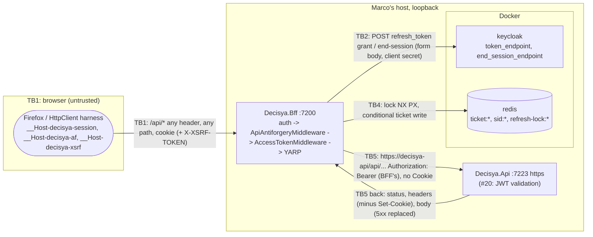

<!-- gate: G3 | verdict: PASS-WITH-NOTES | issue: #19 -->
# Threat delta: BFF `/api` forwarding, server-side token injection, refresh, server-side logout (issue #19)

- **Scope.** This is a delta on top of `docs/security/threat-models/bff-session.md` (#18). It covers only what #19 adds:
  - the YARP route and cluster in `Decisya.Bff.Proxy`, and its request and response transforms;
  - `ApiAntiforgeryMiddleware` and the shared `AntiforgeryCheck` (B-3);
  - `AccessTokenMiddleware`, `AccessTokenProvider`, `RedisRefreshLock`, `RedisTicketStore.TryUpdateTokensAsync` (refresh, B-1);
  - `KeycloakTokenClient` (the refresh grant, and the end-session call at `/bff/logout`, B-2);
  - the `Microsoft.Extensions.ServiceDiscovery.Yarp` package and the AppHost wiring.
  #18's threats are not re-audited here. Ids in this file are local to it; #18's ids are written "#18 T-nn".
- **Mode.** Threat delta, written before code. G6 checks the MUSTs against the diff.
- **Inputs.**
  - `docs/requirements/phase-0/bff-api-forwarding.md` (G1, Stories 1-7, NFR-24, NFR-25);
  - `docs/architecture/bff-api-forwarding.md` (G2, D1-D6 and "For G3");
  - `docs/security/threat-models/bff-session.md` (B-1..B-3, #18 T-01, T-04, T-12, T-13, T-16);
  - the current `src/Decisya.Bff` code (`Program.cs`, `BffEndpoints`, `AntiforgeryEndpointFilter`, `RedisRegistration`), `src/Decisya.Api/Program.cs` and the ServiceDefaults;
  - ADR-0002, ADR-0003, ADR-0007, ADR-0011.
- **ASVS.** 5.0, L2, and **L3 for V6 and V7**. Controls are mapped at section level, as in the earlier models. Check requirement numbers against the official 5.0 text before they go into a compliance artefact.
- **Runs on:** host (manifest). Confirmed below (package answer). No secret value was read for this review.
- **#20 boundary.** `Decisya.Api` validates nothing in #19. Nothing here relies on it doing so, and #20 must not rely on the BFF (see "#20 boundary" below).
- Reviewer: security-reviewer agent, 2026-09-28.

## Verdict

**PASS-WITH-NOTES.** The G2 design is sound and closes B-1, B-2 and B-3. Three threats are rated High, and each has a mitigation in #19:

| Threat | Mitigation |
| --- | --- |
| T-01, a client-supplied `Authorization`, the session cookie or the XSRF pair reaches `Decisya.Api` | G2 request transforms; proven by G4-19-01 |
| T-05, the forwarded bearer comes back to the browser in an upstream error body | **New in G3**; G4-19-02 |
| T-06, CSRF on state-changing `/api` calls (B-3) | G2 D4 shared check in the proxy pipeline; proven by G4-19-03 |

G3 adds two design points that G2 does not cover. Both are MUST:

1. **Do not pass upstream 5xx bodies to the browser (T-05).** G2 passes status and body through unchanged. `Decisya.Api` has no `UseExceptionHandler`, so in Development (the AppHost's environment) `WebApplication` adds the developer exception page. Both its HTML and its plain-text or ProblemDetails forms print the request headers, and the forwarded request carries `Authorization: Bearer <access token>`. Once #20 adds endpoints, any unhandled API exception sends the user's access token to the browser. That breaks NFR-21 and #18 T-01. The BFF must replace the body of every upstream 5xx response with its own generic ProblemDetails and keep the status code. This does not depend on what #20 does.
2. **Check https on the resolved destination, not only on the configured string (T-02).** `Bff:Api:Address = https://decisya-api` is resolved through service discovery. The resolver takes the resolved endpoint's scheme when the configured endpoint value carries one (for example `services__decisya-api__https__0=http://...`). `AllowedSchemes` is still commented out in `Decisya.ServiceDefaults` (`Extensions.AddServiceDefaults`). Outside Development the BFF must attach the bearer only to an outgoing request whose final `RequestUri` is `https`, and refuse the request otherwise (see G4-19-01).

### Answers to G2's "For G3"

1. **`Microsoft.Extensions.ServiceDiscovery.Yarp`: accepted, Low (T-17). The host run stays.**
   - It is first-party Microsoft (the dotnet/aspire repository), and the `Microsoft.Extensions.*` prefix is reserved on nuget.org. ADR-0011 recommends the sandbox for new *third-party* packages, so it does not apply here. The manifest's `host` is correct.
   - G4 conditions:
     - pin it at the same version as `Microsoft.Extensions.ServiceDiscovery`;
     - if its transitive `Yarp.ReverseProxy` floor is above the pinned 2.3.0, report the exact `NU1605`/`NU1109` and stop (CLAUDE.md), and do not float the pin;
     - include the PR-body justification line from G2.
   - G6 runs `dotnet list package --vulnerable --include-transitive` for `Decisya.Bff`.
2. **https-only destination: accepted, with G3 point 2 added (T-02, Medium).**
   - Configured-string validation outside Development follows the `RequireHttpsMetadata` pattern (#18 G4-18-04).
   - It is not enough on its own because of the resolver behaviour above. The final-URI check in the transform that sets `Authorization` costs a few lines and covers both paths.
   - `http` is honoured only when `IsDevelopment()`, as in #18.
3. **Stripped and added headers: accepted (T-01, T-04).**
   - `Cookie`, client `Authorization`, `X-XSRF-TOKEN` and `Forwarded` are removed. `X-Forwarded-*` uses `Set`. YARP does not forward the client `Host` by default (the destination authority is used). On responses, `Set-Cookie` is removed.
   - G4-19-01 and G4-19-02 pin these rules, because a later "append" or "copy all" change would quietly reopen them.
   - Every other client header is still copied (`X-Tenant-Id`, `X-User-Id`, `X-Forwarded-Host` carrying the client's `Host`, and so on). That is safe only if #20 never trusts them, so it goes to the #20 boundary. It is not a #19 finding.
4. **End-session with the refresh token at logout, fail-open: accepted, Low (T-13).**
   - G1 decision 2 stands. The user's own local logout must not depend on Keycloak.
   - Residual during an outage: the SSO session outlives the logout, bounded by the 1800 s idle timeout (the same bound #18 T-12 accepted). Access tokens already issued stay valid at the API for up to 300 s. Only the BFF held them, and the ticket is gone.
   - The call is a POST with `client_id`, `client_secret` and `refresh_token` in the **form body**, never in the query, to the discovered `end_session_endpoint` over the OIDC backchannel (TLS rules from #18 T-08). G4-19-05 asserts this.
   - Tighten the order (S-4): keep the refresh lock until the ticket is deleted.
5. **503 for refresh failures other than `invalid_grant` (D6): accepted, Low (T-10).**
   - The design fails closed for forwarding: a stale token is never forwarded, and nothing is retried (retrying under strict rotation would burn the refresh token).
   - Ending the session on `invalid_client` or a 5xx would log everyone out on a secret rotation or a Keycloak blip. Keeping the session is correct.
   - G4-19-04 asserts that the result is 503, that nothing is forwarded and that exactly one Keycloak call is made.
6. **Redis refresh lock (TTL 10 s, polling every 100 ms for up to 10 s): accepted, Low (T-11).**
   - Worst-case holder time: re-read (1 s Redis timeout) + refresh (5 s) + conditional write (1 s) = 7 s. That is below the 10 s TTL.
   - A holder that dies leaves its waiters at 503 for up to 10 s. After that the next request takes the lock. Accepted.
   - Residual: a holder whose lock expires during a slow write lets a second holder refresh with the rotated-away token. Keycloak answers `invalid_grant`, and B-1 then deletes a ticket the first holder has just updated. That is a spurious logout, not a security failure. S-3 closes it in a few lines.
   - Implementation note: bound the wait with a real `CancellationTokenSource(10 s)` as well as the `IClock` deadline. Otherwise a frozen `FakeClock` in tests turns a stuck lock into a hung test.
   - Release on value match (`LockReleaseAsync`) is correct.
7. **Write-back with `Condition.KeyExists`: accepted. It is the control for T-09 (Medium).**
   - Without it, a refresh that finishes after `/bff/logout` or a back-channel logout would write the ticket back and resurrect the session.
   - The write must use the same key-bound protector as the rest of the store (#18 S-2, `CreateProtector("Decisya.Bff.TicketStore.v1", key)`). Otherwise the next retrieve fails to unprotect.
   - G4-19-04 has a red race test for this.
8. **Antiforgery in a proxy middleware, because endpoint filters do not run on YARP routes: accepted (T-06, High, mitigated).**
   - It runs inside `MapReverseProxy`, after `UseAuthentication`/`UseAuthorization`, so the pair stays bound to `sub` as in #18 T-04, and anonymous callers get 401 before any 403.
   - #18's `EndpointDataSource` metadata test cannot see this pipeline. That is why G4-19-03 is behavioural, and why it must cover every G4-18-02 case, not only "no header".
   - Two cheap hardenings are in S-2: a safe-method allow-list, and a header-required check before `IAntiforgery` is called.
9. **SSRF or open proxying through the catch-all: Low (T-03).**
   - The route table is code-only (the static test bans a `ReverseProxy` configuration section). There is one cluster, and the destination authority comes from configuration, not from the request. YARP ignores the client `Host`. Kestrel removes dot segments before routing, so `/api/../bff/logout` reaches `/bff/logout`, which has its own filter. `%2F` stays encoded and is forwarded as a literal segment. An absolute-form request target cannot change the destination.
   - Result: every upstream path starts with `/api/` on the configured authority. That invariant is asserted cheaply in G4-19-01. It cannot reach the API's `/health` or `/alive`.
10. **Token leakage in logs: Medium (T-15). Existing controls:**
    - `IncludeDetailInExceptions = false` on the Redis client (#18 G6 F1), which keeps the lock key and the session key out of exception messages;
    - the ServiceDefaults masking processor (JWT and bearer patterns, `Uri` query masking);
    - YARP does not log headers;
    - the OIDC `Backchannel` is not a factory client, so no `HttpClient` logging handler is attached. OTel records `url.full`, which carries no secret because the tokens are in POST bodies.

    What remains is a developer logging a form body, a Keycloak response body or a `FormUrlEncodedContent` "for diagnosis". G4-19-05 adds a log-capture scan across every new flow. `/api` query strings reach YARP's Information-level "Proxying to" log (S-1).

## Data flow and trust boundaries

- **TB1, browser → BFF.** Unchanged from #18. Now it also carries arbitrary `/api` paths, verbs and headers.
- **TB2, BFF → Keycloak.** New: the refresh grant and the end-session POST, both carrying the refresh token and the client secret. Trust rests on #18 T-08 (https metadata outside Development).
- **TB4, BFF → Redis.** New: the lock keys and a conditional write. Redis is trusted for availability only (#18).
- **TB5, BFF ↔ API (new).** Outbound, the BFF hands a bearer credential to whatever the destination resolves to. Inbound, the API is **less** trusted than the BFF for what reaches the browser: its headers and error bodies must not be able to set cookies on the BFF origin or reflect the token.

## Threats

| Id | Element / flow | STRIDE | Threat | Severity | Mitigation | ASVS 5.0 id | Status |
| --- | --- | --- | --- | --- | --- | --- | --- |
| T-01 | TB5 request headers | S, I | A client `Authorization` is forwarded, or appended next to the BFF's (identity confusion at the API). The session, `af` or `xsrf` cookies, `X-XSRF-TOKEN` or `Forwarded` reach the API. A spoofed `X-Forwarded-For` survives through `Append` | High | G2 transforms: remove, then set; `X-Forwarded-*` `Set` | V7.2, V10.4, V4.1 | G4-19-01 |
| T-02 | TB5 destination | I | The bearer travels in plaintext: an `http` `Bff:Api:Address` outside Development, or service discovery resolving `https://decisya-api` to an `http` endpoint | Medium | Options validation outside Development, plus a final-URI `https` check before the bearer is attached (G3 point 2) | V12.3, V13.2 | G4-19-01 |
| T-03 | Catch-all route | T, E | Open proxy or SSRF: the `Host` header, an absolute-form target, dot segments or encoded slashes steer the request to another host or to non-`/api` API paths (`/health`) | Low | Code-only route table, one cluster, Kestrel path normalisation, YARP ignores the client `Host` | V4.1, V15.3 | Verified by G4-19-01 |
| T-04 | TB5 response headers | T, S | The API sets `__Host-decisya-session` or another cookie on the BFF origin (fixation, cookie tossing) | Medium | `Set-Cookie` removed | V3.3, V7.2 | G4-19-02 |
| T-05 | TB5 response body | I | The access token is reflected back to the browser: the API's Development exception page prints request headers, and G2 passes 5xx bodies through unchanged | High | Upstream 5xx body replaced with the generic ProblemDetails (G3 point 1); #20 also adds `UseExceptionHandler` | V16.5, V14.2, V3.3 | G4-19-02 |
| T-06 | State-changing `/api` (B-3) | T, E | Cross-site or same-site request forgery against the API; the filter silently not running on YARP endpoints; another user's pair or a pair minted while anonymous is accepted | High | `ApiAntiforgeryMiddleware` calling the shared `AntiforgeryCheck` after authentication; `SameSite=Strict` as the first layer | V3.5, V7.2 | G4-19-03 |
| T-07 | Anonymous `/api` | S, I | Forwarded without a token, redirected to an HTML login page, or rejected with 403 before 401 | Medium | Route policy `default`, #18 `OnRedirectToLogin` → 401 | V8.1, V4.1 | G4-19-03 |
| T-08 | Refresh rejected (B-1, #18 T-13) | S | After Keycloak's `invalid_grant` (idle or revoked session) the BFF keeps the session or forwards the stale token | Medium | `SessionEnded` → sign-out, ticket deleted, 401 | V7.3, V7.4, V10.4 | G4-19-04 |
| T-09 | Refresh write-back | S, E | A refresh that finishes after `/bff/logout` or a back-channel logout writes the ticket back: the session is resurrected | Medium | `TryUpdateTokensAsync` with `Condition.KeyExists` in one transaction | V7.4, V7.2 | G4-19-04 |
| T-10 | Refresh failure handling (D6) | D, E | The stale token is forwarded on error, the POST is retried (burning the rotated refresh token), or the error detail reaches the client | Low | `Unavailable` → 503 generic; `Backchannel`, no resilience handler; 5 s timeout | V16.5, V10.4 | G4-19-04 |
| T-11 | Refresh lock | D | The holder dies (waiters get 503 for up to 10 s); the lock expires in flight, so a second refresh with the rotated-away token leads to a spurious B-1 logout | Low | TTL 10 s > 7 s worst-case holder time; value-matched release; S-3 | V15.2 | Accepted; S-3 |
| T-12 | Refresh during a Keycloak outage | D | Every stale request costs a 5 s Keycloak call plus up to 10 s of lock waiting: amplification by one authenticated user | Low | Bounded timeouts; rate limits are a later issue | V2.4, V15.2 | Backlog #83 |
| T-13 | `/bff/logout` end-session (B-2, #18 T-12) | S | The Keycloak SSO session survives a logout when Keycloak is unreachable (fail-open); access tokens already issued stay valid for up to 300 s | Low | G1 decision 2; 1800 s idle bound; only the BFF held the tokens; failure logged and counted | V7.4, V7.6 | Accepted |
| T-14 | Logout racing a refresh | S | A refresh completes between the end-session call and the ticket delete, and one request is forwarded with a token minted after the user logged out | Low | Lock held during logout; S-4 closes the window | V7.4 | S-4 |
| T-15 | Logs (refresh, logout, YARP, exceptions) | I | A refresh token, access token, client secret, session key or Keycloak response body reaches the logs | Medium | `IncludeDetailInExceptions=false`; masking processor; tokens only in POST bodies; `BffLog` source-generated messages; G6 check | V16.2, V16.3, V14.2 | G4-19-05 |
| T-16 | YARP Information logs | I | `/api` query strings (search terms, account ids) are logged in the "Proxying to" line | Low | S-1 | V16.2, V14.2 | S-1 |
| T-17 | New package | T | A tampered or typo-squatted package, or a transitive Yarp version drift | Low | First-party, reserved prefix, central pin, vulnerability scan at G6 | V15.2, V13.1 | Accepted |
| T-18 | Antiforgery check drift | T, E | A verb added later misses the deny-list; a missing header makes `IAntiforgery` read the form body (consumed before YARP forwards it) | Low | S-2 | V3.5, V15.3 | S-2 |
| T-19 | Copied headers the API might trust | S, E | `X-Tenant-Id`, `X-User-Id`, `X-Forwarded-Host` (the client's `Host`) and similar headers reach the API unchanged | Medium for #20 | #20 derives identity and tenant from validated claims only | V8.2, V4.1 | → #20 boundary |

## Requirements for G4

At most five MUSTs, all **fix-now**. Each names the red test that must fail before the code exists. Tests go in `tests/Decisya.Bff.Tests` with `Category=Integration` wherever Keycloak or Redis is involved. Canaries are built at run time. `ApiDouble` gains exactly two test-only failure modes (a `Set-Cookie` response, and a 5xx whose body contains the received `Authorization` value, which simulates the developer exception page). It still never echoes on its normal path.

- **G4-19-01, where the bearer goes and what goes with it (T-01, T-02, T-03; Story 1).**
  - Red test `ApiForwardingTests.Forwarded_request_carries_only_the_bffs_bearer`. Send a GET and a POST (with a valid pair). Each carries the session, `af` and `xsrf` cookies, `Authorization: Bearer attacker`, `X-XSRF-TOKEN`, `Forwarded: for=6.6.6.6`, and `X-Forwarded-For: 6.6.6.6`, `X-Forwarded-Host: evil.test`, `X-Forwarded-Proto: http`. The double must record:
    - exactly one `Authorization` value, equal to the ticket's `access_token` (read through the store's protector), and not the ID token;
    - no `Cookie`, no `X-XSRF-TOKEN` and no `Forwarded`;
    - `X-Forwarded-For` not containing `6.6.6.6`.
  - Red test `ApiForwardingTests.Destination_cannot_be_steered_by_the_request`. Send `Host: evil.test`, `/api/%2e%2e/health` and `/api/..%2Fhealth`. Every request the double records has the configured authority, and a path that starts with `/api/`.
  - Red tests `BffOptionsTests`, with the environment `Production`:
    - `Bff:Api:Address` set to `http://…` or to a relative value → startup fails, and the message names the key, not the value;
    - `Bff:Api:Address=https://decisya-api` with `services:decisya-api:https:0=http://127.0.0.1:<double>` → the double receives no request carrying `Authorization` (the final-URI check). The browser gets a generic 5xx.
    - The same `http` configuration works in `Development`.
- **G4-19-02, nothing from the API response can set state or carry a token back (T-04, T-05; NFR-21).**
  - Red test `ApiResponseTests.Upstream_set_cookie_is_dropped`. The double answers with `Set-Cookie: __Host-decisya-session=x` and a second cookie. The browser response has no `Set-Cookie` from upstream, and the session still authenticates afterwards.
  - Red test `ApiResponseTests.Upstream_5xx_body_is_replaced`. The double answers 500 with the received `Authorization` in the body, in `text/plain`, `text/html` and `application/problem+json`. The browser gets 500 with the BFF's generic ProblemDetails, and no token value in the body or headers. A 4xx body (a future #20 ProblemDetails) and `WWW-Authenticate` still pass through.
  - Extend #18's `TokenLeakScanTests` to every `/api` response in #19's flows: forwarded 200, refreshed, 401 after B-1, 403, 503, and the two failure modes above. Scan each token raw and as its JWT payload segment.
- **G4-19-03, antiforgery and anonymous rejection on `/api` (T-06, T-07; B-3, Stories 6 and 7).**
  - Red theory `ApiAntiforgeryTests`. For each of POST, PUT, PATCH and DELETE on `/api/x`, each of #18's G4-18-02 cases must give 403 ProblemDetails, the double must receive nothing, and the session must stay valid. The cases:
    - no header;
    - a header that does not match the cookie;
    - `dev-bob`'s valid pair presented with `dev-alice`'s session;
    - a pair issued while anonymous, presented after login.
  - A valid pair is forwarded. GET and HEAD without a header are forwarded.
  - Red test: anonymous GET and anonymous POST without a header give **401**, not 302 or 403, and nothing is forwarded.
  - Red test: a verb outside the route's list (`OPTIONS`, `PROPFIND`) is not forwarded.
- **G4-19-04, the refresh state machine (T-08, T-09, T-10; B-1, Done-when, NFR-24, NFR-25).** Besides the G5 scenarios for the Done-when and NFR-24/25:
  - Red test `TokenRefreshTests.Invalid_grant_ends_the_session` (B-1). After Keycloak ends the session, `/api` gives 401 and the `Set-Cookie` clears the session cookie. The ticket key is absent in Redis, and the double received nothing. A second call gives 401.
  - Red theory `TokenRefreshTests.Other_refresh_failures_return_503_and_keep_the_session`. The counting handler returns 500, `401 invalid_client`, or throws a timeout. For each: 503 with the generic body, nothing forwarded, the ticket still present with the old tokens, and **exactly one** token-endpoint call (no retry).
  - Red test `TokenRefreshTests.Logout_during_refresh_is_not_undone` (T-09). The counting handler holds the refresh response. Meanwhile the ticket is deleted (a logout, or a direct `RemoveAsync`), then the response is released. The ticket stays absent, the request gets 401, and nothing is forwarded.
  - In every refresh test the counting handler asserts two things. The request URI has **no query**, with `refresh_token` and `client_secret` only in the form body. The target is the discovered `token_endpoint`.
  - After a refresh, a second request is forwarded with the new token and makes no second refresh call. This proves the write-back used the key-bound protector.
- **G4-19-05, server-side logout, and no token in any log (T-13, T-15; B-2, Story 5).**
  - G5's Story 5 test: after logout, the pre-logout refresh token gets `invalid_grant` at Keycloak. The counting handler asserts that the end-session call is a POST to the discovered `end_session_endpoint` with the refresh token in the body, not the query.
  - Red test `LogoutTests.Keycloak_failure_still_logs_out_locally`. The handler throws on end-session. The results must be:
    - the cookie is cleared, the ticket is deleted and the redirect is unchanged;
    - no error reaches the browser;
    - `decisya.bff.keycloak_logout.failures` is incremented;
    - one log entry carries a trace id.
  - Red test `LogCaptureTests.No_secret_reaches_any_log`. Capture every log record in the factory at `Debug` for `Decisya`, `Yarp`, `Microsoft.AspNetCore.Authentication` and `System.Net.Http`, across these flows: forward, refresh, `invalid_grant`, 503, logout (success and failure). No record's message, state values or exception text may contain:
    - the access, refresh or ID token (raw or as its payload segment);
    - the client secret;
    - the session key.

G6 checks, which need no new test:
- no logger call takes a token, the form content, a Keycloak response body, the session key or the lock key;
- `AccessTokenProvider` never parses the JWT (the NetArchTest rule in G2);
- the refresh and end-session calls use `OpenIdConnectOptions.Backchannel`, not an `IHttpClientFactory` client.

### SHOULD

**Fix-now (Low; a few lines each, in files this PR changes):**

- **S-1 (T-16).** Add `"Yarp": "Warning"` to `Logging:LogLevel` in the BFF's `appsettings.json`, which this PR already edits for `Bff:Api:Address`.
- **S-2 (T-18).** In `AntiforgeryCheck`:
  - treat every method **except** GET, HEAD, OPTIONS and TRACE as mutating (an allow-list of safe methods, not a deny-list);
  - on `/api`, reject a mutating request that has no `X-XSRF-TOKEN` header before calling `IAntiforgery`, so the request body is never read as a form.
- **S-3 (T-11).** On `invalid_grant`, re-read the ticket before ending the session. If its `refresh_token` differs from the one just sent, a peer refreshed after this holder's lock expired: use the new token (`Token`), not `SessionEnded`.
- **S-4 (T-14).** In `/bff/logout`, keep the refresh lock until after the cookie sign-out has deleted the ticket. Release it in `finally`.
- **S-5.** Reject HTTP upgrade and WebSocket requests on `/api` (`IHttpUpgradeFeature.IsUpgradableRequest`, `IHttpExtendedConnectFeature`) until a feature needs them. YARP proxies them by default, and a GET upgrade skips the antiforgery check.

**Backlog (#83):**

- **S-6 (T-12).** Add a short negative cache or circuit for Keycloak refresh failures per session. Do it with the rate-limit issue.
- **S-7.** Add a default `Cache-Control: no-store` on `/api` responses when upstream sets none. Better: #20 sets it on every financial response.
- **S-8.** Validate the refresh response before writing it back:
  - a non-empty `access_token`;
  - `0 < expires_in ≤ 3600`, otherwise `Unavailable`.

  The refreshed `id_token` is stored without validation, and nothing may read claims from it (the principal is not rebuilt).
- **S-9.** Outside Development, check that the discovered `token_endpoint` and `end_session_endpoint` share the authority's scheme and host before sending a refresh token (defence in depth beyond #18 T-08).

### #20 boundary (for #20's G3; not work for #19)

- The API validates every bearer: `iss`, `aud` (the API's own audience, which needs a Keycloak audience mapper), `exp`, and the RS256/ES256 allow-list. It never assumes the BFF checked anything.
- The API derives user and tenant **only** from validated claims. The BFF copies every client header it does not explicitly strip, so `X-Tenant-Id`, `X-User-Id` and similar headers are attacker-controlled (T-19).
- `UseForwardedHeaders` only with `KnownProxies`/`KnownNetworks` limited to the BFF. `X-Forwarded-Host` is the client's `Host` and must not be used to build URLs.
- `UseExceptionHandler` with generic ProblemDetails in every environment (the second layer behind G4-19-02). The API sets no cookies.
- Outside Development, the API is reachable only from the BFF (V4).
