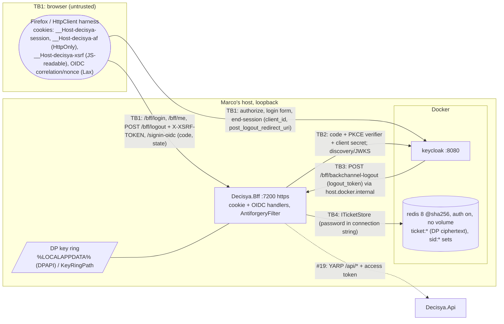

<!-- gate: G3 | verdict: PASS-WITH-NOTES | issue: #18 -->
# Threat delta: BFF session, OIDC, Redis ticket store, antiforgery, logout (issue #18)

- **Scope.** This model covers what #18 adds:
  - the `Decisya.Bff` host: cookie and OIDC handlers, `/bff/login`, `/bff/me`, `/bff/logout` and `/bff/backchannel-logout`;
  - `RedisTicketStore` and the Data Protection key ring;
  - the antiforgery filter;
  - the realm changes (`backchannel.logout.url`, the ID-token roles mapper);
  - the Redis resource and its image pin.
  YARP, `/api/*`, refresh and the refresh lock belong to #19. They are modelled here only as boundary requirements.
- **Mode.** Threat delta, written before code. G6 checks the MUSTs against the diff.
- **Inputs.**
  - `docs/requirements/phase-0/bff-session.md` (G1, Stories 1-7);
  - `docs/architecture/bff-session.md` (G2, D1-D6 and "For G3");
  - NFR-20 to NFR-23;
  - ADR-0002, ADR-0003, ADR-0007, ADR-0011;
  - `docs/security/threat-models/keycloak-realm.md` (#17: T-02, T-06, T-09, T-22);
  - the current realm file;
  - Marco's decisions of 2026-09-27: Full tier; back-channel logout is in #18; anonymous `/bff/me` returns 200; D3 has no `id_token_hint`.
- **ASVS.** 5.0, L2, and **L3 for V6 and V7**. Controls are mapped at section level, as in the earlier models. Check requirement numbers against the official 5.0 text before they go into a compliance artefact.
- **Runs on:** host (manifest). No secret value was read for this review.
- Reviewer: security-reviewer agent, 2026-09-27.

## Verdict

**PASS-WITH-NOTES.** The G2 design is sound and matches ADR-0003. Three threats are rated High, and each has a mitigation in #18:

| Threat | Mitigation |
| --- | --- |
| T-01, a token reaches the browser | G2 design (ticket store, `SaveTokens` into the ticket, D3); proven by G4-18-01 |
| T-08, the dev-only `RequireHttpsMetadata=false` or an http authority is honoured outside Development, which allows forged ID or logout tokens | G4-18-04 |
| T-10, forged or confused logout token | G2 validation rules; proven by G4-18-03 |

G3 adds two design points that G2 does not cover. Both are MUST:

1. **Rotate the session key on every sign-in (T-05).** ASP.NET Core's cookie handler reads the incoming cookie during sign-in. When a valid session cookie comes with the `/signin-oidc` callback, the handler calls `ITicketStore.RenewAsync` on the **existing** key instead of `StoreAsync` (dotnet/aspnetcore#22135). That is session fixation (V7.2). G4-18-05 requires the red test. If the test is green before any code is written, G4 records that in its evidence and keeps the test.
2. **Use the framework's local-URL check for `returnUrl` (T-06).** A hand-rolled prefix test misses control characters: browsers strip tab and newline characters, so `/<TAB>/evil.test` becomes `//evil.test`. G4-18-05.

### Answers to G2's "For G3"

1. **D3, RP-initiated logout without `id_token_hint`: accepted.**
   - The alternative, a `Location` header carrying the ID token, breaks the Done-when and NFR-21.
   - Residual risk, Medium, T-12: the BFF session is gone at once. If the user leaves Keycloak's confirmation page unanswered, the Keycloak SSO session lives on for up to 1800 s idle (10 h at most). On a shared device, the next `/bff/login` then signs in again without a password.
   - That residual is carried to the #19 boundary (B-2). #19 handles the refresh token, so it can end the Keycloak session server-side at logout. It needs no new ADR.
2. **The JavaScript-readable `__Host-decisya-xsrf` cookie: accepted, Low (T-04).**
   - This is the standard double-submit request token. JavaScript must read it by design.
   - It is not an XSS control. A script running on the page can send same-origin requests without it. XSS is the SPA issue's CSP and encoding work.
   - The controls that matter:
     - the HttpOnly cookie token `__Host-decisya-af` is the secret half;
     - the pair is bound to the user (`sub`, because `NameClaimType = sub`);
     - `__Host-` blocks cookie tossing from sibling subdomains;
     - `SameSite=Strict` on the session cookie is the first layer.
   - G4-18-02 pins these.
3. **`host.docker.internal` back-channel and dev-certificate trust: accepted, Low (T-14).**
   - The automated test does not depend on this path. A failure in dev only means an admin-initiated Keycloak logout does not reach the dev BFF.
   - The risk lies in how someone might "make it work". The conditions are in S-6:
     - trust only the **public** dev certificate, through Keycloak's truststore option;
     - never copy the private key or PFX into a container, a volume or the repository;
     - never disable hostname or certificate verification;
     - never bind the BFF beyond loopback.
   - G2's stop-and-record rule stays.
4. **`RequireHttpsMetadata=false` only in Development: accepted, with a hard gate (T-08, High).**
   - If the setting leaks into a deployed environment, discovery and JWKS travel over http. An on-path attacker can then serve its own keys and forge ID tokens and logout tokens: a full account takeover.
   - G4-18-04 makes startup fail outside Development when the flag is false or the authority is not https.
   - S-5 adds a loopback-host condition to the Development relaxation.
5. **The Redis image pin under ADR-0011: accepted, Low (T-15).**
   - The image runs inside Docker. It is not build-time code on the host, the same reasoning as #17 T-09 and T-10.
   - The host run stays.
   - Controls: official `docker.io/library/redis`, major 8, exact patch tag plus index digest, and `ContainerImages` → `images.Dockerfile` (`AS redis`) → parity test.
   - Image CVE scanning stays with #28 (#17 F-2).
6. **The Redis password in the Aspire dashboard: accepted, Low.** It is the same residual as #17 T-06: the dashboard is authenticated and loopback-only. A Redis compromise yields only Data Protection ciphertext (D1). S-2 closes the remaining ticket-swap gap.

## Data flow and trust boundaries

- **TB1, browser → BFF.** Every request, cookie, header and query value is untrusted. This is where CSRF, open redirect, fixation and token leakage happen.
- **TB2, BFF → Keycloak.** The BFF trusts the signed tokens only after it has validated them against discovery and JWKS fetched over https. Development is the one exception (T-08).
- **TB3, Keycloak → BFF (back channel).** The endpoint has no caller authentication. The logout token's signature and claims are the whole of the trust decision.
- **TB4, BFF → Redis.** Redis is a store that is trusted for availability only. Confidentiality and integrity come from Data Protection with a key ring held outside Redis.

## Threats

| Id | Element / flow | STRIDE | Threat | Severity | Mitigation | ASVS 5.0 id | Status |
| --- | --- | --- | --- | --- | --- | --- | --- |
| T-01 | BFF → browser responses | I | An access, ID or refresh token reaches the browser: in a cookie (`SaveTokens` into the cookie instead of the ticket), in `/bff/me`, in a logout `Location` (`id_token_hint`), or in an error body | High | Ticket store with `SaveTokens` kept in the ticket; `/bff/me` DTO; D3; generic ProblemDetails; flow-wide token scan | V7.2, V3.3, V14.2, V10.5 | Mitigated by G4-18-01 |
| T-02 | Session cookie | S, I | Missing `HttpOnly`/`Secure`/`SameSite=Strict`, a `Domain` attribute, or a persistent `Expires` exposes the session to script, http or sibling hosts | Medium | G2 cookie options; `__Host-` prefix; test on every `Set-Cookie` | V3.3, V7.2 | Mitigated by G4-18-01 |
| T-03 | Correlation and nonce cookies, callback | S, T | A tampered `state`, a missing correlation cookie or a missing PKCE check lets an attacker's code be bound to the victim's browser (login CSRF) | Medium | OIDC handler state and correlation, PKCE S256, `SameSite=Lax` + `Secure` + `HttpOnly`; G1 Story 1 scenarios 2-4 | V10.2, V10.5, V3.3 | Mitigated (G1/G2 tests) |
| T-04 | `POST /bff/logout`, future `/api` writes | T, E | Cross-site or same-site request forgery; an endpoint added later without the filter; a token pair usable across users; the opt-out metadata spreading | Medium | Explicit `AntiforgeryFilter` on the `/bff` group; `__Host-` cookies; token bound to `sub`; exactly one opt-out | V3.5, V7.2 | Mitigated by G4-18-02 |
| T-05 | `/signin-oidc` sign-in | S, E | Session fixation: a sign-in that arrives with a valid session cookie renews the **existing** key (see Verdict), so a planted cookie becomes the victim's session | Medium | Always issue a fresh key on authentication; the old key no longer authenticates | V7.2 | G4-18-05 |
| T-06 | `GET /bff/login?returnUrl=` and the signed-in shortcut | S | Open redirect after login (phishing that rides on a genuine login), through `//`, `/\`, control characters, absolute URLs or encoded variants | Medium | `RedirectHttpResult.IsLocalUrl` (or `IUrlHelper.IsLocalUrl`), applied **both** to the challenge and to the already-signed-in shortcut; otherwise `/` | V3.7, V10.2 | G4-18-05 |
| T-07 | Redis outage, corrupted entry | D, E | A hang, a 500 carrying exception detail, a local-cache fallback serving stale claims, or a `CryptographicException` on unprotect turning into a 500 loop | Medium | Fail closed within 1.5 s (G2); the NetArchTest ban on `Microsoft.Extensions.Caching`; NFR-22 test; S-3 | V16.5, V7.2, V15.2 | Mitigated (G2/NFR-22); S-3 |
| T-08 | TB2 metadata and JWKS | S, E | `RequireHttpsMetadata=false` or an http `Authority` honoured outside Development: forged keys lead to forged ID and logout tokens and account takeover | High | Relaxation honoured only when `IsDevelopment()`; startup fails otherwise | V12.1, V13.2, V10.5, V9.1 | Mitigated by G4-18-04 |
| T-09 | Data Protection key ring | I, T | A throwaway key ring in a deployed container (every restart logs everyone out; a fresh key ring looks healthy), or keys stored next to the ciphertext | Medium | D1: file system, DPAPI in dev, `KeyRingPath` required outside Development via `ValidateOnStart`, never in Redis | V11.1, V13.3, V14.2 | Mitigated by G4-18-04; prod storage → 0.16/0.17 |
| T-10 | `POST /bff/backchannel-logout` | S, T, D | A forged logout token (bad signature, `alg: none`, HS256 signed with the public key), another client's token, an ID token replayed as a logout token, or a missing `sid` triggers mass or targeted logout | High | G2 rules: JWKS signature, `iss`, `aud`, RS256/ES256, `events`, `sid` present, `nonce` absent, `iat` with 60 s skew | V9.1, V9.2, V10.5 | Mitigated by G4-18-03 |
| T-11 | Back-channel endpoint surface | D, I | A large body, verbose 400 reasons that help an attacker tune forgeries, or the endpoint picking up cookie or antiforgery behaviour | Low | S-4 | V4.1, V16.5 | SHOULD S-4 |
| T-12 | RP-initiated logout (D3) | S | The Keycloak SSO session survives when the confirmation page is left open, so a silent re-login is possible on a shared device | Medium | The BFF session and ticket are deleted first; Keycloak idle timeout 1800 s | V7.4, V7.6 | Accepted for #18; → #19 (B-2) |
| T-13 | Session lifetime | S | No BFF idle timeout: `/bff/me` reports signed in for the full 10 h after Keycloak's 1800 s idle timeout, and Keycloak sends no back-channel logout when a session expires | Low in #18 (only `/bff/me`, own claims) | 10 h absolute; no refresh in #18; B-1 | V7.3 | → #19 (B-1) |
| T-14 | TB3 in dev (`host.docker.internal`) | T, I | Someone makes it work by disabling TLS checks, copying the dev PFX (private key) into Keycloak, or binding the BFF to `0.0.0.0` | Low | G2 stop-and-record; S-6 | V12.3, V13.3 | SHOULD S-6 |
| T-15 | Redis image | T | A tampered or drifting image | Low | Official image, tag + digest, parity test; CVE scanning → #28 | V15.2, V13.1 | Mitigated |
| T-16 | Logs | I | The session key, cookie values, the auth `code`/`state`, or tokens reach logs through hosting request logs, OIDC handler debug logs or exception messages | Medium | Session key never logged (G2); `Microsoft.AspNetCore` at Warning (current repo default); S-1; G6 check | V16.2, V16.3 | G6 check; S-1 |
| T-17 | Ticket store integrity | T, E | An attacker with Redis write access swaps two users' valid ciphertexts, so cookie A resolves to user B's ticket (every ticket shares one purpose) | Low (needs Redis write access, auth on, loopback) | S-2: purpose bound to the session key | V11.1, V7.2 | SHOULD S-2 |

## Requirements for G4

At most five MUSTs. Each names the red test that must fail before the code exists. All tests go in `tests/Decisya.Bff.Tests`, with the `Category=Integration` trait wherever Keycloak or Redis is involved. Canaries are built at run time.

- **G4-18-01, cookie flags and zero tokens to the browser (T-01, T-02; Done-when, NFR-20, NFR-21).**
  - Red test `BffLoginFlowTests.Every_set_cookie_in_the_flow_has_the_required_attributes`. Across login, callback, `/bff/me`, logout and the signout callback:
    - the session cookie is named `__Host-decisya-session` with `HttpOnly; Secure; SameSite=Strict; Path=/`, no `Domain` and no `Expires`/`Max-Age`;
    - the correlation and nonce cookies are `SameSite=Lax; Secure; HttpOnly`;
    - `__Host-decisya-af` is `HttpOnly; Secure; SameSite=Strict; Path=/`;
    - `__Host-decisya-xsrf` is `Secure; SameSite=Strict; Path=/` and deliberately has no `HttpOnly`.
  - Red test `TokenLeakScanTests.No_token_value_appears_in_any_response`. Take the access, ID and refresh token values from the Redis ticket through the store's protector. Scan every response's status line, every header (the logout `Location` included), every `Set-Cookie` and every body across the whole flow. Scan each value both raw and as its JWT payload segment.
  - The scan also asserts that the logout `Location` has no `id_token_hint` parameter (D3).
- **G4-18-02, antiforgery (T-04; Story 4, Story 6 scenario 4).**
  - Red tests in `AntiforgeryTests`. `POST /bff/logout` returns 403 and the session stays valid in each of these cases:
    - no header;
    - a header that does not match the cookie;
    - a valid token pair issued to **another** user (`dev-bob`'s pair presented with `dev-alice`'s session);
    - a pair issued while anonymous, presented after login.
  - A valid pair succeeds.
  - Endpoint-metadata test: every non-GET endpoint in the `EndpointDataSource` either has the filter or is `/bff/backchannel-logout`. The opt-out metadata appears on exactly one endpoint.
- **G4-18-03, logout-token validation (T-10; Story 7).**
  - Red theory `BackchannelLogoutTests.Invalid_logout_token_is_rejected_and_deletes_nothing`. Each case returns 400, leaves the `sid` set and its tickets in place, and the body names no reason:
    - wrong signing key;
    - `alg: none`;
    - HS256 signed with the RSA public key's bytes;
    - wrong `iss`;
    - wrong `aud` (another client);
    - missing `events`;
    - `nonce` present (an ID-token-shaped token);
    - missing `sid`;
    - `iat` 5 min in the future;
    - `exp` in the past, when `exp` is present.
  - Valid token: every ticket under the `sid` is deleted and the response is 200 with `Cache-Control: no-store`. Replay: 200 and nothing deleted.
- **G4-18-04, Development-only relaxations fail closed elsewhere (T-08, T-09).**
  - Red tests `BffOptionsTests`. With the environment set to `Production`, startup throws with a message that names the key and not the value when:
    - `Bff:Oidc:RequireHttpsMetadata=false`;
    - `Bff:Oidc:Authority` is not `https`;
    - `Bff:DataProtection:KeyRingPath` is unset.
  - The same configuration starts in `Development`.
  - The relaxation is read as `IsDevelopment() && flag`, never from the flag alone.
- **G4-18-05, login integrity: fresh session key and local `returnUrl` only (T-05, T-06).**
  - Red test `SessionFixationTests.Sign_in_with_an_existing_session_cookie_issues_a_new_key`. Sign in as `dev-bob` and keep his cookie. Start a login as `dev-alice` and send `dev-bob`'s cookie with the `/signin-oidc` callback. Then:
    - the new session cookie's key differs from the old one;
    - the old cookie no longer authenticates as either user;
    - `dev-bob`'s old ticket is gone from Redis.
  - Suggested fix, few lines: before `UseAuthentication()`, strip the session cookie from the request on `CallbackPath`, and remove its ticket in `OnTicketReceived`. Any approach that makes the test pass is fine.
  - Red theory `ReturnUrlTests`. Each input redirects to `/`, on both the challenge and the already-signed-in shortcut:
    - `//evil.test`
    - `/\evil.test`
    - `/%09/evil.test` (decoded tab)
    - `https://evil.test`
    - `\\evil.test`
    - `/%2F%2Fevil.test` (only if the decoded form reaches the check)
    - an empty value
  - `/dashboard?x=1` is kept. Use the framework `IsLocalUrl`, not a hand-rolled prefix test.

G6 checks, which need no new test:
- No logger call takes the session key, the cookie, a token, `code` or `state` (T-16).
- `Microsoft.AspNetCore` stays at `Warning` in the BFF's `appsettings*.json`.
- The client secret is only in the environment (the G2 static test).

### SHOULD (fix in #18 if cheap; otherwise #83)

- **S-1 (T-16, T-03).**
  - Set `ResponseMode = query` explicitly. The handler default is `form_post`, a cross-site POST, and under schemeful same-site (Chromium, which Playwright runs) the http dev or Testcontainers Keycloak → https BFF callback would drop `SameSite=Lax` cookies. Lax is only consistent with a top-level GET callback.
  - With query mode, `code` and `state` sit in the callback URL, so the `Microsoft.AspNetCore.Hosting` request log must stay at Warning or higher.
- **S-2 (T-17).** Protect each ticket with a purpose bound to its key, `CreateProtector("Decisya.Bff.TicketStore.v1", key)`, so a ciphertext does not unprotect under any other key.
- **S-3 (T-07).**
  - `RetrieveAsync` treats `CryptographicException` and deserialization failure like a Redis failure: log without the key, increment `decisya.bff.ticket_store.failures{operation=retrieve}`, return `null`.
  - Test: overwrite a ticket with garbage and check that `/bff/me` returns `isAuthenticated: false`, not 500.
- **S-4 (T-11).**
  - Cap the request body of `/bff/backchannel-logout` at 16 KB.
  - Read only the `logout_token` form field.
  - Log the rejection reason server-side only.
  - Never run cookie authentication there: no `RequireAuthorization`, no use of the caller's identity.
- **S-5 (T-08).** Honour `RequireHttpsMetadata=false` only when, in addition, the authority host is `localhost`, `127.0.0.1` or `::1`.
- **S-6 (T-14).**
  - If G4 wires Keycloak's trust of the dev certificate, use Keycloak's truststore option pointing at an exported **public** PEM, generated at run time and git-ignored.
  - Never use a PFX or private key, `KC_TLS_HOSTNAME_VERIFIER=ANY` or a disabled verification.
  - Leave the BFF on loopback.
- **S-7.**
  - Disable the OIDC handler's front-channel `RemoteSignOutPath`, because the realm has `frontchannelLogout: false`. This removes an unused GET sign-out endpoint.
  - Assert `frontchannelLogout: false` and `backchannel.logout.session.required: true` in `RealmConfigurationTests`, next to the new URL.

### #19 boundary (for #19's G3; not work for #18)

- **B-1 (T-13).** A refresh failure (`invalid_grant`, Keycloak session idle or revoked) ends the BFF session: sign out and delete the ticket. That gives the V7.3 idle timeout in effect.
- **B-2 (T-12).** At `/bff/logout`, end the Keycloak session server-side with the refresh token, keeping the end-session redirect as a fallback. That removes the D3 residual.
- **B-3.** #19's `/api/*` routes get the same `AntiforgeryFilter` (G2 already states this), and the G4-18-02 metadata test extends to them.

### Backlog (#83)

- Security headers on BFF responses (`X-Content-Type-Options`, `Referrer-Policy`, CSP `frame-ancestors`), done together with the issue that serves the SPA.
- A user-visible list of active sessions with termination (V7.5, L3), for now delegated to the Keycloak account console.
