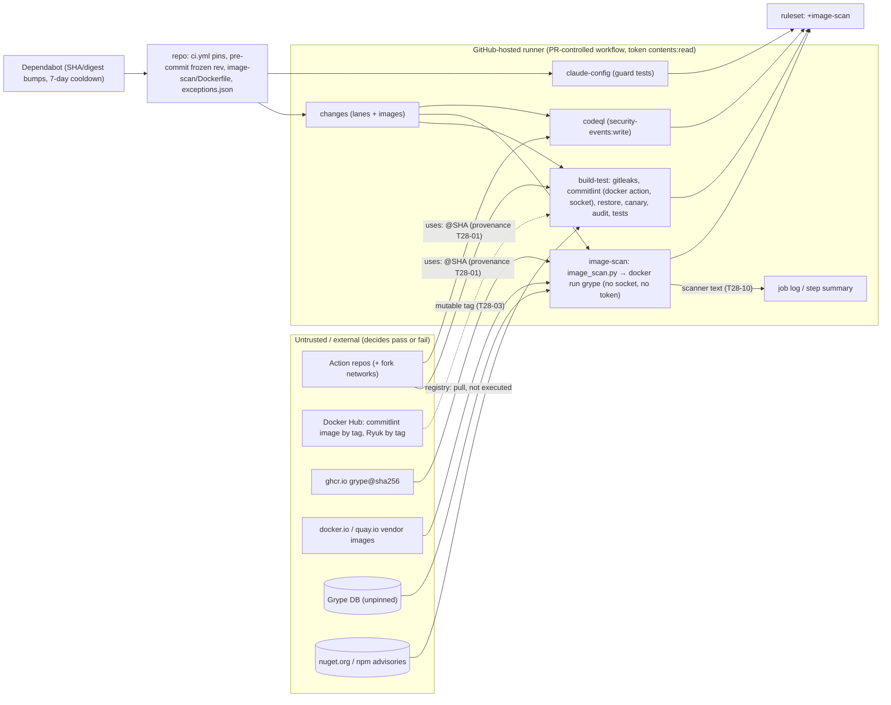

<!-- gate: G3 | verdict: PASS-WITH-NOTES | issue: #28 -->
# Threat delta: CI hardening (pins, dependency gates and canary, image CVE scan, CodeQL) (issue #28)

- Scope: the manifest `docs/ai/pipeline/28.md` (Full tier, class ci-tooling, host run), the G2 note `docs/architecture/ci-hardening.md` (D1 to D7), ADR-0014 and ADR-0015, both accepted by Marco. ZAP, AppHost-in-CI and Playwright-in-CI are #29 and not modelled here.
- Baselines: `system-baseline.md` C-07 and C-08 (SB-16); `claude-config.md` T-16; `main-ruleset.md` T80-01 to T80-12 and G4-80-xx. New threats use T28-xx, requirements G4-28-xx.
- ASVS 5.0 is mapped at section level by analogy, as in the earlier CI models: V15.1 (component inventory and remediation time frames), V15.2 (dependencies), V15.3 (defensive coding), V13.1 and V13.2 (configuration, least privilege), V16.4 (log protection and log injection). Check the numbers against the official 5.0 text before copying them into a compliance artefact.
- Reviewer: security-reviewer agent, 2026-10-03, G3 before G4. I read `ci.yml`, `dependabot.yml`, `.pre-commit-config.yaml`, `main.json`, the `main-ruleset` runbook, `test_ruleset.py`, `test_gitleaks_parity.py`, `test_commitlint.py`, `test_realm_guard_trigger.py`, `Directory.Build.props` and `ContainerImages.cs` on `issue/28-ci-hardening` (HEAD `c611794`; only the G2 docs are uncommitted). External evidence came from the public GitHub REST API: advisories GHSA-69fq-xp46-6x23, GHSA-9p44-j4g5-cfx5, GHSA-6gxw-85q2-q646, GHSA-5crp-9r3c-p9vr and GHSA-35jh-r3h4-6jhm, plus `wagoid/commitlint-github-action` `action.yml` at tag `v6.2.1`. I treated all of it as data.

## Verdict

**PASS-WITH-NOTES.** The design closes C-07 and C-08 and fixes the fail-open `Vulnerable packages` step. Each gate is built to fail closed, and the canary design (restore only, isolated package folder, a positive NU1903/NU1904 match) is sound. There is no High. Five Mediums become MUSTs (G4-28-01 to 05). Each is a gap that would let a gate pass silently, or let the scope of a pin be narrower than the guard implies.

ADR-0015's Trivy rationale is **supported** (high confidence, primary source). It needs a factual wording fix, not a new decision, so **ADR-0015 does not return to Marco**. Details are in "Trivy rationale" below.

## Evidence

- `ci.yml:124-128`, the fail-open step, confirmed: `dotnet list package --vulnerable --include-transitive 2>&1 | tee vuln.txt` then `! grep -Eq "High|Critical" vuln.txt`. There is no `shell:` and no `defaults`, so it runs as `bash -e {0}` and `tee` sets the pipeline status. GitHub runs `shell: bash` as `bash --noprofile --norc -eo pipefail {0}`, so G2's fix is correct. I checked every other `run:` in `ci.yml` (lanes, print-changed, commitlint verdict, integration loop, SPA guard, SPA install, gates). None relies on a masked pipeline exit. The lanes block already runs under `-eo pipefail` in `test_realm_guard_trigger.py:55`.
- `ci.yml:8-10`: top-level `contents: read` and `security-events: write`. Only `realm-guard` sets `persist-credentials: false`. Every checkout uses a tag ref. `zap-baseline` is `if: false` and is not in `main.json`.
- `wagoid/commitlint-github-action@v6.2.1` `action.yml`: `using: docker` and `image: docker://wagoid/commitlint-github-action:6.2.1` (a **tag**), with `token` defaulting to `${{ github.token }}`. G2's D1.2 guess is confirmed. The step runs inside `build-test` **before** Restore, Build, Vulnerable packages, the tests and (after #28) the canary. A Docker container action gets the workspace mounted read-write and, on GitHub-hosted runners, the Docker socket. G2's line "the mirror-drift check already limits what a swapped image could do" is therefore too strong: a swapped image could rewrite `.claude/scripts/commitlint.py` and every later step of that job (T28-03).
- `Directory.Build.props:41-43`: `UseArtifactsOutput=true`. On CI (Linux) `ArtifactsPath` is `<repo>/artifacts`. On Marco's Windows host it is `%LOCALAPPDATA%\decisya\artifacts\<hash>`. A canary project under `artifacts/dependency-canary/` therefore writes its `obj/` **outside** the folder the canary deletes (T28-07).
- Testcontainers in CI uses Ryuk (ADR-0010 and ADR-0011 text). Its image is tag-referenced by the Testcontainers package and runs with the Docker socket. This is pre-existing and Low (backlog).
- The canary advisories, checked today:
  - GHSA-5crp-9r3c-p9vr: `Newtonsoft.Json < 13.0.1`, **high**, CVSS 7.5, not withdrawn.
  - GHSA-35jh-r3h4-6jhm: `lodash < 4.17.21`, **high**, CVSS 7.2, not withdrawn.
  - Both seeded versions (12.0.3, 4.17.20) are in range.

## Trivy rationale (ADR-0015 option 2): verified

**Supported. Confidence: high.** The source is Aqua Security's own advisory **GHSA-69fq-xp46-6x23 / CVE-2026-33634**, rated *critical* and published 2026-03-24 against `aquasecurity/trivy`:
- On 2026-03-19, compromised credentials were used to:
  - force-push **76 of 77 `aquasecurity/trivy-action` version tags** to commits that inject an infostealer into `entrypoint.sh` (it dumps `Runner.Worker` memory and sweeps credential paths);
  - replace all 7 `setup-trivy` tags;
  - publish a malicious `trivy` v0.69.4 to GHCR, ECR Public and Docker Hub.
- On 2026-03-22, malicious v0.69.5 and v0.69.6 images were pushed to Docker Hub.
- Root cause: the attack continued the late-February 2026 compromise, after a non-atomic credential rotation.

Corrections for the ADR text (SHOULD, fix-now; a wording change, not a decision change):
1. Replace "early 2026 (G3 to confirm the details)" with "19 to 23 March 2026, GHSA-69fq-xp46-6x23 / CVE-2026-33634".
2. `trivy-action` is a **composite** action, not a JavaScript one.
3. Option 3 needs a fairer reason. The advisory states that "trivy images referenced by digest" were **not affected**. Option 3, a digest-pinned Trivy image, would have been technically safe. Rejecting it rests on the project's release-channel track record (two compromises in about a month), not on an exposure our pattern would have had. Grype stays the right choice on that basis, and Trivy-as-image stays the fallback.

Two details in the advisory directly support this PR's design and inform G4-28-01:
- The attacker swapped an `actions/checkout` reference to an **imposter commit**: a SHA that exists only in a fork network but resolves through the upstream repository name.
- Users who **SHA-pinned** `trivy-action` before 2025-04-09 were still exposed through its **transitive tag reference** to `setup-trivy`.

A SHA pin is only as good as (a) the provenance of the SHA and (b) what the pinned code references by tag.

Grype's own channel: one advisory, GHSA-6gxw-85q2-q646 (High, versions < 0.104.1). Grype writes registry credentials into JSON output files when registry auth is configured. It does not apply here: there is no registry auth, the JSON goes to stdout, and the newest release is pinned. No compromise of Grype's release channel is known to me.

## Data flow and trust boundaries (delta)

- **B1, external code → runner.** What runs is now named by SHA or digest, except (a) Docker images that pinned actions name by tag, (b) transitive `uses:` inside pinned composite actions, (c) the gitleaks binary that `gitleaks-action` downloads (ADR-0014, #83), and (d) Ryuk.
- **B2, external data → verdict.** Advisory data and the Grype DB decide pass or fail. Each must fail closed when it is missing, and each must prove that it actually evaluated the target.
- **B3, repository files → verdict.** `exceptions.json`, lane regexes and step `if`s can switch a gate off without any red signal. These are review-required paths, but a silent skip is what review misses.

## Threats

| Id | Element / flow | STRIDE | Threat | Severity | Mitigation | ASVS 5.0 id | Status |
| --- | --- | --- | --- | --- | --- | --- | --- |
| T28-01 | SHA provenance (B1) | T, S | A pinned SHA has a plausible `# vX.Y.Z` comment but is an imposter commit from a fork network, or the tag object rather than the peeled commit. Or a pinned **composite** action `uses:` another action by tag. The offline guard cannot see either. GHSA-69fq shows both in the wild. | Medium | **G4-28-01** | V15.2 | MUST |
| T28-02 | Guard completeness (`test_ci_pins.py`) | T | The guard reads only `.github/workflows/*.y{a,}ml`. A local action (`uses: ./.github/actions/x`) whose `action.yml` holds a tag `uses:` or a `runs.image: docker://…:tag` passes. A job-level reusable-workflow `uses:` is covered only if the parser reads job-level keys as well as steps. | Medium | **G4-28-02** | V15.2, V15.3 | MUST |
| T28-03 | `commitlint-github-action` image (docker action, tag `6.2.1`) | T, E | A swapped Docker Hub image runs with the workspace read-write, the Docker socket and a read token. It runs **before** restore, build, audit, canary and tests in the same job, so it can falsify every later result of `build-test`. It holds no secret of value, has no push ability and there is no shared cache, so this is integrity of the verdict only. | Low | SHOULD S-01 (fix-now: move both commitlint steps to the end of `build-test`). Backlog: digest-pin the image (`docker://…@sha256` with explicit inputs) or replace the action. | V15.2 | SHOULD (fix-now) + backlog |
| T28-04 | Fail-open step `Vulnerable packages` | T | `tee` masks a failing `dotnet list` (found at G2). A later edit (`shell: sh`, `shell: bash {0}`, a step-level `shell:` override, or removing `defaults`) silently reintroduces it. | Medium | `defaults: run: shell: bash` (G2 D2) plus **G4-28-03 (a)** | V15.3 | MUST |
| T28-05 | `images` lane → `image-scan` step `if` | T, R | The job always reports success and the scan sits behind a step `if`. If `changes.outputs.images` is missing, misspelled or never written, the expression is `'' == 'true'`. The scan is then skipped on **every** PR and every scheduled run, and the required check stays green. | Medium | **G4-28-03 (b)** | V15.3, V13.2 | MUST |
| T28-06 | Canary fail-closed (NuGet, npm) | T, R | A canary that passes for the wrong reason hides a disabled audit. The G2 design covers this: a non-zero exit plus `error NU1903/NU1904` naming the package, or `npm audit` JSON listing `lodash` at high or critical. Residual: the npm exit code and the JSON come from two invocations, so a network error on the first plus a good second run is accepted. `--weaken-for-evidence` must never reach `ci.yml`. | Low | SHOULD S-02 (fix-now) | V15.2 | SHOULD (fix-now) |
| T28-07 | Canary isolation (cache, tree, execution) | T | Restore only, an isolated `--packages`, no build, and `--package-lock-only --ignore-scripts` outside the repository: no package code runs, nothing is committed (`artifacts/` is ignored), and no global packages folder is poisoned. Only the content-addressed HTTP and npm caches see the legitimate nuget.org or npm artefact. Residual: `UseArtifactsOutput` puts the canary's `obj/` (assets file, `nuget.g.targets`) outside the deleted folder: `artifacts/obj/Canary` on CI, `%LOCALAPPDATA%` on Marco's host. A stale `artifacts/dependency-canary/` left after a hard kill would be seen by repo-scanning tests. | Low | SHOULD S-03 (fix-now) | V15.2 | SHOULD (fix-now) |
| T28-08 | `exceptions.json` integrity | T, R | The schema bounds `expires - added ≤ 90` but not `added` itself. An entry with `added` in the future (or `expires < added`) lasts much longer than 90 days, or forever if renewed by moving both dates. Loose matching (empty or glob `package`, a case-variant id, unknown extra keys such as a severity override) widens an exception beyond one finding. | Medium | **G4-28-04** | V15.1, V15.2 | MUST |
| T28-09 | Scan proves it scanned (B2) | T, R | The script fails on a non-zero exit or a missing `matches`. But `matches: []` is also what Grype returns when it catalogued nothing: wrong platform, an empty or unexpected source, a resolution to something other than the pinned digest. That passes silently. Grype's DB age check is on by default and must stay on. | Medium | **G4-28-05** | V15.2, V15.3 | MUST |
| T28-10 | Scanner text → job log and step summary | T | The G2 design puts scanner-derived stdout between `::stop-commands::<token_hex(16)>` and resume, and escapes the summary table. Residual: Grype's **stderr** (log lines carrying in-image paths and package names) and `docker` pull output are not covered unless captured. The summary escapes `\|`, backticks and newlines but not `<`, `>`, `[` or `]` (link and HTML rendering). Impact is low: read token, nothing written to `GITHUB_ENV` or `GITHUB_OUTPUT`. | Low | SHOULD S-04 (fix-now) | V16.4 | SHOULD (fix-now) |
| T28-11 | Severity mapping | T | Policy keys on `vulnerability.severity ∈ {High, Critical}`. A match with `Unknown` or `Negligible` distro severity whose related NVD or GHSA record is CVSS ≥ 7.0 passes. | Low | SHOULD S-05 (fix-now) | V15.2 | SHOULD (fix-now) |
| T28-12 | `codeql` permissions and meaning | R, D | Job-level `permissions` **replace** the top-level block. A job block with only `security-events: write` leaves `contents: none`. A green `codeql` means "analysed and uploaded" only. `security-extended` alerts do not block merge without a `code_scanning` rule (G2 D4, to #83). The runbook must not imply otherwise. | Low | SHOULD S-06 (fix-now) | V13.2 | SHOULD (fix-now) |
| T28-13 | Dependabot update path | T, D | (a) `cooldown` on an ecosystem or key Dependabot rejects produces a config error, and **all** updates stop silently. (b) A Dependabot or hand edit that changes a SHA but not its comment (or the reverse) keeps `test_gitleaks_parity.py` and `test_commitlint.py` green: they read the comment, not the SHA. | Low | SHOULD S-07 (fix-now, runbook and G4 evidence) | V15.2 | SHOULD (fix-now) |
| T28-14 | Schedule, `workflow_dispatch`, concurrency | D, R | `before` is empty on both events, so `changes` yields `ALL` (the `git cat-file -e "^{commit}"` path) and every lane runs. Adding the event to the group stops a schedule and a push cancelling each other. `workflow_dispatch` is write-only (Marco) and has no `inputs`, so there is no expression-injection surface. Residual: the 60-day auto-disable on inactivity, and failures notify only the cron's last editor. | Low | Runbook note (G2 D3). `workflow_dispatch` must stay without `inputs` or treat them as env (SHOULD S-08). | V13.1 | Mitigated by design |
| T28-15 | `image-scan` as a required context | D, T | A new required context could lock merges (T80-01) or be skip-unsafe (T80-03). The G2 design follows the runbook order (report on `main` first, then apply). `needs: changes` is required, there is no job-level `if`, and `FLOOR` adds the context, so the existing `test_ruleset.py` checks (G4-80-03 and 04) cover it. The step-level skip is the T28-05 risk. | Low | G2 D6 as written plus G4-28-03 (b) | V13.2, V15.3 | Mitigated by design |
| T28-16 | `persist-credentials: false`, narrower token | D | `gitleaks-action` and `commitlint-github-action` call the API for PR commits with the job token. Pull-request scopes are already `none` today, so the change does not narrow them further. `gates.py`'s `git fetch origin` is anonymous on a public repository. | Low | G4 confirms on the PR run (G2 D5). No new requirement. | V13.2 | Mitigated by design |

## Requirements for G4 (MUST, five)

- **G4-28-01: Pin provenance and transitive references (T28-01).** For every pinned action and the pre-commit gitleaks rev, record in the G4 evidence:
  1. the `git ls-remote https://github.com/<owner>/<repo> refs/tags/<tag> 'refs/tags/<tag>^{}'` output;
  2. the SHA used, which is the `^{}` line when present;
  3. the `runs.using` from `action.yml` at that SHA;
  4. for `composite`, every inner `uses:`, and for `docker`, the `image:`.

  Any inner reference that is not a SHA or digest is listed as a residual in the PR body. The known one today is commitlint's `docker://wagoid/commitlint-github-action:6.2.1`. G6 re-runs `ls-remote` for every pin, and any mismatch is a BLOCK. The new runbook `ci-security-gates.md` tells Marco to check a hand-edited or agent-edited pin the same way before merging. A Dependabot-written pin needs only the PR diff check.
- **G4-28-02: Guard completeness (T28-02).** `test_ci_pins.py` applies the D1 rules to the following, with one red case each:
  - **job-level** `uses:` (reusable workflows) as well as step `uses:`;
  - every **local action** referenced as `./<path>`: `<path>/action.y{a,}ml` exists and its own `uses:` and `runs.image` follow the same rules (`docker://` needs `@sha256:`, and a `Dockerfile` image is checked like the scanner pin);
  - `.github/workflows/*.yaml` and `*.yml` alike.

  A local action or reusable workflow that cannot be parsed fails closed.
- **G4-28-03: Fail-open regressions are tested (T28-04, T28-05).**
  - (a) A `.claude` test asserts that `ci.yml` has workflow-level `defaults.run.shell: bash` and that no step or job overrides `shell:` to anything other than `bash`. It also asserts that the `Vulnerable packages` step still pipes through `tee` only under that default, or no longer pipes at all.
  - (b) A behavioural lanes test (the `test_realm_guard_trigger.py` harness under `-eo pipefail`) asserts `images=true` for `ALL` and for each trigger path in D3: `ContainerImages.cs`, `images.Dockerfile`, `.github/image-scan/x`, `image_scan.py` and `ci.yml`. It asserts `images=false` for a docs-only change.
  - (c) A static test asserts all three of the following:
    - `changes.outputs.images` reads `steps.detect.outputs.images`;
    - the detect block writes `images=` to `$GITHUB_OUTPUT`;
    - the `image-scan` scan step's `if` is exactly `needs.changes.outputs.images == 'true'`.
- **G4-28-04: Exceptions are bounded in time and scope (T28-08).** `validate_exceptions()` exits 2, with one red case each in `test_image_scan.py`, when:
  - a key is unknown or missing;
  - `added` or `expires` is not a strict `YYYY-MM-DD` date;
  - `added` is later than today (UTC);
  - `expires` is earlier than `added`, or more than 90 days after it;
  - `id` does not match `^(CVE-\d{4}-\d{4,}|GHSA(-[23456789cfghjmpqrvwx]{4}){3})$`;
  - `package` is empty or contains glob or regex characters;
  - `issue` is not `#\d+`;
  - an entry duplicates another (same image, package and id).

  Matching is exact. "Expired" means `today > expires`, and the test pins that boundary.
- **G4-28-05: The scan must prove it scanned the pinned digest (T28-09).** For each image, `image_scan.py` fails, with a test on fixture JSON for each case, unless all of these hold:
  - `source.type` is `image`, and `source.target.userInput` equals the requested reference, including the `@sha256:` digest;
  - `source.target.layers` is non-empty and `distro.name` is non-empty. All three targets are OS-based images, so an empty value means nothing was catalogued. If Grype's JSON shape differs, G4 picks the equivalent fields from a real run and records them in the evidence;
  - the `descriptor.db` block is present with a `built` date.

  The script never sets `GRYPE_DB_VALIDATE_AGE=false` or `GRYPE_DB_MAX_ALLOWED_BUILT_AGE`. The environment it passes is the exact allow-list in D3 step 4, and a test asserts that.

## SHOULD (each marked fix-now or backlog)

- **S-01 (fix-now, `ci.yml`).** Move both commitlint steps (the action and the verdict and drift check) to the end of `build-test`, after the SPA steps and before `Summary`. A mutable image can then no longer influence restore, build, audit, canary or test results in that job. Correct the G2 "mirror-drift limits it" sentence in the PR body. Backlog (#83): a digest-pinned image or a replacement for the action.
- **S-02 (fix-now, `dependency_canary.py` and its test).**
  - The npm canary takes the exit code and the JSON from **one** `npm audit --audit-level=high --json` call.
  - A test asserts that `ci.yml` never contains `--weaken-for-evidence`.
  - The NuGet canary also fails when the matched NU190x line names a package other than the seeded one.
- **S-03 (fix-now, `dependency_canary.py`).**
  - Pass `-p:ArtifactsPath=<canary dir>/out` (a global property overrides the props) so every output lands inside the deleted folder.
  - Delete a stale `artifacts/dependency-canary/` at **start** as well as in `finally`.
- **S-04 (fix-now, `image_scan.py`).**
  - Run every `docker` call with `capture_output=True` and print its stdout and stderr only inside the stop-commands window.
  - In the step summary, also escape `<`, `>`, `[`, `]` and `\`, or put each value in a code span with backticks stripped.
  - Add a red case: a package named `::error::x` in **stderr**.
- **S-05 (fix-now, `image_scan.py`).** Treat a match as High when `vulnerability.severity` is `Unknown` or `Negligible` and any `cvss[].metrics.baseScore` (its own or in `relatedVulnerabilities`) is ≥ 7.0, with a fixture case. If G4 judges this too noisy at the first real run, it reports Unknown-severity counts in the summary instead and records the choice.
- **S-06 (fix-now, `ci.yml` and the runbook).**
  - Set the `codeql` job permissions to `contents: read` plus `security-events: write`.
  - The `image-scan` job declares `contents: read` only (as in D3).
  - The runbook's "codeql is skip-safe" section says that a green `codeql` means "analysis ran and uploaded", not "no alerts".
- **S-07 (fix-now, G4 evidence and the runbook).**
  - After merge, Marco checks *Insights → Dependency graph → Dependabot*. Every entry must show "last checked" with no configuration error once the `cooldown` keys land.
  - The runbook's pin-bump section says to compare the SHA with the comment (via `ls-remote`) on any pin PR.
- **S-08 (fix-now, a one-line test).** `workflow_dispatch` has no `inputs`. If inputs are ever added, they reach `run:` only through `env:`.
- **S-09 (fix-now, ADR-0015 text).** The Trivy wording corrections above.
- **Backlog (#83, Low):**
  - digest-pin or replace the commitlint docker action (T28-03);
  - digest-pin the Ryuk image in CI (`TESTCONTAINERS_RYUK_CONTAINER_IMAGE=…@sha256:`), which is tag-referenced and socket-mounted (pre-existing);
  - a scheduled online check that every pinned SHA is still reachable from its tag in the upstream repository (imposter-commit detection);
  - scanning the sandbox images (`.devcontainer/**`), which are not part of C-07.

  These join the deferred items already listed in G2 (the `code_scanning` rule, the gitleaks binary checksum, arm64, cosign, a `NuGetAuditSuppress` policy, `harden-runner`/Scorecard/`timeout-minutes`).

## Answers to the brief's questions

- **Annotated-tag peeling:** the G2 command is right. Take the `^{}` line. G6 re-verifies (G4-28-01).
- **Docker-container actions:** one in use (commitlint, image by tag, with the socket). Low, with a fix-now reorder (S-01) and a backlog pin. The rest are JavaScript actions: checkout, setup-dotnet, setup-node, gitleaks-action, codeql-action. G4 confirms each `runs.using` (G4-28-01).
- **Canary never built, executed, committed or cache-poisoning:** yes, by design, with S-03 to close the output-path residue. It fails closed (T28-06), and the advisory ratings are currently High (verified above).
- **Grype:** a digest pin, no socket and no token is the right shape. The exceptions file needs G4-28-04, and proof of a scan needs G4-28-05. Log injection is covered for stdout and needs S-04 for stderr. Schedule, dispatch and concurrency are sound (T28-14).
- **CodeQL `security-extended`:** fine. A green check does not mean "no alerts" (S-06, and the #83 item).
- **Permissions:** least privilege per job is sound, given S-06. `gitleaks-action` and commitlint are unaffected (T28-16). G4 confirms on the PR run.
- **`image-scan` required check:** safe with the G2 order and the existing drift tests. The real risk is a silent step skip (G4-28-03 b, c).

## Residual risk after #28 (with the MUSTs)

- Images referenced by tag inside pinned actions (commitlint) and by Testcontainers (Ryuk): Low, backlog.
- Advisory and Grype DB data are external and unpinned by nature. Each gate fails closed when the data is missing, and the canary detects a disabled audit.
- New CVEs between bumps are caught weekly (ADR-0015), and a scheduled failure blocks no PR.
- CodeQL alerts do not block merge until the #83 ruleset item lands.
- No High or Medium found in unchanged code beyond the fail-open step that G2 already reported to Marco.
