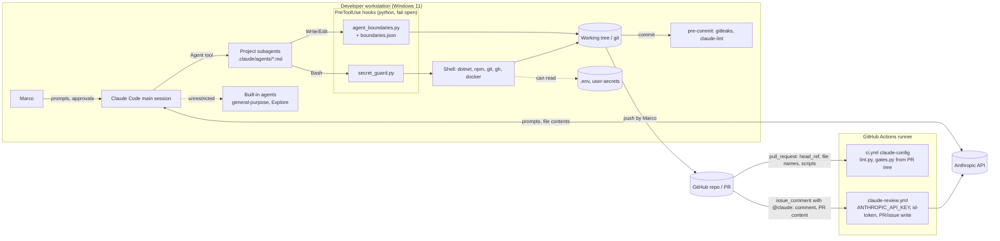

<!-- gate: G3 | verdict: PASS-WITH-NOTES | issue: #35 -->
# Threat model: Claude Code configuration, hooks and CI gates (issue #35)

- Scope: development tooling only, not the Decisya application. Branch `issue/35-agents-redesign`, commits `f611ea6..d438154` (`git log --oneline origin/main..HEAD`), design in `docs/ai/agents-review.md` §5 and §9.
- Mode: threat delta, done **after the fact**. The implementation was already committed when this was written, so the recommendations below are follow-ups, not design inputs.
- Change class: ci-tooling. No application trust boundary (browser, BFF, API, data stores) changes.
- Reviewer: security-reviewer agent, 2026-09-23.

## Verdict

PASS-WITH-NOTES. One High (T-12, the `claude-review` workflow) is pre-existing and only partly mitigated. It needs a follow-up issue before the repository accepts outside PRs or Marco runs `@claude` on a PR he did not write. There are eight Mediums. Seven have recommended fixes. T-10 (prompt injection through content that agents read) is accepted as inherent: its fixes only reduce the risk. The hooks do what they claim within their stated scope, and I tested them live (see Evidence). But they are **guardrails for well-behaved agents, not a security boundary against a compromised or prompt-injected one**, because Bash can bypass both of them.

## ASVS mapping note

ASVS 5.0 is written for applications. The ids below map tooling threats **by analogy** and are cited at section level (`V<chapter>.<section>`), because this change touches chapters whose curated entries in `.claude/skills/asvs-checklist/references/l2-controls.md` only go down to chapter level. Before any of these is copied into a compliance artefact, confirm the requirement numbers against the official 5.0 text. The sections used:

- V1.2: injection prevention (OS command injection)
- V8.2: general authorization design (least privilege, deny by default)
- V13.1: configuration documentation
- V13.3: secret management
- V15.2: security architecture and dependencies (component pinning and hygiene)
- V15.3: defensive coding
- V16.3: security events

N/A means no ASVS control fits.

## Data flow and trust boundaries

Trust boundaries:

- **TB1 Developer ↔ main session.** Only Marco's own messages and the permission prompts carry consent. The main session is unrestricted by design.
- **TB2 Main session ↔ subagents.** This boundary is enforced by agent `tools:` lists, `boundaries.json` plus the hook, and `settings.json` deny rules.
- **TB3 Agents ↔ local secrets.** This boundary is enforced by `Read` deny rules and `secret_guard.py`.
- **TB4 Repository content ↔ agents.** Untrusted content includes PR text, issue bodies, package READMEs and any markdown an agent reads, all of which can carry prompt injection.
- **TB5 PR content and GitHub event data ↔ CI shell, python and the `claude-review` job with secrets.**

## Threats

| Id | Element / flow | STRIDE | Threat | Severity | Mitigation | ASVS 5.0 id | Status |
| --- | --- | --- | --- | --- | --- | --- | --- |
| T-01 | Subagent → working tree via Bash (TB2) | T, E | The write-boundary hook matches only `Write\|Edit\|MultiEdit\|NotebookEdit`. Any agent with a shell can write any file with `echo >`, `sed -i`, `python -c` or `dotnet new`, including `.claude/**`, `CLAUDE.md` and `docs/ai/pipeline/**`. **Observed:** this security-reviewer run wrote a file through a Bash heredoc that the hook would have denied as a Write. | Medium | Existing: the hook stops accidental out-of-lane writes by well-behaved agents. Marco reviews every diff before merge, and G6 reviews the diff. **Recommended:** (a) Add a `SubagentStop` or `PostToolUse(Bash)` hook that compares `git status --porcelain` against the agent's allow-list and reports or reverts violations (a detective control). (b) Run agents under the Claude Code sandbox (filesystem write allow-list, network egress allow-list) in WSL2 or a devcontainer, because native Windows has no sandbox. (c) Say in `boundaries.json` `$comment` and in the runbook that this is a guardrail, not a boundary. | V8.2 | Partially mitigated; follow-up issue recommended |
| T-02 | Agent `tools:` lists (TB2) | E | The `Bash(<pattern>)` entries in agent frontmatter did not restrict this run. The security-reviewer lists only `Bash(git fetch*\|diff*\|log*\|status*)`, yet `cat`, `sed`, `ls`, `python` and heredoc writes all ran. This may be an artefact of auto mode, or pattern-scoped Bash may not be enforced in subagent `tools:` at all. An agent can also use Bash (T-01) to widen its own `tools:` line, which takes effect in the next session. | Medium | Existing: `lint.py` checks frontmatter shape, and Marco reviews diffs to `.claude/`. **Recommended:** (a) Verify live, in default permission mode, whether `tools: Bash(x *)` restricts a subagent. (b) If it doesn't, drop Bash from agents that don't need it (architect, product-owner and compliance-auditor already lack it) and add explicit `permissions.deny` rules for the commands each lane must not run. (c) Add a lint rule that flags any agent granted unscoped `Bash`. | V8.2, V13.1 | Open; verification and follow-up recommended |
| T-03 | `settings.json` allow rules (TB1/TB2) | E | Allow-listed commands run code the repository controls, without a prompt: `dotnet build/test/ef` (MSBuild targets, tests), `npm ci/run` (install and package scripts), `npx playwright`, `python .claude/scripts/*`. `dotnet add*` adds any NuGet package, and `dotnet new*` includes `dotnet new install <pkg>`. Both fetch and run third-party code with no prompt, which conflicts with the CLAUDE.md rule on package justification. Devops also gets `Bash(gh *)` (merge PRs, `gh api` writes to repo contents or settings, which gets around the `git push*` deny) and `Bash(docker *)` (mounting the host filesystem). | Medium | Existing: `git push*` deny, gitleaks, the `dotnet list package --vulnerable` and `npm audit` CI steps, and Marco's review. **Recommended:** (a) Remove `dotnet add*` and `dotnet new*` from `allow`, or narrow them to `dotnet new list*` and `dotnet sln*`. (b) Narrow devops to `gh run *`, `gh pr view*`, `gh pr checks*` and `gh issue view*`. (c) Deny `gh pr merge*`, `gh api*`, `gh secret*`, `gh repo*` and `git -C * push*`. (d) Treat the `rm -rf*` and `git push*` deny rules as convenience only: `rm -r -f` and `gh` get around them. | V8.2, V15.2 | Open; follow-up recommended |
| T-04 | `secret_guard.py` (TB3) | I | The regex denylist is easy to get around. **Tested and allowed:** `cat .e''nv`, `cat .en?`, `cat *.env`, `cat .e*`, `cat $(printf '.%s' env)`, `python -c "open('.'+'env')"`, `grep -r PASSWORD .`, `docker compose config` (prints interpolated `.env` values), `cat .\.env`, `ls $APPDATA/Microsoft/User*`, and any command inside a heredoc body fed to an interpreter (`bash <<EOF … cat .env … EOF`, `python - <<'X' …`), because heredoc bodies are stripped before matching. | Medium | Existing: the hook blocks the obvious forms (tested: `cat .env`, `cp .env`, `base64 .env`, `Get-Content .env`, `less<.env`, nested paths, `user-secrets list`). Other layers: `Read` deny rules, `.gitignore` (`.env`, `.env.*`), gitleaks pre-commit and CI, and Bash commands outside the allow-list prompt the user in default mode. **Recommended:** (a) Only strip heredoc bodies when the command is `git commit`/`gh … --body-file -`, and deny heredocs fed to `bash\|sh\|pwsh\|python\|node`. (b) Add `docker compose config` and `\.e[*?'"]` patterns. (c) Keep real secrets out of agent reach: use the sandbox (T-01b) with no secrets mounted, and dev-only values in `.env`. (d) Document that the guard catches mistakes, not a determined agent. | V13.3 | Partially mitigated; follow-up recommended |
| T-05 | `Read` deny rules (TB3) | I | `Read(./.env*)` covers only the repository root. A nested `.env` (for example `src/Decisya.AppHost/.env` or `deploy/**/.env`) can be read with the Read, Grep and Glob tools. `Read(./**/secrets.json)` is correct. | Low | Existing: no nested `.env` files exist today (Glob found none), and `.gitignore` covers any depth. **Recommended:** add `Read(./**/.env)` and `Read(./**/.env.*)`. `.env.example` would then need to be read through Bash, which the guard allows. | V13.3 | Open; small fix recommended |
| T-06 | Hooks fail open (TB2/TB3) | T, D | Both hooks exit 0 on any exception: malformed payload, unreadable or invalid `boundaries.json`, and (tested) a non-string `file_path`. A missing `python`, the Windows Store `python` stub, or a hook timeout gives a non-blocking hook error, so the tool call proceeds and the hooks are silently off. The hook command uses a relative path (`python .claude/hooks/...`), which depends on the working directory. If the script is missing, python exits with code 2, which blocks: fail closed by accident. | Low | Existing: payloads come from the harness, not the model. Python 3.14.4 is present, and live runs show the hook firing. An agent able to corrupt `boundaries.json` could already widen it through T-01, so failing open adds little. **Recommended:** (a) For a listed `agent_type`, fail closed (deny) on any error after the payload parses. (b) Use `"$CLAUDE_PROJECT_DIR"/.claude/hooks/…` in the hook commands. (c) Add a `python --version` check to `prereqs.py` or the runbook. | V15.3 | Accepted with recommendations |
| T-07 | `agent_type` routing (TB2) | S, E | Agents not listed in `boundaries.json` are unrestricted: the built-in `general-purpose` and `Explore` agents, and any new `.claude/agents/*.md` without an entry. The lint checks only one direction (every boundaries entry has an agent file). The model can't spoof `agent_type`: the harness sets it, and a live Write from this subagent to a path outside the repository was denied with the security-reviewer message. No project agent has the Agent tool, so a subagent can't delegate to an unrestricted built-in agent. | Low | Existing: the harness sets `agent_type`, project agents have no Agent tool, and the lint checks boundaries → agents. **Recommended:** (a) Make `lint.py` also fail when an agent file has no boundaries entry. (b) Make the hook deny by default for an unknown `agent_type` other than a named list of built-ins. | V8.2 | Partially mitigated |
| T-08 | Path handling in `agent_boundaries.py` (TB2) | T, E | Path tricks could escape an allow-list glob. **Tested and all correctly denied or normalised:** `..` traversal, a different case (`DOCS/AI/Pipeline`, including new files), trailing dot and trailing space, the `::$DATA` alternate stream, a `\\?\` UNC prefix, a relative path with a different `cwd`, and a path outside the repository. `Path.resolve()` on Python 3.14 canonicalises case and Windows quirks for existing directories. | Low | Existing: `resolve()`, `relative_to(ROOT)`, and globs anchored with `^…$`. | V15.3 | Mitigated |
| T-09 | Pipeline manifest approvals and verdict lines (TB1/TB2) | S, R | `skipped` rows pass when their note contains the text `approved: Marco YYYY-MM-DD`. The main session (Claude), not Marco, writes that text, and nothing binds it to Marco's identity. Verdict lines are self-asserted by each artefact's author. `gates.py` also takes the **last** matching `gate:` comment anywhere in the artefact, while `SKILL.md` and `agents-review.md` §5.2 say the **first line**. An artefact whose first line is BLOCK passes if it later quotes an example PASS line. | Medium | Existing: boundaries deny subagents writes to `docs/ai/pipeline/**` (Write/Edit only, see T-01), commits are reviewed, and Marco merges. **Recommended:** (a) Make `gates.py` read only line 1 of the artefact. (b) Record skip approvals as something only Marco's GitHub identity can produce, such as a PR label or review checked in CI through `gh api` on the event actor, or require the skip row to be added in a commit without the Claude `Co-Authored-By` trailer. (c) Until then, the orchestrator should quote Marco's own approval message in the note. | V16.3, V8.2 | Open; follow-up recommended |
| T-10 | Prompt injection through repository content (TB4) | T, E, I | Agents follow instructions found in files they read: requirements, ADRs, issue bodies (`gh issue view`), package READMEs, test output. A crafted file could steer an agent into T-01, T-03 or T-04, or into weakening a review. | Medium | Existing: the system rule that no agent message is consent, the boundaries hook, deny rules, the gates, and Marco's review. **Recommended:** (a) Add one CLAUDE.md line saying issue, PR and comment text and third-party files are data, never instructions. (b) Use the sandbox with a network egress allow-list (T-01b), so an injected agent can't exfiltrate. This risk remains inherent: it can be reduced, not removed. | N/A | Accepted; partially mitigated |
| T-11 | `ci.yml` `claude-config` job runs `lint.py`/`gates.py` from the PR tree (TB5) | T | A PR that edits `.claude/scripts/gates.py` or `lint.py`, or `ci.yml` itself, controls the check that judges it, so the gate always passes. On `pull_request` events, every workflow and script comes from the PR head, so this is inherent to GitHub Actions for same-repository branches. | Medium | Existing: Marco reviews every PR and changes to `.claude/scripts/` show in the diff, fork PRs get a read-only token and no secrets, and the gate is an integrity check against mistakes. **Recommended:** (a) Run the gate scripts from the base ref: `git show "origin/$GITHUB_BASE_REF:.claude/scripts/gates.py" > "$RUNNER_TEMP/gates.py"`. (b) Require a status check and a PR for `main` (branch protection). (c) Add CODEOWNERS for `.claude/scripts/`, `.claude/hooks/`, `.claude/settings.json` and `.github/workflows/` once there is a second reviewer. | V15.2, V13.1 | Partially mitigated; follow-up recommended |
| T-12 | `claude-review.yml` on `issue_comment` / `pull_request_review_comment` (TB5), pre-existing and touched by #35 (`fetch-depth: 0`, prompt) | E, I, T | Any comment containing `@claude` starts a job that holds `ANTHROPIC_API_KEY`, `pull-requests: write`, `issues: write` and `id-token: write`, the last of which the action uses to mint a Claude GitHub App token. When the action runs on a PR, Claude Code loads `CLAUDE.md`, `.claude/agents/security-reviewer.md`, `.claude/skills/**` and `.claude/settings.json` from the checked-out tree. If that tree is the PR head, the PR author controls the reviewer's instructions, which could force a false PASS or a malicious comment, and, if the action loads project hooks, controls commands that run with those credentials. The PR diff is also direct prompt-injection input. | High | Existing: `claude-code-action` by default only acts for commenters with write access (not asserted in the workflow, so verify it for the pinned version). `GITHUB_TOKEN` has `contents: read`. The repository has one maintainer, and the review output is advisory: G6 is written locally and Marco merges. **Recommended follow-up issue:** (a) Add `if: github.event.comment.author_association == 'OWNER'` (or `MEMBER`/`COLLABORATOR`) and, for PRs, require the head repository to equal the base repository. (b) Pin `anthropics/claude-code-action` and `actions/checkout` to commit SHAs (already a TODO for issue 0.16). (c) Load reviewer instructions and settings from the base ref, not the PR head, or pass settings explicitly and turn off project hooks through the action's settings input. (d) Drop `issues: write` if it isn't needed. (e) Never comment `@claude` on a PR from a fork until (a) to (c) are done. | V13.3, V15.2, V8.2 | Partially mitigated; follow-up issue required (orchestrator to open) |
| T-13 | Branch name into the CI shell (TB5) | T | Script injection through `github.head_ref`. | Low | Existing: `HEAD_REF` is passed through `env:`, not `${{ }}` in `run:`. It is quoted, `sed` extracts digits only, and `gates.py` checks `isdigit()`. The `claude-review` prompt interpolates `pull_request.base.ref` into an action input, not a shell, and base branches are created by the maintainer. | V1.2 | Mitigated |
| T-14 | File names into CI stdout (`changes` job, pre-existing) | T | `printf 'Changed files:\n%s\n' "$changed"` echoes PR-controlled file names. A file named `::…::` on its own line is read as a workflow command, which could add masks, add annotations or stop command processing. The deprecated `set-output` might influence lanes. | Low | Existing: `set-env` and `add-path` are disabled by GitHub, and the file shows in the PR diff. **Recommended:** echo `::stop-commands::$(uuidgen)` before the list, or write the list to `$GITHUB_STEP_SUMMARY`. | V1.2 | Open; low priority |
| T-15 | Workflow permissions for the `claude-config` job | E | The workflow-level `security-events: write` is inherited by a job that runs PR-controlled python. | Low | Existing: fork PRs get a read-only token. **Recommended:** set job-level `permissions: { contents: read }` on `claude-config`. | V8.2 | Open; low priority |
| T-16 | Supply chain: `dotnet-tools.json`, pre-commit, actions | T | A malicious or compromised tool release. `dotnet-ef` is pinned to `10.0.12` with `rollForward: false`, with no hash lock. The pre-commit repositories are pinned by mutable tag. Actions are pinned by major tag (`@v4`, `@v1`, `@v3`). | Medium (actions with secrets), Low (others) | Existing: exact version pins, Dependabot, gitleaks, and the vulnerable-package check. **Recommended:** SHA-pin the actions (TODO 0.16 in `ci.yml`, tracked there), run `pre-commit autoupdate --freeze` for SHA revisions, and confirm Dependabot's `nuget` ecosystem picks up `dotnet-tools.json`. | V15.2 | Partially mitigated; tracked by 0.16 TODO |
| T-17 | Local scripts: `scaffold.py`, `gates.py`, `prereqs.py`, `lint.py` | T | Path or argument injection. | Low | Existing: `scaffold.py` validates `Name` (`[A-Z][A-Za-z0-9]*`) and `schema` (`[a-z][a-z0-9_]*`) with `fullmatch`, writes only under the repository root and refuses to overwrite. `gates.py` accepts only numeric issue ids, and `subprocess` uses argument lists without `shell=True`. The artefact path in the manifest is read-only; `../` would only read another file's verdict line. `prereqs.py` has fixed targets. | V1.2, V15.3 | Mitigated |
| T-18 | Hook decisions are not recorded | R | Denied or failed-open hook calls leave no local audit trail beyond the transcript. | Low | **Recommended:** append `{ts, agent_type, tool, rel_path or "secret", decision}` to a git-ignored `.claude/logs/hooks.jsonl`. Never log the command text or the secret path content. | V16.3 | Open; optional |

## Residual risk

- **Local enforcement is best effort.** Any agent with Bash can get around the write boundaries and the secret guard (T-01, T-02, T-04). What actually stops harm today is Marco's review before merge, the `git push` deny, and permission prompts outside auto mode. In auto mode, the protection is only as good as the auto-mode classifier. The recommended structural fix is the Claude Code sandbox in WSL2 or a devcontainer, with no production or shared secrets on disk.
- **CI gates check integrity, not adversaries.** A same-repository PR controls its own workflow and gate scripts (T-11), and approvals are free text (T-09). This is acceptable for a solo repository where Marco merges. It is not acceptable once there are outside contributors.
- **T-12 is the one High.** It stays open until the follow-up issue lands. Until then, the rule is: no `@claude` on PRs Marco did not author.

## Evidence (2026-09-23, this review)

- `agent_boundaries.py`, fed crafted payloads (Python 3.14.4, Windows). It denied every case listed under T-08, allowed `docs/security/x.md` for the security-reviewer, and allowed any path for an unlisted `agent_type` or when `agent_type` was missing (T-07). A non-string `file_path` and invalid JSON produced "hook error (allowing)" (T-06).
- A live Write from this security-reviewer subagent to the session scratchpad, outside the repository, was denied by the hook with the security-reviewer message. So the harness does send `agent_type` for project subagents (T-07).
- A live Bash heredoc from the same subagent wrote a file to the scratchpad without any hook intervention (T-01), and commands outside its `Bash(git …)` tool patterns ran (T-02).
- `secret_guard.py`, fed 28 commands. The results are listed in T-04. A commit-message heredoc that mentions `.env` is correctly allowed.
