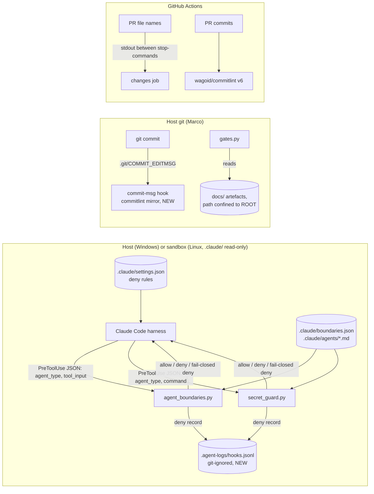

<!-- gate: G3 | verdict: PASS-WITH-NOTES | issue: #39 -->
# Threat delta: hardening the Claude Code hooks and gate checker (issue #39)

- Scope: development tooling only, not the Decisya application. Branch `issue/39-harden-hooks`. The ten items in the issue body: FU-5 and FU-6 from `docs/security/reviews/35.md` (T-06, T-07, T-14, T-18, N-01 residual, N-02 to N-05), plus local commitlint. The parse-based sandbox lint (O-1) is out of scope and moves to #52.
- Mode: threat delta, done **before** implementation. The "Requirements for G4" section is the design input. G6 checks each requirement against the diff.
- Baseline: `docs/security/threat-models/claude-config.md` (T-xx ids) and review 35 (N-xx ids). New threats in this delta use H-xx ids.
- Change class: ci-tooling. No application trust boundary changes. ASVS 5.0 is mapped **by analogy** at section level, as in the baseline: V1.2 injection prevention, V2.2 input validation, V8.2 general authorization design, V13.3 secret management, V13.4 unintended information leakage, V15.2 dependencies, V15.3 defensive coding, V16.2 general logging, V16.3 security events, V16.4 log protection. Check the numbers against the official 5.0 text before copying them into a compliance artefact.
- Reviewer: security-reviewer agent, 2026-09-25.

## Verdict

PASS-WITH-NOTES. No High. Every item in the issue lowers risk. The changes add some new, moderate risk, and each new risk below gets a requirement:
- a fail-closed hook can lock out legitimate agent work (H-01);
- the audit log is a new data store (H-03, H-04);
- argument-mention exemptions in the secret guard add bypass surface (H-06);
- the local commitlint copy can drift from CI's rules (H-09).

Three items need a design change before G4 (see "Recommended changes to the item list"):
- item 7: the log cannot live under `.claude/`, because that directory is read-only in the sandbox;
- items 4 and 5: `tools:` patterns may not be enforced (T-02), so the narrowing must also go into `settings.json` deny rules, and .NET 10 has the noun-first `dotnet package add`;
- item 10: CI's rule set is wider than the five rules listed.

Notes that stay open after this issue: the hooks remain guardrails, not a boundary (T-01, T-02, T-04 residual). A hook that cannot start still fails open (H-02). The audit log can be tampered with (H-04).

## Evidence (2026-09-25, code reading plus probes)

- Code read: `.claude/hooks/agent_boundaries.py`, `.claude/hooks/secret_guard.py`, `.claude/boundaries.json`, `.claude/settings.json`, `.claude/scripts/gates.py`, `.claude/scripts/lint.py` (agents ↔ boundaries check at lines 225-229), the `tools:` lines in `.claude/agents/*.md`, the `ci.yml` `changes` job (line 41 prints PR file names), `.pre-commit-config.yaml`, `.devcontainer/compose.yaml`, and `.devcontainer/managed-settings.json`.
- The sandbox bind-mounts `.claude/` **read-only** (`compose.yaml:84-87`). The repository root is read-write. This decides where the audit log can go (H-03).
- I built the payloads at run time and piped them to the current `secret_guard.py`. These are **allowed today**:
  - N-01 residuals, re-confirmed: backslash continuation into a `gh … <<'Q'` line, and `echo "; gh pr view 1 <<"Q"` followed by a read of the name.
  - N-02 forms, re-confirmed: ``cat `echo <name>` ``, `gc ('.e'+'nv')`, and `<name>.example.bak`.
  - **New near-literal forms** (added to N-02 here): `cat <name>.` (on Windows, a trailing dot resolves to the same file), `cat <name>::$DATA` (the NTFS default stream), `cat <name>~`, and `docker compose convert` (a Compose v2 alias of `config`).
- Existing gate artefacts (`docs/security/reviews/35.md`, `36.md`, `41.md` and the three threat models) already put the verdict on line 1 with no BOM. The first-line rule in item 6 does not break them. `reviews/0.04.md` has no verdict line, but it predates the gate checker and is not re-checked.
- The runbook (`docs/runbooks/issue-pipeline.md:14`) already installs the `commit-msg` hook type. `.pre-commit-config.yaml` has no `default_install_hook_types`.

## Data flow and trust boundaries (delta)

Trust boundaries touched: TB2 (main session ↔ subagents: items 1-5), TB3 (agents ↔ local secrets: items 1 and 9), TB5 (PR content ↔ CI runner: item 8), and one new store, the hook audit log (item 7). Gate integrity (item 6) and local commitlint (item 10) are integrity checks against mistakes, not boundaries.

## Threats

Existing ids are re-rated after the fix. New ones are H-xx.

| Id | Element / flow | STRIDE | Threat | Severity | Mitigation | ASVS 5.0 id | Status |
| --- | --- | --- | --- | --- | --- | --- | --- |
| T-06 | Hooks on error | T, D | Both hooks exit 0 on any exception, so the tool call goes ahead with the hook silently off. | Low | Item 1: fail closed for listed agents (G4-39-01 to 05). | V15.3 | Mitigated by #39 |
| T-07 / T-14 | `agent_type` routing, `lint.py` | S, E | An agent file with no boundaries entry is unrestricted. The lint checks only boundaries → agents. `agent_type` is the frontmatter `name`, not the file stem. | Low | Item 2 (G4-39-06, 07). Built-in and user-level agents stay unrestricted (accepted, per the issue scope). | V8.2 | Mitigated by #39; built-ins accepted |
| T-18 | Hook decisions | R | No local trail of denies. | Low | Item 7 (G4-39-24 to 32). | V16.3 | Mitigated by #39 |
| T-14 (ci) | `changes` job stdout | T | A PR file name that starts with `::` is read as a workflow command. | Low | Item 8 (G4-39-33, 34). | V1.2 | Mitigated by #39 |
| N-01 residual | Heredoc exemption | I | Backslash continuation, and a `gh … <<X` that sits inside a comment or a quoted string, still get the exemption. | Low | Item 9 (G4-39-35 to 38). | V13.3, V1.2 | Mitigated by #39 |
| N-02 (+ 4 new) | Name matching | I | Near-literal names are missed: backtick, braces, `.\env`, `."env"`, `.[e]nv`, `.?nv`, `docker-compose config`, `docker compose -f x config`, `'*env'`, PowerShell concatenation, `.env.example.bak`. New in this review: `.env.`, `.env::$DATA`, `.env~`, `docker compose convert`. | Low | Item 9 (G4-39-39 to 42). | V13.3 | Mitigated by #39 |
| N-03 | False positives | D (usability) | Commit messages and searches that only mention the names are blocked. People then get used to working around the guard. | Info | Item 9 (G4-39-43 to 46). | V13.3 | Mitigated by #39 |
| N-04 | Permission patterns | E | `git diff/log --output` writes files without a prompt. `gh issue *` / `gh run *` are too broad. `Bash(dotnet *)` includes package fetches. | Low | Items 3-5 (G4-39-08 to 16). | V8.2, V15.2 | Mitigated by #39 |
| N-05 | `gates.py` parsing | T, R | A fenced BLOCK is ignored next to a PASS. Indented verdicts count. A BOM gives NO VERDICT. Absolute or `..` artefact paths are read. | Low | Item 6 (G4-39-17 to 23). | V16.3, V2.2 | Mitigated by #39 |
| H-01 | Fail-closed hooks (new) | D | A corrupt `boundaries.json`, a hook bug, or an over-broad fail-closed branch denies every Write or Bash call for all nine project agents. That stalls the pipeline, and in a headless sandbox run nobody sees it. | Medium | The main session stays fail-open and can fix things. Lint validates the `boundaries.json` schema in pre-commit and CI. The deny reason names the error and the fix. Every fail-closed branch has a unit test. `.claude/` is read-only in the sandbox, so an agent there cannot corrupt the config (G4-39-01 to 05, 07). | V15.3, V16.5 | Mitigated by requirements |
| H-02 | Hook cannot start (residual of T-06) | T | Python is missing, the Windows Store stub runs, or the 10 s timeout hits. The harness treats all of these as a non-blocking error, so the call proceeds for every session. A pathological command (for example a regex that backtracks on a huge input) can cause the timeout on purpose. | Low | Linear regexes, and a size cap that fails closed for listed agents (G4-39-05, 47). `$CLAUDE_PROJECT_DIR` in the hook command (G4-39-04, SHOULD). Accepted residual: a hook that cannot start is outside the script's control. The sandbox image pins Python. | V15.3 | Partially mitigated; residual accepted |
| H-03 | Audit log as a data store (new) | I | The log becomes a second copy of sensitive data: command text with secret values or names, absolute paths with user names, file names. It could also be committed by accident or grow without bound. | Medium | Fixed schema with no command text, repository-relative paths only, git-ignored, size-capped rotation, and a canary test (G4-39-24 to 31). | V16.2, V16.4, V13.4 | Mitigated by requirements |
| H-04 | Audit log integrity | R, T | Any agent with Bash can edit or delete the log (T-01). Crafted field values could inject fake records. | Low | JSON encoding per record (no raw newlines) and field length caps (G4-39-27). Accepted: the log is a local diagnostic trail, not tamper-evident. The transcript and Marco's review remain the record. | V16.4 | Partially mitigated; residual accepted |
| H-05 | Audit write failure changes a decision | T, D | In the sandbox, `.claude/` is read-only. If a failed log write fell into the item 1 error path, every listed agent would be denied (lockout). If it fell into the main session's fail-open path, denies could flip to allow. | Medium | A logging error is caught separately and never changes the decision (G4-39-29). The log location is writable on host and sandbox (G4-39-24). | V15.3, V16.2 | Mitigated by requirements |
| H-06 | N-03 argument-mention exemptions (new) | I | Removing option values before matching (`-m`, `--grep`, grep patterns) opens new bypasses: `grep -f .env`, `git commit -F .env`, `--grep="$(cat .env)"`, `gh … --body-file .env`, `git log --grep=x -- .env`, and compound commands. | Medium | The exemption applies only to a single simple command, only to listed text options with values free of `$` and `` ` ``, and never to file-valued options or positional paths. Every listed bypass is a must-block fixture (G4-39-43 to 46). | V13.3, V1.2 | Mitigated by requirements |
| H-07 | Normalised matching (new) | D (usability) | Matching a de-obfuscated copy of the command (quotes and backslashes removed, `[e]` → `e`, literal concatenation joined) can raise new false positives. | Low | Deny when either the raw or the normalised view matches. The leading-boundary rule still stops `process.env` and `import.meta.env` from matching. A must-allow fixture set is kept (G4-39-41, 46). | V13.3 | Mitigated by requirements |
| H-08 | New settings deny rules bind the main session too | D (usability) | Deny rules for `git … --output`, `dotnet package add` and similar also block Marco's main session, which cannot then run those commands even after a prompt. | Low | Accepted: Marco runs them himself in a terminal. Record this in the runbook (G4-39-16). | V8.2 | Accepted |
| H-09 | Local commitlint mirror drift (new) | T (integrity) | The Python copy differs from CI (commitlint 19 through wagoid v6). Too loose, and the history rewrites seen in #40 and #45 come back. Too strict, and valid commits are rejected. `git commit --no-verify` skips the hook. | Low | Golden fixtures generated by the real commitlint, the full config-conventional rule set, and CI stays authoritative (G4-39-48 to 56). `--no-verify` is accepted. | V15.2 | Mitigated by requirements; bypass accepted |
| H-10 | `::stop-commands::` token | T | If the resume token is predictable or derived from PR content, a file named `::<token>::` turns command processing back on inside the list. | Low | Random token per run, not printed elsewhere (G4-39-33). | V1.2 | Mitigated by requirements |
| H-11 | `gates.py` stricter parsing (new) | D | The line-1 rule rejects an otherwise valid artefact that has a BOM or a heading before the verdict. | Low | Strip the BOM, then use the exact line 1. Error messages say how to fix it. Existing artefacts already comply (Evidence). | V16.5 | Mitigated by requirements |

## Requirements for G4

MUST unless marked SHOULD. "Listed agent" means a non-empty `agent_type` that is a key in `boundaries.json` `agents`. Each requirement needs a red test (fails on the current code or config) and a green test (passes after the fix), recorded in the manifest's G4 evidence. Tests are unit tests for the Python scripts (for example `.claude/tests/`, run with `python -m unittest`), plus a documented live probe where only the harness can show the effect (G4-39-10, 13, 16). Tests must never read a real `.env` or `secrets.json`, and must build forbidden names at run time.

### Item 1: fail closed for listed agents (T-06, H-01, H-02)

- **G4-39-01 (decision on error).** Both hooks parse stdin first, using only the standard library.
  - Stdin is not JSON or not an object: exit 0 with one stderr line, no decision (fail open). The agent is unknown here. Accepted residual, because the harness produces the payload.
  - Payload parsed, `agent_type` absent or empty (the main session): behaviour unchanged. Any error still fails open.
  - Payload parsed, `agent_type` is a listed agent, and any later step raises: emit `permissionDecision: "deny"` with exit 0. This covers loading or validating `boundaries.json`, importing a shared helper, a non-string or missing `file_path`/`notebook_path`/`command`, a regex error, and any other exception.
  - Payload parsed, `agent_type` is non-empty but not listed (built-in, user-level or plugin agent): behaviour unchanged.
  - Use the JSON deny, not exit 2, so the agent gets a readable reason and the session continues. Exit 2 with a short stderr is only the fallback when writing the JSON itself fails.
- **G4-39-02 (listed set when the config is broken).** When `boundaries.json` cannot be read, is invalid JSON, or fails the schema in G4-39-07, the listed set falls back to the frontmatter `name:` values of `.claude/agents/*.md`. Item 2 keeps the two sets equal. If neither source can be read, deny every non-empty `agent_type`. This is the only case where built-ins are affected, and the main session stays fail-open.
- **G4-39-03 (deny reason content).** Use this reason exactly, filling in the hook name and the exception class name only: `<hook> error (fail closed for <agent>): <ExceptionClass>. The main session can repair .claude/boundaries.json or the hook; run python .claude/scripts/lint.py.` Never put the command text, the file content, or the exception message in the reason, because the message can quote the command. The full exception goes to stderr only, and even there never the command text.
- **G4-39-04 (SHOULD, T-06b).** Use `"$CLAUDE_PROJECT_DIR"/.claude/hooks/<hook>.py` in the `settings.json` hook commands. Verify it with a live probe on the Windows host (Git Bash) **and** in the sandbox before committing. A wrong path makes Python exit 2, which blocks **every** session, the main one included. If either probe fails, keep the relative path and record why.
- **G4-39-05 (bounded input).** For a listed agent, a `command` longer than 256 KiB, or a `file_path` longer than 4 KiB, is denied as "too long to check" (fail closed). For the main session, the same input is scanned normally. Test: a 1 MiB command is checked in under 1 s on the host.

### Item 2: lint agents ↔ boundaries both ways (T-07, T-14)

- **G4-39-06.** `lint.py` fails (with the file and line) when:
  - any `.claude/agents/*.md` has a frontmatter `name` that is not a `boundaries.json` `agents` key;
  - any key has no agent whose frontmatter `name` equals it;
  - an agent's frontmatter `name` differs from its file stem.

  Compare against `name`, because that is what the harness sends as `agent_type`. An agent that must never write gets an explicit empty list `[]`, never an omitted entry. Red fixtures: one agent without an entry, one entry without an agent, one name/stem mismatch.
- **G4-39-07 (schema).** `lint.py` validates the shape of `boundaries.json`:
  - top-level keys are only `$comment`, `deny` and `agents`;
  - `deny` is a list of non-empty strings;
  - `agents` is an object whose values are lists of non-empty, repository-relative strings (no leading `/` or `\`, no drive letter, no `..` segment).

  The hook applies the same validation at run time, and a failure there triggers G4-39-02.

### Item 3: deny `git diff/log --output` (N-04)

- **G4-39-08.** Add `settings.json` deny rules covering `--output` and its unambiguous long-option abbreviations. Git accepts unique prefixes, so `--outp=` works. The rule must not catch `--oneline`. For example: `Bash(git diff*--ou*)`, `Bash(git log*--ou*)`, `Bash(git show*--ou*)`. The last one matters only if `git show` is ever allow-listed. The rules must cover both `--output=x` and `--output x`.
- **G4-39-09.** Accepted false positive: `--output-indicator-*` is also denied. Record it in the runbook.
- **G4-39-10 (live probe).** The harness must actually apply a wildcard in the middle of a pattern. Show a live probe in the main session:
  - `git diff --output=<scratch>/x` is denied, and `git log --oneline -1` still runs without a prompt;
  - if mid-pattern wildcards are not honoured, move the check into a PreToolUse Bash hook: a `git (diff|log|show)` command token with an unquoted `--ou` option. Record which approach was used.

### Item 4: narrow devops `gh` (N-04)

- **G4-39-11.** In `devops.md`, replace `Bash(gh issue *)` with `Bash(gh issue view*)`, `Bash(gh issue list*)`, `Bash(gh issue status*)`, and replace `Bash(gh run *)` with `Bash(gh run view*)`, `Bash(gh run list*)`, `Bash(gh run watch*)`.
  - Do **not** grant `gh issue comment`, `edit`, `close`, `delete`, `transfer`, `develop`, `pin` or `lock`, or `gh run rerun`, `cancel`, `delete` or `download`.
  - `download` writes files that the boundaries hook cannot see. `comment` would let an agent under prompt injection publish data.
  - If devops needs `gh issue comment`, the PR body must justify it.
- **G4-39-12 (lint).** `lint.py` fails when any agent `tools:` entry grants a `gh` or `dotnet` command group with a wildcard in the verb position, for example `Bash(gh issue *)`, `Bash(gh run *)`, `Bash(gh *)` or `Bash(dotnet *)`. Verbs must be explicit.
- **G4-39-13 (because of T-02).** `tools:` patterns may not restrict subagents, so also add `settings.json` deny rules for the destructive subset: `Bash(gh issue delete*)`, `Bash(gh issue transfer*)`, `Bash(gh run delete*)`, `Bash(gh repo delete*)`, `Bash(gh secret*)`. Show a live probe that one of them is denied.

### Item 5: `dotnet` package fetching (N-04)

- **G4-39-14.** In `backend-dev.md` and `devops.md`, replace `Bash(dotnet *)` with explicit verbs: `dotnet build*`, `dotnet test*`, `dotnet format*`, `dotnet restore*`, `dotnet run*`, `dotnet ef*`, `dotnet tool restore*`, `dotnet list*`, `dotnet sln*`, `dotnet new list*`, `dotnet --version*`, `dotnet --info*`, and add only what the lane needs. With central package management, a new package is a `Directory.Packages.props` plus `.csproj` edit, which the diff and G6 review. It is never a CLI fetch.
- **G4-39-15.** Do not grant any of these forms: `dotnet add … package`, the .NET 10 noun-first `dotnet package add` / `dotnet package update`, `dotnet new install`, `dotnet tool install` / `dotnet tool update`, `dotnet workload install` / `dotnet workload update` / `dotnet workload restore`, and `dotnet nuget add source`.
- **G4-39-16.** Add `settings.json` deny rules for the forms in G4-39-15, using the same approach as G4-39-10: `Bash(dotnet add*package*)`, `Bash(dotnet package add*)`, `Bash(dotnet new install*)`, `Bash(dotnet tool install*)`, `Bash(dotnet workload install*)`, `Bash(dotnet nuget add*)`. Show one live probe. Add a runbook line saying these, and the item 3 rules, also bind the main session: Marco runs them in his own terminal (H-08).

### Item 6: gate checker edge cases (N-05, H-11)

- **G4-39-17 (BOM).** Read artefacts and the manifest with `encoding="utf-8-sig"`, so a leading BOM is removed.
- **G4-39-18 (line 1).** The verdict is taken **only** from physical line 1 after BOM removal.
  - After stripping trailing whitespace and `\r`, line 1 must fully match the verdict comment (`fullmatch`). Leading whitespace is not allowed, so an indented or code-block line 1 fails.
  - A missing or non-matching line 1 fails as `NO VERDICT: line 1 of <artifact> must be the gate comment`.
- **G4-39-19 (no competing line).** The gate fails as `AMBIGUOUS` when any other line in the file contains a complete verdict comment for the **same gate and the same issue number**. This applies whether the line is fenced, indented, quoted or mid-sentence. Examples in artefacts must use placeholders (`#<n>`) or another gate or issue. This closes "fenced BLOCK beside own-line PASS" in both directions.
- **G4-39-20 (verdict values).** Only `PASS`, `PASS-WITH-NOTES`, `N/A` (with `reason:`) and `BLOCK` are recognised. Any other token fails with its own message.
- **G4-39-21 (path confinement).** The manifest artefact path must be relative and POSIX-style, with no drive letter, no leading `/` or `\`, no `\`, and no `..` segment. `(ROOT / artifact).resolve()` must be inside `ROOT.resolve()`, which also rejects a symlink that points outside, and must be a regular file. Violations fail as `INVALID PATH` without reading the file. Red fixtures: an absolute scratchpad path, `../x.md`, `docs/../../x.md`, and `C:/x.md`.
- **G4-39-22 (SHOULD).** Agent-gate artefacts must lie under the owner agent's `boundaries.json` globs: G3 and G6 under `docs/security/**`, G1 under `docs/requirements/**`, and so on. Then an artefact another lane could write cannot carry a gate.
- **G4-39-23.** The red fixtures from review 35's N-05 probes pass as tests: `block-hidden-in-fence-then-pass`, `indented-pass-only`, `bom-first-line` (now passes when line 1 is valid), plus the path cases above.

### Item 7: hook audit log (T-18, H-03, H-04, H-05)

- **G4-39-24 (location).** One file, `<repo>/.agent-logs/hooks.jsonl`, or another repository-root directory that meets these conditions:
  - it is **not** under `.claude/`, which is read-only in the sandbox;
  - it resolves to the same place on the host and in the sandbox;
  - it is in `.gitignore`.

  The path is computed from the hook's own location (`Path(__file__)`), never from the payload's `cwd` or an environment variable that the payload could influence. Create the directory on first write.
- **G4-39-25 (what is recorded).** Record every `deny` and every fail-closed deny. SHOULD: also record fail-open errors from the main session as `error-allow`. Allow decisions are not recorded.
- **G4-39-26 (fields, allow-list).** Each record has exactly these fields:
  - `ts`: UTC, RFC 3339, from `datetime.now(timezone.utc)`. This is tooling, so NodaTime does not apply.
  - `hook`: `agent_boundaries` or `secret_guard`.
  - `agent`: the `agent_type` value, or `main`.
  - `tool`: the `tool_name` value.
  - `decision`: one of `deny`, `deny-error` or `allow-error`.
  - `rule`: a fixed id, for example `boundary.outside-repo`, `boundary.shared-deny`, `boundary.not-in-lane`, `secret.dotenv`, `secret.user-secrets`, `secret.compose-config`, `input.too-long`, or `error.<ExceptionClass>`.
  - `path`: for `agent_boundaries` only. The repository-relative POSIX path, or the literal `<outside-repo>`, never the absolute path.
  - `session_id` and `tool_use_id`: from the payload.

  **Never record** the command text, any part, hash or length bucket of the command, the matched substring, the exception message, `transcript_path`, `cwd`, or file contents. The rule id alone says which name family matched, without quoting it.
- **G4-39-27 (encoding and caps).** Write one `json.dumps(record, ensure_ascii=True)` line per record, so newlines and control characters are escaped and fake records cannot be injected. Truncate every string field to 256 characters before encoding. Use a single append write (`open(…, "a")`).
- **G4-39-28 (rotation).** Before appending, if the file is larger than 1 MiB, replace `hooks.jsonl.1` with it and start a new file. Keep one generation. Rotation is best effort: a race between parallel agents may lose a record, which is acceptable.
- **G4-39-29 (isolation from the decision).** The logging call is wrapped in its own `try/except` and runs **after** the decision is computed. Any logging error, such as a read-only file system, permissions or disk full, prints one stderr line and never changes the decision, never triggers G4-39-01's fail-closed path, and never turns a deny into an allow. Test: make the log path unwritable, then check that the deny is still emitted and the exit code is 0.
- **G4-39-30 (canary test).** Run `secret_guard` on a command that contains the forbidden name plus a unique canary token, both built at run time. The test asserts that the deny happened and that neither the canary nor the name appears anywhere in the log file.
- **G4-39-31 (git-ignored).** Add the path to `.gitignore`. Test: `git check-ignore -q .agent-logs/hooks.jsonl` exits 0. Record the red run before the `.gitignore` line exists.
- **G4-39-32 (SHOULD).** Add one runbook line saying the log is a local diagnostic trail, that agents with Bash can alter it (H-04), and where it lives on the host after a sandbox run. `host-review.py` may print the deny count since the session started. That change is optional and belongs to `.devcontainer/**`, so if it is done it needs a note in the manifest.

### Item 8: `changes` job (T-14, H-10)

- **G4-39-33.** Before printing the file list, generate a random token per run from a CSPRNG, for example `token=$(openssl rand -hex 16)` or `$(cat /proc/sys/kernel/random/uuid)`. Then:
  - run `echo "::stop-commands::$token"`, print the list, and run `echo "::$token::"`;
  - the token must not be derived from any PR or event data, and is not printed anywhere else;
  - nothing between the two echo lines may write to `$GITHUB_OUTPUT` or `$GITHUB_ENV`. The `echo … >> "$GITHUB_OUTPUT"` lines stay after the resume.
- **G4-39-34.** Test: a local `act`-style run or a bash unit test with a fake list that contains a line `::warning::pwned`. Show that the output wraps it between the stop and resume lines. `actionlint` stays green.

### Item 9: secret guard (N-01 residual, N-02, N-03, H-06, H-07)

Keep it a guardrail. Write a small **quote-state scanner** (about 40 lines), not a shell parser. It classifies each character of the command as unquoted code, single-quoted, double-quoted or comment. Bash treats `#` as a comment only at the start of a word in unquoted code, and a `\` + newline in unquoted code is a continuation. Everything below uses this one helper.

- **G4-39-35 (join continuations).** Before any other analysis, remove every unquoted `\` + newline, as bash does. Test: `python3 - \` + newline + `gh pr view 1 <<'Q'` + body with the name must be denied. Do the same with `bash -s \`.
- **G4-39-36 (exempt heredoc: all must hold).** A heredoc body is exempt only if all of these hold:
  1. The `<<` (not `<<<`) is in unquoted code, and nothing on that line before it is a comment.
  2. The owning command is `git [-c k=v]… commit` or `gh`, and it starts at the start of the line, or after an unquoted `;`, `&&` or `||` that follows only `cd <path>` with no metacharacters.
  3. Between the command word and `<<`, there is no unquoted `;`, `&`, `|`, `<`, `>`, `$(` or `` ` ``.
  4. The line has exactly one `<<`.
  5. The delimiter is a fully quoted word (`<<'EOF'`, `<<"EOF"`). *Amended 2026-09-25 at G6 (review 39, G6-39-02): the original text also allowed a plain `<<EOF`, but with an unquoted delimiter bash runs `$(…)` and backticks inside the body, so that body is code, not data.*

  Scanning resumes after the terminator line. The terminator check may stay more lenient than bash (`strip()` compare), because that only ends the exemption earlier.
- **G4-39-37 (must-deny fixtures, N-01).** All four direct forms from review 35 N-01, the two continuation forms, `echo hi # ; gh pr view 1 <<X` + body, `echo "; gh pr view 1 <<"X"` + body, the single-quoted variant, `gh … <<X | bash`, and a read of the name after the terminator.
- **G4-39-38 (must-allow fixtures).** A commit-message heredoc and a `gh pr create --title "feat: x" --body-file - <<'EOF'` heredoc whose body mentions the names (balanced quotes before `<<` are allowed). Also `git -c user.name=x commit -F - <<'EOF'` and `cd /repo && git commit -F - <<'EOF'`.
- **G4-39-39 (boundary sets).** Add `` ` ``, `{`, `(` and `,` to the leading set. Add `` ` ``, `,`, `}`, `]`, `:`, `.`, `~` and `+` to the trailing set.
  - The leading set must still require a non-word character before `.`, so `process.env`, `import.meta.env` and `os.environ` never match.
  - `.env.example` is exempt only as the whole name: `(?!example(?=$|[boundary]))`. `.env.example.bak` and `.env.examples` are denied, and `.env.EXAMPLE` stays allowed (case-insensitive file system).
- **G4-39-40 (new near-literal patterns).**
  - `docker[- ]compose\b[^\n;&|]*\b(?:config|convert)\b`.
  - A single-character glob or class inside the name: `\.(?:e|\?|\[[^\]\n]{1,8}\])(?:n|\?|\[[^\]\n]{1,8}\])(?:v|\?|\[[^\]\n]{1,8}\])`.
  - `\*\.?env\b`, plus the existing `.e*` and `.en*` forms.
  - `secrets\.(?:j|\?|\*|\[)` for `secrets.json`.
- **G4-39-41 (normalised view).** Also match against a normalised copy: first join literal concatenations (`'…'\s*\+\s*'…'`, the same with `"`, which covers PowerShell, Python and JS), then delete `'`, `"` and `\`, and replace a one-letter class `[x]` with `x`. Deny if the raw **or** the normalised copy matches. Must-deny fixtures: every N-02 form from review 35, the four new ones in Evidence, `python -c "open('.'+'env')"`, and `cat .e""nv`.
- **G4-39-42 (accepted residual, write it in the hook docstring).** These stay out of scope, and the sandbox's "no secrets mounted" is the boundary:
  - names built at run time (`$(printf '.%s' env)`, `a=.e; cat ${a}nv`, `chr(46)`, base64);
  - recursive readers that never name the file (`grep -r X .`, `find . -type f -exec cat {} +`);
  - a script the agent writes and then runs (T-01);
  - indirect disclosure through process or container environments (`printenv`, `docker inspect`, `/proc/*/environ`; the sandbox denies the last one through managed settings);
  - `ls $APPDATA/…`.
- **G4-39-43 (N-03, where mentions may be removed).** Remove option values before matching only when **all** of these hold:
  1. After the continuation join, the command is a single simple command: no unquoted `;`, `&`, `|`, `<`, `>`, `$(`, `` ` `` or newline outside an exempt heredoc.
  2. The program is one of `git log`, `git show`, `git commit`, `gh issue|pr create|comment|edit`, `grep`, `rg` or `git grep`.
  3. The option is a **text** option: `--grep`, `-S`, `-G` and `--author` for `git log`/`git show`; `-m` and `--message` for `git commit`; `--title`, `--body` and `-t`/`-b` for `gh`; for `grep`, `rg` and `git grep`, the `-e`/`--regexp` values or, when there is no `-e`, the first positional (the pattern).
  4. The value contains no `$` and no `` ` `` (checked on the raw token).

  Everything else (other options, positional paths, anything after `--`) is still scanned. Tokenising with `shlex.split` is fine once condition 1 holds.
- **G4-39-44 (never exempt).** File-valued options are always scanned: `grep`/`rg` `-f`/`--file`, `git commit -F`/`--file`, `gh --body-file`/`-F`, and `--template`.
- **G4-39-45 (must-deny fixtures, H-06).**
  - `grep -f <name> x`, `rg -e x <name>`, `grep -rn '\.env' <name>`;
  - `git commit -F <name>`, `git commit -m "$(cat <name>)"`, `git commit -m x; cat <name>`;
  - `git log --grep=x -- <name>`, `git log --grep="$(cat <name>)"`;
  - `gh issue create --body-file <name>`, `gh pr comment 1 --body "$(cat <name>)"`.
- **G4-39-46 (must-allow fixtures, N-03, H-07).**
  - `git log --grep=UserSecrets`, `git log -S'.env' --oneline`;
  - `git commit -m 'docs: explain secrets.json'`;
  - `grep -rn "\.env" docs`, `rg -n 'user-secrets' docs .claude`;
  - `gh issue comment 39 --body 'rotate the .env values'`;
  - `cat .env.example`, `git diff -- .env.example`, `grep -rn process.env src/Decisya.Web`.

  Record in `docs/runbooks/issue-pipeline.md` the false positives that remain (`ls .env`, `test -f .env`, `git check-ignore .env`, `echo .env`) and the workaround: the main session or Marco runs them.
- **G4-39-47 (performance).** All regexes are linear: no nested quantifiers over overlapping classes, and classes bounded as in G4-39-40. Test: the must-deny and must-allow suites plus a 256 KiB random command finish in under 1 s in total.

### Item 10: local commitlint (H-09)

CI runs `wagoid/commitlint-github-action@v6` and the repository has no commitlint config file. Per the action's documented fallback, it then uses `@commitlint/config-conventional`, commitlint 19.x. G4 records the version from the v6 tag's lockfile. The local check must mirror the **whole** rule set, not only the five rules in the issue.

- **G4-39-48 (rule set, errors: exit 1).**
  - `header-max-length` 100;
  - `header-trim`;
  - `subject-case` never `sentence-case, start-case, pascal-case, upper-case`;
  - `subject-empty` never;
  - `subject-full-stop` never `.`;
  - `type-case` lower-case;
  - `type-empty` never;
  - `type-enum` `[build, chore, ci, docs, feat, fix, perf, refactor, revert, style, test]`;
  - `body-max-line-length` 100;
  - `footer-max-line-length` 100.
- **G4-39-49 (warnings: exit 0).** `body-leading-blank` and `footer-leading-blank`. wagoid v6 defaults to `failOnWarnings: false`.
- **G4-39-50 (messages, byte-for-byte).** Mirror commitlint's formatter output: `⧗   input: <header>`, then one line per problem, `✖   <message> [<rule>]` or `⚠   <message> [<rule>]`, then `✖   found <e> problems, <w> warnings` and `ⓘ   Get help: https://github.com/conventional-changelog/commitlint/#what-is-commitlint`. Take each rule's message text from commitlint 19. For example:
  - `header must not be longer than 100 characters, current length is <n>`;
  - `subject must not be sentence-case, start-case, pascal-case, upper-case`;
  - `body's lines must not be longer than 100 characters`;
  - `footer's lines must not be longer than 100 characters`;
  - `type must be one of [build, chore, ci, docs, feat, fix, perf, refactor, revert, style, test]`.
- **G4-39-51 (golden fixtures, not memory).** Once, on the host or in a CI job with Node, run the real commitlint 19 (the wagoid v6 version) with config-conventional over a committed fixture set, and commit its output as golden files. The Python tests compare against them. For errors, the rule ids and messages must match exactly. The fixtures include at least:
  - a header of 101 characters, and one of exactly 100;
  - `feat: G6 review`, `feat: Add x`, `feat: ADD X`, `feat: add G6 review`, and a subject that starts with a digit and one that starts with a backtick-quoted word;
  - `Feat: x`, `feat x` (no colon), `feat: x.`, and `wip: x`;
  - a body line of 101 characters, and a URL-only body line of 120 characters, so the golden output settles URL handling;
  - a `Closes #39` footer with and without a blank line before it;
  - `Co-Authored-By:` trailers, and a `BREAKING CHANGE:` footer;
  - a header containing a non-BMP character. Length counts **UTF-16 code units**, as in JS: `len(s.encode("utf-16-le")) // 2`.
- **G4-39-52 (port, don't reinvent).** Port the header parsing from `conventional-changelog-conventionalcommits` (header pattern `^(\w*)(?:\((.*)\))?!?: (.*)$`, with notes and references deciding where the footer starts). Port `subject-case` from `@commitlint/ensure` `case`, which removes quoted and backtick spans before comparing. Where a port is unclear, the golden fixtures decide.
- **G4-39-53 (message pre-processing).** Before linting, apply git's default `strip` cleanup to the message file: drop lines that start with `core.commentChar` (default `#`), drop everything from the scissors line (`# ------------------------ >8 ------------------------`) on, and trim trailing blank lines. Skip messages that commitlint's default `is-ignored` list skips: merge, revert, `fixup!`/`squash!`/`amend!`, `Automatic merge`, and semver-only headers.
- **G4-39-54 (no dependencies, no execution).** Use only the Python standard library, no Node at run time. Read only the file path argument, with no network, no `subprocess`, and no evaluation of message content. Print the header only as shown in G4-39-50.
- **G4-39-55 (wiring).** Add a `repo: local` hook to `.pre-commit-config.yaml` (`language: system` or `python`, `stages: [commit-msg]`, entry `python <path>/commitlint.py`), and add `default_install_hook_types: [pre-commit, commit-msg]`. The script can live in `.claude/scripts/` or `scripts/`. Commits happen on the host, so the read-only `.claude/` in the sandbox does not matter. Keep `conventional-pre-commit`, or drop it with a PR-body note if the new hook fully covers it. Test (the issue's Done-when): with the hooks installed, `git commit --allow-empty -m "feat: G6 review"` and a 101-character header are both rejected with the golden text, and a valid message is accepted.
- **G4-39-56 (SHOULD).** A `--range <rev>..<rev>` mode that lints every commit on the branch, for use before push or in `host-review.py`. It catches amended or rebased commits made with `--no-verify`. Accepted: `--no-verify` skips the local hook, and CI remains authoritative.

### Cross-cutting

- **G4-39-57.** The new or changed hooks keep no secret, token or command text in any error message, log line or test output. Test fixtures build forbidden names at run time, so no file in the diff contains a real secret path in a form the guard should block. gitleaks stays green.
- **G4-39-58.** `python .claude/scripts/lint.py` is green, and the new tests run in the CI `claude-config` job. That job still runs PR-controlled scripts, which is T-11 and a known item for FU-2, not changed here.

## Recommended changes to the item list

1. **Item 7 (change):** the log location in T-18 (`.claude/logs/`) does not work in the sandbox, where `.claude/` is read-only. Use a git-ignored directory at the repository root (G4-39-24). Do not change `.devcontainer/compose.yaml` for it; that would reopen the sandbox threat model.
2. **Items 4 and 5 (change):** narrowing `tools:` alone may do nothing (T-02). Add the `settings.json` deny rules (G4-39-13, 16), and cover the .NET 10 `dotnet package add` form and `dotnet tool install` / `workload` / `nuget add`.
3. **Item 3 (widen):** cover long-option abbreviations (`--ou…`), and prove with a probe that the harness honours mid-pattern wildcards (G4-39-10).
4. **Item 10 (widen):** CI enforces ten error rules and two warnings, not five. Mirror all of them, derive the messages from real commitlint output, and add `default_install_hook_types` (G4-39-48 to 55).
5. **Item 9 (clarify):** the N-03 fix removes only **text** option values in single simple commands. Recursive search (`grep -r X .`) stays a residual, and the fix must not be widened into path arguments.
6. **Drop nothing.** T-07(b) (deny unknown `agent_type` other than named built-ins) stays out of scope, as the issue says. It is re-listed as a residual.

## Residual risk after #39

- The hooks remain guardrails. Bash can write anywhere in the working tree (T-01), and `tools:` patterns may not restrict subagents (T-02). The boundary is still the sandbox with no secrets mounted, plus Marco's `host-review.py` and diff review.
- A hook that cannot start (missing Python, timeout) fails open for everyone (H-02).
- Built-in, user-level and plugin agents are unrestricted by `boundaries.json` (T-07b).
- The audit log is not tamper-evident (H-04).
- `git commit --no-verify` skips the local commitlint. CI stays authoritative.
- T-11 (CI runs PR-controlled gate scripts) and T-09b (skip approvals are free text) are unchanged. They belong to FU-2 and FU-4.
