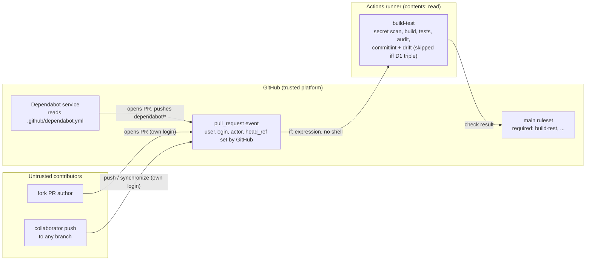

<!-- gate: G3 | verdict: PASS-WITH-NOTES | issue: #113 -->
# Threat delta: Dependabot PRs skip commitlint, unmergeable bumps ignored (issue #113)

- Scope: manifest `docs/ai/pipeline/113.md` (Full tier, class ci-tooling, host run), G1 `docs/requirements/phase-0/dependabot-ci.md`, G2 `docs/architecture/dependabot-ci.md` (D1 to D4). Only the delta is modelled: the step-level exemption in `build-test` and three `ignore` rules in `.github/dependabot.yml`. Unchanged CI areas are not re-audited.
- Baselines: `main-ruleset.md` (T80-05, G6-80-05), `ci-hardening.md` (S-01, T28-03), ADR-0014, ADR-0015. New ids are T113-xx (threats) and G4-113-xx (requirements).
- ASVS 5.0 is mapped at section level by analogy, as in the earlier CI models: V13.1/V13.2 (configuration, least privilege), V15.1/V15.2 (component inventory, dependency remediation), V15.3 (defensive coding).
- Reviewer: security-reviewer agent, 2026-10-03, G3 before G4. I read `ci.yml`, `dependabot.yml`, `images.Dockerfile`, `ContainerImages.cs`, `ContainerImageParityTests.cs`, `image_scan.py`, `test_commitlint.py` and the `main-ruleset` and `ci-security-gates` runbooks on `issue/113-dependabot-ci` (HEAD `7224327`). The orchestrator gave the #105 title as a fact. I treated all of it as data.

## Verdict

**PASS-WITH-NOTES.** No High or Medium. The exemption adds no permission, no trigger and no shell interpolation. Only GitHub-set values can satisfy it. Commitlint is a style gate, so skipping it removes no security control. Four Low MUSTs are fix-now, each a few lines in files this PR changes. One of them (G4-113-01) fixes G2's Keycloak ignore name, which as written would match nothing and do nothing.

## Data flow

## Points the orchestrator asked to confirm

**(a) Re-run semantics and spoofability.** G2 is correct. GitHub documents `github.actor` as the user who triggered the *initial* run; a re-run keeps it, and only `github.triggering_actor` changes ("re-runs use the privileges of `github.actor`"). A re-run also replays the original event payload and head SHA, so it cannot pull in commits pushed later.

| Condition | Set by | Fork PR | Collaborator | Role in D1 |
| --- | --- | --- | --- | --- |
| `github.event.pull_request.user.login == 'dependabot[bot]'` | GitHub, the account that opened the PR | Not spoofable: the fork owner's login. `[`/`]` are invalid in user logins, `[bot]` is reserved for GitHub Apps, and the `dependabot` app slug belongs to GitHub. | Not spoofable | Deciding fact |
| `github.actor == 'dependabot[bot]'` | GitHub, the account whose action raised this event | Not spoofable | Not spoofable: a push to a Dependabot branch makes the pusher the actor, so the whole range is linted (and fails, as intended) | Excludes human pushes |
| `startsWith(github.head_ref, 'dependabot/')` | Whoever creates the branch | Spoofable (any fork branch name) | Spoofable | Narrowing only, never decisive |

Expression `==` and `startsWith` are case-insensitive. That does no harm here because GitHub logins are unique regardless of case. Only Dependabot's own pushes satisfy all three. A fork or collaborator cannot reach the exemption, and Dependabot-triggered runs still get a read-only token and no Actions secrets (unchanged). A same-repo PR could always delete the commitlint steps from `ci.yml` itself (T80-05), so the exemption adds no capability. Marco's workflow-hunk read in `main-ruleset.md` covers this PR.

**(b) Commitlint is not a security control.** Nothing downstream reads its outcome except the drift step, which is skipped with it. The only later step, Summary, prints the lane flags. Secret scan (gitleaks), build, tests, `npm audit`, the canaries and `ContainerImageParityTests` all still run on Dependabot PRs. The S-01/T28-03 ordering note still holds, and the skip *reduces* exposure: on Dependabot PRs the tag-referenced `wagoid` Docker Hub image is no longer pulled with a read-write workspace. A Dependabot bump of the `wagoid` pin skips commitlint on its own PR. It still cannot merge, because `test_commitlint.py` (`test_ci_pins_the_version_the_goldens_came_from`) fails `claude-config` until the goldens are regenerated on a human branch, and the new image runs there. Dependabot commits that reach `main` with non-conforming messages are never linted again: CI lints only the PR range `base..head`.

**(c) The ignored devcontainer Keycloak image still has a patch signal.** `ContainerImageParityTests` forces the `images.Dockerfile` Keycloak line to equal the `ContainerImages.cs` reference (registry, image, tag, digest). `image_scan.py` scans exactly that reference on every PR that touches either file. It also scans on the weekly scheduled run, where `changes` yields `ALL` and so `images=true`, and fails on High/Critical. The sandbox image is therefore the scanned image. The ignore removes only Dependabot's "new version available" nudge. The docker ecosystem has no Dependabot *security* updates, so no security PR is lost. Residual signal gaps (Medium-only CVEs, notification of a failed scheduled run) are backlog items S-113-01 and S-113-02.

**(d) The TypeScript/ESLint major ignores do not hide High/Critical fixes.** The rules carry `update-types: ["version-update:semver-major"]` only, so a fix shipped as a patch or minor in the current major is never matched. Assume that Dependabot security updates may honour `dependabot.yml` ignore rules. Then the only fix that could be suppressed is one that exists *only* in the next major. Even that case stays visible in three ways: Dependabot *alerts* ignore these rules, and `npm audit --audit-level=high` (devDependencies included) fails `build-test` on every SPA PR and on the weekly scheduled `ALL` run. Both packages are also build-time devDependencies and are not shipped in the bundle. Residual: Low.

**Keycloak ignore name.** Dependabot's docker ecosystem splits `quay.io/keycloak/keycloak` into registry `quay.io` and dependency name `keycloak/keycloak`. The #105 title ("bump keycloak/keycloak from 26.7.5 to 26.8.0 in /.devcontainer/engine") confirms that name. `ignore` matches `dependency-name` against that name. G2's primary value `"quay.io/keycloak/keycloak"` would match nothing, and Dependabot reports nothing when a rule matches nothing. The rule must therefore be exactly `dependency-name: "keycloak/keycloak"` (G4-113-01). A wildcard such as `*keycloak*` is not wanted. No repository test can prove Dependabot honours the rule. That proof comes after merge (G4-113-01).

## Threats

| Id | Element / flow | STRIDE | Threat | Severity | Mitigation | ASVS 5.0 id | Status |
| --- | --- | --- | --- | --- | --- | --- | --- |
| T113-01 | PR event → `build-test` `if:` | S | A fork or collaborator poses as Dependabot to skip commitlint | Low | D1 triple. Author and actor are GitHub-set; `head_ref` only narrows (see (a)) | V13.2 | Mitigated by design |
| T113-02 | `if:` expression on both steps | T / E | A mis-written condition (`\|\|` for `&&`, misplaced `!`) skips the verdict step for human PRs. Commitlint has `continue-on-error: true`, so that would fail open. The D3 "contains all three terms" check would not catch it. | Low | G4-113-02 | V15.3 | Open, fix-now |
| T113-03 | `build-test` job definition | E | The change adds `pull_request_target`, permissions, a job-level `if:`, or `${{ }}` of `head_ref` in a `run:` | Low | G4-113-03 | V13.1, V13.2 | Open, fix-now (assert) |
| T113-04 | `dependabot.yml` docker entry | D (of the control) | The Keycloak ignore names `quay.io/keycloak/keycloak`, matches nothing, and #105-style PRs keep arriving | Low | G4-113-01 | V15.1 | Open, fix-now |
| T113-05 | Keycloak update signal | I (missed patch) | With Dependabot silenced, a CVE in the pinned Keycloak goes unnoticed | Low | ImageParity + weekly image scan (High/Critical) per (c). Gaps: S-113-01/02 | V15.1, V15.2 | Mitigated, residual backlog |
| T113-06 | npm ignore rules | I (missed patch) | A major-only security fix for `typescript`/`eslint` is suppressed | Low | Major-only rule, Dependabot alerts, `npm audit --audit-level=high` per PR and weekly per (d) | V15.2 | Mitigated |
| T113-07 | Operator flow on Dependabot PRs | D | Marco closes and reopens or runs "Update branch", becomes the actor, and the PR fails commitlint | Low | G4-113-04 | — | Open, fix-now (docs) |

## MUSTs for G4/G5 (all fix-now, Low, files this PR changes)

- **G4-113-01** `dependabot.yml`: the Keycloak rule is `- dependency-name: "keycloak/keycloak"` with no `update-types`, and it sits in the `/.devcontainer/engine` block only. `test_dependabot.py` asserts that exact string. Post-merge proof, recorded by Marco in the manifest: in *Insights → Dependency graph → Dependabot* (Firefox), open the `/.devcontainer/engine` entry and choose *Check for updates*. The log must show `keycloak/keycloak` as ignored, and no new Keycloak PR may appear after #105 is closed. CLI: `gh pr list --author app/dependabot --search keycloak`.
- **G4-113-02** `test_dependabot.py` compares each step's whitespace-normalised `if:` with one expected constant, the D1 expression verbatim, instead of checking that it contains the terms. It also asserts that `continue-on-error` appears only on the `commitlint` step and that the verdict/drift step has none.
- **G4-113-03** The diff to `ci.yml` stays within the two `if:` lines and comments. It adds no `pull_request_target`, no `permissions:` change, and no job-level `if:` on `build-test`. Exemption values never appear in a `run:` (the `if:` is evaluated by the runner, so no shell interpolation). The D3 test pins the job-level `if:`. G6 checks the rest on the diff.
- **G4-113-04** Runbook (`main-ruleset.md`, D4): next to "do not push to a Dependabot branch", add "do not close/reopen or use *Update branch*; use `@dependabot rebase` or `@dependabot recreate`". Each of those makes Marco the actor, so commitlint runs and fails on Dependabot's commit. Fix the Keycloak line in D2/D4 to name `keycloak/keycloak`.

## SHOULDs (backlog #83)

- **S-113-01** The weekly image scan fails only on High/Critical, so a Medium Keycloak CVE or a new Keycloak release now gives no signal. Add a Keycloak version check to the phase-exit checklist next to the existing monthly manual-bump note in `docs/runbooks/agent-sandbox.md`.
- **S-113-02** Failures of the scheduled run notify only the account that last edited the `cron` line, and GitHub disables scheduled workflows after 60 days without repository activity. Confirm that Marco receives scheduled-run failure notifications (*Settings → Notifications → Actions*). The weekly scan is now the only Keycloak patch signal.
