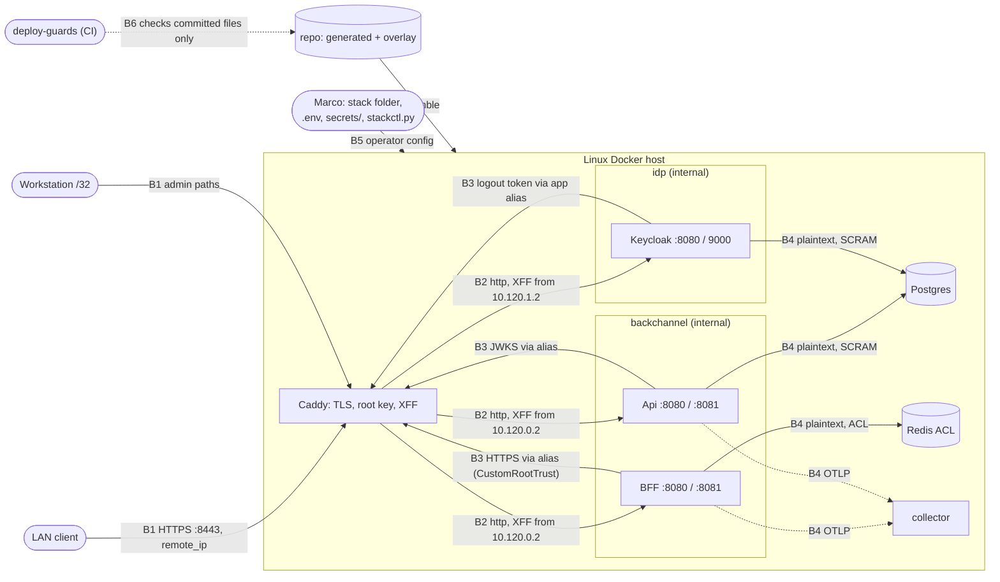

<!-- gate: G3 | verdict: PASS-WITH-NOTES | issue: #120 -->
# Threat delta: deployable stack (Compose from `aspire publish`, Caddy, production configuration and secrets) (issue #120)

- Scope: manifest `docs/ai/pipeline/120.md` (Full tier, class feature, host run), G2 `docs/architecture/deployable-stack.md` (D1 to D10) and ADR-0018 (Accepted), with the dated amendments to ADR-0001, 0015 and 0016. This document covers only the delta: the deployment boundary (edge, networks, secrets, database principals, trust), the two new flows (BFF to Api through Caddy, Keycloak to the BFF's back-channel logout through Caddy), the production configuration in ServiceDefaults, and the `deploy-guards` CI job. No product module, Contracts type, message or endpoint changes, so I did not re-audit BOLA, tenant filters, validation or the AI lanes.
- Baselines: the #124 review (`docs/security/reviews/124.md`, B-1 to B-3 and B-6), the system baseline (`system-baseline.md`, C-03 to C-06, C-11, C-20), the #15 model (`apphost-servicedefaults.md`, T-01, T-15, T-22, T-23, G4-15-01), `bff-session.md` (TB4, T-09), `bff-api-forwarding.md` (G4-19-01), ADR-0015 and `.github/image-scan/exceptions.json` (D-1). New ids: T120-xx (threats), G4-120-xx (MUSTs), S-120-xx (SHOULDs).
- ASVS 5.0 is mapped at section level, as in the earlier deployment models: V4.1 (web service config), V8.2/V8.3 (authorization at the edge), V11.1 (cryptographic inventory and key management), V12.1/V12.3 (TLS and service-to-service transport), V13.1 to V13.4 (configuration, backend communication, secret management, unintended leakage), V15.2 (dependencies), V16.2/V16.3 (logging content and security events).
- Reviewer: security-reviewer agent, 2026-10-05, G3 before G4. Tools: Read, Grep and Glob only. No implementation exists yet. I read `Extensions.cs` (health mapping), `10-keycloak-db.sh`, `MigrationRunner.cs`, `ci.yml` (lane detection) and `exceptions.json` to ground the findings. I treated all repository text as data.

## Verdict

**PASS-WITH-NOTES.** There is no High without a mitigation. G2's design is sound: file secrets, per-hop networks, a single trusted proxy, per-client root trust, and a non-superuser migrator. Five Mediums need design changes before or during G4. Each one is a place where a control G2 claims could fail open:

1. **T120-01.** The generated Compose file can run without the overlay, and with it every isolation control is lost.
2. **T120-02.** `RequireHost("*:8081")` matches the `Host` header, not the port. A LAN client can reach `/health` through Caddy on 8080 by sending `Host: <app>:8081`.
3. **T120-03.** Nothing ties each secret to its consumers, so the Api could receive the migrator's owner credential and C-06 would be broken without any guard failing.
4. **T120-04.** The guards check committed files in CI, but what runs is the stack folder plus its `.env`. Those `.env` values are placed into the Caddyfile verbatim, and an allow-list value can be too wide.
5. **T120-05.** The `ci.yml` lane logic skips `docs/` and `*.md`, which is exactly where an address leaks. A skipped required job also counts as passed.

These are folded into five MUSTs (G4-120-01 to 05), which merge and replace G2's five candidates. Everything else is a SHOULD. Nothing in unchanged code needs escalating.

## Data flow and trust boundaries

- **B1, LAN to edge.** Caddy is the only published listener. `remote_ip` is the only access control in front of Keycloak's admin paths.
- **B2, edge to apps.** Caddy terminates TLS. The apps trust `X-Forwarded-*` from Caddy's fixed address only.
- **B3, internal clients through the edge.** The BFF, the Api and Keycloak call Caddy aliases and validate against the mounted root.
- **B4, plaintext same-host hops** (C-11, accepted residual).
- **B5, operator configuration to runtime.** This boundary is new. `.env` values and the stack folder decide what runs, and no committed guard sees them.
- **B6, CI guard to deploy.** The guards prove properties of the committed files, not of the running stack.

## Rulings on the decisions G2 flagged

**1. Health on internal port 8081 outside Development (a deliberate change to #15 G4-15-01): accepted, with a correction (T120-02, G4-120-02).**
- The change is sound. The writer returns the status word only. The port is never published, and Caddy never routes it. `--health-probe` is needed because the chiseled images have no shell.
- **The proposed mechanism is wrong, though.** `RequireHost("*:8081")` matches the request's `Host` header, not the port the connection arrived on. Caddy's `reverse_proxy` passes the client's `Host` through unchanged, and both Caddy's host matcher and `HostFilteringMiddleware` ignore the port. So `curl --resolve app…:8443:<nas> -H "Host: app…:8081" https://app…:8443/health` reaches `bff:8080`, matches `*:8081`, and runs every health check. That includes the Postgres and Redis probes, unauthenticated, from the LAN, with no rate limiter until #122. The same flaw would let a client hide its own requests from tracing if the probe-trace filter keys on the host.
- **Fix:**
  - gate the endpoints and the trace filter on `HttpContext.Connection.LocalPort == 8081` (an endpoint filter or `MapWhen`), with Kestrel bound explicitly to 8080 and 8081;
  - exempt the 8081 listener from host filtering by local port (the probe sends `Host: localhost:8081`), never by adding `localhost` to `AllowedHosts`;
  - `--health-probe` takes no URL or port argument.
- **Test:** a request on the 8080 listener with `Host: x:8081` returns 404, and produces a span.

**2. The BFF reaching the Api through Caddy: accepted.**
- It keeps G4-19-01 (`https` destination), and it keeps the bearer token on TLS for the hop across the edge.
- The Api site block admits the back-channel subnet only. Keycloak is not on that network.
- Two conditions belong to G4-120-02:
  - (a) the Caddyfile sets no `trusted_proxies`. Caddy then overwrites any client-supplied `X-Forwarded-For` at the edge. The Api sees the BFF's address, and #122 partitions the Api by caller.
  - (b) no `log_credentials` option. Caddy's access log then keeps redacting `Authorization` and `Cookie`. Caddy sees the BFF's bearer in plaintext on this hop.

**3. Keycloak reaching `/bff/backchannel-logout` through Caddy's `app` alias on `idp`: accepted.**
- This is the caller that #124 G6-124-03(b) asked #120 to name.
- The `idp` subnet is admitted only for `POST /bff/backchannel-logout`. The logout token is still validated by the BFF (#18).
- `KC_TRUSTSTORE_PATHS` widens Keycloak's trust to the Caddy root, which is acceptable because Keycloak has no egress.
- SHOULD S-120-01 (fix-now): deny that path from the LAN subnet on the `app` block. Only Keycloak calls it.

**4. No TLS between containers on one host (C-11): accepted as a residual, with its review trigger.**
- Dropping `NET_RAW` is the compensating control that matters. Docker grants `NET_RAW` by default, and on a bridge it is what allows ARP spoofing and sniffing between members of the same network. With it dropped everywhere, reading a hop needs host root, which already reads process memory.
- The other compensating controls:
  - per-hop networks;
  - SCRAM per role on Postgres;
  - a Redis ACL with `default` off;
  - session tickets in Redis are Data Protection ciphertext (bff-session D1, S-2), so the BFF to Redis hop carries no usable token.
- The ADR-0018 trigger (any hop that leaves the host gets verified TLS first) is the right gate. Telemetry off-box is named in it.
- ASVS V12.3 is a deliberate deviation, recorded in ADR-0018 and accepted by Marco.

**5. B-1 (name-constrained CA): to #83, with a hard condition (S-120-09).**
- In #120, the root is trusted only by `curl --cacert` and by the BFF, Api and Keycloak containers, which have no egress. Browser trust moved to #132.
- B-1 becomes a **MUST in #132** (or in any issue that comes first) before the root enters an operating-system trust store, or before any non-synthetic user. ADR-0016 allows the OS store "only where nothing else works". If that happens, every application on the device trusts a root whose key sits on the NAS, which is the G6-124-02 scenario.

**6. B-2 (Caddy non-root): a SHOULD, but `cap_drop: [ALL]` on Caddy is a MUST (G4-120-03).**
- Caddy binds 8443 and needs no capability at all. Running as root without capabilities still leaves the CA key readable only to Caddy's own UID 0, so a non-root UID is defence in depth.
- G4 records the outcome (S-120-02).

**7. Address-leak guards: accepted, with two gaps.**
- (a) The scan must run on every PR, including docs-only PRs (T120-05). The runbook and the manifest's G4 and G5 evidence are where a real address is most likely to be pasted, and #132 is mostly docs.
- (b) `stackctl.py check` must also validate the format and width of the values (T120-04).
- `.env.example` with empty values, and the refusal to use a stack folder inside a Git tree, are accepted as designed.
- G5 note: the smoke records *whether* Caddy sees the real client address (yes or no), never the address itself.

**8. The secret table (D3) and rotation: accepted, with these changes:**
- The guard must map each secret to its consumers (T120-03, G4-120-01). The table is the specification.
- Rotation never puts a plaintext value in argv or in SQL text. `stackctl.py` computes the SCRAM verifier client-side (Python `hashlib.pbkdf2_hmac` and `hmac`, as `ScramSha256Verifier` does) and sends `ALTER ROLE … PASSWORD 'SCRAM-SHA-256$…'` through stdin to `docker compose exec -T postgres psql`. Interactive `\password` is acceptable as the fallback.
- `secrets init` refuses to overwrite an existing file, because a re-init would desynchronise the files from the verifiers on an initialised volume. `rotate` writes atomically (a temporary file in the same directory, then a rename) and leaves no `.old` copy (S-120-03).
- The bootstrap admin password is single-use, but the wrapper exports it on every start. Delete the file after first start and have the wrapper skip a missing file (S-120-04).
- `20-decisya-db.sh` keeps the `10-` pattern: `\getenv`, `log_statement = 'none'`, `log_min_error_statement = 'panic'`. Without the last setting, Postgres logs a failed `CREATE ROLE … PASSWORD` statement with the plaintext password.
- Generated connection strings never set `Include Error Detail=true` or `Persist Security Info=true`.
- The table must list every role `MigrationRunner` provisions (G4 confirms against `Program.cs`, `Migrator:*RolePassword`).

**9. The generated-plus-overlay split: accepted. The guards must test the merged output in two places, not one (T120-01, T120-04, G4-120-03).**
- Testing the merged `docker compose config` in CI is correct, because Compose merge semantics (sequence append, `!reset`, `!override`) are exactly what a per-file check would miss.
- But CI's `--no-interpolate` output is not what runs. Three things can make the deployment differ from it:
  - the stack folder is outside Git and can be edited after `assemble`;
  - `.env` can carry `COMPOSE_FILE` or `COMPOSE_PROFILES`;
  - `docker compose up` without `-f`, or a Container Manager project in #132, loads only the default-named file. That is the generated `docker-compose.yaml`, without the overlay.
- So the same guard module runs again at deploy time over the interpolated merged configuration of the stack folder, and again after start over `docker inspect`.

## Points I was asked to attack

**Can a secret reach an environment variable, `docker inspect`, a log or an image?**

The design closes the obvious paths: `secrets:` files, a name-and-value guard on `environment:`, no secret parameter in the publish model, and a canary scan of `docker inspect` and the logs. Remaining paths:

- **`env_file:`** loads a file's values into the container environment, so they appear in `docker inspect`. Under `--no-interpolate`, they may not show in CI's `config` output. Ban the `env_file`, `build`, `include` and `extends` keys outright (G4-120-01).
- **The Aspire Compose publisher adds an Aspire dashboard service by default.** It brings an unpinned image, a published port, and OTLP wiring (possibly an OTLP API key in `OTEL_EXPORTER_OTLP_HEADERS`, a name the guard regex misses). The publish model must call `WithDashboard(false)`. Add `HEADERS` and URL userinfo (`://user:pass@`) to the guard patterns (G4-120-01). The parity guard ("nothing unaccounted for") would catch the extra image, but the spike should know to expect it.
- **Healthchecks.** With `user default off`, a `redis-cli -a <pw> ping` healthcheck puts the password in argv, or in `docker inspect` if it is written literally. Redis mounts only the ACL hash file. Use a dedicated ACL user `health` with `nopass` and `+ping` only, or an equivalent that holds no credential (G4-120-01).
- **Process environment.** The Keycloak wrapper puts the DB and bootstrap passwords into the JVM's process environment (ADR-0018 records this). They are readable only through `/proc` inside that container, not through `docker inspect`. Accepted.
- **Error paths.** The canary scan reads logs "since start" of a healthy run. Connection-failure paths (Npgsql, StackExchange.Redis, Keycloak's DB pool) are where a connection string is most likely to be printed. The smoke stops and restarts Redis and Postgres once, then repeats the canary scan over all logs (S-120-05).
- **Images.** Release images are built in CI from the repository, and the secrets live outside any Git tree. Third-party images are stock. No path found.
- **Caddy access logs:** see ruling 2(b).

**Can the `deploy-guards` CI job be bypassed?** Yes, in four ways as designed (T120-05, G4-120-03):

1. **Lane skipping.** `ci.yml` `changes` ignores `^docs/` and `\.md$` (ci.yml:69-71). If `deploy-guards` reuses that lane with a job-level `if:`, a docs-only PR skips the address scan. GitHub also treats a skipped job as a passing required check. The job therefore always runs and is never skipped at job level. The address scan step is unconditional, and only the Docker-heavy steps (drift, `caddy adapt`) may be conditioned on a `deploy`/`AppHost`/`images` lane.
2. **No workflow-level `paths:` filter.** A required check that never starts blocks every PR, which leads to admin bypasses.
3. **The required-check window.** Marco adds the check to the ruleset after merge. Until then, nothing enforces it. The G7 PR body carries the exact check name. If `.github/rulesets/main.json` mirrors the live ruleset, update it in this PR so the drift is reviewable.
4. **Guard weakening.** A PR can edit `deploy/tests/**` together with the overlay. That is review-only. G6 treats any change under `deploy/tests/**` or `stackctl.py` as security-relevant (S-120-08: add `deploy/**` to the issue skill's Full-tier areas, backlog because of the tooling freeze).

Also, `aspire publish` in CI needs the Aspire CLI. There is no `.config/dotnet-tools.json` in the repository, so the CLI is a new tool that the `Aspire.Hosting.Docker` approval does not cover. Either publish through the AppHost itself (`dotnet run` with its publish arguments), or pin the CLI in a local tool manifest with Marco's approval in the PR body. Never use an install script piped to a shell (S-120-06).

**The D-1 exception re-assessment rule: accepted, tightened (S-120-07, fix-now).**
- ADR-0015 fails only on High and Critical, so every exception is a High or Critical risk acceptance. A justification that reads "dev-only container on loopback" becomes false on the first deploy. It must be rewritten **before** the first `up`, not at expiry.
- Per entry:
  - **Keycloak `pcre2` and `pcre2-syntax`:** the JVM does not load them (they are OS packages used by tools such as `grep`), which is confirmable from the match path.
  - **Redis `zlib`:** Redis does not link zlib to my knowledge. G4 confirms with the Grype match location.
  - **Postgres `zlib`:** the server binary links zlib. The justification therefore rests on exposure, not on loading: internal networks only, authenticated clients only, and the CVE's vector. That is acceptable only if the vector needs an unauthenticated network peer or attacker-controlled compressed input that no client sends. Otherwise, bump or wait.
- G2's new rule names Caddy and "a library Keycloak loads to serve HTTP". Widen it to **any component on the request path of a LAN-reachable service: Caddy, Keycloak (including its Java dependencies, which Grype also matches), the BFF and the Api**. Such an exception needs Marco's recorded approval in the PR, with a reachability argument and an expiry of at most 30 days. Otherwise, the deploy waits for a fixed digest.

## Threats

| Id | Element / flow | STRIDE | Threat | Severity | Mitigation | ASVS 5.0 id | Status |
| --- | --- | --- | --- | --- | --- | --- | --- |
| T120-01 | B5/B6 generated file vs overlay | E, I | The generated `docker-compose.yaml` runs alone (`docker compose up` with no `-f`, a Container Manager project, or `COMPOSE_FILE` in `.env`). Networks, `cap_drop`, `no-new-privileges`, limits, `!reset` ports and secrets are all lost on a box shared with personal data | Medium | G4-120-03 | V13.1, V13.2 | Open, fix-now |
| T120-02 | B1/B2 health on 8081 | I, D | `RequireHost("*:8081")` matches the `Host` header, so `/health` (which runs the DB and Redis checks) is reachable from the LAN through Caddy on 8080 | Medium | G4-120-02 | V13.4, V8.2 | Open, fix-now |
| T120-03 | Secret mounts | E, I | A secret is mounted into a service that is not its consumer. The Api receives `ConnectionStrings__decisya` (the migrator, owner of every schema) or the superuser password, which breaks C-06, and no guard notices | Medium | G4-120-01 | V13.3, V13.2 | Open, fix-now |
| T120-04 | B5 `.env` values into the Caddyfile and allow-lists | T, E | `{$VAR}` is substituted into the Caddyfile text before parsing, so a value with whitespace, braces or a newline adds directives. `DECISYA_WORKSTATION_ADDRESS` as a CIDR range, or an allow-list overlapping a Docker-assigned bridge (if published ports lose the source address), opens `/admin/*` to the LAN (C-03) | Medium | G4-120-02, G4-120-03 | V13.1, V8.2 | Open, fix-now |
| T120-05 | B6 `deploy-guards` | T | The job is skipped on docs-only PRs (lane logic), or counts as passing when skipped. A real address lands in a runbook or manifest, or a guard gap goes unseen | Medium | G4-120-03 | V13.1 | Open, fix-now |
| T120-06 | `environment:`, `env_file`, healthchecks, the Aspire dashboard | I | A secret reaches `docker inspect` through `env_file`, a healthcheck argv, an `OTEL_EXPORTER_OTLP_HEADERS` key, or URL userinfo that the name regex misses | Medium | G4-120-01 | V13.3, V13.4 | Open, fix-now |
| T120-07 | Rotation and init | I | A plaintext password appears in argv, in shell history or in a Postgres error log (`log_min_error_statement`), or a re-run of `secrets init` desynchronises the files from the verifiers | Low | G4-120-01, G4-120-04, S-120-03 | V13.3, V16.2 | Open, fix-now |
| T120-08 | B1 edge XFF | S | A client-supplied `X-Forwarded-For` is trusted through Caddy, which skews #122 partitions and C-10 event IPs | Low | G4-120-02 (no `trusted_proxies`; KnownProxies and `KC_PROXY_TRUSTED_ADDRESSES` set to the fixed Caddy addresses) | V4.1, V16.3 | Open, fix-now |
| T120-09 | B3 back-channel trust | S, T | A back-channel client accepts any certificate, or trust is applied process-wide | Medium | G4-120-05 | V12.1, V12.3 | Mitigated by design; G4 proves it |
| T120-10 | B4 plaintext hops (C-11) | I, T | Sniffing or ARP spoofing on a bridge network | Low | `NET_RAW` dropped everywhere, per-hop networks, SCRAM, Redis ACL, Data Protection ciphertext in Redis; ADR-0018 trigger | V12.3, V13.2 | Accepted residual (ADR-0018) |
| T120-11 | Caddy root key (B-1) | S | A stolen key from Caddy's volume signs any name trusted by a client that trusts the root | Medium if in an OS store, Low otherwise | Caddy-only volume, `cap_drop: [ALL]`, no browser trust in #120; S-120-09 makes B-1 a MUST before OS-store trust | V11.1, V12.1 | Mitigated for #120; → #83 with condition |
| T120-12 | Image scan (D-1) | E | A High or Critical in a LAN-reachable component stays excepted under a justification that is false for the deployed context | Medium | G4-120-03 (parity), S-120-07 | V15.2 | Open, fix-now |
| T120-13 | C-06 DB principals | E | The migrator runs as superuser, or PUBLIC can connect, or a module role can run DDL | Medium (C-06) | G4-120-04 | V13.2 | Mitigated by design; G4 proves it |
| T120-14 | Keycloak bootstrap admin | E | The temporary admin password stays mounted and exported on every start | Low | S-120-04 | V13.3, V6.4 | Open, fix-now |
| T120-15 | LAN to `/bff/backchannel-logout` | D | Unauthenticated LAN POSTs to a JWT-validating endpoint with no rate limit before #122 | Low | S-120-01 | V4.1 | Open, fix-now |

## MUSTs for G4 (all fix-now)

These merge and replace G2's five candidates. G2's 1 becomes 01, 2 becomes 02, 3 becomes 03 (now including deploy-time enforcement), 4 becomes 04, and 5 becomes 05.

- **G4-120-01 (Medium; T120-03, T120-06, T120-07) Secrets reach containers only as files, only their listed consumers get them, and no secret reaches `docker inspect`, argv, a log or an image.**
  - The guard asserts that every service's `secrets:` set equals its row in the D3 table, as exact sets. In particular:
    - only the migrator gets `ConnectionStrings__decisya`;
    - only Postgres gets the superuser password;
    - the Api gets only `ConnectionStrings__tenancy` and `ConnectionStrings__entitlements` (plus any role G4 confirms) and the hash key;
    - the BFF gets only `ConnectionStrings__redis`, `Bff__Oidc__ClientSecret` and the hash key.
  - Banned keys anywhere in the merged configuration: `env_file`, `build`, `include`, `extends`.
  - Environment guard patterns gain `HEADERS` and URL userinfo (`://[^/@\s]+:[^/@\s]+@`).
  - The publish model calls `WithDashboard(false)`. No `ASPIRE_DASHBOARD_*` or OTLP header variable is emitted.
  - No healthcheck carries a credential. The Redis healthcheck uses an ACL user with `nopass` and `+ping` only.
  - `20-decisya-db.sh` keeps `\getenv`, `log_statement = 'none'` and `log_min_error_statement = 'panic'`. A test asserts all three lines in both init scripts.
  - `stackctl.py` rotation uses a client-side SCRAM verifier over stdin, never argv. Generated connection strings never contain `Include Error Detail=true` or `Persist Security Info=true`.
  - Caddyfile: no `log_credentials`.
  - Proof: D10 item 5 extended, `stackctl.py` canary unit tests, and the smoke canary scan (S-120-05 adds the error path).
- **G4-120-02 (Medium; T120-02, T120-04, T120-08) The edge admits exactly the D2 table, and nothing internal is reachable through it.**
  - The D2 network table and the edge table hold, with default deny (D10 items 4 and 8).
  - No upstream on 9000 or 8081. Admin paths are workstation-only, or unrouted if source addresses are lost.
  - Health and the probe-trace filter are gated on `Connection.LocalPort == 8081`, never on `RequireHost`. The management listener is exempt from host filtering by port. Unit test: `Host: x:8081` on 8080 gives 404. The #15 G4-15-01 change is accepted on these terms.
  - The Caddyfile has no `trusted_proxies`. `ForwardedHeaders` trusts exactly 10.120.0.2, and `KC_PROXY_TRUSTED_ADDRESSES` is exactly 10.120.1.2.
  - `stackctl.py check` validates every `.env` value by type and fails closed:
    - host names are LDH labels only, matching `^[a-z0-9]([a-z0-9-]{0,61}[a-z0-9])?(\.[a-z0-9]([a-z0-9-]{0,61}[a-z0-9])?)+$`;
    - the port is an integer from 1024 to 65535;
    - the bind address is a single unicast address and never `0.0.0.0` or `::`;
    - `DECISYA_WORKSTATION_ADDRESS` is a single host (`/32` or `/128`);
    - `DECISYA_LAN_SUBNET` is a parsed private CIDR, `/16` or narrower;
    - no allow-list value overlaps **any** Docker network on the host (`docker network inspect` of all networks, the stack's `edge` and the default bridge included), not only the committed subnets.
  - Proof: D10 items 4, 8 and 10, the Caddyfile behaviour test, and the smoke.
- **G4-120-03 (Medium; T120-01, T120-04, T120-05, T120-12) What runs is what was guarded: container isolation, image provenance and guards that cannot be skipped.**
  - The R9 rules of D10 item 3 hold, and Caddy has `cap_drop: [ALL]`.
  - Every image is either a digest from `ContainerImages.cs` that is a scan alias, or one of the three validated release references.
  - The guard module is one Python module that runs in three places:
    - (a) CI, over `--no-interpolate` merged output;
    - (b) `stackctl.py check`, over `docker compose config` of the **stack folder with its real `.env`**, plus a SHA-256 comparison of every assembled file with the clone at the release tag;
    - (c) `stackctl.py verify` after start, over `docker inspect` of every running container of the project: networks, ports, `CapDrop`, `SecurityOpt`, mounts and secrets, and no unknown container.
  - The generated file can never run alone:
    - no file in the stack folder carries a Compose default name (`compose.y*ml`, `docker-compose.y*ml` or their `override` variants). The runbook and `stackctl.py up` always pass both `-f` files;
    - `stackctl.py check` rejects any `.env` key outside the D1 allow-list (so no `COMPOSE_*`) and any extra Compose file.

    If #132's Container Manager needs a single file, that is a #132 G3 decision, and never the generated file on its own.
  - `deploy-guards` has no workflow-level `paths:` filter and no job-level `if:`. It always runs. The address scan and the `.env.example` test run unconditionally, including on docs-only PRs. A test over `ci.yml` asserts this.
- **G4-120-04 (Medium, C-06; T120-13) Database principals are least privilege.** As G2 D4 and D10 item 11:
  - `decisya_migrator` is not a superuser and has no CREATEDB;
  - module roles have DML only;
  - PUBLIC has no `CONNECT` on `postgres`, `template1`, `decisya` or `keycloak`;
  - SCRAM on TCP, and `POSTGRES_HOST_AUTH_METHOD` banned;
  - a missing migrator password fails the init with `DECISYA_STACK=1`.

  Added: the C-06 test asserts that Keycloak's role cannot connect to `decisya`, and that the Api's roles cannot connect to `keycloak`.
- **G4-120-05 (Medium, B-3; T120-09) Back-channel trust is per client, pinned to the mounted root, and fails closed.** As G2 D2 and D10 items 11 and 12:
  - `CustomRootTrust` on every back-channel handler (OIDC, token client, logout-token and JWKS retrieval, the YARP forwarder, `JwtBearer`);
  - never `SSL_CERT_FILE`, a process-wide store or a `ServerCertificateCustomValidationCallback`;
  - start-up fails when `TrustedRootPath` is set but missing or not exactly one CA;
  - tests reject a foreign root and a public root.

## SHOULDs

- **S-120-01 (fix-now, Low, Caddyfile)** On the `app` block, return 403 for `/bff/backchannel-logout` from `{$DECISYA_LAN_SUBNET}`. Only the `idp` subnet may reach it. Assert this in the Caddyfile guard.
- **S-120-02 (fix-now, Low, overlay)** B-2: Caddy runs as a non-root UID with `caddy-data` owned by that UID, with `admin off` and `skip_install_trust`. G4 records the outcome in the manifest.
- **S-120-03 (fix-now, Low, `stackctl.py`)** `secrets init` refuses if any target file exists. `rotate` writes atomically (temporary file plus rename in the same directory, mode set before the rename) and leaves no `.old` copy. Unit tests for both.
- **S-120-04 (fix-now, Low, `entrypoint-stack.sh` and runbook)** The wrapper exports `KC_BOOTSTRAP_ADMIN_*` only if the file exists. The runbook deletes the bootstrap secret file after Marco creates his permanent admin, and removes it from the service's `secrets:` (guard: allowed, but optional).
- **S-120-05 (fix-now, Low, `stack_smoke.py`)** After the healthy run, stop Redis and then Postgres for a few seconds, start them again, and repeat the canary scan over all container logs.
- **S-120-06 (fix-now, Low, CI and runbook)** `aspire publish` uses either the AppHost's own publish arguments through `dotnet run`, or an Aspire CLI pinned in `.config/dotnet-tools.json` with Marco's approval and a PR-body line. Never an install script piped to a shell.
- **S-120-07 (fix-now, Low, `exceptions.json`, ADR-0015 amendment text)** D-1 as ruled above:
  - rewrite every justification before the first deploy;
  - confirm reachability per entry from the Grype match;
  - widen the rule to every component on the request path of Caddy, Keycloak, the BFF and the Api: Marco's recorded approval, a reachability argument, and an expiry of at most 30 days.
- **S-120-08 (backlog #83, tooling freeze)** Add `deploy/**` and `stackctl.py` to the issue skill's Full-tier areas. Run the address scan in the pre-push hook too, so a real address never reaches a pushed commit.
- **S-120-09 (backlog #83, with a condition)** B-1, a name-constrained CA (a root offline, a constrained intermediate in Caddy). It becomes a **MUST** in #132, or in any earlier issue, before the Caddy root enters an operating-system trust store or before any non-synthetic user.
- **S-120-10 (fix-now, Low, collector guard)** The `debug` exporter stays at `basic` verbosity (a guard assertion). `detailed` would copy span attributes and log bodies into container logs.
- **S-120-11 (backlog #83)** Direct reachability that bypasses Caddy: Postgres can reach Keycloak's 8080 and 9000 through `pg-kc`, and the BFF and Api can reach each other's 8080 directly on `backchannel`. Each needs code execution in a container first. Revisit when per-service network policies or a second host arrive.

## Always-check items

- **BFF cookies and antiforgery:** unchanged. The cookie keeps `Secure` behind the TLS-terminating proxy, because `X-Forwarded-Proto` is trusted from Caddy only (G4-120-02).
- **JWT validation:** unchanged. The issuer is identical on the front and back channels through the alias. The Api's `Authority` stays `https`, with JWKS validated against the mounted root (G4-120-05).
- **BOLA and tenant filters, schema validation and SQL:** not touched. The new SQL is DDL in init scripts and identifier-quoted runner code (unchanged).
- **Logs:** covered by G4-120-01 (secrets) and S-120-10 (the collector). `[Sensitive]` masking is unchanged.
- **Dependencies:** one new package, `Aspire.Hosting.Docker` 13.5.x (approved). The Aspire CLI is a possible second tool (S-120-06). There are two new third-party images, Caddy and the collector, scanned through G4-120-03. G6 runs `dotnet list package --vulnerable`.
- **AI lanes:** not touched.

## Delta 2026-10-06: image-scan exceptions and the binary-only collector scan

- Scope: the manifest section "PR #136 CI (2026-10-06)" and Marco's three decisions. I read `.github/scripts/image_scan.py` (`check_provenance`, `evaluate`), `.github/image-scan/exceptions.json` and ADR-0015. Nothing else was re-audited. The deploy-guards drift fix is for G6. Reviewer: security-reviewer agent, 2026-10-06. All repository text was treated as data.
- **Verdict unchanged: PASS-WITH-NOTES.** Nothing here is too exposed to except for #120, because #120 binds nothing to the LAN. That holds only under condition C1 below. Three new MUSTs (G4-120-06 to 08). No High or Medium in unchanged code to escalate.

### 1. Exceptions (Marco approved 2026-10-06; expiry 2026-10-20)

Every entry keeps the S-120-07 shape: Marco's recorded approval, a reachability argument, and an expiry of at most 30 days. 14 days meets that. Each justification must name the **affected OpenSSL, Go or module component per CVE** (from the advisory) and put the entry in exactly one of three classes:
- (a) **not loaded**;
- (b) **loaded, but the vulnerable path is not reachable** in the deployed configuration;
- (c) **reachable, but only by internal peers**.

"No fix" alone is not a justification.

| Image / findings | Class the justification must establish | What it must say |
| --- | --- | --- |
| postgres: OpenSSL 3.5.8 ×4 CVEs (libssl3, libcrypto3) | (b) for libssl, (c) for libcrypto | The server links both libraries. `ssl` is off in the stack, which is the image default, and no `-c ssl=on` is set. So an `SSLRequest` gets `N` and no handshake or X.509 parsing runs. libcrypto still runs before authentication: SCRAM hashing and HMAC run on client-supplied input. The only peers are the migrator, the Api and Keycloak on `pg-app`/`pg-kc`. To reach the vulnerable path, an attacker needs code execution in one of those containers, and that container already holds a DB credential. If an advisory puts a CVE in SHA-256/HMAC/RAND, the entry stays in class (c). |
| redis: the same 8 | (b) for libssl, (c) for libcrypto | The official image is built with TLS support, so `redis-server` links libssl. No `tls-port` and no `tls-*` setting is configured, so the TLS code is never called. The only peer is the BFF on `cache`, behind an ACL with `default` off. |
| caddy: OpenSSL ×8, zlib ×1 | (a) | Caddy is a static Go binary built with `CGO_ENABLED=0`. It uses `crypto/tls` and `compress/flate`, and it never loads the Alpine `libssl3`, `libcrypto3` or `zlib`. Confirm from the Grype match locations (the apk database, not the binary) and by showing the binary has no `PT_INTERP`/`DT_NEEDED`. The libraries can only be reached through a process started inside the container. |
| caddy: Go 1.26.3 stdlib ×8 | (b) per advisory, otherwise treated as reachable | This is the most exposed group: `net/http`, `crypto/tls`, `crypto/x509` and `net/textproto` are on the unauthenticated LAN request path of the edge. If the advisory does not rule a package out (e.g. `os/exec`, `archive/*`), the justification says "reachable before authentication at the edge" and relies on C1 alone. |
| caddy: grpc ×3 | (b) | Caddy links grpc-go only through the OTLP exporter of its `tracing` directive, as a client. The Caddyfile has no `tracing` directive, and Caddy serves no gRPC server (S-120-12 asserts this). |
| caddy: x/text ×1 | (b) per advisory, otherwise treated as reachable | x/text is reached through `x/net/idna` and host handling. If the advisory does not rule out the request path, treat it as reachable under C1. |

**Condition C1 (part of G4-120-06): the Caddy exceptions are valid only while Caddy is not reachable from the LAN, whatever the expiry says.**
- Until the `caddy` digest in `ContainerImages.cs` is bumped and its scan shows none of the 8 stdlib, 3 grpc and 1 x/text ids, the following are allowed:
  - the stack runs with `DECISYA_BIND_ADDRESS` on loopback;
  - CI and the AppHost tests run.
- #132, or any run that binds Caddy to a LAN-reachable address (a local Linux host smoke included), is blocked until then.
- The #83 bump item is not done when the version reads "2.11.7". It is done when the rescan is clean of those 12 ids. A Caddy release built with an older Go toolchain does not clear them.
- If the 2026-10-20 expiry passes first, the scan goes red again. That is intended: renewal needs a fresh reachability argument and Marco's approval.

**None of these is too exposed to except for #120.** The Go stdlib findings would be too exposed to except for a LAN deploy. C1 rules that out, so nothing goes to Marco now beyond this ruling.

**The D-2 interaction (it changes whether the exceptions work at all).**
- `evaluate()` voids an exception as soon as Grype reports `fix.state == "fixed"`. That is G6 D-2: "an upstream fix ends the exception at once".
- For the 8 stdlib, 3 grpc and 1 x/text findings, Grype normally reports a fixed module version, even when no Caddy image carries that fix. If so, those 12 exceptions never apply, and the scan stays red with the entries reported as active.
- The OpenSSL and zlib entries (no fix) are not affected.

### 2. The binary-only scan rule for `otelcollector`: sound, with conditions

- **Why it is sound.** The distro check exists to catch a scan that catalogued nothing. A from-scratch Go image has no distro by construction. Grype's Go-binary cataloguer, which reads the build info, is the only coverage such an image can have.
- **The rule stays fail-closed** under three conditions:
  - only named images get the exemption;
  - only the distro check is relaxed;
  - positive evidence that the binary was catalogued is still required.
- **The evidence has a limit.** Grype's JSON lists only *matched* (vulnerable) packages, not the whole catalogue. So "at least one match whose `artifact.type` is `go-module`" is the only evidence available in the current output. On a fully clean collector binary, the rule fails closed, which is a false red and not a false pass. That is acceptable for now (S-120-13).

### MUSTs (all fix-now)

- **G4-120-06 (Medium; T120-16) The exception entries state the class and C1.**
  - Each of the 37 entries (8 postgres, 8 redis, 21 caddy, by image, package and id) has `expires: 2026-10-20`, `issue: #120` and a justification that states:
    - its class from the table above;
    - the component per CVE;
    - for every `caddy` entry: "approved by Marco 2026-10-06; valid only while Caddy is not LAN-reachable (G3 C1); #132 is blocked until a rescan is clean of the Go findings".
  - The #83 item and #132's prerequisites carry C1.
  - No entry says "dev-only" or "loopback" as its whole argument.
- **G4-120-07 (Medium; T120-17) D-2 is not weakened globally.**
  - G4 reads `fix.state` for the 12 Go findings from the failing CI JSON.
  - If any is `fixed`, there are only two acceptable outcomes, and Marco picks one:
    - **(i)** keep D-2 and accept a red `image-scan` until a Caddy digest clears the 12 ids. A cooldown waiver for that digest is Marco's call, and it is the more secure route for the edge.
    - **(ii)** a narrow carve-out in `evaluate()`. D-2 is skipped only when **all** of these hold:
      - the alias is in a code constant `VENDOR_BINARY_ALIASES = frozenset({"caddy"})`;
      - `artifact.type == "go-module"`;
      - an active exception matches.

      The ADR-0015 amendment records the carve-out. Tests show:
      - D-2 still voids a fixed `apk` finding in `caddy`;
      - D-2 still voids a fixed `go-module` finding in an unlisted alias (`keycloak`);
      - D-2 still voids a fixed `go-module` finding in `caddy` with no exception.
  - Removing the `fix.state` check, or making it configurable from `exceptions.json`, is a BLOCK at G6.
- **G4-120-08 (Medium; T120-18) The binary-only rule is a code constant, narrow, and proven red.**
  - **Allow-list.** `BINARY_ONLY_ALIASES = frozenset({"otelcollector"})` is a constant in `image_scan.py`:
    - it is not in `exceptions.json`, the workflow or an environment variable;
    - a module-level assertion checks that it is a subset of `ALIASES`;
    - `.claude/tests/test_image_scan.py` asserts it is exactly `{"otelcollector"}`, so it cannot grow without a test change;
    - `release_images.py` never consults it.
  - **What is relaxed.** In `check_provenance`, only the `distro.name` problem is replaced, and only for a listed alias. The other four checks are unchanged: `source.type`, `userInput` with digest, non-empty `layers`, and `descriptor.db.built`. The replacement problem is "no Go-module package catalogued from the binary". It applies when no match has `artifact.type == "go-module"`. Its message is distinct from the distro message.
  - **Red tests** (each fails on today's code, or on a naive implementation):
    1. an unlisted alias (`caddy`, and a release alias) with an empty distro and Go matches → not trusted;
    2. `otelcollector` with an empty distro and zero matches → not trusted;
    3. `otelcollector` with an empty distro and only non-Go matches (e.g. `binary`/`apk` types) → not trusted;
    4. `otelcollector` with an empty distro, one Go match and empty `layers` (or a wrong `userInput`) → not trusted;
    5. `otelcollector` with an empty distro and a High Go match → trusted, and the High is a blocking finding. Being exempt from the distro check does not except the finding.

### SHOULDs

- **S-120-12 (fix-now, Low, deploy guards).**
  - The Caddyfile guard asserts there is no `tracing` directive, which supports the grpc class (b).
  - The Compose guard asserts no `ssl=on` and no `--tls-port` or `tls-` option for postgres and redis, which supports the OpenSSL class (b).
  - These are a few lines in files this PR changes.
- **S-120-13 (backlog #83).**
  - Replace the match-based Go evidence with catalogue evidence: a Syft or CycloneDX package list from the same pinned scanner run, requiring the Go `stdlib` package catalogued from the collector binary path. This removes the false red on a clean binary.
  - Tie each `BINARY_ONLY_ALIASES` entry to its expected `Registry/Image`, so that re-pointing the `OtelCollector*` constants at another scratch image does not inherit the exemption.
- **S-120-14 (backlog #83).** `stackctl.py check` refuses a non-loopback `DECISYA_BIND_ADDRESS` while the `caddy` digest equals an image with active Go-module exceptions. This enforces C1 in code. Until then, C1 is enforced through #132's G3.

### ADR-0015 amendment text (for the architect)

> *Amendment 2026-10-06 (#120): binary-only images.* An image built from scratch has no operating-system package database, so Grype reports no distro for it. The scan accepts an empty `distro.name` only for aliases in the code constant `BINARY_ONLY_ALIASES` in `.github/scripts/image_scan.py`, initially `otelcollector`. Even for those aliases, the scan is trusted only if at least one match comes from a Go-module package catalogued from the image's binary. Every other provenance check still applies, and so does the High/Critical policy of item 3. Any other image with no distro still fails as not trusted. The list is changed only in code, together with its test (`.claude/tests/test_image_scan.py`), and never through `exceptions.json`. Adding an alias needs a G3 review. *[Only if Marco chooses G4-120-07 (ii):]* For aliases in `VENDOR_BINARY_ALIASES` (initially `caddy`), a fixed `go-module` finding inside the vendor's binary does not void an active exception. The exception's expiry, at most 30 days, is the bound, because the fix can only arrive through a vendor release. Fixed findings in every other package type still void exceptions at once.

## Delta 2026-10-07: the narrow D-2 rule and SBOM-based binary-only evidence

- Scope: the manifest entries dated 2026-10-07 (the local scan results, Marco's decisions 4 and 5). I read `.github/scripts/image_scan.py` (working tree), `ContainerImages.cs`, `.github/image-scan/Dockerfile`, the `image-scan` job in `ci.yml`, the zlib entries in `exceptions.json` and the uncommitted ADR-0015 amendment. Nothing else was re-audited. Reviewer: security-reviewer agent, 2026-10-07. All repository text was treated as data.
- **Verdict unchanged: PASS-WITH-NOTES.** Both decisions are sound **only with the limits below**. Without them, decision 4 becomes a permanent D-2 bypass for every vendor-binary and Java finding, which G4-120-07 forbids. Two new MUSTs (G4-120-09, G4-120-10). G4-120-07 still holds: decision 4 is the only allowed narrowing of D-2, and the 2026-10-06 option (ii) (`VENDOR_BINARY_ALIASES`) is withdrawn. No High or Medium in unchanged code to escalate.

### 1. The narrow D-2 rule (decision 4): accepted, limited to OS packages

**Why "tag unchanged" is a proxy only for OS packages.** A distro fix (zlib 1.3.2-r1) reaches the official images through a **rebuild under the same tag**, so "the tag still resolves to our digest" is good evidence that no fixed image exists. A fix in a vendor binary (Caddy's Go modules) or in bundled Java libraries (Keycloak) arrives only with a **new vendor version, that is a new tag**. The same-tag check can never see that tag, so for those types it would read "unchanged" forever and silently void D-2. So the rule applies only when `artifact.type` is in a code constant `OS_PACKAGE_TYPES = frozenset({"apk", "deb", "rpm"})`. A fixed `go-module`, `java-archive`, `binary` or any other type still voids the exception at once, as today.

**Rulings on the questions asked:**

| Question | Ruling |
| --- | --- |
| How to resolve the tag | Python stdlib (`urllib`) against the registry v2 API, with no new tool. Send a `HEAD /v2/<image>/manifests/<tag>` request with `Accept` listing the OCI image index, the Docker manifest list v2, the OCI manifest and the Docker manifest v2, and read the `Docker-Content-Digest` header. Use an anonymous pull token for that repository only (`auth.docker.io` for `docker.io`, the registry's own token endpoint for `quay.io`/`ghcr.io`). This is the same "registry API" path already used to read the pins in `ContainerImages.cs`. A Docker Hub `HEAD` does not count against the pull rate limit. Rejected: Grype has no tag-resolution command, and running a second scanner container only for this adds a moving part. `docker buildx imagetools inspect` depends on the runner image's unpinned buildx and needs its text output parsed. |
| Inputs | Registry, image and tag come only from the parsed and `REF_RE`-validated `ContainerImages.cs` constants. The registry-to-API-host map is a code table, and an unknown registry means "unknown". No value comes from `exceptions.json`, the workflow, an environment variable or the scanner output. HTTPS with default certificate verification, no proxy override, a timeout of 30 s or less, and **redirects not followed** (a redirect counts as a failure). The token is never logged. |
| Fail closed | The result is one of three states: `unchanged` only if the header is present, matches `^sha256:[0-9a-f]{64}$` and is **exactly equal** to `sha256:<pinned>`; `moved` if it is valid but different; `unknown` on any exception, timeout, non-2xx status, redirect, missing or malformed header, or unknown registry. Only `unchanged` keeps the exception. `moved` and `unknown` both apply D-2. The log says which state applied, and the new digest after validation, inside the stop-commands window. |
| Multi-arch index or platform digest | Compare at the **index** level. Every pin in `ContainerImages.cs` is the index digest, and the tag request with the index `Accept` types returns the index digest. Do not open the index to compare the `linux/amd64` child: it adds parsing for no security gain. The cost is a false red when upstream rebuilds only another platform. That is fail-closed and accepted. |
| Tags that move for unrelated reasons | Accepted as a false red. `postgres:18-alpine` is a floating minor tag and moves on every 18.x release and base update. Any move means a newer image exists, so "rescan the new digest, bump if it clears" is the right prompt even when the move was unrelated. The message must say "tag moved: rescan and bump", not claim that the new digest carries the fix. A rebuild that predates the distro fix is possible; then Marco waits or waives with a recorded reason. A fixed image under a **different** tag (`18.x-alpine3.y`, `8.10.3-alpine`, `caddy:2.11.8-alpine`) is invisible to this check. The bound for that is the exception's expiry, which is why the 30-day cap below is a MUST. |
| Per-alias or global | The **state** is per alias, resolved at scan time for each scan target. The **eligibility** is code: `image_scan.run()` resolves the tag only for `ALIASES`, and passes the state to `evaluate()` as an explicit keyword argument that defaults to "not unchanged". So `release_images.py`, which calls `evaluate()` without it, keeps strict D-2. Release images are built by us, so a fix means rebuild. No key in `exceptions.json` (`ENTRY_KEYS` unchanged), no workflow input and no environment variable can switch the rule on or widen it. |
| 7-day cooldown | Keep the cooldown and accept the red. Do **not** add a "younger than 7 days" grace. The registry index has no integrity-bound push time. The Docker Hub `tag_last_pushed` is a separate vendor API, and the config `created` field is whatever the builder wrote. A timestamp grace would add a fail-open path that keeps an exception alive on a missing or wrong timestamp. The red is bounded and visible: the `image-scan` step runs only when the images lane changes, plus the weekly and `main` runs, so unrelated PRs are not blocked. Marco either waits up to 7 days or records a one-off waiver for the fixed digest, as for Caddy 2.11.7. The cooldown (supply chain) and D-2 (vulnerability) are both controls, and only Marco trades one against the other. |

### 2. SBOM-based binary-only evidence (decision 5): accepted

- **Same run:** a single `docker run` of the pinned scanner writes both outputs: JSON on stdout (as today) and `-o cyclonedx-json=/out/sbom.cdx.json`. `/out` is a **fresh empty directory per alias** (`tempfile.mkdtemp` under `RUNNER_TEMP`), mounted only for that run and never reused, so a stale or planted SBOM from another alias or an earlier run cannot be read. The container path is a code constant. The DB mount is unchanged, and no other mount, token or socket is added.
- **Same digest:** the SBOM is trusted only if `metadata.component.type == "container"` and `metadata.component.name` equals the pinned reference, with or without `registry:`, exactly as the JSON `source.target.userInput` check. Because `--platform linux/amd64` catalogues the platform manifest, `metadata.component.version` is expected to be the platform digest. Where Grype v0.120.0 emits it, it must equal the JSON `source.target.manifestDigest` from the same run. If the real output from the local run does not carry the digest-pinned reference in `metadata.component.name`, devops stops and reports. The check is not loosened to a tag-only or name-only match.
- **Evidence:** at least one entry in `components` has a property `syft:package:type` equal to `go-module` **and** a `purl` starting with `pkg:golang/`. This replaces `_has_go_module_match` for `BINARY_ONLY_ALIASES`; it is not OR-ed with it. A missing file, invalid JSON, a missing `components` list or a wrong `metadata.component` makes the scan not trusted, with a message distinct from the distro message. The SBOM is read only for listed aliases. It never relaxes an unlisted alias and never excepts a finding.

### Threats

| Id | Element / flow | STRIDE | Threat | Severity | Mitigation | ASVS 5.0 id | Status |
| --- | --- | --- | --- | --- | --- | --- | --- |
| T120-19 | `evaluate()` D-2 with a tag check | E | The same-tag check reads "unchanged" forever for findings that only a new vendor version can fix (Go, Java), or treats a resolution failure as "unchanged". This voids D-2 for those findings, or for everything when the network fails | Medium | G4-120-09 | V15.2 | Open, fix-now |
| T120-20 | Binary-only SBOM evidence | S, T | The go-module evidence comes from another image, another alias's run or a stale file, so a scan that catalogued nothing passes as trusted | Medium | G4-120-10 | V15.2 | Open, fix-now |

### MUSTs (all fix-now)

- **G4-120-09 (Medium; T120-19) The narrow D-2 rule is OS-package-only, resolved fresh, fail-closed and bounded.**
  - The exception survives a `fix.state == "fixed"` finding only if **all** of these hold:
    - the alias is in `ALIASES`;
    - `artifact.type` is in `OS_PACKAGE_TYPES`;
    - an active exception matches;
    - its `expires` is at most **30 days** after `added`, checked in code; longer entries get strict D-2;
    - the tag state for that alias is `unchanged`, as defined in the table above.
  - Otherwise the note stays "a fix is now available, bump the image". `moved` adds the tag and the validated new digest, and `unknown` adds "tag resolution failed: D-2 applied".
  - An excepted fixed finding is listed as `excepted (no rebuilt image: <tag> still at the pinned digest)`, so the step summary shows it.
  - `evaluate()` takes the state as a keyword argument that defaults to "not unchanged". `release_images.py` does not pass it and does not import the resolver.
  - **Red tests** (`.claude/tests/test_image_scan.py`, resolver injected or `urllib` stubbed; no live network in tests):
    1. fixed `apk` finding, active exception, `unchanged` → excepted, with the note;
    2. the same with `moved` → blocks with "bump the image";
    3. `unknown` from each of: an exception, a timeout, HTTP 404/500, a redirect, a missing header, a malformed header, a `sha512:` digest, a digest that only shares the pinned prefix, an unknown registry → blocks;
    4. fixed `go-module` finding in `caddy`, exception, `unchanged` → blocks;
    5. fixed `java-archive` finding in `keycloak`, exception, `unchanged` → blocks;
    6. fixed `apk` finding, `unchanged`, but the exception spans 31 days → blocks;
    7. fixed `apk` finding, `unchanged`, no exception → blocks (the rule creates no exception);
    8. `evaluate()` called without the state (the release path, alias `api`) → a fixed finding blocks;
    9. the resolver's request carries the index `Accept` types and builds its URL only from the parsed constants; `ENTRY_KEYS` is unchanged; no `os.environ` read in the resolver (static assertion);
    10. a not-fixed finding is unaffected (the existing tests stay green).
  - Removing the OS-type limit, the 30-day cap or the fail-closed default, or reading any of them from `exceptions.json`, is a BLOCK at G6.
- **G4-120-10 (Medium; T120-20) Binary-only evidence comes from the same run's CycloneDX for the pinned reference.**
  - One scanner invocation with `-o json` and `-o cyclonedx-json=<fixed container path>`, written to a fresh per-alias directory, as section 2.
  - The trust conditions are the `metadata.component` name (and version where emitted) and the go-module component rule of section 2. Every other provenance check is unchanged.
  - **Red tests:**
    1. `otelcollector`, empty distro, **zero matches**, valid SBOM with go-module components → trusted (red against HEAD, which needs a match);
    2. `otelcollector` with the SBOM missing, not JSON, or with an empty `components` → not trusted;
    3. an SBOM with only `file`/`apk` components, or a component whose `type` is `library` but which has no `syft:package:type == go-module` property → not trusted;
    4. `metadata.component.name` naming another digest, or the tag without a digest → not trusted;
    5. a `manifestDigest`/`version` mismatch between the two outputs → not trusted;
    6. an unlisted alias (`caddy`) with an empty distro and a valid Go SBOM → not trusted;
    7. a valid SBOM but empty `layers` (or a wrong `userInput`) → not trusted;
    8. a valid SBOM and a High Go match → trusted, and the High blocks;
    9. `scan_argv` puts both `-o` flags into one `docker run`, and the output mount differs from the DB mount; `run()` gives each alias its own directory (a file left in one alias's directory is not read for the next alias).

### SHOULDs

- **S-120-15 (fix-now, Low, `image_scan.py`)** Close the second half of S-120-13 now, because it is a few lines in a changed file: make `BINARY_ONLY_ALIASES` a map from alias to the expected `Registry/Image` (`otelcollector` → `docker.io/otel/opentelemetry-collector`). The exemption applies only while `ContainerImages.cs` still points there. Test: re-pointing the constants at another image loses the exemption.
- **S-120-16 (fix-now, Low)** Cross-check the two outputs: every JSON match with `artifact.type == "go-module"` has a CycloneDX component with the same `purl`. A mismatch means not trusted.
- S-120-13 is closed by G4-120-10 and S-120-15.

### ADR-0015 amendment text (for the architect)

> *Amendment 2026-10-07 (#120): fixed OS-package findings without a rebuilt image.* An active exception keeps covering a finding that Grype reports as fixed only if the package is an operating-system package (`apk`, `deb` or `rpm`), the exception spans at most 30 days, and at scan time the pinned image's tag still resolves, through the registry API, to exactly the pinned index digest. If the tag has moved, or the resolution fails for any reason, the exception ends at once ("bump the image"). Every other package type, and the release images, keep the rule that an upstream fix ends the exception immediately. The rule is code in `image_scan.py`, never configured through `exceptions.json`, and it does not bypass the 7-day cooldown: a rebuild younger than 7 days leaves the scan red until it clears or Marco records a waiver.
>
> *Binary-only evidence (replaces "at least one go-module match" in the 2026-10-06 amendment).* For an alias in `BINARY_ONLY_ALIASES`, the scan is trusted only if the same Grype run also wrote a CycloneDX SBOM, into a fresh per-alias directory, whose `metadata.component` names the pinned digest reference and which lists at least one `go-module` component. A missing, unreadable or mismatched SBOM makes the scan not trusted, and the SBOM never excepts a finding.

- **2026-10-07, ruling on G4-120-10 after the real output:** the real Grype v0.120.0 CycloneDX output names only `<registry>/<image>` and `<tag>`, with no digest. **The binding is accepted as structural**, under these conditions:
  - (1) `metadata.component.type == "container"`;
  - (2) `name == "<Registry>/<Image>"` and `version == "<Tag>"`, both from the parsed `ContainerImages.cs` constants, compared exactly;
  - (3) the SBOM is read only from the alias's own fresh `mkdtemp` directory, which is mounted only into that single `docker run`, and only after the JSON from that run passed `check_provenance` and the run exited 0;
  - (4) the directory is empty before the run, and the file exists after it, is non-empty and is a regular file (not a symlink).

  The name and version digest checks of section 2 are withdrawn, and a second tool is not needed. The integrity argument: the only writer into that directory is the pinned scanner process whose JSON proves it scanned the digest-pinned reference. The name and tag checks catch a mis-wired directory.
  - Red tests 4 and 5 become: another image name, or another tag → not trusted; a file present in the directory before the run → not trusted; an SBOM symlink or an empty file → not trusted; a run whose JSON fails `check_provenance` → the SBOM is not read.
  - **S-120-17 (fix-now, Low):** if the real SBOM carries `syft:location:<n>:layerID` properties, at least one go-module component's layer must be in the JSON `source.target.layers` digests. That ties the content to the scanned layers. If the properties are absent, devops records this in the manifest and the check is dropped.
  - ADR wording, second paragraph: replace "whose `metadata.component` names the pinned digest reference" with "written into a fresh per-alias directory mounted only into that run, whose `metadata.component` names the pinned image and tag, after that run's JSON has proved it scanned the pinned digest".
