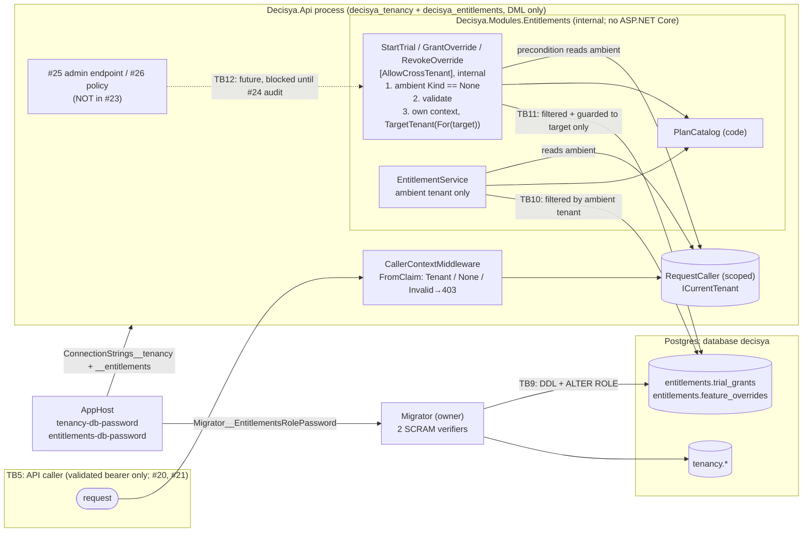

<!-- gate: G3 | verdict: PASS-WITH-NOTES | issue: #23 -->
# Threat delta: Modules.Entitlements, target-tenant admin commands, second module role (issue #23)

- **Scope.** This is a delta on top of `tenant-query-filter.md` (#22) and `tenancy-module.md` (#21). It covers only what #23 adds:
  - `IEntitlementService` evaluation, `PlanCatalog`, `FeatureKey` (Contracts);
  - the `TrialGrant` and `FeatureOverride` aggregates and their unique indexes;
  - the three admin commands and ADR-0012's target-tenant scope;
  - the `CrossTenantQueryRule` extension (`TenantResolution.For` and `FromClaim`);
  - the `decisya_entitlements` role, the migrator's second password and the AppHost wiring;
  - the override reason text.

  The #20 token validation, the #21 caller pipeline and JIT gate, and the #22 filter, guard and IL rules are not re-audited.
- **Mode.** Threat delta, written before code. G6 checks each MUST against the diff.
- **Inputs.**
  - `docs/ai/pipeline/23.md` (Marco's decisions of 2026-09-30, ADR-0012 accepted, R-1 accepted);
  - `docs/requirements/phase-0/entitlements-module.md` (G1, Stories 1-5, NFR-34, NFR-35, R-1 to R-3);
  - `docs/architecture/entitlements-module.md` (G2, D1-D9, "Notes for G3");
  - `docs/adr/0012-cross-tenant-admin-commands-target-tenant-scope.md`;
  - the current code: `TenantResolution`, `TenantId`, `ICurrentTenant`, `ICurrentCaller`, `TenantDbContext` (constructor convention), `CrossTenantQueryRule`, `ArchitectureScope`, `CallerContextMiddleware`, `MigrationRunner`, `AppHost.cs`, `SensitiveAttribute` and `SensitiveTypeAnalyzer`, and the G2-written Contracts files (`FeatureKey`, `FeatureKeys`, `IEntitlementService`).
- **ASVS.** 5.0 Level 2, mapped at section level as in the earlier deltas. Check requirement numbers against the official 5.0 text before copying them into a compliance artefact. #23 adds no authentication and no session, so the Level 3 chapters V6 and V7 are not touched.
- **Runs on:** host. The manifest does not yet record `host` or `sandbox` (CLAUDE.md working agreement); host is correct, because #23 adds no package and feeds no external content to an agent. No secret value was read for this review.
- Ids T-xx, G4-23-xx, S-x and C-x are local to this file.
- Reviewer: security-reviewer agent, 2026-09-30.

## Verdict

**PASS-WITH-NOTES.** ADR-0012's target-tenant scope is sound: a handler's context can only read and write the one tenant it names, and it adds no bypass to `TenantDbContext`. Evaluation, as G2 orders it, fails closed. No High threat lacks a mitigation. The notes are:

1. **R-1 is accepted residual risk (Marco, 2026-09-30).** Until #24, a cross-tenant command leaves no audit record. The control for the window is reachability, and G4-23-02 turns it into tests. The unaudited window is safe **only** while no transport reaches the handlers. The carry-forward conditions C-1 to C-3 bind #24 and #25.
2. **`None` is not "platform admin" (T-03).** In the API, `None` means "authenticated, with no `tenant_id` claim" (`CallerContextMiddleware` → `FromClaim(null)`). That covers any realm user whose attribute is not yet set, and any token minted for the API audience without the attribute. The `None` precondition is fail-closed against **tenant** callers, which is what ADR-0012 claims. It is not an admin check, and G2 says so. It is enough for #23 (no transport). It is **not** enough for #25 (C-2).
3. **The mint rule stops at `ArchitectureScope` (T-02).** `TenantDbContext` subclasses must expose a public `(options, ICurrentTenant)` constructor, and `ICurrentTenant` is a public interface. Any assembly outside the scope, `Decisya.Api` in particular, can therefore mint `TenantResolution.For(x)` and open any module context for any tenant, and no rule notices. ADR-0012 point 4 accepts this explicitly for `Decisya.Api`. #25 will put admin endpoints in `Decisya.Api`, so the gap needs closing now, while it costs a few lines (S-2, fix-now).
4. **`TenantResolution.NoTenant` is the admin precondition, and anyone may mint it (T-04).** It is not on the bypass list. S-1 adds it (fix-now, one line and a fixture in a file this PR changes).

There are **five MUSTs** (G4-23-01 to G4-23-05), all fix-now.

### Answers to the orchestrator's questions

| Question | Answer | Where |
| --- | --- | --- |
| Can a handler reach a third tenant? | No, if the handler uses only its own context. Reads are filtered to the target. The guard rejects any row whose `TenantId` is not the target (`TenantMismatch`) and every write under `None` (`NoTenant`). If a handler uses the ambient DI context by mistake, it reads zero rows and cannot write: fail-closed, not a leak. `ExecuteUpdate`/`ExecuteDelete` go through the filtered query, and moving `TenantId` is banned by the #22 rules. The only way to "reach" a tenant is to name it in the command, which is the design (admin-chosen target). | T-01; G4-23-01 |
| Can a non-`[AllowCrossTenant]` type mint a `TenantResolution`? | Inside `ArchitectureScope`: not for `Tenant`, once the Entitlements assembly joins the scope and `For`/`FromClaim` join the list. `CompilerGeneratedTypeWalk` credits lambdas and state machines to their owner, and `ldftn`/`ldtoken` catch method groups and expression trees. Two gaps remain: `NoTenant` (S-1), and every assembly outside the scope (S-2). Reflection or `Unsafe.As` forgery is out of reach of an IL rule and is left to code review (residual). | T-02, T-04; G4-23-01, S-1, S-2 |
| Is the `None` precondition fail-closed? | Yes, provided it is the exact comparison `Kind == TenantResolutionKind.None`, not `Kind != Tenant`. `default` is `Invalid`, and so is `RequestCaller` before `Set`, so an unset ambient gets `Forbidden`. It must run before validation, so a tenant caller learns nothing about catalog keys or error codes. It does not identify an admin (note 2). | T-03; G4-23-01, C-2 |
| Unaudited window until #24 | Accepted (R-1). Reachability is the control: internal types, `InternalsVisibleTo` limited to the test assembly, no ASP.NET Core and no Wolverine reference. The handlers are registered in the API's container (D7), but an `internal` type cannot be named outside the module, and nothing scans the container. The success log (target tenant, feature, expiry, `trace_id`, hashed `user_id` from enrichment) is an interim trace, not an audit record. | T-05; G4-23-02, C-1 |
| Evaluation fails closed (NFR-35) | Yes, in G2's order. An unknown key and `default(FeatureKey)` are denied before any query. `IsKnown(default)` is a `HashSet` lookup: `GetHashCode` returns 0 and `Equals` compares a null string, so it cannot throw. The one throw risk is a meter tag that reads `feature.Value` for an unknown or default key. `None` and `Invalid` are denied before any query (and `Invalid` would throw inside the context). The Free short-circuit runs after the tenant check, so `None` is also denied `ledger.transactions` (G1). A database error propagates and is never `true`. | T-06, T-07; G4-23-03 |
| `IClock`, expiry boundaries, the trial race | `IClock` is the ServiceDefaults singleton, and each call reads `now` once. Both checks are end-exclusive and computed in memory. `timestamptz` keeps microseconds, so a stored instant can differ from the in-memory one by under 1 µs, which is negligible. The validation `ExpiresAt > now`, with `GrantedAt = now`, keeps `ck_feature_overrides_expiry` from firing. The race is decided by `ux_trial_grants_tenant` plus one 23505 catch matched on the constraint name, which is the #21 D3 reasoning and is correct. | T-08, T-09; G4-23-03 |
| `decisya_entitlements` and the cross-schema test | The existing statements are right (explicit `SELECT, INSERT, UPDATE, DELETE`, never `ALL`; `REVOKE ALL ON SCHEMA … FROM PUBLIC`; per-schema history revoke). The risks come from the refactor: role and schema become parameters, and the grants must run after that module's migration. The cross-schema test must prove both directions. | T-10; G4-23-04 |
| Migrator and AppHost, second password | Follow the #21 pattern exactly: a separate generated, persisted, secret, alphanumeric parameter; `\A[A-Za-z0-9]{32,}\z` (the G6-21-01 fix) on both passwords before any connection; the SCRAM verifier; key-only errors. The #21 "exactly one connection string" assertion becomes "exactly two, both least-privilege". | T-11, T-12; G4-23-04 |
| Override reason | `[Sensitive]` on the entity property and on the command record's property (`[property: Sensitive]`; the attribute cannot target parameters, `CS0592`). The masking processor renders records with sensitive members, so a logged command is masked. The attribute does not protect text that never reaches the log processor: exception messages, `DomainError.Message`, metric or activity tags, test output. | T-13; G4-23-05 |

## Data flow and trust boundaries

- **TB10, evaluation → database (new).** The ambient tenant is the only tenant input. The service's signature has no tenant parameter, and a rule keeps it that way (G2).
- **TB11, admin handler → database (new, ADR-0012).** The target tenant comes from the command, which is trusted input from an admin caller. The handler's own context confines it to that tenant. Authorization of the caller does not exist yet: it is #25's.
- **TB12, future transport → handler (not built).** Crossing it requires the #24 audit record, the #25 platform-admin policy and C-2's role check. Until then the boundary is closed by construction, and G4-23-02 proves it.
- **TB9 (from #21).** Now carries two role verifiers. The API still has no owner credential.

## Threats

| Id | Element / flow | STRIDE | Threat | Severity | Mitigation | ASVS 5.0 id | Status |
| --- | --- | --- | --- | --- | --- | --- | --- |
| T-01 | Admin handler data access | T, I | A handler reads or writes a tenant other than the target: it uses the ambient context, builds a second context, reuses a tracked entity across contexts, or calls a bypass | High | Own context per command via `TargetTenant(TenantResolution.For(target))`, `await using`; no bypass-list call (IL rule); the ambient DI context under `None` returns zero rows and throws `NoTenant` on write; the #22 guard throws `TenantMismatch` for any other tenant's row | V8.2, V8.4 | G4-23-01 |
| T-02 | Minting a `Tenant` resolution | E | Unattributed code calls `For`/`FromClaim` and opens any module context for any tenant: inside the scope (rule gap), or in `Decisya.Api`, which is outside the scope, through the public `TenantDbContext` constructor convention | High in scope; Low today outside (no such code; #25 adds it) | `For`/`FromClaim` on `BypassList`; the Entitlements assembly in `ArchitectureScope`; violating and compliant fixtures; an Api rule allowing only `CallerContextMiddleware` | V8.2, V15.3 | G4-23-01; S-2 |
| T-03 | `None` precondition | E | A tenant user runs an admin command. Separately, a no-`tenant_id` user who is not an admin passes the precondition | High (tenant caller), design correct; Medium for non-admin `None` once exposed | Exact `Kind == None` as the first statement; `Tenant` and `Invalid` → `Forbidden` before validation and any database access; no transport in #23; platform-admin role at #25 | V8.2, V8.3 | G4-23-01; C-2 |
| T-04 | Minting `None` | E | Module code builds an `ICurrentTenant` returning `TenantResolution.NoTenant` and constructs a handler with it, which satisfies the precondition without an admin caller | Low | Add `get_NoTenant` to `BypassList` | V8.2 | S-1 |
| T-05 | Reachability during the unaudited window (R-1) | R, E | An endpoint, a Wolverine discovery, an `InternalsVisibleTo` to a host assembly, or a move of the commands into Contracts makes an unaudited cross-tenant command reachable before #24 | Medium (accepted residual, R-1) | Internal commands and handlers; `InternalsVisibleTo` exactly the test assembly; no `Microsoft.AspNetCore*`, no `WolverineFx`, no `Endpoints` namespace; attributed set exactly the three handlers; success logs carry `trace_id` and the hashed `user_id` | V8.4, V16.3 | G4-23-02; C-1 |
| T-06 | Evaluation, bad inputs | E, D | `default(FeatureKey)`, an unknown key, `None` or `Invalid` returns `true` or throws, so a future policy maps the exception to "allowed" or to a 500 on every request | High if wrong; design correct | G2 order (key → tenant → Free → one `now` → two reads); no `Value` on an unknown or default key, including the meter tag; no query before both checks | V8.2, V16.5 | G4-23-03 |
| T-07 | Evaluation, database failure | E | A `try/catch` in the service, or in a later policy, turns a database exception into `true` | Medium | No catch in the service; the exception propagates (the Contracts XML doc states it); the #26 policy must keep it (C-3) | V8.2, V16.5 | G4-23-03; C-3 |
| T-08 | Trial and override expiry | E | Off-by-one at `EndsAt` or `ExpiresAt`; a second `now` read between the checks; `SystemClock` used directly; a `DateTime` path | Medium | End-exclusive `IsActiveAt`, one `now`, the ServiceDefaults `IClock`, the scaffold's `SystemClock` rule, the `DateTime`/`DateTimeOffset` rule | V2.3 | G4-23-03 |
| T-09 | One-trial and one-override races | T | 16 parallel `StartTrial` calls create two trials or a 500; `GrantOverride` duplicates, or its 23505 retry fails with a null re-read when a concurrent revoke deleted the winner | Medium (trial); Low (override) | Unique indexes; 23505 caught only for the named constraint; `ChangeTracker.Clear()`; one re-read; no ambient transaction | V2.3, V15.4 | G4-23-03; S-3 |
| T-10 | `decisya_entitlements` privileges | E, T, I | The refactored `ProvisionModuleRoleAsync` grants too much (`ALL`, `TRUNCATE`, the other schema, the history table), or grants before the module's tables exist; one module role reads the other's schema | High if wrong; design correct | Same statements as #21, role and schema only from module constants, grants after that module's migration, cross-schema proof in both directions | V13.2, V8.4 | G4-23-04 |
| T-11 | Second role password | I | The entitlements password reaches a log, an exception or SQL text; a trailing-newline value passes validation; the value breaks the API connection string | Medium | `\A[A-Za-z0-9]{32,}\z` on both passwords before any connection; SCRAM verifier via `format('%L')`; key-only error text; alphanumeric generated parameter | V13.3, V16.2 | G4-23-04 |
| T-12 | API configuration | E | The AppHost change gives the API an owner string or a `Migrator__*` key, or the API string names the wrong user | High if wrong | The API gets exactly `ConnectionStrings__tenancy` and `ConnectionStrings__entitlements`, each least-privilege; the migrator gets the new password only from `entitlements-db-password` | V13.2, V13.3 | G4-23-04 |
| T-13 | Override reason (R-3) | I | Customer details in `Reason` reach logs, exception text, `DomainError.Message`, metric or activity tags, or the Postgres server log (a 23514 `Failing row contains (…)` DETAIL) | Medium | `[Sensitive]` on both properties; no reason parameter in `EntitlementsLog`; fixed error messages; validation prevents the check-constraint path; Npgsql error detail banned (#21) | V16.2, V14.2 | G4-23-05 |
| T-14 | Unknown or wrong target tenant (D9) | T | A mistyped id grants an override to the wrong existing tenant (revocable), or uses up that tenant's one trial, which cannot be undone in #23 | Low | Admin-only; no transport; existence check at #25 | V2.3 | Backlog S-5 |

## Requirements for G4 (MUST)

Five MUSTs, all **fix-now**. Each names the red test that must fail before the code exists.

"No database access" is proved as in #21: a placeholder `Host=db.invalid` connection string (any query would throw), or a `DbCommandInterceptor` that records zero commands.

- **G4-23-01: the target-tenant scope confines a command to its target, and only attributed code can mint the scope (T-01, T-02, T-03).**
  - Each handler's first statement is `if (currentTenant.Resolution.Kind != TenantResolutionKind.None) return Forbidden` (equality with `None`, so `Invalid` and `Tenant` both refuse). `currentTenant` is the injected ambient `ICurrentTenant`. The check runs before validation, before `IClock`, and before any context is created.
  - `command.TenantId.IsInitialized` is validated before `TenantResolution.For` runs, so `default(TenantId)` gives `entitlements.tenant_invalid` and never an `ArgumentException`.
  - Handlers do not inject `EntitlementsDbContext`. They create exactly one context per command, as `new EntitlementsDbContext(options, new TargetTenant(TenantResolution.For(command.TenantId)))` under `await using`. The `For` call sits in the attributed handler, not in `TargetTenant`.
  - `CrossTenantQueryRule.BypassList` gains `TenantResolution::For` and `::FromClaim`. `ArchitectureScope` gains `typeof(EntitlementsModule).Assembly`.

  Red tests:
  - `Tenant` ambient and `Invalid` ambient (`default` resolution), for each of the three commands: the result is `entitlements.forbidden` with no database access and no row. The command carries an **invalid** feature and an empty reason, which proves that the precondition runs before validation.
  - Tenant A has a trial and an override for `forecasting.scenarios`, and tenant B has the same. `GrantOverride`, `RevokeOverride` and `StartTrial` for A leave B's rows byte-identical (re-read as B).
  - `None` with `default(TenantId)`: `tenant_invalid`, no exception.
  - Fixtures: `UnattributedTenantScope` calls `TenantResolution.For` inside an `async` lambda **and** through a method group (`Func<TenantId, TenantResolution> f = TenantResolution.For;`), and fails the rule; `AttributedTenantScope` passes.
  - `CrossTenantQueryRule` over the real `ArchitectureScope` passes, which proves the three handlers are attributed.
- **G4-23-02: nothing outside the module and its tests can reach a cross-tenant command before #24 (T-05; R-1).**
  - The command records, the handlers and `TargetTenant` are `internal`. The commands are not in Contracts.
  - The assembly's `InternalsVisibleTo` set is exactly `{ Decisya.Modules.Entitlements.Tests }`.
  - No reference to `Microsoft.AspNetCore*` (no `FrameworkReference` either) or `WolverineFx*`, and no `Decisya.Modules.Entitlements.Endpoints` namespace.
  - The `[AllowCrossTenant]` types are exactly the three handlers, and each justification names #24 as the audit prerequisite.

  Red tests (`EntitlementsModuleBoundaryTests`):
  - the `InternalsVisibleToAttribute` values read from the assembly equal the one-element set;
  - the referenced-assembly names contain no `Microsoft.AspNetCore` or `Wolverine` prefix;
  - the attributed-type set equals the three handlers, and none is public;
  - no public type in the module or its Contracts has a `HandleAsync` method or a constructor parameter of a command type.

  The test's XML doc says that removing or relaxing it requires the #24 audit record (C-1).
- **G4-23-03: evaluation fails closed and never throws for a bad input, and time and races are decided exactly (T-06 to T-09; NFR-35).**
  - `IsEnabledAsync` follows G2 steps 1-7 in order. It contains no `try`/`catch`.
  - The `decisya.entitlements.feature` tag is `IsKnown(feature) ? feature.Value : "unknown"`. `Value` is never read for a default or unknown key.
  - `StartTrial` catches only `DbUpdateException` → `PostgresException { SqlState: "23505", ConstraintName: "ux_trial_grants_tenant" }`. `GrantOverride` catches only the 23505 on `ux_feature_overrides_tenant_feature`, clears the tracker and re-reads once. No explicit or ambient transaction is used.

  Red tests (placeholder host unless noted; `FakeClock`):
  - `default(FeatureKey)`, `nosuch.feature` and `ForecastingScenarios` under `None`; all four keys (the two catalog keys, default and unknown) under `Invalid`. Each returns `false` with no exception and no database access, and the meter records `feature = unknown` or the catalog key.
  - `Tenant` ambient, Pro key, placeholder host: the call throws (it does not return `false` or `true`).
  - Integration: an override `ExpiresAt` and a trial `EndsAt` tested at `T − 1 tick`, which is allowed, and at `T`, which is denied. An expired override with an active trial is allowed (trial). An expired trial with an active override is allowed (override). An expired trial with no override: Pro key denied, Free key allowed.
  - Integration: 16 parallel `StartTrial` calls, each in its own scope, give exactly one success, fifteen `trial_already_used` results (Conflict, no exception) and one row. A second `StartTrial` after expiry gives `trial_already_used`.
- **G4-23-04: the second role is least-privilege and its password follows the #21 path (T-10 to T-12).**
  - `ProvisionModuleRoleAsync` keeps every #21 statement: the SCRAM verifier bound through `format('%I … %L')`; `NOSUPERUSER NOCREATEDB NOCREATEROLE NOINHERIT NOREPLICATION NOBYPASSRLS`; `REVOKE ALL` on the database and schema from PUBLIC; `USAGE` on the module's own schema only; `GRANT SELECT, INSERT, UPDATE, DELETE` (never `ALL`); `REVOKE ALL` on that schema's `__EFMigrationsHistory`.
  - `role` and `schema` come only from module constants (`TenancyModule.DatabaseRole`/`Schema`, `EntitlementsModule.DatabaseRole`/`Schema`), never from configuration.
  - Each module's grants run after that module's `MigrateAsync`.
  - Both passwords are validated with the existing `\A[A-Za-z0-9]{32,}\z` before any connection opens. The error names `Migrator:EntitlementsRolePassword` and never the value.
  - AppHost: `entitlements-db-password` is `secret: true`, `persist: true`, `MinLength = 32`, `Special = false`. The migrator gets `Migrator__EntitlementsRolePassword` from it and gets no `ConnectionStrings__entitlements`. `decisya-api` gets exactly `ConnectionStrings__tenancy` and `ConnectionStrings__entitlements`, with `Username=decisya_tenancy` and `Username=decisya_entitlements`, and still no `Migrator__*` key, no owner string and no `WithReference` to `postgres` or `decisya`.

  Red tests:
  - `MigrationRunnerIntegrationTests`, as `decisya_entitlements`, cover the full #21 list:
    - `CREATE TABLE`, `CREATE TEMP TABLE`, `ALTER TABLE entitlements.trial_grants …`, `DROP TABLE`, `TRUNCATE entitlements.feature_overrides`, `CREATE SCHEMA` and `SET ROLE postgres` each fail with `42501`;
    - `SELECT` on `entitlements."__EFMigrationsHistory"` fails;
    - DML on both tables succeeds;
    - the `pg_roles` flags are false, and `pg_auth_members` has no row for the role.
  - Cross-schema, both directions:
    - `decisya_entitlements` running `SELECT` and `INSERT` on `tenancy.tenants` gets `42501`;
    - `decisya_tenancy` doing the same on `entitlements.trial_grants` gets `42501`;
    - `has_schema_privilege` is false both ways.
  - Idempotent: two runs on one database and one run on a second database, after which the privilege tests still hold.
  - `MigrationRunnerValidationTests`: an `EntitlementsRolePassword` that is missing, 31 characters, contains `'`, or ends in `ValidPassword + "\n"` exits non-zero. The message names the key and not the value, and no connection is attempted.
  - `MigratorLogTests`: Debug capture over a full two-module run contains neither password nor `Password=`.
  - `AppHostConfigurationTests` pins the sets above. `TenancyMigratorResourceTests` pins them on a running AppHost.
- **G4-23-05: the override reason never leaves the database in clear (T-13; R-3).**
  - `[Sensitive]` is on `FeatureOverride.Reason` and on `GrantOverride.Reason` (`[property: Sensitive]`).
  - `EntitlementsLog` has no reason parameter, and no log call passes the command or the entity.
  - Every `DomainError.Message` is a fixed string. No exception message, metric tag or activity tag interpolates the reason, the command or the entity.
  - The reason is validated before `SaveChanges`, so the Postgres check-constraint path cannot fire.

  Red tests:
  - Debug log capture (`Decisya`, `Microsoft.EntityFrameworkCore`, `Npgsql`) over a successful grant, a replace, a `reason_invalid` (501 characters), an `expiry_not_in_future` and a `Forbidden`, each with a unique marker string in the reason. No record, error message or exception text contains the marker.
  - `SensitiveDataMaskingProcessor` given a logged `GrantOverride` and a `FeatureOverride` renders `Reason` as `***`. This proves the attribute placement on a positional record works.

G6 checks that need no new test:
- `Decisya.Api.csproj` gains only the `Decisya.Modules.Entitlements` ProjectReference, and no package.
- The Contracts assembly exposes no `TenantId` or `TenantResolution` member (G2 rule).
- `deploy/sql/entitlements` holds DDL only, with no role or secret.
- `dotnet list package --vulnerable --include-transitive` shows no High or Critical for the new module, `Decisya.Api` and the migrator.

## SHOULD

**Fix-now (Low; a few lines in files this PR changes):**
- **S-1 (T-04).** Add `("Decisya.SharedKernel.Tenancy.TenantResolution", "get_NoTenant")` to `BypassList`, with one violating fixture. Minting `None` is exactly what passes the admin precondition. No scope assembly uses it today (only tests do, and they are outside the scope), so nothing else changes.
- **S-2 (T-02).** In `ApiBoundaryTests` (changed by this PR), assert with the `CrossTenantQueryRule` Cecil walk (Mono.Cecil comes through NetArchTest) that the only `Decisya.Api` type referencing `TenantResolution.For`, `FromClaim` or `get_NoTenant` is `CallerContextMiddleware`. This makes ADR-0012 point 4 hold in the one host where #25 will add admin endpoints. If it takes more than a few lines, it moves to backlog as a #25 prerequisite. The PR body must then say so.
- **S-3 (T-09).** In `GrantOverride`'s 23505 path, a re-read that finds no row (a concurrent revoke deleted the winner) must give a defined outcome: add once more, or return Conflict. It must never be a `NullReferenceException`. Add one unit test with a faked sequence.

**Backlog (#83):**
- **S-4 (T-05).** When Wolverine arrives (ADR-0005), confirm that its handler discovery cannot pick up the three handlers, or give them the envelope-tenant middleware plus the audit record, before any message can route to them.
- **S-5 (T-14).** An existence check on the target tenant (D9, #25), and a way to undo a trial started against the wrong tenant.

## Carry-forward conditions (bind later issues; the orchestrator adds them to #24 and #25)

- **C-1 (R-1, #24 before #25).** The #24 audit record for the three commands exists, and is written in the same unit of work as the change, before #25 removes or relaxes G4-23-02's rules. An audit write that can fail silently does not meet invariant 1.
- **C-2 (T-03, #25).** The #25 admin endpoint requires a platform-admin realm role through its authorization policy. `ICurrentCaller` (today `UserId` only) gains that role, and each handler's precondition becomes `Kind == None && caller.IsPlatformAdmin`. Before #25, `None` covers every authenticated caller without a `tenant_id`, not just admins.
- **C-3 (T-07, #26).** The first entitlement authorization policy and the `/bff/me` manifest treat an `IsEnabledAsync` exception as deny or 500, never as allow, and a test proves it.

## Residual risk after #23

- Until #24, a cross-tenant change leaves only an operational log line, not an audit record (R-1, accepted by Marco on 2026-09-30).
- The mint rule is an IL check: reflection or `Unsafe` forgery of a `TenantResolution` is left to code review.
- Tenant isolation is still the application filter and guard. RLS stays deferred (ADR-0001). The two module roles bound the blast radius between schemas, not between tenants.

## Proportion note

T-14, S-4 and S-5 are recorded for completeness and do not change the merge decision. No High or Medium flaw was found in code #23 does not touch. The one item on unchanged code, S-2 (`Decisya.Api` outside the mint rule), is Low today because no such call exists, and it is fixed here because this PR changes `ApiBoundaryTests`.
