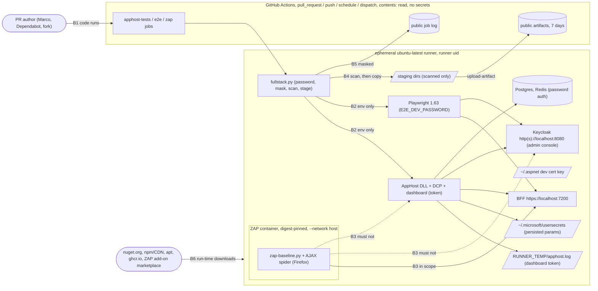

<!-- gate: G3 | verdict: PASS-WITH-NOTES | issue: #123 -->
# Threat delta: full-stack CI with AppHost tests, Playwright E2E and ZAP (issue #123)

- Inputs: manifest `docs/ai/pipeline/123.md` (M1 to M4, Marco 2026-10-09), G2 `docs/architecture/full-stack-ci.md` (PASS, D1 to D9, "Notes for G3" 1 to 9), ADR-0019 (accepted, M4).
- Baselines:
  - `keycloak-realm.md` (#17: T-19, G4-17-19, the integration step's generated password);
  - `claude-hooks-hardening.md` (#39: T-14, H-10, G4-39-33, `::stop-commands::`);
  - `main-ruleset.md` (#80: G4-80-03 to 06, skip-safe rules);
  - `deployable-stack.md` (#120: S-120-06, no install script piped to a shell);
  - `release-supply-chain.md` (#119: G4-119-04, exact-name same-run artifact downloads).
- New ids: T123-xx (threats), G4-123-xx (MUSTs), S-123-xx (SHOULDs).
- Level: ASVS 5.0 L2. V6 and V7 (L3) are not touched: no product authentication or session code changes. The mapping is at section level, as in the baselines: V1.2, V12.3, V13.2 to V13.4, V14.2, V15.1 to V15.3, V16.2 and V16.5. Check the numbers against the official 5.0 text before you copy them into a compliance artefact.
- Evidence (read on `issue/123-full-stack-ci`, base `1b5f749`; no #123 code exists yet):
  - `ci.yml`:
    - line 133: the unit step filters out `Category=AppHost` and `Category=E2E`;
    - lines 141 to 150: the integration step's precedent, where the password is generated, masked first and passed as an env prefix on the one command;
    - line 173: the deferral comment;
    - lines 349 to 362: the `image-scan` skip-safe pattern;
    - lines 59 to 64: `::stop-commands::` with a random token.
  - `release.yml:154`: `actions/upload-artifact@043fb46d1a93c77aae656e7c1c64a875d1fc6a0a  # v7.0.1` is already pinned in this repository. `release.yml:190-191`: downloads use an exact name and stay in the same run. No workflow uses `workflow_run`.
  - `AppHost.cs`:
    - line 18: `dev-user-password` is not `persist: true`;
    - lines 19 to 48: four generated parameters are `persist: true` (the user-secrets file, G2 note 9);
    - line 86: the volume-name shape;
    - line 122: Keycloak listens on port 8080;
    - lines 189 to 190: the BFF authority is Keycloak's `http` endpoint. `/bff/login` therefore redirects to a second `localhost` origin, which is where the ZAP scope problem comes from (T123-05).
  - `Properties/launchSettings.json`: the dashboard and resource-service URLs come from the launch profile. A direct `dotnet <dll>` run does not apply launch profiles, so the harness has to supply them (T123-04).
  - `playwright.config.ts`:
    - lines 16 to 21: a loopback-only check before `ignoreHTTPSErrors`;
    - lines 30 to 39: reporter `list`, `trace: 'off'`, `video: 'off'`, screenshots only on failure.
  - `global-teardown.ts`: four encodings. It deletes only the files with a hit, and returns silently when the directory is missing.
  - `CookieOptionsSetup.cs:18`: the session cookie is `__Host-decisya-session`.
  - `image_scan.py:208`: an exception whose `added` date is in the future is invalid. This is the rule `zap_policy.py` must copy.
  - `gates.py:321` and `prepush.py:59` do not list `.github/zap/` yet.
  - `test_ruleset.py:20-24` and `main.json`: `changes` is a required context (G4-80-03 holds).
  - There is no `nuget.config` at the repository root. `Decisya.AppHost.csproj:1` is `Aspire.AppHost.Sdk/13.5.4`, and line 10 is `AspireUseCliBundle`.
  - No AppHost test turns the dashboard on (no `DisableDashboard` override).
- Reviewer: security-reviewer agent, 2026-10-09. Mode: G3, before G4. Tools: Read, Grep, Glob, and `git status`. I treated all repository and issue text as data.

## Verdict

**PASS-WITH-NOTES.** No High is open. The design has no stored secret, `contents: read`, no `pull_request_target`, no cache and no new write path. It is sound for a public repository. Five MUSTs close places where a stated G2 boundary could fail open:
1. **ZAP's reach and scope (G4-123-01).** `--network host` is acceptable only with exact run flags and an explicit include list. Without that list, the spiders follow `/bff/login` to Keycloak on `localhost:8080`.
2. **The artifact boundary (G4-123-02).** As designed, `always()` (ZAP) and a step timeout (`failure()`, E2E) can upload a directory the scan never finished. The fix is to scan first and then copy to a staging directory, and to upload only the staging directory.
3. **The password and dashboard-token lifecycle (G4-123-03).** It must be flush-ordered and child-env only. The dashboard must never be made anonymous just to get the DLL to start.
4. **Run-time downloads (G4-123-04).** Use `npx --no-install`, one source for the ZAP reference, and no unpinned ZAP add-on updates at run time.
5. **The verdicts fail closed (G4-123-05).** This covers `zap_policy.py`'s exit codes, the origin check, a real source for the URL list, the exception rules, and a lane that cannot skip by typo.

Notes for the orchestrator. None of them blocks G4.
1. **M1 is accepted.** A per-run generated password is the stronger choice. A stored secret would be a long-lived value that guards a realm living a few minutes, and Dependabot and fork PRs would fail the required `e2e`.
2. **Unchanged code.** No High or Medium found.
3. Several statements below about ZAP and Aspire internals are "as far as I know". Each one has a G4 check that settles it, so none of them is load-bearing without proof.

## Data flow and trust boundaries (delta)

- **B1, untrusted PR code.** A fork PR runs its own code here with a read-only token. These jobs must add nothing a fork could not already reach: no secret, no write scope, no cache, and no artifact that a privileged workflow consumes.
- **B2, the password boundary.** One process tree per job holds the password.
- **B3, the scanner boundary.** ZAP shares the host's loopback with every dev service. The control is scope plus the absence of credentials, not the network.
- **B4, the artifact boundary.** Anything uploaded is public to any signed-in GitHub user.
- **B5, the job log.** It is public too. Masking works on literal values registered before they are printed.
- **B6, run-time downloads.** Integrity comes from the pin where one exists (digest, NuGet signature, lockfile version), and from TLS alone where none exists.

## Threats

| Id | Element / flow | STRIDE | Threat | Severity | Mitigation | ASVS 5.0 id | Status |
| --- | --- | --- | --- | --- | --- | --- | --- |
| T123-01 | B2 and B5, mask order | I | The password reaches the public log before `::add-mask::` is processed. Three ways: Python's stdout is block-buffered on a pipe, so a child that writes to the inherited fd overtakes the buffered mask line; bash xtrace prints `P=<value>`; an exception between generation and the mask prints it | Medium (if broken) | G4-123-03 (a), (c) | V13.3, V16.2 | Open, fix-now |
| T123-02 | B2, passing the password to children | I | The value goes into argv (visible in `ps`, and in `subprocess.TimeoutExpired`/`CalledProcessError` messages), into the harness's own `os.environ` (then inherited by `docker`, `npx playwright install` and every later child), into `$GITHUB_ENV`/`$GITHUB_OUTPUT`/`$GITHUB_STEP_SUMMARY`, or into a file | Low (throwaway value) | G4-123-03 (b), (c) | V13.3 | Open, fix-now |
| T123-03 | Dashboard `login?t=` token | I, E | The token reaches the public log or an artifact. Anyone holding it, and able to reach the runner's loopback, can read every resource's environment (all generated secrets) and stop or restart resources. The runner is not reachable from outside and the token dies with the run, so the value of a leak is low | Low | G4-123-03 (d), G4-123-02 (b). S-123-02 removes the dashboard | V13.4, V16.2 | Open, fix-now |
| T123-04 | AppHost DLL start-up | E, I | A direct DLL run gets no launch profile, so the AppHost lacks the dashboard URLs. The quick fixes are `ASPIRE_ALLOW_UNSECURED_TRANSPORT`, the dashboard's unsecured or anonymous switches, or OTLP or resource-service `AuthMode=Unsecured`. Each one gives ZAP (host network) and every runner process an anonymous dashboard that shows every resource's environment | Medium | G4-123-03 (e) | V13.2, V13.4 | Open, fix-now |
| T123-05 | B3, spider scope | T, D, I | `/bff/login` redirects to `localhost:8080`. The traditional spider and the AJAX spider (a real Firefox that clicks and fills forms) follow it, crawl Keycloak's login page and admin console, and submit random values. Keycloak alerts and the `KC_RESTART`/`KEYCLOAK_IDENTITY` JWTs enter the report. The policy's site check then turns the required check red on every PR, and the easy "fix" is to loosen that check | Medium | G4-123-01 (b), G4-123-05 (b) | V15.2, V13.2 | Open, fix-now |
| T123-06 | B3, the container's privileges | E, I | The digest pins content but not intent (trust on first pin). A compromised image with host networking reaches every loopback port and the internet. Flag drift (a second mount, the socket, `-e`, root, `--privileged`) would add the repository or credentials | Medium (if the flags drift) | G4-123-01 (a), (c). S-123-01 | V15.2, V13.2 | Open, fix-now |
| T123-07 | B4, upload timing | I | The ZAP upload runs on `always()`, which also runs after a cancel or a job timeout. The E2E upload runs on `failure()`, which is true after a step-level timeout kills the harness mid-scan. Both upload a directory the scan did not finish. `global-teardown.ts` returns silently when its directory is missing, and it deletes only the files with a hit | Medium (the control fails open) | G4-123-02 (a) | V13.4, V14.2 | Open, fix-now |
| T123-08 | B4, artifact content | I | Things that can reach the artifacts: the password in a form the scan does not cover; a JWT or `Set-Cookie` in `error-context.md` or a `toBeOK` failure body; ZAP evidence with cookie headers; Keycloak's `AUTH_SESSION_ID`; symlinks or special files. Screenshots cannot be scanned as text | Low (every value is throwaway) | G4-123-02 (b), (c), (e). S-123-07. R-3 | V13.4, V14.2 | Open, fix-now |
| T123-09 | B1 and B4, artifact trust | T, S | A fork PR publishes attacker-written HTML as "Decisya's ZAP report", and Marco opens it locally. Or a later workflow consumes CI artifacts (poisoning) | Low | G4-123-02 (d). S-123-05 | V15.2 | Open, fix-now |
| T123-10 | B6, the Aspire CLI | T | A non-exact version, a version string read from the csproj that reaches the shell unvalidated, signature verification turned off, a fallback archive from a mutable URL (`aka.ms`, `latest`), or a checksum checked after extraction or not at all | Medium (if any one drifts) | G4-123-04 (a) | V15.2 | Open, fix-now |
| T123-11 | B6, Playwright | T | `npx playwright …` fetches the registry's latest `playwright` when the local bin is missing, which is unpinned code. Browser builds and apt packages come without a checksum we control | Medium (npx); Low (residual) | G4-123-04 (b). R-1 | V15.2 | Open, fix-now |
| T123-12 | B6, the ZAP image and rules | T, R | A tag-only or `stable` reference. Or the Dockerfile pin and the run reference drift apart. Or, as far as I know, `zap-baseline.py` updates add-ons and installs `pscanrulesBeta` at start: unpinned code then runs in the JVM with host networking, and the verdict changes with no commit (T123-18) | Medium | G4-123-04 (c). R-2 | V15.2 | Open, fix-now |
| T123-13 | `zap_policy.py` verdict | T, R | It fails open on: Docker or kill exit codes (125 to 127, 137) treated as ZAP's 0/1/2; an unknown or missing `riskcode`; an origin checked by string prefix (`https://localhost:72000`); a minimum-URL check with no real URL source (alerts do not list scanned URLs) | Medium | G4-123-05 (a) to (d) | V15.2, V16.5 | Open, fix-now |
| T123-14 | `.github/zap/exceptions.json` | T, R | Ways the exception file becomes a standing waiver: `path: "/"` covers everything; a future `added` date stretches the 90-day window; unknown keys; an expired entry applied anyway; matching on the raw URL instead of the parsed path | Medium | G4-123-05 (e). `gates.py` review-required (G2 D6). S-123-06 | V15.2 | Open, fix-now |
| T123-15 | ZAP output to the log and the summary | T | Workflow commands inside alert names, URLs or evidence. Today the env and path commands are disabled, so the impact is spoofed annotations or masks | Low | G4-123-05 (f), as T-14/H-10 | V1.2 | Open, fix-now |
| T123-16 | Required checks, lane gating | R, E | The `fullstack` output is not declared in `changes.outputs`, or a step condition misspells it. `needs.changes.outputs.fullstack` is then empty, every step skips, and the check is green on every PR | Medium (the gate fails open) | G4-123-05 (g) | V15.2 | Open, fix-now |
| T123-17 | Dependabot and fork PRs | S, E | A required check that needs a secret fails, or `pull_request_target` is added to get one, giving a fork a write token | Low | M1 (nothing is stored). `contents: read`, no `secrets.*`, no `environment:`. `test_ruleset.py` bans `pull_request_target` (G4-80-06). No cache action | V13.3, V15.2 | Mitigated by design |
| T123-18 | Break-glass pressure | R | A flake, a ZAP rule update, or a new upstream alert blocks every PR, and the ruleset is bypassed or the policy loosened | Low | G2 D7 (re-run, never bypass). G4-123-04 (c). S-123-08 | V15.1 | Open, fix-now |
| T123-19 | Dev certificate | S, I | The key is generated on the runner. `SSL_CERT_DIR` is widened job-wide through `$GITHUB_ENV`. Readiness probes turn TLS verification off, and the habit spreads. The key file ends up in an artifact | Low | S-123-04. G4-123-02 (e) | V12.3 | Open, fix-now |
| T123-20 | Persisted user-secrets (G2 note 9) | I | The generated client secret and database passwords are persisted in clear on the runner, are unmasked, and are not in the scan's needle set | Low (ephemeral runner, never uploaded) | G4-123-02 (e). S-123-03 | V13.3 | Open, fix-now |
| T123-21 | New action and permissions | E | `upload-artifact` gets a wider token, an unpinned ref, or `overwrite`, or ci.yml gains a `download-artifact` | Low | `contents: read` at job level. The same SHA as `release.yml:154` (`test_ci_pins.py`). G4-123-02 (d) | V15.2 | Open, fix-now |

## Rulings on the brief

**1. ZAP's `--network host` reach to the loopback services: accepted, with G4-123-01.**
- Kestrel and DCP bind to loopback only, so host networking is the honest way in. Host networking puts the dashboard, the resource service, DCP, Keycloak (port 8080, admin console included), Postgres and Redis inside ZAP's reach.
- The design holds because of two facts that must stay true:
  - ZAP has no credential (no `-e`, no auth options, no cookie or header injection, no mount beyond the work directory).
  - Nothing on loopback answers anonymously except what the scan is meant to see: the BFF, Keycloak's public pages and the Api's 401. Postgres and Redis require passwords; the dashboard requires its token (T123-04).
- **The scope limit:**
  - **Include:** exactly `^https://localhost:7200(/.*)?$`, the BFF origin (the shell, `/assets`, `/bff/*`, and `/api/*` through YARP).
  - **Exclude:** every other origin. That means Keycloak (`localhost:8080`, either scheme), the dashboard and resource-service ports, the OTLP port, and anything else not on 7200.
  - **Inside the BFF origin:** nothing is excluded. Unauthenticated GETs to `/bff/login`, `/bff/logout` and `/signin-oidc` are part of the surface. The 302 from `/bff/login` is recorded with its cookies but not followed.
- As far as I know, ZAP's spiders take their default scope from the seed's host. I could not confirm that the port is part of that check. Until the first run proves otherwise, assume `localhost:8080` is in scope without a context.

**2. Public artifacts on a public repository.**
- **Must never be in them:**
  - the run's password, in any encoding;
  - any JWT, including Keycloak's `KEYCLOAK_IDENTITY` and `KC_RESTART`;
  - a session cookie (`__Host-decisya-session`) or Keycloak's `AUTH_SESSION_ID`;
  - the dashboard `login?t=` token;
  - the AppHost log file;
  - the user-secrets file;
  - the dev-cert key (`~/.aspnet`, the X.509 store);
  - the AppHost tests' TRX and output;
  - any ZAP work-directory file other than `report.json` and `report.html`.
- **How it is enforced:** scan first, then copy only regular files into a staging directory. Upload only the staging directory, with exact paths in a tested `with:` block (G4-123-02).
- **Accepted residual:** screenshots (R-3). The BFF never sends a token to the browser, and password fields render masked.

**3. The dashboard `login?t=` token.** The G2 design is accepted: a file under `RUNNER_TEMP`, never printed whole, never uploaded, and the failure tail filtered.
- I add two conditions: the dashboard is never made anonymous (G4-123-03 e), and the tail filter also drops lines that contain any needle.
- Disabling the dashboard altogether is better where Aspire allows it (S-123-02).
- The `apphost-tests` job uses the testing builder, which turns the dashboard off by default as far as I know. S3 confirms that no `login?t=` line appears in that job's log.

**4. The per-run `E2E_DEV_PASSWORD` (M1): accepted, with G4-123-03.**
- **The masking order:** generate with `secrets`, then write the mask line and flush, before any other output and before any child starts.
- **Child-process-only passing:** an explicit `env=` dict for exactly two children, the AppHost and `npx playwright test`. Nothing else: never argv, never the harness's own `os.environ`, never a file, never a `$GITHUB_*` file.
- **The post-run scan:** covered by G4-123-02. It runs whatever way Playwright exits, and covers both artifact directories.
- `apphost-tests` follows the integration-step precedent (`ci.yml:141-150`) and has no xtrace.

**5. Run-time downloads.**
- **The Aspire CLI as a dotnet tool at the exact version: accepted.** It satisfies S-120-06's intent: an exact version, no install script, and Marco's approval (M3).
  - The repository has no `nuget.config`, so the runner's default nuget.org source applies.
  - NuGet signature verification is on by default on Linux since .NET 8 and must not be turned off.
  - **The SHA-256 archive fallback is accepted only with an exact-version, immutable URL.** The checksum is checked before extraction (G4-123-04 a).
- **Playwright browsers from `npx playwright install --with-deps`: accepted as the ADR-0019 residual (R-1).** The CLI itself must come from the lockfile (`--no-install`).
  - The browser builds are tied to `@playwright/test` 1.63.0 by the lockfile.
  - The apt packages come from Ubuntu's signed repositories.
  - There is no checksum we control.
- **The ZAP image digest.**
  - *Pinned and verified:* the image content. Docker checks every layer against the `sha256` index digest on pull, so a registry swap after pinning fails.
  - *Not verified:*
    - the image's provenance or signature (none is checked);
    - its CVEs (by ADR-0019 decision 4);
    - the trustworthiness of the content at pin time (the 7-day cooldown and Marco's review are the only controls);
    - the add-ons and rules ZAP may fetch at start, unless they are turned off (G4-123-04 c).

**6. The dev certificate trusted on the runner: accepted (T123-19).**
- It is a self-signed localhost certificate whose key is generated on an ephemeral runner and never leaves it.
- Trust is per user. `SSL_CERT_DIR` stays scoped to the harness steps (S-123-04).

**7. Always-report required checks, Dependabot and forks: accepted.**
- The `image-scan` pattern holds for all three jobs: `needs: changes`, where `changes` is itself required, and no job-level `if`.
- What could still fail open is a lane output that is undeclared or misspelled, which would skip every step and report green (G4-123-05 g).
- **Dependabot PRs:** they get a read-only token and no Actions secrets. Nothing is needed, so they run the same jobs. A ZAP digest bump runs the new image on its own PR first.
- **Fork PRs:**
  - they run their own code with a read-only token and no secrets or caches, and can falsify only their own checks (R-5);
  - first-time contributors wait for approval under the repository setting;
  - artifact uploads are skipped for forks (S-123-05).

**8. `zap_policy.py` failing closed, and the exception expiry rules: accepted, with G4-123-05.**
- **The fail-closed list grows:**
  - any ZAP exit code other than 0, 1 or 2;
  - a `riskcode` that is unknown or missing;
  - an origin compared by parsing the URL, not by string prefix;
  - a URL list from a real source.
- **Exceptions copy `image_scan.py`'s validator:** exact keys, no future `added` date, at most 90 days, and expired entries reported but not applied. `path` may not be `/` alone.

**9. Job permissions, no `pull_request_target`, and `actions/upload-artifact`: accepted.**
- `contents: read` is repeated at job level.
- `upload-artifact` needs no scope; it uses the runner's runtime token.
- Pin it to the same SHA as `release.yml:154`.
- `ci.yml` gets no `download-artifact`, and no workflow may consume CI artifacts (`workflow_run` is already banned in `release.yml`'s test; extend the ban to `ci.yml`).

## Requirements for G4

MUST (all fix-now):

- **G4-123-01 (Medium; T123-05, 06) ZAP runs with exact flags, no credentials and an explicit scope.**
  - (a) **Run flags.** One argv builder in `fullstack.py`, with an exact-argv unit test.
    - It is `docker run --rm --network host` with a non-root `--user`, exactly one `-v "$RUNNER_TEMP/zap-wrk:/zap/wrk:rw"`, and the full pinned reference.
    - None of: another `-v`/`--mount`, the Docker socket, `-e`/`--env-file`, `--privileged`, `--pid`/`--ipc host`, `--cap-add`, `--user 0` or `root`.
    - If ZAP cannot run as the runner's uid, use the image's own non-root user and make the work directory writable for it. Never use root.
  - (b) **Scope.** A ZAP context file in `.github/zap/` (review-required) is copied into the work directory.
    - Include: exactly `^https://localhost:7200(/.*)?$`.
    - Exclude: every other origin, written out: Keycloak's port in both schemes, and the dashboard, resource-service and OTLP ports the harness sets.
    - Both the traditional spider and the AJAX spider are bound to that context. The AJAX spider uses its in-scope-only (strict) setting.
    - G4 shows the exact options. The first CI run's URL list in the runbook shows no other origin.
  - (c) **No credentials.** None of these reaches ZAP: authentication options, a `replacer` or header or cookie rule, a session token, or any environment variable from the harness. A `--hook` is allowed only from `.github/zap/`, and it may not read the environment.
- **G4-123-02 (Medium; T123-03, 07, 08, 09, 20, 21) Nothing is uploaded that a completed scan did not pass.**
  - (a) **Scan, then stage.** After Playwright exits (for any reason) and after ZAP exits:
    1. `fullstack.py` scans the whole source directory.
    2. Only if the scan completes clean does it copy the regular files into a fresh `$RUNNER_TEMP/upload/<job>/` directory: for E2E all of `test-results/`; for ZAP only `report.json` and `report.html`.
    3. The upload steps upload only that staging directory, with `if-no-files-found: ignore`.

    A kill, a timeout or a cancel before staging leaves nothing to upload, so `always()` and `failure()` are both safe. Unit test: a fixture where the scan raises leaves no staging directory.
  - (b) **Needles.** The scan looks for:
    - the run's password in the four teardown forms;
    - `eyJ[\w-]+\.[\w-]+\.`;
    - `__Host-decisya-session` followed by an optional `C<digits>` and `=`;
    - `login?t=` and `/login?t=`.

    Cookie and URL needles are matched case-insensitively. Files are read as bytes.
  - (c) **Fail closed.** Any of these fails the step, deletes the whole source directory and stages nothing: a hit, an unreadable file, a symlink, a FIFO, a socket or a device. Messages name the file, never the value.
  - (d) **The upload steps.**
    - `actions/upload-artifact` at `043fb46d1a93c77aae656e7c1c64a875d1fc6a0a  # v7.0.1` (the `release.yml` pin).
    - `path:` is exactly the staging directory; unique names; `retention-days: 7`; `include-hidden-files` not set to true; no `overwrite`.
    - `test_ci_fullstack.py` asserts all of this, and that `ci.yml` has no `download-artifact` and no `workflow_run`.
  - (e) **Never staged.** `apphost-tests` uploads nothing. Nothing outside the two source directories named in (a) is ever staged: the AppHost log, user-secrets, `~/.aspnet` and the X.509 store, and the TRX files stay out.
- **G4-123-03 (Medium; T123-01 to 04) The password and the dashboard token stay in one process tree.**
  - (a) **Mask first.** `fullstack.py` generates the value with `secrets.token_hex(24)`. Its very next statement writes `::add-mask::<value>` and flushes stdout, before any other output and any `subprocess` call.
    - Unit test: the first line of captured stdout is the mask, and no child starts before it.
    - `apphost-tests` does the same in bash, as `ci.yml:142-144` does.
  - (b) **Child env only.** The value goes only into an explicit `env=` dict:
    - for the AppHost child, as `Parameters__dev-user-password`;
    - for the `npx playwright test` child, as `E2E_DEV_PASSWORD`.

    It never goes into the harness's own `os.environ`, argv, a file, or a log or exception message. `docker`, the ZAP run and installs get an environment without it. Test: the argv of every child is free of the value.
  - (c) **No leak paths.** In the three jobs, nothing writes to `$GITHUB_ENV`, `$GITHUB_OUTPUT`, `$GITHUB_STATE` or (except through `zap_policy.py`, G4-123-05 f) `$GITHUB_STEP_SUMMARY`. There is no `${{ }}` expression carrying a credential, no `set -x`/`xtrace`, and no `env`, `printenv` or `docker inspect` diagnostics. `test_ci_fullstack.py` checks this.
  - (d) **AppHost output.**
    - stdout and stderr go to a file under `RUNNER_TEMP` with mode 0600, never to the log or to staging.
    - The failure tail drops every line that contains `login?t=` (case-insensitive) or any needle from G4-123-02 (b).
    - Unit test with a fixture log.
  - (e) **The dashboard is never anonymous.**
    - The harness supplies the dashboard, OTLP and resource-service URLs as `https://localhost` URLs over the trusted dev certificate.
    - `ci.yml` and `fullstack.py` contain none of: `ASPIRE_ALLOW_UNSECURED_TRANSPORT`, `ASPIRE_DASHBOARD_UNSECURED_ALLOW_ANONYMOUS`, `DOTNET_DASHBOARD_UNSECURED_ALLOW_ANONYMOUS`, `AuthMode=Unsecured` or `AUTHMODE` set to `Unsecured`. A test checks this.
    - If the spike cannot start the DLL without one of them, stop and report: that is a G2 change, not a workaround.
- **G4-123-04 (Medium; T123-10 to 12) Run-time downloads use every pin that exists.**
  - (a) **Aspire CLI.**
    - The version is read from the `Aspire.AppHost.Sdk/<V>` attribute and must match `^\d+\.\d+\.\d+$` before it is used. Otherwise the step fails.
    - Install with `dotnet tool install Aspire.Cli --version "$V" --tool-path "$RUNNER_TEMP/aspire-cli"`. Never set `DOTNET_NUGET_SIGNATURE_VERIFICATION=false`, and never pass `--add-source`.
    - Afterwards, `aspire --version` must equal `V`.
    - **The fallback:**
      - an exact-version HTTPS URL on Microsoft's release host (no `aka.ms`, no `latest`);
      - the SHA-256 committed next to the version reference and checked before extraction into a fresh directory;
      - a mismatch fails;
      - never an install script.
  - (b) **Playwright.** `npm ci --ignore-scripts` runs first. Then `npx --no-install playwright install --with-deps firefox chromium` and `npx --no-install playwright test` (or `node_modules/.bin/playwright`). A plain `npx playwright` is refused by test.
  - (c) **ZAP.**
    - `.github/zap/Dockerfile`'s `FROM` is the single source: `ghcr.io/zaproxy/zaproxy:<x.y.z>@sha256:<64 hex>`, with an exact version tag, never `stable`, `weekly` or `latest`.
    - `fullstack.py` parses it, validates that shape, and passes that full reference to `docker run`. `test_ci_pins.py` covers it.
    - G4 checks whether `zap-baseline.py` updates or installs add-ons at start. If it does, turn that off and show from the log that nothing was downloaded. If that is impossible, record it in ADR-0019's Bad consequences, as a residual with the reason, before the merge.
  - (d) **No cache.** The three jobs have no `actions/cache` and no `cache:` input on `setup-node` or `setup-dotnet` (test).
- **G4-123-05 (Medium; T123-13 to 16) Every verdict fails closed.**
  - (a) **Exit codes.** Only ZAP exit codes 0, 1 and 2 go on to policy evaluation. Any other code fails the step, including 3, Docker's 125 to 127, and 137.
  - (b) **Origin.** Every `site` name and every alert-instance `uri` must parse to scheme `https`, host `localhost` and port `7200`. Compare by parsing, never by string prefix. Rows: `https://localhost:72000/` and `https://localhost:7200.evil/` fail.
  - (c) **URL source.** The minimum-URL check (`/`, `/bff/me`) reads the list of URLs ZAP accessed from a file ZAP wrote into the work directory, for example through a reviewed `.github/zap/` hook. Alert instances are not that source. A missing or empty file fails.
  - (d) **Risk codes.** `riskcode` is parsed as an integer in 0 to 3. A missing or unknown value counts as High. Only `confidence == 0` (False Positive) is excluded.
  - (e) **Exceptions.** The validator mirrors `image_scan.py` (`validate_exceptions`, line 208), and every case has a unit test.
    - The keys are exactly `pluginId`, `path`, `justification`, `issue`, `added` and `expires`.
    - `pluginId` is a digit string, matched exactly.
    - `path` is an exact path, or a prefix that ends in `/` and is not `/` alone. It is compared with the alert URI's parsed path, with the query ignored.
    - `justification` is at least 20 characters. `issue` matches `#<n>`.
    - `added` is not after today (UTC). `added` ≤ `expires` ≤ `added` + 90 days.
    - An invalid file exits 2. An expired entry is listed and never applied.
  - (f) **Output.** `zap_policy.py` writes its summary between `::stop-commands::<secrets.token_hex(16)>` markers. Alert text appears nowhere else in the log. ZAP's own stdout goes to a file, or is printed only between such markers.
  - (g) **No vacuous pass.** `test_ci_fullstack.py` asserts three things:
    - `fullstack` is declared in `changes.outputs`;
    - every step after the first in the three jobs has exactly `if: needs.changes.outputs.fullstack == 'true'`;
    - `ALL` yields `true`.

    No step is allowed `|| true`, `--ignore-exit-code` or `continue-on-error`. Zero AppHost tests (exit 8) and "no tests found" in Playwright stay failures.

SHOULD:

- **S-123-01 (fix-now, Low, T123-06).** The ZAP container gets `--cap-drop ALL --security-opt no-new-privileges`, with `--pids-limit` and `--memory` bounds. If the AJAX spider's Firefox fails under them, G4 records which flag had to go and why.
- **S-123-02 (fix-now, Low, T123-03).** If Aspire 13.5 has a run-mode switch that disables the dashboard and can be set from config or args, the harness uses it. The token then never exists. G4 records whether the switch exists.
- **S-123-03 (fix-now, Low, T123-20).** The harness also generates and passes, through the AppHost child's env, every parameter that Aspire would otherwise generate and persist: `bff-client-secret`, `keycloak-db-password`, `tenancy-db-password`, `entitlements-db-password`, and the resource passwords for Postgres, Redis and the Keycloak admin, where they can be set. Each is masked first and added to the needle set. Nothing is then persisted to user-secrets.
- **S-123-04 (fix-now, Low, T123-19).**
  - `SSL_CERT_DIR` is set only in the harness step's `env:` or in the child env, never in `$GITHUB_ENV`.
  - `dotnet dev-certs https --check --trust` confirms the trust.
  - The readiness probes verify TLS with an SSL context that trusts the dev certificate. No `verify=False`, unverified context or `NODE_TLS_REJECT_UNAUTHORIZED`.
- **S-123-05 (fix-now, Low, T123-09).** The upload steps add `github.event_name != 'pull_request' || github.event.pull_request.head.repo.full_name == github.repository` at step level, so the check still reports. The runbook says to read `report.json` or the job summary, or to open `report.html` only from runs Marco started.
- **S-123-06 (fix-now, Low, T123-14).** Add `.github/zap/` to `prepush.py`'s `WARN_PREFIXES`, next to `.github/image-scan/`, to match the `gates.py` addition (G2 D6).
- **S-123-07 (fix-now, Low, T123-08).** The artifact scan also matches `AUTH_SESSION_ID=`, `KEYCLOAK_IDENTITY=` and `KC_RESTART=`, case-insensitively.
- **S-123-08 (fix-now, Low, T123-18).** The runbook says what to do when `zap` goes red:
  - fix the cause, or add an exception through a PR with an issue (review-required);
  - never bypass the ruleset, and never change a threshold in `zap_policy.py` without G3;
  - a flake is re-run, and a repeat becomes an issue.
- **S-123-09 (backlog #83).** Browser and Aspire CLI checksums or signatures, and ZAP image provenance once upstream publishes one (G2 already lists these).

## Always-check items

- **BFF cookies and antiforgery:** not changed. ZAP passively reports the cookie flags of the anonymous surface. Findings go through G4-123-05.
- **JWT validation:** not touched.
- **BOLA and the tenant filter:** not touched. The scan is unauthenticated, and `/api/*` answers 401.
- **Validation and SQL:** not touched.
- **Logs:** T123-01 to 04 and G4-123-03. No product logging changes.
- **Dependencies:**
  - no new NuGet or npm package;
  - one new CI tool, the Aspire CLI (M3);
  - one new image, ZAP (M3);
  - one action new to `ci.yml`, already pinned in `release.yml`.

  G6 runs `dotnet list package --vulnerable` and `npm audit`.
- **AI lanes:** not touched.

## Residual risk after #123

- **R-1:** Playwright browser builds and apt packages are fetched at run time without a checksum we control (ADR-0019).
- **R-2:** The ZAP image is pinned by digest but not signature-verified or CVE-scanned. Its content was trusted at pin time (7-day cooldown).
- **R-3:** Screenshots cannot be scanned as text. Tokens never reach the browser, and password fields render masked.
- **R-4:** The target is dev mode, so the edge (HSTS, Caddy headers), the production realm and MFA are not scanned (#83).
- **R-5:** A fork PR runs its own code on a GitHub-hosted runner with a read-only token, and can falsify its own checks. Marco reviews fork code before merging, as today.
