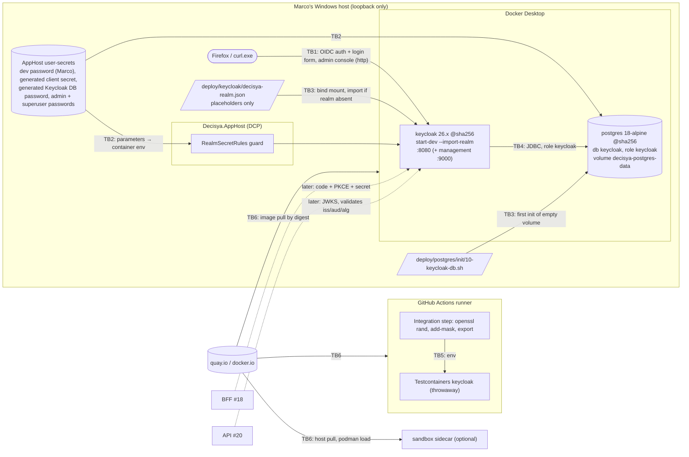

<!-- gate: G3 | verdict: PASS-WITH-NOTES | issue: #17 -->
# Threat delta: Keycloak realm export, `decisya-bff` client, seeded users (issue #17)

- Scope: what #17 adds:
  - the realm file `deploy/keycloak/decisya-realm.json` with `${env.…}` placeholders;
  - the secret flow: AppHost parameters, the value Marco sets in the local secret store, CI's throwaway values;
  - the Postgres server resource and `deploy/postgres/init/10-keycloak-db.sh`;
  - the pinned Keycloak and Postgres images, `ContainerImages.cs`, and the sandbox image-list entry;
  - the `decisya-bff` token settings, the `tenant_id` user-profile attribute and mapper, the seeded dev users;
  - the Keycloak admin console in dev;
  - the CI Integration step;
  - the import-on-start and skip-on-restart behaviour.
- Mode: threat delta, written **before** implementation. "Requirements for G4" is design input for devops/backend-dev (G4) and test-engineer (G5). G6 checks each requirement against the diff.
- Inputs:
  - `docs/requirements/phase-0/keycloak-realm.md` (G1, Stories 1-7, decisions 1-4), NFR-15 and NFR-16;
  - `docs/architecture/keycloak-realm.md` (G2) and its "Notes for G3";
  - ADR-0002, ADR-0003, ADR-0011, and `CLAUDE.md` (security principles, invariant 5);
  - the carried-forward comments on #18, #20 and #22 (read with `gh issue view`; the G2 author could not). They agree with the G2 "Interface for later issues". #20's rule that the tenant comes only from the claim through `TenantId.TryParse` fits the lowercase `D` format pinned here.
  - the earlier models `apphost-servicedefaults.md` (#15), `tenantid-result-types.md` (#32) and `agent-sandbox-docker-sidecar.md` (#41, T-41-16).
- Where the code gates run: the host (manifest, ADR-0011). The new third-party artifact is the Keycloak image, which runs inside Docker. It is not build-time code on the host. T-10 rates the sandbox side.
- Ids: T-xx, G4-17-xx and F-x are local to this file. #27 (0.15) absorbs them into the baseline.
- ASVS: 5.0, Level 2, and **Level 3 for V6 and V7**. Mapped at section level, as in the earlier models. Check requirement numbers against the official 5.0 text before copying them into a compliance artefact. V6 L3 gaps (MFA enforcement, breached-password checks) are acceptable here only because #17 is dev-only. F-1 carries them.
- No secret value was read for this review. Secrets are named only by description.
- Reviewer: security-reviewer agent, 2026-09-26.

## Verdict

**PASS-WITH-NOTES.** Six threats are rated High:

| Threat | Mitigation |
| --- | --- |
| T-01, placeholder fail-open | Mitigated in #17 for every launch path that exists today. #29 carries future paths. |
| T-02, dev realm imported outside dev | Mitigated in #17. #29 carries the production realm. |
| T-03, key material or literals in the file | Mitigated in #17 |
| T-11, alg confusion or long-lived tokens | Mitigated in #17. #20 carries validation. |
| T-12, code interception or redirect abuse | Mitigated in #17 |
| T-14, tenant escape through self-edit | Mitigated in #17 |

No High is left without a mitigation or a linked issue.

The G2 design is sound. G3 adds nine details; see "Changes to the G2 design". Answers to G2's "Notes for G3":

1. **Unresolved-placeholder fail-open.** Rated High (T-01), because the same file also seeds a `platform-admin`. G2's three controls are accepted. Two are added: the fixture fails in CI instead of generating a value, and G4 records a one-off characterisation of the pinned version's behaviour. Future launch paths, meaning Compose and deployment, go to #29 (F-1).
2. **`tenant_id` permissions (`edit: ["admin"]`, unmanaged attributes off).** This is the right control. The config-only assertion is not enough, so G3 adds a behavioural test: `dev-alice` tries to change her own `tenant_id` through the account REST API (G4-17-09).
3. **Per-run fallback secret in the fixture.** Confirmed for host runs only. When `CI` or `GITHUB_ACTIONS` is `true`, an unset variable fails the fixture, so CI proves the G1 wiring (G4-17-02).
4. **Not documenting a literal dev password.** Confirmed. Documenting how to generate the value, rather than a value, is the correct reading of invariant 5, and it keeps gitleaks meaningful. G1's wording is superseded (G4-17-21).
5. **`sslRequired: external` and http on localhost.** Accepted for dev, with a condition. Keycloak treats private-range addresses as "local" as well as loopback, so http logins and the admin console would work from the LAN if a port were bound beyond loopback. G4 must show loopback-only listeners (G4-17-13, T-18).
6. **Aspire-generated admin and superuser passwords shown in the dashboard.** Accepted. The dashboard is authenticated and loopback-only (#15 T-25).
7. **The init script's psql-variable quoting.** Correct against injection. Two small additions keep the password out of the server log and out of argv (G4-17-15).
8. **The charset rule on placeholder values.** Accepted. It closes JSON injection whatever order Keycloak substitutes and parses in (T-04).
9. **The realm HMAC key stays.** Accepted. The controls are the client alg attributes and the issued-token header check (G4-17-06). #20's allow-list (F-3) is the second layer.

## Data flow and trust boundaries

Trust boundaries:

- **TB1, browser → Keycloak.** This is the first identity-bearing flow. Keycloak is untrusted input to Decisya, and the browser is untrusted input to Keycloak.
- **TB2, secret store → container environment.** This path carries secrets. Values leave the user-secrets store and become process environment in two containers.
- **TB3, repository files → a third-party process.** The realm file and the init script are executed or interpreted with admin rights at first start.
- **TB4, Keycloak → Postgres.** A dedicated role and database.
- **TB5, CI step → test container.** Throwaway values, masked.
- **TB6, registry → engine.** The supply chain for the two images, on three engines: the host's Docker Desktop, CI's Docker, and the optional sandbox sidecar.

## Threats

| Id | Element / flow | STRIDE | Threat | Severity | Mitigation | ASVS 5.0 id | Status |
| --- | --- | --- | --- | --- | --- | --- | --- |
| T-01 | Realm placeholders, import | S, E | An unset variable leaves `${env.…}` in place as literal text. The client secret and **every seeded password, including `dev-admin` (`platform-admin`)**, then become strings anyone can read in the public repository. | High | AppHost guard; the two generated parameters are always present; the fixture always sets both values and fails in CI when they are unset; the secret-equality and login tests; a characterisation of the pinned version (G4-17-02). Future launch paths → F-1. | V13.3, V6.2, V10.4 | Mitigated in #17; Compose/deploy → #29 |
| T-02 | Dev realm used outside dev | E, S | The file carries a cross-tenant `platform-admin` with a shared dev password, localhost redirect URIs and `sslRequired: external`. If Compose or a deployment ever mounts it, a production realm gets known accounts. | High | Only two import paths exist today: the AppHost (`start-dev`) and Testcontainers. A static test fails if any other file references the realm file (G4-17-12). `.test` / `dev-` markers (G2 static test). #29 builds a production realm with no `users` (F-1). | V13.1, V13.4, V8.2 | Mitigated in #17; prod realm → #29 |
| T-03 | Realm file content | I, S | A raw Admin Console export pasted in carries the realm private key (token forgery), hashed credentials or a literal secret. | High | Static test: exactly two placeholder tokens, no key or credential fields, and only the user-profile component (G4-17-01). gitleaks with no path allow-list (G4-17-04). | V13.3, V11.1 | Mitigated in #17 |
| T-04 | Placeholder values | T | A value containing `"`, `\`, `$`, `{` or `}` breaks the JSON or injects into it at substitution time. | Low | `RealmSecretRules` charset and length, shared by the AppHost and tests (G2); accept/reject tests. | V1.2, V2.2 | Mitigated (G2) |
| T-05 | Secrets in output | I | Values reach the guard's exception, test output, assertion messages, the CI log or a TRX artifact. | Medium | Messages name the key, never the value; boolean or fixed-time comparisons; `::add-mask::` before first use; no uploaded test-result artifact (G4-17-03, 19). | V16.2, V13.3 | Mitigated by requirements |
| T-06 | Host secret store, dashboard | I | Plaintext user-secrets and the dashboard's parameter and environment views expose the client secret, the DB passwords and the admin password to anything running as Marco. | Low (dev) | ADR-0011 accepted residual; dashboard authenticated on loopback (#15 T-25); no value copied into docs or issues (G4-17-21). | V13.3 | Accepted |
| T-07 | Postgres init script | T, I | SQL injection through the password; the password in the server log (a failed statement is logged with its text), in `psql` argv, or echoed through `set -x`. | Medium | psql variable with `:'…'`, quoted heredoc; fail on unset or empty; `\getenv` instead of argv; statement logging off for the session (G4-17-15). | V1.2, V13.3, V16.2 | Mitigated by requirements |
| T-08 | Keycloak DB role | E | The Keycloak role gets more privilege than it needs, or future module roles (ADR-0005) can connect to Keycloak's database. | Low | `NOSUPERUSER NOCREATEDB NOCREATEROLE`, owner of its own database only, `REVOKE ALL … FROM PUBLIC`; host evidence (G4-17-16). | V13.2, V8.2 | Mitigated by requirements |
| T-09 | Images | T | A tampered, drifting or vulnerable Keycloak or Postgres image. | Medium | Official registries, exact patch tag plus index digest, one C# source linked into the tests, parity test with the sandbox list, Dependabot digest bumps (G4-17-17). Image CVE scanning → #28 (F-2). | V15.2, V13.1 | Mitigated; scan → #28 |
| T-10 | Sandbox image list | E | A third-party image runs in the sidecar and reaches the engine (T-41-16), or a malformed line weakens `sandbox.py`'s parser. | Low | The line matches `IMAGE_FROM_RE`; the fixture mounts no socket and uses no bind mount (G4-17-18). | V15.2 | Mitigated by requirements |
| T-11 | Token issuance | S, E | Alg confusion (`HS256`, `none`), a request object signed with `none`, or tokens longer than 5 min let a forged or stolen token be replayed at #20. | High | Realm and client pinned to RS256; client lifespan override of 300 s; tests on the issued header, `kid` in JWKS and `exp - iat`; request-object alg pinned (G4-17-05, 06). #20 validation → F-3. | V9.1, V9.2, V10.4 | Mitigated in #17; validation → #20 |
| T-12 | Authorization request | S, T | Code interception or open redirect through wildcard or http redirect URIs, `plain` PKCE or missing PKCE, or the implicit response types. | High | Exact redirect and post-logout URIs; PKCE S256 required; negative tests for redirect variants, `plain`, missing challenge, missing verifier and `response_type=token` (G4-17-07). | V10.4, V10.2 | Mitigated in #17 |
| T-13 | Unneeded grants and clients | S, E | Password, client-credentials, device, CIBA or offline grants on `decisya-bff`. Keycloak's built-in `admin-cli` in the `decisya` realm allows the password grant by default, which gives a login path around the hosted form. Tokens from other clients may carry roles. | Medium | Flags asserted and grants tested negatively; `offline_access` never issued; `admin-cli` password grant disabled or proven harmless (no `decisya-api` audience, no `tenant_id`) (G4-17-05, 07, 08). #20 checks `aud` and `azp` (F-3). | V10.4, V6.3 | Mitigated by requirements |
| T-14 | `tenant_id` attribute | E, T | A user sets or changes their own `tenant_id` through the account console, the account REST API, an update-profile form, self-registration, an identity-provider first login, or an unmanaged attribute. The result is a cross-tenant read at #22. | High | User-profile `edit`/`view` `["admin"]`; unmanaged attributes off; registration off; no identity providers; no Keycloak admin role on any seeded user; **behavioural test** of a self-edit (G4-17-09, 10). | V8.2, V8.3, V6.4 | Mitigated in #17 |
| T-15 | `platform-admin`, tenant shape | E | The role without a tenant is mishandled downstream (missing claim treated as `default`, or a user holding both a tenant and `platform-admin`). An all-zero or malformed GUID is set by an admin. | Medium | Mapper emits nothing when the attribute is absent (G2 test); user-profile pattern rejects the all-zero GUID (G4-17-11). `TenantId` rejects `Guid.Empty` (#32). Claim handling → #20, #22 (F-3, F-4). | V8.2, V8.4 | Mitigated for #17; → #20, #22 |
| T-16 | Authentication strength | S | No MFA enforcement (V6.3.3, L2) and no common or breached password check (V6.2.4, V6.2.12) for real users. `platform-admin` is single-factor. | Medium (dev only, synthetic data) | OTP permitted, `CONFIGURE_TOTP` enabled, password policy `length(12)`, `maxLength(128)`, no composition rules (G2). Enforcement before any external user → #29 and #25 (F-1, F-6). | V6.2, V6.3, V6.5 | → #29, #25 |
| T-17 | Login page | S, D | Online guessing and credential stuffing against seeded or later users. | Low | Brute-force detection on (G2 values); no wrong-password test on the shared fixture. | V6.3 | Mitigated (G2) |
| T-18 | Admin console, management port, Postgres port | S, E, I | Ports bound beyond loopback reach the LAN. Keycloak's `external` mode allows http from private ranges, so the admin console would accept a login over http from the LAN. The admin console shares the port with the login page. | Medium | Loopback-only listeners shown in G4 evidence; generated admin password; no Keycloak environment literals beyond the allow-list (G4-17-13, 14). Separate admin hostname, `sslRequired: all` → #29 (F-1). | V13.4, V12.1, V8.2 | Mitigated for dev; prod → #29 |
| T-19 | CI Integration step | R, I | The gate silently runs zero tests; values leak to other steps or the log; a `secrets.*` reference turns a fork PR into a secret-exposure path. | Low | `--ignore-exit-code 8` removed; values generated, masked and exported only inside the step; no `$GITHUB_ENV`, no `secrets.*`; the first CI run shows more than 0 Integration tests (G4-17-19). | V15.2, V16.2 | Mitigated by requirements |
| T-20 | Import skip on restart | T | An edited realm (for example a security fix) is not applied to an existing database. Admin-console edits drift from the file unnoticed. In production the same behaviour would leave fixes unapplied. | Low (dev); Medium once deployed | Documented reset procedure; CI always tests the committed file on an empty container (G4-17-20). Production config migration → #29 (F-1). | V13.1, V15.1 | Mitigated for dev; → #29 |
| T-21 | Persisted-value mismatch | D | After a user-secrets reset, the database keeps the old role password, client secret and user passwords, so Keycloak or #18's BFF fails to authenticate. | Low | Fails closed; documented with the reset step (G4-17-20). | V13.3 | Accepted |
| T-22 | Dev issuer over http | S | #20 or #18 accepts http metadata or the dev issuer outside Development. | Low | Dev-only settings; → #18, #20 (F-3, F-5). | V12.1, V10.5 | → #18, #20 |
| T-23 | New package references | T | `Aspire.Hosting.Keycloak` (preview), `Aspire.Hosting.PostgreSQL` and `Testcontainers.Keycloak` enter the build. | Low | Already pinned centrally; vulnerable-package gate; PR-body justification (G4-17-18). | V15.2 | Mitigated |

## Changes to the G2 design

devops and test-engineer follow these where they differ from `docs/architecture/keycloak-realm.md`. None of them needs an ADR or a new package.

1. **Fixture in CI (T-01).** When `CI` or `GITHUB_ACTIONS` equals `true` (case-insensitive), an unset `DECISYA_BFF_CLIENT_SECRET` or `DECISYA_DEV_USER_PASSWORD` fails the fixture with a message naming the variable. The per-run fallback applies on the host only. A value that is set but empty is "set but invalid" and fails everywhere.
2. **Init script (T-07).**
   - Read the password inside psql with `\getenv kc_password DECISYA_KEYCLOAK_DB_PASSWORD` instead of `-v kc_password=…` on the command line.
   - Start the SQL with `SET log_statement = 'none';` and `SET log_min_error_statement = 'panic';`.
   - Before psql runs, check `: "${DECISYA_KEYCLOAK_DB_PASSWORD:?}"`.
   - If `\getenv` is unavailable in the pinned psql, keep `-v`, record that in the G4 evidence, and stop there. Do not look for another route.
3. **Behavioural tenant-edit test (T-14).** See G4-17-09.
4. **More negative flow tests (T-12, T-13).** See G4-17-07.
5. **`admin-cli` in the `decisya` realm (T-13).** SHOULD: include the built-in `admin-cli` client in the export with `directAccessGrantsEnabled: false`. If Keycloak 26 rejects or ignores a built-in client entry in a partial import, record the observed behaviour and apply G4-17-08's fallback assertion instead.
6. **Request objects (T-11).** Set `decisya-bff`'s attribute `request.object.signature.alg` to `RS256`. The default, `any`, accepts unsigned (`none`) request objects. The client has no JWKS, so this disables request objects for it, which is intended.
7. **Reference-scope test (T-02).** See G4-17-12.
8. **User-profile pattern (T-15).** Prefix the `tenant_id` pattern with a negative lookahead for the all-zero GUID: `^(?!00000000-0000-0000-0000-000000000000$)[0-9a-f]{8}-…$`.
9. **Loopback evidence (T-18).** See G4-17-13.

## Requirements for G4

MUST unless marked SHOULD. Each needs a test, or a G4 evidence item or G6 check where stated. G4 records each result in the manifest's G4 evidence. Test canaries are built at run time; no realistic secret literal appears in any file.

### Realm file and placeholders (T-01 to T-05)

- **G4-17-01 (static realm test).** `RealmExportFileTests` as specified by G2, and in addition:
  - the set of distinct `${…}` tokens is exactly the two named placeholders, so a `:default` suffix or a third variable fails;
  - `components` holds only the `org.keycloak.userprofile.UserProfileProvider` entry;
  - `identityProviders` and `groups` are absent or empty;
  - no user has `clientRoles`, and every `realmRoles` entry is in `{tenant-user, platform-admin}`;
  - `secret` appears only on `decisya-bff`.
- **G4-17-02 (fail-open controls).**
  - AppHost guard: a missing, blank or rule-violating dev password throws before any resource starts. The message names `Parameters:dev-user-password` and the rule. Test with a canary value: the canary is absent from the message and from `ToString()`.
  - Fixture: implement change 1. Tests cover the three branches (unset on the host, unset with `CI=true`, set but invalid). The G2 secret-equality test and the `dev-alice` login test stay MUST.
  - G4 evidence, one-off and manual on the host, never committed as a test: start the pinned image with the realm file and `DECISYA_DEV_USER_PASSWORD` unset. Record whether import fails or the literal is kept. If Keycloak fails closed, note it in T-01. The G4-17-02 controls stay either way.
- **G4-17-03 (no secret in output).**
  - No test, fixture, guard or AppHost code writes a secret value to test output, an exception, an assertion message or a log.
  - Secrets are compared with `CryptographicOperations.FixedTimeEquals` or a boolean, and the assertion is on the boolean.
  - G6 check: the diff adds no `upload-artifact` step for TRX files. Masking doesn't cover artifacts.
- **G4-17-04 (gitleaks).**
  - The `Secret scan` step stays green.
  - If an allow-list entry is needed, it is exactly the regex `\$\{env\.DECISYA_[A-Z_]+\}` under the existing `[allowlist] regexes`, with the default `regexTarget` (the secret, not the line).
  - No path allow-list covers `deploy/`. G6 check.

### Client and tokens (T-11 to T-13)

- **G4-17-05 (configuration assertions).** `RealmConfigurationTests` as specified by G2, and in addition:
  - `accessCodeLifespan` ≤ 60;
  - `optionalClientScopes` is empty and `defaultClientScopes` equals the G2 list;
  - the device and CIBA grant attributes are `false`;
  - `attributes["request.object.signature.alg"]` = `RS256` (change 6);
  - `redirectUris` and `post.logout.redirect.uris` contain no `*` and no `http:`;
  - `webOrigins` is empty.
- **G4-17-06 (issued tokens).** `BffLoginFlowTests` step 4 as specified by G2, and in addition:
  - the access token's `azp` = `decisya-bff`;
  - its `aud` contains `decisya-api` and contains no `account` or `realm-management`;
  - the token response's `scope` has no `offline_access`;
  - the refresh token's `typ` is not `Offline`.
- **G4-17-07 (negative flows).** G2 step 5, and in addition. Each case gets no login form, or no token:
  - `redirect_uri` set to `http://localhost:7200/signin-oidc`, to `https://localhost:7200/signin-oidc/x`, to `https://localhost:7200/signin-oidc?x=1`, and to `https://attacker.test/signin-oidc`;
  - `response_type=token` and `response_type=id_token`;
  - `grant_type=password` and `grant_type=client_credentials` with the correct client secret get `unauthorized_client` or `invalid_client`. Use the correct dev password in the password-grant case, so no brute-force counter moves.
- **G4-17-08 (`admin-cli` in the `decisya` realm).** Implement change 5 (SHOULD). Test, MUST either way:
  - if disabled: a password grant to `admin-cli` in `decisya` fails;
  - otherwise: the resulting access token has no `decisya-api` in `aud` and no `tenant_id` claim. #20 then rejects it (F-3).

### Tenant and roles (T-14, T-15)

- **G4-17-09 (self-edit is refused).**
  - G2's user-profile assertions stay.
  - Behavioural test, `Category=Integration`: `dev-alice` signs in through the built-in `account-console` client with the same helper (code flow and PKCE), then `POST /realms/decisya/account/` with `attributes.tenant_id` set to `dev-bob`'s value.
  - Expect a 4xx, or a 2xx with the attribute unchanged. Then check that the admin API still shows her original value, and that a fresh `decisya-bff` token still carries it.
  - The same request with an unmanaged attribute (`tenantId`) doesn't create that attribute.
  - This test runs in `RealmReimportTests`' own container, or in a fresh one, so it can't disturb the shared fixture.
- **G4-17-10 (no IdP admin rights).** Through the admin API:
  - `tenant-user` and `platform-admin` are not composite;
  - no seeded user has any `realm-management` client role (`GET …/users/{id}/role-mappings`);
  - `identityProviders` is empty;
  - `registrationAllowed` is false (the G2 assertion stays).
- **G4-17-11 (tenant value shape).**
  - Implement change 8.
  - Static test: the pattern taken from the user-profile JSON in the realm file (evaluated with .NET `Regex`; the pattern uses only constructs that Java and .NET treat the same) accepts both seed GUIDs and rejects the all-zero GUID, uppercase, braces and an empty string.
  - The two seed values are distinct (the G2 test stays).

### Dev-only and exposure (T-02, T-18)

- **G4-17-12 (single import path).**
  - Static test: the string `decisya-realm.json` appears only in `src/Decisya.AppHost/AppHost.cs`, `tests/**`, `docs/**` and `decisya.slnx`. Any other file fails the test, for example a Compose file, a Dockerfile, a workflow or a script. The test's message points to #29 (F-1).
  - Scope amended by #77: the guard is now `RealmGuardTests`, with pinned exemptions and a matching CI and pre-push trigger; see `docs/security/threat-models/realm-guard-scope.md` and `docs/security/reviews/77.md`.
  - G4 evidence: the Keycloak container's start command as shown in the dashboard. It should be `start-dev` with `--import-realm`. If Aspire 13.5.4 uses `start`, record it; it is not a blocker.
- **G4-17-13 (loopback only).**
  - G4 evidence with the AppHost running. PowerShell: `Get-NetTCPConnection -State Listen | Where-Object LocalPort -in 8080,9000,<postgres host port>`; CLI alternative: `netstat -ano | findstr LISTENING`.
  - Every listener is `127.0.0.1` or `::1`. Record whether DCP publishes the container ports directly or proxies them.
  - If any port binds `0.0.0.0` or `::`, report and stop; that needs a G2 amendment.
- **G4-17-14 (admin credentials).**
  - The admin password comes only from Aspire's generated parameter, and the Testcontainers admin password is random for each run (G2).
  - The G2 `AppHost_cs_passes_secrets_only_through_parameters` test keeps its literal-key allow-list at exactly `{ KC_DB, KC_DB_USERNAME }`. That also blocks `KC_LOG_LEVEL`, `KC_HOSTNAME_STRICT`, `KC_BOOTSTRAP_ADMIN_*` and `KC_HTTP_*` literals.

### Postgres (T-07, T-08)

- **G4-17-15 (init script).** Implement change 2. Static test over `10-keycloak-db.sh`:
  - it starts with `set -eu`;
  - it has no `set -x`, `echo` or `printf` of the variable;
  - the SQL heredoc is quoted (`<<'EOSQL'`);
  - the password appears in the SQL only as `:'kc_password'`;
  - it contains the two `SET` lines, the role attributes from G2 and the `REVOKE ALL ON DATABASE keycloak FROM PUBLIC`;
  - the file is LF-only.
- **G4-17-16 (role evidence).**
  - G4 evidence, host, from inside the Postgres container: `psql -U postgres -c '\du keycloak' -c '\l keycloak'`. It shows no Superuser, Create role or Create DB attribute, owner `keycloak`, and no `=c/` entry for PUBLIC.
  - The output has no password in it. Add this to Marco's manual Story 5 checklist.

### Images, sandbox list, packages (T-09, T-10, T-23)

- **G4-17-17 (pinning).** `ContainerImageParityTests` as specified by G2, and in addition:
  - the Keycloak tag matches `^26\.\d+\.\d+$` and the registry is exactly `quay.io`;
  - both digests are 64 lowercase hex characters;
  - the Postgres constants equal the existing `images.Dockerfile` line unchanged.
  - G4 evidence: the `docker buildx imagetools inspect` output line that holds the recorded index digest.
- **G4-17-18 (sandbox list and packages).**
  - The new `images.Dockerfile` line matches `IMAGE_FROM_RE` (the parity test applies the same regex, or G4 runs `sandbox.py`'s parser on it). The header comment names #17.
  - Static test: `KeycloakRealmFixture` uses no `WithBindMount` and does not mention `docker.sock`.
  - The PR body carries the one-line justification for the image and for each new `PackageReference`. The vulnerable-package step stays green.

### CI (T-19)

- **G4-17-19 (Integration step).** G6 check of the `ci.yml` diff:
  - only the Integration step changes, and `--ignore-exit-code 8` and its TODO are gone;
  - both values come from `openssl rand -hex`, and each is masked with `::add-mask::` before any other use;
  - both are exported only inside that step, with no `$GITHUB_ENV` or `$GITHUB_OUTPUT` write, no `set -x` and no `secrets.` reference;
  - no `permissions`, trigger, action or other step changes.
  - G4/G6 evidence: the PR's CI log shows a non-zero Integration test count.

### Restart and docs (T-20, T-21, T-06)

- **G4-17-20 (reimport).**
  - `RealmReimportTests` as specified by G2.
  - GETTING-STARTED states three things: an edited realm file reaches the local instance only after a volume reset; the CI test always checks the committed file; resetting the AppHost user-secrets needs a volume reset too (T-21).
  - Both steps are given in the VS 2026 and CLI columns.
- **G4-17-21 (docs hygiene).**
  - GETTING-STARTED shows how to generate the dev password and never shows a value.
  - It never pastes the admin password, the client secret or a dashboard token.
  - It gives the admin console URL as `http://localhost:8080/admin/` and states that it is for dev and loopback only.
  - G6 check.

## Follow-ups (link, don't implement in #17)

| Id | Issue | What it must carry from this model |
| --- | --- | --- |
| F-1 | #29 (0.17, Compose and release) | A production realm path: no `users` in the imported file (or dev users split into a dev-only `decisya-users-0.json`, never mounted in production); production redirect and post-logout URIs; `sslRequired: all`; `start` with `KC_HOSTNAME`; admin console on a separate hostname or not published. The bootstrap admin is replaced by a permanent admin with MFA. The deployment fails to start when a placeholder variable is unset (Compose `${VAR:?}` form). A deployment check that no `dev-` user or `.test` email exists. A realm-configuration migration strategy, because import skips existing realms (T-20). Admin and login events on, with retention. MFA enforcement for all users (V6.3.3) and a common or breached password check (V6.2.4, V6.2.12). Review `private_key_jwt` (ADR-0002). Update G4-17-12's allow-list when Compose legitimately references the file. (T-01, T-02, T-16, T-18, T-20) |
| F-2 | #28 (0.16) | Image vulnerability scan of the pinned Keycloak and Postgres images, failing on High or Critical, run on Dependabot digest bumps too (T-09). |
| F-3 | #20 (0.08) | Validate `iss` exactly, `aud` = `decisya-api` **and** `azp` = `decisya-bff`, `exp`, and the algorithm allow-list RS256 (ES256 only if the realm key changes). `RequireHttpsMetadata = false` only in Development. A token without `tenant_id` is accepted only with `platform-admin`, and only on `[AllowCrossTenant]` handlers; a token carrying both is rejected, or treated as tenant-scoped, as #20 decides and tests. Roles come from `realm_access.roles` (T-11, T-13, T-15, T-22). |
| F-4 | #22 (0.10), #21 | If the claim source moves to Organizations, carry over G4-17-09's self-edit test and the "absent, never empty or default" rule (T-14, T-15). |
| F-5 | #18 (0.06) | The client secret reaches the BFF only through the `bff-client-secret` parameter. `backchannel.logout.url` is added with its test. The BFF refuses http authority metadata outside Development (T-22). |
| F-6 | #25 (0.13), #24 | `platform-admin` needs MFA (or step-up) before the Admin API ships any cross-tenant read, and every such call is audited (T-16). |
| F-7 | #27 (0.15) | Absorb this delta into the baseline threat model. |

## Residual risk after #17

- The fail-open behaviour of unresolved placeholders is Keycloak's own. #17 contains it only on the launch paths that exist today (T-01). Any new path must carry its own guard (F-1).
- The realm file carries a cross-tenant dev account. Keeping it out of production depends on G4-17-12 until #29 builds the production realm (T-02).
- Real-user authentication is single-factor, with no breached-password check, until F-1 and F-6 land. Acceptable only while all users are synthetic dev accounts (T-16).
- Secrets rest in plaintext in the host's user-secrets and are visible in the dashboard. This is ADR-0011's accepted residual (T-06).
- Image CVEs are not scanned until F-2 (T-09).
