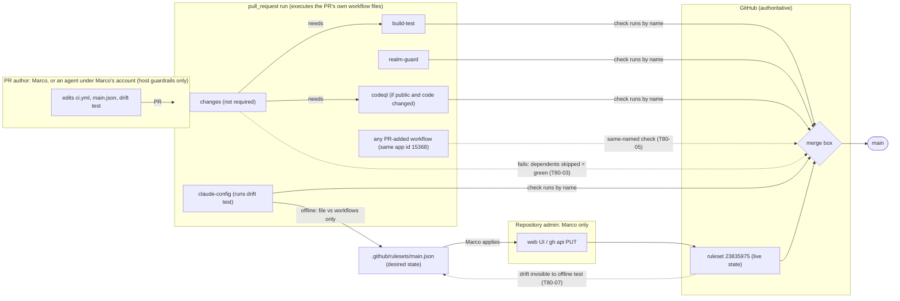

<!-- gate: G3 | verdict: PASS-WITH-NOTES | issue: #80 -->
# Threat delta: enforce the `main` ruleset, keep it as code, detect drift (issue #80)

- Scope (manifest `docs/ai/pipeline/80.md`, class ci-tooling, host run):
  1. `.github/rulesets/main.json`: the `main` ruleset (id 23835975) as a `gh api` PUT body with enforcement `active`.
  2. A stdlib-only, offline drift test in `.claude/tests/` that checks the file against `.github/workflows/*.yml`.
  3. A runbook section on applying and verifying the ruleset (VS 2026 web UI path and `gh api`).
- Baselines: `realm-guard-scope.md` (#77: G4-77-12 always-run `realm-guard`, G6-77-05 "no `needs`, no `if`"), `pre-push-ci-parity.md` (#59), `claude-config.md` (cc:T-01 and cc:T-02: hooks are guardrails). New threats use T80-xx, requirements G4-80-xx, follow-ups F-80-x.
- What the ruleset protects: it is the only **enforced** control on the trust boundary **PR author (Marco, or an agent running under Marco's account) → `main`**. Before 2026-09-27 its enforcement was `disabled`, so every CI gate, the secret scan and commitlint included, only advised. Enforcement now turns those checks into merge conditions. That makes it matter what a passing required check actually proves.
- ASVS 5.0 is mapped by analogy at section level, as in the baselines: V13.1 and V13.2 configuration documentation and backend configuration, V15.1 to V15.3 secure-coding documentation, dependencies and architecture, defensive coding, V8.2 authorization design (who may change the ruleset), V16.2 security event logging (the ruleset change trail). Check the numbers against the official 5.0 text before you copy them into a compliance artefact.
- Reviewer: security-reviewer agent, 2026-09-27. Mode: G3, before G4. Evidence comes from reading `.github/workflows/ci.yml`, `claude-review.yml`, `dependabot.yml`, `.claude/scripts/gates.py` and `.claude/hooks/agent_boundaries.py` on `issue/80-main-ruleset` at `84313fc`. The agent guardrail denies `gh api` to this agent, so I did **not** read the live ruleset. Its shape comes from the brief and the manifest (Marco's export, 2026-09-27).

## Verdict

**PASS-WITH-NOTES.** Enforcing the ruleset and keeping it as code is the right move. Two Highs remain open if the plan is implemented as worded. Each is closed by a MUST below.

1. **A skipped required job counts as passing (T80-03, High).** GitHub reports a job skipped by its job-level `if` **or by a failed `needs` dependency** as a success, and that success satisfies the required check. `build-test` and `codeql` both depend on `changes`, which is not required. If `changes` fails for any reason (runner fault, checkout error, a bad edit to the detect script), `build-test` is skipped. The PR then shows green with **no secret scan, no commitlint, no build and no tests**. The ruleset makes this fail-open matter. G4-80-03 closes it.
2. **A check can be dropped consistently from both files (T80-02, High).** The planned test checks file ↔ workflow consistency. Removing `realm-guard` from `main.json` **and** from `ci.yml` in the same PR keeps the test green, and after Marco applies the file the guard is gone. The test must pin a minimum set of required contexts, and the test and the file must be review-required paths (G4-80-02, G4-80-09).

Other findings:

- **The required checks run code the PR controls (T80-05, Medium, residual accepted).** `pull_request` workflows run the PR's own copy of `ci.yml`. A PR can edit `realm-guard` to `exit 0`, or add a workflow whose job is named `realm-guard`. Pinning `integration_id` 15368 only rules out other apps and user-token statuses. Every workflow in the repository reports as that same app. The ruleset proves "a GitHub Actions check named X passed", not "main's definition of X ran". The controls are Marco's review of workflow diffs, forced G3 and G6 on workflow paths, and a uniqueness test for accidental collisions (G4-80-05, 06).
- **A rename or deletion of a required job blocks every merge (T80-01, Medium, fails closed).** The old context never reports and stays "Expected". This is safe but needs a documented order of operations (G4-80-10).
- **The gates step only runs on `issue/*` branches (T80-08, Medium, pre-existing).** A PR from any other branch passes the now-required `claude-config` without a gate check, forced G3 and G6 included (SHOULD G4-80-13).
- **The file cannot see live state (T80-07, Medium).** A manual live verification is a MUST. A scheduled read-only comparison is a SHOULD. No admin token may ever be placed in CI (G4-80-11, 12).
- **`codeql` never runs while the repository is private (T80-04, Low).** The context is required but always skipped, so it is always green. The file and the runbook must say so, and the skip must be pinned as intended.

No High is left without a mitigation. G6 checks every MUST against the diff.

## Evidence (code reading, 2026-09-27)

- `ci.yml:3-6`: triggers are `pull_request` (no `paths`/`branches` filter) and `push` to `main`. There is no `pull_request_target`. Top-level `permissions` are `contents: read` and `security-events: write`.
- Job-level shape of the four required contexts. No job sets `name:`, so the check name is the job id. None uses `strategy.matrix` or a reusable workflow.

  | Job | `needs` | job-level `if` | Consequence |
  | --- | --- | --- | --- |
  | `build-test` | `changes` | none | skipped (= green) if `changes` fails (T80-03); steps skip by lane (docs-only PRs build nothing, by design) |
  | `realm-guard` | none | none | unconditional (G6-77-05) |
  | `claude-config` | none | none | unconditional; its `Pipeline gates` step runs only on `issue/*` heads (T80-08) |
  | `codeql` | `changes` | public repo **and** dotnet or spa changed | skipped (= green) on a private repo, on docs-only PRs, and if `changes` fails |

- `changes` is not a required context. `zap-baseline` has `if: false` and `needs: build-test`; it is not required, and it would be green forever if it were ever added (T80-03).
- `concurrency.cancel-in-progress: true`: a superseded run is cancelled on the old head SHA. The new SHA gets a fresh run, so this has no effect on the merge decision.
- `claude-review.yml`: runs on `issue_comment` and `pull_request_review_comment`, job `review`, with `pull-requests: write`, `issues: write` and `id-token: write`. It has no `checks` or `statuses` write, so it cannot post a check named like a required context today.
- `gates.py:313-319` `REVIEW_REQUIRED_PATHS` covers `.github/workflows/*.yml` but not `.github/rulesets/**` or a new `.claude/tests/test_ruleset*.py`.
- `agent_boundaries.py:47` denies every `gh api` (and `gh secret`, `gh variable`, `gh repo edit`, `gh pr merge`) for agents. This is a guardrail (cc:T-02): `curl` with a token, or a subprocess from Python, gets around it. It also means the drift test must not call `gh`. It must be offline.
- `dependabot.yml` sets no `commit-message` prefix. Dependabot infers one from history, and grouped or long package-name headers can exceed commitlint's 100-character limit (T80-10).

## Data flow and trust boundaries (delta)

- **B1, author → main.** The ruleset is the enforcement point, but the checks it requires run on author-controlled workflow code (T80-05).
- **B2, repository admin → ruleset.** Only Marco holds admin. An agent on the host shares his `gh` credentials, and only a guardrail stands in its way (T80-06).
- **B3, desired state (file) ↔ live state.** No automated control connects them today (T80-07).

## Threats

| Id | Element / flow | STRIDE | Threat | Severity | Mitigation | ASVS 5.0 id | Status |
| --- | --- | --- | --- | --- | --- | --- | --- |
| T80-01 | Required contexts ↔ job ids | D | A required job is renamed, deleted or gets a `name:`, matrix or reusable-workflow wrapper. The old context never reports, and every PR, including the fix, is blocked until Marco edits the ruleset. This fails closed. | Medium | The drift test maps every context to exactly one job id in a `pull_request`-triggered workflow, with no `name:` override, matrix or `uses:` (G4-80-04). The runbook gives the rename order: add the new context, merge, remove the old one (G4-80-10). | V13.1, V15.3 | Mitigated by requirements |
| T80-02 | `main.json` + drift test | T, R | A check is silently dropped. Removing a context from both the file and the workflow (or weakening the test) keeps CI green. Once applied, the guard is gone. | High | The test pins a floor set `{build-test, claude-config, codeql, realm-guard}`; the file must contain at least that (G4-80-02). The file and the test are `REVIEW_REQUIRED_PATHS`, so G3 and G6 run on any edit (G4-80-09). The live check catches an unapplied or hand-edited ruleset (G4-80-11). | V13.2, V15.1, V15.3 | Mitigated by requirements |
| T80-03 | Skipped-job semantics, `needs: changes` | T, E | A skipped job reports success and satisfies the required check. If `changes` fails, `build-test` (secret scan, commitlint, build, tests) and `codeql` are skipped, and the PR is green and mergeable. The same holds for any future job-level `if` on a required job, or for adding `zap-baseline` (`if: false`) to the ruleset. | High | Close the `needs` gap (G4-80-03). Allow a job-level `if` only on a pinned skip-safe list (`codeql`, with its reason), and never a constant-false `if` (G4-80-04). | V15.3, V13.2 | Mitigated by requirements |
| T80-04 | `codeql` context | R | On a private repository, or on a PR without code changes, `codeql` is always skipped and always green. The ruleset suggests an assurance it does not give. When 0.16 deletes the job, the context blocks every merge (T80-01). | Low | Record `codeql` as skip-safe with the reason in the test and the runbook (G4-80-04, G4-80-10). #28 (0.16) removes or enables the context together with the ruleset (F-80-1). | V13.1 | Mitigated by requirements; F-80-1 |
| T80-05 | Required checks run PR-controlled workflows | S, T | A PR edits `ci.yml` (for example, the `realm-guard` step becomes `exit 0`), or adds a `pull_request` workflow with a job named `realm-guard`, or grants `checks: write` or `statuses: write` and posts a success. All of these come from app 15368, so `integration_id` pinning does not tell them apart. With duplicate names, GitHub does not document which check run wins. Fork PRs (if the repository is public) can do the same with a read-only token. | Medium | Keep `integration_id` 15368 on every context, which stops other apps and user-PAT statuses (G4-80-01). Every required context name is unique across `.github/workflows/*`. No workflow grants `checks: write`, `statuses: write` or `write-all`, and none uses `pull_request_target` (G4-80-05, 06). Workflow diffs are review-required (existing `REVIEW_REQUIRED_PATHS`). Marco reads every `.github/workflows/**` hunk before merging (runbook, G4-80-10). Residual: a deliberate edit by the author is caught only by review. Org-level "required workflows" is not available to a personal-account repository. Accepted for a solo repository. | V15.2, V15.3, V13.2 | Mitigated (residual accepted) |
| T80-06 | Ruleset administration (B2) | E, T | An agent, whether prompt-injected or mistaken, disables enforcement, adds a bypass actor or removes a context. It could do this with Marco's host `gh` token via `curl` or Python (the `gh api` deny is a guardrail), or by "applying" `main.json` itself. | Medium | Only Marco applies: agents never call the rulesets API, and the runbook and the devops agent text say so (G4-80-08). The `agent.gh-destructive` deny stays. The live check detects changes (G4-80-11). GitHub's security log records ruleset changes (runbook pointer). | V8.2, V16.2, V13.2 | Mitigated by requirements (guardrail + detective) |
| T80-07 | Desired ↔ live drift (B3) | T, R | The live ruleset changes (enforcement back to `disabled`, a context removed through the UI, a bypass actor added) while `main.json` and the offline test stay green. Or the file is changed but never applied. | Medium | MUST: a manual read-only live verification in the runbook, run after every apply and at each phase exit (G4-80-11). SHOULD: a scheduled `main`-only workflow compares `GET /repos/{o}/{r}/rules/branches/main` with the file using `GITHUB_TOKEN` and read-only permissions; it is never a PR check and never uses an admin PAT (G4-80-12). | V13.1, V16.2 | Mitigated by requirements; SHOULD or F-80-2 |
| T80-08 | `claude-config` gates step | E, R | `Pipeline gates` runs only when the head ref starts with `issue/`. A PR from `fix/x` passes the required `claude-config` with no gate check, so forced G3 and G6 on workflow or ruleset paths are skipped too. Pre-existing, made more relevant because `claude-config` is now a merge condition. | Medium | SHOULD G4-80-13: fail for heads that are neither `issue/<n>-*` nor a Dependabot PR (author `dependabot[bot]`), or F-80-3. | V15.3, V13.2 | SHOULD or F-80-3 |
| T80-09 | `main.json` as `gh api` input | T | Applying the file with `bypass_actors` omitted leaves the existing live bypass list unchanged, so a bypass actor added through the UI survives a "re-apply". Read-only fields (`id`, `source`, `node_id`, `_links`, `created_at`, `updated_at`, `current_user_can_bypass`) break the PUT or tempt a hand edit. | Medium | The file carries `"bypass_actors": []` explicitly and only input keys; the test checks both (G4-80-01). | V13.2 | Mitigated by requirements |
| T80-10 | Dependabot PRs under enforcement | D | Dependabot PRs must now pass all four checks. A header over 100 characters or with the wrong case fails commitlint, and `strict` makes every open Dependabot PR out of date after each merge. `github-actions` bumps change `ci.yml`, so the new action version runs inside the required checks (supply chain; tags not SHA-pinned, #28). Dependabot pushes nothing to `main` directly (the `pull_request` rule). | Low | SHOULD G4-80-14 (`commit-message` prefix in `dependabot.yml`). SHA pinning stays with #28 (0.16). The runbook notes `@dependabot rebase` for strict. | V15.2 | SHOULD; #28 |
| T80-11 | Merge methods | R | A squash merge uses the PR title as the commit subject, and commitlint lints only the PR's commits, so a non-conventional subject can reach `main`. Informational, not a security boundary. | Low | Info: the G7 PR body already sets the title. Optional: restrict `allowed_merge_methods` later. Not required in #80. | V15.1 | Accepted |
| T80-12 | Workflow trigger filters | D | Adding `paths`, `paths-ignore` or `branches` to `ci.yml`'s `pull_request` trigger means the workflow never runs on some PRs, so required checks stay "Expected" (blocked; fails closed, but it invites someone to disable enforcement to get unstuck). | Low | The drift test asserts that the workflow hosting the required jobs has an unfiltered `pull_request` trigger (G4-80-04). | V15.3 | Mitigated by requirements |

## Answers to the questions in the brief

- **A job rename or a silently dropped check.** A rename fails closed (T80-01), and the offline test catches it before merge. A drop fails open unless the test pins a floor set and edits to it are review-required (T80-02, G4-80-02, 09).
- **Name collisions and `integration_id`.** Pinning 15368 excludes other apps and user or PAT commit statuses. It does **not** exclude another workflow in the same repository, including one added by the PR, because all Actions workflows report as app 15368. Yes, a PR can add a `pull_request` workflow that reports `realm-guard`. It can equally just edit `ci.yml`. Controls: uniqueness and permission tests against accidents (G4-80-05, 06), and review plus forced G3 and G6 against intent. Residual accepted (T80-05).
- **Skipped jobs.** A skip is a pass. `codeql` skips on a private repository, on no-code PRs, and on a failed `changes` job. `build-test` has no job-level `if` but **is** skipped when `changes` fails, which is the High in T80-03. A PR can make any required job skip by editing `ci.yml`. Without such an edit, the only skip path is a `changes` failure. Step-level lane skips inside `build-test` (docs-only PRs build nothing) are intended and tested by #77's parity tests.
- **Strict policy.** Keep it. It makes the checks that passed apply to the merge result with the current `main`. It costs a rebase per merge, which matters mostly for Dependabot (T80-10).
- **File vs live drift.** The offline test cannot see live state. MUST: a manual read-only verification using Marco's own login (G4-80-11). SHOULD: a scheduled, `main`-only job with `GITHUB_TOKEN` (`permissions: contents: read`; `rules/branches/main` needs only metadata read and shows only **active** rules, so a disabled ruleset shows up as missing rules). Bypass actors are not visible to `GITHUB_TOKEN`, so they stay in the manual check. Never store an Administration-scoped PAT as an Actions secret for this (G4-80-12).
- **Who changes the ruleset.** Marco, as the only admin, through the web UI or `gh api`. Agents edit `main.json` (devops lane) and the test (main session), and never apply them (T80-06, G4-80-08).
- **Dependabot.** Under the ruleset like any PR. The gates step exempts it by branch name today, which G4-80-13 tightens to author identity. Commit-message friction is covered by G4-80-14.

## Requirements for G4

MUST:

- **G4-80-01 (file shape).** `.github/rulesets/main.json` is a valid PUT body for `repos/{owner}/{repo}/rulesets/{id}`:
  - it holds only input keys: `name`, `target`, `enforcement`, `bypass_actors`, `conditions`, `rules`. There is no `id`, `source`, `source_type`, `node_id`, `_links`, `created_at`, `updated_at` or `current_user_can_bypass`;
  - `enforcement` is `"active"`;
  - `bypass_actors` is present and exactly `[]`;
  - `target` is `"branch"`, and `conditions.ref_name.include` is `["~DEFAULT_BRANCH"]` with an empty `exclude`;
  - the rules include `deletion` and `non_fast_forward`;
  - `pull_request` has `required_approving_review_count` 0 (a solo author cannot approve their own PR), `required_review_thread_resolution` true and `dismiss_stale_reviews_on_push` true;
  - `required_status_checks` has `strict_required_status_checks_policy` true and `do_not_enforce_on_create` false (or absent), and **every** entry carries `integration_id: 15368`;
  - apart from `enforcement`, the file matches Marco's 2026-09-27 export, or it records the one deviation G4-80-03 option (a) introduces. It holds no secrets or tokens.
- **G4-80-02 (floor set).** The test holds a literal floor set `{build-test, claude-config, codeql, realm-guard}` and fails if any is missing from the file. Adding contexts is allowed. Removing one needs a test edit, and that makes it review-required (G4-80-09).
- **G4-80-03 (no skip-through-`needs`).** Choose one option and record the choice in G4 evidence:
  - (a) **preferred:** add `changes` to the required contexts, and the test asserts that the transitive `needs` closure of every required job is itself required. Marco applies the new context. The Done-when's "matches the live ruleset except `enforcement`" then also lists `changes`. The orchestrator raises this with Marco.
  - (b) give `build-test` and `codeql` `if: ${{ !cancelled() && ... }}`, with a first step that fails unless `needs.changes.result == 'success'`. The test asserts this guard for every required job that has `needs`.
- **G4-80-04 (job-context mapping).** For each required context, the test finds exactly one job with that id in a workflow whose `on:` includes `pull_request`, and asserts that the job:
  - sets no `name:`, or a `name:` equal to its id;
  - uses no `strategy.matrix` and is not a reusable-workflow `uses:` job;
  - has no job-level `if`, unless its id is on the pinned skip-safe map `{codeql: "GHAS: runs only on a public repository and on code changes"}`. Any constant-false `if` fails regardless;
  - lives in a workflow whose `pull_request` trigger has no `paths`, `paths-ignore`, `branches` or `branches-ignore`;
  - for `realm-guard` and `claude-config`, has neither `needs` nor `if` (G6-77-05).

  Parsing must use the standard library only. Read `jobs:` by indentation and fail **closed** on anything the parser does not understand: anchors or aliases (`&`, `*`, `<<:`), flow-style `jobs`, tabs. Cover the parser itself with fixture rows.
- **G4-80-05 (unique check names).** Across every `.github/workflows/*.y*ml`, each required context appears as the check name (job `name:` or id) of exactly one job.
- **G4-80-06 (no status forgery permissions).** No workflow, at top level or in any job, grants `checks: write`, `statuses: write`, `write-all` or `permissions: write-all`, and no workflow triggers on `pull_request_target`.
- **G4-80-07 (offline and pure).** The test makes no network call and no `gh`, `git` remote or `curl` subprocess. The guardrail denies `gh api` to agents anyway. It reads only repository files.
- **G4-80-08 (authority).** The runbook and `.claude/agents/devops.md` (or the file that defines the devops lane) state that only Marco applies or changes the live ruleset, and that agents never call the rulesets or branch-protection API. The `agent.gh-destructive` deny in `agent_boundaries.py` stays unchanged.
- **G4-80-09 (review-required paths).** Extend `gates.py` `REVIEW_REQUIRED_PATHS` with `\.github/rulesets/.+\.json` and the drift-test file (for example `\.claude/tests/test_ruleset\.py`), and add rows to `test_gates.py`.
- **G4-80-10 (runbook).** Put a section in `docs/runbooks/` (VS 2026 path and CLI, side by side). It covers:
  - apply: web UI (Settings → Rules → Rulesets → `main` → Import/Edit), and CLI `gh api -X PUT repos/mpcs2013/decisya/rulesets/23835975 --input .github/rulesets/main.json`;
  - verify (G4-80-11);
  - the rename order (add the new context, merge, remove the old one);
  - `codeql` is skip-safe and is removed or enabled together with #28;
  - break-glass: set enforcement to `disabled`, fix, set it back to `active`, re-verify, and record it in the issue;
  - read every `.github/workflows/**` hunk before merging (T80-05);
  - Dependabot `@dependabot rebase` under strict;
  - the GitHub security log as the change trail.
- **G4-80-11 (live verification, manual).** Marco runs these read-only checks after each apply and at each phase exit:
  - `gh api repos/mpcs2013/decisya/rules/branches/main` must list `deletion`, `non_fast_forward`, `pull_request` and `required_status_checks` with the floor set;
  - `gh api repos/mpcs2013/decisya/rulesets/23835975` must show `enforcement: active` and `bypass_actors: []`;
  - a throwaway PR with a failing required check shows "Merging is blocked".

  Record the output in G4 evidence (Done when, item 4).
- **G4-80-15 (red cases, recorded in G4 evidence).** Each case mutates an **in-memory copy** of the file or of the workflow text (never the real files), must fail with a message that names the rule, and has its command and output recorded:
  1. a required job renamed in `ci.yml` (`realm-guard` → `realm-guard2`);
  2. a required job removed;
  3. a floor context removed from the file only, and from both file and workflow (G4-80-02);
  4. `enforcement` set to `disabled`, and to `evaluate`;
  5. a bypass actor added, and `bypass_actors` key absent;
  6. `required_approving_review_count` set to 1;
  7. `deletion` removed; `non_fast_forward` removed;
  8. `integration_id` removed or changed on one context;
  9. `strict_required_status_checks_policy` false;
  10. a job-level `if` added to `build-test`; `zap-baseline` added to the file (constant-false `if`);
  11. G4-80-03: under (a), `changes` removed from the file; under (b), the `needs.changes.result` guard removed;
  12. a second workflow with a job `realm-guard`; a `name: realm-guard` on another job;
  13. `checks: write` added to a job; a `pull_request_target` trigger added;
  14. `paths-ignore` added to `ci.yml`'s `pull_request` trigger;
  15. a read-only key (`id`) present in the file;
  16. parser fail-closed: a YAML anchor in `jobs`.

  Also show the real repository passing, with CLI `python -m unittest discover -s .claude/tests -p "test_*.py"` and VS 2026 Test Explorer (Python) or the Terminal path.

SHOULD:

- **G4-80-12 (scheduled live check).** Add a workflow on `schedule` and `workflow_dispatch` only, never `pull_request`, with `permissions: contents: read`. It calls `GET /repos/{o}/{r}/rules/branches/main` with `GITHUB_TOKEN` and compares it with `main.json`: rule types, required contexts with `integration_id`, strict, and the `pull_request` parameters. Missing rules mean a disabled or deleted ruleset. On a mismatch it fails, and Actions emails Marco. It must not become a required context, and no Administration-scoped PAT or secret may be added. If it is not taken, open F-80-2.
- **G4-80-13 (gates on every branch, T80-08).** In `claude-config`, run `gates.py` for `issue/<n>-*` heads. Fail every other `pull_request` head except Dependabot, identified by `github.event.pull_request.user.login == 'dependabot[bot]'` and not only by branch name. If it is not taken, open F-80-3.
- **G4-80-14 (Dependabot commit messages, T80-10).** Set `commit-message: { prefix: "chore", include: "scope" }` on each `dependabot.yml` entry, and check with the local commitlint mirror that a long NuGet bump header stays at 100 characters or less. If it does not, note it in the runbook.

## Follow-ups

| Id | Target | What it carries |
| --- | --- | --- |
| F-80-1 | #28 (0.16, CI hardening) | T80-04: when CodeQL is enabled or the job deleted, update `main.json`, the floor set and the skip-safe map in the same PR, following the runbook's rename order. Also SHA-pin actions (T80-10). |
| F-80-2 | New issue, if G4-80-12 is not taken | T80-07: scheduled read-only live ruleset comparison. |
| F-80-3 | New issue, if G4-80-13 is not taken | T80-08: gates step fails closed for non-issue, non-Dependabot PR heads. |

## Residual risk after #80

- Required checks prove that a job **name** passed in GitHub Actions, not that `main`'s definition of it ran. A workflow edit by the PR author is caught only by Marco's review and the forced G3 and G6 (T80-05).
- Agents share Marco's host credentials. Keeping them away from the rulesets API is a guardrail plus detection, not a boundary (T80-06, cc:T-02).
- Between live verifications, drift is invisible unless G4-80-12 lands (T80-07).
