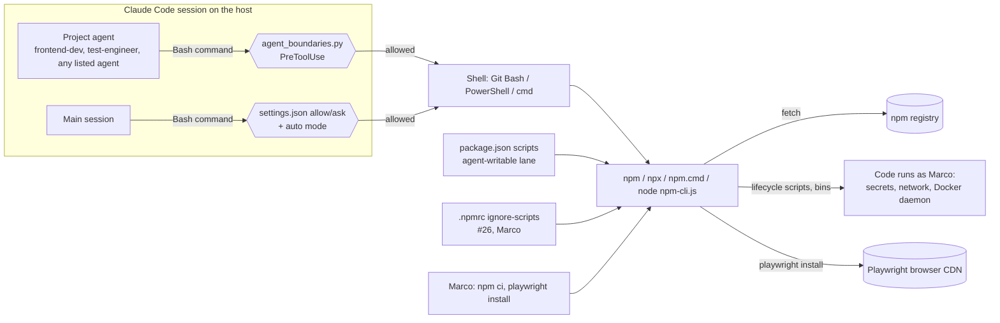

<!-- gate: G3 | verdict: PASS-WITH-NOTES | issue: #58 -->
# Threat delta: npm install guard for project agents (issue #58)

- Scope: the `agent_boundaries.py` Bash policy for npm, npx and other JavaScript package managers, its tests in `.claude/tests/test_hooks.py`, and removing `Bash(npm ci*)` from `.claude/agents/frontend-dev.md`. `.npmrc` (`ignore-scripts=true`) lands with #26, created by Marco. This document is a delta against `docs/security/threat-models/host-development-default.md` (cited as **hd:**, gap (b), FU-1, open item 2) and `claude-config.md` (**cc:**). It is not a full model.
- Mode: G3, before any code. Change class ci-tooling, Full tier, runs on the **host** (manifest). The rating uses the host boundary: on a host run, an install runs dependency code as Marco (hd:H-1).
- Reviewer: security-reviewer agent, 2026-10-03.
- Evidence comes from the installed toolchain (Node v26.10.0, npm 11.19.1): `node_modules/npm/lib/utils/cmd-list.js` and `docs/content/using-npm/config.md`, `docs/content/commands/npm-exec.md`.

## Verdict

**PASS-WITH-NOTES.** The plan closes gap (b) if the npm rule is an **allow-list**, not the deny-list of verbs sketched in the plan. npm resolves any unique prefix of a command name (via `abbrev`), camelCase forms (`installTest`) and about 40 aliases (`i`, `in`, `isntall`, `add`, `it`, `cit`, `sit`, `ic`, `clean-install`, `x`, `create`, `innit`, `up`, `udpate`, `rb`, ...). A verb deny-list cannot follow that. Docker went the same way for the same reason (#74 R-02). With M1 to M5 below, nothing High stays open, and gap (b) goes from "High once the SPA exists" to **Low** (a guardrail, as CLAUDE.md says). The ordering condition from hd: open item 2 moves to #26 as carry-forward C-1.

## Data flow

Trust boundaries: TB-a, agent intent to the shell (the hook is the only check, because the frontmatter `tools:` patterns do not restrict, see cc:T-02, confirmed again in this run); TB-b, npm to the registry and CDN (supply chain); TB-c, `package.json`/`.npmrc` (agent-writable data) into npm behaviour.

## Questions from the brief

1. **Do `npm run` pre/post scripts need `ignore-scripts`?** The installed npm 11 docs say that with `ignore-scripts=true`, `npm run`, `npm test`, `npm start` and similar still run **the named script, but no `pre`/`post` scripts**. Install lifecycles (`preinstall`, `install`, `postinstall`, `prepare`) of the root package and of every dependency are skipped too. So the `.npmrc` from #26 covers `pre`/`post`; nothing more is needed. What `ignore-scripts` does **not** stop: the named script itself, and dependency code that the script loads (vite, eslint plugins, playwright). That is hd:H-1 (code runs as Marco) and is accepted there. The review point that protects it is between Marco's `npm ci` and the first `npm run` (`npm audit` plus the lockfile diff, hd: gap (d)).
2. **Is `npx playwright install` acceptable?** For Marco, yes. It downloads browser builds pinned by the locked Playwright version from the Playwright CDN over TLS, and it runs no npm lifecycle script. For agents, no. It is an install, and the plan says Marco runs installs. On Linux (the sandbox), `--with-deps` / `install-deps` runs the package manager with `sudo`. Rated Low; covered by M2.
3. **Does the plan's allow-listed `npx` fetch?** Yes, which matters more. Claude Code's Bash is not a TTY, and npm-exec documents that "when standard input is not a TTY ... `--yes` is assumed". So `npx tsc`, run before `npm ci` or outside `src/Decisya.Web`, downloads and runs the unrelated `tsc` package from the registry. `npx playwright` fetches `playwright@latest`. `npx -p <any> tsc`, `npx --package=<any> eslint`, `npx playwright-<x>` and `npx tsc@<v>` all fetch whatever is named. See N-04 and M2.
4. **Ordering until `.npmrc` exists.** Today the tree has no SPA. The only npm project is `.devcontainer/claude/package.json`; the hook must cover it too (an `npm ci --prefix .devcontainer/claude` by an agent runs install scripts as Marco). Once #58 merges, agents cannot install anywhere, so the remaining window is Marco's own first `npm install` in #26 (C-1).

## Threats

| Id | Element / flow | STRIDE | Threat | Severity | Mitigation | ASVS 5.0 id | Status |
| --- | --- | --- | --- | --- | --- | --- | --- |
| N-01 | Agent → npm (TB-a) | T, E | A deny-list of verbs misses aliases, prefixes and camelCase (`npm isnt`, `npm insta`, `npm install-cl`, `npm installTest`, `npm sit`), plus the other fetching or script-running commands: `exec`/`x`, `init`/`create <pkg>`, `update`/`up`, `dedupe`, `rebuild`/`rb`, `install-test`, `install-ci-test`, `install-scripts`, `approve-scripts`, `link`, `explore`, `pkg set` (edits `package.json` outside the C2 ask rule), `audit fix` (reached through the allowed `npm audit`), and global flags before the verb (`npm --prefix x i`, `npm --prefix run install`). | High once the SPA exists (hd: gap (b)) | **M1** | V15.2, V8.2 (deny by default), V2.2 (allow-list) | Mitigated by requirement |
| N-02 | Command shape (TB-a) | T | Chaining and wrappers: `&&`, `;`, `\|`, newline, `$(...)`, backticks, `cmd /c npm i`, `powershell -c "npm i"`, `env`/`command`/`xargs`/`time npm i`, `npm${IFS}i`, `n''pm i`, `n\pm i`. | Medium | **M1**: reuse the parser shape of `docker_subcommands` (split on every separator, strip quotes and backslashes, check every npm token in every segment, two backslash views). An empty or unparseable subcommand is denied. | V2.2, V1.2 | Mitigated by requirement |
| N-03 | Windows shims (TB-a) | T | `npm.cmd`, `npm.ps1`, `npx.cmd`, `"C:\Program Files\nodejs\npm.cmd" i`, and `node ...\node_modules\npm\bin\npm-cli.js install`. `_program()` strips only `.exe` today. | Medium | **M1**: normalise `.exe`, `.cmd`, `.ps1` and `.bat`, path-qualified names, and `npm-cli.js`/`npx-cli.js` to `npm`/`npx`. | V2.2 | Mitigated by requirement |
| N-04 | Allow-listed `npx` (TB-b) | T, E | Under a non-TTY, `npx` assumes `--yes`, so `npx tsc`/`npx eslint`/`npx playwright` fetch and run from the registry whenever the bin is not local. No attacker is needed for the `tsc` case. `-p`/`--package`, `-c`/`--call`, `@version`, `playwright-<x>` and `--yes` name an arbitrary package. `npx playwright install` is an install. | Medium | **M2** | V15.2, V8.2 | Mitigated by requirement |
| N-05 | Other package managers (TB-a) | T, E | `pnpm`, `pnpx`, `yarn`, `yarnpkg`, `bun`, `bunx`, `corepack`, `deno` (`deno install`, `npm:` specifiers). None is on the host PATH today, and Node 26 no longer ships corepack, so each one first needs an install that M1 denies. | Low | **M3** | V15.2 | Mitigated by requirement |
| N-06 | `package.json` scripts (TB-c) | T, E | An agent adds `"setup": "npm i <pkg> && <pkg>"` and runs `npm run setup`. The hook sees only `npm run setup`. | Medium as found; Low on top of hd:H-1 (the script is agent-written code, which H-1 already accepts) | C2 (#56) asks on Edit/Write of `**/package.json`. M1 denies `npm pkg`. #26's G6 reviews `scripts` and `allowScripts`. `.npmrc` stops dependency lifecycles. Hook inspection of script bodies: **S3** (backlog). | V15.2, V13.1 | Accepted (guardrail) |
| N-07 | `npm run` pre/post scripts | T | `prebuild`/`postbuild` run around an allowed `npm run build`. | Low | `ignore-scripts=true` suppresses them (npm 11 docs, question 1). They are agent-written anyway (hd:H-1). | V15.2 | Mitigated with #26 |
| N-08 | Obfuscation and indirection | T, E | `$p i` with `p=npm`, base64, `node -e "child_process..."`, `python -c "subprocess..."`, an agent-written `.js`/`.ps1` that spawns npm. A string matcher cannot see these. | Medium (hd:H-1 class) | None in the hook, by design: CLAUDE.md treats the hooks as guardrails, not a security boundary. The bounds are hd:H-1's premise, the audit log and `git diff`. | V8.2 | Accepted (ADR-0011) |
| N-09 | Main session (TB-1) | E | The hook does not bind the main session (#39 decision). `npm ci`/`npm i` are not allowed in `settings.json`, so they prompt in default mode, but auto mode may approve them without asking. `Bash(npx playwright*)` is a prefix allow, so `npx playwright-<typo>` and a non-local `npx playwright` fetch with no prompt. | Low | **S1**, **S2** | V8.2, V13.1 | Open (SHOULD) |
| N-10 | Frontmatter `tools:` (cc:T-02) | E | `Bash(<pattern>)` in agent frontmatter does not restrict subagents (observed again in this run: `cat`, `sed`, `ls`, `grep` ran under the security-reviewer's git-only list). So **every** listed agent can try `npm i`, not just frontend-dev. Removing `Bash(npm ci*)` only records intent. | Medium (as in cc:T-02) | The hook rule applies to every listed agent (M1 to M3). The tests use a non-frontend agent too (M4). The frontmatter change states the intent (M5). | V8.2 | Mitigated by requirement |
| N-11 | `.npmrc` tampering (TB-c) | T | Through Bash, an agent writes `ignore-scripts=false`, `registry=`, `node-options=--require ...` or `script-shell=` into `.npmrc`. Note: `settings.json` has `**/.npmrc` under `ask`, not `deny` as the brief says. | Low | The Edit/Write ask (C2). `prepush.py` flags `.npmrc` as a sensitive path. G6 and `git diff`. Integrity hashes in the lockfile bound a registry swap. `node-options`/`script-shell` add only agent-chosen code (hd:H-1). | V13.1, V15.2 | Accepted |
| N-12 | Ordering (`.npmrc` after the first install) | T, E | Marco's first `npm install`/`npm create vite` in #26 runs with lifecycle scripts enabled if `.npmrc` is not there yet. `npm create vite@latest` itself fetches and runs `create-vite`. | High if the order is wrong; otherwise Low | **C-1** (carry-forward to #26); **S5** bridges the gap now. | V15.2 | Linked: #26 |
| N-13 | False positives (availability) | D | Token scanning denies commands that only mention `npm` as an argument (`grep -rn npm docs`). This run hit the same effect from the Docker rule: a `grep` whose pattern held the word was denied. | Low | Fail closed is correct. The deny reason should name the alternative: **S4**. | V16.3 | Open (SHOULD) |

## MUSTs for G4 (five)

- **M1, npm allow-list (N-01, N-02, N-03, N-10).** For a listed agent, find **every** `npm` invocation in the command with the same parser as `docker_subcommands`: split on `;&|\n()$\`<>{}`, delete quotes and backslashes (and also try the view with backslashes read as `/`), and normalise the program name: path stripped; `.exe`, `.cmd`, `.ps1` and `.bat` removed; `npm-cli.js` read as npm, `npx-cli.js` as npx. The **first** token after `npm` must be one of the following, exactly: `run`, `run-script`, `test`, `ls`, `outdated`, `audit`, `-v`, `--version`. Anything else is denied: flags before the verb, prefixes, aliases, an empty or missing verb. `audit` is denied when any later token is `fix`. Rule id e.g. `agent.npm`. The existing fail-closed path (G4-39-01) applies, with no fail-open branch.
- **M2, `npx` cannot fetch (N-04).** Pick one option and record it in the G4 evidence:
  - **(A, recommended)** Deny every `npx` invocation for listed agents. frontend-dev and test-engineer use `npm run <script>` (for example `typecheck`, `lint`, `test:e2e`), which #26 defines in `package.json`. `npm run` puts `node_modules/.bin` on the PATH and never fetches. This is the simplest rule to test, and it also covers `playwright install`.
  - **(B)** Allow only `npx --no <name> ...` (`--no-install` is accepted as its alias), where `<name>` is exactly `tsc`, `eslint` or `playwright` (no `@version`, no suffix). No other flag may come between `npx` and the name, so `-p`, `--package`, `-c`, `--call`, `-y` and `--yes` are all denied. Arguments after the name pass through (`tsc -p tsconfig.json` is fine). Also deny `playwright install`, `install-deps` and `uninstall`. The npx-cli docs say all npx options must come before the first positional, which is what makes this check sound.
- **M3, other package managers (N-05).** Deny every invocation of `pnpm`, `pnpx`, `yarn`, `yarnpkg`, `bun`, `bunx`, `corepack` and `deno` for listed agents, using the same normalisation as M1. Do not keep a list of verbs for these.
- **M4, red/green tests (Done-when).** Red, as `backend-dev` **and** `frontend-dev` (N-10):
  - `npm i x`, `npm install`, `npm ci`, `npm add x`, `npm isnt x`, `npm insta x`, `npm installTest`, `npm sit`, `npm ic`, `npm clean-install`, `npm up`, `npm udpate`, `npm rb`, `npm rebuild`, `npm exec x`, `npm x x`, `npm create vite`, `npm init vite`, `npm pkg set scripts.a=b`, `npm audit fix`, `npm --prefix src/Decisya.Web ci`, `npm --prefix run install`, `npm ci --prefix .devcontainer/claude`;
  - `npm.cmd i x`, `npm.ps1 ci`, `"C:\Program Files\nodejs\npm.cmd" i x`, `node "C:/Program Files/nodejs/node_modules/npm/bin/npm-cli.js" install`;
  - `cd src/Decisya.Web && npm ci`, `npm run build; npm i x`, `echo | npm i x`, `cmd /c npm i x`, `powershell -c "npm i x"`, `env npm i x`, `$(npm i x)`, `n''pm i x`, `npm${IFS}i x`;
  - the M2 set: under (A), `npx tsc`, `npx eslint .`, `npx playwright test`; under (B), `npx tsc`, `npx -p evil tsc`, `npx --package=evil eslint`, `npx --no playwright-x`, `npx --no tsc@5`, `npx --yes tsc`, `npx --no playwright install`;
  - `pnpm add x`, `yarn`, `bunx x`, `corepack enable`.

  Green: `npm run build`, `npm run lint -- --fix`, `npm test`, `npm audit`, `npm audit --omit=dev`, `npm ls`, `npm --version`; under (B), also `npx --no tsc -p tsconfig.json` and `npx --no playwright test --project=firefox`.

  Main session: each red command returns no decision (`agent_type` empty). An unlisted agent is unchanged. With `_hooklib` missing, a listed agent's `npm i` is denied (the existing G6-39-10 test covers the mechanism). Every deny writes an audit entry without the command text (existing test pattern).
- **M5, agent frontmatter (N-10).** Remove `Bash(npm ci*)` from `frontend-dev.md`. Under M2 (A), also remove `Bash(npx playwright*)`, `Bash(npx tsc*)` and `Bash(npx eslint*)` from frontend-dev, and `Bash(npx playwright*)` from `test-engineer.md`. Add one line to the frontend-dev rules: "Installs (`npm ci`/`install`, `npx playwright install`, new packages) are Marco's: report what is needed."

## SHOULDs

| Id | Item | Disposition |
| --- | --- | --- |
| S1 | `settings.json` `Bash(npx playwright*)` is a prefix allow for every session (N-09). Under M2 (A), remove it. Under (B), narrow it to `Bash(npx --no playwright *)`. | **fix-now** if `settings.json` is touched for M2 (A); otherwise backlog #83 |
| S2 | Main session: add `permissions.ask` for `Bash(npm install*)`, `Bash(npm i *)`, `Bash(npm ci*)`, `Bash(npm exec*)` and `Bash(npx *)` so that auto mode still stops for Marco (the same approach as C2). Prefix rules cannot list every alias; this is best effort. | backlog #83 (the #39 decision keeps the main session on the normal flow) |
| S3 | For `npm run <s>`, the hook reads the target `package.json` script and denies install, exec or fetch verbs in it (N-06). | backlog #83 |
| S4 | The npm deny reason adds: "if `npm` is only an argument (for example to grep), use the Grep tool." The Docker reason can get the same hint (N-13). | **fix-now** (one string in the changed hook) |
| S5 | Marco, on the host and now: `npm config set ignore-scripts true` (user-level `%USERPROFILE%\.npmrc`). This closes N-12 until #26's project `.npmrc` exists. It does not affect sandbox image builds, which have their own npm config. | Marco action, no code |

## Carry-forward to #26 (its G3 should BLOCK if any item is missing)

- **C-1 (N-12):** #58 is merged before #26's G4 (hd: open item 2). `src/Decisya.Web/.npmrc` with `ignore-scripts=true` is created by Marco **before** the first `npm install`, or S5 is in place. Marco runs the scaffold; if he uses `npm create vite`, the version is pinned (`create-vite@<x.y.z>`).
- **C-2:** Check that the toolchain works with `ignore-scripts` (esbuild ships its binary as optional platform packages, so it should need no script). Any package that does need its script is rebuilt by Marco with `npm rebuild <pkg>`, and the PR body names it.
- **C-3:** Before the first `npm run`: `npm audit` and a read of the lockfile diff (hd: gap (d)).
- **C-4:** The first agent Edit of `src/Decisya.Web/package.json` doubles as the probe for hd: open item 1: the `**/package.json` ask rule must prompt for a subagent.
- **C-5:** #26's G6 reviews `package.json` `scripts` (no install, exec or fetch verbs, N-06) and any `allowScripts` field (npm 11 project-level script policy; it must not re-enable install scripts).
- **C-6:** Under M2 (A), #26 defines the `typecheck`, `lint` and `test:e2e` scripts that frontend-dev and test-engineer use.

## Residual after #58

Gap (b) is **Low**, as a guardrail. It returns to **Medium** (hd:H-1) through N-08 indirection, which this delta accepts as CLAUDE.md does. hd: open item 2 closes when #26's G3 confirms C-1.
