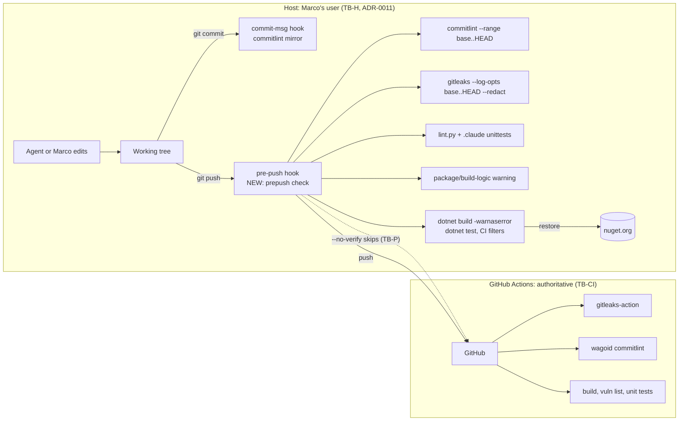

<!-- gate: G3 | verdict: PASS-WITH-NOTES | issue: #59 -->
# Threat delta: pre-push CI-parity check, package/build-logic warning, commitlint mirror fix, VersionOverride off (issue #59)

- Scope: issue #59, which is FU-2 of `docs/security/threat-models/host-development-default.md` (cited as **hd:**; gaps (a) and (d)). It also reopens H-09 of `docs/security/threat-models/claude-hooks-hardening.md` (cited as **#39**; G4-39-48 to 56). This is a delta, not a full model.
- Inputs read: manifest `docs/ai/pipeline/59.md`, `gh issue view 59`, `.pre-commit-config.yaml`, `.github/workflows/ci.yml`, `.github/dependabot.yml`, `.claude/scripts/commitlint.py`, `.claude/tests/fixtures/commitlint/` (including `make_golden.mjs` and `expected.json`), `.claude/tests/test_ci_changes.py`, `.gitleaks.toml`, `Directory.Build.props`, `Directory.Packages.props`, `global.json`, `dotnet-tools.json`.
- Mode: G3, before code. Change class ci-tooling. Runs on the **host** (ADR-0011). G4 is the main session. No Decisya application boundary changes.
- Reviewer: security-reviewer agent, 2026-09-26.

## Verdict

**PASS-WITH-NOTES.** Nothing here is High. The pre-push check is a **guardrail**: `git push --no-verify` skips it, and a clone where the hook was never installed does not run it. CI stays the authoritative gate, as H-09 already accepted. The check adds no execution capability beyond H-1 (hd:), because it builds and tests the same code the host already builds. The notes cover four things. (1) The check must verify what is actually pushed and must not print secrets. (2) Version parity (gitleaks, commitlint) is enforced by a test, not by memory. (3) `CentralPackageVersionOverrideEnabled=false` is only a default that a project file can override, so it needs a policy check. (4) Lock files are a follow-up, not part of #59.

## Data flow and trust boundaries

- **TB-P** (pre-push to remote) is a guardrail boundary. Nothing on the host can enforce it against the host user or an agent with Bash.
- **TB-CI** is the enforcement boundary. Every check the hook runs must stay in CI too. The hook mirrors CI and never replaces a CI step.

## Threats

ASVS 5.0 is mapped at section level by analogy (tooling, not application), as in the parent models.

| Id | Element / flow | STRIDE | Threat | Severity | Mitigation | ASVS 5.0 id | Status |
| --- | --- | --- | --- | --- | --- | --- | --- |
| P-01 | pre-push hook (TB-P) | T, R | `--no-verify`, an uninstalled hook (existing clones need `pre-commit install` again), or an edited `.git/hooks/pre-push` (untracked, agent-writable through Bash) skips the check. | Low | Guardrail by design. CI keeps every check (G4-59-01). Install covered by `default_install_hook_types`; detection by `prereqs.py`/`host-review.py` (G4-59-02). The `.git/hooks` edit folds into H-1. | V15.2 | Accepted bypass; CI authoritative |
| P-02 | pre-push runs build and tests | E | The hook runs `dotnet build`/`dotnet test` of repository code, including package `build/` targets, analyzers and generators. | Low (delta) | Same code and privilege as any host build, so no new capability beyond H-1. The hook runs only CI's unit filter (no Docker, no Keycloak), passes no secrets, fetches nothing beyond restore, and adds no remote hook repositories other than the pinned gitleaks (G4-59-03, 04). | V15.2 | Mitigated by requirements |
| P-03 | pre-push verifies the wrong tree | T | The build and tests run on the **working tree**, but the push sends **commits**. Uncommitted or staged edits, or pushing a ref other than `HEAD`, give a green result for code that is not pushed. | Low | Fail on tracked changes. Lint and scan the pushed range from the hook's refs. Skip or warn on non-HEAD pushes (G4-59-05, 06). | V15.2 | Mitigated by requirements |
| P-04 | Hook output to terminal and agent transcripts | I | Unredacted gitleaks output prints the secret itself. If the main session runs `git push`, the secret lands in `~/.claude/projects` transcripts, which persist. | Medium | `--redact` on every gitleaks call. No echo of the environment or config values. The hook prints findings, never matched content (G4-59-07). | V16, V13.3 | Mitigated by requirements |
| P-05 | Package or build-logic change (hd:(a), (d)) | T, E | A new package, `Import`, `Exec`, SDK reference or restore-source change is easy to miss before review. The warning makes it visible. It cannot prevent execution, because the host build already ran it (hd:(d)). | Medium (inherited) | Warning with a defined path and pattern set (G4-59-08 to 12). C1 and C2 from #56 remain the pre-execution control. | V15.2 | Mitigated; residual Medium accepted (ADR-0011) |
| P-06 | Warning evasion | T | Gaps in the warning: case variants (`nuget.config`), renames and deletions, files outside the list (`.pre-commit-config.yaml`, `.gitleaks.toml`, `BannedSymbols.txt`), or control characters in file names that hide lines in the terminal. | Low | Case-insensitive matching, `--no-renames`, the extended list, and sanitised output (G4-59-09, 11). | V15.2 | Mitigated by requirements |
| P-07 | CPM bypass in a project file | T | `CentralPackageVersionOverrideEnabled=false` in `Directory.Packages.props` is only a default. `Directory.Packages.props` is imported **before** the project body, so a `.csproj` can set it back to `true`, set `ManagePackageVersionsCentrally=false` and use `Version=`, or use `PackageDownload`/`GlobalPackageReference`. | Medium → Low | Property off, plus a policy check that the project body cannot override (G4-59-13 to 15). | V15.2 | Mitigated by requirements |
| P-08 | Restore integrity and audit | T | Without lock files, a changed transitive graph shows no diff and has no content-hash pin. NuGet audit behaviour under `-warnaserror` is implicit (SDK default). | Low | Make the audit explicit and record its observed behaviour (G4-59-16). Lock files and package source mapping go to a follow-up (FU-59-1). | V15.2, V13 | Partly in #59; FU-59-1 |
| P-09 | gitleaks version drift | I | Local v8.21.2 against CI 8.24.3: the older rules missed the #55 finding. One-sided bumps (Dependabot on the action, or a hand edit) bring the drift back silently, and `gitleaks-action` may change its default binary when the action tag moves. | Medium → Low | One explicit version on both sides and a parity test (G4-59-17 to 19). | V13.3 | Mitigated by requirements |
| P-10 | commitlint mirror drift (#39 H-09, recurred on #57) | T | The golden fixtures had no mixed-case first word. `_to_case("sentence-case")` lowercases the rest of the first word, which real commitlint 19 does not. The floating `wagoid/commitlint-github-action@v6` tag can also change the commitlint version under the fixtures. | Low (H-09), recurred | Fix the port, widen the fixture matrix (generated by the real tool), pin the tool version and tie it to `ci.yml` in a test, and add a differential check in CI (G4-59-20 to 24). | V15.2 | Mitigated by requirements |
| P-11 | `commitlint.py --range` argument | T | The range goes straight to `git rev-list`. A value that starts with `-` is read as an option. | Low | Validate the range or pass `--end-of-options` (G4-59-25). | V15.2 | Mitigated by requirements |
| P-12 | Hook cost | D | A slow hook on docs-only pushes invites `--no-verify` by habit. That wears down P-01's guardrail. | Low | Skip build and tests when CI would skip them, using CI's own ignore regex, checked by a parity test (G4-59-04). | V15.2 | Mitigated by requirements |

## Requirements for G4 (main session)

MUST unless marked SHOULD. Tests are red/green and are recorded in the manifest's G4 evidence.

### Pre-push check (P-01 to P-04, P-12)

- **G4-59-01 (guardrail, CI authoritative).** Everything the pre-push check runs is also in CI, and #59 removes nothing from CI. The hook's header comment and the runbook call it a guardrail that `--no-verify` bypasses. Evidence: the diff removes no CI step.
- **G4-59-02 (installed).** Add `pre-push` to `default_install_hook_types`. `prereqs.py` (or `host-review.py`) warns when `.git/hooks/pre-push` is missing or is not pre-commit's shim, and prints the fix (`pre-commit install`). Document both paths (VS 2026 has no UI for this, so say so; CLI `pre-commit install`).
- **G4-59-03 (local, pinned, no fetch).** The check is a `repo: local` hook, `language: system`, `stages: [pre-push]`, with the entry a committed script (for example `python .claude/scripts/prepush.py`). It adds no `additional_dependencies` and no new remote hook repository. It uses `subprocess` with argv lists only (`shell=False`) and passes no environment secrets. Its only network use is `dotnet restore` and, if G4-59-12 is taken, the vulnerable-package query.
- **G4-59-04 (CI's filters, CI's lanes).** Run `dotnet build -warnaserror`, then `dotnet test --no-build` with **exactly** CI's unit filters (`--filter-not-trait "Category=Integration" --filter-not-trait "Category=E2E" --filter-not-trait "Category=AppHost"`). Skip the dotnet steps when every changed file matches CI's `changes` ignore regex. A unittest (in the style of `test_ci_changes.py`) extracts the filter arguments and the ignore regex from `ci.yml` and asserts that the script uses the same strings. Parity then fails a test instead of drifting.
- **G4-59-05 (verify what is pushed).** Before the build, fail with a clear message (`git stash` or commit first) when tracked files differ from `HEAD`, staged or unstaged. Untracked files only warn.
- **G4-59-06 (ranges from the hook's refs).** Take the range from pre-commit's `PRE_COMMIT_FROM_REF`/`PRE_COMMIT_TO_REF` (or the pre-push stdin), with base = `git merge-base origin/main <to_ref>`. Commitlint, gitleaks and the warning use `<base>..<to_ref>`. Branch deletion (all-zero to_ref) is a no-op. When `<to_ref>` is not `HEAD`, lint and scan the range but report the build and tests as "not run: pushed ref is not HEAD", without a false pass. When `origin/main` is missing, fail closed with a message (fetch first). Do not silently lint zero commits.
- **G4-59-07 (no secret output).** Every gitleaks call uses `--redact` and the repository `.gitleaks.toml`. The script never prints environment variables, config values or file contents. Test: a fixture commit containing a fake token blocks the push, and the token string does not appear in the hook output.

### Package and build-logic warning (P-05, P-06)

- **G4-59-08 (warning, not blocking).** A match prints a warning block and exit 0. Rationale: legitimate changes are frequent (Dependabot, main-session package additions under C2), and a block would train `--no-verify`, which also skips gitleaks and commitlint. The warning states what it cannot do: the host build has already run the change (hd:(d)). It names the next step: review `git diff` of the listed files, and after a package change run `dotnet list package --vulnerable --include-transitive` (or `npm audit`). G7 copies the warning's file list into the PR body.
- **G4-59-09 (paths, case-insensitive, from `git diff --name-only --no-renames <base>..<to_ref>`, so deletions and both sides of a rename count).**
  - `Directory.Packages.props`, `Directory.Build.props`, `Directory.Build.targets`, `Directory.Build.rsp`, `Directory.Solution.props`, `Directory.Solution.targets`, and any `*.props`, `*.targets`, `*.rsp`;
  - `NuGet.config` (any case, any depth), `global.json`, `dotnet-tools.json` and `.config/dotnet-tools.json`;
  - `package.json`, `package-lock.json`, `.npmrc` (latent until the SPA, hd:(b));
  - `.pre-commit-config.yaml` (it controls what runs on commit and push), `.gitleaks.toml` (secret-scan allow-list), `BannedSymbols.txt` and `.globalconfig` (analyzer enforcement of invariant 4), and `.github/workflows/**` (sb:T-20).
- **G4-59-10 (patterns in `*.csproj` and `*.slnx`).** Warn when an added or removed diff line contains any of: `PackageReference`, `PackageVersion`, `VersionOverride`, `PackageDownload`, `GlobalPackageReference`, `Import`, `Sdk=` or `<Sdk`, `Exec`, `UsingTask`, `<Target`, `RestoreSources`, `RestoreAdditionalProjectSources`, `ManagePackageVersionsCentrally`, `CentralPackage`, `NuGetAudit`, `TreatWarningsAsErrors`, `WarningsNotAsErrors`, `NoWarn`. A `.csproj` change without these tokens does not warn, which keeps the warning meaningful.
- **G4-59-11 (safe output).** Print paths with control characters escaped (for example `repr` or `\x..`), one per line, each with the matched pattern.
- **G4-59-12 (SHOULD).** When the warning fires for a NuGet change, run `dotnet list package --vulnerable --include-transitive` in the hook and **block** on High or Critical, the same rule as CI.

### VersionOverride and CPM policy (P-07, P-08)

- **G4-59-13.** Set `<CentralPackageVersionOverrideEnabled>false</CentralPackageVersionOverrideEnabled>` next to `ManagePackageVersionsCentrally` in `Directory.Packages.props`. Red/green evidence: a scratch project with `VersionOverride` fails the build with the NuGet error code recorded verbatim (expected `NU1013`; report the actual code if it differs).
- **G4-59-14 (the default cannot be overridden).** Add a check that runs after the project body. Two acceptable forms: a target in `Directory.Build.targets` that errors when `$(ManagePackageVersionsCentrally)` is not `true` or `$(CentralPackageVersionOverrideEnabled)` is not `false`; or a repository test that scans every `*.csproj`/`*.props`/`*.targets` except the root `Directory.Packages.props` for those properties, `VersionOverride`, `PackageDownload` and `Version=` on a `PackageReference`. The build form is preferred, because it also runs in VS 2026, in pre-push and in CI. Red/green for each bypass named in P-07.
- **G4-59-15.** `CentralPackageTransitivePinningEnabled` stays `true`. The G4-59-14 check covers it too.
- **G4-59-16 (audit explicit).** Record in G4 evidence what the current build does when an advisory exists (NU1901 to NU1904 are errors under `TreatWarningsAsErrors`/`-warnaserror`, or they are not). Then set `NuGetAudit=true` and `NuGetAuditMode=all` explicitly in `Directory.Build.props`, so that an SDK default change or a project property cannot turn the audit off silently. Do not lower `NuGetAuditLevel` without a note to Marco. An audit failure at restore is the one package gate that runs **before** package build code, so it is worth keeping strict.

### gitleaks parity (P-09)

- **G4-59-17 (one version, exact).** Pin one exact version on both sides: `.pre-commit-config.yaml` `rev: v<X.Y.Z>`, and `GITLEAKS_VERSION: <X.Y.Z>` set explicitly in the `gitleaks-action` step's `env` in `ci.yml` (never `latest`, never the action's implicit default). Verify in G4 that `gitleaks-action@v3` honours `GITLEAKS_VERSION`, and paste the version line from one CI log into the evidence.
- **G4-59-18 (mismatch is a test failure).** A `.claude/tests` unittest parses both files and asserts that the versions are equal. It runs in CI's `claude-config` job (every change) and in the pre-push check, so a one-sided bump from Dependabot or by hand fails in both places.
- **G4-59-19 (keeping current).** Dependabot's `github-actions` ecosystem bumps the action tag but not the explicit `GITLEAKS_VERSION`. Check whether Dependabot's `pre-commit` ecosystem is available for this repository. If it is, add it (weekly). Its gitleaks PR then fails G4-59-18 until the `ci.yml` value is bumped in the same PR, which is the intended behaviour. If it is not available, add a one-line reminder next to the pin (bump both, then run the parity test). The pre-push gitleaks run reuses the pre-commit-managed binary (override `entry`/`args`/`stages` on the same `repo`/`rev`) instead of a second pin.

### commitlint mirror (P-10, P-11)

- **G4-59-20 (fix the port).** `sentence-case` upper-cases the first character and leaves the rest of the input unchanged, as commitlint 19 does. The golden output decides any remaining question (G4-39-52).
- **G4-59-21 (the #57 golden).** Add the #57 header (`feat(api): Decisya.Api skeleton…`, verbatim) as a fixture. Generate its `.expected` with `make_golden.mjs` and compare it with CI's log text for #57. If the two differ, that is drift evidence: record it and stop.
- **G4-59-22 (first-word matrix, generated by the real tool).** This fixes the gap for good. Add fixtures for the first-word shapes that `subject-case` distinguishes, and generate every `.expected` with the pinned commitlint, never by hand:
  - `Decisya.Api x`, `Api x`, `A x`, `API x`, `ApiClient x`, `apiClient x`, `api.Client x`;
  - a non-ASCII capital (`Ärger x`), a capital after a scope (`feat(Api): x`) and a capital after `!` (`feat!: X`);
  - a first word in quotes (`"Decisya" x`).

  The test then covers the case class, not only the one message that broke.
- **G4-59-23 (version tied to CI).** Pin `wagoid/commitlint-github-action` to an exact version (`v6.2.1`, the version `make_golden.mjs` documents) instead of the floating `@v6`. Record the source in `expected.json` or a sibling file (action version, `@commitlint/cli`, `@commitlint/config-conventional`). A unittest asserts that the `ci.yml` ref equals the recorded action version. A Dependabot bump of wagoid then fails until the goldens are regenerated with the new version. The SHA pinning in 0.16 must keep this test working (compare against the `# vX.Y.Z` comment).
- **G4-59-24 (SHOULD, differential check in CI).** In the PR job, run `commitlint.py --range <base>..<head>` next to wagoid on the same commits, and fail with "commitlint mirror drift" when the two verdicts differ. Wagoid itself stays the gate. This catches drift on real messages that no fixture anticipated. If the YAML gets awkward, file it as a follow-up and note the reason in G4 evidence.
- **G4-59-25.** `--range` rejects a value that starts with `-` or does not match `<rev>..<rev>`, or passes `--end-of-options` to `git rev-list`. G4-39-54 (no subprocess) stays true for the single-file hook path. The `--range` path, which already exists, is the only one that calls `git`, with argv lists.

## Follow-ups

| Id | Proposed issue | Covers | Rating |
| --- | --- | --- | --- |
| FU-59-1 | NuGet lock files (`RestorePackagesWithLockFile=true`, `dotnet restore --locked-mode` in CI and in pre-push), plus a `NuGet.config` with `<clear/>` and `packageSourceMapping`. The mapping is needed before any second feed is added. Check Dependabot's lock-file support first. | P-08: content-hash pinning, transitive changes visible in the diff, protection from dependency confusion | Low. Not needed to close #59: there is a single source (nuget.org, no `NuGet.config` in the tree), CPM with transitive pinning, and the explicit audit (G4-59-16). |
| FU-59-2 | Only if G4-59-24 is deferred: differential commitlint check in CI | P-10 | Low |

Marco files these, or declines them with a reason in the manifest. Neither blocks G4.

## Notes

1. hd:(d) is unchanged by #59. The pre-push check and the warning run **after** the host build. The only checks before execution remain C1 and C2 (#56) and, for known advisories, the restore-time audit (G4-59-16). The G6 review will check that no text in #59 claims otherwise.
2. The warning lists (G4-59-09, 10) are pattern guardrails, like the #39 hook, and do not form a boundary. Their value is in review: the file list goes into the PR body (G4-59-08).
3. G6 checks every G4-59-xx against the diff and against the red/green evidence in the manifest.
