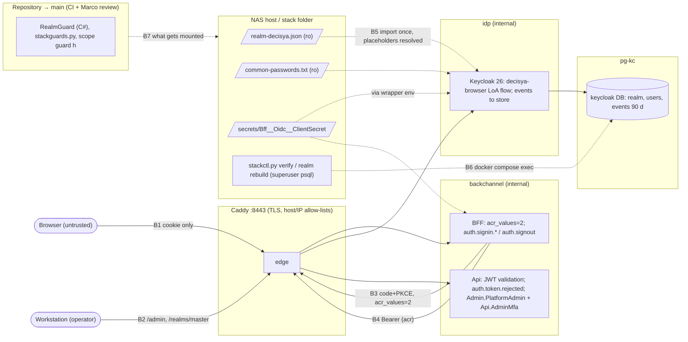

<!-- gate: G3 | verdict: PASS-WITH-NOTES | issue: #121 -->
# Threat delta: production identity: production realm, admin MFA, auth event logging (issue #121)

- Inputs: manifest `docs/ai/pipeline/121.md` (Q1 to Q8, Marco 2026-10-07), G1 `docs/requirements/phase-0/production-identity.md` (PASS), G2 `docs/architecture/production-identity.md` (PASS, D1 to D9).
- Baselines: `keycloak-realm.md` (#17: T-01 placeholder fail-open, T-20 import skip, F-1, F-6), `admin-api.md` (#25: T-14, C-5), `api-jwt-validation.md` (#20), `bff-session.md` (#18), `realm-guard-scope.md` (#77: G4-77-09, T77-09, F-77-2), `deployable-stack.md` (#120). New threats use T121-xx; requirements use G4-121-xx.
- Level: ASVS 5.0 L2, with V6 (authentication) and V7 (session) at **L3**. Section-level ids are mapped as in the baselines; check the numbers against the official 5.0 text before copying them into a compliance artefact.
- Evidence (code read on `issue/121-production-identity`, base `354eb8b`):
  - `JwtBearerOptionsSetup.cs:43` `MapInboundClaims = false`, so the claim type is literally `acr`.
  - `JwtBearerOptionsSetup.cs:79-88`: the `typ` rejection uses `context.Fail` in `OnTokenValidated`, which does **not** raise `OnAuthenticationFailed` (T121-08).
  - `appsettings.json` of the Api and the BFF: `Microsoft.AspNetCore` at `Warning`. That threshold is what keeps the framework's Information-level `RemoteAuthenticationError` (failure message, which carries the provider's `error_description`) and JwtBearer's "Failed to validate the token" (exception) out of stdout (T121-09).
  - `stackguards.py:684-686`: Api and BFF must run as `Production`. `stackguards.py:713-715`: the #120 "no realm mount" rule G2 replaces.
  - `RealmGuard.cs:19`: needles `decisya-realm.json` and `/opt/keycloak/data/import`, case-insensitive. CI `realm-guard` (`ci.yml:232`) and `deploy-guards` (`ci.yml:370`) both always run.
  - Dev realm: `directAccessGrantsEnabled`, `serviceAccountsEnabled` and implicit flow all false for `decisya-bff`; `ssoSessionIdleTimeout` 1800, `ssoSessionMaxLifespan` 36000; brute force on (factor 5, no permanent lockout). The parity test carries these to production unchanged, which is what this delta relies on.
- Reviewer: security-reviewer agent, 2026-10-07. Mode: G3, before G4.

## Verdict

**PASS-WITH-NOTES.** The design is sound. No High is open. Five MUSTs (below) tighten it: the RealmGuard exemption (amended in `realm-guard-scope.md`), a post-import check for unresolved placeholders, two event gaps (the `typ` rejection and the framework log categories), and the master-realm OTP check.

Notes for the orchestrator. None of them blocks G4.
1. **NFR-45 contradicts Keycloak (T121-10).** It requires 0 usernames "in any stored Keycloak login or admin event". Keycloak stores the username in `LOGIN` and `LOGIN_ERROR` details and has no option to stop it. The G5 event-store scan cannot pass as worded. The product owner amends NFR-45 before G5: the Keycloak-store scan covers tokens, passwords, the authorization code, TOTP secrets and the client secret. The username and IP address are expected there (accepted residual R-1 below).
2. **Q2 says "offline hash list", but G2 D5 designs an offline plaintext list in `passwordBlacklist`.** These are different things (T121-14). This is not a #121 merge item. It goes into the go-live gate as an open G3 decision.
3. **ASVS V6.3.3 (L3 here): tenant users stay password-only in Phase 0.** This is Marco's Q1 decision. The compensating control is the C-02 trip-wire (G4-121-05) on synthetic-only data (ADR-0016). It is recorded here as an accepted deviation, not a finding.

## Data flow and trust boundaries (delta)

- **B1/B3/B4** keep their #18/#20 controls. What is new is the `acr` claim crossing B4, and the authentication level requested across B3.
- **B5** is new. Realm content is fixed at first import: an unresolved or injected value persists until a rebuild (T-20).
- **B6** is new: a host tool with superuser access to the identity database.
- **B7** is the repository boundary: RealmGuard and the stack guards decide what may reach the import directory.

## Threats

| Id | Element / flow | STRIDE | Threat | Severity | Mitigation | ASVS 5.0 id | Status |
| --- | --- | --- | --- | --- | --- | --- | --- |
| T121-01 | B4, `/api/admin/**` | S, E | A phished or reused `platform-admin` password (no second factor) gets cross-tenant write power. Or the realm flow is misconfigured, and the Api trusts the role alone. | High | Realm: `level-2-admin` conditional OTP plus `CONFIGURE_TOTP`. Api: `Api.AdminMfa` requires exactly one string `acr` == `"2"` from the validated token. A coupling test covers every `/api/admin` endpoint. Fail-closed setting (G4-121-01). | V6.3.3, V6.6, V8.2, V9.2 | Mitigated by requirements |
| T121-02 | B3, LoA flow | E | A conditional sub-flow skipped by its role condition still raises the level, so a tenant user gets `acr` `"2"` with no OTP. Or the SSO cookie path returns `"2"` after the level-2 max age has passed. | Medium | The Api also requires the role, so this cannot reach `/api/admin`. It would still falsify the future tenant-MFA signal. Spike items D7-1 plus pinned Integration tests (G4-121-01 c). | V6.3.3, V6.8 | Mitigated by requirements |
| T121-03 | B3, refresh | E | `acr` `"2"` survives refresh for the whole SSO session (idle 1800 s, max 36000 s). A stolen session therefore keeps admin power past the 1800 s level-2 max age, so per-operation step-up (V7.5.3, L3) is not met. | Low | The cookie is `HttpOnly; Secure; SameSite=Strict`, and tokens never leave the BFF (#18). Every new admin sign-in re-asks for the OTP. The spike records the observed behaviour (D7-2). If `"2"` survives past 1800 s: backlog S-121-05. | V7.5.3 (L3), V7.3 | Backlog |
| T121-04 | Api setting | E | `Authentication:RequireAdminMfa=false` reaches a deployed Api. | Medium | Default true. A validator fails start-up outside `Development`. The stack forces `ASPNETCORE_ENVIRONMENT=Production` (`stackguards.py:684`), and guard g bans the key in the stack (G4-121-01 d). | V13.2, V15.2 | Mitigated by requirements |
| T121-05 | B7, RealmGuard exemption | T, E | The new exact-path exemption lets the overlay mount the dev realm or the `deploy/keycloak` directory at `/opt/keycloak/data/import` without RealmGuard seeing it (T77-09). The dev realm seeds a cross-tenant admin with a shared password. | Medium | The exemption is narrowed (G4-121-02). Stack guards a and b (exact bind table, always-run `deploy-guards`) are the second layer. Amendment in `realm-guard-scope.md`. | V13.2, V15.3 | Mitigated by requirements |
| T121-06 | B5, placeholders | T, S | An unresolved `${…}` is kept literally (#17 T-01). The client secret becomes the public string `${DECISYA_BFF_CLIENT_SECRET}`, or a redirect URI holds a literal placeholder. A value containing `"`/`,` injected into the realm JSON widens `redirectUris` (for example to `*`). Import happens once, so either result persists. | High (unmitigated) | Three G2 layers, plus strict value regexes in the wrapper, plus a post-import check in `verify` and a refusal of preset values (G4-121-03). | V13.2, V10.4, V2.2 | Mitigated by requirements |
| T121-07 | Realm file content | I, E | Dev data (users, credentials, `dev-*`, `.test`) or an unlisted divergence reaches production. | Medium | No-dev-data test (C# and Python), parity allow-list P1 to P8 pinned by a meta-test, scope guard h. | V13.2, V14.2 | Mitigated (G2 D1); G6 checks |
| T121-08 | Api, token rejection | R | A token rejected for its `typ` (an ID token or refresh token presented as a bearer) gives a 401 but **no** `auth.token.rejected` event, because `context.Fail` in `OnTokenValidated` does not raise `OnAuthenticationFailed`. The closed reason list has no entry for it. | Medium | G4-121-04 a. | V16.3.1, V16.3.2 | Mitigated by requirements |
| T121-09 | BFF/Api framework logs | I | The fixed events are clean, but the frameworks log the same failure with its text. `RemoteAuthenticationHandler` logs the failure message, which carries attacker-controlled `error_description`. JwtBearer logs the exception. An `OnRemoteFailure` branch that does not call `HandleResponse` rethrows, and the exception handler logs it at Error. Today only the `Microsoft.AspNetCore: Warning` threshold hides the Information-level ones. | Medium | G4-121-04 b, c. | V16.2.5, V16.3.1, V16.4.1 | Mitigated by requirements |
| T121-10 | Keycloak event store | I | `LOGIN_ERROR` (and `LOGIN`) store the attempted username and the IP address. A password typed into the username field is stored for 90 days. | Low | Store only (no `jboss-logging` listener, Q5). It is readable only through the workstation-only console (Q8) or the superuser. 90-day expiry. Admin details off. Accepted residual R-1. NFR-45 must be reworded (note 1). | V16.2.5, V14.2 | Accepted |
| T121-11 | Client secret in Keycloak env | I | The BFF client secret reaches a second container and is readable through `/proc/<pid>/environ` inside it. After the first import it is unused there, and rotating the file does not change the imported realm. | Low | Same ADR-0018 accepted residual as `KC_DB_PASSWORD`. Keycloak already stores the secret in its database. The wrapper refuses a value preset in Compose `environment:` (G4-121-03 b). The rotation runbook updates the realm through `kcadm.sh` (G2 D8). Accepted residual R-2. | V13.3, V11.1 | Accepted |
| T121-12 | B6, identity check | T, E | `identity-check.sql` runs as the Postgres superuser through psql. "SELECT only" is not read-only for a superuser: psql meta-commands (`\!`, `\o`, `\copy`, `\gexec`), side-effecting functions (`lo_export`, `pg_read_file`, `set_config`, `pg_terminate_backend`) and `COPY … PROGRAM` all run. | Low | A committed, reviewed file, plus the static test of G4-121-05 c, plus a read-only transaction. A dedicated read-only role is deferred (a new secret, not justified while every user is synthetic). | V13.2, V15.3 | Mitigated by requirements |
| T121-13 | `realm rebuild` | D, T | The command drops the identity database. Real users would be lost, or the C-02 trip-wire would be erased by recreating the realm. | Medium (after go-live) / Low (Phase 0) | `--confirm`. It refuses when the check counts a non-synthetic user **or the check cannot run**. The database name is hard-coded. It never prints a value (G4-121-05 b). The go-live gate (C-03b) retires it. | V13.2, V15.3 | Mitigated by requirements |
| T121-14 | Password lists | T, R | A third-party list with an unclear licence or provenance, or a later swap of its content. Breached plaintext corpora come from breaches and carry no licence. HIBP data is SHA-1/NTLM hashes, which Keycloak's `passwordBlacklist` cannot use. | Low (now) | Marco's approval of source, licence, size and SHA-256 pin (section below). Breached list: a G3 decision at the go-live gate. | V6.2.4, V6.2.12, V15.2 | Approval required at G4 |
| T121-15 | Master realm (console) | S, E | A password-only master-realm admin bypasses C-5 entirely: it can grant `platform-admin`, disable the OTP sub-flow and read or clear events. The console is workstation-only (Q8), but nothing checks that the permanent admin has an OTP. | Medium | `verify` reports a master-realm user without an OTP credential once the bootstrap secret is retired (G4-121-05 a). This promotes G2's SHOULD. | V6.3.3 (L3), V8.2.1 | Mitigated by requirements |
| T121-16 | First admin enrolment | S | Whoever first signs in with a new admin's password enrols the TOTP (the `CONFIGURE_TOTP` race). | Low | Runbook: Marco creates the admin and enrols it in the same sitting, using a temporary password with `UPDATE_PASSWORD` and `CONFIGURE_TOTP`. The window is short and the user is synthetic (S-121-04). | V6.4 | Backlog |

## Answers to the brief

1. **RealmGuard scope.** Allowed, narrowed:
   - In the overlay, every occurrence of the import directory must be the exact file target.
   - `stackguards.py` must contain no launch marker.
   - Both files must not contain `decisya-realm.json`.

   The amendment is recorded in `realm-guard-scope.md` ("Amendment at G3 for #121"). Stack guards a and b in the always-run `deploy-guards` job are the second, structural layer.
2. **Residual risks.**
   - **`LOGIN_ERROR` username:** accepted (R-1, T121-10). Keycloak gives no switch, and dropping the event type would break V16.3.1. NFR-45 needs rewording.
   - **Client secret in Keycloak's environment:** accepted (R-2, T121-11), with a refusal of a preset value.
   - **Superuser identity check:** accepted with conditions (T121-12, G4-121-05 c). "SELECT only" is not enough on its own.
   - **`realm rebuild`:** acceptable only with the fail-closed refusals of G4-121-05 b, and only until the go-live gate.
3. **Placeholders.** Not quite enough:
   - Layer 1 (Compose `:?`) never covers the secret.
   - Layer 3 is static.
   - So the wrapper is the only runtime control, and the import is one-shot.

   Add the strict value regexes (they are load-bearing against JSON injection), a refusal of preset derived values, and a fourth, detective layer in `verify` that reports booleans only (G4-121-03).
4. **Admin MFA.**
   - The step-up flow and the `acr` `"2"` check are sound. The role AND MFA combination makes T121-02 harmless for `/api/admin`.
   - Non-essential `acr_values=2` is correct: essential would refuse tenant users. The Api, not the BFF, is the enforcement point.
   - Exactly one string `acr` is correct. `MapInboundClaims=false` is already set. A JSON array `["2"]` yields the same single string claim, which is acceptable because only Keycloak-signed tokens reach the check.
   - Refresh: either spike outcome is safe for authorisation. If `"2"` survives refresh past 1800 s, record it and take S-121-05 to backlog (T121-03).
   - The fail-closed setting is sound with the existing `Production` guard.
5. **Events.** V16.3.1 and V16.3.2 are met once G4-121-04 is in: the `typ` rejection event and framework-category containment. Then the field lists and the never-logged list satisfy the CLAUDE.md masking rules:
   - closed lists only;
   - the user id only through the HMAC enrichment;
   - no exception parameter.

   SHOULD S-121-01 adds the authentication level as V16.3.1 metadata.
6. **Password lists.** See the approval section below.

## Requirements for G4

MUST (at most five):

- **G4-121-01 (admin MFA, T121-01, 02, 04).**
  - (a) `Api.AdminMfa` succeeds only when `IsPlatformAdmin` and there is exactly one `acr` claim with `ValueType` string, ordinal `"2"`, taken from the validated principal. These give false: absent, duplicated, numeric, `"1"`, `"0"`, `" 2"`, `"2 "`.
  - (b) The coupling test enumerates every `RouteEndpoint` whose route pattern, compared case-insensitively, starts with `/api/admin` (followed by `/` or the end). Each must carry both `Admin.PlatformAdmin` and `Api.AdminMfa`. A deliberately uncoupled test endpoint makes it fail (red row in the G4 evidence).
  - (c) Integration tests against the **production** realm (not only the spike):
    - an admin who signs in with password only cannot obtain a token (`CONFIGURE_TOTP` first);
    - an admin with TOTP gets `"2"`;
    - a tenant user who requests `acr_values=2` gets `"1"`, with no OTP prompt;
    - a token without `"2"` gets 403 on `/api/admin`, with the generic body, zero database commands, zero audit records and one Warning.
  - (d) `RequireAdminMfa` defaults to true. Start-up fails outside `IsDevelopment()` when it is false or does not bind, naming the key and never the value. Guard g bans the key in the stack's Api environment. The AppHost sets it in run mode only, and the drift check proves the publish model is clean.
  - (e) Spike D7-1 or D7-2 failing stops G4 and goes to Marco (no fallback to `default.acr.values` or a hard-coded claim).
- **G4-121-02 (RealmGuard exemption, T121-05).** Exactly the rule recorded in `realm-guard-scope.md` § "Amendment at G3 for #121". It is one conditional rule, with its pinned description, the "sole reason" meta-test row and the case-table rows listed there. Anything wider is a G6 BLOCK.
- **G4-121-03 (placeholders and one-shot import, T121-06, 11).**
  - (a) Before `exec`, the wrapper validates:
    - `DECISYA_APP_HOST` against `stackguards.value_problem`'s lowercase DNS rule (no `"`, `\`, `,`, `*`, `/`, `:`, whitespace or control characters);
    - `DECISYA_HTTPS_PORT` == `8443`;
    - the secret file `^[A-Za-z0-9]{32,}$`, on one line.

    It names the variable only. These regexes are security controls against JSON injection into the realm, not input hygiene. Tests feed each forbidden character.
  - (b) The wrapper dies if `DECISYA_BFF_CLIENT_SECRET` or `DECISYA_REALM_APP_ORIGIN` is already set in its environment (the same pattern as `KC_DB_PASSWORD`). Compose may never carry them, and the existing secret-name guard plus a new row prove that.
  - (c) The static test in G2 D1, layer 3.
  - (d) `identity-check.sql` also returns booleans for the `decisya-bff` client:
    - the secret contains `${`;
    - the secret is shorter than 32;
    - any redirect URI, `post.logout.redirect.uris` or `backchannel.logout.url` contains `${` or `*`.

    `verify` reports each as a problem naming the field, never the value. An Integration row imports with a placeholder deliberately left unset at the Keycloak level (wrapper bypassed in the fixture) and shows `verify` catches it, or records that Keycloak refuses the import.
- **G4-121-04 (events, T121-08, 09).**
  - (a) Add `bad_type` to the `auth.token.rejected` closed list and emit it from the `OnTokenValidated` `typ` failure branch. Any other `context.Fail` path in that handler emits its own closed reason. A test presents an ID token and a refresh-typed token and expects exactly one event.
  - (b) Every `OnRemoteFailure` and `OnAccessDenied` branch calls `HandleResponse()`, so nothing rethrows into the exception handler.
  - (c) The canary log-capture tests (NFR-45) run the real logging configuration with **all categories captured at Debug**, and assert that no canary appears in any record from `Microsoft.AspNetCore.Authentication.*` or `Microsoft.IdentityModel.*`. If one does, the fix is a category-level override pinned in `appsettings.json` with a test, not a lowered global level.
  - (d) The BFF's one-off `user_id` enrichment at `OnSignedIn` and at the back-channel sign-out uses the existing HMAC path, is scoped to that call (restored in `finally`), and never logs `sub`. A test asserts that a following log record on the same async flow has no stale `user_id`.
  - (e) Keycloak: `eventsListeners: []`, `adminEventsDetailsEnabled: false`, `eventsExpiration` and `adminEventsExpiration` 7776000. These are pinned by the realm-configuration test and checked by `verify`.
- **G4-121-05 (trip-wire, rebuild, identity check, master realm, T121-12, 13, 15).**
  - (a) `verify` fails on:
    - `users_without_synthetic > 0` in realm `decisya` while either C-02 switch is off;
    - any **master-realm** user without an OTP credential once the bootstrap secret file is gone (absent and not empty). It reports counts only.
  - (b) `realm rebuild --confirm`:
    - refuses when the identity check counts a non-synthetic user, **and also when the check fails, times out or returns unparsable output** (fail closed);
    - drops only the hard-coded `keycloak` database;
    - never prints a value.

    Tests cover each refusal.
  - (c) `identity-check.sql` runs inside `BEGIN TRANSACTION READ ONLY; … ROLLBACK;`, or with `PGOPTIONS=-c default_transaction_read_only=on`. A static test asserts all of these:
    - exactly one `SELECT` statement;
    - no line starting with `\`;
    - no `COPY`, `PROGRAM`, `set_config`, `lo_`, `pg_read`, `pg_terminate`, `pg_reload` or `dblink`;
    - no column that is a username, email, id or attribute value.

    The parser accepts only `key=<int|true|false>` lines.

SHOULD:

- **S-121-01 (V16.3.1 metadata).** `auth.signin.succeeded` carries `acr` from a closed list (`1`, `2`, `other`), read from the validated ID token.
- **S-121-02.** Scope guard h matches the production file name case-insensitively, and also fails on `realm-decisya.json` inside `src/Decisya.AppHost/**`, whatever the case.
- **S-121-03.** The runbook states that Keycloak's event store holds usernames and IPs (R-1), that event exports stay on the workstation, and that the master realm's default `jboss-logging` listener writes console sign-ins to the Keycloak container log (rotated 3 × 10 MB). Either disable it for the master realm, or record it as accepted.
- **S-121-04 (T121-16).** The runbook provisions an admin with a temporary password and the `UPDATE_PASSWORD` and `CONFIGURE_TOTP` required actions, and Marco completes the enrolment in the same sitting.
- **S-121-05 → backlog #83 if the spike shows `"2"` survives past 1800 s (T121-03).** Step-up freshness for admin writes, for example `auth_time` ≤ 1800 s on non-GET `/api/admin`, or a shorter SSO session for `platform-admin`.

## Third-party data: what Marco must approve before `common-passwords.txt` is committed

The G4 implementer stops and asks Marco for each item, then records it in the PR body and in a sidecar file `deploy/keycloak/production/common-passwords.SOURCE.md`. Keycloak reads every line of the list itself, so the provenance cannot go in a comment line inside the list.

| Item | What Marco approves |
| --- | --- |
| Source | One named upstream file, with its URL **and** the upstream commit or release id (for example a SecLists `Passwords/Common-Credentials/…` file at a pinned commit, or the NCSC top-100k list). No breach corpus. |
| Licence | The upstream licence by name (for example MIT for SecLists), compatible with this repository, with any attribution the licence requires placed in `common-passwords.SOURCE.md`. |
| Transformation | The documented, reproducible steps: lowercase, trimmed, de-duplicated, LF-only, UTF-8; filtered to 12 to 128 characters so every entry is one the policy would otherwise accept (V6.2.4: "match the policy"); plus the product-name forms. |
| Size | The resulting line count and byte size. Large enough to give V6.2.4's "at least the top 3000" after the length filter, small enough for Keycloak's 1024 MB limit. |
| Integrity pin | The SHA-256 of the committed file, recorded in `common-passwords.SOURCE.md`. A `deploy/tests` test asserts the hash and the format rules (no CR, no empty line, length bounds). Any later content change is then a reviewed diff. |

**Breached list (go-live, not #121).** Before C-02 is switched on, G3 decides between:
- (a) a plaintext list of breached passwords: no breach corpus without a licence; must satisfy the same table;
- (b) HIBP hashes, which are CC BY 4.0 but SHA-1/NTLM: these need a hash-checking SPI, which is a new package, but no egress.

The go-live gate records the decision with the memory measurement. Note the Q2 ("hash list") versus G2 ("plaintext") wording in the gate file.

## Residual risk after #121

- **R-1:** usernames, IPs and mistyped passwords in the username field sit in Keycloak's event store for 90 days. It is readable from the workstation console or by the database superuser.
- **R-2:** the BFF client secret is readable in the Keycloak container's process environment (ADR-0018 class).
- **R-3:** tenant users are password-only until go-live (Q1). The trip-wire makes a real account a visible failure, not a prevented one.
- **R-4:** the realm guard stays a string check. The stack guards are the structural layer for the import mount.
