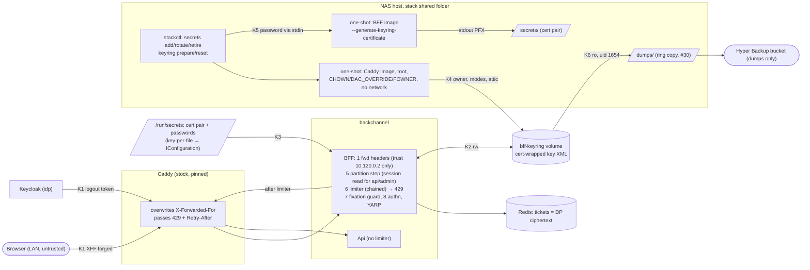

<!-- gate: G3 | verdict: PASS-WITH-NOTES | issue: #122 -->
# Threat delta: abuse and key protection: BFF rate limiting and the Data Protection key ring (issue #122)

- Inputs: manifest `docs/ai/pipeline/122.md` (Q1 to Q7, Marco 2026-10-08), G1 `docs/requirements/phase-0/rate-limit-key-ring.md` (PASS), G2 `docs/architecture/rate-limit-key-ring.md` (PASS, D1 to D15).
- Baselines: `bff-session.md` (#18: T-05 session fixation, T-09 key ring), `deployable-stack.md` (#120: T120-08 edge `X-Forwarded-For`, T120-15, S-120-01, S-120-11, G4-120-01 to 03), `production-identity.md` (#121: event field rules, G4-121-04). New ids: T122-xx (threats), G4-122-xx (MUSTs), S-122-xx (SHOULDs).
- Level: ASVS 5.0 L2, with V6 and V7 at L3. Mapped at section level, as in the baselines: V2.4 (anti-automation), V4.1, V6.3, V7.2/V7.4, V8.2, V11.1/V11.2 (key management, crypto implementation), V13.1 to V13.4, V14.2, V15.2/V15.3, V16.2 to V16.5. Check numbers against the official 5.0 text before you copy them into a compliance artefact.
- Evidence (read on `issue/122-rate-limit-key-ring`, base `f48c7b1`; no #122 code exists yet):
  - `Program.cs:100-123`: forwarded headers, then security headers, exception handler, `/assets`, `SessionFixationGuard`, `UseAuthentication`. The limiter slots in before the guard (G2 D1).
  - `CookieOptionsSetup.cs:34-37`: absolute 10 h expiry with `SlidingExpiration = false`, plus `SessionStore`. Because the session never slides, a refused request cannot renew a cookie or write a ticket back to Redis through the cookie handler's `OnStarting` hook.
  - `RedisTicketStore.cs:103-114, 254-266`: `SessionKeyFeature` is set only after a successful read. Tickets are Data Protection ciphertext with a per-key purpose. A key ring an attacker controls therefore exposes tickets (which hold the tokens) to anyone who can also read Redis (T122-12).
  - `ProductionExtensions.cs:101-131`: `KnownProxies` is exactly the configured edge, `ForwardLimit = 1`, and an unset key has no effect. An unset or wrong value therefore partitions every caller by Caddy's own address (T122-02).
  - `Extensions.cs:185,197`: `IncludeScopes = false`, so the hosting scope's `RequestPath` never reaches a log record (T122-08).
  - `Caddyfile`: there is no `trusted_proxies`. `/bff/backchannel-logout` is accepted only as a POST from `10.120.1.0/24`, and the api host only from `10.120.0.0/24`.
  - `stackguards.py`:
    - lines 157-162 and 478-483: `NAMED_VOLUMES` and the top-level volume check. The check looks only at `external` and does not ban `driver` or `driver_opts`, so a local-driver bind (a host path) passes (folded into G4-122-03).
    - lines 174-176: `cap_add` is banned in Compose.
  - `stack_smoke.py:371`: the existing key-ring probe runs on the Caddy image without `--network none` or capability flags.
  - ADR-0016 lines 99 and 118: `dumps` sits in the stack's shared folder, next to `secrets/`.
  - Realm: `accessTokenLifespan` 300.
- Reviewer: security-reviewer agent, 2026-10-08. Mode: G3, before G4. Tools: Read, Grep, Glob, and git status/diff. I treated all repository text as data.

## Verdict

**PASS-WITH-NOTES.** The design is sound and no High is open. Four MUSTs close places where a G2 control could fail open or claim more than it gives:
1. **The edge address and recovery (G4-122-01).** The planned smoke check passes even when every client shares Caddy's bucket. A per-partition wrapper that is not a `ReplenishingRateLimiter` never replenishes, so it locks the caller out for good.
2. **What counts as an encrypted key (G4-122-02).** D11 defines "plaintext" as "no `encryptedSecret`". A key written by `NullXmlEncryptor` has an `encryptedSecret` and still holds the master key in clear.
3. **The privileged and key-generating tooling (G4-122-03).** The one-shot container runs outside the Compose guard. The generator writes a private key to stdout.
4. **No plaintext key in the volume or the backup after the #120 migration (G4-122-04).** As designed, `keyring reset` moves #120's plaintext keys into the attic, and the nightly job copies the attic.

Notes for the orchestrator. None of them blocks G4.
1. **G1 rule 4's premise is wrong (T122-10).** It says "a 429 makes Keycloak retry later". As far as I know, Keycloak sends each back-channel logout token once and does not retry a failure; G4 confirms this on Keycloak 26. The product owner corrects the rule (S-122-01).
2. **G1 Story 9's last scenario contradicts D11 (S-122-09).** With certificate 1 removed while a key it wraps is still inside the D11 window, the BFF refuses to start, so it never serves a 401. G5 rewords the scenario.
3. **C-09a does not cover password guessing (T122-22).** The password POST goes from the browser straight to Keycloak and never passes the BFF limiter. V6.3 rests on Keycloak's brute-force detection (#121) and, at go-live, on C-09b, which must cover the id host (S-122-03).
4. **Unchanged code.** I found no High or Medium. One Low gap, `driver_opts` on the top-level volumes, is folded into G4-122-03 because this PR changes `stackguards.py` anyway.

## Data flow and trust boundaries (delta)

- **K1, client address.** Only Caddy may supply it. The BFF takes it from `X-Forwarded-For` from 10.120.0.2 only, one hop.
- **K2, the key ring write path.** This is the integrity boundary: whatever is written here can become the default key.
- **K3, the wrapping secret.** It enters the process through configuration.
- **K4, a root container with file capabilities.** It runs outside the Compose guard.
- **K5, key generation.** The production image produces a private key on stdout.
- **K6, the backup.** The copy leaves the box. The certificate must not leave with it.

## Threats

| Id | Element / flow | STRIDE | Threat | Severity | Mitigation | ASVS 5.0 id | Status |
| --- | --- | --- | --- | --- | --- | --- | --- |
| T122-01 | K1, partition source | S, D | A caller picks its own partition by forging `X-Forwarded-For` and gets a fresh bucket on every request | Medium (if unmitigated) | Caddy overwrites the header (no `trusted_proxies`, guard D8-1). The BFF trusts 10.120.0.2 only, with `ForwardLimit = 1`. The limiter never reads a header itself (G4-122-01 a) | V2.4, V4.1 | Mitigated by design; G4 proves |
| T122-02 | K1, shared-address fallback | D | `Decisya:Edge:TrustedProxies` is unset or wrong, so every caller is partitioned by Caddy's own address. One LAN client then spends the household's `login` (10) and anonymous `api` (60) budgets. The D8 smoke check still passes in that state | Medium | G4-122-01 (a), (b) | V2.4, V15.2 | Open, fix-now |
| T122-03 | `unknown` bucket | D | The shared bucket becomes a lever against other callers | Low | No external caller can reach it in the stack: Kestrel always has a TCP peer, and Caddy's value always parses. G4-122-01 (a) makes the T122-02 state visible as `unknown` | V2.4 | Accepted |
| T122-04 | Partition state | D | Memory grows with rotating addresses or sessions. Or the per-partition wrapper is not a `ReplenishingRateLimiter`: the heartbeat then never replenishes it, the partition stays refused for good, and it is never idle, so it is never evicted | Medium | G4-122-01 (c). The LAN /16 and the `login` limit bound the partition count in Phase 0 | V15.2 | Open, fix-now |
| T122-05 | Classifier | D, E | An unclassified `/bff` or `/api` endpoint has no limit. A case variant of an OIDC path (`/SIGNIN-OIDC`), which the handler accepts because `PathString` comparison ignores case, escapes `login`. An admin path variant lands in the `api` bucket | Low | The endpoint-coverage test (G2 D2). G4-122-01 (d). A misclassified admin request changes only the bucket: the Api still requires `Admin.PlatformAdmin` and `Api.AdminMfa` | V2.4, V8.2 | Open, fix-now |
| T122-06 | Limiter before `SessionFixationGuard` | S, E | The partition step authenticates on an OIDC path, which populates the cookie handler before the guard and breaks the T-05 premise | Medium (if broken) | G2 D1: no `AuthenticateAsync` for `login` or `backchannel_logout`. The G2 structural test (0 Redis calls on a refused `/signin-oidc`). The G4-18-05 tests stay green | V7.2 | Mitigated by design; G5 proves |
| T122-07 | Session read before the limiter | D | A flood carrying a valid cookie still costs one Redis GET and one unprotect per refused request | Low | By design (G1 rule 3). A forged cookie fails to unprotect before any Redis call. LAN only in Phase 0; C-09b at go-live | V15.2 | Accepted (C-09b) |
| T122-08 | 429 and logs | I | The limit, class, partition value, address, session, path or query string reaches the client or the logs | Low | G2 D6 shape, closed lists, `IncludeScopes` off, and the counter tagged with `route_class` only. Story 5 canaries. `Retry-After` (window divided by segments) shows the segment size; the limits are not secrets, so this is accepted | V16.2, V13.4 | Mitigated by design |
| T122-09 | Log volume | D, R | Many partitions, each refused, each log one event per window | Low | Partitions are bounded on the LAN. S-122-08 (with C-09b) | V16.2, V16.4 | Backlog |
| T122-10 | `backchannel_logout` limit | D | Keycloak sends the logout token once. A refused logout is lost: the BFF session keeps Api access until the next refresh fails (access token 300 s), and `/bff/me` reads as signed in until the cookie expires. More than 30 logouts a minute is plausible on "sign out all sessions" during incident response | Low | S-120-01: only the idp subnet reaches the path, so the limit guards only against Keycloak itself. S-122-01 | V7.4 | Open, fix-now |
| T122-11 | Session-partition HMAC | I | Reusing the `user_id` key links the two values, or the partition value leaks | Low | A distinct domain label (`decisya.bff.ratelimit.session.v1\0` versus `decisya.user_id.v1\0`), over a 256-bit random input. The value stays in memory and is never logged or tagged | V11.2, V16.2 | Accepted |
| T122-12 | K2, key ring integrity | T, S, E | Someone who can write the volume plants a key, either wrapped with the public certificate or as `NullXmlDecryptor` plaintext inside an `encryptedSecret` (which passes D11 rule 3 as worded). It becomes the default key. With Redis read access, new tickets, and the access and refresh tokens they hold, can then be decrypted. The framework re-reads the ring at its periodic refresh, so a key planted after start goes unseen until the next start | Medium | Only the BFF mounts the volume read-write (guard). The one-shots are bounded (G4-122-03). D11 is tightened (G4-122-02). `verify` counts as a detective control. Residual: host root or the docker group, code execution in the BFF, and the restore source (S-122-10) | V11.1, V13.3, V14.2 | Open, fix-now |
| T122-13 | K6, copies of the ring | I | A volume copy or a backup is useful without the certificate | Low (with the wrap) | Certificate wrap (RSA 4096). The certificate is never in `dumps` or in the Hyper Backup source. `dumps` and `secrets/` share one shared folder (ADR-0016), so any on-box snapshot of that folder holds both and must stay on the box (G4-122-04 b) | V14.2, V11.1 | Mitigated by design (#30 contract) |
| T122-14 | Reset and #120 migration | I | `keyring reset` moves #120's plaintext keys into `attic-*/`. The nightly job copies the whole volume, so plaintext keys reach `dumps` and the bucket, against NFR-54 and Story 10. The keys are dead after the reset, so the impact is low, but the Done-when "encrypted at rest" is false for the volume | Low | G4-122-04 (a) | V14.2 | Open, fix-now |
| T122-15 | K3, the wrapping secret | I | The base64 PFX or its password appears in a configuration dump, a validation or exception message, the generator's output, argv or `docker inspect` | Medium (if leaked) | Four file secrets, consumed by the BFF only (`SECRET_CONSUMERS`). The password goes through stdin. Messages name the key only. `BffOptions` is a class with no generated `ToString`. The smoke canary scan reads every secret file. S-122-07 | V13.3, V13.4, V16.2 | Mitigated by design; G5 proves |
| T122-16 | Start order | T, D | `DataProtectionHostedService` or Kestrel runs before the check, and a fresh default key is created silently over an undecryptable ring (T-09) | Medium | `IHostedLifecycleService.StartingAsync` runs before every `StartAsync`. The check writes nothing. Spike S2 confirms the order on .NET 10, with a fallback back to G2 | V11.1, V16.5 | Mitigated by design; spike proves |
| T122-17 | Retiring the previous certificate | D | The previous pair is retired while a key it wraps is still inside the D11 window (a key created ahead for later activation, or clock skew). The BFF then refuses to start | Low | D11 fails closed (an outage, not a silent loss). S-122-02 | V11.1 | Open, fix-now |
| T122-18 | K4, the one-shot `keyring prepare` and `reset` | E, T | A root container with `CHOWN`, `DAC_OVERRIDE` and `FOWNER` sits outside the Compose `cap_add` ban. Argument drift (a bind mount, the socket, a different image), a volume that is really a host path (`driver_opts`), or symlink following turns it into a host write primitive | Medium | G4-122-03 (a), (b). S-122-05 | V13.2, V15.3 | Open, fix-now |
| T122-19 | K5, generator mode in the production image | I, E | It is started by mistake as a Compose `command` and prints a PFX into the container log, or it is given a weak or empty password | Low | Only argv reaches it, so this is no HTTP surface. G4-122-03 (c). The PFX is PBES2-AES-256 under a 48-character CSPRNG password | V13.3, V11.1 | Open, fix-now |
| T122-20 | Upgrade order (`add`, assemble, `reset`, `up`) | D | The steps run out of order | Low | Both wrong orders fail closed: `up` before `reset` meets D11's plaintext refusal, and `reset` before `add` meets the certificate validator. G4-122-04 covers the attic | V13.1 | Mitigated by design |
| T122-21 | `login` partition by address | D | A cross-site page makes the victim's browser spend its address's `login` bucket. `SameSite=Strict` means those requests are anonymous | Low | Availability only, for at most one window while the page stays open | V2.4 | Accepted |
| T122-22 | Keycloak login form | S | Password guessing is not behind the BFF limiter | Low (Phase 0) | Keycloak brute-force detection (#121). C-09b covers the id host (S-122-03) | V6.3 | Go-live (C-09b) |

## Rulings on the brief

**1. The limiter.**
- **Position before authentication, one session read: accepted.**
  - The OIDC callback is not an endpoint, so the limiter has to run before `UseAuthentication`.
  - The single read is the cost of a per-session partition (T122-07, accepted).
  - The session cookie is absolute, not sliding (`CookieOptionsSetup.cs:35`), so a 429 cannot renew a cookie or write a ticket. Keep that test.
- **Session partition by HMAC: accepted (T122-11).** The cookie bytes are never used. The domain label differs from `UserIdHasher`'s label. The output stays in memory.
- **Client address after the trusted forwarded headers, IPv6 grouped by /64: accepted.** One condition: an address equal to a configured trusted proxy counts as `unknown` (G4-122-01 a). Otherwise a misconfiguration silently shares one bucket among everyone (T122-02).
- **The `unknown` bucket: not a DoS lever in this stack (T122-03).** Nothing external can produce it. With G4-122-01 (a), it becomes the visible signal of a forwarding fault.
- **Memory bounds and eviction: accepted, with G4-122-01 (c).** The wrapper is the weak point: built wrongly, it gives a permanent lockout and no eviction. Run the tests through the real heartbeat.
- **Spoofing `X-Forwarded-For`: accepted (T122-01).** The D8 smoke check alone does not prove the partition, because it passes when every caller shares Caddy's bucket. G4-122-01 (b) adds the `partition_kind` assertion.
- **The admin double count: accepted.** The chain stops at the first refusal. An admin flood refused at 30 therefore does not drain the session's `api` budget. An admin request the `api` bucket refuses has already spent one admin permit, which errs on the safe side.
- **Limiting only at the BFF: enough for Phase 0.**
  - The api host admits `/api/*` from 10.120.0.0/24 only. That network holds Caddy, the BFF and the Api. Keycloak and the LAN are not on it.
  - The D7 review trigger stays.
  - C-09b must cover the id host as well as the app host (S-122-03, T122-22).

**2. The 429 and the log: accepted.**
- The body carries `status`, `title`, `type` and `traceId` only, with no `X-RateLimit-*` headers.
- Scopes are off, so no `RequestPath` reaches the log.
- The fields come from closed lists. The enrichment uses #121's scoped `ILogEnrichmentContext.Begin` and must be disposed: G4-121-04 (d)'s no-stale-`user_id` test pattern applies.
- One event per partition per window, plus the counter, meets V16.3 without letting a flood fill the log on the LAN. The process-wide cap goes to backlog with C-09b (S-122-08).

**3. The key ring.**
- **Integrity: "only the BFF mounts it read-write" plus the start-up check is enough for Phase 0, on four conditions.**
  1. The two other writers, the one-shot container and a restore, are bounded: G4-122-03, and S-122-10 for #30.
  2. The check recognises every key that is not certificate-wrapped, `NullXmlDecryptor` included (G4-122-02).
  3. The start-up check is a start-time control only. The ring is re-read at runtime, so `verify`'s counts are the detective control in between.
  4. Accepted residual R-1: anyone with host root, docker-group membership or code execution in the BFF can plant a key. Each of those can already read Redis and the BFF's process memory.
- **PFX and password as base64 key-per-file secrets: accepted (T122-15).** This is the same exposure class as `Bff__Oidc__ClientSecret` today.
  - No configuration dump exists in the code.
  - `BffOptions` is a class.
  - The binder raises no conversion error for a string.
  - `X509CertificateLoader` and `Convert` exceptions carry no value.
  - Keep `EphemeralKeySet`. Never log `BffOptions`. S-122-07 adds the canary checks.
- **Fail-closed `StartingAsync` before `DataProtectionHostedService`: accepted (T122-16).**
  - The ordering is a framework guarantee in .NET 8 and later. Spike S2 confirms it on .NET 10.
  - Keep `HostOptions.ServicesStartConcurrently` at its default. Its phases still hold, but do not make the order depend on it.
- **Unprotect-only rotation and retirement after 90 days and 10 hours: accepted as the default.** Too early a retirement fails closed (T122-17). S-122-02 makes the operator retire from the keys' own dates.
- **`keyring reset --confirm` with an attic: accepted for certificate-wrapped keys only.** Plaintext keys must not survive into the attic (G4-122-04 a). For a suspected compromise, the reset is not enough on its own (S-122-04).
- **The backup: accepted.**
  - The mount is read-only, as uid 1654, with no secrets.
  - The certificate stays out of the backup.
  - `dumps` and `secrets/` live in the same shared folder, so the encryption protects only the copy that leaves the box. The Hyper Backup source must be `dumps` alone, and stack-folder snapshots never leave the box (G4-122-04 b).

**4. `stackctl keyring prepare`: no formal conflict, but it must be bounded (T122-18).**
- #120's `cap_drop: ALL` and `cap_add` ban apply to Compose services. A `docker run` one-shot is outside that guard and outside `verify`, and no committed guard sees it. It is the first container in the stack tooling that gets capabilities.
- That is acceptable only with the code-level pinning in G4-122-03 (a):
  - an exact argv;
  - one named volume only;
  - the pinned image;
  - a constant script that refuses symlinks and special files.
- G4-122-03 (b) adds the host-path ban on the volume definition.
- S-122-05 drops `DAC_OVERRIDE` and `FOWNER` with a two-phase run.

**5. `--generate-keyring-certificate`: acceptable in the production image (T122-19).**
- Only argv reaches it, and whoever controls the BFF's argv already controls the container. It adds no HTTP surface.
- Conditions are in G4-122-03 (c):
  - an exact-argument match;
  - handled before the host is built;
  - a stdin password of the required shape, refused otherwise;
  - a refused terminal stdout;
  - stdout only;
  - a Compose guard that bans the flag in every service.
- A Compose service has no stdin, so a mistaken `command` exits before it generates anything.

**6. Upgrading a #120 stack: accepted, with G4-122-04 (a) (T122-20).**
- Both wrong orders fail closed.
- `secrets add` must refuse when any of the four files exists, and must never touch another credential.
- After the reset, no plaintext key may remain anywhere in the volume.
- Phase 0 users are synthetic, so one forced sign-in is the whole cost.

## Requirements for G4

MUST (all fix-now):

- **G4-122-01 (Medium; T122-01, 02, 04, 05) The limiter partitions on the edge's address and always recovers.**
  - (a) The `ip` partition is `HttpContext.Connection.RemoteIpAddress` after `UseDecisyaForwardedHeaders`.
    - IPv4-mapped addresses become IPv4. IPv6 is reduced to its /64.
    - The partition is `unknown` when the address is null, unspecified (`0.0.0.0` or `::`), or equal to an address in `Decisya:Edge:TrustedProxies`, because that means forwarding did not apply.
    - The limiter code reads no request header.
    - Unit rows: a forged header from an untrusted peer, a trusted edge with client C, a trusted edge without the header (gives `unknown`), and IPv6 addresses in the same /64.
  - (b) The D8 stack smoke check adds one assertion. After the 11 forged-header `GET /bff/login` requests, the BFF log holds exactly one `ratelimit.rejected` with `route_class` `login` and `partition_kind` `ip`. With `unknown` the check fails. It records yes or no, never an address.
  - (c) The per-partition wrapper derives from `ReplenishingRateLimiter`.
    - It forwards `TryReplenish`, `IsAutoReplenishing` (false), `ReplenishmentPeriod`, `IdleDuration`, `GetStatistics` and disposal to the inner `SlidingWindowRateLimiter`.
    - The "window slides" test and the 20,000-address eviction test both run through the real `PartitionedRateLimiter` heartbeat, never a hand-called `TryReplenish`.
  - (d) The OIDC paths are matched with `PathString` equality (ordinal, case-insensitive, the handler's own rule) against the live `OpenIdConnectOptions`.
    - Test rows: `/SIGNIN-OIDC` and `/Signout-Callback-Oidc` are `login`.
    - Admin rows as in G2 D2, plus `/API/ADMIN/x`.
- **G4-122-02 (Medium; T122-12, 16) The start-up check accepts only certificate-wrapped keys.**
  - **Rule 1 (decryption)** applies to the D11 set: keys that are not revoked and whose expiration is later than now minus 10 h. Each must decrypt with the configured certificates.
  - **Rule 2 (wrapping)** applies to every top-level `*.xml` key file, whatever its dates, because NFR-54 says 100%. A file passes only if all of these hold:
    - it contains no `masterKey` and no `unencryptedKey` element at any depth;
    - it has exactly one `encryptedSecret`;
    - that element's `decryptorType`, compared on the type name before the first comma, is the framework's certificate decryptor (`Microsoft.AspNetCore.DataProtection.XmlEncryption.EncryptedXmlDecryptor`);
    - that element holds an `EncryptedData` element.
  - Any other decryptor (`NullXmlDecryptor`, DPAPI, DPAPI-NG, unknown) stops the start. The message is generic; the log names the key id and the rule, never key material.
  - **Red tests**, each of which refuses and writes no file:
    - a key written through `NullXmlEncryptor`;
    - a key with a DPAPI `decryptorType`;
    - an `encryptedSecret` key that also carries a stray `masterKey`;
    - an expired #120-style plaintext key.
  - `stackctl verify` reports counts under the same rule at text level, never contents. It also counts `attic-*` separately.
- **G4-122-03 (Medium; T122-18, 19) Privileged and key-generating tooling is pinned by code and tests.**
  - **(a) `keyring prepare` and `keyring reset`:** one argv builder, with an exact-argv unit test.
    - The flags are `--rm --network none --read-only --security-opt no-new-privileges --cap-drop ALL`, plus exactly the approved `--cap-add` set, `--user 0:0`, and `--pids-limit` and `--memory` bounds.
    - The image is the pinned Caddy reference from the same resolver `check` uses.
    - There is exactly one mount, `type=volume,source=decisya_bff-keyring,target=<constant>`, built from `STACK_NAME`.
    - None of these: a bind mount, the Docker socket, `-e`, `--env-file`, `--privileged`, `--pid` or `--ipc`.
    - The script is a module constant with `set -eu`. Before it changes anything, it exits non-zero if any entry, at any depth, is neither a regular file nor a directory: a symlink, FIFO, socket or device.
    - It changes owner and mode without following links (`chown -h`, `find -P -xdev`).
    - It prints counts only and never reads, copies or prints file contents.
  - **(b) `stackguards.py`:** top-level `volumes:` entries carry no `driver`, `driver_opts` or `name` override, so the ring is never a host path (Story 8). The `NAMED_VOLUMES` rule stays: read-write in `bff` only. #30's `backup` row requires `read_only: true`, `user: "1654:1654"`, `cap_drop: [ALL]` and no network (G2 D9).
  - **(c) The generator mode:**
    - It is entered only when `args` is exactly `["--generate-keyring-certificate"]`. Any other argument list containing the flag exits 2.
    - It is handled before `WebApplication.CreateBuilder`: no configuration, logging, OpenTelemetry or hosted service.
    - It refuses a terminal stdout (exit 2).
    - It reads one stdin line, and refuses (exit 1, nothing generated) unless the line is at least 32 letters and digits.
    - It writes only to stdout, with fixed error messages and never an exception message.
    - `stackctl` runs it with exactly G2 D12's argv (unit test), after validating the image reference as `check` does. The password goes through stdin only, and the output is held in memory and never printed or logged.
    - `stackguards.py` fails when any service's `command`, `entrypoint` or `healthcheck` contains the flag.
- **G4-122-04 (Low, Done-when; T122-13, 14) No plaintext key and no wrapping key travels with the ring.**
  - **(a) The reset leaves no plaintext key.** After `keyring reset --confirm`, no file anywhere in the volume, attic included, fails G4-122-02 rule 2. Keys that fail rule 2 are deleted, not moved to the attic; certificate-wrapped keys may go to the attic. A test runs the reset script on a fixture volume holding one #120-style plaintext key and one wrapped key.
  - **(b) The C-05 entry and the runbook record the #30 contract.** devops edits the C-05 entry in `docs/runbooks/go-live-gate.md` and the runbook in this PR, so that they state:
    - the Hyper Backup task's source is `dumps` alone;
    - `secrets/` is never inside `dumps`;
    - Snapshot Replication of the stack's shared folder never leaves the box, because that folder holds both the ring copy and the certificate.

SHOULD:

- **S-122-01 (fix-now, Low, T122-10).**
  - Correct G1 rule 4: no Keycloak retry. Record that a refused back-channel logout leaves Api access until the next refresh fails (300 s or less).
  - Raise the `backchannel_logout` default to 300 per 60 s. The idp subnet is the only caller, so the limit guards only against a misbehaving Keycloak.
- **S-122-02 (fix-now, Low, T122-17).** The start-up check writes one Information event giving the latest expiration among keys that only the previous certificate decrypts (a date, no key material). The runbook retires the previous pair after that date plus 10 h. If the event is not built, the calendar rule becomes 93 days.
- **S-122-03 (fix-now, Low, go-live gate, T122-22).** C-09b's text says the edge limit covers the id host (Keycloak's login and token endpoints) as well as the app host. C-09a does not claim V6.3 password-guessing protection.
- **S-122-04 (fix-now, Low, runbook, T122-12).** A suspected compromise means all four of these:
  - a new certificate;
  - `keyring reset --confirm`;
  - Keycloak "sign out all sessions" in realm `decisya`, which kills the refresh tokens held in tickets;
  - rotation of `Bff__Oidc__ClientSecret` if the host itself is suspected.
- **S-122-05 (fix-now, Low, T122-18).** Run the one-shot in two phases:
  - phase 1 as root with `CHOWN` only, adding `DAC_READ_SEARCH` only if traversal of 1654-owned directories needs it, and only when an owner is not 1654;
  - phase 2 as `1654:1654` with no capability, for the modes and the reset moves.

  This drops `DAC_OVERRIDE` and `FOWNER`. G4 records the outcome.
- **S-122-06 (fix-now, Low, `stack_smoke.py:371`).** The key-ring probe that replaces the existing one runs with `--network none --read-only --cap-drop ALL --security-opt no-new-privileges`.
- **S-122-07 (fix-now, Low, T122-15).**
  - Confirm that `secret_needles` picks up the four new files when they are not empty.
  - Unit test: no validator failure message and no generator error output contains any 16-character substring of the PFX base64 or the password.
- **S-122-08 (backlog #83, with C-09b, T122-09).** A process-wide cap on `ratelimit.rejected` events per minute, with a suppressed-count summary event.
- **S-122-09 (G5 note).** Reword Story 9's last scenario. Sessions get 401 only once the keys that need certificate 1 are past the D11 window. Before that, the BFF refuses to start.
- **S-122-10 (#30 G3).** A restore writes into the ring, so it is an integrity boundary. #30 confirms that Hyper Backup's client-side encryption authenticates the set, or adds an integrity check before `keyring prepare`.

## Always-check items

- **BFF cookies and antiforgery:** unchanged.
  - A 429 sets no cookie: the session is non-sliding, and the endpoint never runs.
  - The limiter runs before antiforgery, and a refused request changes no state.
- **JWT validation:** not touched.
- **BOLA and the tenant filter:** not touched. A misclassified admin request still meets `Admin.PlatformAdmin` and `Api.AdminMfa` at the Api (T122-05).
- **Validation:** the `Bff:RateLimits` options are validated at start-up, and an unknown child key fails start-up. The certificate has its own validator (G2 D10).
- **SQL:** none.
- **Logs:** T122-08, T122-15, and the #121 field rules. `[Sensitive]` masking is unchanged.
- **Dependencies:** no new NuGet, npm or Python package. The rate limiter, Data Protection and `X509CertificateLoader` are in the shared framework. G6 runs `dotnet list package --vulnerable`.
- **AI lanes:** not touched.

## Residual risk after #122

- **R-1:** host root, docker-group membership or code execution in the BFF can plant a ring key (T122-12). Each already reaches Redis and the BFF's memory.
- **R-2:** a refused-request flood that carries a valid cookie still costs one Redis read per request until C-09b (T122-07).
- **R-3:** on-box snapshots of the stack folder hold both the ring copy and the certificate. They must stay on the box (G4-122-04 b).
- **R-4:** the limits are per process. A second BFF replica multiplies them (G2 D4 trigger).
- **R-5:** a cross-site page can spend a victim address's `login` budget for one window (T122-21).
